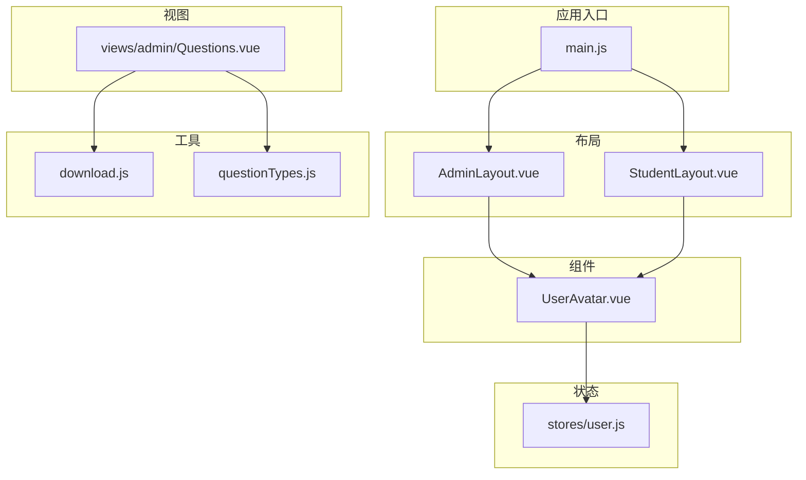
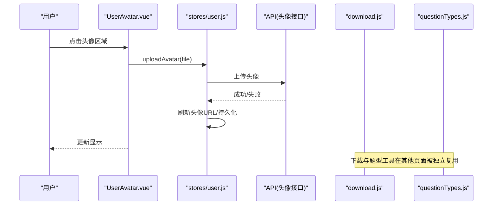
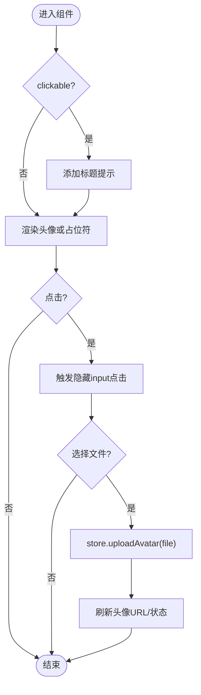
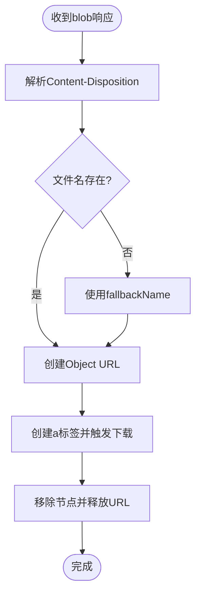
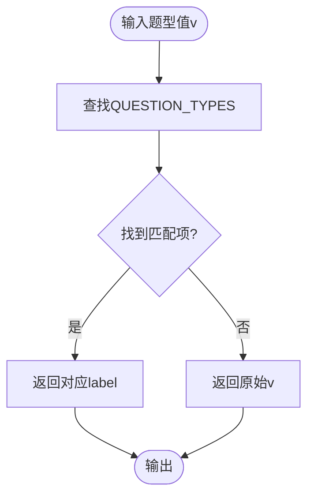
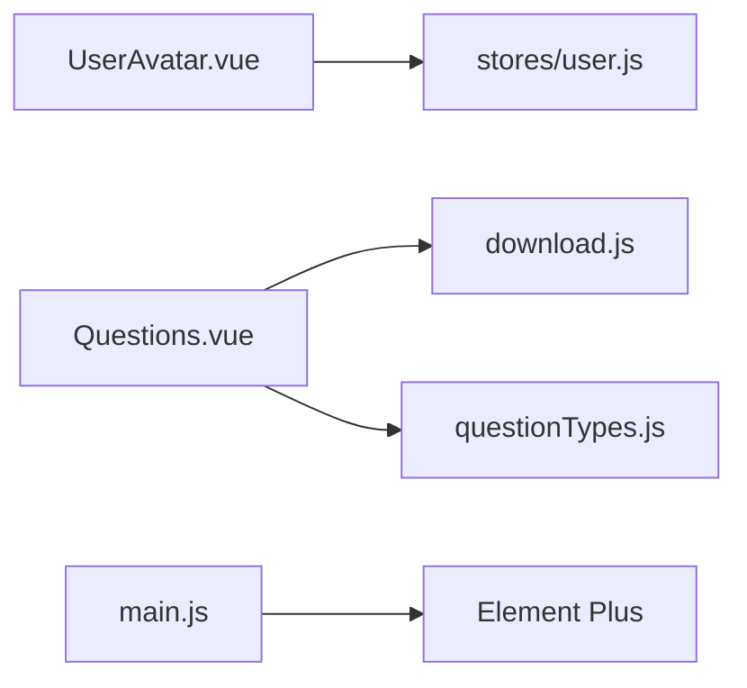

# 公共组件库

<cite>
**本文引用的文件**
- [UserAvatar.vue](file://exam-web/src/components/UserAvatar.vue)
- [download.js](file://exam-web/src/utils/download.js)
- [questionTypes.js](file://exam-web/src/utils/questionTypes.js)
- [user.js](file://exam-web/src/stores/user.js)
- [AdminLayout.vue](file://exam-web/src/layouts/AdminLayout.vue)
- [StudentLayout.vue](file://exam-web/src/layouts/StudentLayout.vue)
- [Questions.vue](file://exam-web/src/views/admin/Questions.vue)
- [main.js](file://exam-web/src/main.js)
- [package.json](file://exam-web/package.json)
</cite>

## 目录
1. [简介](#简介)
2. [项目结构](#项目结构)
3. [核心组件与工具](#核心组件与工具)
4. [架构总览](#架构总览)
5. [详细组件分析](#详细组件分析)
6. [依赖关系分析](#依赖关系分析)
7. [性能与可访问性](#性能与可访问性)
8. [故障排查指南](#故障排查指南)
9. [结论](#结论)
10. [附录：使用示例与最佳实践](#附录使用示例与最佳实践)

## 简介
本公共组件库聚焦于前端可复用能力，包含：
- UserAvatar 头像组件：支持尺寸、点击上传、占位符显示、主题色与响应式适配。
- 下载工具函数：统一处理 Blob 文件下载、文件名解析与安全化、错误信息提取。
- 题目类型工具：集中题型常量与分类判断，保证前后端题型一致性与页面展示一致性。

这些能力在管理端与学生端布局、题库管理等页面中被广泛复用，确保交互体验一致、代码简洁可维护。

## 项目结构
前端采用 Vue 3 + Vite + Element Plus + Pinia 的轻量架构，公共能力集中在 components 与 utils 目录，状态通过 Pinia 管理，UI 框架提供基础样式与国际化。

图表来源
- [main.js:1-23](file://exam-web/src/main.js#L1-L23)
- [AdminLayout.vue:1-187](file://exam-web/src/layouts/AdminLayout.vue#L1-L187)
- [StudentLayout.vue:1-200](file://exam-web/src/layouts/StudentLayout.vue#L1-L200)
- [UserAvatar.vue:1-54](file://exam-web/src/components/UserAvatar.vue#L1-L54)
- [download.js:1-52](file://exam-web/src/utils/download.js#L1-L52)
- [questionTypes.js:1-11](file://exam-web/src/utils/questionTypes.js#L1-L11)
- [user.js:1-98](file://exam-web/src/stores/user.js#L1-L98)
- [Questions.vue:1-200](file://exam-web/src/views/admin/Questions.vue#L1-L200)

章节来源
- [main.js:1-23](file://exam-web/src/main.js#L1-L23)
- [package.json:1-25](file://exam-web/package.json#L1-L25)

## 核心组件与工具
- UserAvatar 头像组件
  - 功能：根据用户信息渲染头像或首字母占位；可选点击触发本地文件选择并上传；支持多尺寸与主题色。
  - 数据源：Pinia user store（头像 URL、显示名、角色等）。
  - 事件：内部通过 input 元素触发文件选择，调用 store.uploadAvatar 完成上传与刷新。
  - 插槽：当前未暴露插槽；如需扩展内容可在外层包裹自定义容器。
- 下载工具函数
  - downloadBlob：从 axios 的 blob 响应中创建临时链接并触发下载，自动清理对象 URL。
  - safeFileName：清洗非法字符并截断长度，保障文件名安全。
  - blobErrorMessage：当后端返回 JSON 错误时提取 message，便于统一提示。
- 题目类型工具
  - QUESTION_TYPES：题型枚举列表，用于下拉、表格列等展示。
  - typeLabel：将题型值映射为中文标签。
  - isSubjective/isChoice：按题型进行逻辑分支（主观题需阅卷、选择类有选项）。

章节来源
- [UserAvatar.vue:1-54](file://exam-web/src/components/UserAvatar.vue#L1-L54)
- [download.js:1-52](file://exam-web/src/utils/download.js#L1-L52)
- [questionTypes.js:1-11](file://exam-web/src/utils/questionTypes.js#L1-L11)
- [user.js:1-98](file://exam-web/src/stores/user.js#L1-L98)

## 架构总览
头像组件与下载、题型工具共同构成“展示-交互-数据”闭环：
- 头像组件读取 Pinia 中的头像 URL 与显示名，必要时触发上传流程。
- 下载工具封装浏览器下载行为，配合 API 层统一处理错误与文件名。
- 题型工具集中管理题型常量与判断逻辑，供多个页面复用，避免硬编码。

图表来源
- [UserAvatar.vue:1-54](file://exam-web/src/components/UserAvatar.vue#L1-L54)
- [user.js:1-98](file://exam-web/src/stores/user.js#L1-L98)
- [download.js:1-52](file://exam-web/src/utils/download.js#L1-L52)
- [questionTypes.js:1-11](file://exam-web/src/utils/questionTypes.js#L1-L11)

## 详细组件分析

### UserAvatar 头像组件
- Props 接口
  - size：字符串，控制尺寸（sm/md/lg），影响图片与占位符大小。
  - clickable：布尔，是否允许点击触发文件选择。
- 事件处理
  - 点击触发隐藏 input 的文件选择；change 事件获取 File 后调用 store.uploadAvatar。
- 插槽使用
  - 当前未暴露插槽；可通过外层容器定制布局。
- 样式与主题
  - 圆形头像、背景色、阴影与字体大小随尺寸变化；占位符使用主题蓝底色与白色文字。
  - 可通过 CSS 变量或覆盖 scoped 样式实现主题定制。
- 响应式适配
  - 基于固定尺寸类名（sm/md/lg）在不同屏幕下保持一致比例；结合父容器弹性布局自适应。
- 与状态管理集成
  - 头像 URL 来自 Pinia，首次加载与上传成功后刷新；无头像时显示首字母占位。

图表来源
- [UserAvatar.vue:1-54](file://exam-web/src/components/UserAvatar.vue#L1-L54)
- [user.js:1-98](file://exam-web/src/stores/user.js#L1-L98)

章节来源
- [UserAvatar.vue:1-54](file://exam-web/src/components/UserAvatar.vue#L1-L54)
- [user.js:1-98](file://exam-web/src/stores/user.js#L1-L98)
- [AdminLayout.vue:1-187](file://exam-web/src/layouts/AdminLayout.vue#L1-L187)
- [StudentLayout.vue:1-200](file://exam-web/src/layouts/StudentLayout.vue#L1-L200)

### 下载工具函数（download.js）
- downloadBlob(res, fallbackName)
  - 从响应头解析文件名，优先 UTF-8 扩展格式，其次普通 filename；创建 Object URL 并触发下载，随后释放 URL。
- safeFileName(name, fallback)
  - 过滤非法字符与控制字符，限制最大长度，为空时回退到默认名。
- blobErrorMessage(res)
  - 若响应体为 JSON 错误，解析 message；否则返回空串表示正常文件流。

图表来源
- [download.js:1-52](file://exam-web/src/utils/download.js#L1-L52)

章节来源
- [download.js:1-52](file://exam-web/src/utils/download.js#L1-L52)
- [Questions.vue:1-200](file://exam-web/src/views/admin/Questions.vue#L1-L200)

### 题目类型工具（questionTypes.js）
- QUESTION_TYPES：统一题型枚举，包含单选、多选、判断、填空、简答、关键词解释。
- typeLabel(v)：将题型值转为中文标签，找不到则回退原值。
- isSubjective(v)：判断是否为主观题（简答、关键词解释）。
- isChoice(v)：判断是否为选择类题型（单选、多选、判断）。

图表来源
- [questionTypes.js:1-11](file://exam-web/src/utils/questionTypes.js#L1-L11)

章节来源
- [questionTypes.js:1-11](file://exam-web/src/utils/questionTypes.js#L1-L11)
- [Questions.vue:1-200](file://exam-web/src/views/admin/Questions.vue#L1-L200)

## 依赖关系分析
- 组件与状态
  - UserAvatar 依赖 stores/user.js 提供的头像 URL 与上传方法。
- 工具与视图
  - Questions.vue 依赖 download.js 进行模板下载与 PDF 导出，依赖 questionTypes.js 进行题型展示与逻辑判断。
- 应用初始化
  - main.js 注册全局图标与 Element Plus 中文语言包，确保 UI 一致性。

图表来源
- [UserAvatar.vue:1-54](file://exam-web/src/components/UserAvatar.vue#L1-L54)
- [user.js:1-98](file://exam-web/src/stores/user.js#L1-L98)
- [Questions.vue:1-200](file://exam-web/src/views/admin/Questions.vue#L1-L200)
- [download.js:1-52](file://exam-web/src/utils/download.js#L1-L52)
- [questionTypes.js:1-11](file://exam-web/src/utils/questionTypes.js#L1-L11)
- [main.js:1-23](file://exam-web/src/main.js#L1-L23)

章节来源
- [main.js:1-23](file://exam-web/src/main.js#L1-L23)
- [package.json:1-25](file://exam-web/package.json#L1-L25)

## 性能与可访问性
- 性能
  - 头像 URL 使用 createObjectURL 并在卸载或切换时释放，避免内存泄漏。
  - 下载完成后立即释放 Object URL，减少资源占用。
  - 题型工具为纯函数，计算开销极低。
- 可访问性
  - 头像区域提供 title 提示，增强可理解性。
  - 建议为 img 与按钮补充 aria-label 以提升无障碍体验（可按需扩展）。
- 主题与响应式
  - 通过尺寸类名实现不同规格；颜色与圆角易于通过样式覆盖实现主题化。
  - 在小屏设备上，父容器弹性布局可保证头像与文本对齐与换行。

[本节为通用指导，不直接分析具体文件]

## 故障排查指南
- 头像无法显示
  - 检查 token 是否存在，确认 loadAvatar 是否执行；查看 store 中 avatarUrl 与 avatarLoaded 状态。
  - 若后端返回 JSON 错误，loadAvatar 会清空 URL 并标记已加载。
- 上传失败
  - 文件大小限制：超过 2MB 会提示错误；检查服务端限制与网络状况。
  - 上传成功后需重新拉取头像 URL 以刷新显示。
- 下载文件名异常
  - 检查响应头 Content-Disposition 是否正确；如缺失，将使用 fallbackName。
  - 使用 safeFileName 对文件名进行清洗，避免非法字符。
- 题型显示不一致
  - 确保所有页面统一从 questionTypes.js 导入并使用 typeLabel；避免硬编码字符串。

章节来源
- [user.js:1-98](file://exam-web/src/stores/user.js#L1-L98)
- [download.js:1-52](file://exam-web/src/utils/download.js#L1-L52)
- [questionTypes.js:1-11](file://exam-web/src/utils/questionTypes.js#L1-L11)

## 结论
本公共组件库通过 UserAvatar、下载工具与题型工具，提供了稳定、易用的前端能力：
- 头像组件简化了用户身份展示与头像上传流程，并与状态管理紧密集成。
- 下载工具统一了文件下载与错误处理，提升用户体验与健壮性。
- 题型工具集中管理题型定义与判断，确保全系统一致性。
建议在新增页面时优先复用这些能力，保持风格与交互一致，降低重复开发成本。

[本节为总结性内容，不直接分析具体文件]

## 附录：使用示例与最佳实践
- 头像组件使用
  - 在布局中引入 UserAvatar，设置 size 与 clickable 控制外观与交互。
  - 示例参考：管理端与学生端布局中多处使用头像组件。
- 下载模板与导出 PDF
  - 使用 downloadBlob 接收 blob 响应并触发下载；使用 blobErrorMessage 检测后端错误；使用 safeFileName 生成安全文件名。
  - 示例参考：题库页面的模板下载与 PDF 导出流程。
- 题型展示与逻辑
  - 使用 QUESTION_TYPES 构建下拉选项；使用 typeLabel 显示中文标签；使用 isSubjective/isChoice 控制表单与校验逻辑。
  - 示例参考：题库列表、编辑页、考试答题页等。

章节来源
- [AdminLayout.vue:1-187](file://exam-web/src/layouts/AdminLayout.vue#L1-L187)
- [StudentLayout.vue:1-200](file://exam-web/src/layouts/StudentLayout.vue#L1-L200)
- [Questions.vue:1-200](file://exam-web/src/views/admin/Questions.vue#L1-L200)
- [download.js:1-52](file://exam-web/src/utils/download.js#L1-L52)
- [questionTypes.js:1-11](file://exam-web/src/utils/questionTypes.js#L1-L11)