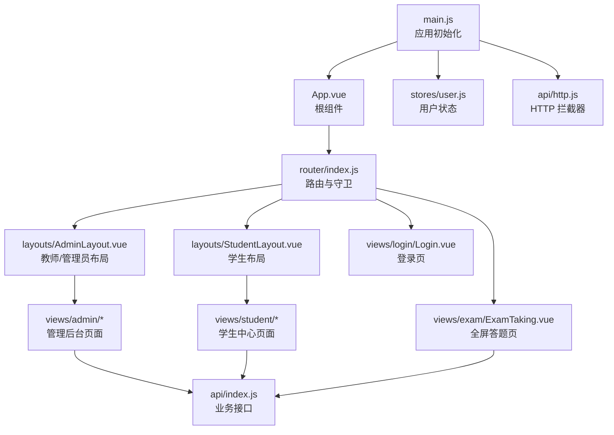
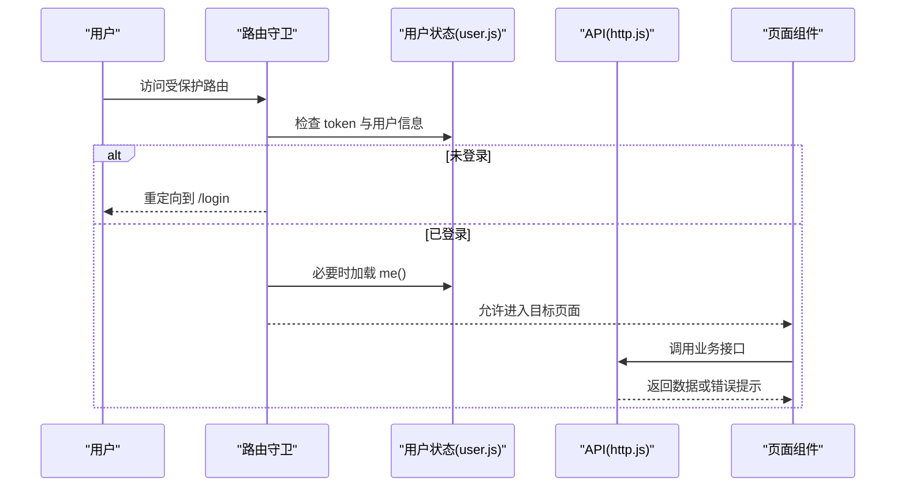
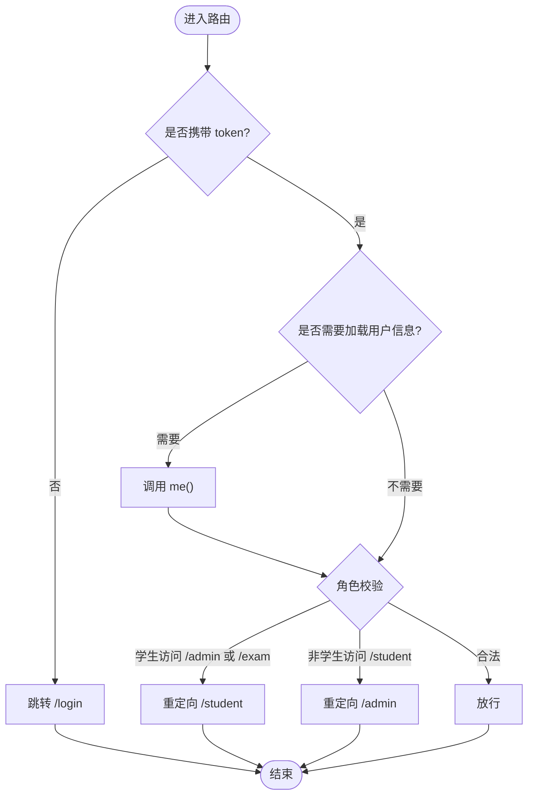
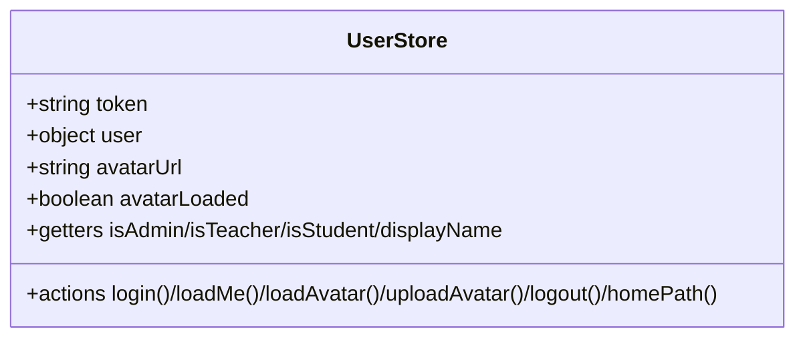
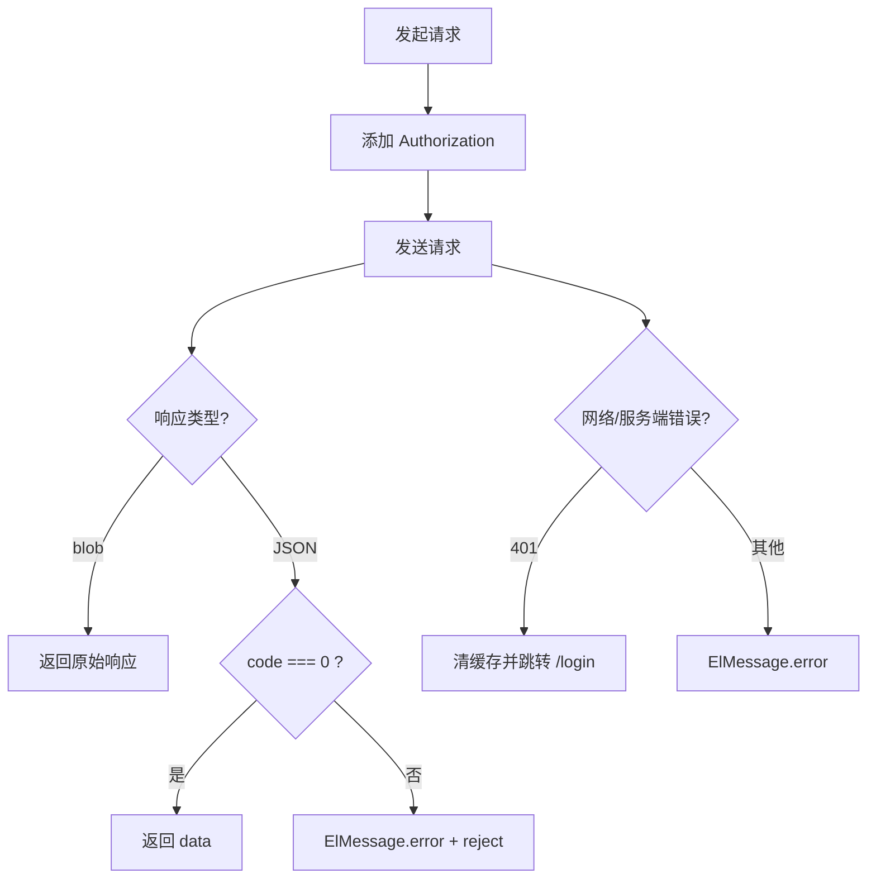
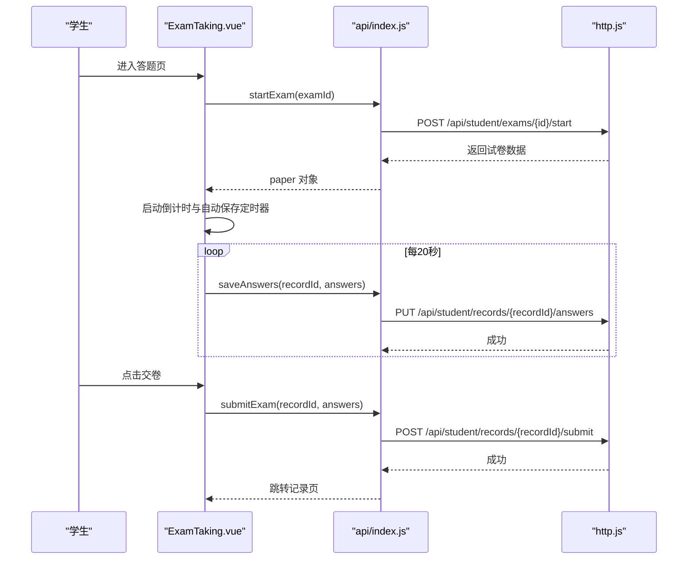
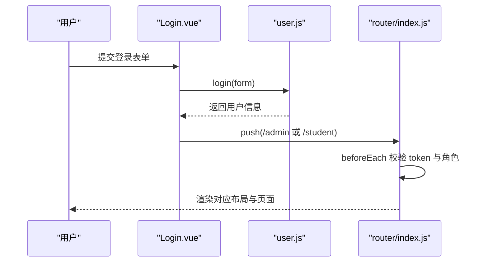
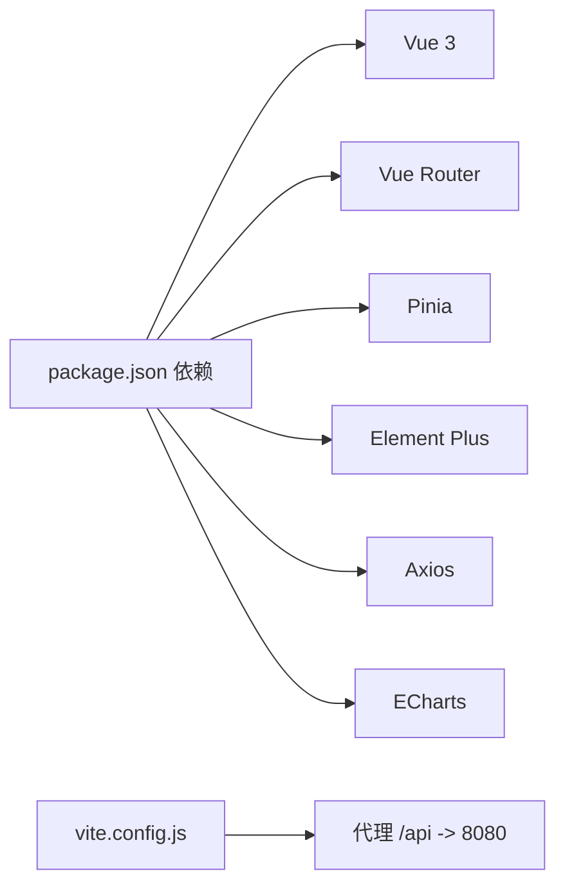

# 前端应用

<cite>
**本文引用的文件**
- [package.json](file://exam-web/package.json)
- [vite.config.js](file://exam-web/vite.config.js)
- [main.js](file://exam-web/src/main.js)
- [App.vue](file://exam-web/src/App.vue)
- [index.js](file://exam-web/src/router/index.js)
- [http.js](file://exam-web/src/api/http.js)
- [index.js](file://exam-web/src/api/index.js)
- [user.js](file://exam-web/src/stores/user.js)
- [AdminLayout.vue](file://exam-web/src/layouts/AdminLayout.vue)
- [StudentLayout.vue](file://exam-web/src/layouts/StudentLayout.vue)
- [Login.vue](file://exam-web/src/views/login/Login.vue)
- [Dashboard.vue](file://exam-web/src/views/admin/Dashboard.vue)
- [Home.vue](file://exam-web/src/views/student/Home.vue)
- [ExamTaking.vue](file://exam-web/src/views/exam/ExamTaking.vue)
- [UserAvatar.vue](file://exam-web/src/components/UserAvatar.vue)
- [styles.css](file://exam-web/src/styles.css)
</cite>

## 目录
1. [简介](#简介)
2. [项目结构](#项目结构)
3. [核心组件](#核心组件)
4. [架构总览](#架构总览)
5. [详细组件分析](#详细组件分析)
6. [依赖关系分析](#依赖关系分析)
7. [性能与体验优化](#性能与体验优化)
8. [故障排查指南](#故障排查指南)
9. [结论](#结论)
10. [附录：样式定制与使用示例](#附录样式定制与使用示例)

## 简介
本文件面向教学考试平台的前端工程，基于 Vue 3 + Vite + Element Plus + Pinia + Vue Router 构建。文档从系统架构、组件职责、状态管理、路由与权限控制、API 封装、错误处理与用户体验等维度进行系统化说明，并给出教师端与学生端的界面布局差异、关键交互流程与样式定制建议，帮助读者快速理解与二次开发。

## 项目结构
前端工程位于 exam-web 目录，采用按“功能域 + 层次”组织的方式：
- 入口与全局配置：main.js、App.vue、vite.config.js、styles.css
- 路由与权限：router/index.js（含前置守卫）
- API 层：api/http.js（统一 axios 实例）、api/index.js（业务接口聚合）
- 状态管理：stores/user.js（登录态、用户信息、头像）
- 布局：layouts/AdminLayout.vue（教师/管理员侧边栏）、layouts/StudentLayout.vue（学生顶部导航）
- 页面视图：views/admin/*、views/student/*、views/exam/*、views/login/*
- 通用组件：components/UserAvatar.vue
- 工具：utils/questionTypes.js（题型标签与主观题判断）

图表来源
- [main.js:1-23](file://exam-web/src/main.js#L1-L23)
- [App.vue:1-4](file://exam-web/src/App.vue#L1-L4)
- [index.js:1-67](file://exam-web/src/router/index.js#L1-L67)
- [AdminLayout.vue:1-187](file://exam-web/src/layouts/AdminLayout.vue#L1-L187)
- [StudentLayout.vue:1-58](file://exam-web/src/layouts/StudentLayout.vue#L1-L58)
- [ExamTaking.vue:1-141](file://exam-web/src/views/exam/ExamTaking.vue#L1-L141)
- [Login.vue:1-91](file://exam-web/src/views/login/Login.vue#L1-L91)
- [user.js:1-98](file://exam-web/src/stores/user.js#L1-L98)
- [http.js:1-47](file://exam-web/src/api/http.js#L1-L47)
- [index.js:1-82](file://exam-web/src/api/index.js#L1-L82)

章节来源
- [package.json:1-25](file://exam-web/package.json#L1-L25)
- [vite.config.js:1-16](file://exam-web/vite.config.js#L1-L16)
- [main.js:1-23](file://exam-web/src/main.js#L1-L23)
- [App.vue:1-4](file://exam-web/src/App.vue#L1-L4)
- [styles.css:1-54](file://exam-web/src/styles.css#L1-L54)

## 核心组件
- 应用启动与插件注册：在 main.js 中创建 Vue 应用，挂载 Pinia、Router、Element Plus（中文语言包），并全局注册图标组件。
- 根组件：App.vue 仅包含 <router-view />，由路由决定渲染内容。
- 布局组件：
  - AdminLayout.vue：左侧菜单 + 顶部用户信息与退出按钮；根据当前路由高亮菜单项；支持角色标签显示。
  - StudentLayout.vue：顶部 Logo、导航链接、用户头像与退出；主内容区居中展示。
- 登录组件：Login.vue 提供用户名/密码输入，调用 store.login 后根据角色跳转至 /admin 或 /student。
- 答题组件：ExamTaking.vue 实现全屏答题、倒计时、自动保存答案、标记题目、提交试卷。
- 头像组件：UserAvatar.vue 支持点击上传头像，读取本地存储的头像 URL，并在无头像时显示首字母占位。

章节来源
- [main.js:1-23](file://exam-web/src/main.js#L1-L23)
- [App.vue:1-4](file://exam-web/src/App.vue#L1-L4)
- [AdminLayout.vue:1-187](file://exam-web/src/layouts/AdminLayout.vue#L1-L187)
- [StudentLayout.vue:1-58](file://exam-web/src/layouts/StudentLayout.vue#L1-L58)
- [Login.vue:1-91](file://exam-web/src/views/login/Login.vue#L1-L91)
- [ExamTaking.vue:1-141](file://exam-web/src/views/exam/ExamTaking.vue#L1-L141)
- [UserAvatar.vue:1-54](file://exam-web/src/components/UserAvatar.vue#L1-L54)

## 架构总览
前端采用分层架构：
- 表现层：Vue 单文件组件（页面、布局、通用组件）
- 路由层：vue-router 负责页面切换与权限守卫
- 状态层：Pinia 管理登录态、用户信息、头像资源
- 网络层：axios 实例封装统一请求头、响应体处理、错误提示与 401 跳转
- 数据层：通过 api/index.js 暴露的业务方法对接后端 RESTful 接口

图表来源
- [index.js:47-64](file://exam-web/src/router/index.js#L47-L64)
- [user.js:39-46](file://exam-web/src/stores/user.js#L39-L46)
- [http.js:10-43](file://exam-web/src/api/http.js#L10-L43)

## 详细组件分析

### 路由与权限控制
- 路由定义：集中声明 /admin、/student、/exam/:id 等路径及懒加载子路由。
- 前置守卫：
  - 未登录访问受保护路由时跳转到 /login
  - 登录后若首次进入，尝试拉取当前用户信息
  - 角色校验：学生禁止访问 /admin 和 /exam；教师/管理员禁止访问 /student
- 首页重定向：/ 重定向到 /login

图表来源
- [index.js:47-64](file://exam-web/src/router/index.js#L47-L64)

章节来源
- [index.js:1-67](file://exam-web/src/router/index.js#L1-L67)

### 状态管理（用户与头像）
- 状态字段：token、user、avatarUrl、avatarLoaded
- 计算属性：isAdmin、isTeacher、isStudent、displayName（优先 realName）
- 动作：
  - login：调用登录接口，持久化 token 与用户信息，并加载头像
  - loadMe：刷新用户信息并更新头像
  - loadAvatar：获取头像 blob，生成临时 URL，设置 hasAvatar
  - uploadAvatar：限制大小、上传成功提示、刷新头像
  - logout：清理本地存储与状态
  - homePath：根据角色返回默认首页

图表来源
- [user.js:1-98](file://exam-web/src/stores/user.js#L1-L98)

章节来源
- [user.js:1-98](file://exam-web/src/stores/user.js#L1-L98)

### HTTP 请求封装与错误处理
- 统一 axios 实例：baseURL、超时时间
- 请求拦截：自动附加 Authorization 头
- 响应拦截：
  - 对 blob 类型直接透传
  - 对后端 Result.code !== 0 的情况统一提示并拒绝 Promise
  - 401 时清除本地凭证并重定向到登录页
  - 其他错误弹出消息提示

图表来源
- [http.js:1-47](file://exam-web/src/api/http.js#L1-L47)

章节来源
- [http.js:1-47](file://exam-web/src/api/http.js#L1-L47)

### 教师端与管理端布局与功能
- 布局：左侧深色侧边栏 + 顶部用户信息与退出按钮
- 菜单：工作台、账号管理（管理员可见）、学生管理、知识点、题库、试卷、考试、阅卷、成绩、学情分析、操作日志（管理员可见）
- 数据绑定：通过 Element Plus 表单与表格组件绑定列表数据，使用 computed 计算活跃菜单项
- 典型页面：Dashboard.vue 展示统计卡片、最近考试、班级学员、操作动态

章节来源
- [AdminLayout.vue:1-187](file://exam-web/src/layouts/AdminLayout.vue#L1-L187)
- [Dashboard.vue:1-202](file://exam-web/src/views/admin/Dashboard.vue#L1-L202)

### 学生端布局与功能
- 布局：顶部导航（待考/考试、我的成绩、知识点掌握）+ 用户头像与退出
- 典型页面：Home.vue 展示可参加的考试列表，根据状态显示“开始考试/继续答题/查看”
- 数据绑定：通过 ref 维护考试列表，调用 myExams 接口获取数据

章节来源
- [StudentLayout.vue:1-58](file://exam-web/src/layouts/StudentLayout.vue#L1-L58)
- [Home.vue:1-53](file://exam-web/src/views/student/Home.vue#L1-L53)

### 在线答题流程（ExamTaking）
- 生命周期：
  - onMounted：调用 startExam 获取试卷与剩余时间，初始化当前题目与计时器
  - 每 20 秒自动保存答案（saveAnswers）
  - 倒计时归零自动提交（submitExam）
  - onBeforeUnmount：清理定时器并最后一次保存
- 交互：单选/多选/主观题渲染，标记题目，手动交卷确认
- 数据流：将每题的 questionId、studentAnswer、flagged 打包为数组提交

图表来源
- [ExamTaking.vue:43-114](file://exam-web/src/views/exam/ExamTaking.vue#L43-L114)
- [index.js:75-81](file://exam-web/src/api/index.js#L75-L81)
- [http.js:10-43](file://exam-web/src/api/http.js#L10-L43)

章节来源
- [ExamTaking.vue:1-141](file://exam-web/src/views/exam/ExamTaking.vue#L1-L141)
- [index.js:75-81](file://exam-web/src/api/index.js#L75-L81)

### 登录流程
- 用户输入用户名与密码，触发 onSubmit
- 调用 store.login，成功后根据角色跳转到 /admin 或 /student
- 路由守卫确保后续访问受保护路由时具备有效 token

图表来源
- [Login.vue:37-55](file://exam-web/src/views/login/Login.vue#L37-L55)
- [user.js:31-38](file://exam-web/src/stores/user.js#L31-L38)
- [index.js:47-64](file://exam-web/src/router/index.js#L47-L64)

章节来源
- [Login.vue:1-91](file://exam-web/src/views/login/Login.vue#L1-L91)
- [user.js:1-98](file://exam-web/src/stores/user.js#L1-L98)
- [index.js:1-67](file://exam-web/src/router/index.js#L1-L67)

## 依赖关系分析
- 运行时依赖：Vue 3、Vue Router、Pinia、Element Plus、Axios、ECharts（用于分析图表）
- 开发依赖：Vite、@vitejs/plugin-vue
- 代理配置：开发服务器将 /api 请求转发到后端 8080 端口

图表来源
- [package.json:11-23](file://exam-web/package.json#L11-L23)
- [vite.config.js:6-14](file://exam-web/vite.config.js#L6-L14)

章节来源
- [package.json:1-25](file://exam-web/package.json#L1-L25)
- [vite.config.js:1-16](file://exam-web/vite.config.js#L1-L16)

## 性能与体验优化
- 路由懒加载：子路由使用动态 import，减少首屏体积
- 自动保存：答题页每 20 秒保存一次答案，降低数据丢失风险
- 倒计时与自动交卷：以服务器时间为基准，避免客户端时间偏差
- 统一错误提示：通过 http 拦截器集中处理后端业务码与网络异常，提升一致性
- 头像懒加载：仅在需要时加载头像 blob，避免不必要的请求
- 主题变量：通过 CSS 变量统一管理颜色与间距，便于主题定制

[本节为通用指导，不直接分析具体文件]

## 故障排查指南
- 401 未授权：检查浏览器 localStorage 中的 token 是否存在；确认 http 拦截器是否正确清空并跳转登录
- 跨域问题：确认 vite 代理配置是否生效，或生产环境 Nginx 反向代理是否正确
- 接口业务错误：后端返回 code !== 0 会触发 ElMessage 错误提示，可在浏览器控制台查看具体 message
- 头像无法加载：确认 getMyAvatar 返回是否为 blob，且类型不是 JSON；检查 uploadAvatar 文件大小限制
- 路由权限异常：检查 beforeEach 中的角色判断逻辑与 store.user.role 是否正确

章节来源
- [http.js:18-43](file://exam-web/src/api/http.js#L18-L43)
- [user.js:47-79](file://exam-web/src/stores/user.js#L47-L79)
- [index.js:47-64](file://exam-web/src/router/index.js#L47-L64)

## 结论
该前端工程以清晰的层次划分与模块化设计实现了教师端、学生端与在线答题的核心能力。通过路由守卫与 Pinia 状态管理保障权限与登录态一致性；通过统一的 HTTP 封装提升错误处理与用户体验；通过布局组件与页面组件的职责分离，使扩展与维护更加便捷。建议在后续迭代中持续完善单元测试、埋点与性能监控，进一步提升稳定性与可观测性。

[本节为总结性内容，不直接分析具体文件]

## 附录：样式定制与使用示例
- 主题变量：在 styles.css 中定义了 --sidebar、--accent、--page、--line、--text、--muted 等变量，可通过修改这些变量快速调整整体风格
- 布局适配：AdminLayout 与 StudentLayout 均使用 Flex/Grid 布局，支持响应式断点
- 组件使用示例（以路径引用代替代码片段）：
  - 登录表单与跳转：参考 [Login.vue:17-55](file://exam-web/src/views/login/Login.vue#L17-L55)
  - 教师端菜单与高亮：参考 [AdminLayout.vue:15-27](file://exam-web/src/layouts/AdminLayout.vue#L15-L27)、[AdminLayout.vue:66-69](file://exam-web/src/layouts/AdminLayout.vue#L66-L69)
  - 学生端导航与退出：参考 [StudentLayout.vue:8-17](file://exam-web/src/layouts/StudentLayout.vue#L8-L17)、[StudentLayout.vue:38-41](file://exam-web/src/layouts/StudentLayout.vue#L38-L41)
  - 答题页交互与保存：参考 [ExamTaking.vue:19-37](file://exam-web/src/views/exam/ExamTaking.vue#L19-L37)、[ExamTaking.vue:74-85](file://exam-web/src/views/exam/ExamTaking.vue#L74-L85)
  - 头像上传与显示：参考 [UserAvatar.vue:1-33](file://exam-web/src/components/UserAvatar.vue#L1-L33)

章节来源
- [styles.css:1-54](file://exam-web/src/styles.css#L1-L54)
- [Login.vue:17-55](file://exam-web/src/views/login/Login.vue#L17-L55)
- [AdminLayout.vue:15-27](file://exam-web/src/layouts/AdminLayout.vue#L15-L27)
- [AdminLayout.vue:66-69](file://exam-web/src/layouts/AdminLayout.vue#L66-L69)
- [StudentLayout.vue:8-17](file://exam-web/src/layouts/StudentLayout.vue#L8-L17)
- [StudentLayout.vue:38-41](file://exam-web/src/layouts/StudentLayout.vue#L38-L41)
- [ExamTaking.vue:19-37](file://exam-web/src/views/exam/ExamTaking.vue#L19-L37)
- [ExamTaking.vue:74-85](file://exam-web/src/views/exam/ExamTaking.vue#L74-L85)
- [UserAvatar.vue:1-33](file://exam-web/src/components/UserAvatar.vue#L1-L33)