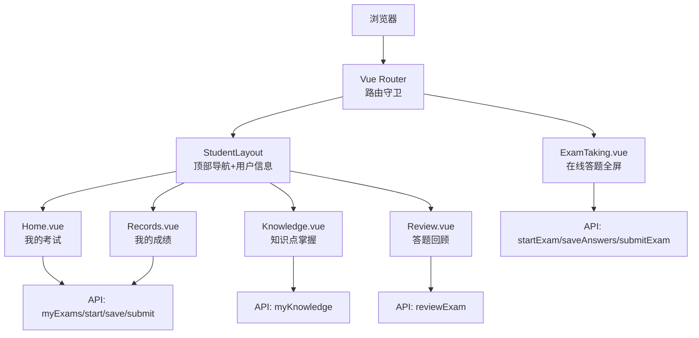
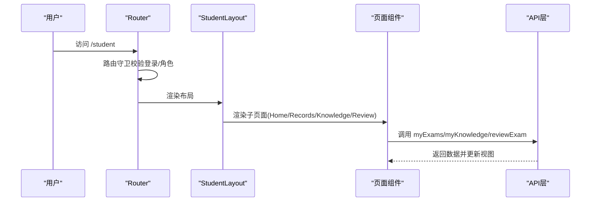
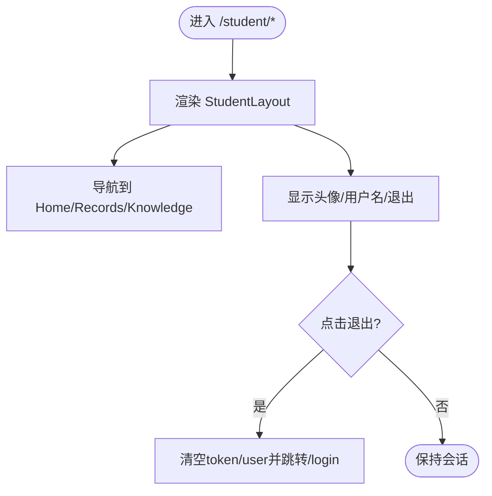
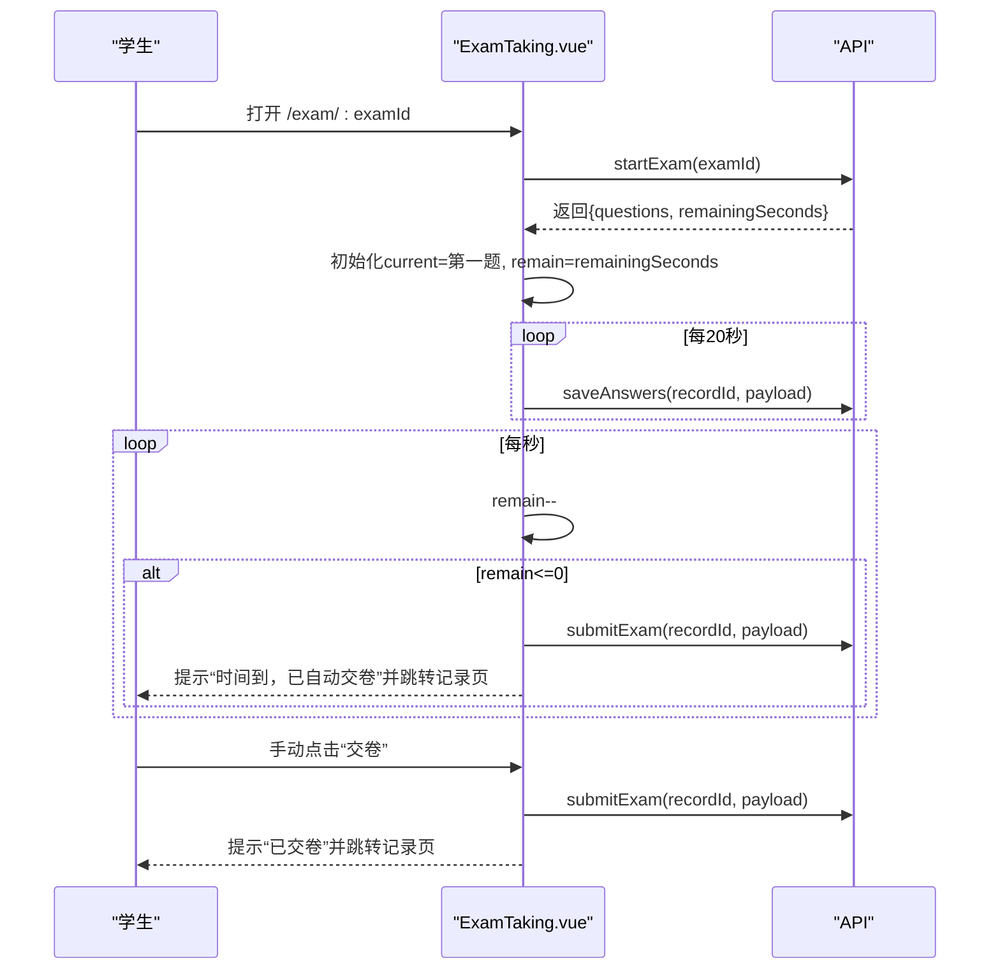
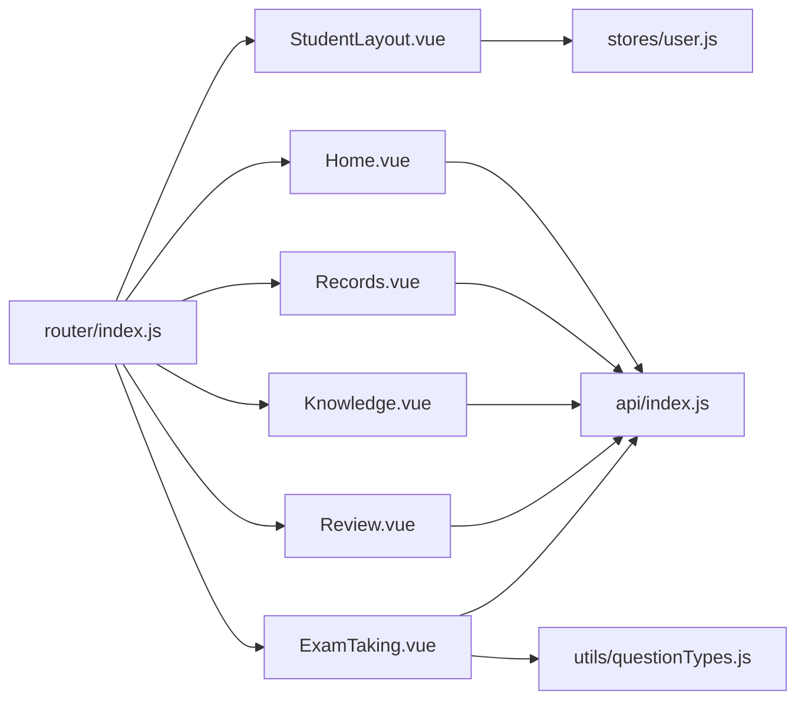

# 学生端界面

<cite>
**本文引用的文件**
- [StudentLayout.vue](file://exam-web/src/layouts/StudentLayout.vue)
- [Home.vue](file://exam-web/src/views/student/Home.vue)
- [Records.vue](file://exam-web/src/views/student/Records.vue)
- [Knowledge.vue](file://exam-web/src/views/student/Knowledge.vue)
- [Review.vue](file://exam-web/src/views/student/Review.vue)
- [ExamTaking.vue](file://exam-web/src/views/exam/ExamTaking.vue)
- [index.js（路由）](file://exam-web/src/router/index.js)
- [index.js（API）](file://exam-web/src/api/index.js)
- [questionTypes.js](file://exam-web/src/utils/questionTypes.js)
- [user.js（用户状态）](file://exam-web/src/stores/user.js)
- [styles.css（全局样式）](file://exam-web/src/styles.css)
- [package.json](file://exam-web/package.json)
- [README.md](file://README.md)
</cite>

## 目录
1. [简介](#简介)
2. [项目结构](#项目结构)
3. [核心组件](#核心组件)
4. [架构总览](#架构总览)
5. [详细组件分析](#详细组件分析)
6. [依赖关系分析](#依赖关系分析)
7. [性能与体验优化](#性能与体验优化)
8. [故障排查指南](#故障排查指南)
9. [结论](#结论)
10. [附录：集成与定制示例](#附录：集成与定制示例)

## 简介
本文件面向“学生端”学习界面的实现说明，覆盖基于 Vue 3 的学生布局、导航与各功能页面：学生主页、考试记录、知识掌握度、答题回顾和在线答题。重点解释答题界面的实时交互、答案自动保存、进度跟踪与交卷处理，并给出移动端适配、用户体验优化与错误提示机制的实践建议，以及组件集成与样式定制方案。

## 项目结构
学生端界面位于 exam-web 前端工程，采用 Vue 3 + Vue Router + Pinia + Element Plus + ECharts 的技术栈。路由将 /student 下的子页面统一由 StudentLayout 包裹；全屏答题页 /exam/:id 独立于布局，专注答题体验。

图表来源
- [index.js（路由）:28-39](file://exam-web/src/router/index.js#L28-L39)
- [index.js（API）:75-81](file://exam-web/src/api/index.js#L75-L81)

章节来源
- [index.js（路由）:28-39](file://exam-web/src/router/index.js#L28-L39)
- [package.json:1-25](file://exam-web/package.json#L1-L25)

## 核心组件
- 学生布局与学生专属导航：StudentLayout 提供顶部 Logo、导航链接、用户头像与退出登录入口，承载 /student 下所有子页面。
- 学生主页 Home：展示待考/进行中的考试卡片，支持开始考试、继续答题、查看回顾。
- 考试记录 Records：以表格形式列出已提交或已出分的考试，支持进入回顾。
- 知识掌握度 Knowledge：通过雷达图与表格展示各知识点的题量与掌握度分档。
- 答题回顾 Review：按题展示题目、选项、我的答案、正确答案与解析、评语等。
- 在线答题 ExamTaking：全屏答题页，包含倒计时、题号导航、题型渲染、标记未确定、自动保存与交卷。

章节来源
- [StudentLayout.vue:1-58](file://exam-web/src/layouts/StudentLayout.vue#L1-L58)
- [Home.vue:1-53](file://exam-web/src/views/student/Home.vue#L1-L53)
- [Records.vue:1-29](file://exam-web/src/views/student/Records.vue#L1-L29)
- [Knowledge.vue:1-39](file://exam-web/src/views/student/Knowledge.vue#L1-L39)
- [Review.vue:1-45](file://exam-web/src/views/student/Review.vue#L1-L45)
- [ExamTaking.vue:1-141](file://exam-web/src/views/exam/ExamTaking.vue#L1-L141)

## 架构总览
学生端采用“布局 + 页面 + API 层 + 状态管理”的分层组织：
- 路由层：集中定义 /admin、/student、/exam 路由，并通过 beforeEach 做登录态校验与角色分流。
- 布局层：StudentLayout 负责学生端公共导航与用户信息。
- 页面层：Home/Records/Knowledge/Review/ExamTaking 分别承担业务视图。
- API 层：封装 axios 请求，暴露 myExams、startExam、saveAnswers、submitExam、reviewExam、myKnowledge 等接口。
- 状态层：Pinia user store 维护 token、用户信息、头像加载状态及登出逻辑。

图表来源
- [index.js（路由）:47-64](file://exam-web/src/router/index.js#L47-L64)
- [index.js（API）:75-81](file://exam-web/src/api/index.js#L75-L81)

章节来源
- [index.js（路由）:47-64](file://exam-web/src/router/index.js#L47-L64)
- [user.js:1-98](file://exam-web/src/stores/user.js#L1-L98)

## 详细组件分析

### 学生布局与学生专属导航（StudentLayout）
- 顶部导航：包含“待考/考试”“我的成绩”“知识点掌握”三个路由链接，当前激活项高亮。
- 用户区：显示头像、用户名与退出按钮；点击退出后清空本地存储并跳转登录页。
- 挂载时根据用户状态决定是否加载头像。
- 样式使用 CSS 变量与响应式容器，便于主题定制。

图表来源
- [StudentLayout.vue:1-58](file://exam-web/src/layouts/StudentLayout.vue#L1-L58)
- [user.js:84-95](file://exam-web/src/stores/user.js#L84-L95)

章节来源
- [StudentLayout.vue:1-58](file://exam-web/src/layouts/StudentLayout.vue#L1-L58)
- [user.js:1-98](file://exam-web/src/stores/user.js#L1-L98)

### 学生主页（Home）
- 列表展示考试卡片：标题、时间、时长、总分、状态标签。
- 状态判断：根据后端 runtimeStatus 与 recordStatus 组合输出“未开始/进行中/已结束/答题中/阅卷中/已完成”。
- 操作：可开始考试、继续答题、查看回顾；点击跳转至 /exam/:examId。
- 数据来源：myExams 接口。

章节来源
- [Home.vue:1-53](file://exam-web/src/views/student/Home.vue#L1-L53)
- [index.js（API）:75-75](file://exam-web/src/api/index.js#L75-L75)

### 考试记录（Records）
- 表格展示已提交或已出分的考试，过滤掉仍在答题的记录。
- 列：考试名称、状态、成绩、详情按钮。
- 状态映射：ANSWERING/MARKING/FINISHED/SUBMITTED 等。
- 数据来源：myExams 接口。

章节来源
- [Records.vue:1-29](file://exam-web/src/views/student/Records.vue#L1-L29)
- [index.js（API）:75-75](file://exam-web/src/api/index.js#L75-L75)

### 知识掌握度（Knowledge）
- 雷达图：以知识点为维度，展示掌握度百分比。
- 表格：知识点、题量、掌握度、分档（薄弱/一般/良好）。
- 数据来源：myKnowledge 接口。
- 可视化：ECharts 雷达图在数据就绪后初始化。

章节来源
- [Knowledge.vue:1-39](file://exam-web/src/views/student/Knowledge.vue#L1-L39)
- [index.js（API）:81-81](file://exam-web/src/api/index.js#L81-L81)

### 答题回顾（Review）
- 头部显示考试名、是否正在阅卷、总分与是否及格。
- 逐题展示：题干、选项、我的答案、正确答案（若可见）、解析、教师评语。
- 数据来源：reviewExam 接口。

章节来源
- [Review.vue:1-45](file://exam-web/src/views/student/Review.vue#L1-L45)
- [index.js（API）:80-80](file://exam-web/src/api/index.js#L80-L80)

### 在线答题（ExamTaking）
- 顶部：考试名称、剩余时间倒计时、交卷按钮。
- 左侧：题号导航，支持“已完成/标记/当前题”视觉反馈。
- 右侧：题目区域，根据题型渲染单选/多选/判断/填空/简答/关键词解释。
- 交互：
  - 选择或输入答案后立即触发持久化保存。
  - 多选题通过 computed 双向绑定数组，变更后同步保存。
  - 标记未确定用于快速定位需复查的题目。
  - 每 20 秒定时保存一次，卸载前强制保存一次。
  - 倒计时归零自动交卷。
- 数据来源：startExam 获取试卷与剩余时间；saveAnswers 保存答案；submitExam 提交答卷。

图表来源
- [ExamTaking.vue:43-114](file://exam-web/src/views/exam/ExamTaking.vue#L43-L114)
- [index.js（API）:76-79](file://exam-web/src/api/index.js#L76-L79)

章节来源
- [ExamTaking.vue:1-141](file://exam-web/src/views/exam/ExamTaking.vue#L1-L141)
- [index.js（API）:76-79](file://exam-web/src/api/index.js#L76-L79)
- [questionTypes.js:1-11](file://exam-web/src/utils/questionTypes.js#L1-L11)

## 依赖关系分析
- 路由与权限：
  - /student 路由由 StudentLayout 包裹，子路由包括 Home/Records/Knowledge/Review。
  - /exam/:id 为全屏答题页，不受布局影响。
  - beforeEach 守卫确保未登录跳转登录页；学生不可访问 /admin；教师不可访问 /student 与 /exam。
- 组件依赖：
  - StudentLayout 依赖 user store 获取用户信息与头像。
  - 各页面依赖 api/index.js 的函数封装。
  - ExamTaking 依赖 questionTypes.js 的类型工具。
- 外部库：
  - Element Plus 提供 UI 组件（按钮、标签、消息、确认框等）。
  - ECharts 用于知识掌握度雷达图。
  - Axios 作为 HTTP 客户端。

图表来源
- [index.js（路由）:28-39](file://exam-web/src/router/index.js#L28-L39)
- [index.js（API）:75-81](file://exam-web/src/api/index.js#L75-L81)
- [questionTypes.js:1-11](file://exam-web/src/utils/questionTypes.js#L1-L11)

章节来源
- [index.js（路由）:47-64](file://exam-web/src/router/index.js#L47-L64)
- [index.js（API）:75-81](file://exam-web/src/api/index.js#L75-L81)

## 性能与体验优化
- 自动保存策略：
  - 每次答案变更立即保存，同时每 20 秒定时保存，避免网络抖动导致的数据丢失。
  - 组件卸载前执行最后一次保存，提升容错性。
- 倒计时与自动交卷：
  - 每秒递减剩余时间，归零时自动提交并提示，防止超时作答。
- 题号导航与标记：
  - 左侧题号网格直观展示完成状态与标记状态，帮助快速定位与复查。
- 移动端适配：
  - 答题页采用 Grid 布局，侧边栏与主内容区在小屏时可考虑改为底部或抽屉式导航以提升可用性。
  - 全局样式使用 CSS 变量与相对单位，便于主题与尺寸调整。
- 错误提示：
  - 使用 Element Plus 的消息与确认框进行成功、警告与确认提示。
  - 头像上传大小限制与失败回退，避免异常占用内存。
- 资源与首屏：
  - 按需引入 ECharts 仅在知识掌握度页面初始化，减少无关开销。
  - 路由懒加载页面组件，降低初始包体积。

[本节为通用优化建议，不直接分析具体文件]

## 故障排查指南
- 无法进入学生端：
  - 检查路由守卫是否放行；确认用户角色是否为 STUDENT。
  - 若未登录将被重定向到 /login。
- 答题页无数据：
  - 检查 startExam 是否返回有效数据；确认 recordId 是否存在。
  - 若 remainingSeconds 为 0，可能已过期或被终止。
- 答案未保存：
  - 检查 saveAnswers 调用是否被触发；确认网络请求是否成功。
  - 关注 onBeforeUnmount 钩子是否执行了最终保存。
- 自动交卷异常：
  - 检查定时器是否在组件卸载时被清理；确认 submitExam 调用是否成功。
- 头像不显示：
  - 检查 getMyAvatar 返回状态码与数据类型；确认 URL.createObjectURL 是否正确释放。

章节来源
- [index.js（路由）:47-64](file://exam-web/src/router/index.js#L47-L64)
- [ExamTaking.vue:93-114](file://exam-web/src/views/exam/ExamTaking.vue#L93-L114)
- [user.js:47-83](file://exam-web/src/stores/user.js#L47-L83)

## 结论
学生端界面以清晰的布局与导航为基础，围绕“我的考试”“我的成绩”“知识点掌握”“答题回顾”“在线答题”五大模块构建完整的学习闭环。答题页通过即时保存、定时保存与自动交卷保障数据安全与时效性；结合 ECharts 可视化与 Element Plus 交互组件，提供良好的用户体验。后续可在移动端导航、离线缓存与更细粒度的错误恢复方面持续优化。

[本节为总结性内容，不直接分析具体文件]

## 附录：集成与定制示例

### 组件集成示例
- 在学生布局中添加新导航项：
  - 在 StudentLayout 的 nav 区域新增 router-link，指向新的学生子路由。
  - 在路由文件中注册对应路径与组件。
- 在答题页扩展题型：
  - 在 questionTypes.js 中补充题型常量与判断逻辑。
  - 在 ExamTaking.vue 的条件渲染分支中增加对应输入控件与持久化逻辑。

章节来源
- [StudentLayout.vue:8-12](file://exam-web/src/layouts/StudentLayout.vue#L8-L12)
- [index.js（路由）:28-39](file://exam-web/src/router/index.js#L28-L39)
- [questionTypes.js:1-11](file://exam-web/src/utils/questionTypes.js#L1-L11)
- [ExamTaking.vue:19-36](file://exam-web/src/views/exam/ExamTaking.vue#L19-L36)

### 样式定制方案
- 主题色与间距：
  - 通过 styles.css 的 CSS 变量（如 --accent、--page、--line）统一控制颜色与边框。
  - 在 StudentLayout 与 ExamTaking 中使用这些变量保持一致风格。
- 响应式布局：
  - 利用 Grid 与 Flex 布局，在小屏幕下调整侧边栏宽度或隐藏次要元素。
  - 参考全局媒体查询，为统计卡片等组件提供自适应列数。

章节来源
- [styles.css:1-54](file://exam-web/src/styles.css#L1-L54)
- [StudentLayout.vue:44-57](file://exam-web/src/layouts/StudentLayout.vue#L44-L57)
- [ExamTaking.vue:117-140](file://exam-web/src/views/exam/ExamTaking.vue#L117-L140)

### 运行与启动
- 环境要求：Node.js 18+，可选 MySQL 8 或 Docker。
- 启动方式：
  - 后端：java -jar target\exam-server-1.0.0.jar 或双击 start-server.bat。
  - 前端：cd exam-web && npm install && npm run dev。
- 演示账号：学生 s2024001 / student123。

章节来源
- [README.md:1-82](file://README.md#L1-L82)