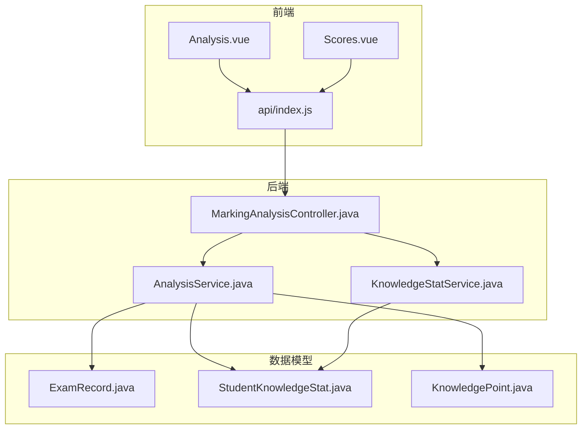
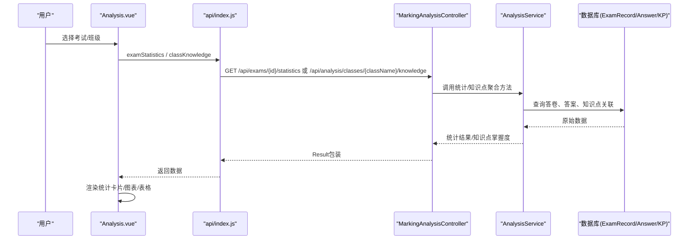
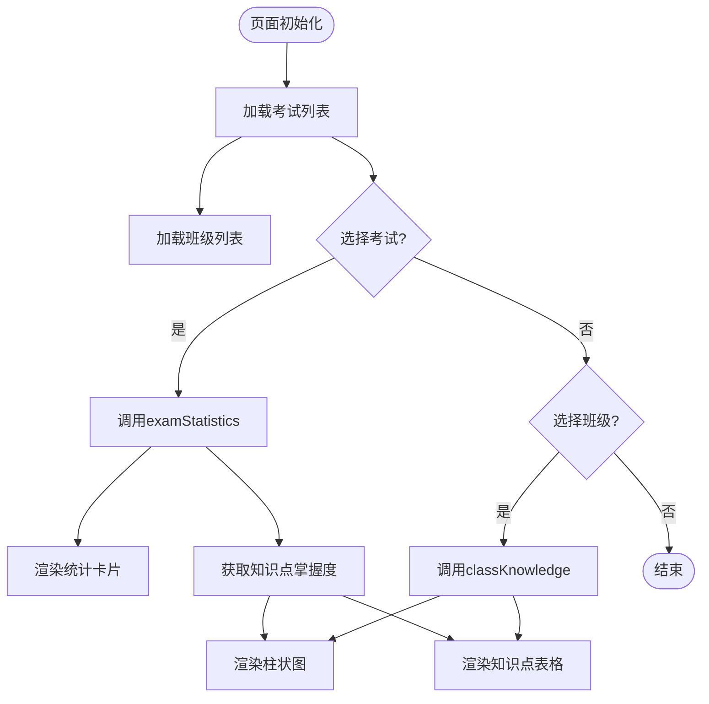
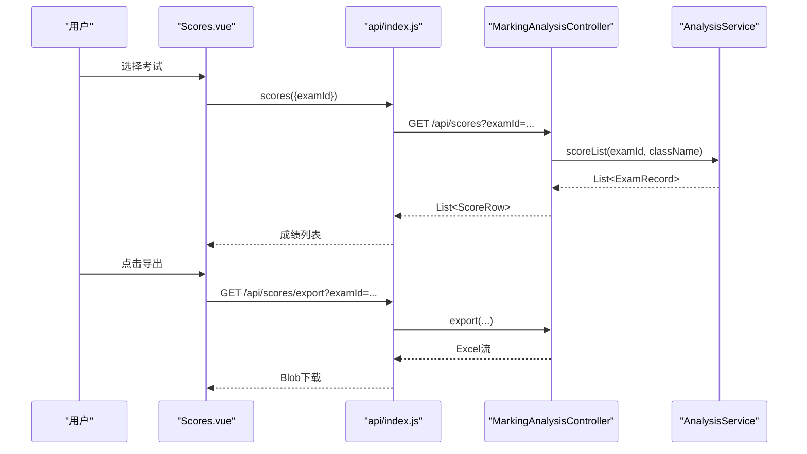
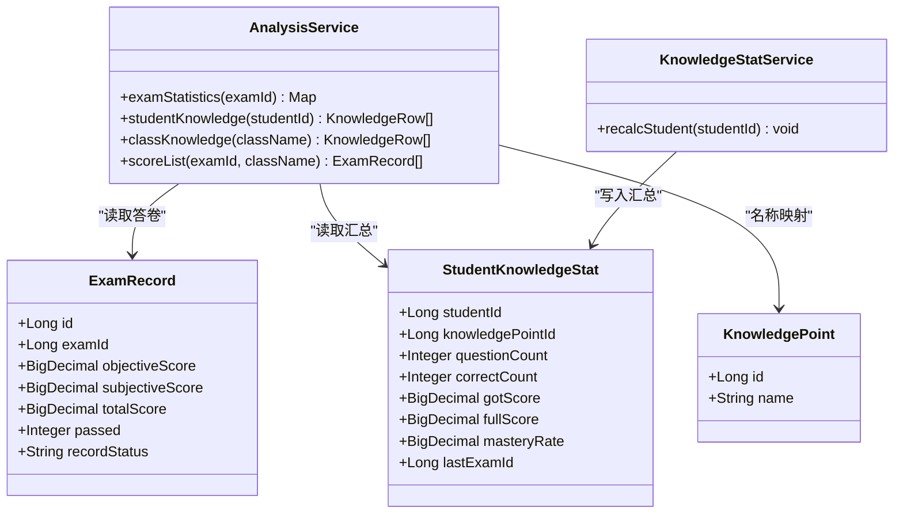
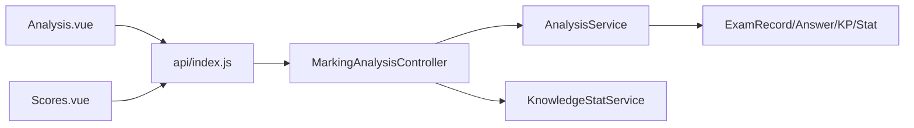

# 学情分析界面

<cite>
**本文引用的文件**
- [Analysis.vue](file://exam-web/src/views/admin/Analysis.vue)
- [Scores.vue](file://exam-web/src/views/admin/Scores.vue)
- [index.js](file://exam-web/src/api/index.js)
- [MarkingAnalysisController.java](file://exam-server/src/main/java/com/exam/controller/MarkingAnalysisController.java)
- [AnalysisService.java](file://exam-server/src/main/java/com/exam/service/AnalysisService.java)
- [KnowledgeStatService.java](file://exam-server/src/main/java/com/exam/service/KnowledgeStatService.java)
- [StudentKnowledgeStat.java](file://exam-server/src/main/java/com/exam/entity/StudentKnowledgeStat.java)
- [ExamRecord.java](file://exam-server/src/main/java/com/exam/entity/ExamRecord.java)
- [KnowledgePoint.java](file://exam-server/src/main/java/com/exam/entity/KnowledgePoint.java)
</cite>

## 目录
1. [简介](#简介)
2. [项目结构](#项目结构)
3. [核心组件](#核心组件)
4. [架构总览](#架构总览)
5. [详细组件分析](#详细组件分析)
6. [依赖关系分析](#依赖关系分析)
7. [性能考虑](#性能考虑)
8. [故障排查指南](#故障排查指南)
9. [结论](#结论)
10. [附录](#附录)

## 简介
本文件面向“学情分析”功能，围绕前端两个关键页面：
- Analysis.vue：单场考试与班级的知识点掌握度分析、成绩统计概览、考生明细展示。
- Scores.vue：按考试筛选的成绩列表与导出Excel。

重点说明：
- 成绩统计展示：应考人数、已交卷、平均分、及格率等指标。
- 知识点掌握度分析：基于“实得分/满分”的掌握度计算，分档为“薄弱/一般/掌握”。
- 个人能力评估：通过学生维度的知识点掌握汇总进行能力画像（由服务层提供数据）。
- 图表可视化：使用ECharts绘制柱状图（当前实现），并给出雷达图、折线图等扩展方案。
- 数据筛选、对比分析、趋势分析与报告生成：支持按考试、班级筛选；可横向对比班级薄弱点；可扩展时间维度做趋势分析；支持导出Excel作为报告基础。
- 班级统计分析、薄弱点识别、学习建议生成：后端聚合班级知识点掌握度，前端以图表和表格呈现薄弱点；建议可通过规则引擎或提示文案生成。
- 自定义报表、数据导出与分析模型扩展：提供导出接口与数据模型，便于二次开发。

## 项目结构
- 前端视图
  - admin/Analysis.vue：学情分析主页面，包含考试选择、班级选择、统计卡片、知识点掌握度柱状图、知识点表格、考生明细表。
  - admin/Scores.vue：成绩页，支持按考试筛选、导出Excel。
- 前端API封装
  - api/index.js：统一封装后端接口调用，包括考试分页、考试统计、班级知识、成绩列表与导出等。
- 后端控制器与服务
  - MarkingAnalysisController.java：暴露考试统计、班级/学生知识点、成绩列表与导出等REST接口。
  - AnalysisService.java：实现单场考试统计、班级/学生知识点掌握度聚合、成绩列表查询等核心逻辑。
  - KnowledgeStatService.java：在阅卷完成后重算学生知识点掌握汇总，写入student_knowledge_stat。
- 数据模型
  - ExamRecord.java：答卷/成绩记录，含分数、是否及格、状态等。
  - StudentKnowledgeStat.java：学生知识点掌握汇总，供个人能力评估使用。
  - KnowledgePoint.java：知识点定义，用于名称映射与层级管理。

**图示来源**
- [Analysis.vue:1-92](file://exam-web/src/views/admin/Analysis.vue#L1-L92)
- [Scores.vue:1-52](file://exam-web/src/views/admin/Scores.vue#L1-L52)
- [index.js:59-82](file://exam-web/src/api/index.js#L59-L82)
- [MarkingAnalysisController.java:55-90](file://exam-server/src/main/java/com/exam/controller/MarkingAnalysisController.java#L55-L90)
- [AnalysisService.java:46-161](file://exam-server/src/main/java/com/exam/service/AnalysisService.java#L46-L161)
- [KnowledgeStatService.java:34-100](file://exam-server/src/main/java/com/exam/service/KnowledgeStatService.java#L34-L100)
- [ExamRecord.java:11-29](file://exam-server/src/main/java/com/exam/entity/ExamRecord.java#L11-L29)
- [StudentKnowledgeStat.java:11-28](file://exam-server/src/main/java/com/exam/entity/StudentKnowledgeStat.java#L11-L28)
- [KnowledgePoint.java:10-25](file://exam-server/src/main/java/com/exam/entity/KnowledgePoint.java#L10-L25)

**章节来源**
- [Analysis.vue:1-92](file://exam-web/src/views/admin/Analysis.vue#L1-L92)
- [Scores.vue:1-52](file://exam-web/src/views/admin/Scores.vue#L1-L52)
- [index.js:59-82](file://exam-web/src/api/index.js#L59-L82)
- [MarkingAnalysisController.java:55-90](file://exam-server/src/main/java/com/exam/controller/MarkingAnalysisController.java#L55-L90)
- [AnalysisService.java:46-161](file://exam-server/src/main/java/com/exam/service/AnalysisService.java#L46-L161)
- [KnowledgeStatService.java:34-100](file://exam-server/src/main/java/com/exam/service/KnowledgeStatService.java#L34-L100)
- [ExamRecord.java:11-29](file://exam-server/src/main/java/com/exam/entity/ExamRecord.java#L11-L29)
- [StudentKnowledgeStat.java:11-28](file://exam-server/src/main/java/com/exam/entity/StudentKnowledgeStat.java#L11-L28)
- [KnowledgePoint.java:10-25](file://exam-server/src/main/java/com/exam/entity/KnowledgePoint.java#L10-L25)

## 核心组件
- Analysis.vue
  - 功能：选择考试或班级，加载统计卡片、知识点掌握度柱状图、知识点表格、考生明细表。
  - 数据流：通过pageExams获取考试列表，dashboard获取班级列表；选择考试后调用examStatistics获取统计与知识点；选择班级后调用classKnowledge获取班级知识点。
  - 图表：使用ECharts渲染水平柱状图，X轴为掌握度百分比，Y轴为知识点名称，按掌握度从低到高排序展示。
- Scores.vue
  - 功能：选择考试后拉取成绩列表，支持导出Excel。
  - 数据流：调用scores接口获取成绩列表；导出通过http直接请求/scores/export并下载blob。

**章节来源**
- [Analysis.vue:44-90](file://exam-web/src/views/admin/Analysis.vue#L44-L90)
- [Scores.vue:27-50](file://exam-web/src/views/admin/Scores.vue#L27-L50)
- [index.js:59-82](file://exam-web/src/api/index.js#L59-L82)

## 架构总览
前端通过统一的API封装调用后端REST接口，后端控制器将请求路由到AnalysisService与KnowledgeStatService，后者聚合ExamRecord、ExamAnswer、QuestionKnowledge、KnowledgePoint等实体数据，输出统计结果与知识点掌握度。

**图示来源**
- [Analysis.vue:73-84](file://exam-web/src/views/admin/Analysis.vue#L73-L84)
- [index.js:64-72](file://exam-web/src/api/index.js#L64-L72)
- [MarkingAnalysisController.java:55-73](file://exam-server/src/main/java/com/exam/controller/MarkingAnalysisController.java#L55-L73)
- [AnalysisService.java:46-145](file://exam-server/src/main/java/com/exam/service/AnalysisService.java#L46-L145)

## 详细组件分析

### Analysis.vue 组件分析
- 数据筛选
  - 考试选择：通过pageExams获取考试列表，默认选中第一个或路由参数中的examId。
  - 班级选择：通过dashboard获取班级名列表，选择后触发班级知识点加载。
- 成绩统计展示
  - 调用examStatistics获取：应考人数、已交卷、平均分、及格率等。
  - 展示为统计卡片，直观反映本场考试整体情况。
- 知识点掌握度分析
  - 单场考试：examStatistics返回knowledge数组，按掌握度升序排列，前端反转显示以便从低到高阅读。
  - 班级维度：classKnowledge返回该班级所有学生的知识点聚合掌握度，同样按掌握度排序。
  - 掌握度分档：≥80为“掌握”，60–79为“一般”，<60为“薄弱”，前端用标签颜色区分。
- 图表可视化
  - 使用ECharts绘制水平柱状图，X轴为掌握度百分比，Y轴为知识点名称，tooltip提示具体数值。
  - 可扩展为雷达图：将每个知识点的掌握度作为维度，绘制学生或班级能力雷达图，便于多维能力对比。
  - 可扩展为折线图：按时间序列（如多次考试）绘制某知识点掌握度变化趋势，辅助趋势分析。
- 个人能力评估
  - 通过studentKnowledge接口（后端提供）获取学生维度的知识点掌握汇总，可用于个人能力画像与薄弱点定位。
- 对比分析与趋势分析
  - 对比分析：切换不同班级或考试，观察知识点掌握度差异，识别共性薄弱点。
  - 趋势分析：结合历史考试数据，对同一知识点在不同时间的掌握度绘制折线图，观察提升或退步趋势。
- 报告生成
  - 可将当前页面的统计数据与图表截图导出，或结合Scores.vue的Excel导出形成综合报告。

**图示来源**
- [Analysis.vue:73-84](file://exam-web/src/views/admin/Analysis.vue#L73-L84)
- [AnalysisService.java:163-212](file://exam-server/src/main/java/com/exam/service/AnalysisService.java#L163-L212)

**章节来源**
- [Analysis.vue:1-92](file://exam-web/src/views/admin/Analysis.vue#L1-L92)
- [AnalysisService.java:46-212](file://exam-server/src/main/java/com/exam/service/AnalysisService.java#L46-L212)

### Scores.vue 组件分析
- 数据筛选
  - 通过下拉框选择考试，调用scores接口获取该考试已完成阅卷的成绩列表。
- 成绩展示
  - 表格列包括：考试名称、学号、姓名、班级、客观题分数、主观题分数、总分、是否及格。
- 数据导出
  - 点击导出按钮，调用/scores/export接口，后端以Excel格式返回二进制流，前端创建Blob并触发下载。
- 扩展建议
  - 可增加班级筛选条件，复用后端scoreList的className参数。
  - 可增加导出字段（如提交时间、状态），在后端ScoreRow中扩展。

**图示来源**
- [Scores.vue:35-46](file://exam-web/src/views/admin/Scores.vue#L35-L46)
- [index.js:70-71](file://exam-web/src/api/index.js#L70-L71)
- [MarkingAnalysisController.java:75-90](file://exam-server/src/main/java/com/exam/controller/MarkingAnalysisController.java#L75-L90)
- [AnalysisService.java:147-161](file://exam-server/src/main/java/com/exam/service/AnalysisService.java#L147-L161)

**章节来源**
- [Scores.vue:1-52](file://exam-web/src/views/admin/Scores.vue#L1-L52)
- [MarkingAnalysisController.java:75-90](file://exam-server/src/main/java/com/exam/controller/MarkingAnalysisController.java#L75-L90)
- [AnalysisService.java:147-161](file://exam-server/src/main/java/com/exam/service/AnalysisService.java#L147-L161)

### 后端服务与数据模型
- AnalysisService
  - examStatistics：计算单场考试的应考、已交卷、平均分、及格率，并聚合知识点掌握度。
  - classKnowledge：按班级聚合学生知识点掌握度，计算掌握度与分档。
  - studentKnowledge：按学生维度返回知识点掌握汇总，用于个人能力评估。
  - scoreList：按考试与班级过滤已完成答卷，返回成绩列表。
- KnowledgeStatService
  - recalcStudent：在阅卷完成后重算学生知识点掌握汇总，写入student_knowledge_stat，支撑个人能力评估。
- 数据模型
  - ExamRecord：答卷/成绩记录，包含分数、是否及格、状态等。
  - StudentKnowledgeStat：学生知识点掌握汇总，包含题目数、正确数、得分、满分、掌握度、最近考试ID等。
  - KnowledgePoint：知识点定义，用于名称映射与层级管理。

**图示来源**
- [AnalysisService.java:46-161](file://exam-server/src/main/java/com/exam/service/AnalysisService.java#L46-L161)
- [KnowledgeStatService.java:34-100](file://exam-server/src/main/java/com/exam/service/KnowledgeStatService.java#L34-L100)
- [ExamRecord.java:11-29](file://exam-server/src/main/java/com/exam/entity/ExamRecord.java#L11-L29)
- [StudentKnowledgeStat.java:11-28](file://exam-server/src/main/java/com/exam/entity/StudentKnowledgeStat.java#L11-L28)
- [KnowledgePoint.java:10-25](file://exam-server/src/main/java/com/exam/entity/KnowledgePoint.java#L10-L25)

**章节来源**
- [AnalysisService.java:46-212](file://exam-server/src/main/java/com/exam/service/AnalysisService.java#L46-L212)
- [KnowledgeStatService.java:34-100](file://exam-server/src/main/java/com/exam/service/KnowledgeStatService.java#L34-L100)
- [ExamRecord.java:11-29](file://exam-server/src/main/java/com/exam/entity/ExamRecord.java#L11-L29)
- [StudentKnowledgeStat.java:11-28](file://exam-server/src/main/java/com/exam/entity/StudentKnowledgeStat.java#L11-L28)
- [KnowledgePoint.java:10-25](file://exam-server/src/main/java/com/exam/entity/KnowledgePoint.java#L10-L25)

## 依赖关系分析
- 前端依赖
  - Analysis.vue依赖api/index.js中的pageExams、dashboard、examStatistics、classKnowledge。
  - Scores.vue依赖api/index.js中的pageExams、scores，以及http模块进行导出。
- 后端依赖
  - MarkingAnalysisController依赖AnalysisService与KnowledgeStatService。
  - AnalysisService依赖多个Mapper（ExamRecord、ExamAnswer、QuestionKnowledge、KnowledgePoint、StudentKnowledgeStat等）。
- 数据依赖
  - 知识点掌握度依赖QuestionKnowledge权重分摊与ExamAnswer得分。
  - 个人能力评估依赖StudentKnowledgeStat汇总数据。

**图示来源**
- [Analysis.vue:44-90](file://exam-web/src/views/admin/Analysis.vue#L44-L90)
- [Scores.vue:27-50](file://exam-web/src/views/admin/Scores.vue#L27-L50)
- [index.js:59-82](file://exam-web/src/api/index.js#L59-L82)
- [MarkingAnalysisController.java:55-90](file://exam-server/src/main/java/com/exam/controller/MarkingAnalysisController.java#L55-L90)
- [AnalysisService.java:46-161](file://exam-server/src/main/java/com/exam/service/AnalysisService.java#L46-L161)

**章节来源**
- [Analysis.vue:44-90](file://exam-web/src/views/admin/Analysis.vue#L44-L90)
- [Scores.vue:27-50](file://exam-web/src/views/admin/Scores.vue#L27-L50)
- [index.js:59-82](file://exam-web/src/api/index.js#L59-L82)
- [MarkingAnalysisController.java:55-90](file://exam-server/src/main/java/com/exam/controller/MarkingAnalysisController.java#L55-L90)
- [AnalysisService.java:46-161](file://exam-server/src/main/java/com/exam/service/AnalysisService.java#L46-L161)

## 性能考虑
- 数据聚合复杂度
  - 单场考试知识点聚合：遍历答卷与答案，按题目-知识点权重分摊，时间复杂度与答案数量线性相关。
  - 班级知识点聚合：先按学生分组再按知识点聚合，注意大数据量时的内存占用。
- 图表渲染
  - ECharts柱状图在知识点较多时可能影响渲染性能，建议分页或限制展示数量。
- 导出性能
  - Excel导出使用EasyExcel流式写入，避免大对象内存峰值。

[本节为通用性能讨论，不直接分析具体文件]

## 故障排查指南
- 知识点掌握度为0
  - 检查题目是否关联了知识点（QuestionKnowledge），以及答案是否有得分。
  - 确认ExamRecord状态为FINISHED，否则不参与统计。
- 班级知识点为空
  - 检查班级下是否存在学生，以及学生是否有已完成答卷与知识点汇总。
- 导出失败
  - 检查后端响应类型是否为Excel流，前端是否正确处理Blob并触发下载。
- 图表不显示
  - 确保DOM节点已挂载后再初始化ECharts，并在数据更新后重新setOption。

**章节来源**
- [AnalysisService.java:163-212](file://exam-server/src/main/java/com/exam/service/AnalysisService.java#L163-L212)
- [KnowledgeStatService.java:34-100](file://exam-server/src/main/java/com/exam/service/KnowledgeStatService.java#L34-L100)
- [MarkingAnalysisController.java:81-90](file://exam-server/src/main/java/com/exam/controller/MarkingAnalysisController.java#L81-L90)
- [Analysis.vue:60-72](file://exam-web/src/views/admin/Analysis.vue#L60-L72)

## 结论
Analysis.vue与Scores.vue共同构成了完整的学情分析界面：前者聚焦知识点掌握度与考试统计，后者聚焦成绩查看与导出。后端通过AnalysisService与KnowledgeStatService提供强大的数据聚合能力，支撑班级统计、薄弱点识别与个人能力评估。当前实现以柱状图为主，可按需扩展雷达图与折线图以满足更丰富的可视化需求。导出Excel可作为报告生成的基础，进一步结合规则引擎可自动生成学习建议。

[本节为总结性内容，不直接分析具体文件]

## 附录

### 图表可视化扩展指南
- 雷达图
  - 适用场景：个人能力评估，将各知识点掌握度作为维度，绘制学生能力雷达图。
  - 数据来源：studentKnowledge接口返回的学生知识点掌握汇总。
  - 实现要点：将知识点名称作为维度，掌握度作为值，设置极坐标与角度分割。
- 折线图
  - 适用场景：趋势分析，按时间序列展示某知识点掌握度变化。
  - 数据来源：多次考试的知识点掌握度聚合，需在前端或服务端按时间维度组织数据。
  - 实现要点：X轴为时间（考试日期或序号），Y轴为掌握度，多条折线表示不同班级或学生。

[本节为概念性扩展说明，不直接分析具体文件]

### 数据导出与自定义报表
- 导出接口
  - /api/scores/export：支持按考试与班级筛选，返回Excel流。
- 自定义报表
  - 可在ScoreRow中扩展字段（如提交时间、状态），并在前端表格中展示。
  - 结合Analysis.vue的统计卡片与图表，生成PDF或HTML报告。

**章节来源**
- [MarkingAnalysisController.java:81-90](file://exam-server/src/main/java/com/exam/controller/MarkingAnalysisController.java#L81-L90)
- [Scores.vue:38-46](file://exam-web/src/views/admin/Scores.vue#L38-L46)

### 分析模型扩展指南
- 增加新指标
  - 在AnalysisService中新增聚合逻辑，例如标准差、最高/最低分、各题型得分分布等。
- 增强知识点权重
  - 调整QuestionKnowledge权重，以更精确地分摊得分到知识点。
- 个性化建议
  - 基于薄弱点与趋势，生成学习建议文案，前端以提示或报告形式展示。

[本节为扩展建议，不直接分析具体文件]