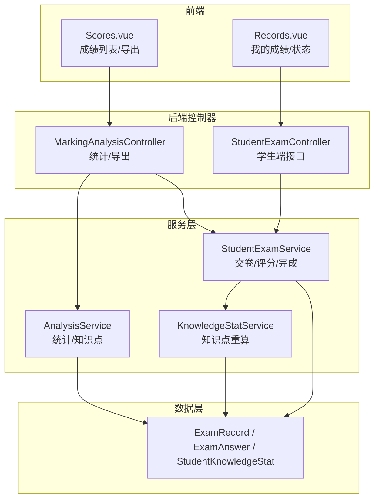
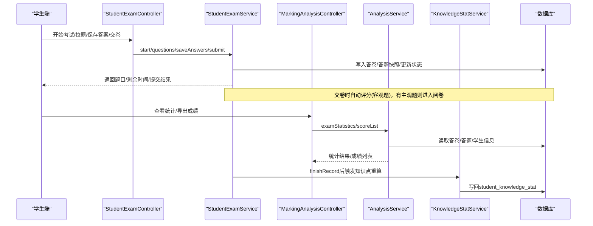
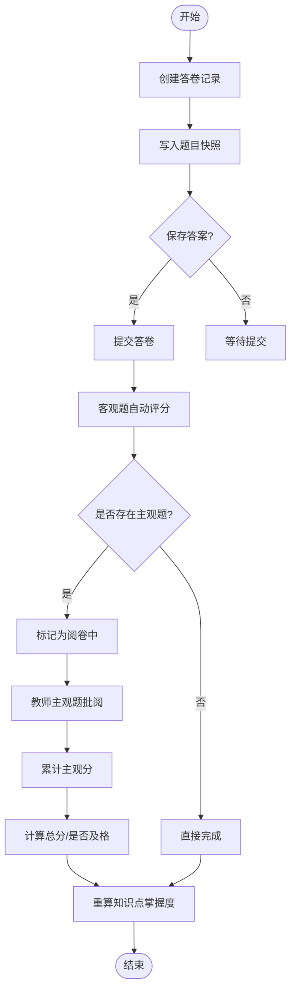
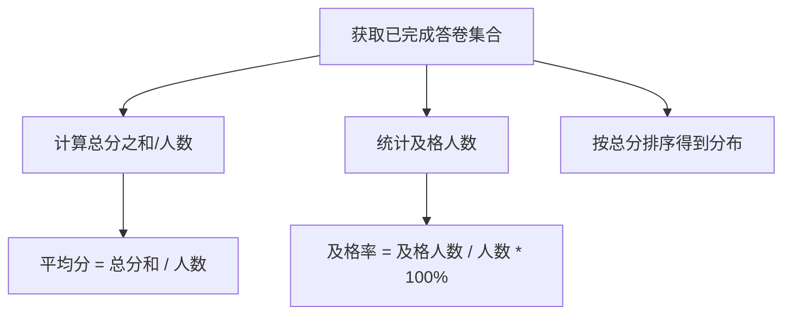
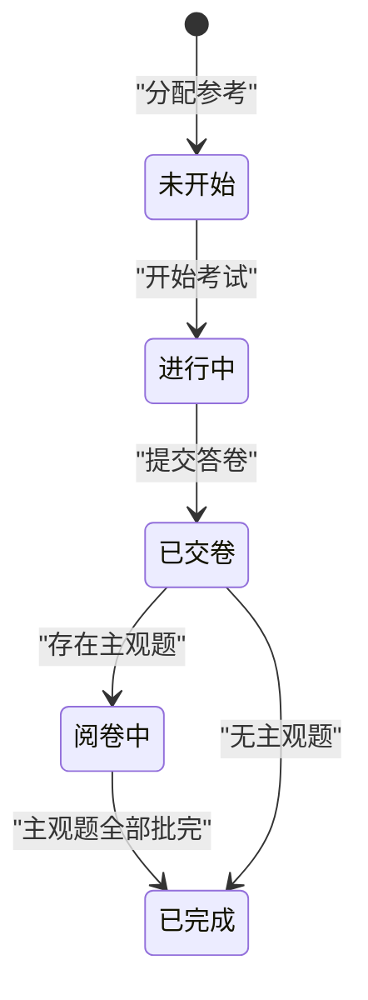
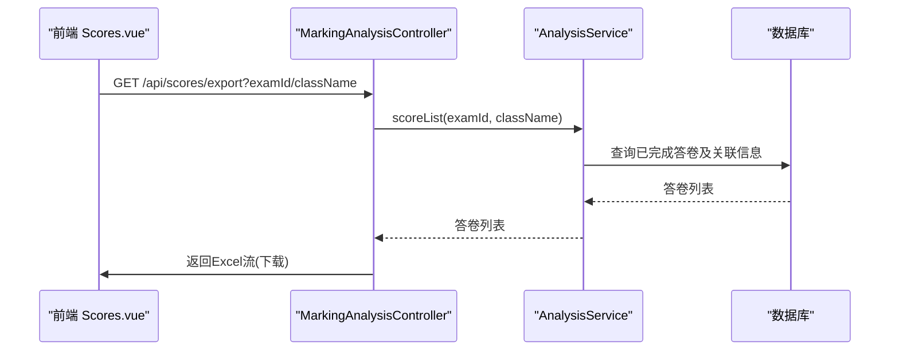
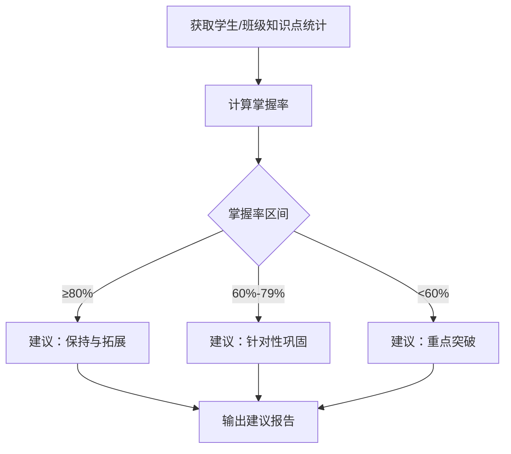
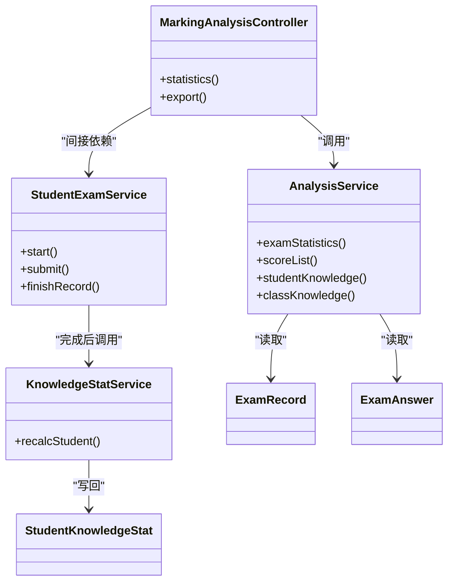

# 成绩统计管理

<cite>
**本文引用的文件**
- [MarkingAnalysisController.java](file://exam-server/src/main/java/com/exam/controller/MarkingAnalysisController.java)
- [AnalysisService.java](file://exam-server/src/main/java/com/exam/service/AnalysisService.java)
- [ScoreCalculator.java](file://exam-server/src/main/java/com/exam/util/ScoreCalculator.java)
- [StudentExamService.java](file://exam-server/src/main/java/com/exam/service/StudentExamService.java)
- [StudentExamController.java](file://exam-server/src/main/java/com/exam/controller/StudentExamController.java)
- [KnowledgeStatService.java](file://exam-server/src/main/java/com/exam/service/KnowledgeStatService.java)
- [ExamRecord.java](file://exam-server/src/main/java/com/exam/entity/ExamRecord.java)
- [ExamAnswer.java](file://exam-server/src/main/java/com/exam/entity/ExamAnswer.java)
- [ExamStudent.java](file://exam-server/src/main/java/com/exam/entity/ExamStudent.java)
- [StudentKnowledgeStat.java](file://exam-server/src/main/java/com/exam/entity/StudentKnowledgeStat.java)
- [Scores.vue](file://exam-web/src/views/admin/Scores.vue)
- [Records.vue](file://exam-web/src/views/student/Records.vue)
- [schema.sql](file://sql/schema.sql)
</cite>

## 目录
1. [简介](#简介)
2. [项目结构](#项目结构)
3. [核心组件](#核心组件)
4. [架构总览](#架构总览)
5. [详细组件分析](#详细组件分析)
6. [依赖关系分析](#依赖关系分析)
7. [性能与可扩展性](#性能与可扩展性)
8. [故障排查指南](#故障排查指南)
9. [结论](#结论)
10. [附录](#附录)

## 简介
本文件围绕“成绩统计管理”能力，系统化说明成绩数据的收集、处理与展示流程；解释平均分、及格率、分数分布等指标的计算方法；阐述学生答题记录的查询与管理（状态跟踪：未开始、进行中、已完成）；详述成绩导出（Excel）实现；提供成绩对比分析、排名统计与个性化学习建议的落地方案；并给出成绩异常检测与数据质量验证机制。

## 项目结构
后端采用 Spring Boot + MyBatis-Plus，前端为 Vue 3 + Element Plus。成绩统计相关的关键路径包括：
- 控制器层：阅卷与统计分析、成绩导出
- 服务层：考试主流程、自动评分、知识点掌握度计算、统计汇总
- 实体与映射：答卷、答题明细、学生知识掌握统计
- 工具类：客观题匹配与评分规则
- 前端页面：管理员成绩页、学生我的成绩页

图表来源
- [MarkingAnalysisController.java:38-90](file://exam-server/src/main/java/com/exam/controller/MarkingAnalysisController.java#L38-L90)
- [StudentExamController.java:29-71](file://exam-server/src/main/java/com/exam/controller/StudentExamController.java#L29-L71)
- [StudentExamService.java:94-309](file://exam-server/src/main/java/com/exam/service/StudentExamService.java#L94-L309)
- [AnalysisService.java:46-161](file://exam-server/src/main/java/com/exam/service/AnalysisService.java#L46-L161)
- [KnowledgeStatService.java:34-100](file://exam-server/src/main/java/com/exam/service/KnowledgeStatService.java#L34-L100)

章节来源
- [schema.sql:135-187](file://sql/schema.sql#L135-L187)

## 核心组件
- 成绩统计与分析：单场考试统计、班级/学生知识点掌握度、成绩列表与导出
- 阅卷与评分：主观题人工阅卷、客观题自动评分、总分与及格判定
- 答题记录管理：状态机流转（未开始/进行中/已交卷/阅卷中/已完成）、剩余时间控制
- 知识点掌握度：按题目权重分摊得分，计算掌握率与等级
- 数据导出：EasyExcel 导出 Excel 成绩表

章节来源
- [MarkingAnalysisController.java:38-90](file://exam-server/src/main/java/com/exam/controller/MarkingAnalysisController.java#L38-L90)
- [AnalysisService.java:46-161](file://exam-server/src/main/java/com/exam/service/AnalysisService.java#L46-L161)
- [StudentExamService.java:180-309](file://exam-server/src/main/java/com/exam/service/StudentExamService.java#L180-L309)
- [KnowledgeStatService.java:34-100](file://exam-server/src/main/java/com/exam/service/KnowledgeStatService.java#L34-L100)

## 架构总览
成绩统计管理的数据流从“学生答题”到“教师阅卷”，再到“统计与导出”。

图表来源
- [StudentExamController.java:29-71](file://exam-server/src/main/java/com/exam/controller/StudentExamController.java#L29-L71)
- [StudentExamService.java:94-309](file://exam-server/src/main/java/com/exam/service/StudentExamService.java#L94-L309)
- [MarkingAnalysisController.java:38-90](file://exam-server/src/main/java/com/exam/controller/MarkingAnalysisController.java#L38-L90)
- [AnalysisService.java:46-161](file://exam-server/src/main/java/com/exam/service/AnalysisService.java#L46-L161)
- [KnowledgeStatService.java:34-100](file://exam-server/src/main/java/com/exam/service/KnowledgeStatService.java#L34-L100)

## 详细组件分析

### 一、成绩数据收集与处理流程
- 数据采集
  - 学生端通过接口开始考试、拉取题目、保存答案、提交答卷
  - 系统创建答卷记录（ExamRecord），并写入每题的题干与正确答案快照（ExamAnswer）
- 自动评分
  - 交卷时，对客观题进行自动匹配评分（单选/多选/填空），更新答题正确性与得分
  - 若存在主观题，将答卷状态置为“阅卷中”，等待教师批阅
- 人工阅卷
  - 教师对主观题打分，系统累计主观分，当所有主观题批完后，计算总分、是否及格，并将状态置为“已完成”
- 知识点掌握度
  - 完成后调用知识点重算服务，按题目权重分摊得分，生成学生维度知识点掌握统计

图表来源
- [StudentExamService.java:94-309](file://exam-server/src/main/java/com/exam/service/StudentExamService.java#L94-L309)
- [ScoreCalculator.java:15-53](file://exam-server/src/main/java/com/exam/util/ScoreCalculator.java#L15-L53)
- [KnowledgeStatService.java:34-100](file://exam-server/src/main/java/com/exam/service/KnowledgeStatService.java#L34-L100)

章节来源
- [StudentExamService.java:94-309](file://exam-server/src/main/java/com/exam/service/StudentExamService.java#L94-L309)
- [ScoreCalculator.java:15-53](file://exam-server/src/main/java/com/exam/util/ScoreCalculator.java#L15-L53)
- [KnowledgeStatService.java:34-100](file://exam-server/src/main/java/com/exam/service/KnowledgeStatService.java#L34-L100)

### 二、统计指标计算方法
- 平均分
  - 仅统计“已完成”答卷的总分，求和后除以人数，保留两位小数
- 及格率
  - 在“已完成”答卷中，统计总分达到试卷及格线的人数占比，百分比保留两位小数
- 分数分布
  - 基于“已完成”答卷的总分排序输出，支持按考试或班级过滤
- 知识点掌握度
  - 掌握度 = 实得分 / 满分 × 100；按题目权重分摊得分，等级划分：≥80%为“掌握”，60%-79%为“一般”，<60%为“薄弱”

图表来源
- [AnalysisService.java:46-97](file://exam-server/src/main/java/com/exam/service/AnalysisService.java#L46-L97)
- [AnalysisService.java:163-212](file://exam-server/src/main/java/com/exam/service/AnalysisService.java#L163-L212)

章节来源
- [AnalysisService.java:46-97](file://exam-server/src/main/java/com/exam/service/AnalysisService.java#L46-L97)
- [AnalysisService.java:163-212](file://exam-server/src/main/java/com/exam/service/AnalysisService.java#L163-L212)

### 三、学生答题记录查询与管理（状态跟踪）
- 状态定义
  - 未开始：NOT_STARTED（学生未开始）
  - 进行中：ANSWERING（正在答题）
  - 已交卷：SUBMITTED（已提交但未完成全部阅卷）
  - 阅卷中：MARKING（存在主观题待批）
  - 已完成：FINISHED（总分与及格判定完成）
- 查询与管理
  - 学生端：查看我的成绩列表与详情，显示当前状态与可操作入口
  - 教师端：按考试/状态筛选答卷，查看答题明细并进行主观题批阅
- 状态流转
  - 开始考试 → ANSWERING
  - 提交 → SUBMITTED；若有主观题 → MARKING；全部主观题批完 → FINISHED

图表来源
- [ExamStudent.java:10-17](file://exam-server/src/main/java/com/exam/entity/ExamStudent.java#L10-L17)
- [ExamRecord.java:13-28](file://exam-server/src/main/java/com/exam/entity/ExamRecord.java#L13-L28)
- [StudentExamService.java:180-309](file://exam-server/src/main/java/com/exam/service/StudentExamService.java#L180-L309)

章节来源
- [ExamStudent.java:10-17](file://exam-server/src/main/java/com/exam/entity/ExamStudent.java#L10-L17)
- [ExamRecord.java:13-28](file://exam-server/src/main/java/com/exam/entity/ExamRecord.java#L13-L28)
- [StudentExamService.java:180-309](file://exam-server/src/main/java/com/exam/service/StudentExamService.java#L180-L309)
- [Records.vue:1-29](file://exam-web/src/views/student/Records.vue#L1-L29)

### 四、成绩导出功能（Excel）
- 导出范围
  - 支持按考试或班级过滤，仅导出“已完成”答卷
- 导出字段
  - 考试名称、学号、姓名、班级、客观题得分、主观题得分、总分、是否及格
- 技术实现
  - 使用 EasyExcel 将列表写入响应流，设置 MIME 类型为 Excel，文件名含中文编码

图表来源
- [MarkingAnalysisController.java:75-90](file://exam-server/src/main/java/com/exam/controller/MarkingAnalysisController.java#L75-L90)
- [AnalysisService.java:147-161](file://exam-server/src/main/java/com/exam/service/AnalysisService.java#L147-L161)
- [Scores.vue:1-52](file://exam-web/src/views/admin/Scores.vue#L1-L52)

章节来源
- [MarkingAnalysisController.java:75-90](file://exam-server/src/main/java/com/exam/controller/MarkingAnalysisController.java#L75-L90)
- [Scores.vue:1-52](file://exam-web/src/views/admin/Scores.vue#L1-L52)

### 五、成绩对比分析、排名统计与个性化学习建议
- 成绩对比分析
  - 按考试/班级维度聚合总分、平均分、及格率、知识点掌握度，便于横向对比
- 排名统计
  - 基于“已完成”答卷的总分降序排列，支持分页与筛选
- 个性化学习建议
  - 基于知识点掌握度等级（掌握/一般/薄弱）生成建议：薄弱点强化练习、巩固已掌握知识点
  - 建议依据：掌握率阈值（≥80%掌握，60%-79%一般，<60%薄弱）

图表来源
- [AnalysisService.java:109-145](file://exam-server/src/main/java/com/exam/service/AnalysisService.java#L109-L145)
- [AnalysisService.java:231-239](file://exam-server/src/main/java/com/exam/service/AnalysisService.java#L231-L239)

章节来源
- [AnalysisService.java:109-145](file://exam-server/src/main/java/com/exam/service/AnalysisService.java#L109-L145)
- [AnalysisService.java:231-239](file://exam-server/src/main/java/com/exam/service/AnalysisService.java#L231-L239)

### 六、成绩异常检测与数据质量验证
- 异常检测
  - 重复交卷保护：通过状态机与乐观锁防止重复提交
  - 分值校验：主观题得分必须在 0 到本题满分之间
  - 时间校验：开考时间、截止时间、允许提前交卷限制
- 数据质量验证
  - 快照一致性：题目内容与正确答案在考试开始时快照化，避免题库变更影响历史答卷
  - 完整性检查：导出前确保仅包含“已完成”答卷，且关联学生/考试信息完整
  - 一致性校验：总分 = 客观题得分 + 主观题得分；是否及格与试卷及格线一致

章节来源
- [StudentExamService.java:180-309](file://exam-server/src/main/java/com/exam/service/StudentExamService.java#L180-L309)
- [MarkingAnalysisController.java:92-112](file://exam-server/src/main/java/com/exam/controller/MarkingAnalysisController.java#L92-L112)
- [schema.sql:135-187](file://sql/schema.sql#L135-L187)

## 依赖关系分析
- 控制器依赖服务：MarkingAnalysisController 依赖 AnalysisService、MarkingService；StudentExamController 依赖 StudentExamService
- 服务间协作：StudentExamService 在完成后调用 KnowledgeStatService 重算知识点；AnalysisService 聚合多表数据生成统计
- 数据模型耦合：ExamRecord、ExamAnswer、StudentKnowledgeStat 构成成绩与知识点统计的核心链路

图表来源
- [MarkingAnalysisController.java:38-90](file://exam-server/src/main/java/com/exam/controller/MarkingAnalysisController.java#L38-L90)
- [AnalysisService.java:46-161](file://exam-server/src/main/java/com/exam/service/AnalysisService.java#L46-L161)
- [StudentExamService.java:94-309](file://exam-server/src/main/java/com/exam/service/StudentExamService.java#L94-L309)
- [KnowledgeStatService.java:34-100](file://exam-server/src/main/java/com/exam/service/KnowledgeStatService.java#L34-L100)

章节来源
- [MarkingAnalysisController.java:38-90](file://exam-server/src/main/java/com/exam/controller/MarkingAnalysisController.java#L38-L90)
- [AnalysisService.java:46-161](file://exam-server/src/main/java/com/exam/service/AnalysisService.java#L46-L161)
- [StudentExamService.java:94-309](file://exam-server/src/main/java/com/exam/service/StudentExamService.java#L94-L309)
- [KnowledgeStatService.java:34-100](file://exam-server/src/main/java/com/exam/service/KnowledgeStatService.java#L34-L100)

## 性能与可扩展性
- 性能优化
  - 使用索引加速查询：exam_record 的 exam_id、total_score；exam_answer 的 record_id；student_knowledge_stat 的 knowledge_point_id、mastery_rate
  - 批量聚合：知识点掌握度按题目权重分摊，减少多次数据库往返
  - 导出流式写入：EasyExcel 流式写出，降低内存占用
- 可扩展性
  - 指标扩展：可在 AnalysisService 中新增更多统计维度（如难度分布、题型分布）
  - 建议引擎：基于知识点掌握度与错题标签，扩展个性化学习建议模块
  - 异步处理：大规模阅卷后可考虑异步重算知识点掌握度，提升响应速度

[本节为通用指导，不直接分析具体文件]

## 故障排查指南
- 常见错误
  - 重复交卷：检查答卷状态是否为 ANSWERING，避免并发提交
  - 分值越界：主观题得分需在 0 到满分之间，否则抛出业务异常
  - 时间限制：未到达开考时间或已超过截止时间无法开始/继续
- 定位步骤
  - 查看答卷状态与提交时间，确认状态机流转是否正确
  - 核对客观题匹配逻辑与主观题批阅记录，确保得分与正确性一致
  - 检查知识点统计是否已重算，确认掌握度数据完整性

章节来源
- [StudentExamService.java:180-309](file://exam-server/src/main/java/com/exam/service/StudentExamService.java#L180-L309)
- [MarkingAnalysisController.java:92-112](file://exam-server/src/main/java/com/exam/controller/MarkingAnalysisController.java#L92-L112)

## 结论
该成绩统计管理功能以“答卷快照 + 自动评分 + 人工阅卷 + 知识点掌握度”为核心，形成从数据采集、处理到展示与导出的闭环。通过严谨的状态机与数据校验保障数据质量，结合统计分析与个性化建议，为教学管理与学生学习提供有力支撑。后续可在指标扩展、异步处理与建议引擎方面持续优化。

[本节为总结性内容，不直接分析具体文件]

## 附录
- 关键实体字段说明
  - 答卷（ExamRecord）：考试ID、试卷ID、学生ID、开始/提交时间、客观/主观/总分、是否及格、提交方式、状态
  - 答题明细（ExamAnswer）：记录ID、题目ID、学生答案、正确答案快照、题目内容快照、类型快照、题目分、得分、是否正确、标记、批阅人/时间
  - 知识点掌握统计（StudentKnowledgeStat）：学生ID、知识点ID、考试次数、题目数、正确数、实得/满分、掌握率、最近考试ID、更新时间

章节来源
- [ExamRecord.java:13-28](file://exam-server/src/main/java/com/exam/entity/ExamRecord.java#L13-L28)
- [ExamAnswer.java:13-31](file://exam-server/src/main/java/com/exam/entity/ExamAnswer.java#L13-L31)
- [StudentKnowledgeStat.java:13-27](file://exam-server/src/main/java/com/exam/entity/StudentKnowledgeStat.java#L13-L27)
- [schema.sql:135-187](file://sql/schema.sql#L135-L187)