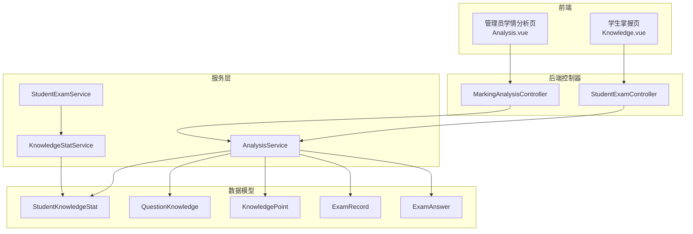
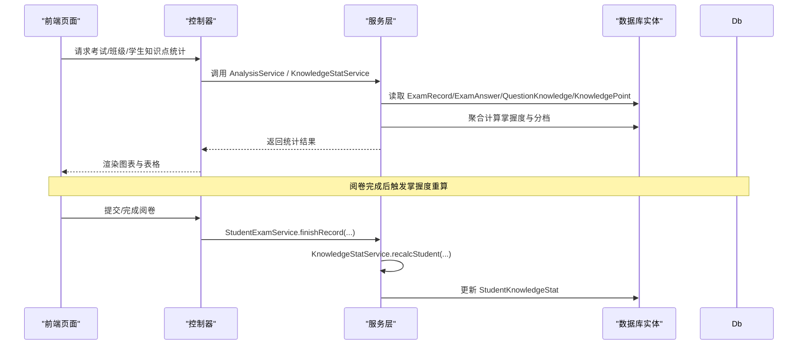
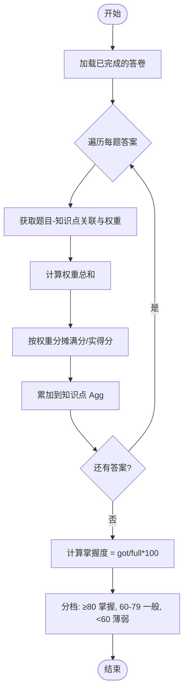
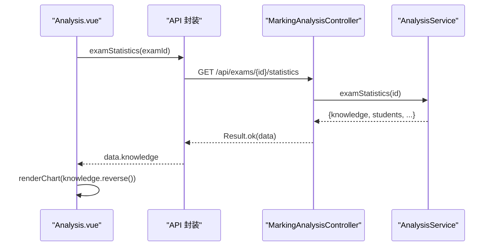
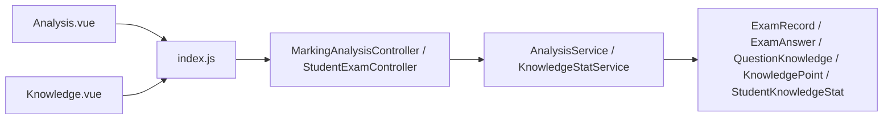

# 知识点掌握度分析

<cite>
**本文引用的文件**
- [KnowledgeStatService.java](file://exam-server/src/main/java/com/exam/service/KnowledgeStatService.java)
- [AnalysisService.java](file://exam-server/src/main/java/com/exam/service/AnalysisService.java)
- [MarkingAnalysisController.java](file://exam-server/src/main/java/com/exam/controller/MarkingAnalysisController.java)
- [StudentExamController.java](file://exam-server/src/main/java/com/exam/controller/StudentExamController.java)
- [StudentKnowledgeStat.java](file://exam-server/src/main/java/com/exam/entity/StudentKnowledgeStat.java)
- [QuestionKnowledge.java](file://exam-server/src/main/java/com/exam/entity/QuestionKnowledge.java)
- [KnowledgePoint.java](file://exam-server/src/main/java/com/exam/entity/KnowledgePoint.java)
- [ExamRecord.java](file://exam-server/src/main/java/com/exam/entity/ExamRecord.java)
- [ExamAnswer.java](file://exam-server/src/main/java/com/exam/entity/ExamAnswer.java)
- [StudentExamService.java](file://exam-server/src/main/java/com/exam/service/StudentExamService.java)
- [Analysis.vue](file://exam-web/src/views/admin/Analysis.vue)
- [Knowledge.vue](file://exam-web/src/views/student/Knowledge.vue)
- [index.js](file://exam-web/src/api/index.js)
</cite>

## 目录
1. [简介](#简介)
2. [项目结构](#项目结构)
3. [核心组件](#核心组件)
4. [架构总览](#架构总览)
5. [详细组件分析](#详细组件分析)
6. [依赖关系分析](#依赖关系分析)
7. [性能考虑](#性能考虑)
8. [故障排查指南](#故障排查指南)
9. [结论](#结论)
10. [附录](#附录)

## 简介
本功能围绕“知识点掌握度”的统计、展示与教学决策支持展开。系统通过阅卷结果与题目-知识点关联，计算每个知识点的“实得分/满分×100%”作为掌握度，并据此进行分档（≥80%为掌握、60–79%为一般、<60%为薄弱）。同时提供按考试、按班级、按学生三个维度的统计数据与可视化图表，帮助教师定位薄弱点并生成学习建议。

## 项目结构
- 后端服务层
  - 统计与回写：KnowledgeStatService 负责在阅卷完成后重算单个学生的知识点掌握汇总；AnalysisService 提供单场考试统计、班级维度聚合、学生维度查询等能力。
  - 控制器：MarkingAnalysisController 暴露阅卷、单场统计、班级/学生知识点分析、成绩导出等接口；StudentExamController 暴露学生端接口，包括查看个人知识点掌握度。
- 数据模型
  - StudentKnowledgeStat：学生-知识点掌握汇总（含掌握率、题量、得分等）。
  - QuestionKnowledge：题目与知识点的多对多映射及权重。
  - KnowledgePoint：知识点树节点。
  - ExamRecord/ExamAnswer：答卷与每题作答明细，承载分数与状态。
- 前端页面
  - 管理员学情分析页 Analysis.vue：选择考试或班级，渲染 ECharts 柱状图与表格，展示掌握度排序与分档。
  - 学生个人掌握页 Knowledge.vue：雷达图展示个人各知识点掌握度。

**图示来源**
- [Analysis.vue:60-84](file://exam-web/src/views/admin/Analysis.vue#L60-L84)
- [Knowledge.vue:27-37](file://exam-web/src/views/student/Knowledge.vue#L27-L37)
- [MarkingAnalysisController.java:55-73](file://exam-server/src/main/java/com/exam/controller/MarkingAnalysisController.java#L55-L73)
- [StudentExamController.java:67-71](file://exam-server/src/main/java/com/exam/controller/StudentExamController.java#L67-L71)
- [AnalysisService.java:46-145](file://exam-server/src/main/java/com/exam/service/AnalysisService.java#L46-L145)
- [KnowledgeStatService.java:34-100](file://exam-server/src/main/java/com/exam/service/KnowledgeStatService.java#L34-L100)
- [StudentKnowledgeStat.java:11-27](file://exam-server/src/main/java/com/exam/entity/StudentKnowledgeStat.java#L11-L27)
- [QuestionKnowledge.java:10-19](file://exam-server/src/main/java/com/exam/entity/QuestionKnowledge.java#L10-L19)
- [KnowledgePoint.java:10-24](file://exam-server/src/main/java/com/exam/entity/KnowledgePoint.java#L10-L24)
- [ExamRecord.java:11-28](file://exam-server/src/main/java/com/exam/entity/ExamRecord.java#L11-L28)
- [ExamAnswer.java:11-31](file://exam-server/src/main/java/com/exam/entity/ExamAnswer.java#L11-L31)

**章节来源**
- [Analysis.vue:60-84](file://exam-web/src/views/admin/Analysis.vue#L60-L84)
- [Knowledge.vue:27-37](file://exam-web/src/views/student/Knowledge.vue#L27-L37)
- [MarkingAnalysisController.java:55-73](file://exam-server/src/main/java/com/exam/controller/MarkingAnalysisController.java#L55-L73)
- [StudentExamController.java:67-71](file://exam-server/src/main/java/com/exam/controller/StudentExamController.java#L67-L71)
- [AnalysisService.java:46-145](file://exam-server/src/main/java/com/exam/service/AnalysisService.java#L46-L145)
- [KnowledgeStatService.java:34-100](file://exam-server/src/main/java/com/exam/service/KnowledgeStatService.java#L34-L100)

## 核心组件
- 掌握度计算与分档
  - 计算公式：掌握度 = 实得分 / 满分 × 100（百分比），采用 BigDecimal 精确计算并按四舍五入保留两位小数。
  - 分档标准：≥80% 为“掌握”，60–79% 为“一般”，<60% 为“薄弱”。
- 数据来源与聚合
  - 单场考试维度：遍历该场已完成的答卷与每题答案，结合题目-知识点关联与权重，将每道题的分值按比例分摊到对应知识点，累计得到该知识点的“实得分/满分”，再计算掌握度。
  - 班级维度：先获取班级内所有学生，再聚合其 StudentKnowledgeStat 中的 gotScore/fullScore/questionCount，重新计算班级层面的掌握度与分档。
  - 学生维度：直接读取该学生的 StudentKnowledgeStat 并按掌握度升序返回。
- 触发时机
  - 当一份答卷完成主观题阅卷或无简答题时，系统写入总分、是否及格，并调用 KnowledgeStatService 重算该生知识点掌握汇总。

**章节来源**
- [AnalysisService.java:163-212](file://exam-server/src/main/java/com/exam/service/AnalysisService.java#L163-L212)
- [AnalysisService.java:231-239](file://exam-server/src/main/java/com/exam/service/AnalysisService.java#L231-L239)
- [KnowledgeStatService.java:34-100](file://exam-server/src/main/java/com/exam/service/KnowledgeStatService.java#L34-L100)
- [StudentExamService.java:300-309](file://exam-server/src/main/java/com/exam/service/StudentExamService.java#L300-L309)

## 架构总览
下图展示了从前端请求到后端服务、再到数据模型的完整链路，以及阅卷完成后知识点掌握度重算的时序。

**图示来源**
- [MarkingAnalysisController.java:55-73](file://exam-server/src/main/java/com/exam/controller/MarkingAnalysisController.java#L55-L73)
- [StudentExamController.java:67-71](file://exam-server/src/main/java/com/exam/controller/StudentExamController.java#L67-L71)
- [AnalysisService.java:46-145](file://exam-server/src/main/java/com/exam/service/AnalysisService.java#L46-L145)
- [KnowledgeStatService.java:34-100](file://exam-server/src/main/java/com/exam/service/KnowledgeStatService.java#L34-L100)
- [StudentExamService.java:300-309](file://exam-server/src/main/java/com/exam/service/StudentExamService.java#L300-L309)

## 详细组件分析

### 掌握度计算与分档算法
- 单场考试维度（按答卷聚合）
  - 仅处理已完成（FINISHED）的答卷。
  - 对每道题的答案，查找其关联的知识点集合，计算权重总和；若未设置权重则默认均为 1。
  - 将每题的“满分/实得分”按权重比例分摊到各知识点，累加得到该知识点的 full/got。
  - 掌握度 = got / full × 100，分档由 level 方法判定。
- 学生维度（按历史汇总）
  - 基于 StudentKnowledgeStat 中已存储的 gotScore/fullScore/masteryRate 直接读取，并按 masteryRate 升序返回。
- 班级维度（跨学生聚合）
  - 取班级内所有学生的 StudentKnowledgeStat，按知识点聚合 gotScore/fullScore/questionCount，再统一计算掌握度与分档。

**图示来源**
- [AnalysisService.java:163-212](file://exam-server/src/main/java/com/exam/service/AnalysisService.java#L163-L212)
- [AnalysisService.java:231-239](file://exam-server/src/main/java/com/exam/service/AnalysisService.java#L231-L239)
- [KnowledgeStatService.java:34-100](file://exam-server/src/main/java/com/exam/service/KnowledgeStatService.java#L34-L100)

**章节来源**
- [AnalysisService.java:163-212](file://exam-server/src/main/java/com/exam/service/AnalysisService.java#L163-L212)
- [AnalysisService.java:231-239](file://exam-server/src/main/java/com/exam/service/AnalysisService.java#L231-L239)
- [KnowledgeStatService.java:34-100](file://exam-server/src/main/java/com/exam/service/KnowledgeStatService.java#L34-L100)

### ECharts 柱状图渲染实现（管理员学情分析）
- 数据源
  - 选择考试后调用 examStatistics，获取 knowledge 列表；选择班级后调用 classKnowledge，同样返回 knowledge 列表。
- 排序与展示
  - 前端将 knowledge 反转后传入图表，使掌握度从低到高显示（与后端排序方向一致）。
- 颜色配置
  - 系列项使用固定颜色（蓝色），便于统一视觉风格。
- 交互功能
  - tooltip 启用 axis 触发，便于横向对比不同知识点的掌握度。
- 表格联动
  - 表格列包含“掌握度 %”和“分档”，分档标签根据掌握度区间动态着色。

**图示来源**
- [Analysis.vue:60-84](file://exam-web/src/views/admin/Analysis.vue#L60-L84)
- [index.js:64-71](file://exam-web/src/api/index.js#L64-L71)
- [MarkingAnalysisController.java:55-73](file://exam-server/src/main/java/com/exam/controller/MarkingAnalysisController.java#L55-L73)
- [AnalysisService.java:46-97](file://exam-server/src/main/java/com/exam/service/AnalysisService.java#L46-L97)

**章节来源**
- [Analysis.vue:60-84](file://exam-web/src/views/admin/Analysis.vue#L60-L84)
- [index.js:64-71](file://exam-web/src/api/index.js#L64-L71)

### 知识点薄弱点识别算法
- 识别依据
  - 以掌握度 <60% 作为“薄弱”阈值，来源于统一的 level 判定逻辑。
- 数据来源
  - 单场考试：examKnowledge 聚合后的 rows，其中 level="薄弱" 即为薄弱点。
  - 班级维度：classKnowledge 聚合后同样按 level 筛选。
  - 学生维度：studentKnowledge 直接读取 masteryRate 并应用 level。
- 输出字段
  - 知识点名称、题量、实得分、满分、掌握度、分档，便于进一步分析与建议生成。

**章节来源**
- [AnalysisService.java:163-212](file://exam-server/src/main/java/com/exam/service/AnalysisService.java#L163-L212)
- [AnalysisService.java:231-239](file://exam-server/src/main/java/com/exam/service/AnalysisService.java#L231-L239)

### 学习建议生成机制
- 规则建议（可落地为前端提示或后续扩展）
  - 薄弱点（<60%）：建议重点复习相关知识点，结合错题回顾与专项练习。
  - 一般（60–79%）：建议巩固薄弱环节，适度增加练习量。
  - 掌握（≥80%）：建议保持训练，关注易错点与拓展提升。
- 数据来源
  - 基于 KnowledgeRow 中的 masteryRate 与 level 字段，结合 questionCount 判断题量覆盖是否充分。
- 扩展建议
  - 可将建议模板化，按知识点名称与薄弱程度动态生成个性化学习路径。

[本节为概念性说明，不直接分析具体代码文件]

### 班级对比分析与历史趋势分析方案
- 班级对比分析
  - 通过 classKnowledge(className) 获取某班各知识点掌握度，可与其它班级在同一视图下并列展示（前端可扩展多班级切换）。
  - 指标包括：掌握度、题量、分档，便于横向比较。
- 历史趋势分析
  - 当前实现侧重单场与班级聚合；如需历史趋势，可在前端增加时间轴维度，多次调用 examStatistics 或新增接口聚合多场考试的掌握度变化。
  - 也可基于 StudentKnowledgeStat 的 updatedAt 字段，按时间序列绘制趋势图。

[本节为方案设计说明，不直接分析具体代码文件]

## 依赖关系分析
- 控制器与服务
  - MarkingAnalysisController 依赖 AnalysisService 提供统计能力；StudentExamController 暴露学生端能力，内部也依赖 AnalysisService。
- 服务与数据模型
  - AnalysisService 依赖 ExamRecord/ExamAnswer/QuestionKnowledge/KnowledgePoint/StudentKnowledgeStat 等实体进行聚合计算。
  - KnowledgeStatService 在阅卷完成后重算 StudentKnowledgeStat。
- 前端与后端
  - Analysis.vue 与 Knowledge.vue 通过 index.js 中的 API 封装调用后端接口，渲染图表与表格。

**图示来源**
- [Analysis.vue:60-84](file://exam-web/src/views/admin/Analysis.vue#L60-L84)
- [Knowledge.vue:27-37](file://exam-web/src/views/student/Knowledge.vue#L27-L37)
- [index.js:64-71](file://exam-web/src/api/index.js#L64-L71)
- [MarkingAnalysisController.java:55-73](file://exam-server/src/main/java/com/exam/controller/MarkingAnalysisController.java#L55-L73)
- [StudentExamController.java:67-71](file://exam-server/src/main/java/com/exam/controller/StudentExamController.java#L67-L71)
- [AnalysisService.java:46-145](file://exam-server/src/main/java/com/exam/service/AnalysisService.java#L46-L145)
- [KnowledgeStatService.java:34-100](file://exam-server/src/main/java/com/exam/service/KnowledgeStatService.java#L34-L100)

**章节来源**
- [Analysis.vue:60-84](file://exam-web/src/views/admin/Analysis.vue#L60-L84)
- [Knowledge.vue:27-37](file://exam-web/src/views/student/Knowledge.vue#L27-L37)
- [index.js:64-71](file://exam-web/src/api/index.js#L64-L71)
- [MarkingAnalysisController.java:55-73](file://exam-server/src/main/java/com/exam/controller/MarkingAnalysisController.java#L55-L73)
- [StudentExamController.java:67-71](file://exam-server/src/main/java/com/exam/controller/StudentExamController.java#L67-L71)
- [AnalysisService.java:46-145](file://exam-server/src/main/java/com/exam/service/AnalysisService.java#L46-L145)
- [KnowledgeStatService.java:34-100](file://exam-server/src/main/java/com/exam/service/KnowledgeStatService.java#L34-L100)

## 性能考虑
- 聚合复杂度
  - 单场考试维度：对每份答卷的每题答案进行知识点关联与权重分摊，时间复杂度近似 O(N_answers × K_links)，K_links 为每题关联知识点数量。
  - 班级维度：先聚合学生统计，再按知识点汇总，避免重复查询题目详情。
- 数值精度
  - 使用 BigDecimal 与 RoundingMode.HALF_UP 保证百分比计算的准确性，避免浮点误差。
- 缓存与索引
  - 建议在高频查询字段（如 examId、studentId、knowledgePointId）建立索引以提升聚合效率。
- 前端渲染
  - ECharts 使用 nextTick 确保 DOM 就绪后再初始化图表，避免空引用错误。

[本节提供通用性能指导，不直接分析具体代码文件]

## 故障排查指南
- 掌握度为空或为零
  - 检查答卷状态是否为 FINISHED；若无简答题，需确保 finishRecord 被正确调用并触发 recalcStudent。
  - 确认题目-知识点关联是否存在，否则无法分摊分值。
- 班级维度无数据
  - 确认班级内学生是否存在且具备 StudentKnowledgeStat 记录；若无，需等待阅卷完成或手动触发重算。
- 图表不显示
  - 检查前端是否正确获取 knowledge 列表；确认 chartEl 存在后再初始化 ECharts。
- 分档异常
  - 核对 level 判定逻辑与掌握度计算是否一致；确保满分不为零以避免除零。

**章节来源**
- [StudentExamService.java:300-309](file://exam-server/src/main/java/com/exam/service/StudentExamService.java#L300-L309)
- [KnowledgeStatService.java:34-100](file://exam-server/src/main/java/com/exam/service/KnowledgeStatService.java#L34-L100)
- [Analysis.vue:60-84](file://exam-web/src/views/admin/Analysis.vue#L60-L84)

## 结论
本功能通过严谨的掌握度计算与分档逻辑，结合单场、班级、学生多维度的统计与可视化，有效支撑教学诊断与学习建议生成。未来可在此基础上扩展历史趋势分析、班级对比视图与个性化学习路径推荐，进一步提升学情分析的深度与广度。

## 附录
- 关键接口一览
  - 单场考试统计：GET /api/exams/{id}/statistics
  - 班级知识点分析：GET /api/analysis/classes/{className}/knowledge
  - 学生知识点掌握：GET /api/student/knowledge-stats
- 关键数据模型
  - StudentKnowledgeStat：掌握度汇总（gotScore/fullScore/masteryRate/questionCount）
  - QuestionKnowledge：题目-知识点关联与权重
  - KnowledgePoint：知识点树节点
  - ExamRecord/ExamAnswer：答卷与作答明细

[本节为补充信息，不直接分析具体代码文件]