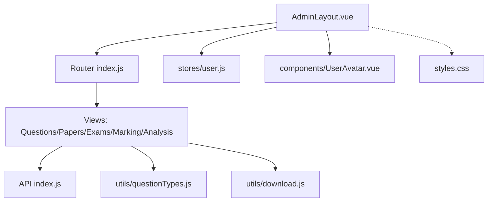
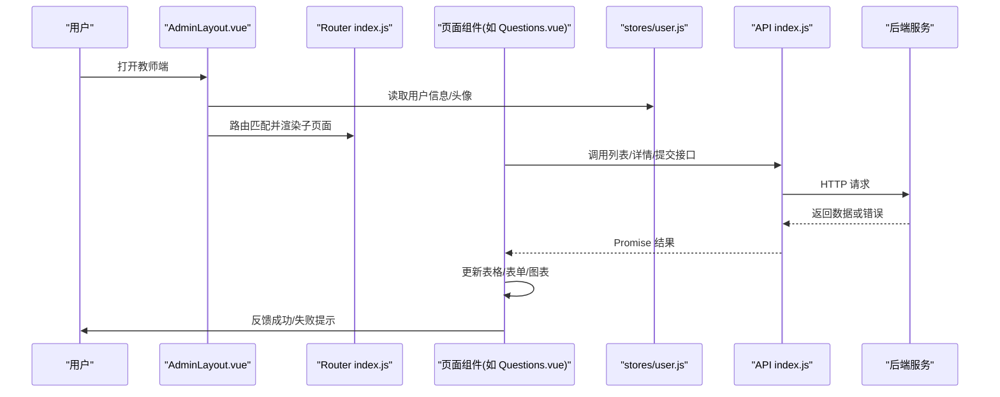
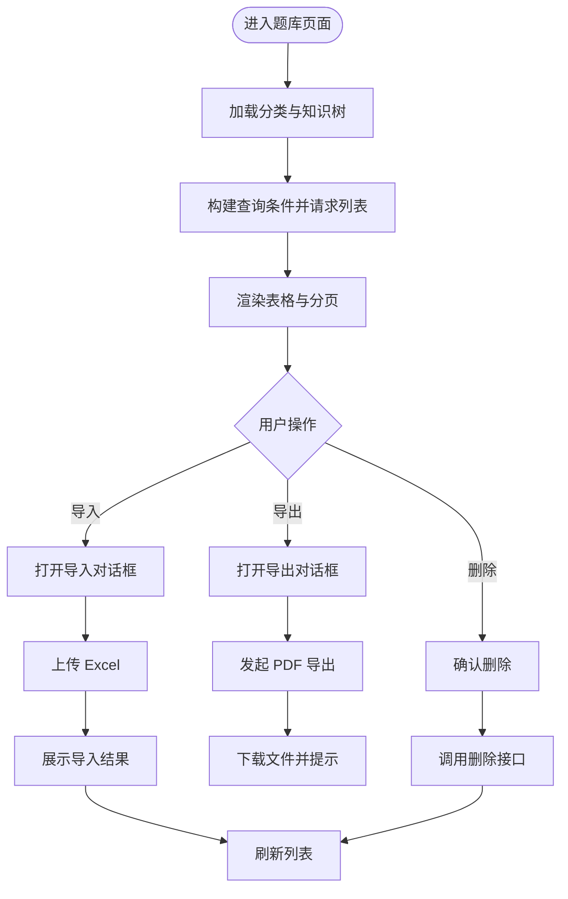
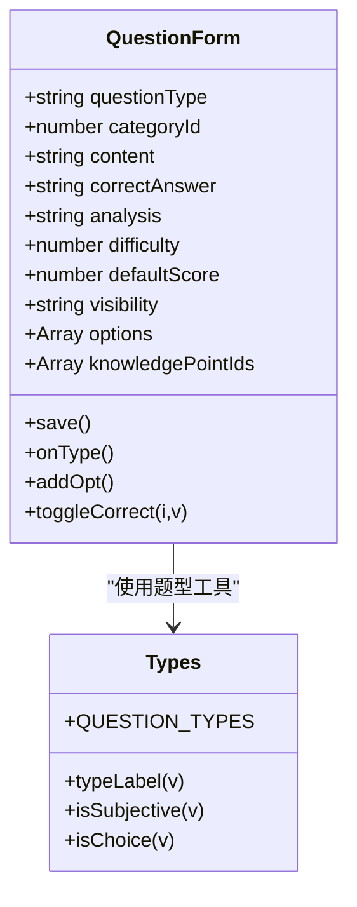
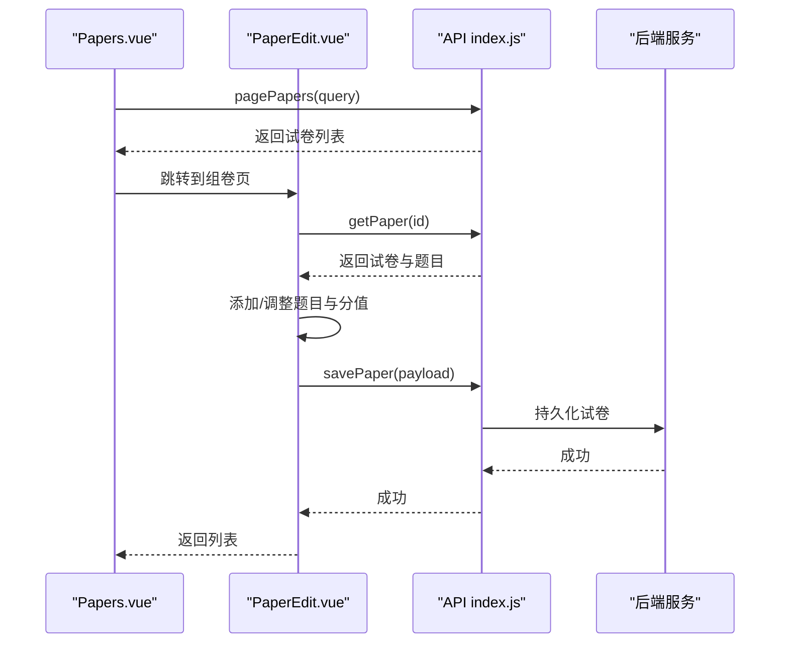
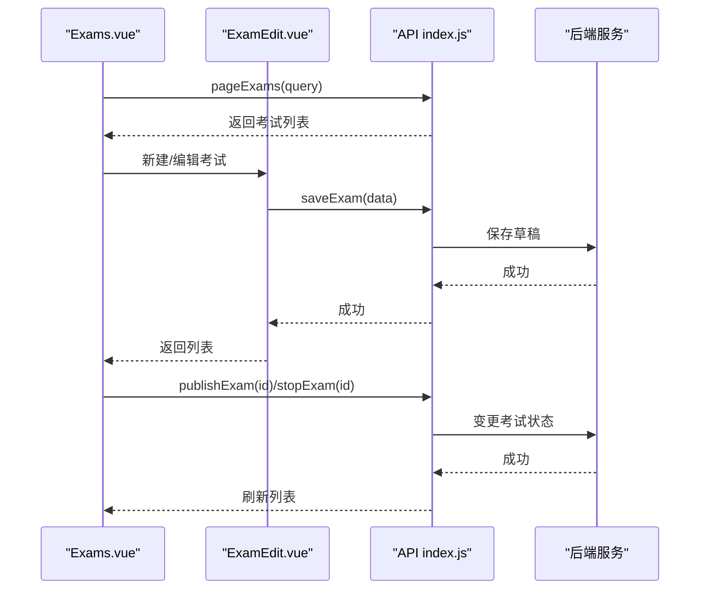
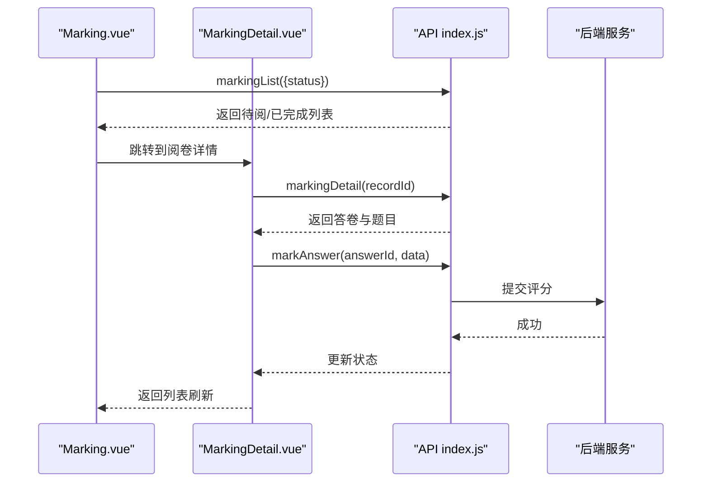
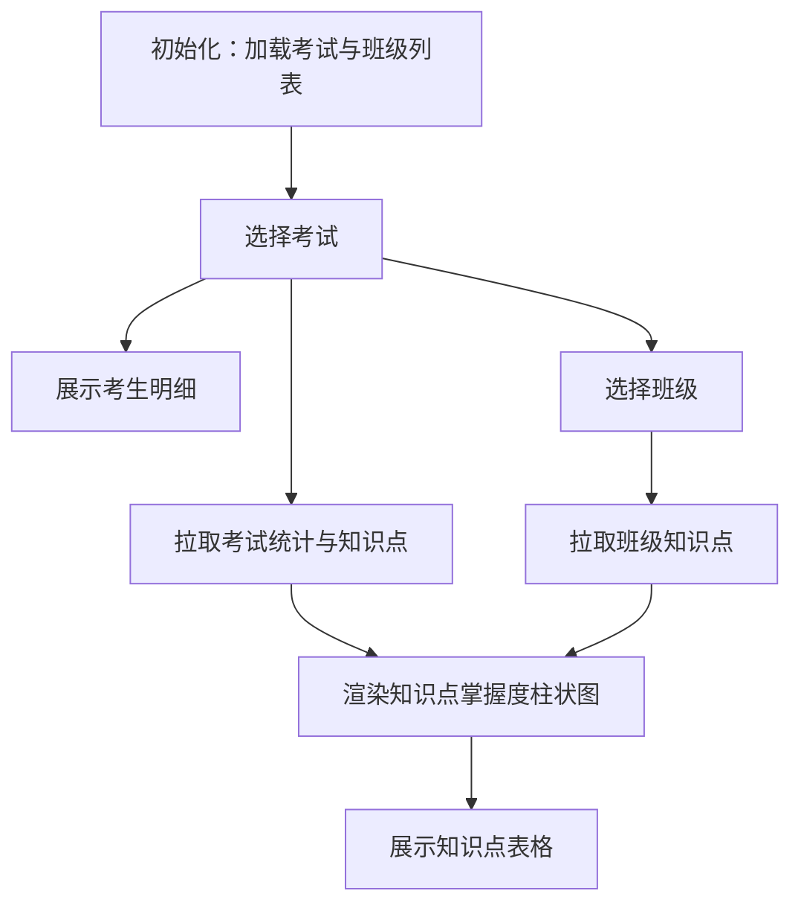
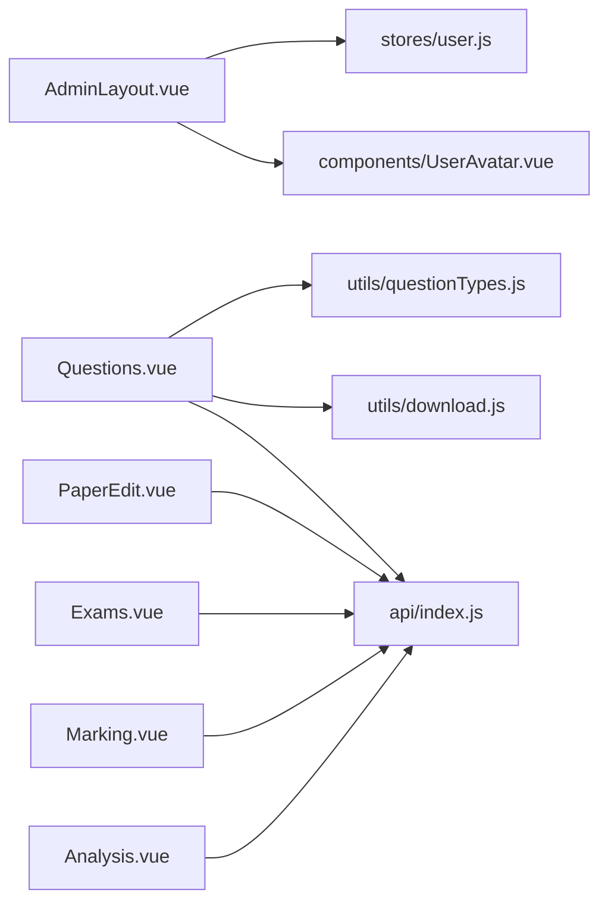

# 教师端界面

<cite>
**本文引用的文件**
- [AdminLayout.vue](file://exam-web/src/layouts/AdminLayout.vue)
- [index.js（路由）](file://exam-web/src/router/index.js)
- [index.js（API）](file://exam-web/src/api/index.js)
- [user.js（用户状态）](file://exam-web/src/stores/user.js)
- [Questions.vue](file://exam-web/src/views/admin/Questions.vue)
- [QuestionEdit.vue](file://exam-web/src/views/admin/QuestionEdit.vue)
- [Papers.vue](file://exam-web/src/views/admin/Papers.vue)
- [PaperEdit.vue](file://exam-web/src/views/admin/PaperEdit.vue)
- [Exams.vue](file://exam-web/src/views/admin/Exams.vue)
- [ExamEdit.vue](file://exam-web/src/views/admin/ExamEdit.vue)
- [Marking.vue](file://exam-web/src/views/admin/Marking.vue)
- [Analysis.vue](file://exam-web/src/views/admin/Analysis.vue)
- [questionTypes.js](file://exam-web/src/utils/questionTypes.js)
- [download.js](file://exam-web/src/utils/download.js)
- [styles.css](file://exam-web/src/styles.css)
- [UserAvatar.vue](file://exam-web/src/components/UserAvatar.vue)
</cite>

## 目录
1. [简介](#简介)
2. [项目结构](#项目结构)
3. [核心组件](#核心组件)
4. [架构总览](#架构总览)
5. [详细组件分析](#详细组件分析)
6. [依赖关系分析](#依赖关系分析)
7. [性能与可访问性](#性能与可访问性)
8. [故障排查指南](#故障排查指南)
9. [结论](#结论)
10. [附录：样式定制与使用示例](#附录样式定制与使用示例)

## 简介
本文档面向教师端界面的实现说明，覆盖基于 Vue 3 的管理后台布局、导航菜单设计以及题库管理、试卷组卷、考试管理、阅卷评分、学情分析等核心功能模块。文档从页面结构与数据流出发，解释表单处理、表格展示、图表可视化、跨页面数据传递、错误处理与响应式适配，并提供组件使用示例与样式定制建议，帮助读者快速理解并扩展教师端能力。

## 项目结构
教师端前端位于 exam-web 目录，采用“布局 + 视图 + 路由 + 状态 + API + 工具”的分层组织方式：
- 布局：AdminLayout 提供侧边栏、顶部操作区与内容区，承载所有教师端子页面。
- 路由：集中定义 /admin 下的子路由，支持懒加载与权限守卫。
- 视图：按业务模块划分 Questions、Papers、Exams、Marking、Analysis 等页面。
- 状态：Pinia 的 user store 管理登录态、头像与角色信息。
- API：统一封装后端接口调用，包括题库、试卷、考试、阅卷、分析等。
- 工具：题型常量、下载与 Blob 错误解析等通用方法。
- 样式：全局 CSS 变量与常用布局类，支撑主题与响应式。

图示来源
- [AdminLayout.vue:1-43](file://exam-web/src/layouts/AdminLayout.vue#L1-L43)
- [index.js（路由）:1-67](file://exam-web/src/router/index.js#L1-L67)
- [index.js（API）:1-82](file://exam-web/src/api/index.js#L1-L82)
- [user.js（用户状态）:1-98](file://exam-web/src/stores/user.js#L1-L98)
- [questionTypes.js:1-11](file://exam-web/src/utils/questionTypes.js#L1-L11)
- [download.js:1-52](file://exam-web/src/utils/download.js#L1-L52)
- [styles.css:1-54](file://exam-web/src/styles.css#L1-L54)
- [UserAvatar.vue:1-54](file://exam-web/src/components/UserAvatar.vue#L1-L54)

章节来源
- [AdminLayout.vue:1-187](file://exam-web/src/layouts/AdminLayout.vue#L1-L187)
- [index.js（路由）:1-67](file://exam-web/src/router/index.js#L1-L67)
- [index.js（API）:1-82](file://exam-web/src/api/index.js#L1-L82)
- [user.js（用户状态）:1-98](file://exam-web/src/stores/user.js#L1-L98)
- [styles.css:1-54](file://exam-web/src/styles.css#L1-L54)

## 核心组件
- AdminLayout 布局组件
  - 左侧导航：使用 Element Plus 菜单，动态高亮当前路由；根据用户角色显示不同菜单项。
  - 顶部区域：显示用户头像、姓名与角色标签，提供退出登录按钮。
  - 内容区：通过 router-view 渲染具体页面。
  - 交互：挂载时自动加载头像；点击退出后跳转至登录页。
- 用户状态 store
  - 维护 token、用户信息、头像 URL 与加载状态；提供登录、获取当前用户、头像上传/拉取、登出等方法。
  - 计算属性：管理员/教师/学生角色判断与显示名称。
- 路由与权限
  - 路由守卫：未登录重定向到登录页；学生不能进入 /admin，教师不能进入 /student 和答题页。
  - 懒加载：各页面按需引入，减少首屏体积。

章节来源
- [AdminLayout.vue:45-80](file://exam-web/src/layouts/AdminLayout.vue#L45-L80)
- [user.js（用户状态）:6-98](file://exam-web/src/stores/user.js#L6-L98)
- [index.js（路由）:47-64](file://exam-web/src/router/index.js#L47-L64)

## 架构总览
教师端以 AdminLayout 为壳，内部页面通过路由切换；页面统一通过 API 层调用后端服务；状态集中在 Pinia store；工具函数复用下载与题型逻辑；样式通过 CSS 变量与公共类统一管理。

图示来源
- [AdminLayout.vue:1-43](file://exam-web/src/layouts/AdminLayout.vue#L1-L43)
- [index.js（路由）:1-67](file://exam-web/src/router/index.js#L1-L67)
- [index.js（API）:1-82](file://exam-web/src/api/index.js#L1-L82)
- [user.js（用户状态）:1-98](file://exam-web/src/stores/user.js#L1-L98)

## 详细组件分析

### 题库管理（Questions）
- 功能要点
  - 列表分页：支持按题型、分类（知识点根）、关键词筛选，分页控件绑定查询参数。
  - 批量操作：多选行用于导出 PDF；清空选择快捷操作。
  - 导入导出：下载模板、Excel 导入（带默认知识点树选择）、PDF 导出（可选附带答案）。
  - 删除确认：二次确认后执行逻辑删除。
- 数据流
  - 初始化加载分类与知识树；查询列表；导入/导出通过 Blob 响应处理文件名与错误提示。
- 交互流程
  - 导入：打开对话框 -> 选择文件 -> 上传 -> 显示结果（成功/失败明细）-> 关闭后刷新列表。
  - 导出：选择题目 -> 填写标题与是否附带答案 -> 发起导出 -> 下载文件 -> 提示成功。
- 关键实现路径
  - 列表与分页：[Questions.vue:18-47](file://exam-web/src/views/admin/Questions.vue#L18-L47)
  - 导入弹窗与上传：[Questions.vue:49-87](file://exam-web/src/views/admin/Questions.vue#L49-L87)
  - 导出弹窗与下载：[Questions.vue:89-100](file://exam-web/src/views/admin/Questions.vue#L89-L100)
  - 查询与删除：[Questions.vue:131-146](file://exam-web/src/views/admin/Questions.vue#L131-L146)
  - 导入/导出调用：[Questions.vue:148-199](file://exam-web/src/views/admin/Questions.vue#L148-L199)
  - 初始化与挂载：[Questions.vue:201-204](file://exam-web/src/views/admin/Questions.vue#L201-L204)
  - API 封装：[index.js（API）:36-51](file://exam-web/src/api/index.js#L36-L51)
  - 下载工具：[download.js:1-52](file://exam-web/src/utils/download.js#L1-L52)

图示来源
- [Questions.vue:18-100](file://exam-web/src/views/admin/Questions.vue#L18-L100)
- [download.js:1-52](file://exam-web/src/utils/download.js#L1-L52)
- [index.js（API）:36-51](file://exam-web/src/api/index.js#L36-L51)

章节来源
- [Questions.vue:1-212](file://exam-web/src/views/admin/Questions.vue#L1-L212)
- [index.js（API）:36-51](file://exam-web/src/api/index.js#L36-L51)
- [download.js:1-52](file://exam-web/src/utils/download.js#L1-L52)

### 题目编辑（QuestionEdit）
- 功能要点
  - 题型切换：单选/多选/判断/填空/简答/关键词解释，动态生成选项与必填字段。
  - 分类与知识点：选择分类（知识点根），勾选多个知识点节点。
  - 保存：提交题目数据（含选项、参考答案、解析、难度、可见范围、知识点）。
- 数据流
  - 加载分类与知识树；编辑模式加载题目详情；保存成功后返回列表。
- 关键实现路径
  - 表单与题型逻辑：[QuestionEdit.vue:8-57](file://exam-web/src/views/admin/QuestionEdit.vue#L8-L57)
  - 选项增删与正确答案设置：[QuestionEdit.vue:80-102](file://exam-web/src/views/admin/QuestionEdit.vue#L80-L102)
  - 保存与回退：[QuestionEdit.vue:103-108](file://exam-web/src/views/admin/QuestionEdit.vue#L103-L108)
  - 初始化与详情回填：[QuestionEdit.vue:109-121](file://exam-web/src/views/admin/QuestionEdit.vue#L109-L121)
  - 题型工具：[questionTypes.js:1-11](file://exam-web/src/utils/questionTypes.js#L1-L11)
  - API 封装：[index.js（API）:36-43](file://exam-web/src/api/index.js#L36-L43)

图示来源
- [QuestionEdit.vue:8-121](file://exam-web/src/views/admin/QuestionEdit.vue#L8-L121)
- [questionTypes.js:1-11](file://exam-web/src/utils/questionTypes.js#L1-L11)

章节来源
- [QuestionEdit.vue:1-128](file://exam-web/src/views/admin/QuestionEdit.vue#L1-L128)
- [questionTypes.js:1-11](file://exam-web/src/utils/questionTypes.js#L1-L11)
- [index.js（API）:36-43](file://exam-web/src/api/index.js#L36-L43)

### 试卷组卷（Papers）
- 功能要点
  - 列表展示：名称、题量、总分、及格分，支持搜索与分页。
  - 组卷编辑：新增/编辑试卷，添加题目、设置分值、移除题目，保存后返回列表。
- 数据流
  - 列表分页查询；编辑页加载试卷详情与题目集合；保存时提交题目顺序与分值。
- 关键实现路径
  - 列表与删除：[Papers.vue:7-43](file://exam-web/src/views/admin/Papers.vue#L7-L43)
  - 组卷表单与题目添加：[PaperEdit.vue:7-40](file://exam-web/src/views/admin/PaperEdit.vue#L7-L40)
  - 总分计算与保存：[PaperEdit.vue:52-80](file://exam-web/src/views/admin/PaperEdit.vue#L52-L80)
  - 初始化与详情回填：[PaperEdit.vue:81-96](file://exam-web/src/views/admin/PaperEdit.vue#L81-L96)
  - API 封装：[index.js（API）:53-57](file://exam-web/src/api/index.js#L53-L57)

图示来源
- [Papers.vue:7-43](file://exam-web/src/views/admin/Papers.vue#L7-L43)
- [PaperEdit.vue:7-96](file://exam-web/src/views/admin/PaperEdit.vue#L7-L96)
- [index.js（API）:53-57](file://exam-web/src/api/index.js#L53-L57)

章节来源
- [Papers.vue:1-44](file://exam-web/src/views/admin/Papers.vue#L1-L44)
- [PaperEdit.vue:1-98](file://exam-web/src/views/admin/PaperEdit.vue#L1-L98)
- [index.js（API）:53-57](file://exam-web/src/api/index.js#L53-L57)

### 考试管理（Exams）
- 功能要点
  - 列表展示：考试名称、关联试卷、时间区间、状态、考生数与已交人数。
  - 操作：草稿状态可编辑与发布；进行中可停止；支持跳转到分析页。
- 数据流
  - 列表分页查询；发布/停止调用对应接口；分析页通过路由参数携带 examId。
- 关键实现路径
  - 列表与状态映射：[Exams.vue:7-29](file://exam-web/src/views/admin/Exams.vue#L7-L29)
  - 发布与停止：[Exams.vue:45-55](file://exam-web/src/views/admin/Exams.vue#L45-L55)
  - 新建/编辑表单：[ExamEdit.vue:4-25](file://exam-web/src/views/admin/ExamEdit.vue#L4-L25)
  - 保存与回填：[ExamEdit.vue:43-61](file://exam-web/src/views/admin/ExamEdit.vue#L43-L61)
  - API 封装：[index.js（API）:59-64](file://exam-web/src/api/index.js#L59-L64)

图示来源
- [Exams.vue:7-55](file://exam-web/src/views/admin/Exams.vue#L7-L55)
- [ExamEdit.vue:4-61](file://exam-web/src/views/admin/ExamEdit.vue#L4-L61)
- [index.js（API）:59-64](file://exam-web/src/api/index.js#L59-L64)

章节来源
- [Exams.vue:1-58](file://exam-web/src/views/admin/Exams.vue#L1-L58)
- [ExamEdit.vue:1-63](file://exam-web/src/views/admin/ExamEdit.vue#L1-L63)
- [index.js（API）:59-64](file://exam-web/src/api/index.js#L59-L64)

### 阅卷评分（Marking）
- 功能要点
  - 待办列表：仅主观题（简答/关键词解释），显示考试、学生信息、班级、状态、未批主观题数量、客观题得分。
  - 进入阅卷：跳转到详情页进行评分（详情页由路由配置）。
- 数据流
  - 根据状态过滤列表；点击阅卷进入详情页；详情页负责提交评分。
- 关键实现路径
  - 列表与状态过滤：[Marking.vue:4-24](file://exam-web/src/views/admin/Marking.vue#L4-L24)
  - 列表加载：[Marking.vue:28-36](file://exam-web/src/views/admin/Marking.vue#L28-L36)
  - API 封装：[index.js（API）:66-68](file://exam-web/src/api/index.js#L66-L68)

图示来源
- [Marking.vue:4-36](file://exam-web/src/views/admin/Marking.vue#L4-L36)
- [index.js（API）:66-68](file://exam-web/src/api/index.js#L66-L68)

章节来源
- [Marking.vue:1-38](file://exam-web/src/views/admin/Marking.vue#L1-L38)
- [index.js（API）:66-68](file://exam-web/src/api/index.js#L66-L68)

### 学情分析（Analysis）
- 功能要点
  - 统计卡片：应考人数、已交卷人数、平均分、及格率。
  - 知识点掌握度：柱状图展示（从低到高排序），表格列出知识点、掌握度百分比与分档。
  - 考生明细：学号、姓名、状态、总分、是否及格。
  - 班级薄弱点：按班级维度查看知识点掌握情况。
- 数据流
  - 初始化加载考试列表与班级列表；选择考试后拉取统计数据与知识点；选择班级后拉取班级维度知识点；使用 ECharts 渲染图表。
- 关键实现路径
  - 统计与图表渲染：[Analysis.vue:13-20](file://exam-web/src/views/admin/Analysis.vue#L13-L20)
  - 图表绘制逻辑：[Analysis.vue:60-72](file://exam-web/src/views/admin/Analysis.vue#L60-L72)
  - 考试与班级数据加载：[Analysis.vue:73-84](file://exam-web/src/views/admin/Analysis.vue#L73-L84)
  - 初始化与路由参数处理：[Analysis.vue:85-90](file://exam-web/src/views/admin/Analysis.vue#L85-L90)
  - API 封装：[index.js（API）:64-72](file://exam-web/src/api/index.js#L64-L72)

图示来源
- [Analysis.vue:13-90](file://exam-web/src/views/admin/Analysis.vue#L13-L90)
- [index.js（API）:64-72](file://exam-web/src/api/index.js#L64-L72)

章节来源
- [Analysis.vue:1-92](file://exam-web/src/views/admin/Analysis.vue#L1-L92)
- [index.js（API）:64-72](file://exam-web/src/api/index.js#L64-L72)

### 页面间数据传递与路由
- 路由参数
  - 编辑页通过路由参数 id 区分新增与编辑（如 questions/edit/:id?、papers/edit/:id?、exams/edit/:id?）。
  - 分析页通过 query 参数 examId 指定考试（/admin/analysis?examId=...）。
- 导航与权限
  - 路由守卫限制学生与教师访问不同区域；未登录强制跳转登录页。
- 关键实现路径
  - 路由定义与守卫：[index.js（路由）:1-67](file://exam-web/src/router/index.js#L1-L67)

章节来源
- [index.js（路由）:1-67](file://exam-web/src/router/index.js#L1-L67)

## 依赖关系分析
- 组件耦合
  - AdminLayout 依赖 user store 与 UserAvatar；页面组件依赖 API 与工具函数。
  - 题型工具被多处复用，保证前后端枚举一致。
- 外部依赖
  - Element Plus：菜单、表单、表格、分页、对话框等 UI 组件。
  - ECharts：学情分析图表可视化。
  - Axios（http.js）：HTTP 请求封装与拦截器（在 http.js 中）。
- 潜在循环依赖
  - 无直接循环引用；API 与页面单向依赖。

图示来源
- [AdminLayout.vue:1-80](file://exam-web/src/layouts/AdminLayout.vue#L1-L80)
- [user.js（用户状态）:1-98](file://exam-web/src/stores/user.js#L1-L98)
- [UserAvatar.vue:1-54](file://exam-web/src/components/UserAvatar.vue#L1-L54)
- [Questions.vue:104-113](file://exam-web/src/views/admin/Questions.vue#L104-L113)
- [PaperEdit.vue:43-49](file://exam-web/src/views/admin/PaperEdit.vue#L43-L49)
- [Exams.vue:33-37](file://exam-web/src/views/admin/Exams.vue#L33-L37)
- [Marking.vue:28-31](file://exam-web/src/views/admin/Marking.vue#L28-L31)
- [Analysis.vue:44-49](file://exam-web/src/views/admin/Analysis.vue#L44-L49)
- [index.js（API）:1-82](file://exam-web/src/api/index.js#L1-L82)

章节来源
- [AdminLayout.vue:1-80](file://exam-web/src/layouts/AdminLayout.vue#L1-L80)
- [index.js（API）:1-82](file://exam-web/src/api/index.js#L1-L82)

## 性能与可访问性
- 性能优化
  - 路由懒加载：页面按需引入，降低首屏资源体积。
  - 列表分页：避免一次性加载大量数据。
  - 图表实例复用：ECharts 实例在组件生命周期内复用，减少重复初始化开销。
  - Blob 下载：使用对象 URL 并释放，避免内存泄漏。
- 可访问性与体验
  - 表单元素具备明确占位与提示；表格列宽合理，长文本溢出隐藏。
  - 响应式：统计卡片在小屏幕下自适应网格布局。
  - 错误提示：统一使用 ElMessage 与 ElMessageBox 提供友好反馈。

章节来源
- [index.js（路由）:1-67](file://exam-web/src/router/index.js#L1-L67)
- [Analysis.vue:60-72](file://exam-web/src/views/admin/Analysis.vue#L60-L72)
- [download.js:1-52](file://exam-web/src/utils/download.js#L1-L52)
- [styles.css:36-54](file://exam-web/src/styles.css#L36-L54)

## 故障排查指南
- 登录态异常
  - 现象：页面无法加载或频繁跳转登录页。
  - 排查：检查 localStorage 中的 token 与 user；确认路由守卫逻辑；验证 me 接口可用性。
  - 参考：[user.js（用户状态）:39-46](file://exam-web/src/stores/user.js#L39-L46)、[index.js（路由）:47-64](file://exam-web/src/router/index.js#L47-L64)
- 头像不显示
  - 现象：头像为空或加载失败。
  - 排查：确认 getMyAvatar 返回类型与大小；检查 blobErrorMessage 分支；清理对象 URL。
  - 参考：[user.js（用户状态）:47-67](file://exam-web/src/stores/user.js#L47-L67)
- 导入/导出失败
  - 现象：Excel 导入报错或 PDF 导出失败。
  - 排查：检查 Content-Disposition 文件名解析；确认后端返回是否为 JSON 错误；查看 blobErrorMessage 返回值。
  - 参考：[download.js:1-52](file://exam-web/src/utils/download.js#L1-L52)、[Questions.vue:148-199](file://exam-web/src/views/admin/Questions.vue#L148-L199)
- 图表不渲染
  - 现象：学情分析图表空白。
  - 排查：确保 nextTick 后 DOM 存在；检查 chart 实例是否初始化；确认数据格式与最大值设置。
  - 参考：[Analysis.vue:60-72](file://exam-web/src/views/admin/Analysis.vue#L60-L72)

章节来源
- [user.js（用户状态）:39-67](file://exam-web/src/stores/user.js#L39-L67)
- [index.js（路由）:47-64](file://exam-web/src/router/index.js#L47-L64)
- [download.js:1-52](file://exam-web/src/utils/download.js#L1-L52)
- [Questions.vue:148-199](file://exam-web/src/views/admin/Questions.vue#L148-L199)
- [Analysis.vue:60-72](file://exam-web/src/views/admin/Analysis.vue#L60-L72)

## 结论
教师端界面以清晰的布局与模块化设计实现了题库管理、试卷组卷、考试管理、阅卷评分与学情分析等核心能力。通过统一的 API 层与工具函数，保证了代码复用与一致性；借助路由守卫与状态管理，提供了安全的访问控制与良好的用户体验。建议在后续迭代中继续强化错误边界、增加单元测试与性能监控，以提升系统的稳定性与可维护性。

## 附录：样式定制与使用示例
- 样式定制
  - 主题色与布局：通过 CSS 变量 --sidebar、--accent、--page、--line、--text、--muted 统一控制颜色与背景。
  - 页面头部与卡片：使用 .page-head 与 .card 类快速搭建页面区块。
  - 统计卡片网格：.stat-grid 在小屏幕下自动切换为两列布局。
  - 参考：[styles.css:1-54](file://exam-web/src/styles.css#L1-L54)
- 组件使用示例
  - 用户头像：在 AdminLayout 与学生/教师布局中使用 UserAvatar，支持尺寸与点击上传。
    - 参考：[UserAvatar.vue:1-54](file://exam-web/src/components/UserAvatar.vue#L1-L54)
  - 题型工具：在题目编辑与列表中使用 QUESTION_TYPES、typeLabel、isSubjective、isChoice。
    - 参考：[questionTypes.js:1-11](file://exam-web/src/utils/questionTypes.js#L1-L11)
  - 下载与错误处理：在导入/导出场景使用 downloadBlob、safeFileName、blobErrorMessage。
    - 参考：[download.js:1-52](file://exam-web/src/utils/download.js#L1-L52)

章节来源
- [styles.css:1-54](file://exam-web/src/styles.css#L1-L54)
- [UserAvatar.vue:1-54](file://exam-web/src/components/UserAvatar.vue#L1-L54)
- [questionTypes.js:1-11](file://exam-web/src/utils/questionTypes.js#L1-L11)
- [download.js:1-52](file://exam-web/src/utils/download.js#L1-L52)