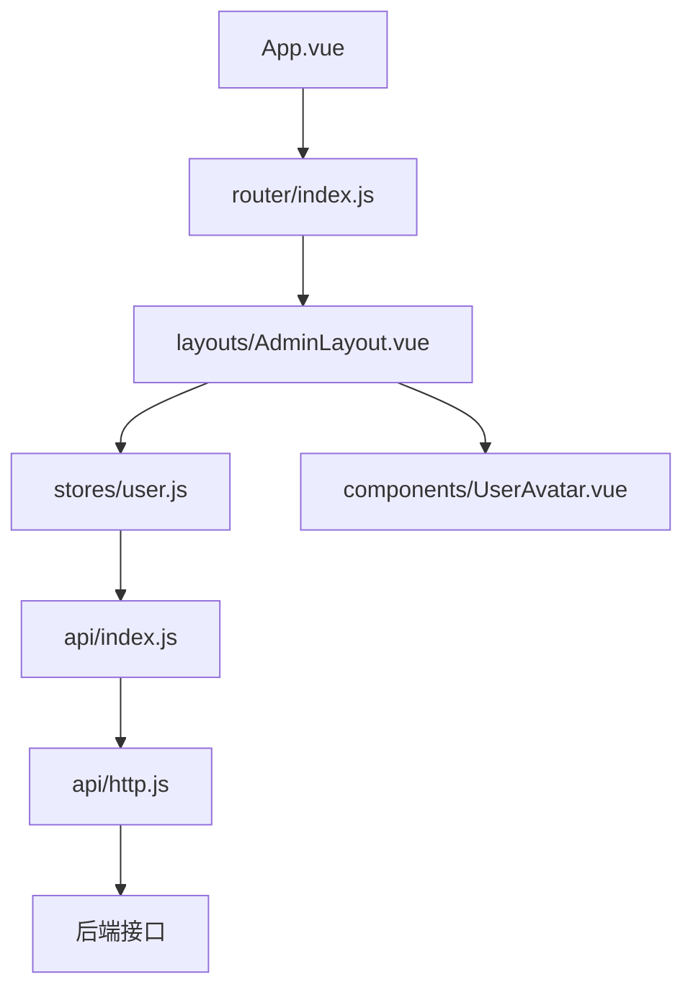
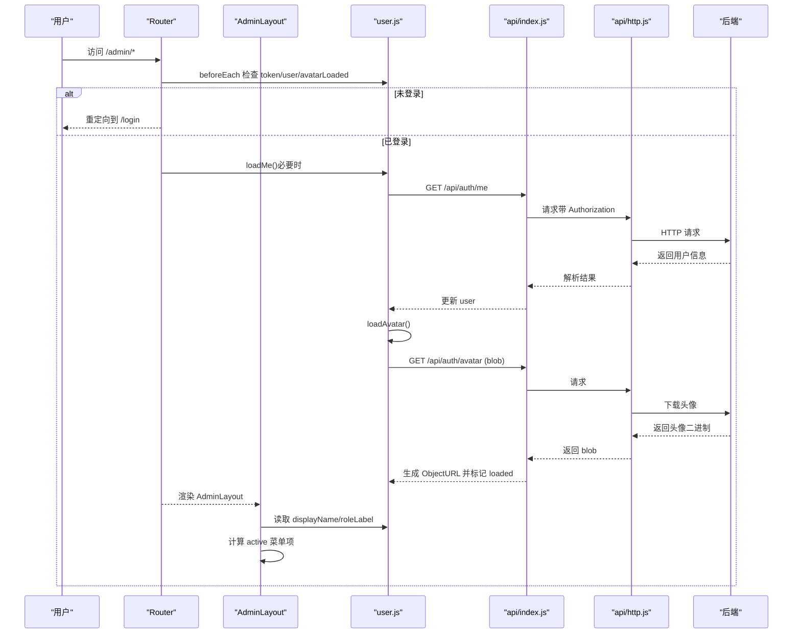
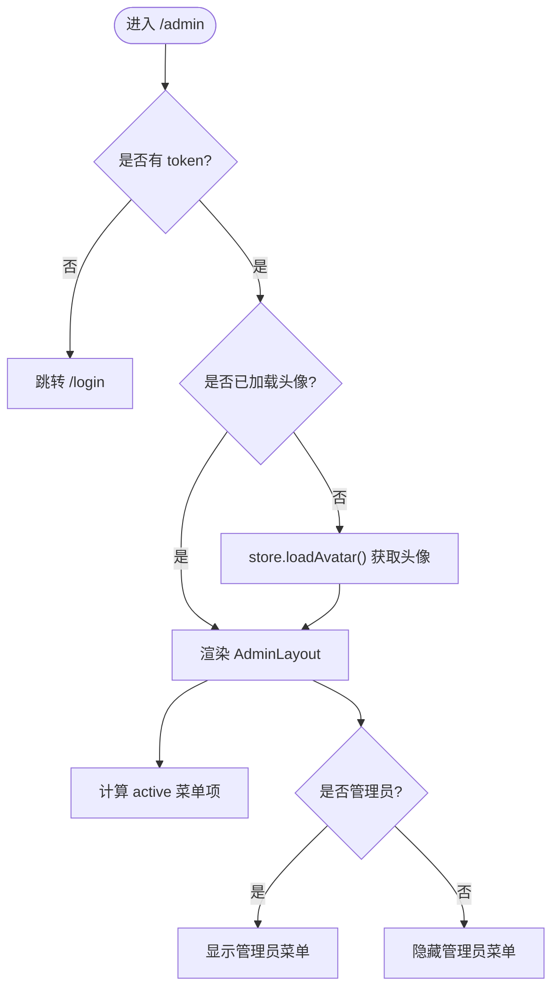
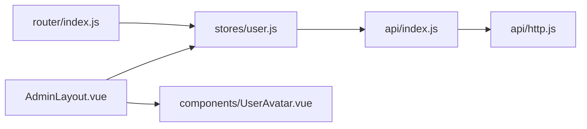

# 管理布局组件

<cite>
**本文引用的文件**
- [AdminLayout.vue](file://exam-web/src/layouts/AdminLayout.vue)
- [user.js](file://exam-web/src/stores/user.js)
- [UserAvatar.vue](file://exam-web/src/components/UserAvatar.vue)
- [index.js](file://exam-web/src/router/index.js)
- [http.js](file://exam-web/src/api/http.js)
- [index.js](file://exam-web/src/api/index.js)
- [styles.css](file://exam-web/src/styles.css)
- [App.vue](file://exam-web/src/App.vue)
</cite>

## 目录
1. [简介](#简介)
2. [项目结构](#项目结构)
3. [核心组件与职责](#核心组件与职责)
4. [架构总览](#架构总览)
5. [详细组件分析](#详细组件分析)
6. [依赖关系分析](#依赖关系分析)
7. [性能与可维护性](#性能与可维护性)
8. [故障排查指南](#故障排查指南)
9. [结论](#结论)
10. [附录：使用示例与扩展指南](#附录使用示例与扩展指南)

## 简介
本文件面向教师端主布局组件 AdminLayout.vue，系统性说明其作为后台管理布局的职责与实现：侧边栏导航菜单、用户信息展示区域、顶部操作栏、路由视图容器；并解释菜单项的动态显示逻辑、角色权限控制（管理员/教师）、头像加载机制、退出登录流程、响应式布局设计、样式定制选项以及与其他组件的集成方式。文末提供使用示例与扩展指南，帮助快速上手与二次开发。

## 项目结构
- 应用入口 App.vue 仅渲染 router-view，由路由决定具体页面或布局。
- 路由 index.js 将 /admin 路径映射到 AdminLayout.vue，并挂载多个子路由（工作台、账号管理、学生管理、题库、试卷、考试、阅卷、成绩、学情分析、日志等）。
- 状态管理 user.js 集中管理登录态、用户信息、头像 URL 与加载状态，并提供登录、获取当前用户、头像上传/拉取、登出等方法。
- 通用 HTTP 拦截器 http.js 自动注入 Authorization 头、统一处理后端 Result.code 非 0 与 401 错误。
- 全局样式 styles.css 定义主题变量与基础样式，供布局与页面复用。

图表来源
- [App.vue:1-4](file://exam-web/src/App.vue#L1-L4)
- [index.js:1-67](file://exam-web/src/router/index.js#L1-L67)
- [AdminLayout.vue:1-187](file://exam-web/src/layouts/AdminLayout.vue#L1-L187)
- [user.js:1-98](file://exam-web/src/stores/user.js#L1-L98)
- [index.js:1-82](file://exam-web/src/api/index.js#L1-L82)
- [http.js:1-47](file://exam-web/src/api/http.js#L1-L47)

章节来源
- [App.vue:1-4](file://exam-web/src/App.vue#L1-L4)
- [index.js:1-67](file://exam-web/src/router/index.js#L1-L67)
- [AdminLayout.vue:1-187](file://exam-web/src/layouts/AdminLayout.vue#L1-L187)
- [user.js:1-98](file://exam-web/src/stores/user.js#L1-L98)
- [index.js:1-82](file://exam-web/src/api/index.js#L1-L82)
- [http.js:1-47](file://exam-web/src/api/http.js#L1-L47)
- [styles.css:1-54](file://exam-web/src/styles.css#L1-L54)

## 核心组件与职责
- AdminLayout.vue：教师端主布局，包含品牌区、侧边栏菜单、用户信息区、顶部操作栏与内容视图容器。负责高亮当前菜单、根据角色动态显示菜单项、触发退出登录。
- UserAvatar.vue：头像展示与可选更换入口，支持尺寸切换与占位符首字母显示。
- user.js：Pinia 状态管理，封装登录、获取当前用户、头像加载/上传、登出、持久化等能力，并提供角色判断与显示名计算。
- router/index.js：定义路由与守卫，限制不同角色的访问路径，并在进入 /admin 时确保用户信息与头像已就绪。
- api/http.js：Axios 实例与拦截器，自动携带 JWT、统一错误提示与 401 跳转。
- api/index.js：前端 API 方法集合，包括认证、头像、业务模块接口等。
- styles.css：全局 CSS 变量与基础样式，便于主题与布局定制。

章节来源
- [AdminLayout.vue:1-187](file://exam-web/src/layouts/AdminLayout.vue#L1-L187)
- [UserAvatar.vue:1-54](file://exam-web/src/components/UserAvatar.vue#L1-L54)
- [user.js:1-98](file://exam-web/src/stores/user.js#L1-L98)
- [index.js:1-67](file://exam-web/src/router/index.js#L1-L67)
- [http.js:1-47](file://exam-web/src/api/http.js#L1-L47)
- [index.js:1-82](file://exam-web/src/api/index.js#L1-L82)
- [styles.css:1-54](file://exam-web/src/styles.css#L1-L54)

## 架构总览
AdminLayout 作为教师端主布局，采用“侧边栏 + 顶部栏 + 内容区”的经典后台布局模式。通过 Pinia 管理用户状态，结合 Vue Router 完成导航与权限控制，借助 Axios 拦截器保证鉴权与错误处理的一致性。

图表来源
- [index.js:47-64](file://exam-web/src/router/index.js#L47-L64)
- [user.js:39-67](file://exam-web/src/stores/user.js#L39-L67)
- [index.js:4-15](file://exam-web/src/api/index.js#L4-L15)
- [http.js:10-43](file://exam-web/src/api/http.js#L10-L43)

## 详细组件分析

### AdminLayout.vue：教师端主布局
- 布局结构
  - 侧边栏：品牌标识、用户信息卡片、菜单列表。
  - 主体区：顶部栏（用户信息芯片 + 退出按钮）、内容区（router-view）。
- 菜单高亮逻辑
  - 基于当前路由 path，匹配预设的菜单索引数组，优先精确匹配，其次前缀匹配，默认回退到工作台。
- 角色权限控制
  - 通过 user.isAdmin 决定是否显示“账号管理”和“操作日志”等管理员专属菜单项。
  - 角色标签 roleLabel 根据 isAdmin 计算为“管理员”或“教师”。
- 头像加载机制
  - 组件 mounted 时若存在 token 且尚未加载头像，则调用 store.loadAvatar()。
  - 头像数据由 store 从后端以 blob 形式拉取并转为 ObjectURL 缓存，避免重复请求。
- 退出登录
  - 点击退出按钮调用 store.logout() 清理本地状态，随后跳转到 /login。
- 样式与响应式
  - 使用 CSS 变量 --sidebar、--line 等实现主题化。
  - 侧边栏固定宽度，主体区自适应；顶部栏与内容区采用 flex 布局，适配不同屏幕尺寸。

图表来源
- [AdminLayout.vue:15-27](file://exam-web/src/layouts/AdminLayout.vue#L15-L27)
- [AdminLayout.vue:54-79](file://exam-web/src/layouts/AdminLayout.vue#L54-L79)
- [user.js:47-67](file://exam-web/src/stores/user.js#L47-L67)

章节来源
- [AdminLayout.vue:1-187](file://exam-web/src/layouts/AdminLayout.vue#L1-L187)

### UserAvatar.vue：头像组件
- 功能
  - 展示头像图片，若无头像则显示占位符（用户名的首字母）。
  - 支持尺寸切换（sm/md/lg），点击可选择图片并调用 store.uploadAvatar(file) 上传。
- 与 store 的集成
  - 通过 computed 读取 store.avatarUrl 与 displayName，保持与全局状态同步。
- 样式
  - 圆形头像、占位符背景色与字号随尺寸变化。

章节来源
- [UserAvatar.vue:1-54](file://exam-web/src/components/UserAvatar.vue#L1-L54)

### user.js：用户状态管理
- 状态字段
  - token、user、avatarUrl、avatarLoaded。
- 计算属性
  - isAdmin/isTeacher/isStudent：基于 user.role 判断。
  - displayName：优先 realName，否则 username。
- 关键动作
  - login：调用后端登录接口，保存 token 与用户信息，持久化并加载头像。
  - loadMe：刷新用户信息，必要时重新加载头像。
  - loadAvatar：以 blob 形式获取头像，成功则生成 ObjectURL 并标记 loaded；失败则清空 URL 并标记 loaded。
  - uploadAvatar：校验大小后上传，成功后刷新头像并提示。
  - logout：清理本地存储与状态。
  - homePath：根据角色返回默认首页路径。

章节来源
- [user.js:1-98](file://exam-web/src/stores/user.js#L1-L98)

### router/index.js：路由与守卫
- 路由定义
  - /admin 下包含多个子路由，对应教师端各功能页面。
  - /student 为学生端布局与页面。
  - /exam/:examId 为全屏答题页。
- 路由守卫
  - 未登录访问受保护路由时重定向到 /login。
  - 首次进入 /admin 时确保用户信息与头像已加载。
  - 角色限制：学生不能访问 /admin 与 /exam；教师不能访问 /student。

章节来源
- [index.js:1-67](file://exam-web/src/router/index.js#L1-L67)

### api/http.js：HTTP 拦截器
- 请求拦截
  - 自动附加 Authorization: Bearer <token>。
- 响应拦截
  - 对 blob 类型直接透传。
  - 对后端 Result.code !== 0 进行统一错误提示与拒绝。
  - 捕获 401 时清除本地凭证并重定向到 /login。

章节来源
- [http.js:1-47](file://exam-web/src/api/http.js#L1-L47)

### api/index.js：API 方法
- 认证与头像：login、me、logout、getMyAvatar、uploadMyAvatar。
- 业务模块：dashboard、users、students、knowledge、questions、papers、exams、marking、scores、logs 等。

章节来源
- [index.js:1-82](file://exam-web/src/api/index.js#L1-L82)

### styles.css：全局样式与主题
- 定义 CSS 变量：--sidebar、--accent、--page、--line、--text、--muted。
- 基础重置与字体设置，提供统一的视觉基线。

章节来源
- [styles.css:1-54](file://exam-web/src/styles.css#L1-L54)

## 依赖关系分析
- AdminLayout.vue 依赖：
  - stores/user.js：用户状态、头像加载、登出。
  - components/UserAvatar.vue：头像展示与上传入口。
  - vue-router：路由与导航。
- user.js 依赖：
  - api/index.js：认证与头像接口。
  - api/http.js：统一请求与错误处理。
- 路由守卫依赖：
  - stores/user.js：token、user、avatarLoaded 与角色判断。

图表来源
- [AdminLayout.vue:45-79](file://exam-web/src/layouts/AdminLayout.vue#L45-L79)
- [user.js:1-98](file://exam-web/src/stores/user.js#L1-L98)
- [index.js:1-82](file://exam-web/src/api/index.js#L1-L82)
- [http.js:1-47](file://exam-web/src/api/http.js#L1-L47)
- [index.js:47-64](file://exam-web/src/router/index.js#L47-L64)

章节来源
- [AdminLayout.vue:45-79](file://exam-web/src/layouts/AdminLayout.vue#L45-L79)
- [user.js:1-98](file://exam-web/src/stores/user.js#L1-L98)
- [index.js:1-82](file://exam-web/src/api/index.js#L1-L82)
- [http.js:1-47](file://exam-web/src/api/http.js#L1-L47)
- [index.js:47-64](file://exam-web/src/router/index.js#L47-L64)

## 性能与可维护性
- 头像加载优化
  - 使用 Blob 与 ObjectURL 减少重复请求；在组件卸载或登出时释放 URL 引用，避免内存泄漏。
- 路由守卫前置加载
  - 在进入 /admin 时提前加载用户信息与头像，避免页面闪烁与多次请求。
- 菜单高亮算法
  - 基于路径前缀匹配，时间复杂度 O(n)，n 为菜单数量，满足当前规模需求。
- 样式与主题
  - 通过 CSS 变量统一管理主题色与边框色，便于后续换肤与多端适配。
- 可扩展性
  - 新增菜单项只需在模板中添加 el-menu-item，并在 menuIndexes 中补充路径即可；管理员专属菜单可通过 v-if="user.isAdmin" 控制。

[本节为通用建议，不直接分析具体代码文件]

## 故障排查指南
- 无法加载头像
  - 检查网络请求是否携带 Authorization；确认后端返回 200/204/404 之外的状态码会被视为异常。
  - 查看 store.loadAvatar 的错误分支，确认 avatarLoaded 被置为 true 以避免无限重试。
- 登录后仍被重定向到 /login
  - 检查 http.js 的 401 拦截逻辑是否正确清除了本地凭证并跳转。
  - 确认路由守卫 beforeEach 中 loadMe 是否成功执行。
- 菜单高亮不正确
  - 核对 menuIndexes 中的路径是否与路由 path 一致；注意子路由需使用前缀匹配。
- 权限控制失效
  - 确认 user.role 是否正确设置；检查 v-if="user.isAdmin" 的条件分支。

章节来源
- [http.js:18-43](file://exam-web/src/api/http.js#L18-L43)
- [user.js:47-67](file://exam-web/src/stores/user.js#L47-L67)
- [index.js:47-64](file://exam-web/src/router/index.js#L47-L64)
- [AdminLayout.vue:15-27](file://exam-web/src/layouts/AdminLayout.vue#L15-L27)

## 结论
AdminLayout.vue 作为教师端主布局，清晰分离了导航、用户信息与内容区域，并通过 Pinia 与路由守卫实现了完善的权限控制与用户体验优化。头像加载机制兼顾性能与稳定性，退出登录流程简洁可靠。整体架构易于扩展与维护，适合继续迭代更多管理功能。

[本节为总结性内容，不直接分析具体代码文件]

## 附录：使用示例与扩展指南

- 基本用法
  - 在路由中引入 AdminLayout 并配置子路由，即可自动获得侧边栏、顶部栏与内容视图容器。
  - 在 AdminLayout 中通过 user.store 获取用户信息与角色，动态控制菜单可见性与显示名称。

- 新增菜单项
  - 在模板中添加新的 el-menu-item，并设置 index 为对应路由路径。
  - 若为新功能页面，需在 router/index.js 中注册相应路由。
  - 如需管理员专属，添加 v-if="user.isAdmin" 条件。

- 角色权限扩展
  - 在 user.js 中扩展角色判断 getter（如 isManager）。
  - 在路由守卫中增加路径级权限控制。
  - 在菜单中使用新角色条件控制显示。

- 头像上传与展示
  - 使用 UserAvatar 组件，clickable 为 true 时可点击选择图片。
  - 上传成功后 store 会自动刷新头像 URL 并持久化。

- 样式定制
  - 修改 styles.css 中的 CSS 变量以调整主题色、背景与边框。
  - 在 AdminLayout 的 scoped 样式中微调布局尺寸与间距。

- 集成其他组件
  - 可在 router-view 对应的页面中自由组合业务组件。
  - 通过 user.store 共享用户状态，确保跨组件一致性。

章节来源
- [index.js:7-26](file://exam-web/src/router/index.js#L7-L26)
- [AdminLayout.vue:15-27](file://exam-web/src/layouts/AdminLayout.vue#L15-L27)
- [user.js:13-23](file://exam-web/src/stores/user.js#L13-L23)
- [UserAvatar.vue:1-54](file://exam-web/src/components/UserAvatar.vue#L1-L54)
- [styles.css:1-54](file://exam-web/src/styles.css#L1-L54)