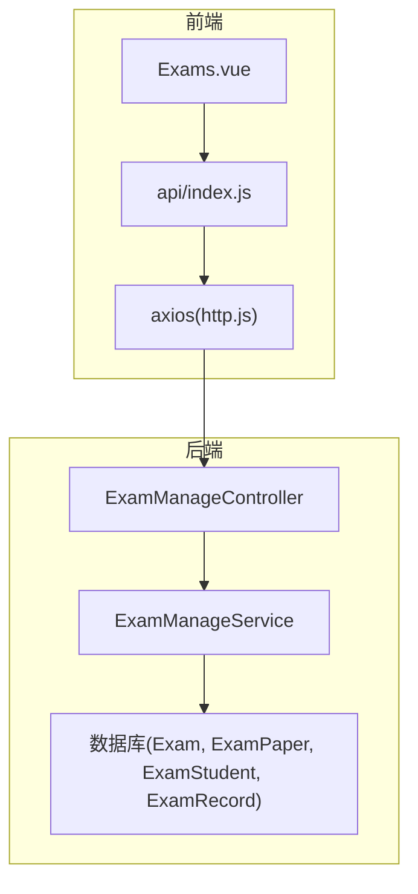
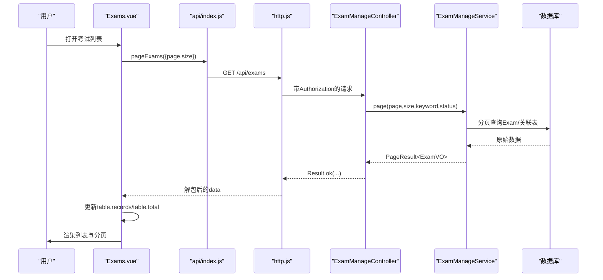
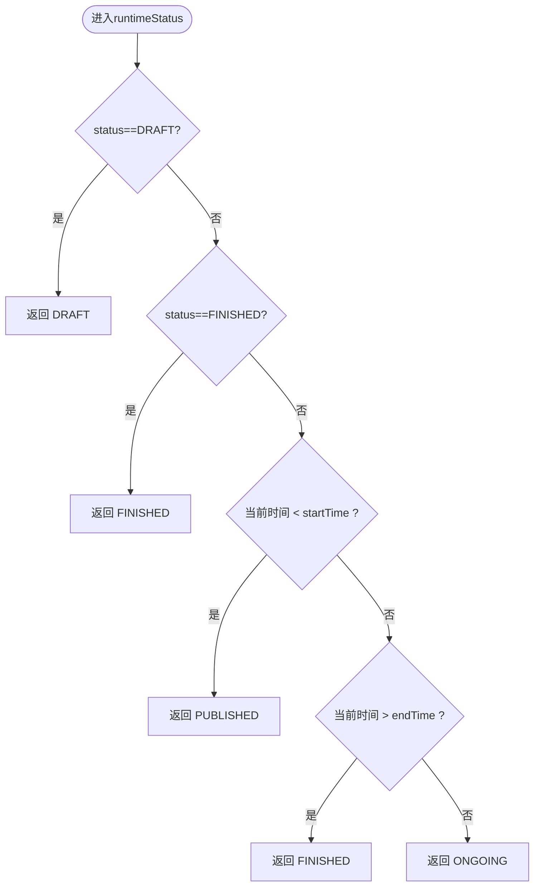
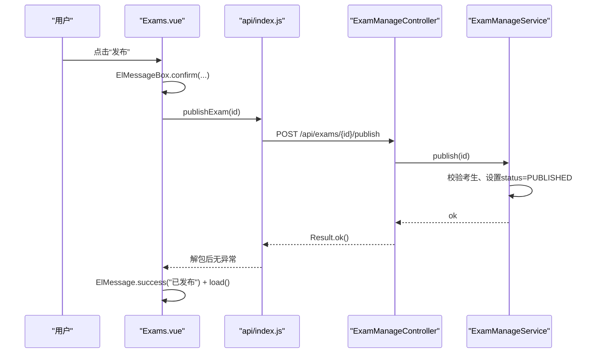
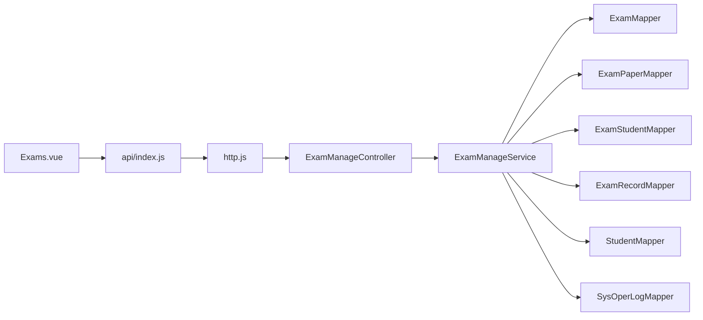

# 考试列表管理

<cite>
**本文引用的文件**
- [Exams.vue](file://exam-web/src/views/admin/Exams.vue)
- [index.js](file://exam-web/src/api/index.js)
- [http.js](file://exam-web/src/api/http.js)
- [ExamManageController.java](file://exam-server/src/main/java/com/exam/controller/ExamManageController.java)
- [ExamManageService.java](file://exam-server/src/main/java/com/exam/service/ExamManageService.java)
- [PageResult.java](file://exam-server/src/main/java/com/exam/common/PageResult.java)
- [Result.java](file://exam-server/src/main/java/com/exam/common/Result.java)
- [Exam.java](file://exam-server/src/main/java/com/exam/entity/Exam.java)
- [ExamPaper.java](file://exam-server/src/main/java/com/exam/entity/ExamPaper.java)
- [ExamSaveRequest.java](file://exam-server/src/main/java/com/exam/dto/ExamSaveRequest.java)
</cite>

## 目录
1. [简介](#简介)
2. [项目结构](#项目结构)
3. [核心组件](#核心组件)
4. [架构总览](#架构总览)
5. [详细组件分析](#详细组件分析)
6. [依赖关系分析](#依赖关系分析)
7. [性能考虑](#性能考虑)
8. [故障排查指南](#故障排查指南)
9. [结论](#结论)
10. [附录：扩展与自定义配置](#附录：扩展与自定义配置)

## 简介
本文件面向“考试列表管理”功能，围绕前端 Exams.vue 组件与后端 ExamManageController、ExamManageService 的协作，系统化说明以下能力：
- 考试列表展示：名称、试卷信息、时间、状态、考生数、已交人数等列的格式化输出。
- 考试状态映射机制：草稿、未开始、进行中、已结束的状态计算与标签显示。
- 分页查询：页码切换与数据加载逻辑。
- 操作能力：编辑草稿、发布考试（对学生可见）、停止进行中的考试、查看分析数据。
- API 封装、错误处理与用户交互反馈。
- 自定义配置与扩展建议。

## 项目结构
该功能横跨前后端：
- 前端：Vue 单文件组件 Exams.vue，通过 api/index.js 暴露的函数调用后端接口；统一请求由 http.js 拦截器处理认证与错误提示。
- 后端：ExamManageController 提供 REST 接口；ExamManageService 实现业务逻辑（分页、状态计算、发布/停止）；通用返回 Result、分页 PageResult 以及实体 Exam、ExamPaper、DTO ExamSaveRequest 支撑数据模型。

图表来源
- [Exams.vue:1-58](file://exam-web/src/views/admin/Exams.vue#L1-L58)
- [index.js:59-64](file://exam-web/src/api/index.js#L59-L64)
- [http.js:1-47](file://exam-web/src/api/http.js#L1-L47)
- [ExamManageController.java:30-65](file://exam-server/src/main/java/com/exam/controller/ExamManageController.java#L30-L65)
- [ExamManageService.java:48-190](file://exam-server/src/main/java/com/exam/service/ExamManageService.java#L48-L190)

章节来源
- [Exams.vue:1-58](file://exam-web/src/views/admin/Exams.vue#L1-L58)
- [ExamManageController.java:30-65](file://exam-server/src/main/java/com/exam/controller/ExamManageController.java#L30-L65)
- [ExamManageService.java:48-190](file://exam-server/src/main/java/com/exam/service/ExamManageService.java#L48-L190)

## 核心组件
- 列表展示层：Exams.vue 使用 Element Plus 表格渲染考试列表，包含名称、试卷、时间、状态、考生数、已交人数和操作列。
- 状态映射：前端 map 将后端 runtimeStatus 映射为中文标签（草稿、未开始、进行中、已结束）。
- 分页控制：query.page、query.size 驱动分页，current-change 触发 load() 重新拉取数据。
- 操作按钮：根据 row.exam.status 动态显示编辑、发布、停止、分析等操作。
- API 封装：pageExams、publishExam、stopExam 等函数集中定义在 index.js，统一通过 http.js 发起请求。
- 错误与反馈：http.js 对非 200 或 code!=0 的情况弹出错误消息；Exams.vue 使用 ElMessageBox 二次确认，ElMessage 成功提示。

章节来源
- [Exams.vue:8-28](file://exam-web/src/views/admin/Exams.vue#L8-L28)
- [Exams.vue:33-56](file://exam-web/src/views/admin/Exams.vue#L33-L56)
- [index.js:59-64](file://exam-web/src/api/index.js#L59-L64)
- [http.js:18-43](file://exam-web/src/api/http.js#L18-L43)

## 架构总览
从页面到数据的完整链路如下：
- 用户进入考试列表页，组件 onMounted 时调用 load()。
- load() 调用 pageExams(query)，http.js 自动附加 Authorization 头。
- 后端 ExamManageController.page 接收分页参数，调用 ExamManageService.page。
- Service 构建查询条件（关键词、状态、创建人过滤），分页查询并组装 VO（含运行时状态、试卷名、统计数）。
- 返回 Result<PageResult<ExamVO>>，前端解析 records 和 total 更新表格与分页。
- 操作按钮触发 publish/stop，分别调用对应接口，成功后刷新列表。

图表来源
- [Exams.vue:33-56](file://exam-web/src/views/admin/Exams.vue#L33-L56)
- [index.js:59-64](file://exam-web/src/api/index.js#L59-L64)
- [http.js:10-28](file://exam-web/src/api/http.js#L10-L28)
- [ExamManageController.java:30-36](file://exam-server/src/main/java/com/exam/controller/ExamManageController.java#L30-L36)
- [ExamManageService.java:48-63](file://exam-server/src/main/java/com/exam/service/ExamManageService.java#L48-L63)

## 详细组件分析

### 列表展示与列格式化
- 名称列：取自 row.exam.examName。
- 试卷列：取自 VO 的 paperName（由 Service 根据 paperId 关联查询得到）。
- 时间列：格式化显示 startTime ~ endTime。
- 状态列：使用 map 将 runtimeStatus 映射为中文标签。
- 考生数/已交人数：分别来自 studentCount 与 submittedCount。
- 操作列：基于 row.exam.status 动态显示不同按钮。

章节来源
- [Exams.vue:8-28](file://exam-web/src/views/admin/Exams.vue#L8-L28)
- [ExamManageService.java:157-173](file://exam-server/src/main/java/com/exam/service/ExamManageService.java#L157-L173)

### 考试状态映射机制
- 后端 runtimeStatus 计算规则：
  - 若 exam.status 为 DRAFT，则 runtimeStatus = DRAFT。
  - 若 exam.status 为 FINISHED，则 runtimeStatus = FINISHED。
  - 否则比较当前时间与 startTime/endTime：
    - 当前时间在开始前：PUBLISHED（未开始）。
    - 当前时间在结束后：FINISHED（已结束）。
    - 否则：ONGOING（进行中）。
- 前端 map 将 DRAFT/PUBLISHED/ONGOING/FINISHED 映射为“草稿/未开始/进行中/已结束”。

图表来源
- [ExamManageService.java:175-190](file://exam-server/src/main/java/com/exam/service/ExamManageService.java#L175-L190)

章节来源
- [ExamManageService.java:175-190](file://exam-server/src/main/java/com/exam/service/ExamManageService.java#L175-L190)
- [Exams.vue:37](file://exam-web/src/views/admin/Exams.vue#L37)

### 分页查询实现
- 前端 query 对象维护 page 与 size，el-pagination 绑定 current-page 并在 current-change 时调用 load()。
- load() 调用 pageExams(query)，将返回的 data.records 与 data.total 赋值给 table.records 与 table.total。
- 后端 Controller 接收 page、size、可选 keyword、status，Service 使用 MyBatis-Plus 分页查询并按创建人权限过滤（非管理员仅看自己创建的考试）。

章节来源
- [Exams.vue:28-44](file://exam-web/src/views/admin/Exams.vue#L28-L44)
- [ExamManageController.java:30-36](file://exam-server/src/main/java/com/exam/controller/ExamManageController.java#L30-L36)
- [ExamManageService.java:48-63](file://exam-server/src/main/java/com/exam/service/ExamManageService.java#L48-L63)
- [PageResult.java:7-19](file://exam-server/src/main/java/com/exam/common/PageResult.java#L7-L19)

### 操作功能详解
- 编辑草稿：当 row.exam.status === 'DRAFT' 时显示“编辑”，跳转至编辑页。
- 发布考试：当 row.exam.status === 'DRAFT' 时显示“发布”，确认后调用 publishExam(id)，成功后提示并刷新列表。
- 停止考试：当 row.exam.status === 'PUBLISHED' 时显示“停止”，确认后调用 stopExam(id)，成功后刷新列表。
- 查看分析：点击“分析”跳转到分析页并携带 examId。

图表来源
- [Exams.vue:45-50](file://exam-web/src/views/admin/Exams.vue#L45-L50)
- [index.js:62-63](file://exam-web/src/api/index.js#L62-L63)
- [ExamManageController.java:55-65](file://exam-server/src/main/java/com/exam/controller/ExamManageController.java#L55-L65)
- [ExamManageService.java:115-134](file://exam-server/src/main/java/com/exam/service/ExamManageService.java#L115-L134)

章节来源
- [Exams.vue:20-25](file://exam-web/src/views/admin/Exams.vue#L20-L25)
- [Exams.vue:45-55](file://exam-web/src/views/admin/Exams.vue#L45-L55)
- [ExamManageController.java:55-65](file://exam-server/src/main/java/com/exam/controller/ExamManageController.java#L55-L65)
- [ExamManageService.java:115-134](file://exam-server/src/main/java/com/exam/service/ExamManageService.java#L115-L134)

### API 调用封装与错误处理
- 统一封装：index.js 中导出 pageExams、publishExam、stopExam 等方法，路径与后端 @RequestMapping 保持一致。
- 统一请求：http.js 自动注入 Authorization 头；响应拦截器对 code!=0 或网络错误进行统一提示；401 时清除本地凭证并重定向登录。
- 业务错误：后端抛出 BizException 会被统一包装为 Result.fail，前端通过拦截器提示。

章节来源
- [index.js:59-64](file://exam-web/src/api/index.js#L59-L64)
- [http.js:1-47](file://exam-web/src/api/http.js#L1-L47)
- [Result.java:1-38](file://exam-server/src/main/java/com/exam/common/Result.java#L1-L38)

### 数据模型与字段说明
- Exam：考试主记录，包含名称、关联试卷ID、起止时间、时长、是否允许延时提交、结果/答案可见性、状态、创建人、创建时间。
- ExamPaper：试卷信息，包含名称、总分、及格分、题目数量、状态等。
- ExamSaveRequest：创建/编辑考试的入参，包括基本信息、时间、时长、可见性、指定学生ID列表。
- ExamVO：服务层对外返回的视图对象，包含 Exam、运行时状态、试卷名、总分、及格分、考生数、已交人数、学生ID列表。

章节来源
- [Exam.java:10-27](file://exam-server/src/main/java/com/exam/entity/Exam.java#L10-L27)
- [ExamPaper.java:11-25](file://exam-server/src/main/java/com/exam/entity/ExamPaper.java#L11-L25)
- [ExamSaveRequest.java:8-21](file://exam-server/src/main/java/com/exam/dto/ExamSaveRequest.java#L8-L21)
- [ExamManageService.java:265-275](file://exam-server/src/main/java/com/exam/service/ExamManageService.java#L265-L275)

## 依赖关系分析
- 前端依赖：Exams.vue 依赖 api/index.js 导出的方法；所有 HTTP 请求经 http.js 统一处理。
- 后端依赖：Controller 依赖 Service；Service 依赖多个 Mapper（Exam、ExamPaper、ExamStudent、ExamRecord、Student、SysOperLog）完成数据聚合与统计。
- 外部依赖：MyBatis-Plus 分页插件、Spring Web、Element Plus（前端 UI）。

图表来源
- [Exams.vue:33-56](file://exam-web/src/views/admin/Exams.vue#L33-L56)
- [index.js:59-64](file://exam-web/src/api/index.js#L59-L64)
- [ExamManageController.java:20-65](file://exam-server/src/main/java/com/exam/controller/ExamManageController.java#L20-L65)
- [ExamManageService.java:36-46](file://exam-server/src/main/java/com/exam/service/ExamManageService.java#L36-L46)

章节来源
- [ExamManageService.java:36-46](file://exam-server/src/main/java/com/exam/service/ExamManageService.java#L36-L46)
- [ExamManageController.java:20-65](file://exam-server/src/main/java/com/exam/controller/ExamManageController.java#L20-L65)

## 性能考虑
- 分页查询：后端使用 MyBatis-Plus 分页，避免全量加载；前端分页控件按需切换页码。
- 状态计算：runtimeStatus 在服务端实时计算，减少前端复杂度。
- 统计聚合：studentCount 与 submittedCount 通过计数查询获得，建议在高频访问场景下考虑缓存热点考试统计。
- 网络优化：http.js 统一超时与错误处理，降低重复代码与维护成本。

[本节为通用指导，不直接分析具体文件]

## 故障排查指南
- 401 未登录：http.js 会清除本地 token 并重定向到登录页；检查是否已登录或 token 是否过期。
- 业务错误提示：后端抛出 BizException 会被包装为 Result.fail，前端拦截器弹出 message；定位到具体接口与参数。
- 发布失败：若未指定考生，后端会拒绝发布；请确保已添加学生。
- 停止失败：仅对可停止状态的考试有效；检查当前 runtimeStatus。
- 列表为空：检查分页参数、关键词与状态筛选条件是否正确；确认是否有权限查看（非管理员仅能看到自己创建的考试）。

章节来源
- [http.js:18-43](file://exam-web/src/api/http.js#L18-L43)
- [ExamManageService.java:115-134](file://exam-server/src/main/java/com/exam/service/ExamManageService.java#L115-L134)
- [ExamManageService.java:48-63](file://exam-server/src/main/java/com/exam/service/ExamManageService.java#L48-L63)

## 结论
Exams.vue 以简洁的前端实现配合后端稳健的分页与状态计算，提供了完整的考试列表管理能力。通过统一的 API 封装与错误处理机制，保证了良好的用户体验与可维护性。后续可按需扩展搜索、批量操作、导出等功能。

[本节为总结，不直接分析具体文件]

## 附录：扩展与自定义配置
- 列表列定制：可在 Exams.vue 中新增/隐藏列，例如增加“总分/及格分”列，直接读取 VO 的 totalScore/passScore。
- 状态扩展：如需新增状态，先在 Service.runtimeStatus 中补充判断逻辑，再在前端 map 中添加映射。
- 分页配置：调整 query.size 默认值或支持 pageSize 切换。
- 搜索增强：Controller 已支持 keyword/status 参数，可在前端增加搜索表单并联动 load()。
- 权限控制：非管理员仅能查看自己创建的考试，如需放宽限制，修改 Service 中的权限判断。
- 操作日志：发布/停止已在 Service 中记录操作日志，便于审计。

章节来源
- [ExamManageService.java:175-190](file://exam-server/src/main/java/com/exam/service/ExamManageService.java#L175-L190)
- [ExamManageService.java:115-134](file://exam-server/src/main/java/com/exam/service/ExamManageService.java#L115-L134)
- [ExamManageController.java:30-36](file://exam-server/src/main/java/com/exam/controller/ExamManageController.java#L30-L36)
- [Exams.vue:37](file://exam-web/src/views/admin/Exams.vue#L37)