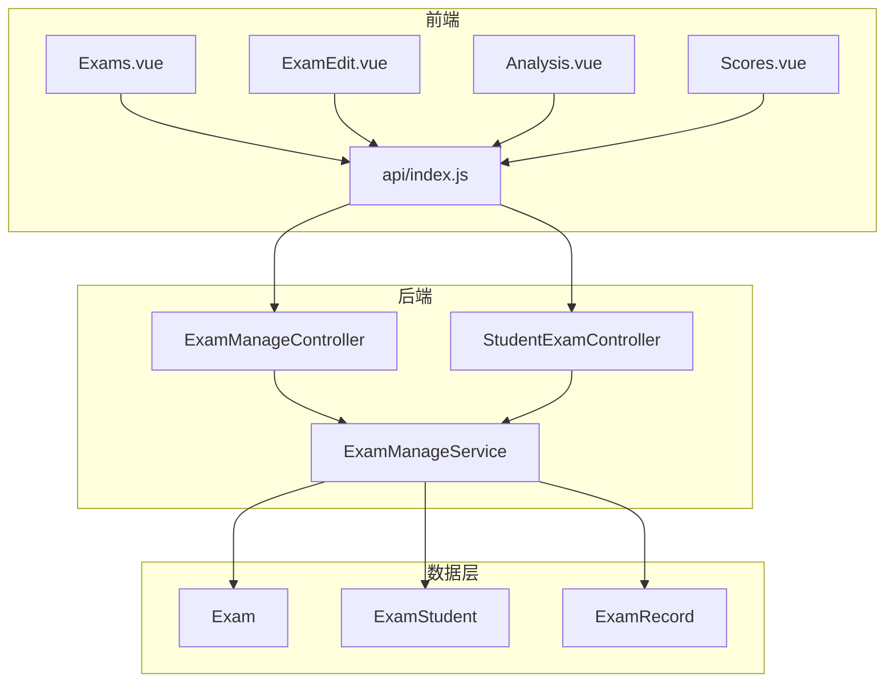
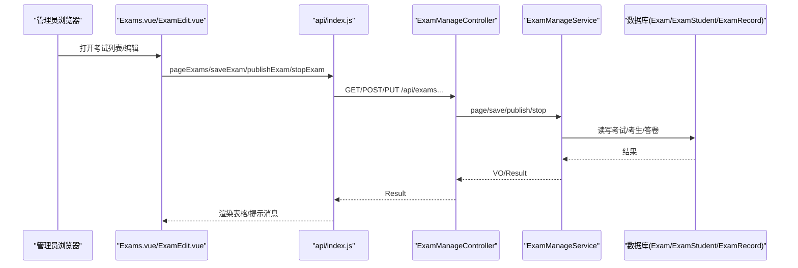
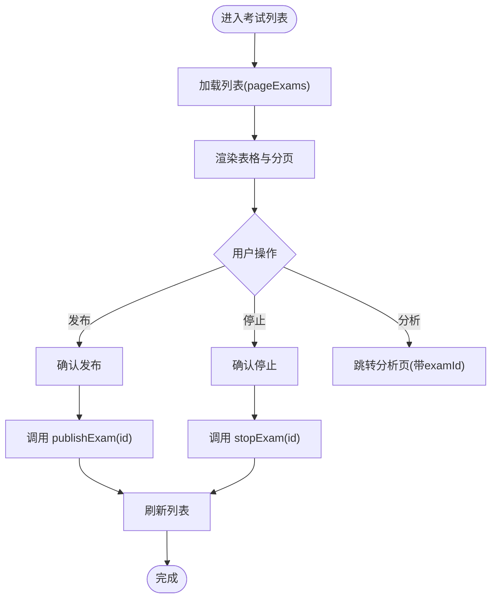
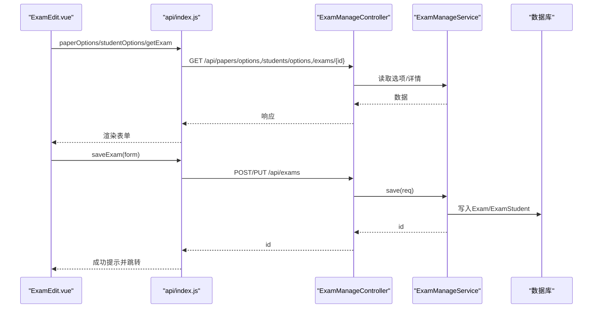
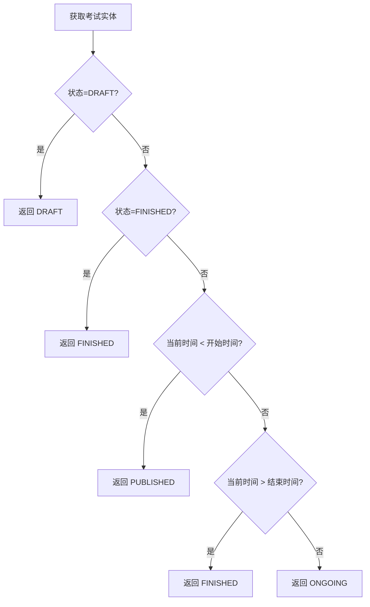
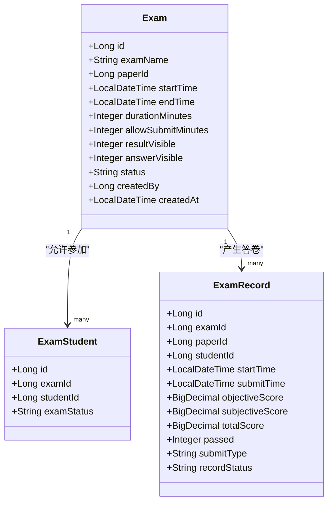
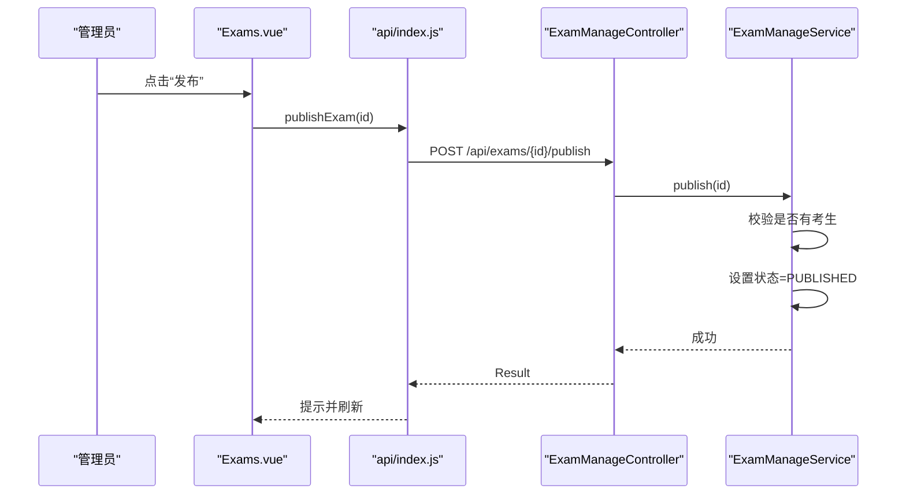
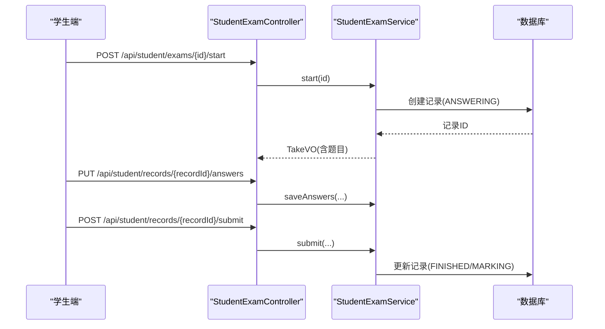
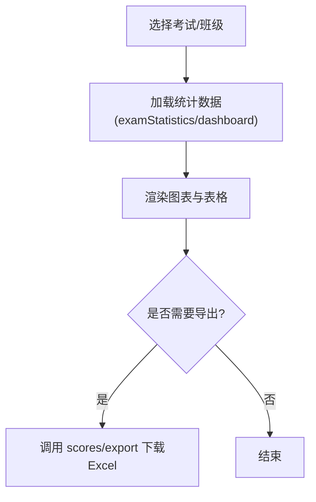
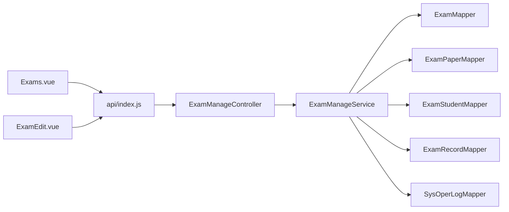

# 考试管理界面

<cite>
**本文引用的文件**
- [Exams.vue](file://exam-web/src/views/admin/Exams.vue)
- [ExamEdit.vue](file://exam-web/src/views/admin/ExamEdit.vue)
- [index.js（前端API）](file://exam-web/src/api/index.js)
- [ExamManageController.java](file://exam-server/src/main/java/com/exam/controller/ExamManageController.java)
- [ExamManageService.java](file://exam-server/src/main/java/com/exam/service/ExamManageService.java)
- [Exam.java](file://exam-server/src/main/java/com/exam/entity/Exam.java)
- [ExamSaveRequest.java](file://exam-server/src/main/java/com/exam/dto/ExamSaveRequest.java)
- [ExamStudent.java](file://exam-server/src/main/java/com/exam/entity/ExamStudent.java)
- [ExamRecord.java](file://exam-server/src/main/java/com/exam/entity/ExamRecord.java)
- [Analysis.vue](file://exam-web/src/views/admin/Analysis.vue)
- [Scores.vue](file://exam-web/src/views/admin/Scores.vue)
- [StudentExamController.java](file://exam-server/src/main/java/com/exam/controller/StudentExamController.java)
</cite>

## 目录
1. [简介](#简介)
2. [项目结构](#项目结构)
3. [核心组件](#核心组件)
4. [架构总览](#架构总览)
5. [详细组件分析](#详细组件分析)
6. [依赖关系分析](#依赖关系分析)
7. [性能与可用性](#性能与可用性)
8. [故障排查指南](#故障排查指南)
9. [结论](#结论)
10. [附录：扩展与定制指南](#附录：扩展与定制指南)

## 简介
本文件面向“考试管理界面”的文档，聚焦于 Exams.vue（考试列表与状态监控、发布/停止操作）与 ExamEdit.vue（创建/编辑考试表单）的实现。内容覆盖：
- 考试列表展示、状态映射与分页
- 考生管理与指定参与学生
- 考试时间设置、答题时长、最早交卷时间、成绩与答案公布开关
- 考试发布流程、在线监考能力、进度跟踪与自动交卷处理
- 数据分析、成绩统计与报告导出
- 配置定制与监控功能扩展建议

## 项目结构
前端采用 Vue 3 + Element Plus，后端为 Spring Boot + MyBatis-Plus。考试管理相关的前端页面位于 admin 视图下，后端通过 ExamManageController 暴露 REST API，由 ExamManageService 实现业务逻辑，数据模型包含 Exam、ExamStudent、ExamRecord 等实体。

图表来源
- [Exams.vue:1-58](file://exam-web/src/views/admin/Exams.vue#L1-L58)
- [ExamEdit.vue:1-63](file://exam-web/src/views/admin/ExamEdit.vue#L1-L63)
- [index.js:59-64](file://exam-web/src/api/index.js#L59-L64)
- [ExamManageController.java:25-65](file://exam-server/src/main/java/com/exam/controller/ExamManageController.java#L25-L65)
- [ExamManageService.java:48-190](file://exam-server/src/main/java/com/exam/service/ExamManageService.java#L48-L190)
- [StudentExamController.java:29-70](file://exam-server/src/main/java/com/exam/controller/StudentExamController.java#L29-L70)

章节来源
- [Exams.vue:1-58](file://exam-web/src/views/admin/Exams.vue#L1-L58)
- [ExamEdit.vue:1-63](file://exam-web/src/views/admin/ExamEdit.vue#L1-L63)
- [ExamManageController.java:25-65](file://exam-server/src/main/java/com/exam/controller/ExamManageController.java#L25-L65)
- [ExamManageService.java:48-190](file://exam-server/src/main/java/com/exam/service/ExamManageService.java#L48-L190)

## 核心组件
- 考试列表页（Exams.vue）
  - 展示考试名称、关联试卷、起止时间、运行时状态、考生数、已交人数
  - 支持分页查询、草稿态编辑、发布、停止、跳转分析
- 考试编辑页（ExamEdit.vue）
  - 新建/编辑考试：名称、选择试卷、开始/结束时间、答题时长、最早交卷分钟数、是否公布成绩/答案、指定考生多选
  - 保存后返回列表或跳转到编辑页

章节来源
- [Exams.vue:1-58](file://exam-web/src/views/admin/Exams.vue#L1-L58)
- [ExamEdit.vue:1-63](file://exam-web/src/views/admin/ExamEdit.vue#L1-L63)

## 架构总览
考试管理的端到端流程如下：
- 前端通过 api/index.js 调用后端 /api/exams 系列接口
- 控制器 ExamManageController 接收请求并委派给 ExamManageService
- Service 层完成校验、持久化、状态计算、统计聚合
- 数据模型包括考试主表、考生关联表、答卷记录表

图表来源
- [Exams.vue:33-56](file://exam-web/src/views/admin/Exams.vue#L33-L56)
- [ExamEdit.vue:29-61](file://exam-web/src/views/admin/ExamEdit.vue#L29-L61)
- [index.js:59-64](file://exam-web/src/api/index.js#L59-L64)
- [ExamManageController.java:30-65](file://exam-server/src/main/java/com/exam/controller/ExamManageController.java#L30-L65)
- [ExamManageService.java:48-190](file://exam-server/src/main/java/com/exam/service/ExamManageService.java#L48-L190)

## 详细组件分析

### 考试列表（Exams.vue）
- 列表字段
  - 名称、试卷名、时间区间、运行时状态、考生数、已交人数
- 状态映射
  - 将后端返回的运行时状态映射为中文标签：草稿、未开始、进行中、已结束
- 分页
  - 使用 query.page/size 控制分页，current-change 触发 load
- 操作按钮
  - 草稿态：编辑、发布
  - 已发布：停止
  - 所有状态：分析（跳转 Analysis.vue 并携带 examId）
- 交互流程
  - 发布：二次确认后调用 publishExam，成功后刷新列表
  - 停止：二次确认后调用 stopExam，成功后刷新列表

图表来源
- [Exams.vue:8-28](file://exam-web/src/views/admin/Exams.vue#L8-L28)
- [Exams.vue:40-55](file://exam-web/src/views/admin/Exams.vue#L40-L55)
- [index.js:59-63](file://exam-web/src/api/index.js#L59-L63)

章节来源
- [Exams.vue:1-58](file://exam-web/src/views/admin/Exams.vue#L1-L58)
- [index.js:59-63](file://exam-web/src/api/index.js#L59-L63)

### 考试编辑（ExamEdit.vue）
- 表单字段
  - 考试名称、选择试卷、开始/结束时间、答题时长（分钟）、最早交卷（分钟）、是否公布成绩、是否公布答案、指定考生（多选可搜索）
- 数据来源
  - 试卷下拉：paperOptions
  - 学生下拉：studentOptions
  - 编辑模式：getExam 回填表单
- 保存逻辑
  - saveExam 统一处理新增与更新；成功后提示并返回列表
- 规则校验
  - 后端在保存时校验时间有效性、试卷存在性、非草稿不可直接修改等

图表来源
- [ExamEdit.vue:6-24](file://exam-web/src/views/admin/ExamEdit.vue#L6-L24)
- [ExamEdit.vue:29-61](file://exam-web/src/views/admin/ExamEdit.vue#L29-L61)
- [index.js:59-64](file://exam-web/src/api/index.js#L59-L64)
- [ExamManageController.java:43-53](file://exam-server/src/main/java/com/exam/controller/ExamManageController.java#L43-L53)
- [ExamManageService.java:77-113](file://exam-server/src/main/java/com/exam/service/ExamManageService.java#L77-L113)

章节来源
- [ExamEdit.vue:1-63](file://exam-web/src/views/admin/ExamEdit.vue#L1-L63)
- [ExamManageService.java:77-113](file://exam-server/src/main/java/com/exam/service/ExamManageService.java#L77-L113)

### 考试状态监控与运行时状态
- 运行时状态计算
  - 草稿：DRAFT
  - 已结束：FINISHED
  - 当前时间在开始之前：PUBLISHED（未开始）
  - 当前时间在结束之后：FINISHED（已结束）
  - 否则：ONGOING（进行中）
- 列表展示
  - 前端根据运行时状态显示中文标签，便于管理员快速识别

图表来源
- [ExamManageService.java:175-190](file://exam-server/src/main/java/com/exam/service/ExamManageService.java#L175-L190)

章节来源
- [ExamManageService.java:175-190](file://exam-server/src/main/java/com/exam/service/ExamManageService.java#L175-L190)

### 考生管理功能
- 指定考生
  - 编辑表单支持多选学生，保存时以“替换”方式写入 ExamStudent 表，初始状态 NOT_STARTED
- 列表统计
  - 列表展示“考生数”来自 ExamStudent 计数
  - “已交人数”来自 ExamRecord 中 SUBMITTED/MARKING/FINISHED 的计数
- 学生端参与
  - 学生端通过 StudentExamController 开始考试、拉题、保存答案、提交、查看回顾

图表来源
- [Exam.java:10-27](file://exam-server/src/main/java/com/exam/entity/Exam.java#L10-L27)
- [ExamStudent.java:8-17](file://exam-server/src/main/java/com/exam/entity/ExamStudent.java#L8-L17)
- [ExamRecord.java:11-28](file://exam-server/src/main/java/com/exam/entity/ExamRecord.java#L11-L28)

章节来源
- [ExamManageService.java:136-147](file://exam-server/src/main/java/com/exam/service/ExamManageService.java#L136-L147)
- [ExamManageService.java:157-173](file://exam-server/src/main/java/com/exam/service/ExamManageService.java#L157-L173)
- [StudentExamController.java:29-70](file://exam-server/src/main/java/com/exam/controller/StudentExamController.java#L29-L70)

### 考试发布流程
- 前置条件
  - 必须至少指定一名考生，否则抛出业务异常
- 发布动作
  - 将考试状态置为 PUBLISHED，并记录操作日志
- 列表行为
  - 草稿态可发布；已发布后可停止

图表来源
- [Exams.vue:45-49](file://exam-web/src/views/admin/Exams.vue#L45-L49)
- [index.js:62](file://exam-web/src/api/index.js#L62)
- [ExamManageController.java:55-58](file://exam-server/src/main/java/com/exam/controller/ExamManageController.java#L55-L58)
- [ExamManageService.java:115-125](file://exam-server/src/main/java/com/exam/service/ExamManageService.java#L115-L125)

章节来源
- [ExamManageService.java:115-125](file://exam-server/src/main/java/com/exam/service/ExamManageService.java#L115-L125)

### 在线监考、进度跟踪与自动交卷
- 在线监考
  - 学生端通过 StudentExamController 开始考试、拉取题目、保存答案、提交答卷
  - 服务端记录开始时间、提交类型、答卷状态（ANSWERING/SUBMITTED/MARKING/FINISHED）
- 进度跟踪
  - 列表“已交人数”基于答卷状态统计
  - 分析页提供掌握度、平均分、及格率等指标
- 自动交卷
  - 前端支持定时或切题时自动保存答案；提交时若含主观题则进入阅卷流程

图表来源
- [StudentExamController.java:35-59](file://exam-server/src/main/java/com/exam/controller/StudentExamController.java#L35-L59)
- [ExamRecord.java:11-28](file://exam-server/src/main/java/com/exam/entity/ExamRecord.java#L11-L28)

章节来源
- [StudentExamController.java:29-70](file://exam-server/src/main/java/com/exam/controller/StudentExamController.java#L29-L70)
- [ExamRecord.java:11-28](file://exam-server/src/main/java/com/exam/entity/ExamRecord.java#L11-L28)

### 数据分析、成绩统计与报告生成
- 学情分析（Analysis.vue）
  - 选择考试后加载统计数据：应考、已交、平均分、及格率
  - 知识点掌握度可视化（柱状图），并按班级筛选
- 成绩页（Scores.vue）
  - 按考试筛选，展示客观题、主观题、总分、是否及格
  - 支持导出 Excel（Blob 下载）

图表来源
- [Analysis.vue:6-18](file://exam-web/src/views/admin/Analysis.vue#L6-L18)
- [Analysis.vue:44-90](file://exam-web/src/views/admin/Analysis.vue#L44-L90)
- [Scores.vue:8-23](file://exam-web/src/views/admin/Scores.vue#L8-L23)
- [Scores.vue:38-46](file://exam-web/src/views/admin/Scores.vue#L38-L46)
- [index.js:64,70-73:64-73](file://exam-web/src/api/index.js#L64-L73)

章节来源
- [Analysis.vue:1-92](file://exam-web/src/views/admin/Analysis.vue#L1-L92)
- [Scores.vue:1-52](file://exam-web/src/views/admin/Scores.vue#L1-L52)
- [index.js:64-73](file://exam-web/src/api/index.js#L64-L73)

## 依赖关系分析
- 前端依赖
  - Exams.vue/ExamEdit.vue 依赖 api/index.js 中的 pageExams、saveExam、publishExam、stopExam、paperOptions、studentOptions、getExam 等
- 后端依赖
  - ExamManageController 依赖 ExamManageService
  - ExamManageService 依赖多个 Mapper（Exam、ExamPaper、ExamStudent、ExamRecord、Student、SysOperLog）
  - 数据模型：Exam、ExamStudent、ExamRecord
- 外部集成
  - 分析页使用 echarts 进行可视化
  - 成绩导出使用 Blob 下载

图表来源
- [Exams.vue:33-56](file://exam-web/src/views/admin/Exams.vue#L33-L56)
- [ExamEdit.vue:29-61](file://exam-web/src/views/admin/ExamEdit.vue#L29-L61)
- [index.js:59-64](file://exam-web/src/api/index.js#L59-L64)
- [ExamManageController.java:25-65](file://exam-server/src/main/java/com/exam/controller/ExamManageController.java#L25-L65)
- [ExamManageService.java:36-46](file://exam-server/src/main/java/com/exam/service/ExamManageService.java#L36-L46)

章节来源
- [ExamManageService.java:36-46](file://exam-server/src/main/java/com/exam/service/ExamManageService.java#L36-L46)
- [index.js:59-64](file://exam-web/src/api/index.js#L59-L64)

## 性能与可用性
- 列表分页
  - 通过 page/size 参数减少单次数据量，提升首屏加载速度
- 状态计算
  - 运行时状态在服务端计算，避免前端时间偏差导致的显示不一致
- 并发与事务
  - 发布/停止/保存等操作使用事务保证数据一致性
- 前端交互
  - 二次确认防止误操作；Element Plus 组件提供良好用户体验
- 可扩展点
  - 可在列表增加筛选（如按班级、状态）
  - 可增加批量操作（批量发布/停止）

[本节为通用指导，不直接分析具体文件]

## 故障排查指南
- 无法发布考试
  - 检查是否已指定考生；若无考生会抛出业务异常
  - 参考：发布前校验逻辑
- 编辑失败
  - 检查时间设置是否正确（结束时间需晚于开始时间）
  - 检查所选试卷是否存在且可用
  - 参考：保存时的校验逻辑
- 列表状态不正确
  - 核对服务器时间与考试起止时间
  - 参考：运行时状态计算逻辑
- 学生端无法开始考试
  - 确认考试已发布且当前学生在允许范围内
  - 参考：学生端接口定义

章节来源
- [ExamManageService.java:77-125](file://exam-server/src/main/java/com/exam/service/ExamManageService.java#L77-L125)
- [ExamManageService.java:175-190](file://exam-server/src/main/java/com/exam/service/ExamManageService.java#L175-L190)
- [StudentExamController.java:29-45](file://exam-server/src/main/java/com/exam/controller/StudentExamController.java#L29-L45)

## 结论
Exams.vue 与 ExamEdit.vue 构成了考试管理的核心入口：前者负责考试生命周期管理与监控，后者负责考试配置与考生组织。后端通过 ExamManageController 与 ExamManageService 提供稳定可靠的业务支撑，结合 Exam、ExamStudent、ExamRecord 等实体实现完整的考试流程。配合 Analysis.vue 与 Scores.vue，系统具备数据分析与报告导出能力。整体设计清晰、职责明确，易于扩展与维护。

[本节为总结性内容，不直接分析具体文件]

## 附录：扩展与定制指南
- 考试规则扩展
  - 可在 ExamSaveRequest 与 Exam 实体中增加新字段（如防作弊开关、随机顺序、屏蔽网络等）
  - 在 ExamManageService.save 中增加相应校验与默认值处理
- 监控功能扩展
  - 在 ExamManageService.dashboard 中增加更多维度统计（如班级维度、知识点维度）
  - 在前端 Dashboard 或 Analysis 中增加图表与筛选器
- 监考增强
  - 在学生端增加心跳检测、切屏检测、摄像头抓拍等能力
  - 在后端记录异常事件到操作日志，并在列表中展示告警
- 报表增强
  - 在 Scores.vue 中增加更多导出字段（如作答时长、知识点得分分布）
  - 在 Analysis.vue 中增加班级对比、趋势分析等图表

[本节为概念性指导，不直接分析具体文件]