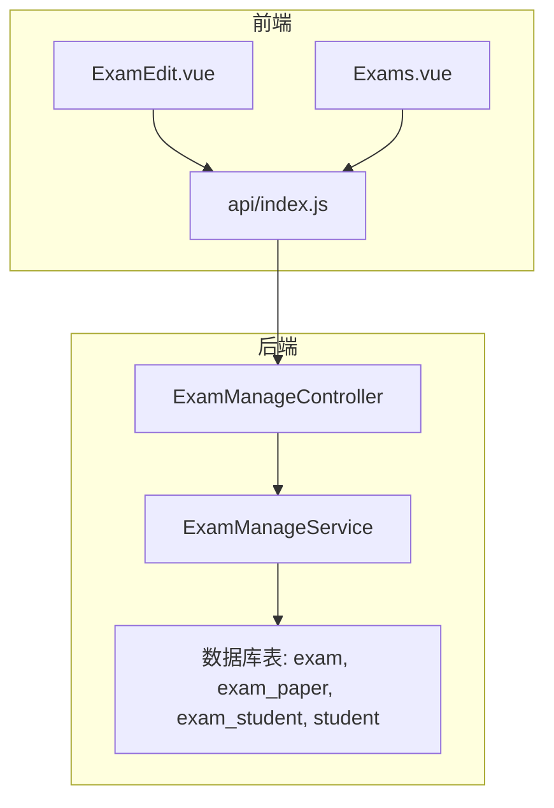
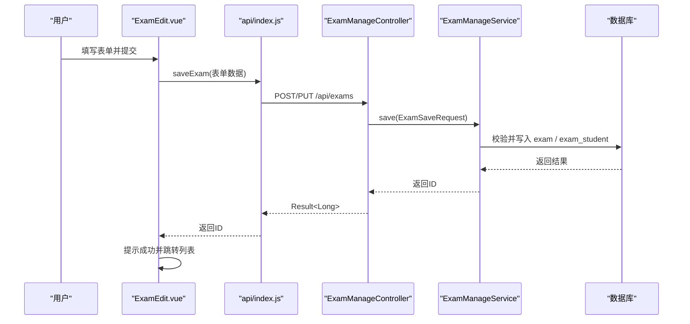
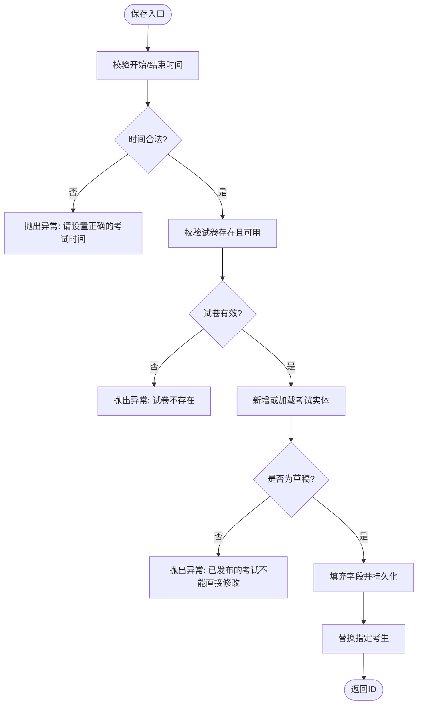
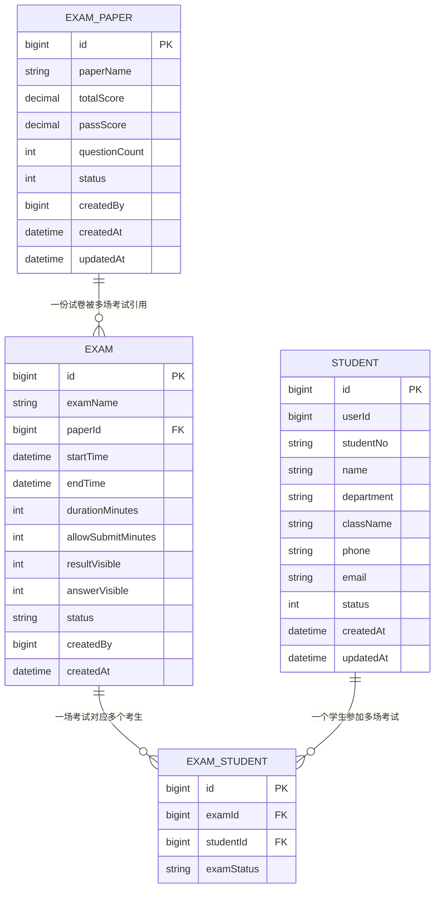
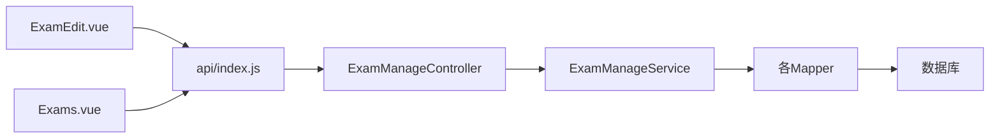

# 考试编辑创建

<cite>
**本文引用的文件**
- [ExamEdit.vue](file://exam-web/src/views/admin/ExamEdit.vue)
- [Exams.vue](file://exam-web/src/views/admin/Exams.vue)
- [index.js](file://exam-web/src/api/index.js)
- [ExamManageController.java](file://exam-server/src/main/java/com/exam/controller/ExamManageController.java)
- [ExamSaveRequest.java](file://exam-server/src/main/java/com/exam/dto/ExamSaveRequest.java)
- [Exam.java](file://exam-server/src/main/java/com/exam/entity/Exam.java)
- [ExamPaper.java](file://exam-server/src/main/java/com/exam/entity/ExamPaper.java)
- [ExamStudent.java](file://exam-server/src/main/java/com/exam/entity/ExamStudent.java)
- [Student.java](file://exam-server/src/main/java/com/exam/entity/Student.java)
- [ExamManageService.java](file://exam-server/src/main/java/com/exam/service/ExamManageService.java)
</cite>

## 目录
1. [简介](#简介)
2. [项目结构](#项目结构)
3. [核心组件](#核心组件)
4. [架构总览](#架构总览)
5. [详细组件分析](#详细组件分析)
6. [依赖关系分析](#依赖关系分析)
7. [性能考虑](#性能考虑)
8. [故障排查指南](#故障排查指南)
9. [结论](#结论)
10. [附录](#附录)

## 简介
本章节面向“考试编辑与创建”功能，围绕前端 ExamEdit.vue 组件与后端 ExamManageController、ExamManageService 的协作，系统说明：
- 考试表单设计：基本信息（名称）、试卷关联、时间设置（开始/结束/时长）、最早交卷、成绩与答案公布开关、指定考生多选。
- 规则配置：考试时间限制、自动交卷策略、防作弊相关字段（当前版本未暴露）。
- 表单验证：必填校验、时间逻辑校验、学生数量限制等。
- 创建与更新流程：数据提交、API 调用、成功失败处理。
- 与试卷关联机制：从题库中选择或创建试卷。
- 高级能力：表单重置、数据回显、批量操作。
- 模板与扩展：基于现有字段进行模板化与自定义扩展建议。

## 项目结构
- 前端页面位于 exam-web/src/views/admin/ExamEdit.vue，负责渲染考试编辑表单、加载试卷与学生选项、调用保存接口并跳转。
- 列表页 Exams.vue 提供新建入口、发布/停止等操作。
- API 封装在 exam-web/src/api/index.js，统一导出 getExam/saveExam/publishExam/stopExam 等方法。
- 后端控制器 ExamManageController 暴露 /api/exams 的增删改查、发布/停止接口。
- 业务逻辑集中在 ExamManageService，包含保存、状态机、统计等。
- 数据模型包括 Exam、ExamPaper、ExamStudent、Student 等实体。

图表来源
- [ExamEdit.vue:1-63](file://exam-web/src/views/admin/ExamEdit.vue#L1-L63)
- [Exams.vue:1-58](file://exam-web/src/views/admin/Exams.vue#L1-L58)
- [index.js:59-64](file://exam-web/src/api/index.js#L59-L64)
- [ExamManageController.java:30-65](file://exam-server/src/main/java/com/exam/controller/ExamManageController.java#L30-L65)
- [ExamManageService.java:77-113](file://exam-server/src/main/java/com/exam/service/ExamManageService.java#L77-L113)

章节来源
- [ExamEdit.vue:1-63](file://exam-web/src/views/admin/ExamEdit.vue#L1-L63)
- [Exams.vue:1-58](file://exam-web/src/views/admin/Exams.vue#L1-L58)
- [index.js:59-64](file://exam-web/src/api/index.js#L59-L64)
- [ExamManageController.java:30-65](file://exam-server/src/main/java/com/exam/controller/ExamManageController.java#L30-L65)
- [ExamManageService.java:77-113](file://exam-server/src/main/java/com/exam/service/ExamManageService.java#L77-L113)

## 核心组件
- 前端 ExamEdit.vue：表单绑定、选项加载、保存与路由跳转。
- 后端 ExamManageController：REST 接口定义，转发到服务层。
- 后端 ExamManageService：保存校验、状态管理、考生关联替换、统计计算。
- 数据模型：Exam（考试主表）、ExamPaper（试卷）、ExamStudent（考试-学生关联）、Student（学生档案）。

章节来源
- [ExamEdit.vue:29-61](file://exam-web/src/views/admin/ExamEdit.vue#L29-L61)
- [ExamManageController.java:38-53](file://exam-server/src/main/java/com/exam/controller/ExamManageController.java#L38-L53)
- [ExamManageService.java:77-113](file://exam-server/src/main/java/com/exam/service/ExamManageService.java#L77-L113)
- [Exam.java:10-27](file://exam-server/src/main/java/com/exam/entity/Exam.java#L10-L27)
- [ExamPaper.java:11-25](file://exam-server/src/main/java/com/exam/entity/ExamPaper.java#L11-L25)
- [ExamStudent.java:8-17](file://exam-server/src/main/java/com/exam/entity/ExamStudent.java#L8-L17)
- [Student.java:10-26](file://exam-server/src/main/java/com/exam/entity/Student.java#L10-L26)

## 架构总览
考试编辑创建的前后端交互时序如下：

图表来源
- [ExamEdit.vue:43-47](file://exam-web/src/views/admin/ExamEdit.vue#L43-L47)
- [index.js:59-61](file://exam-web/src/api/index.js#L59-L61)
- [ExamManageController.java:43-53](file://exam-server/src/main/java/com/exam/controller/ExamManageController.java#L43-L53)
- [ExamManageService.java:77-113](file://exam-server/src/main/java/com/exam/service/ExamManageService.java#L77-L113)

## 详细组件分析

### 前端 ExamEdit.vue 组件
- 表单字段
  - 考试名称：文本输入。
  - 试卷：下拉选择，来自 paperOptions 接口。
  - 开始时间/结束时间：日期时间选择器，格式为字符串。
  - 答题时长：分钟数，最小值1。
  - 最早交卷：分钟数，最小值0。
  - 公布成绩/公布答案：开关，值为1/0。
  - 指定考生：多选可搜索，来自 studentOptions 接口。
- 数据加载与回显
  - 组件挂载时加载试卷与学生选项。
  - 若存在路由参数 id，则调用 getExam 获取详情并回填表单。
- 保存流程
  - 调用 saveExam，根据是否存在 id 决定 PUT 或 POST。
  - 成功后提示并跳转到考试列表。
- 表单验证
  - 前端仅做基础 UI 约束（如 min），无复杂校验逻辑。
  - 严格的时间顺序与合法性由后端保障。
- 高级功能
  - 数据回显：通过 getExam 返回的 exam 与 studentIds 完成回填。
  - 批量操作：指定考生支持多选，实现批量关联。
  - 模板化：可通过预设常用字段组合（如默认时长、是否公布答案）快速创建。

章节来源
- [ExamEdit.vue:6-24](file://exam-web/src/views/admin/ExamEdit.vue#L6-L24)
- [ExamEdit.vue:35-61](file://exam-web/src/views/admin/ExamEdit.vue#L35-L61)
- [index.js:59-61](file://exam-web/src/api/index.js#L59-L61)

### 后端 ExamManageController 控制器
- 接口定义
  - GET /api/exams/{id}：获取考试详情（含学生ID列表）。
  - POST /api/exams：新增考试。
  - PUT /api/exams/{id}：更新考试。
  - POST /api/exams/{id}/publish：发布考试。
  - POST /api/exams/{id}/stop：停止考试。
- 职责
  - 接收请求体，调用服务层保存或状态变更。
  - 统一返回 Result 包装。

章节来源
- [ExamManageController.java:38-65](file://exam-server/src/main/java/com/exam/controller/ExamManageController.java#L38-L65)

### 后端 ExamManageService 服务层
- 保存逻辑（save）
  - 校验开始/结束时间，要求结束时间晚于开始时间。
  - 校验试卷存在且状态有效。
  - 新增时设置状态为草稿、创建人与创建时间；更新时仅允许草稿修改。
  - 更新或新增后，替换该考试的指定考生集合。
- 发布/停止
  - 发布前需至少指定一名考生。
  - 停止时将状态置为已结束，并记录当前时间为结束时间。
- 运行时状态计算
  - 草稿、已结束、进行中、未开始四种状态按时间与状态字段动态计算。
- 统计与展示
  - 计算考生数、已交人数、总分及格线等，用于列表与详情展示。

图表来源
- [ExamManageService.java:77-113](file://exam-server/src/main/java/com/exam/service/ExamManageService.java#L77-L113)

章节来源
- [ExamManageService.java:77-113](file://exam-server/src/main/java/com/exam/service/ExamManageService.java#L77-L113)
- [ExamManageService.java:115-134](file://exam-server/src/main/java/com/exam/service/ExamManageService.java#L115-L134)
- [ExamManageService.java:175-190](file://exam-server/src/main/java/com/exam/service/ExamManageService.java#L175-L190)

### 数据模型与关联
- Exam：考试主表，包含名称、试卷ID、时间窗、时长、最早交卷、成绩/答案可见性、状态、创建信息。
- ExamPaper：试卷，包含名称、总分、及格分、题目数量、状态等。
- ExamStudent：考试与学生的多对多中间表，记录考试状态（未开始/作答中/已提交）。
- Student：学生档案，包含学号、姓名、班级、联系方式等。

图表来源
- [Exam.java:10-27](file://exam-server/src/main/java/com/exam/entity/Exam.java#L10-L27)
- [ExamPaper.java:11-25](file://exam-server/src/main/java/com/exam/entity/ExamPaper.java#L11-L25)
- [ExamStudent.java:8-17](file://exam-server/src/main/java/com/exam/entity/ExamStudent.java#L8-L17)
- [Student.java:10-26](file://exam-server/src/main/java/com/exam/entity/Student.java#L10-L26)

章节来源
- [Exam.java:10-27](file://exam-server/src/main/java/com/exam/entity/Exam.java#L10-L27)
- [ExamPaper.java:11-25](file://exam-server/src/main/java/com/exam/entity/ExamPaper.java#L11-L25)
- [ExamStudent.java:8-17](file://exam-server/src/main/java/com/exam/entity/ExamStudent.java#L8-L17)
- [Student.java:10-26](file://exam-server/src/main/java/com/exam/entity/Student.java#L10-L26)

### 考试规则配置说明
- 考试时间限制
  - 开始时间/结束时间：后端强制校验结束时间必须晚于开始时间。
  - 答题时长：前端限定最小1分钟，后端存储为整数分钟。
  - 最早交卷：允许学生在开始后若干分钟提前交卷。
- 自动交卷设置
  - 当前版本未在前端暴露“到时自动交卷”开关，但后端具备时长字段，可在学生端结合计时逻辑实现自动提交。
- 防作弊配置
  - 当前版本未暴露防作弊相关字段（如切屏检测、摄像头监控等），可在后续扩展中添加。
- 成绩与答案公布
  - 结果可见性、答案可见性以开关形式控制，默认分别为“显示成绩”和“隐藏答案”。

章节来源
- [ExamManageService.java:77-113](file://exam-server/src/main/java/com/exam/service/ExamManageService.java#L77-L113)
- [ExamEdit.vue:12-17](file://exam-web/src/views/admin/ExamEdit.vue#L12-L17)
- [Exam.java:16-23](file://exam-server/src/main/java/com/exam/entity/Exam.java#L16-L23)

### 表单验证机制
- 必填字段
  - 前端未做强校验，后端在保存时校验时间有效性。
- 时间逻辑验证
  - 后端要求结束时间晚于开始时间，否则抛出业务异常。
- 学生数量限制
  - 发布前至少需要指定一名考生，否则阻止发布。
- 错误处理
  - 后端抛出业务异常，前端可通过全局错误处理提示用户修正。

章节来源
- [ExamManageService.java:77-85](file://exam-server/src/main/java/com/exam/service/ExamManageService.java#L77-L85)
- [ExamManageService.java:115-125](file://exam-server/src/main/java/com/exam/service/ExamManageService.java#L115-L125)

### 考试创建与更新流程
- 创建流程
  - 前端提交空ID数据，后端新增考试并设置为草稿，插入考生关联。
- 更新流程
  - 前端携带ID提交，后端仅允许草稿状态的考试修改，更新后替换考生集合。
- 成功与失败处理
  - 成功：返回ID，前端提示并跳转列表。
  - 失败：抛出业务异常，前端应捕获并提示用户。

章节来源
- [ExamEdit.vue:43-47](file://exam-web/src/views/admin/ExamEdit.vue#L43-L47)
- [ExamManageController.java:43-53](file://exam-server/src/main/java/com/exam/controller/ExamManageController.java#L43-L53)
- [ExamManageService.java:77-113](file://exam-server/src/main/java/com/exam/service/ExamManageService.java#L77-L113)

### 与试卷关联机制
- 选择试卷
  - 前端通过 paperOptions 接口获取可用试卷列表，供下拉选择。
- 创建试卷
  - 通过试卷编辑页面创建试卷，再回到考试编辑页面选择。
- 关联校验
  - 后端保存时校验试卷存在且状态有效，否则拒绝保存。

章节来源
- [ExamEdit.vue:8-10](file://exam-web/src/views/admin/ExamEdit.vue#L8-L10)
- [index.js:53-56](file://exam-web/src/api/index.js#L53-L56)
- [ExamManageService.java:82-85](file://exam-server/src/main/java/com/exam/service/ExamManageService.java#L82-L85)

### 高级功能
- 表单重置
  - 可在组件内维护初始表单对象，点击重置按钮时恢复默认值。
- 数据回显
  - 编辑模式通过 getExam 返回 exam 与 studentIds 回填表单。
- 批量操作
  - 指定考生支持多选，实现批量关联到同一场考试。
- 模板功能
  - 可基于常用配置（如默认时长、是否公布答案）构建模板，快速生成新考试。

章节来源
- [ExamEdit.vue:52-60](file://exam-web/src/views/admin/ExamEdit.vue#L52-L60)
- [ExamEdit.vue:18-22](file://exam-web/src/views/admin/ExamEdit.vue#L18-L22)

## 依赖关系分析
- 前端依赖
  - ExamEdit.vue 依赖 api/index.js 中的 getExam/saveExam/paperOptions/studentOptions。
  - Exams.vue 依赖 pageExams/publishExam/stopExam。
- 后端依赖
  - ExamManageController 依赖 ExamManageService。
  - ExamManageService 依赖多个 Mapper（ExamMapper、ExamPaperMapper、ExamStudentMapper、StudentMapper 等）。
- 外部集成
  - 数据库：MySQL/H2，使用 MyBatis Plus 进行 ORM 映射。
  - 安全：SecurityUtils 用于权限判断（管理员/教师）。

图表来源
- [ExamEdit.vue:33-38](file://exam-web/src/views/admin/ExamEdit.vue#L33-L38)
- [index.js:59-64](file://exam-web/src/api/index.js#L59-L64)
- [ExamManageController.java:20-23](file://exam-server/src/main/java/com/exam/controller/ExamManageController.java#L20-L23)
- [ExamManageService.java:36-46](file://exam-server/src/main/java/com/exam/service/ExamManageService.java#L36-L46)

章节来源
- [ExamEdit.vue:33-38](file://exam-web/src/views/admin/ExamEdit.vue#L33-L38)
- [Exams.vue:33-39](file://exam-web/src/views/admin/Exams.vue#L33-L39)
- [index.js:59-64](file://exam-web/src/api/index.js#L59-L64)
- [ExamManageController.java:20-23](file://exam-server/src/main/java/com/exam/controller/ExamManageController.java#L20-L23)
- [ExamManageService.java:36-46](file://exam-server/src/main/java/com/exam/service/ExamManageService.java#L36-L46)

## 性能考虑
- 前端
  - 选项数据一次性加载，避免重复请求。
  - 多选学生建议使用虚拟滚动或分页加载以提升大数据量体验。
- 后端
  - 保存时使用事务保证一致性。
  - 查询使用分页与条件过滤减少数据量。
  - 运行时状态计算为轻量级逻辑，适合高频读取。

[本节为通用性能建议，不直接分析具体文件]

## 故障排查指南
- 常见错误
  - 时间非法：确保结束时间晚于开始时间。
  - 试卷无效：确认试卷存在且状态启用。
  - 未指定考生：发布前至少添加一名学生。
  - 非草稿修改：已发布考试不可直接修改，需先停止或复制新考试。
- 定位方法
  - 检查前端控制台网络请求与响应。
  - 查看后端日志中的业务异常信息。
  - 核对数据库中 exam、exam_student 记录是否正确写入。

章节来源
- [ExamManageService.java:77-93](file://exam-server/src/main/java/com/exam/service/ExamManageService.java#L77-L93)
- [ExamManageService.java:115-125](file://exam-server/src/main/java/com/exam/service/ExamManageService.java#L115-L125)

## 结论
ExamEdit.vue 提供了简洁直观的考试编辑界面，配合后端严格的校验与状态管理，实现了考试创建、更新、发布与停止的完整闭环。通过试卷与考生的关联，系统能够灵活组织考试内容与参与范围。未来可扩展防作弊、自动交卷、模板化等功能，进一步提升用户体验与管理效率。

[本节为总结性内容，不直接分析具体文件]

## 附录
- 接口速览
  - GET /api/exams/{id}：获取考试详情。
  - POST /api/exams：新增考试。
  - PUT /api/exams/{id}：更新考试。
  - POST /api/exams/{id}/publish：发布考试。
  - POST /api/exams/{id}/stop：停止考试。
- 字段说明
  - examName：考试名称。
  - paperId：试卷ID。
  - startTime/endTime：时间窗。
  - durationMinutes：答题时长（分钟）。
  - allowSubmitMinutes：最早交卷（分钟）。
  - resultVisible/answerVisible：成绩/答案可见性开关。
  - studentIds：指定考生ID列表。

章节来源
- [ExamManageController.java:38-65](file://exam-server/src/main/java/com/exam/controller/ExamManageController.java#L38-L65)
- [ExamSaveRequest.java:8-21](file://exam-server/src/main/java/com/exam/dto/ExamSaveRequest.java#L8-L21)
- [Exam.java:16-23](file://exam-server/src/main/java/com/exam/entity/Exam.java#L16-L23)