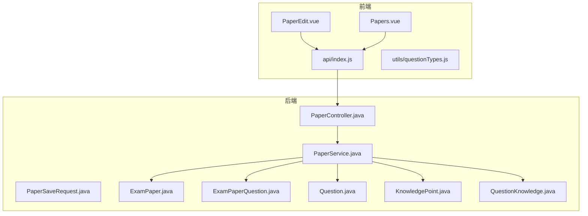
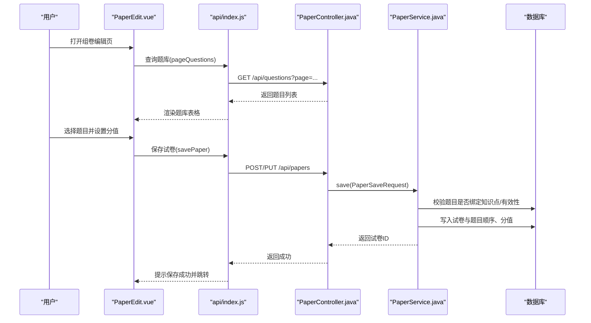
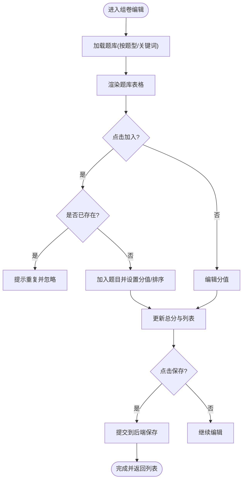
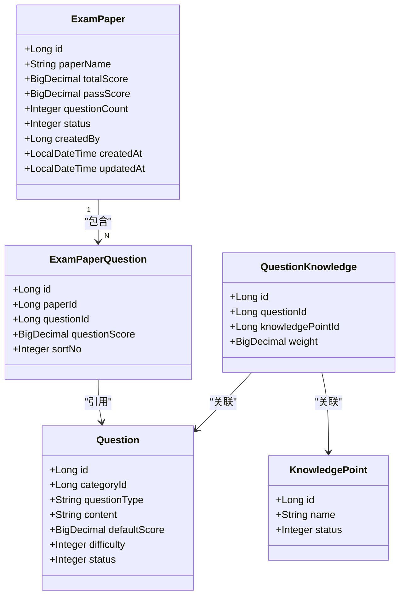
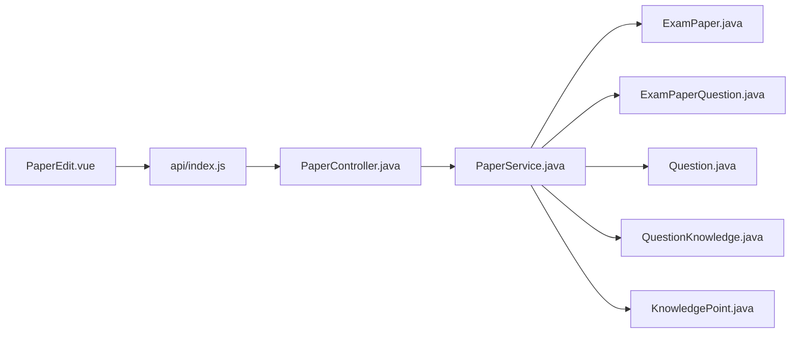

# 组卷编辑器

<cite>
**本文引用的文件**
- [PaperEdit.vue](file://exam-web/src/views/admin/PaperEdit.vue)
- [Papers.vue](file://exam-web/src/views/admin/Papers.vue)
- [index.js](file://exam-web/src/api/index.js)
- [questionTypes.js](file://exam-web/src/utils/questionTypes.js)
- [PaperController.java](file://exam-server/src/main/java/com/exam/controller/PaperController.java)
- [PaperService.java](file://exam-server/src/main/java/com/exam/service/PaperService.java)
- [PaperSaveRequest.java](file://exam-server/src/main/java/com/exam/dto/PaperSaveRequest.java)
- [ExamPaper.java](file://exam-server/src/main/java/com/exam/entity/ExamPaper.java)
- [ExamPaperQuestion.java](file://exam-server/src/main/java/com/exam/entity/ExamPaperQuestion.java)
- [Question.java](file://exam-server/src/main/java/com/exam/entity/Question.java)
- [KnowledgePoint.java](file://exam-server/src/main/java/com/exam/entity/KnowledgePoint.java)
- [QuestionKnowledge.java](file://exam-server/src/main/java/com/exam/entity/QuestionKnowledge.java)
</cite>

## 目录
1. [简介](#简介)
2. [项目结构](#项目结构)
3. [核心组件](#核心组件)
4. [架构总览](#架构总览)
5. [详细组件分析](#详细组件分析)
6. [依赖关系分析](#依赖关系分析)
7. [性能考虑](#性能考虑)
8. [故障排查指南](#故障排查指南)
9. [结论](#结论)
10. [附录](#附录)

## 简介
本文件围绕“组卷编辑器”展开，重点说明前端 PaperEdit.vue 的实现与交互流程，包括手动组卷模式、题目选择界面、分值设置与保存机制；并基于后端 PaperService 的校验逻辑，解释组卷规则（知识点覆盖控制、题型分布约束等）与数据一致性保障。同时给出扩展建议：如何定制随机抽题算法、实现题目查重与结果优化策略，以及自定义评分规则的可行路径。

## 项目结构
- 前端页面
  - 组卷编辑页：exam-web/src/views/admin/PaperEdit.vue
  - 试卷列表页：exam-web/src/views/admin/Papers.vue
  - API 封装：exam-web/src/api/index.js
  - 题型常量：exam-web/src/utils/questionTypes.js
- 后端接口与服务
  - 控制器：PaperController.java
  - 服务层：PaperService.java
  - 请求体：PaperSaveRequest.java
  - 实体：ExamPaper.java、ExamPaperQuestion.java、Question.java、KnowledgePoint.java、QuestionKnowledge.java

**图表来源**
- [PaperEdit.vue:1-98](file://exam-web/src/views/admin/PaperEdit.vue#L1-L98)
- [Papers.vue:1-44](file://exam-web/src/views/admin/Papers.vue#L1-L44)
- [index.js:53-57](file://exam-web/src/api/index.js#L53-L57)
- [PaperController.java:21-62](file://exam-server/src/main/java/com/exam/controller/PaperController.java#L21-L62)
- [PaperService.java:30-161](file://exam-server/src/main/java/com/exam/service/PaperService.java#L30-L161)

**章节来源**
- [PaperEdit.vue:1-98](file://exam-web/src/views/admin/PaperEdit.vue#L1-L98)
- [Papers.vue:1-44](file://exam-web/src/views/admin/Papers.vue#L1-L44)
- [index.js:53-57](file://exam-web/src/api/index.js#L53-L57)
- [PaperController.java:21-62](file://exam-server/src/main/java/com/exam/controller/PaperController.java#L21-L62)
- [PaperService.java:30-161](file://exam-server/src/main/java/com/exam/service/PaperService.java#L30-L161)

## 核心组件
- 组卷编辑页（PaperEdit.vue）
  - 提供试卷名、及格分输入，展示已选题目清单与总分统计，支持按题型和关键词检索题库，将题目加入试卷并设置每题分值。
  - 通过 API 获取试卷详情或查询题库，提交时构造题目列表与排序号后调用保存接口。
- 后端服务（PaperService）
  - 负责试卷分页、详情读取、保存与删除。
  - 保存时进行强校验：至少一道题、所有题目必须绑定知识点、题目存在且有效；计算总分与默认及格分；持久化试卷及题目顺序与分值。

**章节来源**
- [PaperEdit.vue:43-98](file://exam-web/src/views/admin/PaperEdit.vue#L43-L98)
- [PaperService.java:39-161](file://exam-server/src/main/java/com/exam/service/PaperService.java#L39-L161)

## 架构总览
组卷编辑的前后端交互流程如下：

**图表来源**
- [PaperEdit.vue:67-80](file://exam-web/src/views/admin/PaperEdit.vue#L67-L80)
- [index.js:53-57](file://exam-web/src/api/index.js#L53-L57)
- [PaperController.java:45-55](file://exam-server/src/main/java/com/exam/controller/PaperController.java#L45-L55)
- [PaperService.java:79-128](file://exam-server/src/main/java/com/exam/service/PaperService.java#L79-L128)

## 详细组件分析

### 前端：PaperEdit.vue
- 手动组卷模式
  - 表单包含试卷名与及格分；实时统计已选题数量与总分。
  - 题库查询支持题型筛选与关键词搜索，结果以表格展示，点击“加入”将题目加入当前试卷。
- 题目选择界面
  - 已选题目表格显示题干、题型、分值与移除操作；新增题目时自动分配排序号。
  - 去重逻辑：若题目已存在于当前试卷则阻止重复添加。
- 分值设置
  - 每题分值可编辑，默认使用题目的默认分值；总分由前端计算。
- 保存机制
  - 提交时将题目映射为 questionId、questionScore、sortNo 的数组，调用保存接口；成功后提示并返回列表页。
- 实时预览
  - 通过表格与总分计算实现“所见即所得”的预览效果。

**图表来源**
- [PaperEdit.vue:57-80](file://exam-web/src/views/admin/PaperEdit.vue#L57-L80)

**章节来源**
- [PaperEdit.vue:1-98](file://exam-web/src/views/admin/PaperEdit.vue#L1-L98)
- [questionTypes.js:1-11](file://exam-web/src/utils/questionTypes.js#L1-L11)

### 后端：PaperService 与数据模型
- 组卷规则配置
  - 知识点覆盖控制：保存前检查每道题是否至少绑定一个知识点，否则拒绝组卷。
  - 题目有效性：题目必须存在且未被逻辑删除。
  - 题型分布设置：当前版本未在后端强制题型比例，可通过前端在组卷时限制题型数量或增加后端校验扩展点。
  - 难度平衡策略：当前版本未在后端实施难度均衡，可在保存前对题目难度分布做统计与提示，或扩展校验规则。
- 试卷结构验证
  - 至少包含一道题；计算总分；未指定及格分时按总分的一定比例默认设置。
- 保存与事务
  - 新建或更新试卷，更新题目顺序与分值；更新时先清空旧题目再插入新集合，保证一致性。
- 数据结构
  - ExamPaper：试卷基本信息（名称、总分、及格分、题量、状态、创建信息等）。
  - ExamPaperQuestion：试卷内题目与分值、排序。
  - Question：题目主信息（类型、内容、默认分值、难度等）。
  - KnowledgePoint/QuestionKnowledge：知识点树与题目-知识点关联，支撑知识点覆盖控制。

**图表来源**
- [ExamPaper.java:11-26](file://exam-server/src/main/java/com/exam/entity/ExamPaper.java#L11-L26)
- [ExamPaperQuestion.java:10-21](file://exam-server/src/main/java/com/exam/entity/ExamPaperQuestion.java#L10-L21)
- [Question.java:11-30](file://exam-server/src/main/java/com/exam/entity/Question.java#L11-L30)
- [KnowledgePoint.java:10-25](file://exam-server/src/main/java/com/exam/entity/KnowledgePoint.java#L10-L25)
- [QuestionKnowledge.java:10-20](file://exam-server/src/main/java/com/exam/entity/QuestionKnowledge.java#L10-L20)

**章节来源**
- [PaperService.java:39-161](file://exam-server/src/main/java/com/exam/service/PaperService.java#L39-L161)
- [PaperSaveRequest.java:8-23](file://exam-server/src/main/java/com/exam/dto/PaperSaveRequest.java#L8-L23)
- [ExamPaper.java:11-26](file://exam-server/src/main/java/com/exam/entity/ExamPaper.java#L11-L26)
- [ExamPaperQuestion.java:10-21](file://exam-server/src/main/java/com/exam/entity/ExamPaperQuestion.java#L10-L21)
- [Question.java:11-30](file://exam-server/src/main/java/com/exam/entity/Question.java#L11-L30)
- [KnowledgePoint.java:10-25](file://exam-server/src/main/java/com/exam/entity/KnowledgePoint.java#L10-L25)
- [QuestionKnowledge.java:10-20](file://exam-server/src/main/java/com/exam/entity/QuestionKnowledge.java#L10-L20)

### 组卷规则与策略（可扩展）
- 知识点覆盖控制
  - 现有实现：保存时要求每道题至少绑定一个知识点。
  - 扩展建议：在保存前统计各知识点的覆盖情况，设定最低覆盖率阈值，不达标则提示或拒绝保存。
- 难度平衡策略
  - 现有实现：未在后端强制难度分布。
  - 扩展建议：根据题目难度字段统计分布，允许配置目标难度区间与容差，超出范围时提示或自动替换题目。
- 题型分布设置
  - 现有实现：前端支持按题型筛选，但未强制题型数量比例。
  - 扩展建议：在前端维护题型配额并在加入题目时校验；或在后端保存前校验题型计数是否符合配置。
- 随机抽题算法（建议）
  - 基于题型、知识点、难度等多维条件构建候选集，采用加权随机或分层抽样确保覆盖与平衡。
  - 可结合题目权重（如知识点权重）与历史使用频率降低重复率。
- 题目查重逻辑
  - 现有实现：前端在加入题目时检查是否已存在相同 questionId。
  - 扩展建议：在后端保存前再次去重，避免并发场景下的重复插入。
- 组卷结果优化
  - 建议在保存前对总分、题量、题型分布、难度分布进行综合评估，输出优化建议或自动调整。

[本节为概念性扩展建议，不直接分析具体代码文件]

## 依赖关系分析
- 前端依赖
  - PaperEdit.vue 依赖 api/index.js 中的 pageQuestions、getPaper、savePaper。
  - 题型标签与判断来自 utils/questionTypes.js。
- 后端依赖
  - PaperController 暴露 REST 接口，委托 PaperService 处理业务。
  - PaperService 依赖多个 Mapper 访问数据库，涉及试卷、题目、知识点及其关联表。

**图表来源**
- [PaperEdit.vue:43-80](file://exam-web/src/views/admin/PaperEdit.vue#L43-L80)
- [index.js:53-57](file://exam-web/src/api/index.js#L53-L57)
- [PaperController.java:21-62](file://exam-server/src/main/java/com/exam/controller/PaperController.java#L21-L62)
- [PaperService.java:30-161](file://exam-server/src/main/java/com/exam/service/PaperService.java#L30-L161)

**章节来源**
- [PaperEdit.vue:43-80](file://exam-web/src/views/admin/PaperEdit.vue#L43-L80)
- [index.js:53-57](file://exam-web/src/api/index.js#L53-L57)
- [PaperController.java:21-62](file://exam-server/src/main/java/com/exam/controller/PaperController.java#L21-L62)
- [PaperService.java:30-161](file://exam-server/src/main/java/com/exam/service/PaperService.java#L30-L161)

## 性能考虑
- 前端
  - 题库查询分页与过滤减少首屏数据量；本地去重避免重复渲染。
  - 总分计算使用轻量级聚合，适合当前规模。
- 后端
  - 保存时使用事务保证数据一致性；批量插入题目顺序与分值。
  - 知识点覆盖检查通过计数查询，注意在高并发下可考虑缓存热点题目-知识点映射。
- 扩展建议
  - 对于大规模题库，可在后端提供“智能组卷”接口，预计算候选集并按策略抽样，减少前端计算压力。

[本节提供通用指导，不直接分析具体代码文件]

## 故障排查指南
- 保存时报错“试卷至少包含一道题”
  - 检查前端是否正确组装题目列表并提交。
- 保存时报错“存在未绑定知识点的题目，不能组卷”
  - 确认题目已绑定至少一个知识点；必要时在题库管理中补充知识点关联。
- 保存时报错“题目不存在或已删除”
  - 检查题目是否被逻辑删除或已被移除；重新选择有效题目。
- 保存时报错“试卷不存在”
  - 编辑模式下需确保传入正确的试卷 ID；检查路由参数与请求体。
- 前端重复添加题目
  - 已实现前端去重；若仍出现，检查题目 ID 是否一致。

**章节来源**
- [PaperService.java:79-128](file://exam-server/src/main/java/com/exam/service/PaperService.java#L79-L128)
- [PaperEdit.vue:57-80](file://exam-web/src/views/admin/PaperEdit.vue#L57-L80)

## 结论
当前组卷编辑器实现了手动组卷的核心能力：题目检索、加入与分值设置、总分统计与保存；后端在服务层提供了严格的组卷规则校验（知识点覆盖、题目有效性），并通过事务保证数据一致性。未来可在前后端协同扩展智能组卷、难度与题型分布控制、题目查重与结果优化等功能，以满足更复杂的考试编排需求。

[本节总结性内容，不直接分析具体代码文件]

## 附录
- 相关页面与接口
  - 试卷列表：Papers.vue 提供分页查询与删除操作。
  - 接口定义：PaperController 提供分页、选项、详情、创建、更新、删除等接口。
  - 请求体：PaperSaveRequest 定义试卷名、及格分与题目项（题号、分值、排序）。

**章节来源**
- [Papers.vue:1-44](file://exam-web/src/views/admin/Papers.vue#L1-L44)
- [PaperController.java:21-62](file://exam-server/src/main/java/com/exam/controller/PaperController.java#L21-L62)
- [PaperSaveRequest.java:8-23](file://exam-server/src/main/java/com/exam/dto/PaperSaveRequest.java#L8-L23)