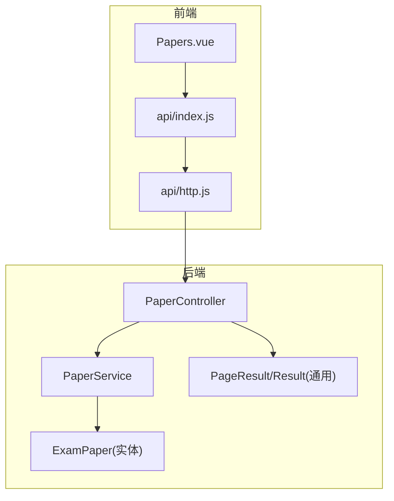
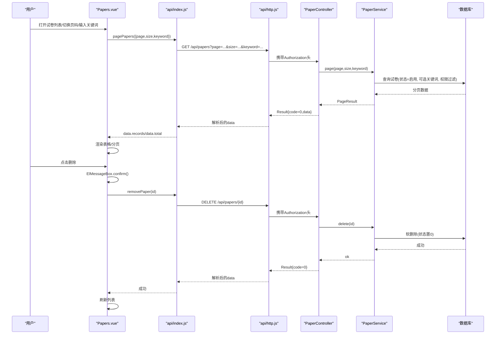
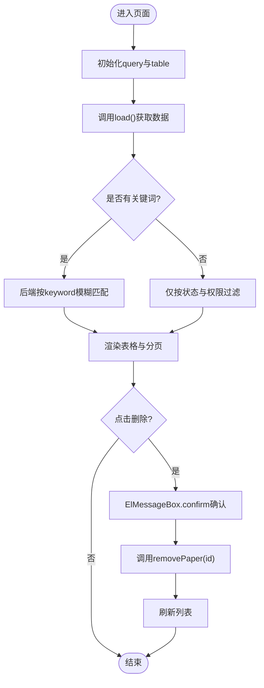
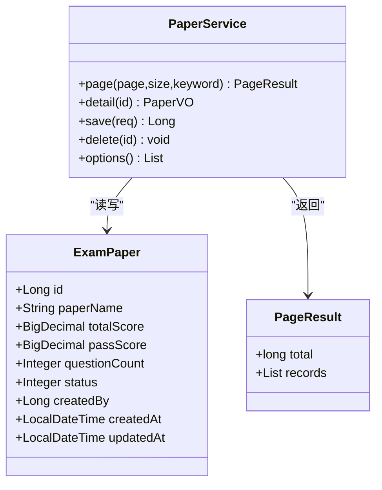
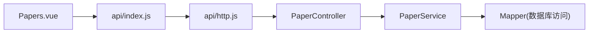

# 试卷列表管理

<cite>
**本文引用的文件**
- [Papers.vue](file://exam-web/src/views/admin/Papers.vue)
- [index.js](file://exam-web/src/api/index.js)
- [http.js](file://exam-web/src/api/http.js)
- [PaperController.java](file://exam-server/src/main/java/com/exam/controller/PaperController.java)
- [PaperService.java](file://exam-server/src/main/java/com/exam/service/PaperService.java)
- [ExamPaper.java](file://exam-server/src/main/java/com/exam/entity/ExamPaper.java)
- [PageResult.java](file://exam-server/src/main/java/com/exam/common/PageResult.java)
- [Result.java](file://exam-server/src/main/java/com/exam/common/Result.java)
</cite>

## 目录
1. [简介](#简介)
2. [项目结构](#项目结构)
3. [核心组件](#核心组件)
4. [架构总览](#架构总览)
5. [详细组件分析](#详细组件分析)
6. [依赖关系分析](#依赖关系分析)
7. [性能考虑](#性能考虑)
8. [故障排查指南](#故障排查指南)
9. [结论](#结论)
10. [附录：扩展开发指南](#附录扩展开发指南)

## 简介
本章节面向“试卷列表管理”功能，聚焦前端 Papers.vue 组件与后端 PaperController/PaperService 的协作。内容涵盖：
- 试卷数据分页加载、关键词搜索过滤、表格展示
- 试卷基本信息展示（名称、题量、总分、及格分）及状态管理
- 删除确认对话框与安全校验机制
- API 接口调用、错误处理与用户交互反馈
- 后续扩展建议（筛选条件、批量操作等）

## 项目结构
该功能由前后端协同实现：
- 前端：Vue 单页应用中的 admin/Papers.vue 负责页面渲染、分页、搜索、删除交互；通过 api/index.js 暴露的函数调用后端；统一网络请求封装在 api/http.js。
- 后端：Spring Boot 控制器 PaperController 提供 REST 接口；业务逻辑在 PaperService；数据模型 ExamPaper；通用返回 Result 与分页 PageResult。

图表来源
- [Papers.vue:1-44](file://exam-web/src/views/admin/Papers.vue#L1-L44)
- [index.js:53-57](file://exam-web/src/api/index.js#L53-L57)
- [http.js:1-47](file://exam-web/src/api/http.js#L1-L47)
- [PaperController.java:21-62](file://exam-server/src/main/java/com/exam/controller/PaperController.java#L21-L62)
- [PaperService.java:30-161](file://exam-server/src/main/java/com/exam/service/PaperService.java#L30-L161)
- [ExamPaper.java:11-25](file://exam-server/src/main/java/com/exam/entity/ExamPaper.java#L11-L25)
- [PageResult.java:7-19](file://exam-server/src/main/java/com/exam/common/PageResult.java#L7-L19)
- [Result.java:9-37](file://exam-server/src/main/java/com/exam/common/Result.java#L9-L37)

章节来源
- [Papers.vue:1-44](file://exam-web/src/views/admin/Papers.vue#L1-L44)
- [PaperController.java:21-62](file://exam-server/src/main/java/com/exam/controller/PaperController.java#L21-L62)
- [PaperService.java:30-161](file://exam-server/src/main/java/com/exam/service/PaperService.java#L30-L161)
- [index.js:53-57](file://exam-web/src/api/index.js#L53-L57)
- [http.js:1-47](file://exam-web/src/api/http.js#L1-L47)

## 核心组件
- 前端页面组件：Papers.vue
  - 负责：查询参数（页码、每页大小、关键词）、表格渲染、分页控件、删除确认与调用删除接口。
- 前端 API 层：index.js
  - 暴露 pagePapers、removePaper 等方法，映射到 /api/papers 相关路径。
- 前端网络层：http.js
  - 统一拦截器：自动携带 JWT、统一错误提示、401 跳转登录。
- 后端控制器：PaperController
  - 提供分页查询、详情、选项、新增、更新、删除等接口。
- 后端服务：PaperService
  - 实现分页查询（支持关键词过滤、按创建人权限控制）、保存校验、软删除、选项列表等。
- 数据模型与通用类型：
  - ExamPaper：试卷实体（名称、总分、及格分、题量、状态、创建信息等）。
  - PageResult：分页结果（total、records）。
  - Result：统一响应体（code、message、data）。

章节来源
- [Papers.vue:26-43](file://exam-web/src/views/admin/Papers.vue#L26-L43)
- [index.js:53-57](file://exam-web/src/api/index.js#L53-L57)
- [http.js:10-43](file://exam-web/src/api/http.js#L10-L43)
- [PaperController.java:28-61](file://exam-server/src/main/java/com/exam/controller/PaperController.java#L28-L61)
- [PaperService.java:39-144](file://exam-server/src/main/java/com/exam/service/PaperService.java#L39-L144)
- [ExamPaper.java:11-25](file://exam-server/src/main/java/com/exam/entity/ExamPaper.java#L11-L25)
- [PageResult.java:7-19](file://exam-server/src/main/java/com/exam/common/PageResult.java#L7-L19)
- [Result.java:9-37](file://exam-server/src/main/java/com/exam/common/Result.java#L9-L37)

## 架构总览
下图展示了从前端触发到后端处理的完整调用链，包括分页查询与删除流程。

图表来源
- [Papers.vue:32-41](file://exam-web/src/views/admin/Papers.vue#L32-L41)
- [index.js:53-57](file://exam-web/src/api/index.js#L53-L57)
- [http.js:10-43](file://exam-web/src/api/http.js#L10-L43)
- [PaperController.java:28-61](file://exam-server/src/main/java/com/exam/controller/PaperController.java#L28-L61)
- [PaperService.java:39-144](file://exam-server/src/main/java/com/exam/service/PaperService.java#L39-L144)

## 详细组件分析

### 前端：Papers.vue
- 数据与状态
  - query：包含 page、size、keyword，用于分页与搜索。
  - table：records 与 total，用于表格与分页显示。
- 分页加载
  - onMounted 时调用 load，获取初始数据。
  - 监听分页 current-change 事件，重新加载。
- 关键词搜索
  - 输入框绑定 keyword，change 事件触发 load，将 keyword 传入后端。
- 表格展示
  - 字段映射：paperName（名称）、questionCount（题量）、totalScore（总分）、passScore（及格分）。
- 删除确认与安全验证
  - 使用 ElMessageBox.confirm 二次确认。
  - 调用 removePaper(row.id) 执行删除，成功后刷新列表。
- 错误处理与用户反馈
  - 统一由 http.js 拦截器处理：非 200 或 code!=0 时弹出错误消息；401 时跳转登录。

图表来源
- [Papers.vue:26-43](file://exam-web/src/views/admin/Papers.vue#L26-L43)

章节来源
- [Papers.vue:1-44](file://exam-web/src/views/admin/Papers.vue#L1-L44)

### 前端：API 与网络层
- index.js
  - pagePapers(params) -> GET /api/papers
  - removePaper(id) -> DELETE /api/papers/{id}
- http.js
  - 请求拦截：自动附加 Authorization: Bearer {token}
  - 响应拦截：
    - 若 body.code !== 0，弹出错误并拒绝 Promise
    - 若 401，清除本地凭证并重定向至登录页
    - 其他错误：弹出错误消息

章节来源
- [index.js:53-57](file://exam-web/src/api/index.js#L53-L57)
- [http.js:1-47](file://exam-web/src/api/http.js#L1-L47)

### 后端：PaperController
- 路由与职责
  - GET /api/papers：分页查询，支持 page、size、keyword
  - GET /api/papers/options：下拉选项
  - GET /api/papers/{id}：详情
  - POST /api/papers：新增
  - PUT /api/papers/{id}：更新
  - DELETE /api/papers/{id}：删除
- 返回格式
  - 统一 Result<T>，code=0 表示成功，data 为业务数据

章节来源
- [PaperController.java:21-62](file://exam-server/src/main/java/com/exam/controller/PaperController.java#L21-L62)
- [Result.java:9-37](file://exam-server/src/main/java/com/exam/common/Result.java#L9-L37)

### 后端：PaperService
- 分页查询 page(page, size, keyword)
  - 默认只返回 status=1 的试卷
  - 若 keyword 存在，按 paperName 模糊匹配
  - 若非管理员，仅返回当前用户创建的试卷（基于 SecurityUtils）
  - 按 id 降序排序，返回 PageResult
- 保存 save(req)
  - 校验题目集合非空
  - 校验每个题目已绑定知识点且有效
  - 计算总分、及格分（默认总分的60%），设置题量与状态
  - 新增或更新后重建题目明细
- 删除 delete(id)
  - 软删除：将 status 置为 0
- 选项 options()
  - 返回启用的试卷列表（同样受权限控制）

图表来源
- [PaperService.java:30-161](file://exam-server/src/main/java/com/exam/service/PaperService.java#L30-L161)
- [ExamPaper.java:11-25](file://exam-server/src/main/java/com/exam/entity/ExamPaper.java#L11-L25)
- [PageResult.java:7-19](file://exam-server/src/main/java/com/exam/common/PageResult.java#L7-L19)

章节来源
- [PaperService.java:39-144](file://exam-server/src/main/java/com/exam/service/PaperService.java#L39-L144)
- [ExamPaper.java:11-25](file://exam-server/src/main/java/com/exam/entity/ExamPaper.java#L11-L25)
- [PageResult.java:7-19](file://exam-server/src/main/java/com/exam/common/PageResult.java#L7-L19)

## 依赖关系分析
- 前端依赖
  - Papers.vue 依赖 api/index.js 暴露的方法
  - api/index.js 依赖 api/http.js 进行网络请求
  - http.js 依赖 Element Plus 的消息与弹窗能力
- 后端依赖
  - PaperController 依赖 PaperService 完成业务逻辑
  - PaperService 依赖 MyBatis-Plus Mapper 访问数据库
  - 安全上下文通过 SecurityUtils 判断是否为管理员，影响数据可见性
- 数据契约
  - 前端期望后端返回 Result 包裹的 PageResult，其中包含 total 与 records
  - 前端表格字段与 ExamPaper 实体字段对应

图表来源
- [Papers.vue:26-43](file://exam-web/src/views/admin/Papers.vue#L26-L43)
- [index.js:53-57](file://exam-web/src/api/index.js#L53-L57)
- [http.js:1-47](file://exam-web/src/api/http.js#L1-L47)
- [PaperController.java:21-62](file://exam-server/src/main/java/com/exam/controller/PaperController.java#L21-L62)
- [PaperService.java:30-161](file://exam-server/src/main/java/com/exam/service/PaperService.java#L30-L161)

章节来源
- [PaperController.java:21-62](file://exam-server/src/main/java/com/exam/controller/PaperController.java#L21-L62)
- [PaperService.java:30-161](file://exam-server/src/main/java/com/exam/service/PaperService.java#L30-L161)
- [index.js:53-57](file://exam-web/src/api/index.js#L53-L57)
- [http.js:1-47](file://exam-web/src/api/http.js#L1-L47)

## 性能考虑
- 分页与关键词
  - 后端使用分页查询，避免一次性加载大量数据
  - 关键词采用模糊匹配，建议在数据库层面建立合适索引以提升检索性能
- 权限过滤
  - 非管理员仅查看自己创建的试卷，减少不必要的数据传输
- 前端交互
  - 分页控件与搜索输入联动，减少无效请求
  - 删除前二次确认，降低误操作风险

[本节为通用性能建议，不直接分析具体代码]

## 故障排查指南
- 无数据或数据为空
  - 检查后端是否返回 status=1 的试卷
  - 检查当前用户是否有权限（非管理员仅能看到自己创建的）
  - 检查关键词是否过严导致无匹配
- 删除失败
  - 确认删除接口返回 code=0
  - 检查网络层是否正确携带 Authorization
  - 检查后端软删除逻辑是否生效
- 401 未授权
  - http.js 会在 401 时清除本地凭证并跳转登录
  - 请重新登录后再试
- 错误提示
  - 后端 Result.code 非 0 时，前端会弹出错误消息
  - 可结合后端日志定位具体异常

章节来源
- [http.js:18-43](file://exam-web/src/api/http.js#L18-L43)
- [PaperService.java:39-144](file://exam-server/src/main/java/com/exam/service/PaperService.java#L39-L144)

## 结论
本功能实现了试卷列表的分页展示、关键词搜索、基础信息展示与删除操作。前端通过统一的网络层与后端 REST 接口协作，后端通过服务层完成权限控制与业务校验。整体结构清晰、职责分离，便于后续扩展与维护。

[本节为总结性内容，不直接分析具体代码]

## 附录：扩展开发指南
- 添加更多筛选条件
  - 前端：在 query 中增加字段（如创建时间范围、创建人等），并在 load 时传递
  - 后端：在 PaperService.page 中扩展 LambdaQueryWrapper 条件
- 批量操作
  - 前端：表格增加多选列，收集选中项 ID
  - 后端：新增批量删除/批量修改接口，或在现有接口支持多 ID
  - 安全：确保批量操作具备权限校验与事务保障
- 导出与导入
  - 前端：增加导出按钮，调用下载接口
  - 后端：提供导出接口，返回流式数据
- 排序与高级搜索
  - 前端：增加排序选择器与高级搜索表单
  - 后端：根据前端参数动态构建查询条件
- 用户体验优化
  - 加载中状态、防抖搜索、分页缓存、错误重试等

[本节为扩展建议，不直接分析具体代码]