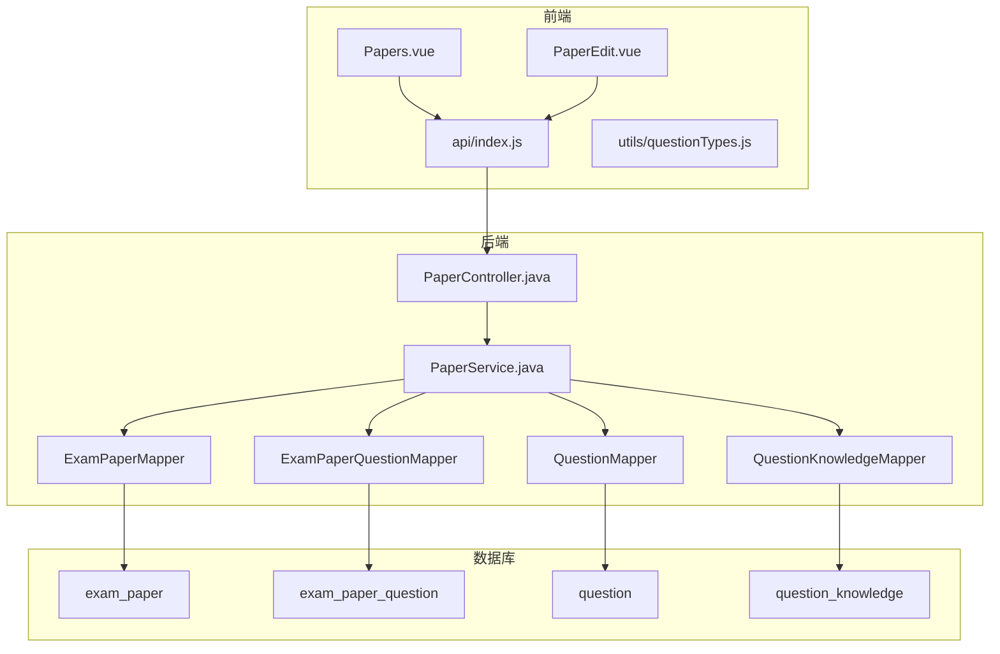
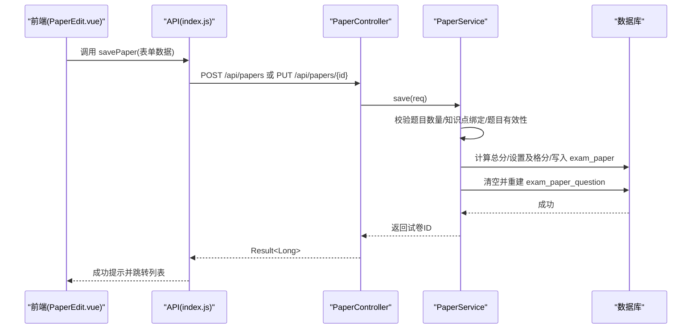
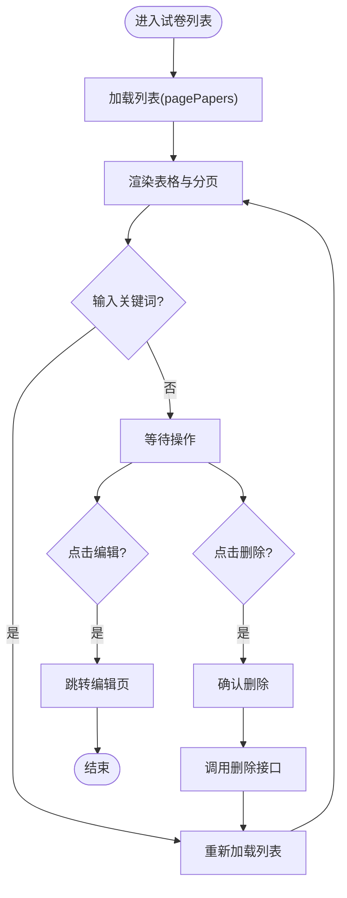
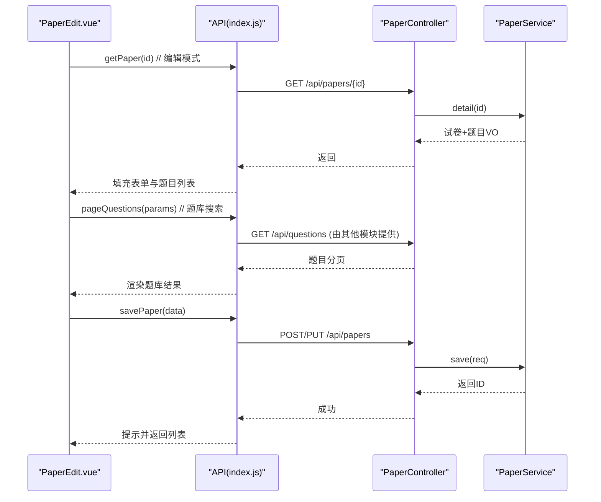
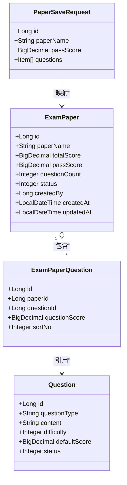
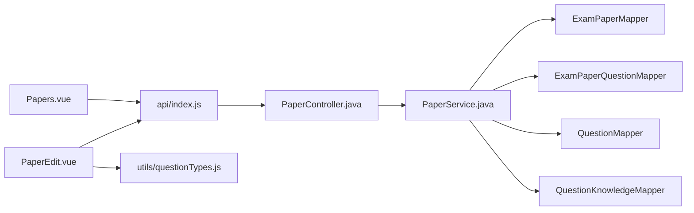

# 试卷管理界面

<cite>
**本文引用的文件**
- [Papers.vue](file://exam-web/src/views/admin/Papers.vue)
- [PaperEdit.vue](file://exam-web/src/views/admin/PaperEdit.vue)
- [index.js](file://exam-web/src/api/index.js)
- [questionTypes.js](file://exam-web/src/utils/questionTypes.js)
- [PaperController.java](file://exam-server/src/main/java/com/exam/controller/PaperController.java)
- [PaperService.java](file://exam-server/src/main/java/com/exam/service/PaperService.java)
- [ExamPaper.java](file://exam-server/src/main/java/com/exam/entity/ExamPaper.java)
- [ExamPaperQuestion.java](file://exam-server/src/main/java/com/exam/entity/ExamPaperQuestion.java)
- [PaperSaveRequest.java](file://exam-server/src/main/java/com/exam/dto/PaperSaveRequest.java)
- [schema.sql](file://sql/schema.sql)
</cite>

## 目录
1. [简介](#简介)
2. [项目结构](#项目结构)
3. [核心组件](#核心组件)
4. [架构总览](#架构总览)
5. [详细组件分析](#详细组件分析)
6. [依赖关系分析](#依赖关系分析)
7. [性能考虑](#性能考虑)
8. [故障排查指南](#故障排查指南)
9. [结论](#结论)
10. [附录](#附录)

## 简介
本文件面向“试卷管理”功能，围绕前端两个关键页面与后端接口服务，系统说明：
- 试卷列表展示、状态管理与删除
- 组卷编辑器（手动组卷）的实现细节
- 试卷结构配置、分值设置、及格分策略
- 预览能力（基于已保存的试卷详情）
- 当前实现边界：未包含随机抽题、知识点覆盖控制、难度平衡、版本管理、批量操作等高级能力；文档将明确现有实现与可扩展点。

## 项目结构
前端通过 Vue 单页应用组织视图与 API 调用，后端以 Spring Boot 提供 REST 接口，数据持久化使用 MyBatis Plus。

图表来源
- [Papers.vue:1-44](file://exam-web/src/views/admin/Papers.vue#L1-L44)
- [PaperEdit.vue:1-98](file://exam-web/src/views/admin/PaperEdit.vue#L1-L98)
- [index.js:53-57](file://exam-web/src/api/index.js#L53-L57)
- [PaperController.java:21-62](file://exam-server/src/main/java/com/exam/controller/PaperController.java#L21-L62)
- [PaperService.java:30-160](file://exam-server/src/main/java/com/exam/service/PaperService.java#L30-L160)
- [schema.sql:89-112](file://sql/schema.sql#L89-L112)

章节来源
- [Papers.vue:1-44](file://exam-web/src/views/admin/Papers.vue#L1-L44)
- [PaperEdit.vue:1-98](file://exam-web/src/views/admin/PaperEdit.vue#L1-L98)
- [index.js:53-57](file://exam-web/src/api/index.js#L53-L57)
- [PaperController.java:21-62](file://exam-server/src/main/java/com/exam/controller/PaperController.java#L21-L62)
- [PaperService.java:30-160](file://exam-server/src/main/java/com/exam/service/PaperService.java#L30-L160)
- [schema.sql:89-112](file://sql/schema.sql#L89-L112)

## 核心组件
- 试卷列表页（Papers.vue）
  - 支持按名称模糊查询、分页展示、编辑跳转、删除确认与刷新。
- 组卷编辑页（PaperEdit.vue）
  - 支持新建/编辑试卷名、及格分、题目列表维护（题型、分值、排序）、从题库搜索并加入、保存提交。
- 后端控制器（PaperController.java）
  - 提供分页查询、选项列表、详情获取、创建/更新、删除接口。
- 业务服务（PaperService.java）
  - 实现分页过滤、详情组装、保存校验与落库、逻辑删除、选项列表。
- 数据模型
  - ExamPaper：试卷主表（名称、总分、及格分、题量、状态、创建信息等）。
  - ExamPaperQuestion：试卷-题目关联（每题分值、顺序）。
  - PaperSaveRequest：组卷保存请求体（含题目项列表）。

章节来源
- [Papers.vue:1-44](file://exam-web/src/views/admin/Papers.vue#L1-L44)
- [PaperEdit.vue:1-98](file://exam-web/src/views/admin/PaperEdit.vue#L1-L98)
- [PaperController.java:21-62](file://exam-server/src/main/java/com/exam/controller/PaperController.java#L21-L62)
- [PaperService.java:30-160](file://exam-server/src/main/java/com/exam/service/PaperService.java#L30-L160)
- [ExamPaper.java:11-25](file://exam-server/src/main/java/com/exam/entity/ExamPaper.java#L11-L25)
- [ExamPaperQuestion.java:10-20](file://exam-server/src/main/java/com/exam/entity/ExamPaperQuestion.java#L10-L20)
- [PaperSaveRequest.java:8-22](file://exam-server/src/main/java/com/exam/dto/PaperSaveRequest.java#L8-L22)

## 架构总览
以下时序图展示“保存试卷”的端到端流程：

图表来源
- [PaperEdit.vue:71-80](file://exam-web/src/views/admin/PaperEdit.vue#L71-L80)
- [index.js:53-57](file://exam-web/src/api/index.js#L53-L57)
- [PaperController.java:45-55](file://exam-server/src/main/java/com/exam/controller/PaperController.java#L45-L55)
- [PaperService.java:79-127](file://exam-server/src/main/java/com/exam/service/PaperService.java#L79-L127)
- [schema.sql:89-112](file://sql/schema.sql#L89-L112)

## 详细组件分析

### 试卷列表（Papers.vue）
- 功能要点
  - 顶部标题与“组卷”入口按钮。
  - 关键词过滤（试卷名），分页展示。
  - 行内操作：编辑跳转到组卷编辑页；删除前二次确认并刷新列表。
- 数据流
  - 初始化时加载列表；分页切换触发重新加载。
  - 删除通过消息框确认后调用删除接口，成功后刷新。
- 交互与体验
  - 使用 Element Plus 表格与分页组件，简洁直观。
  - 删除前弹窗确认，避免误删。

图表来源
- [Papers.vue:1-44](file://exam-web/src/views/admin/Papers.vue#L1-L44)
- [index.js:53-57](file://exam-web/src/api/index.js#L53-L57)

章节来源
- [Papers.vue:1-44](file://exam-web/src/views/admin/Papers.vue#L1-L44)
- [index.js:53-57](file://exam-web/src/api/index.js#L53-L57)

### 组卷编辑器（PaperEdit.vue）
- 功能要点
  - 表单字段：试卷名、及格分。
  - 题目区：显示已选题目（题干、题型、分值、移除），实时统计总分。
  - 题库检索：按题型、关键词搜索，支持“加入”到试卷。
  - 保存：提交试卷基本信息与题目数组（题号、分值、顺序）。
- 数据流
  - 进入编辑页时，若为编辑模式则拉取试卷详情，填充表单与题目列表。
  - 新增题目时自动分配默认分值与顺序。
  - 保存时将题目映射为后端所需格式并提交。
- 题型与标签
  - 统一使用 questionTypes.js 中的题型常量与标签转换函数。

图表来源
- [PaperEdit.vue:57-80](file://exam-web/src/views/admin/PaperEdit.vue#L57-L80)
- [index.js:53-57](file://exam-web/src/api/index.js#L53-L57)
- [PaperController.java:40-55](file://exam-server/src/main/java/com/exam/controller/PaperController.java#L40-L55)
- [PaperService.java:52-127](file://exam-server/src/main/java/com/exam/service/PaperService.java#L52-L127)

章节来源
- [PaperEdit.vue:1-98](file://exam-web/src/views/admin/PaperEdit.vue#L1-L98)
- [questionTypes.js:1-11](file://exam-web/src/utils/questionTypes.js#L1-L11)
- [index.js:53-57](file://exam-web/src/api/index.js#L53-L57)
- [PaperController.java:40-55](file://exam-server/src/main/java/com/exam/controller/PaperController.java#L40-L55)
- [PaperService.java:52-127](file://exam-server/src/main/java/com/exam/service/PaperService.java#L52-L127)

### 后端服务与数据模型
- 控制器层
  - 分页查询、选项列表、详情、创建/更新、删除。
- 服务层
  - 分页：仅返回启用状态的试卷，非管理员限制为本人创建。
  - 详情：组装试卷信息与题目列表（含题干、题型、分值、顺序）。
  - 保存：
    - 至少包含一道题。
    - 每道题必须绑定知识点，否则拒绝组卷。
    - 题目必须存在且未删除。
    - 计算总分，设置及格分（默认按总分比例计算）。
    - 更新时先清空旧题目再插入新题目。
  - 删除：逻辑删除（置状态为禁用）。
- 数据模型
  - exam_paper：试卷主信息。
  - exam_paper_question：试卷-题目关联及分值、顺序。
  - question：题目基础信息（类型、难度、默认分值等）。
  - question_knowledge：题目与知识点的多对多关系（权重）。

图表来源
- [ExamPaper.java:11-25](file://exam-server/src/main/java/com/exam/entity/ExamPaper.java#L11-L25)
- [ExamPaperQuestion.java:10-20](file://exam-server/src/main/java/com/exam/entity/ExamPaperQuestion.java#L10-L20)
- [Question.java:11-29](file://exam-server/src/main/java/com/exam/entity/Question.java#L11-L29)
- [PaperSaveRequest.java:8-22](file://exam-server/src/main/java/com/exam/dto/PaperSaveRequest.java#L8-L22)

章节来源
- [PaperController.java:21-62](file://exam-server/src/main/java/com/exam/controller/PaperController.java#L21-L62)
- [PaperService.java:30-160](file://exam-server/src/main/java/com/exam/service/PaperService.java#L30-L160)
- [ExamPaper.java:11-25](file://exam-server/src/main/java/com/exam/entity/ExamPaper.java#L11-L25)
- [ExamPaperQuestion.java:10-20](file://exam-server/src/main/java/com/exam/entity/ExamPaperQuestion.java#L10-L20)
- [Question.java:11-29](file://exam-server/src/main/java/com/exam/entity/Question.java#L11-L29)
- [PaperSaveRequest.java:8-22](file://exam-server/src/main/java/com/exam/dto/PaperSaveRequest.java#L8-L22)

## 依赖关系分析
- 前端依赖
  - Papers.vue 依赖 api/index.js 的 pagePapers/removePaper。
  - PaperEdit.vue 依赖 api/index.js 的 getPaper/savePaper/pageQuestions，以及 utils/questionTypes.js 的题型常量。
- 后端依赖
  - PaperController 依赖 PaperService。
  - PaperService 依赖多个 Mapper 访问数据库表。
- 数据约束
  - 组卷时必须保证题目已绑定知识点，否则阻止保存。
  - 删除为逻辑删除，不物理移除记录。

图表来源
- [Papers.vue:26-42](file://exam-web/src/views/admin/Papers.vue#L26-L42)
- [PaperEdit.vue:43-96](file://exam-web/src/views/admin/PaperEdit.vue#L43-L96)
- [index.js:53-57](file://exam-web/src/api/index.js#L53-L57)
- [PaperController.java:21-62](file://exam-server/src/main/java/com/exam/controller/PaperController.java#L21-L62)
- [PaperService.java:30-160](file://exam-server/src/main/java/com/exam/service/PaperService.java#L30-L160)

章节来源
- [Papers.vue:26-42](file://exam-web/src/views/admin/Papers.vue#L26-L42)
- [PaperEdit.vue:43-96](file://exam-web/src/views/admin/PaperEdit.vue#L43-L96)
- [index.js:53-57](file://exam-web/src/api/index.js#L53-L57)
- [PaperController.java:21-62](file://exam-server/src/main/java/com/exam/controller/PaperController.java#L21-L62)
- [PaperService.java:30-160](file://exam-server/src/main/java/com/exam/service/PaperService.java#L30-L160)

## 性能考虑
- 列表分页
  - 前端使用分页参数，后端通过 Page 对象进行分页查询，减少单次数据量。
- 详情组装
  - 详情接口一次性返回试卷与题目列表，减少多次往返。
- 保存事务
  - 保存过程使用事务，确保试卷主表与题目关联表的一致性。
- 索引建议
  - 根据 SQL 定义，exam_paper_question 表有 paper_id 索引，利于按试卷查询题目。
  - question_knowledge 表有 knowledge_point_id 索引，便于按知识点筛选题目（为未来扩展预留）。

[本节为通用性能建议，不直接分析具体代码文件]

## 故障排查指南
- 无法添加题目到试卷
  - 现象：保存时报错提示“存在未绑定知识点的题目，不能组卷”。
  - 原因：题目未关联任何知识点。
  - 处理：在题目管理中为该题绑定至少一个知识点后再组卷。
- 保存失败：题目不存在或已删除
  - 现象：保存时报错“题目不存在或已删除”。
  - 原因：所选题目已被删除或无效。
  - 处理：重新选择有效题目。
- 保存失败：试卷至少包含一道题
  - 现象：保存时报错“试卷至少包含一道题”。
  - 原因：未添加任何题目。
  - 处理：至少加入一道题后保存。
- 列表为空或无权限
  - 现象：非管理员用户看不到他人创建的试卷。
  - 原因：分页查询限制了仅显示本人创建的试卷。
  - 处理：切换账号或使用管理员账号查看。

章节来源
- [PaperService.java:79-127](file://exam-server/src/main/java/com/exam/service/PaperService.java#L79-L127)
- [PaperService.java:39-50](file://exam-server/src/main/java/com/exam/service/PaperService.java#L39-L50)

## 结论
当前实现提供了完整的“手动组卷”闭环：
- 前端列表与编辑页满足基本组卷需求（手动选题、分值设置、保存）。
- 后端保障数据一致性、知识点绑定约束与逻辑删除。
尚未实现的能力（可作为后续扩展方向）：
- 随机抽题算法、知识点覆盖控制、难度平衡策略
- 试卷版本管理
- 批量操作（批量删除、批量导入/导出）
- 考试时间设定与发布流程（与考试模块解耦，可在考试管理中组合试卷）

[本节为总结性内容，不直接分析具体文件]

## 附录

### 试卷结构配置与分值设置
- 试卷结构
  - 试卷主表存储名称、总分、及格分、题量、状态等。
  - 题目关联表存储每题分值与顺序。
- 分值设置
  - 前端允许对每题设置分值，默认采用题目的默认分值。
  - 后端保存时汇总总分，并按规则设置及格分（默认按总分比例计算）。
- 考试时间设定
  - 当前试卷实体不包含考试时间字段；考试时间通常属于“考试”维度，可在考试管理中指定使用的试卷与时长。

章节来源
- [ExamPaper.java:11-25](file://exam-server/src/main/java/com/exam/entity/ExamPaper.java#L11-L25)
- [ExamPaperQuestion.java:10-20](file://exam-server/src/main/java/com/exam/entity/ExamPaperQuestion.java#L10-L20)
- [PaperService.java:95-107](file://exam-server/src/main/java/com/exam/service/PaperService.java#L95-L107)

### 预览功能
- 预览即“试卷详情”：编辑页进入时若为编辑模式，会拉取试卷详情用于回填；也可复用该详情接口实现“预览”视图。
- 详情返回内容包括试卷基本信息与题目列表（题干、题型、分值、顺序）。

章节来源
- [PaperEdit.vue:81-96](file://exam-web/src/views/admin/PaperEdit.vue#L81-L96)
- [PaperController.java:40-43](file://exam-server/src/main/java/com/exam/controller/PaperController.java#L40-L43)
- [PaperService.java:52-77](file://exam-server/src/main/java/com/exam/service/PaperService.java#L52-L77)

### 组卷规则配置与扩展开发指南
- 现有规则
  - 题目必须绑定知识点才能加入试卷。
  - 题目必须存在且未删除。
  - 保存时校验题目数量与分值。
- 可扩展点
  - 随机抽题：在服务层增加按题型、知识点、难度等多维度的随机抽取算法，生成候选题目集。
  - 知识点覆盖控制：基于 question_knowledge 表的权重，计算各知识点覆盖率，并在保存前给出预警或强制调整。
  - 难度平衡：结合题目 difficulty 字段，统计难度分布，提供均衡策略（如高/中/低难度比例）。
  - 版本管理：为试卷引入版本号或快照机制，保留历史版本以便回溯与对比。
  - 批量操作：提供批量删除、批量导入/导出、批量复制等功能。
  - 发布流程：与考试模块联动，支持试卷发布、停用、归档等操作。

[本节为扩展建议，不直接分析具体文件]