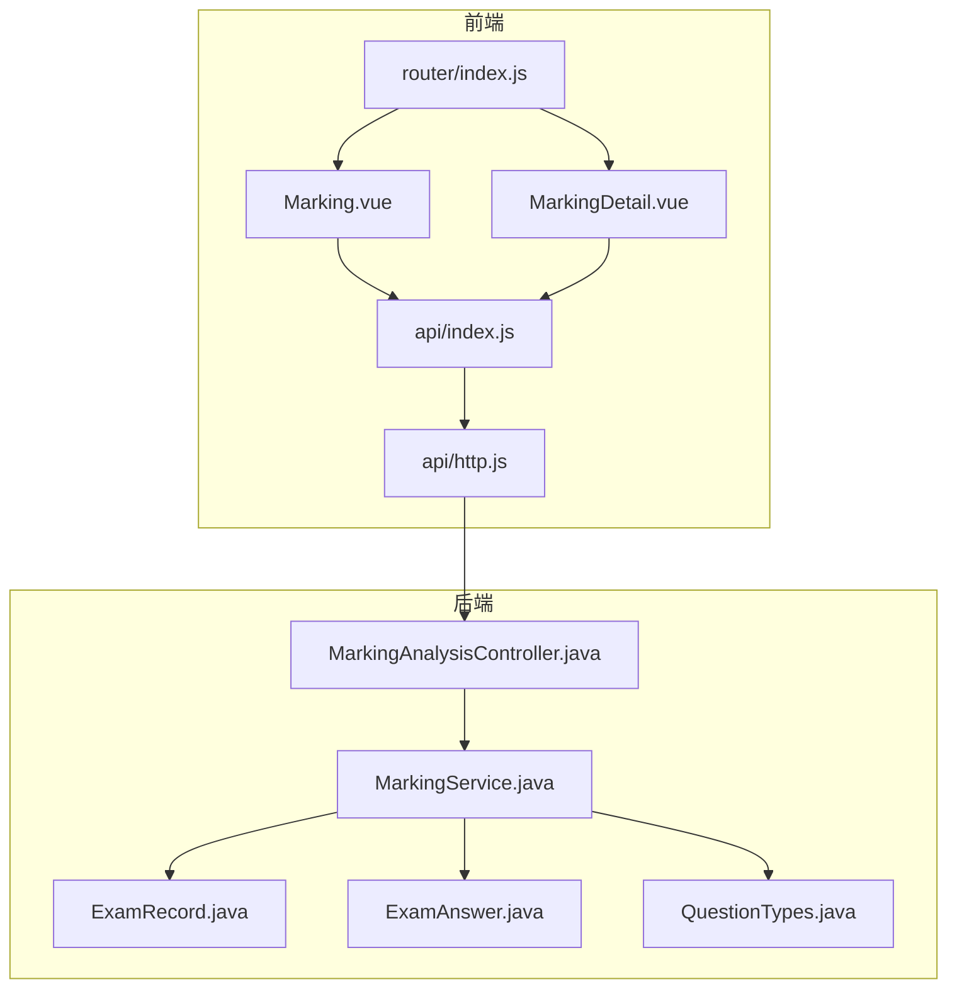
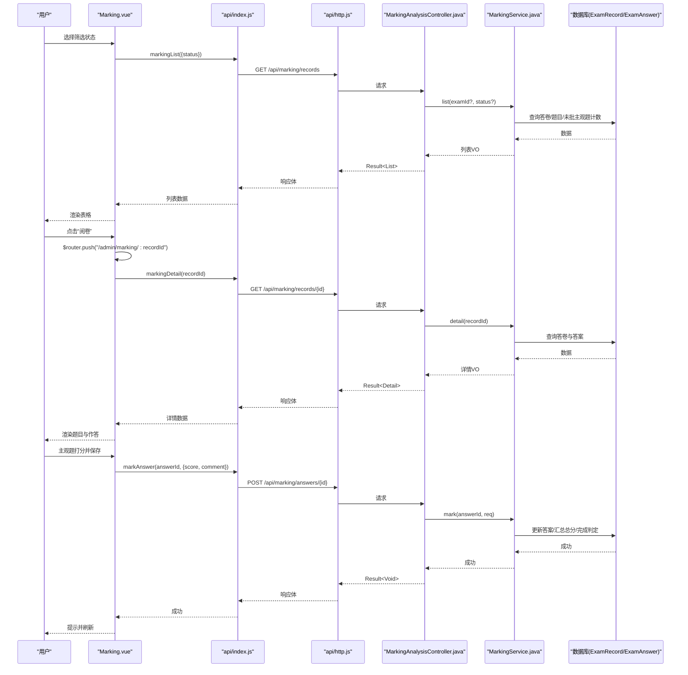
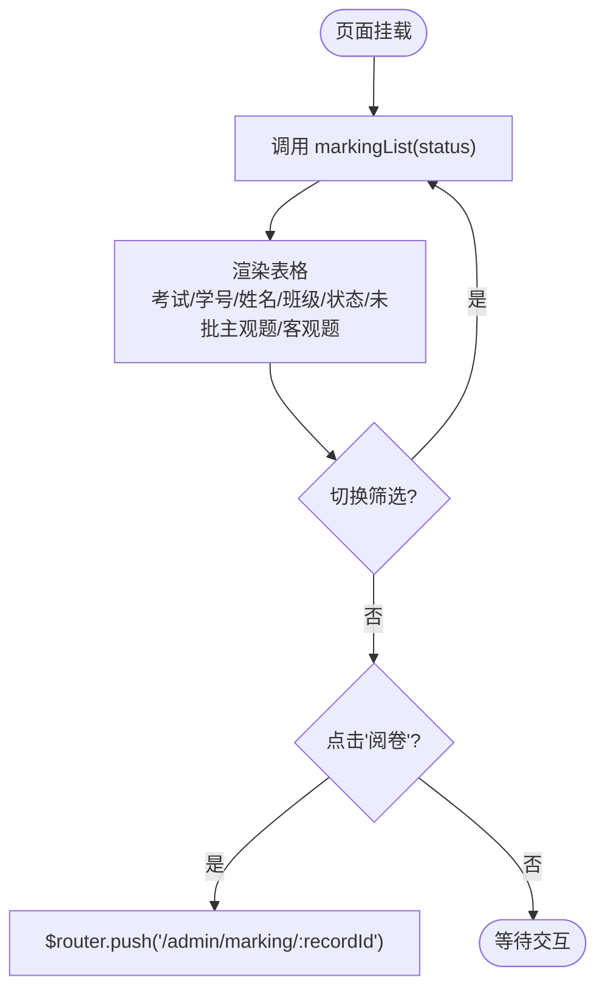
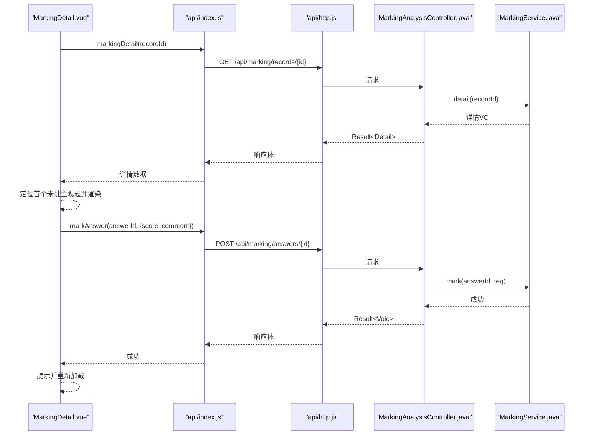
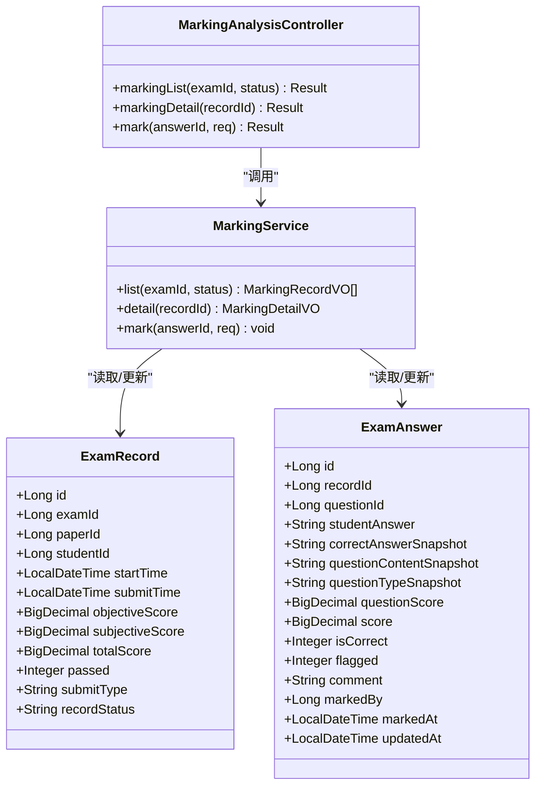
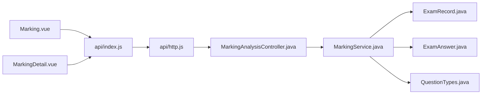

# 阅卷列表管理

<cite>
**本文引用的文件**
- [Marking.vue](file://exam-web/src/views/admin/Marking.vue)
- [MarkingDetail.vue](file://exam-web/src/views/admin/MarkingDetail.vue)
- [index.js（路由）](file://exam-web/src/router/index.js)
- [index.js（API 封装）](file://exam-web/src/api/index.js)
- [http.js（HTTP 拦截器）](file://exam-web/src/api/http.js)
- [questionTypes.js（题型工具）](file://exam-web/src/utils/questionTypes.js)
- [MarkingAnalysisController.java](file://exam-server/src/main/java/com/exam/controller/MarkingAnalysisController.java)
- [MarkingService.java](file://exam-server/src/main/java/com/exam/service/MarkingService.java)
- [ExamRecord.java](file://exam-server/src/main/java/com/exam/entity/ExamRecord.java)
- [ExamAnswer.java](file://exam-server/src/main/java/com/exam/entity/ExamAnswer.java)
- [QuestionTypes.java](file://exam-server/src/main/java/com/exam/util/QuestionTypes.java)
</cite>

## 目录
1. [简介](#简介)
2. [项目结构](#项目结构)
3. [核心组件](#核心组件)
4. [架构总览](#架构总览)
5. [详细组件分析](#详细组件分析)
6. [依赖关系分析](#依赖关系分析)
7. [性能考虑](#性能考虑)
8. [故障排查指南](#故障排查指南)
9. [结论](#结论)
10. [附录](#附录)

## 简介
本文件围绕“阅卷列表管理”功能，系统性说明前端 Marking.vue 组件的实现与交互流程，包括待阅卷/已完成状态筛选、考试信息展示（考试名称、学号、姓名、班级）、阅卷状态显示（待阅卷/已完成）、未批主观题数量统计、客观题分数展示；并解释数据加载机制、状态切换逻辑、路由跳转、表格列配置、按钮操作、用户交互流程，以及错误处理、数据刷新与性能优化等实现细节。同时结合后端接口与服务逻辑，给出端到端的数据流与关键业务规则说明。

## 项目结构
- 前端页面：admin 下的 Marking.vue 负责阅卷列表展示与筛选；MarkingDetail.vue 负责单条答卷的逐题阅卷。
- 路由：/admin/marking 为列表页，/admin/marking/:recordId 为详情页。
- API：通过 /api/marking/records 获取列表，/api/marking/records/{id} 获取详情，/api/marking/answers/{id} 提交评分。
- 后端控制器与服务：MarkingAnalysisController 暴露 REST 接口；MarkingService 实现查询、评分、汇总与完成判定等业务逻辑。
- 数据模型：ExamRecord 表示一份答卷/成绩；ExamAnswer 表示每题作答明细；QuestionTypes 提供题型常量与判断方法。

图表来源
- [Marking.vue:1-38](file://exam-web/src/views/admin/Marking.vue#L1-L38)
- [MarkingDetail.vue:1-85](file://exam-web/src/views/admin/MarkingDetail.vue#L1-L85)
- [index.js（路由）:1-67](file://exam-web/src/router/index.js#L1-L67)
- [index.js（API 封装）:1-82](file://exam-web/src/api/index.js#L1-L82)
- [http.js:1-47](file://exam-web/src/api/http.js#L1-L47)
- [MarkingAnalysisController.java:1-134](file://exam-server/src/main/java/com/exam/controller/MarkingAnalysisController.java#L1-L134)
- [MarkingService.java:1-152](file://exam-server/src/main/java/com/exam/service/MarkingService.java#L1-L152)
- [ExamRecord.java:1-29](file://exam-server/src/main/java/com/exam/entity/ExamRecord.java#L1-L29)
- [ExamAnswer.java:1-32](file://exam-server/src/main/java/com/exam/entity/ExamAnswer.java#L1-L32)
- [QuestionTypes.java:1-123](file://exam-server/src/main/java/com/exam/util/QuestionTypes.java#L1-L123)

章节来源
- [Marking.vue:1-38](file://exam-web/src/views/admin/Marking.vue#L1-L38)
- [index.js（路由）:1-67](file://exam-web/src/router/index.js#L1-L67)
- [index.js（API 封装）:1-82](file://exam-web/src/api/index.js#L1-L82)
- [http.js:1-47](file://exam-web/src/api/http.js#L1-L47)
- [MarkingAnalysisController.java:1-134](file://exam-server/src/main/java/com/exam/controller/MarkingAnalysisController.java#L1-L134)
- [MarkingService.java:1-152](file://exam-server/src/main/java/com/exam/service/MarkingService.java#L1-L152)
- [ExamRecord.java:1-29](file://exam-server/src/main/java/com/exam/entity/ExamRecord.java#L1-L29)
- [ExamAnswer.java:1-32](file://exam-server/src/main/java/com/exam/entity/ExamAnswer.java#L1-L32)
- [QuestionTypes.java:1-123](file://exam-server/src/main/java/com/exam/util/QuestionTypes.java#L1-L123)

## 核心组件
- Marking.vue：阅卷列表页，提供“全部/待阅卷/已完成”筛选，渲染考试信息、学生信息、阅卷状态、未批主观题数、客观题分数，并提供“阅卷”按钮跳转到详情页。
- MarkingDetail.vue：单条答卷阅卷页，按题号导航，展示题目快照与学生作答，主观题支持打分与评语保存，完成后自动刷新列表或当前项状态。
- 路由：/admin/marking 与 /admin/marking/:recordId 分别对应列表与详情。
- API：markingList、markingDetail、markAnswer 三个接口分别用于列表查询、详情获取、评分提交。
- HTTP 拦截器：统一携带 JWT、统一错误提示与 401 跳转登录。

章节来源
- [Marking.vue:1-38](file://exam-web/src/views/admin/Marking.vue#L1-L38)
- [MarkingDetail.vue:1-85](file://exam-web/src/views/admin/MarkingDetail.vue#L1-L85)
- [index.js（路由）:1-67](file://exam-web/src/router/index.js#L1-L67)
- [index.js（API 封装）:1-82](file://exam-web/src/api/index.js#L1-L82)
- [http.js:1-47](file://exam-web/src/api/http.js#L1-L47)

## 架构总览
阅卷列表管理的端到端流程如下：
- 前端在列表页根据状态筛选调用 markingList 接口，后端聚合 ExamRecord、Exam、Student 信息并计算未批主观题数量返回。
- 点击“阅卷”跳转至详情页，加载该答卷的题目列表与作答情况。
- 对主观题打分并提交，后端校验分值范围、更新答题记录，并在所有主观题批完后汇总总分、标记完成。
- 列表与详情页均基于最新数据进行刷新，保证状态一致性。

图表来源
- [Marking.vue:1-38](file://exam-web/src/views/admin/Marking.vue#L1-L38)
- [MarkingDetail.vue:1-85](file://exam-web/src/views/admin/MarkingDetail.vue#L1-L85)
- [index.js（API 封装）:1-82](file://exam-web/src/api/index.js#L1-L82)
- [http.js:1-47](file://exam-web/src/api/http.js#L1-L47)
- [MarkingAnalysisController.java:1-134](file://exam-server/src/main/java/com/exam/controller/MarkingAnalysisController.java#L1-L134)
- [MarkingService.java:1-152](file://exam-server/src/main/java/com/exam/service/MarkingService.java#L1-L152)
- [ExamRecord.java:1-29](file://exam-server/src/main/java/com/exam/entity/ExamRecord.java#L1-L29)
- [ExamAnswer.java:1-32](file://exam-server/src/main/java/com/exam/entity/ExamAnswer.java#L1-L32)

## 详细组件分析

### Marking.vue 组件分析
- 模板层
  - 顶部标题与说明：仅处理主观题，全部批完后才出总分。
  - 筛选区：使用单选组绑定 status，默认“待阅卷”，可选“全部/待阅卷/已完成”。
  - 表格列配置：
    - 考试：examName
    - 学号：studentNo
    - 姓名：studentName
    - 班级：className
    - 状态：根据 record.recordStatus 显示“待阅卷/已完成”
    - 未批主观题：pendingEssay
    - 客观题：record.objectiveScore
    - 操作：链接按钮“阅卷”，跳转至 /admin/marking/:recordId
- 脚本层
  - 状态与数据：status、list 均为响应式 ref。
  - 数据加载：load() 调用 markingList({ status })，将返回数据赋值给 list。
  - 生命周期：onMounted(load) 在挂载时加载数据。
- 交互流程
  - 切换筛选状态触发 @change="load"，重新拉取列表。
  - 点击“阅卷”通过 $router.push 进入详情页。

图表来源
- [Marking.vue:1-38](file://exam-web/src/views/admin/Marking.vue#L1-L38)
- [index.js（API 封装）:1-82](file://exam-web/src/api/index.js#L1-L82)
- [index.js（路由）:1-67](file://exam-web/src/router/index.js#L1-L67)

章节来源
- [Marking.vue:1-38](file://exam-web/src/views/admin/Marking.vue#L1-L38)
- [index.js（API 封装）:1-82](file://exam-web/src/api/index.js#L1-L82)
- [index.js（路由）:1-67](file://exam-web/src/router/index.js#L1-L67)

### MarkingDetail.vue 组件分析
- 模板层
  - 头部：显示学生姓名、学号、考试名称与客观题分数，提供返回列表按钮。
  - 左侧题号导航：按顺序列出题目，高亮当前题，主观题用样式区分，已批题目绿色标识。
  - 右侧内容区：展示题型标签、题干快照、学生作答、参考答案；主观题提供打分输入框、评语输入框与保存按钮；客观题显示自动评分结果。
- 脚本层
  - 数据：detail、idx、score、comment。
  - 计算属性：cur 指向当前题目。
  - 监听：watch(cur) 同步 score/comment 到本地状态。
  - 加载：onMounted(load)，从 markingDetail 获取详情，并定位首个未批主观题。
  - 保存：markAnswer 提交评分与评语，成功后提示并重新加载。
- 交互流程
  - 点击题号切换题目，自动填充分数与评语。
  - 主观题保存后刷新，若全部主观题完成，后端会汇总总分并标记完成。

图表来源
- [MarkingDetail.vue:1-85](file://exam-web/src/views/admin/MarkingDetail.vue#L1-L85)
- [index.js（API 封装）:1-82](file://exam-web/src/api/index.js#L1-L82)
- [http.js:1-47](file://exam-web/src/api/http.js#L1-L47)
- [MarkingAnalysisController.java:1-134](file://exam-server/src/main/java/com/exam/controller/MarkingAnalysisController.java#L1-L134)
- [MarkingService.java:1-152](file://exam-server/src/main/java/com/exam/service/MarkingService.java#L1-L152)

章节来源
- [MarkingDetail.vue:1-85](file://exam-web/src/views/admin/MarkingDetail.vue#L1-L85)
- [index.js（API 封装）:1-82](file://exam-web/src/api/index.js#L1-L82)
- [http.js:1-47](file://exam-web/src/api/http.js#L1-L47)
- [MarkingAnalysisController.java:1-134](file://exam-server/src/main/java/com/exam/controller/MarkingAnalysisController.java#L1-L134)
- [MarkingService.java:1-152](file://exam-server/src/main/java/com/exam/service/MarkingService.java#L1-L152)

### 后端服务与数据模型分析
- 列表查询
  - 控制器：/api/marking/records 接收 examId 与 status 参数，调用 service.list。
  - 服务：根据条件过滤 ExamRecord，关联 Exam 与 Student 信息，统计未批主观题数量（ESSAY/TERM 且 markedAt 为空），返回 MarkingRecordVO。
- 详情查询
  - 控制器：/api/marking/records/{recordId} 调用 service.detail。
  - 服务：校验答卷存在性，组装 MarkingDetailVO，包含答卷信息与答案列表。
- 评分提交
  - 控制器：/api/marking/answers/{answerId} 调用 service.mark。
  - 服务：校验答案存在性与题型为主观题，校验分值范围，更新答案字段（score、comment、markedBy、markedAt、isCorrect），当某答卷剩余未批主观题数为 0 时，汇总主观分并调用 finishRecord 完成答卷，记录操作日志。
- 数据模型
  - ExamRecord：答卷主表，包含客观分、主观分、总分、是否及格、提交时间、状态等。
  - ExamAnswer：每题作答明细，包含题干与正确答案快照、题型快照、分值、得分、是否正确、评语、批改人与批改时间等。
  - QuestionTypes：提供题型常量与 isSubjective 等方法，用于识别主观题。

图表来源
- [MarkingService.java:1-152](file://exam-server/src/main/java/com/exam/service/MarkingService.java#L1-L152)
- [MarkingAnalysisController.java:1-134](file://exam-server/src/main/java/com/exam/controller/MarkingAnalysisController.java#L1-L134)
- [ExamRecord.java:1-29](file://exam-server/src/main/java/com/exam/entity/ExamRecord.java#L1-L29)
- [ExamAnswer.java:1-32](file://exam-server/src/main/java/com/exam/entity/ExamAnswer.java#L1-L32)

章节来源
- [MarkingService.java:1-152](file://exam-server/src/main/java/com/exam/service/MarkingService.java#L1-L152)
- [MarkingAnalysisController.java:1-134](file://exam-server/src/main/java/com/exam/controller/MarkingAnalysisController.java#L1-L134)
- [ExamRecord.java:1-29](file://exam-server/src/main/java/com/exam/entity/ExamRecord.java#L1-L29)
- [ExamAnswer.java:1-32](file://exam-server/src/main/java/com/exam/entity/ExamAnswer.java#L1-L32)
- [QuestionTypes.java:1-123](file://exam-server/src/main/java/com/exam/util/QuestionTypes.java#L1-L123)

## 依赖关系分析
- 前端依赖
  - Marking.vue 依赖 api/index.js 中的 markingList 与 router 进行数据加载与路由跳转。
  - MarkingDetail.vue 依赖 markingDetail 与 markAnswer，并使用 utils/questionTypes.js 的 typeLabel 与 isSubjective。
  - http.js 提供统一的请求拦截与错误处理。
- 后端依赖
  - MarkingAnalysisController 依赖 MarkingService 与实体 Mapper。
  - MarkingService 依赖 ExamRecordMapper、ExamAnswerMapper、ExamMapper、StudentMapper、StudentExamService、OperLogService 与 QuestionTypes。
- 外部集成
  - 认证：http.js 自动注入 Authorization 头，401 时跳转登录。
  - 题库与题型：QuestionTypes 提供统一题型判断与默认分值。

图表来源
- [Marking.vue:1-38](file://exam-web/src/views/admin/Marking.vue#L1-L38)
- [MarkingDetail.vue:1-85](file://exam-web/src/views/admin/MarkingDetail.vue#L1-L85)
- [index.js（API 封装）:1-82](file://exam-web/src/api/index.js#L1-L82)
- [http.js:1-47](file://exam-web/src/api/http.js#L1-L47)
- [MarkingAnalysisController.java:1-134](file://exam-server/src/main/java/com/exam/controller/MarkingAnalysisController.java#L1-L134)
- [MarkingService.java:1-152](file://exam-server/src/main/java/com/exam/service/MarkingService.java#L1-L152)
- [ExamRecord.java:1-29](file://exam-server/src/main/java/com/exam/entity/ExamRecord.java#L1-L29)
- [ExamAnswer.java:1-32](file://exam-server/src/main/java/com/exam/entity/ExamAnswer.java#L1-L32)
- [QuestionTypes.java:1-123](file://exam-server/src/main/java/com/exam/util/QuestionTypes.java#L1-L123)

章节来源
- [Marking.vue:1-38](file://exam-web/src/views/admin/Marking.vue#L1-L38)
- [MarkingDetail.vue:1-85](file://exam-web/src/views/admin/MarkingDetail.vue#L1-L85)
- [index.js（API 封装）:1-82](file://exam-web/src/api/index.js#L1-L82)
- [http.js:1-47](file://exam-web/src/api/http.js#L1-L47)
- [MarkingAnalysisController.java:1-134](file://exam-server/src/main/java/com/exam/controller/MarkingAnalysisController.java#L1-L134)
- [MarkingService.java:1-152](file://exam-server/src/main/java/com/exam/service/MarkingService.java#L1-L152)
- [ExamRecord.java:1-29](file://exam-server/src/main/java/com/exam/entity/ExamRecord.java#L1-L29)
- [ExamAnswer.java:1-32](file://exam-server/src/main/java/com/exam/entity/ExamAnswer.java#L1-L32)
- [QuestionTypes.java:1-123](file://exam-server/src/main/java/com/exam/util/QuestionTypes.java#L1-L123)

## 性能考虑
- 列表查询
  - 后端按提交时间倒序排序，减少不必要的数据量；仅在必要时关联 Exam 与 Student 信息。
  - 未批主观题数量通过独立计数查询，避免全表扫描。
- 前端渲染
  - 列表数据一次性加载，筛选切换直接重拉数据，简单可靠；如需大数据量可考虑分页与虚拟滚动。
- 网络与缓存
  - 统一超时与错误处理，减少无效重试；可考虑对列表接口增加短期缓存策略以降低重复请求。
- 评分提交
  - 服务端事务保证答案更新与总分汇总的一致性；完成后立即回写状态，前端无需额外轮询。

[本节为通用性能建议，不直接分析具体代码文件]

## 故障排查指南
- 401 未登录或令牌过期
  - 现象：请求被拒绝并跳转登录页。
  - 原因：http.js 拦截器检测到 401 清除本地凭证并重定向。
  - 处理：重新登录后再次访问。
- 业务错误提示
  - 现象：ElMessage.error 弹出消息。
  - 原因：后端 Result.code !== 0 或抛出业务异常（如“答卷不存在”“客观题无需人工阅卷”“得分必须在 0 到本题满分之间”）。
  - 处理：检查参数与分值范围，确认题型是否为主观题。
- 列表数据为空
  - 可能原因：无符合条件的答卷、权限限制、后端查询条件不匹配。
  - 处理：检查筛选参数 status 与 examId，确认后端服务正常。
- 详情页无法定位题目
  - 可能原因：答案列表为空或题型快照缺失。
  - 处理：核对 ExamAnswer 数据完整性与 QuestionTypes 枚举一致性。

章节来源
- [http.js:1-47](file://exam-web/src/api/http.js#L1-L47)
- [MarkingService.java:1-152](file://exam-server/src/main/java/com/exam/service/MarkingService.java#L1-L152)
- [ExamAnswer.java:1-32](file://exam-server/src/main/java/com/exam/entity/ExamAnswer.java#L1-L32)
- [QuestionTypes.java:1-123](file://exam-server/src/main/java/com/exam/util/QuestionTypes.java#L1-L123)

## 结论
Marking.vue 作为阅卷列表入口，提供了简洁的状态筛选与信息展示，配合 MarkingDetail.vue 完成逐题阅卷与评分提交。后端通过 MarkingAnalysisController 与 MarkingService 实现了稳健的查询、评分与汇总逻辑，确保在主观题全部批完后自动完成答卷并输出总分。整体架构清晰、职责分明，具备良好的可扩展性与可维护性。建议在数据量增长时引入分页与缓存策略，进一步提升性能与用户体验。

[本节为总结性内容，不直接分析具体代码文件]

## 附录
- 关键接口路径
  - 列表：GET /api/marking/records?examId=&status=
  - 详情：GET /api/marking/records/{recordId}
  - 评分：POST /api/marking/answers/{answerId}
- 状态码与含义
  - MARKING：待阅卷
  - FINISHED：已完成
- 题型与主观题判断
  - ESSAY、TERM 为主观题，需人工阅卷；其他为客观题，自动评分。

[本节为补充信息，不直接分析具体代码文件]