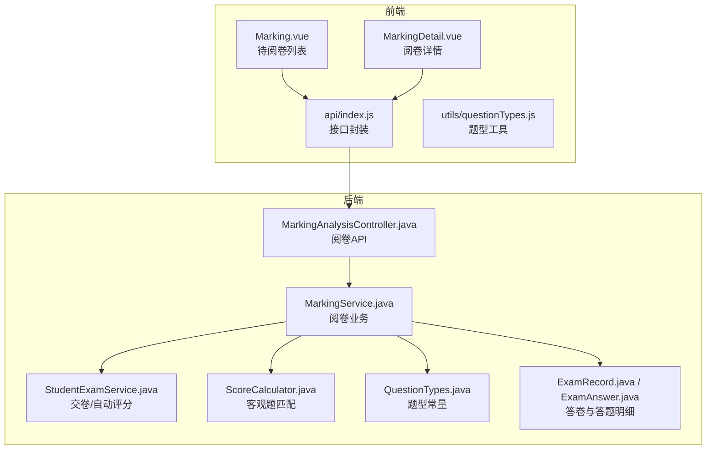
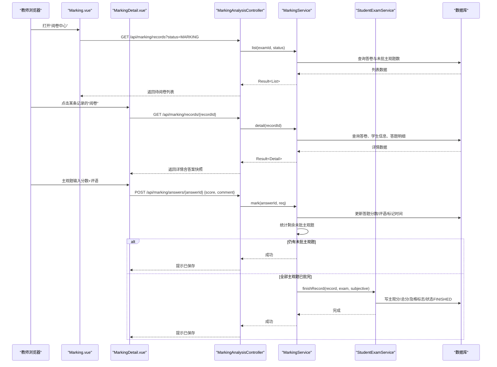
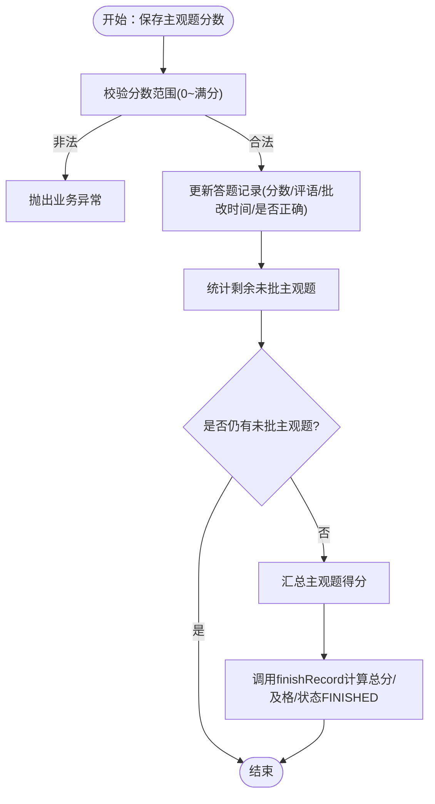
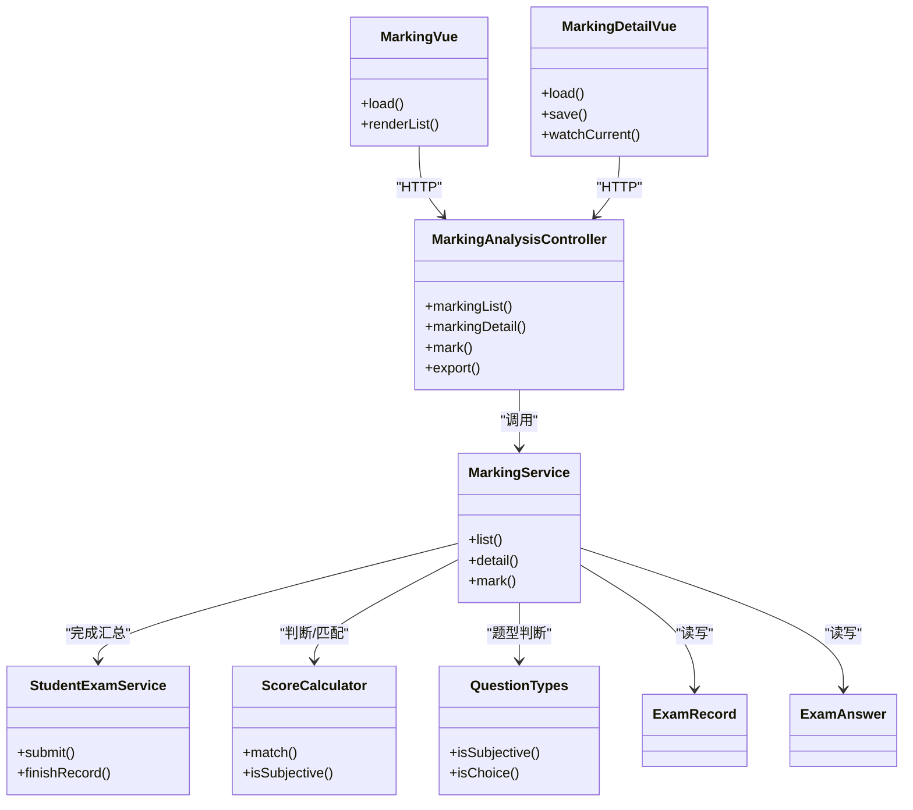

# 阅卷评分界面

<cite>
**本文引用的文件**
- [Marking.vue](file://exam-web/src/views/admin/Marking.vue)
- [MarkingDetail.vue](file://exam-web/src/views/admin/MarkingDetail.vue)
- [index.js](file://exam-web/src/api/index.js)
- [questionTypes.js](file://exam-web/src/utils/questionTypes.js)
- [MarkingAnalysisController.java](file://exam-server/src/main/java/com/exam/controller/MarkingAnalysisController.java)
- [MarkingService.java](file://exam-server/src/main/java/com/exam/service/MarkingService.java)
- [StudentExamService.java](file://exam-server/src/main/java/com/exam/service/StudentExamService.java)
- [ScoreCalculator.java](file://exam-server/src/main/java/com/exam/util/ScoreCalculator.java)
- [QuestionTypes.java](file://exam-server/src/main/java/com/exam/util/QuestionTypes.java)
- [ExamRecord.java](file://exam-server/src/main/java/com/exam/entity/ExamRecord.java)
- [ExamAnswer.java](file://exam-server/src/main/java/com/exam/entity/ExamAnswer.java)
</cite>

## 目录
1. [简介](#简介)
2. [项目结构](#项目结构)
3. [核心组件](#核心组件)
4. [架构总览](#架构总览)
5. [详细组件分析](#详细组件分析)
6. [依赖关系分析](#依赖关系分析)
7. [性能与扩展性](#性能与扩展性)
8. [故障排查指南](#故障排查指南)
9. [结论](#结论)
10. [附录](#附录)

## 简介
本文件面向阅卷教师与系统维护人员，系统性说明“阅卷评分界面”的实现与使用方式。重点覆盖：
- 待阅卷列表展示、任务筛选与跳转
- 主观题阅卷流程（答题内容展示、参考答案参考、评分输入、评语填写）
- 客观题自动评分结果查看与分数修正
- 成绩汇总计算与完成状态流转
- 批量评分、评分模板、质量检查与异常处理
- 评分规则定制与阅卷流程优化建议

## 项目结构
前端采用 Vue 单页应用，后端为 Spring Boot 服务。阅卷相关的前端页面位于 admin 视图目录，后端通过控制器暴露 REST API，服务层封装业务逻辑，数据访问通过 MyBatis-Plus Mapper。

图表来源
- [Marking.vue:1-38](file://exam-web/src/views/admin/Marking.vue#L1-L38)
- [MarkingDetail.vue:1-85](file://exam-web/src/views/admin/MarkingDetail.vue#L1-L85)
- [index.js:66-68](file://exam-web/src/api/index.js#L66-L68)
- [MarkingAnalysisController.java:38-53](file://exam-server/src/main/java/com/exam/controller/MarkingAnalysisController.java#L38-L53)
- [MarkingService.java:38-131](file://exam-server/src/main/java/com/exam/service/MarkingService.java#L38-L131)
- [StudentExamService.java:258-309](file://exam-server/src/main/java/com/exam/service/StudentExamService.java#L258-L309)
- [ScoreCalculator.java:20-53](file://exam-server/src/main/java/com/exam/util/ScoreCalculator.java#L20-L53)
- [QuestionTypes.java:88-96](file://exam-server/src/main/java/com/exam/util/QuestionTypes.java#L88-L96)
- [ExamRecord.java:11-28](file://exam-server/src/main/java/com/exam/entity/ExamRecord.java#L11-L28)
- [ExamAnswer.java:11-31](file://exam-server/src/main/java/com/exam/entity/ExamAnswer.java#L11-L31)

章节来源
- [Marking.vue:1-38](file://exam-web/src/views/admin/Marking.vue#L1-L38)
- [MarkingDetail.vue:1-85](file://exam-web/src/views/admin/MarkingDetail.vue#L1-L85)
- [index.js:66-68](file://exam-web/src/api/index.js#L66-L68)
- [MarkingAnalysisController.java:38-53](file://exam-server/src/main/java/com/exam/controller/MarkingAnalysisController.java#L38-L53)
- [MarkingService.java:38-131](file://exam-server/src/main/java/com/exam/service/MarkingService.java#L38-L131)

## 核心组件
- 待阅卷列表（Marking.vue）：按考试、学号、姓名、班级、状态、未批主观题数量、客观题得分等维度展示；支持按“全部/待阅卷/已完成”筛选；点击“阅卷”进入详情页。
- 阅卷详情（MarkingDetail.vue）：左侧题号导航，右侧显示题目快照、学生作答、参考答案；主观题可输入分数与评语并保存；客观题仅展示自动评分结果。
- 后端控制器（MarkingAnalysisController.java）：提供阅卷记录列表、详情查询、单题打分、成绩导出等接口。
- 阅卷服务（MarkingService.java）：实现待阅统计、详情组装、主观题打分、总分汇总与完成状态推进。
- 自动评分（StudentExamService.java + ScoreCalculator.java）：交卷时自动对客观题进行匹配评分，若存在主观题则进入“待阅卷”，否则直接完成。

章节来源
- [Marking.vue:1-38](file://exam-web/src/views/admin/Marking.vue#L1-L38)
- [MarkingDetail.vue:1-85](file://exam-web/src/views/admin/MarkingDetail.vue#L1-L85)
- [MarkingAnalysisController.java:38-53](file://exam-server/src/main/java/com/exam/controller/MarkingAnalysisController.java#L38-L53)
- [MarkingService.java:38-131](file://exam-server/src/main/java/com/exam/service/MarkingService.java#L38-L131)
- [StudentExamService.java:258-309](file://exam-server/src/main/java/com/exam/service/StudentExamService.java#L258-L309)
- [ScoreCalculator.java:20-53](file://exam-server/src/main/java/com/exam/util/ScoreCalculator.java#L20-L53)

## 架构总览
阅卷流程从前端触发，经 API 到服务层，最终落库并更新成绩与状态。

图表来源
- [Marking.vue:1-38](file://exam-web/src/views/admin/Marking.vue#L1-L38)
- [MarkingDetail.vue:38-68](file://exam-web/src/views/admin/MarkingDetail.vue#L38-L68)
- [index.js:66-68](file://exam-web/src/api/index.js#L66-L68)
- [MarkingAnalysisController.java:38-53](file://exam-server/src/main/java/com/exam/controller/MarkingAnalysisController.java#L38-L53)
- [MarkingService.java:38-131](file://exam-server/src/main/java/com/exam/service/MarkingService.java#L38-L131)
- [StudentExamService.java:258-309](file://exam-server/src/main/java/com/exam/service/StudentExamService.java#L258-L309)

## 详细组件分析

### 待阅卷列表（Marking.vue）
- 功能要点
  - 顶部标题与说明，强调只处理主观题，全部批完后才出总分。
  - 状态筛选：全部、待阅卷、已完成。
  - 表格字段：考试名称、学号、姓名、班级、状态、未批主观题数量、客观题得分、操作按钮。
  - 点击“阅卷”跳转到详情页。
- 交互与数据流
  - 初始化加载默认状态为“待阅卷”。
  - 调用 markingList 接口获取列表数据。
  - 根据 record.recordStatus 判断显示“待阅卷/已完成”。
- 关键路径
  - 列表加载：[Marking.vue:28-36](file://exam-web/src/views/admin/Marking.vue#L28-L36)
  - 列表接口：[index.js:66](file://exam-web/src/api/index.js#L66)
  - 后端列表：[MarkingAnalysisController.java:38-42](file://exam-server/src/main/java/com/exam/controller/MarkingAnalysisController.java#L38-L42)
  - 服务层统计未批主观题：[MarkingService.java:64-69](file://exam-server/src/main/java/com/exam/service/MarkingService.java#L64-L69)

章节来源
- [Marking.vue:1-38](file://exam-web/src/views/admin/Marking.vue#L1-L38)
- [index.js:66](file://exam-web/src/api/index.js#L66)
- [MarkingAnalysisController.java:38-42](file://exam-server/src/main/java/com/exam/controller/MarkingAnalysisController.java#L38-L42)
- [MarkingService.java:38-72](file://exam-server/src/main/java/com/exam/service/MarkingService.java#L38-L72)

### 阅卷详情（MarkingDetail.vue）
- 功能要点
  - 头部显示学生信息与客观题得分。
  - 左侧题号导航，高亮当前题，主观题边框颜色区分，已批题目背景色变化。
  - 右侧显示题型标签、分值、题干快照、学生作答、参考答案。
  - 主观题：分数输入框（范围 0~满分）、评语文本框、保存按钮。
  - 客观题：仅展示自动评分结果。
- 交互与数据流
  - 初始化加载详情，自动定位到第一个未批主观题。
  - 切换题目时同步分数与评语。
  - 保存时调用 markAnswer 提交分数与评语，成功后刷新详情。
- 关键路径
  - 详情加载与定位：[MarkingDetail.vue:58-62](file://exam-web/src/views/admin/MarkingDetail.vue#L58-L62)
  - 保存打分：[MarkingDetail.vue:63-67](file://exam-web/src/views/admin/MarkingDetail.vue#L63-L67)
  - 题型工具：[questionTypes.js:6-8](file://exam-web/src/utils/questionTypes.js#L6-L8)
  - 接口封装：[index.js:67-68](file://exam-web/src/api/index.js#L67-L68)
  - 后端详情：[MarkingAnalysisController.java:44-47](file://exam-server/src/main/java/com/exam/controller/MarkingAnalysisController.java#L44-L47)
  - 服务层详情：[MarkingService.java:74-90](file://exam-server/src/main/java/com/exam/service/MarkingService.java#L74-L90)

章节来源
- [MarkingDetail.vue:1-85](file://exam-web/src/views/admin/MarkingDetail.vue#L1-L85)
- [questionTypes.js:6-8](file://exam-web/src/utils/questionTypes.js#L6-L8)
- [index.js:67-68](file://exam-web/src/api/index.js#L67-L68)
- [MarkingAnalysisController.java:44-47](file://exam-server/src/main/java/com/exam/controller/MarkingAnalysisController.java#L44-L47)
- [MarkingService.java:74-90](file://exam-server/src/main/java/com/exam/service/MarkingService.java#L74-L90)

### 主观题阅卷流程与评分规则
- 评分输入与校验
  - 分数必须在 0 到本题满分之间，否则抛出业务异常。
  - 保存后写入答题记录，记录批改人、批改时间，并计算是否答对（满分视为正确）。
- 完成判定与总分汇总
  - 每次保存后统计该答卷剩余未批主观题数量。
  - 当无剩余未批主观题时，汇总主观题得分，调用 finishRecord 计算总分与及格标志，并将状态置为 FINISHED。
- 关键路径
  - 打分校验与保存：[MarkingService.java:92-114](file://exam-server/src/main/java/com/exam/service/MarkingService.java#L92-L114)
  - 完成判定与汇总：[MarkingService.java:115-131](file://exam-server/src/main/java/com/exam/service/MarkingService.java#L115-L131)
  - 总分与及格计算：[StudentExamService.java:300-309](file://exam-server/src/main/java/com/exam/service/StudentExamService.java#L300-L309)

图表来源
- [MarkingService.java:92-131](file://exam-server/src/main/java/com/exam/service/MarkingService.java#L92-L131)
- [StudentExamService.java:300-309](file://exam-server/src/main/java/com/exam/service/StudentExamService.java#L300-L309)

章节来源
- [MarkingService.java:92-131](file://exam-server/src/main/java/com/exam/service/MarkingService.java#L92-L131)
- [StudentExamService.java:300-309](file://exam-server/src/main/java/com/exam/service/StudentExamService.java#L300-L309)

### 客观题自动评分与结果查看
- 自动评分时机
  - 学生交卷时，系统对客观题进行匹配评分，并累计客观题总分。
  - 若存在主观题，答卷状态置为 MARKING；若无主观题，直接进入 FINISHED。
- 匹配规则
  - 单选/判断：忽略大小写全等匹配。
  - 多选：选项标准化排序后比较。
  - 填空：多空以分隔符拆分，逐空比较。
  - 空答案视为错误。
- 结果查看
  - 阅卷详情中客观题仅展示自动评分结果，无需人工干预。
- 关键路径
  - 交卷自动评分：[StudentExamService.java:258-298](file://exam-server/src/main/java/com/exam/service/StudentExamService.java#L258-L298)
  - 匹配算法：[ScoreCalculator.java:20-53](file://exam-server/src/main/java/com/exam/util/ScoreCalculator.java#L20-L53)
  - 题型判断：[QuestionTypes.java:88-96](file://exam-server/src/main/java/com/exam/util/QuestionTypes.java#L88-L96)

章节来源
- [StudentExamService.java:258-298](file://exam-server/src/main/java/com/exam/service/StudentExamService.java#L258-L298)
- [ScoreCalculator.java:20-53](file://exam-server/src/main/java/com/exam/util/ScoreCalculator.java#L20-L53)
- [QuestionTypes.java:88-96](file://exam-server/src/main/java/com/exam/util/QuestionTypes.java#L88-L96)

### 成绩汇总与导出
- 成绩汇总
  - 主观题全部完成后，汇总主观分，结合客观分得到总分，依据试卷及格线判定是否及格。
- 成绩导出
  - 提供成绩导出接口，导出内容包括考试、学号、姓名、班级、客观题、主观题、总分、是否及格。
- 关键路径
  - 导出接口：[MarkingAnalysisController.java:81-90](file://exam-server/src/main/java/com/exam/controller/MarkingAnalysisController.java#L81-L90)
  - 行映射：[MarkingAnalysisController.java:92-112](file://exam-server/src/main/java/com/exam/controller/MarkingAnalysisController.java#L92-L112)

章节来源
- [MarkingAnalysisController.java:81-112](file://exam-server/src/main/java/com/exam/controller/MarkingAnalysisController.java#L81-L112)

### 数据结构与模型
- 答卷记录（ExamRecord）
  - 包含考试ID、试卷ID、学生ID、起止时间、客观分、主观分、总分、是否及格、提交类型、状态等。
- 答题明细（ExamAnswer）
  - 包含记录ID、题目ID、学生作答、正确答案快照、题干快照、题型快照、满分、得分、是否正确、标记、评语、批改人、批改时间、更新时间等。
- 阅卷VO
  - MarkingRecordVO：包含记录、考试名、学生信息、未批主观题数。
  - MarkingDetailVO：包含记录、考试名、学生信息、答题明细列表。

章节来源
- [ExamRecord.java:11-28](file://exam-server/src/main/java/com/exam/entity/ExamRecord.java#L11-L28)
- [ExamAnswer.java:11-31](file://exam-server/src/main/java/com/exam/entity/ExamAnswer.java#L11-L31)
- [MarkingService.java:133-150](file://exam-server/src/main/java/com/exam/service/MarkingService.java#L133-L150)

## 依赖关系分析
- 前端依赖
  - Marking.vue 与 MarkingDetail.vue 依赖 api/index.js 中的接口封装。
  - 题型工具 questionTypes.js 用于统一题型标签与主观题判断。
- 后端依赖
  - Controller 依赖 Service 与 Mapper。
  - MarkingService 依赖 StudentExamService 完成总分汇总与状态推进。
  - 自动评分依赖 ScoreCalculator 与 QuestionTypes。
  - 数据实体 ExamRecord、ExamAnswer 承载答卷与答题明细。

图表来源
- [Marking.vue:1-38](file://exam-web/src/views/admin/Marking.vue#L1-L38)
- [MarkingDetail.vue:1-85](file://exam-web/src/views/admin/MarkingDetail.vue#L1-L85)
- [MarkingAnalysisController.java:38-90](file://exam-server/src/main/java/com/exam/controller/MarkingAnalysisController.java#L38-L90)
- [MarkingService.java:38-150](file://exam-server/src/main/java/com/exam/service/MarkingService.java#L38-L150)
- [StudentExamService.java:258-309](file://exam-server/src/main/java/com/exam/service/StudentExamService.java#L258-L309)
- [ScoreCalculator.java:20-53](file://exam-server/src/main/java/com/exam/util/ScoreCalculator.java#L20-L53)
- [QuestionTypes.java:88-96](file://exam-server/src/main/java/com/exam/util/QuestionTypes.java#L88-L96)
- [ExamRecord.java:11-28](file://exam-server/src/main/java/com/exam/entity/ExamRecord.java#L11-L28)
- [ExamAnswer.java:11-31](file://exam-server/src/main/java/com/exam/entity/ExamAnswer.java#L11-L31)

## 性能与扩展性
- 性能考虑
  - 列表查询按提交时间倒序，避免全表扫描；可按考试ID与状态过滤减少数据量。
  - 主观题打分后实时统计剩余未批题数，避免重复计算。
  - 导出使用 EasyExcel 流式写入，降低内存占用。
- 扩展建议
  - 批量评分：可在列表页增加批量选择与批量提交接口，服务端聚合校验与事务处理。
  - 评分模板：在 MarkingRequest 中扩展模板ID或预设规则，服务端按模板填充默认分数与评语。
  - 质量检查：引入抽检机制，随机抽取一定比例的主观题进行二次复核，记录复核差异。
  - 异常重试：对网络或服务异常进行重试与降级策略，保证阅卷不中断。

[本节为通用指导，不直接分析具体文件]

## 故障排查指南
- 常见异常
  - 答卷不存在：检查 recordId 是否正确，权限是否足够。
  - 答题记录不存在：检查 answerId 是否有效。
  - 客观题无需人工阅卷：确认题型是否为主观题。
  - 得分超出范围：确保分数在 0 到满分之间。
  - 重复交卷：检查答卷状态是否为 ANSWERING。
- 定位方法
  - 前端：查看控制台错误与网络请求响应。
  - 后端：查看日志与异常堆栈，关注 BizException 抛出位置。
  - 数据一致性：核对 ExamRecord 与 ExamAnswer 的状态与分数字段。
- 关键路径
  - 业务异常抛出点：[MarkingService.java:92-114](file://exam-server/src/main/java/com/exam/service/MarkingService.java#L92-L114)
  - 交卷锁与重复保护：[StudentExamService.java:258-267](file://exam-server/src/main/java/com/exam/service/StudentExamService.java#L258-L267)

章节来源
- [MarkingService.java:92-114](file://exam-server/src/main/java/com/exam/service/MarkingService.java#L92-L114)
- [StudentExamService.java:258-267](file://exam-server/src/main/java/com/exam/service/StudentExamService.java#L258-L267)

## 结论
本阅卷评分界面通过前后端协作，实现了待阅卷列表管理、主观题人工评分、客观题自动评分、成绩汇总与导出等核心能力。系统在设计上注重数据快照、状态流转与异常处理，具备良好的可扩展性与维护性。建议后续引入批量评分、评分模板与质量抽检机制，进一步提升阅卷效率与质量。

[本节为总结性内容，不直接分析具体文件]

## 附录
- 接口清单
  - 列表：GET /api/marking/records
  - 详情：GET /api/marking/records/{recordId}
  - 打分：POST /api/marking/answers/{answerId}
  - 导出：GET /api/scores/export
- 数据模型
  - 答卷记录：ExamRecord
  - 答题明细：ExamAnswer
- 题型工具
  - 主观题判断：QuestionTypes.isSubjective
  - 自动匹配：ScoreCalculator.match

[本节为补充信息，不直接分析具体文件]