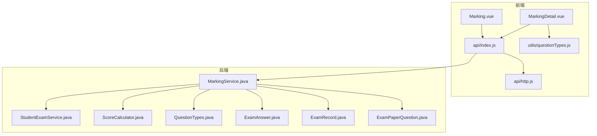
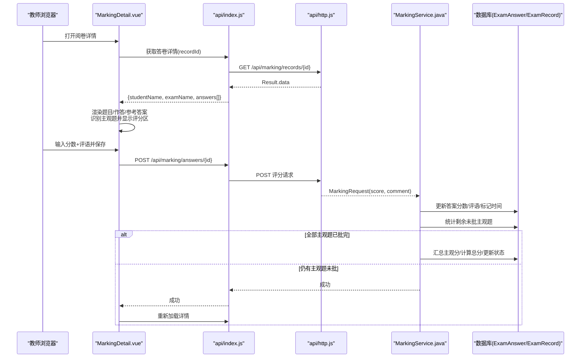
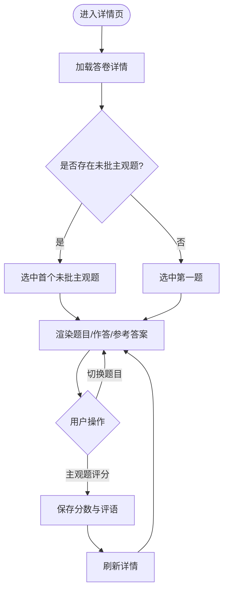
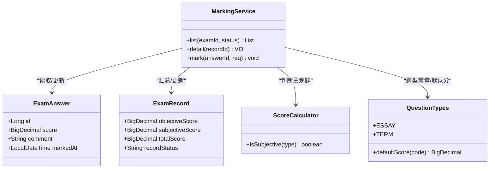
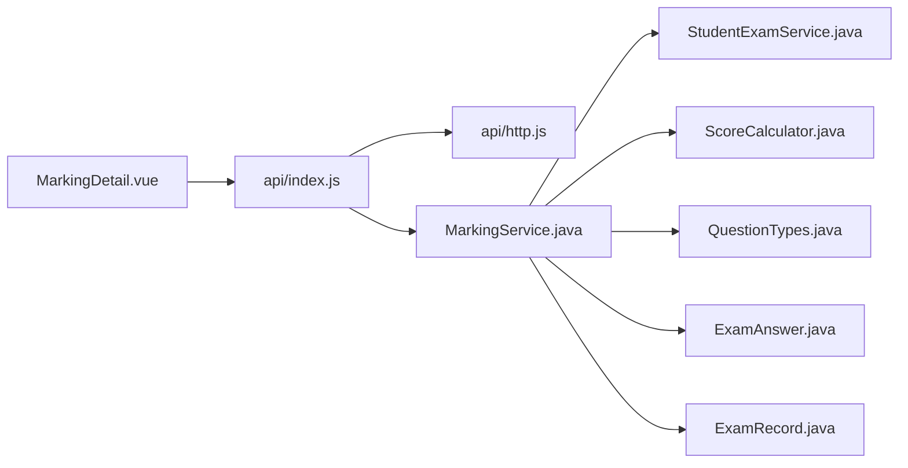

# 阅卷详情界面

<cite>
**本文引用的文件**
- [MarkingDetail.vue](file://exam-web/src/views/admin/MarkingDetail.vue)
- [Marking.vue](file://exam-web/src/views/admin/Marking.vue)
- [index.js](file://exam-web/src/api/index.js)
- [http.js](file://exam-web/src/api/http.js)
- [questionTypes.js](file://exam-web/src/utils/questionTypes.js)
- [MarkingService.java](file://exam-server/src/main/java/com/exam/service/MarkingService.java)
- [StudentExamService.java](file://exam-server/src/main/java/com/exam/service/StudentExamService.java)
- [ScoreCalculator.java](file://exam-server/src/main/java/com/exam/util/ScoreCalculator.java)
- [QuestionTypes.java](file://exam-server/src/main/java/com/exam/util/QuestionTypes.java)
- [ExamAnswer.java](file://exam-server/src/main/java/com/exam/entity/ExamAnswer.java)
- [ExamRecord.java](file://exam-server/src/main/java/com/exam/entity/ExamRecord.java)
- [ExamPaperQuestion.java](file://exam-server/src/main/java/com/exam/entity/ExamPaperQuestion.java)
</cite>

## 目录
1. [简介](#简介)
2. [项目结构](#项目结构)
3. [核心组件](#核心组件)
4. [架构总览](#架构总览)
5. [详细组件分析](#详细组件分析)
6. [依赖关系分析](#依赖关系分析)
7. [性能考虑](#性能考虑)
8. [故障排查指南](#故障排查指南)
9. [结论](#结论)
10. [附录](#附录)

## 简介
本文件面向“阅卷详情界面”的实现与使用，聚焦教师端对某份答卷的逐题审阅与主观题评分。内容涵盖：
- 学生答题内容展示、参考答案对照
- 主观题评分输入、评语填写与保存
- 题目类型识别（客观/主观）与自动评分提示
- 答题记录加载、评分规则应用、总分汇总时机
- 提交确认流程、异常处理与数据校验
- 批量评分思路、评分模板建议、质量检查机制
- 用户体验优化要点

## 项目结构
前端通过路由进入阅卷列表与详情页；后端提供阅卷记录列表、详情查询与单题评分接口；服务层负责数据聚合、评分校验、完成阅卷后的总分汇总与状态流转。

**图表来源**
- [MarkingDetail.vue:1-85](file://exam-web/src/views/admin/MarkingDetail.vue#L1-L85)
- [Marking.vue:1-38](file://exam-web/src/views/admin/Marking.vue#L1-L38)
- [index.js:66-68](file://exam-web/src/api/index.js#L66-L68)
- [http.js:1-47](file://exam-web/src/api/http.js#L1-L47)
- [questionTypes.js:1-11](file://exam-web/src/utils/questionTypes.js#L1-L11)
- [MarkingService.java:38-131](file://exam-server/src/main/java/com/exam/service/MarkingService.java#L38-L131)
- [StudentExamService.java:180-200](file://exam-server/src/main/java/com/exam/service/StudentExamService.java#L180-L200)
- [ScoreCalculator.java:1-55](file://exam-server/src/main/java/com/exam/util/ScoreCalculator.java#L1-L55)
- [QuestionTypes.java:88-123](file://exam-server/src/main/java/com/exam/util/QuestionTypes.java#L88-L123)
- [ExamAnswer.java:1-32](file://exam-server/src/main/java/com/exam/entity/ExamAnswer.java#L1-L32)
- [ExamRecord.java:1-29](file://exam-server/src/main/java/com/exam/entity/ExamRecord.java#L1-L29)
- [ExamPaperQuestion.java:1-21](file://exam-server/src/main/java/com/exam/entity/ExamPaperQuestion.java#L1-L21)

**章节来源**
- [MarkingDetail.vue:1-85](file://exam-web/src/views/admin/MarkingDetail.vue#L1-L85)
- [Marking.vue:1-38](file://exam-web/src/views/admin/Marking.vue#L1-L38)
- [index.js:66-68](file://exam-web/src/api/index.js#L66-L68)
- [http.js:1-47](file://exam-web/src/api/http.js#L1-L47)
- [questionTypes.js:1-11](file://exam-web/src/utils/questionTypes.js#L1-L11)
- [MarkingService.java:38-131](file://exam-server/src/main/java/com/exam/service/MarkingService.java#L38-L131)
- [StudentExamService.java:180-200](file://exam-server/src/main/java/com/exam/service/StudentExamService.java#L180-L200)
- [ScoreCalculator.java:1-55](file://exam-server/src/main/java/com/exam/util/ScoreCalculator.java#L1-L55)
- [QuestionTypes.java:88-123](file://exam-server/src/main/java/com/exam/util/QuestionTypes.java#L88-L123)
- [ExamAnswer.java:1-32](file://exam-server/src/main/java/com/exam/entity/ExamAnswer.java#L1-L32)
- [ExamRecord.java:1-29](file://exam-server/src/main/java/com/exam/entity/ExamRecord.java#L1-L29)
- [ExamPaperQuestion.java:1-21](file://exam-server/src/main/java/com/exam/entity/ExamPaperQuestion.java#L1-L21)

## 核心组件
- 阅卷详情页面 MarkingDetail.vue：加载答卷详情、展示题目与学生作答、区分主客观题、主观题评分与评语保存、跳转回阅卷列表。
- 阅卷列表 Marking.vue：按状态筛选待批/已完成的答卷，点击进入详情页。
- 前端 API：封装阅卷相关接口调用（列表、详情、评分）。
- 题型工具 questionTypes.js：统一题型标签与主观题判断。
- 后端服务 MarkingService：答卷详情聚合、主观题评分校验与落库、完成阅卷后汇总总分并更新状态。
- 学生考试服务 StudentExamService：交卷时自动评分、设置答卷状态为 MARKING/FINISHED。
- 评分工具 ScoreCalculator：客观题匹配逻辑（单选/多选/判断/填空）。
- 题型常量 QuestionTypes：题型定义、默认分值、主观题判定等。
- 实体 ExamAnswer/ExamRecord/ExamPaperQuestion：存储答案快照、成绩、试卷题目分值等。

**章节来源**
- [MarkingDetail.vue:38-68](file://exam-web/src/views/admin/MarkingDetail.vue#L38-L68)
- [Marking.vue:28-36](file://exam-web/src/views/admin/Marking.vue#L28-L36)
- [index.js:66-68](file://exam-web/src/api/index.js#L66-L68)
- [questionTypes.js:1-11](file://exam-web/src/utils/questionTypes.js#L1-L11)
- [MarkingService.java:74-131](file://exam-server/src/main/java/com/exam/service/MarkingService.java#L74-L131)
- [StudentExamService.java:180-200](file://exam-server/src/main/java/com/exam/service/StudentExamService.java#L180-L200)
- [ScoreCalculator.java:20-44](file://exam-server/src/main/java/com/exam/util/ScoreCalculator.java#L20-L44)
- [QuestionTypes.java:88-123](file://exam-server/src/main/java/com/exam/util/QuestionTypes.java#L88-L123)
- [ExamAnswer.java:1-32](file://exam-server/src/main/java/com/exam/entity/ExamAnswer.java#L1-L32)
- [ExamRecord.java:1-29](file://exam-server/src/main/java/com/exam/entity/ExamRecord.java#L1-L29)
- [ExamPaperQuestion.java:1-21](file://exam-server/src/main/java/com/exam/entity/ExamPaperQuestion.java#L1-L21)

## 架构总览
阅卷详情界面的端到端流程如下：
- 教师从阅卷列表进入详情页，前端请求后端获取答卷详情（包含学生信息、考试名称、每题快照与分数）。
- 前端根据题型快照渲染题干、学生作答与参考答案；主观题显示评分输入框与评语输入框。
- 教师输入分数与评语后保存，后端校验分数范围、更新答案记录，并在所有主观题完成后汇总主观分、计算总分、更新答卷状态。

**图表来源**
- [MarkingDetail.vue:58-67](file://exam-web/src/views/admin/MarkingDetail.vue#L58-L67)
- [index.js:66-68](file://exam-web/src/api/index.js#L66-L68)
- [http.js:18-43](file://exam-web/src/api/http.js#L18-L43)
- [MarkingService.java:92-131](file://exam-server/src/main/java/com/exam/service/MarkingService.java#L92-L131)
- [ExamAnswer.java:1-32](file://exam-server/src/main/java/com/exam/entity/ExamAnswer.java#L1-L32)
- [ExamRecord.java:1-29](file://exam-server/src/main/java/com/exam/entity/ExamRecord.java#L1-L29)

## 详细组件分析

### 阅卷详情页面 MarkingDetail.vue
- 数据加载：挂载时通过 recordId 拉取答卷详情，自动定位到第一个未批的主观题以便快速开始评分。
- 题目展示：显示题型标签、满分、题干快照、学生作答与参考答案快照。
- 题型识别：基于 questionTypes.js 的 isSubjective 判断是否为主观题；主观题显示评分与评语输入，客观题仅展示自动评分结果。
- 评分保存：提交当前题分数与评语，成功后刷新详情以同步状态。
- 交互体验：左侧题号导航高亮当前题，已完成主观题用绿色背景标识，主观题边框高亮便于识别。

**图表来源**
- [MarkingDetail.vue:52-67](file://exam-web/src/views/admin/MarkingDetail.vue#L52-L67)
- [questionTypes.js:7-8](file://exam-web/src/utils/questionTypes.js#L7-L8)

**章节来源**
- [MarkingDetail.vue:1-85](file://exam-web/src/views/admin/MarkingDetail.vue#L1-L85)
- [questionTypes.js:1-11](file://exam-web/src/utils/questionTypes.js#L1-L11)

### 阅卷列表 Marking.vue
- 支持按状态筛选（全部/待阅卷/已完成），展示每份答卷的考试名称、学号、姓名、班级、状态、未批主观题数量、客观题得分。
- 点击“阅卷”跳转到详情页进行逐题评分。

**章节来源**
- [Marking.vue:1-38](file://exam-web/src/views/admin/Marking.vue#L1-L38)

### 前端 API 与网络层
- 接口封装：markingList、markingDetail、markAnswer 分别对应阅卷列表、详情与评分保存。
- 统一拦截器：自动携带 JWT；统一处理后端 Result.code !== 0 或 401 错误，失败时弹出消息并拒绝 Promise。

**章节来源**
- [index.js:66-68](file://exam-web/src/api/index.js#L66-L68)
- [http.js:1-47](file://exam-web/src/api/http.js#L1-L47)

### 后端服务 MarkingService
- 列表查询：按考试ID与状态过滤答卷，补充考试与学生信息，统计未批主观题数。
- 详情查询：返回答卷基本信息与答案列表（含快照字段）。
- 评分保存：
  - 校验：仅允许主观题评分；分数必须在 0 到本题满分之间。
  - 更新：写入分数、评语、批改人、批改时间；根据是否满分设置正确标志。
  - 汇总：当该答卷所有主观题均已批完，汇总主观分并通过 finishRecord 完成总分计算与状态更新。
- 日志：记录“完成阅卷”操作。

**图表来源**
- [MarkingService.java:38-131](file://exam-server/src/main/java/com/exam/service/MarkingService.java#L38-L131)
- [ExamAnswer.java:1-32](file://exam-server/src/main/java/com/exam/entity/ExamAnswer.java#L1-L32)
- [ExamRecord.java:1-29](file://exam-server/src/main/java/com/exam/entity/ExamRecord.java#L1-L29)
- [ScoreCalculator.java:15-18](file://exam-server/src/main/java/com/exam/util/ScoreCalculator.java#L15-L18)
- [QuestionTypes.java:88-123](file://exam-server/src/main/java/com/exam/util/QuestionTypes.java#L88-L123)

**章节来源**
- [MarkingService.java:38-131](file://exam-server/src/main/java/com/exam/service/MarkingService.java#L38-L131)
- [ExamAnswer.java:1-32](file://exam-server/src/main/java/com/exam/entity/ExamAnswer.java#L1-L32)
- [ExamRecord.java:1-29](file://exam-server/src/main/java/com/exam/entity/ExamRecord.java#L1-L29)
- [ScoreCalculator.java:15-18](file://exam-server/src/main/java/com/exam/util/ScoreCalculator.java#L15-L18)
- [QuestionTypes.java:88-123](file://exam-server/src/main/java/com/exam/util/QuestionTypes.java#L88-L123)

### 学生考试服务 StudentExamService（与阅卷衔接）
- 交卷流程：先锁状态防重复提交；客观题立即评分；若存在简答题则答卷状态置为 MARKING，等待教师阅卷；否则直接 FINISHED。
- 与阅卷联动：当教师完成所有主观题后，服务会调用 finishRecord 完成总分计算与状态更新。

**章节来源**
- [StudentExamService.java:180-200](file://exam-server/src/main/java/com/exam/service/StudentExamService.java#L180-L200)

### 评分工具与题型常量
- ScoreCalculator：实现客观题匹配（单选/判断忽略大小写；多选排序比较；填空多空按分隔符拆分比对）。
- QuestionTypes：提供题型常量、默认分值、主观题判定、选择题判定等。

**章节来源**
- [ScoreCalculator.java:20-44](file://exam-server/src/main/java/com/exam/util/ScoreCalculator.java#L20-L44)
- [QuestionTypes.java:88-123](file://exam-server/src/main/java/com/exam/util/QuestionTypes.java#L88-L123)

### 数据模型
- ExamAnswer：每题作答明细，包含学生答案、正确答案快照、题干与题型快照、满分、得分、是否正确、评语、批改人与批改时间等。
- ExamRecord：一份答卷的成绩与状态，包含客观分、主观分、总分、是否通过、提交方式、状态等。
- ExamPaperQuestion：试卷内题目及本题分值，用于确定主观题满分上限。

**章节来源**
- [ExamAnswer.java:1-32](file://exam-server/src/main/java/com/exam/entity/ExamAnswer.java#L1-L32)
- [ExamRecord.java:1-29](file://exam-server/src/main/java/com/exam/entity/ExamRecord.java#L1-L29)
- [ExamPaperQuestion.java:1-21](file://exam-server/src/main/java/com/exam/entity/ExamPaperQuestion.java#L1-L21)

## 依赖关系分析
- 前端依赖：MarkingDetail.vue 依赖 api/index.js 与 utils/questionTypes.js；网络层 http.js 统一鉴权与错误处理。
- 后端依赖：MarkingService 依赖 ExamAnswerMapper/ExamRecordMapper/ExamMapper/StudentMapper 以及 StudentExamService、OperLogService；使用 ScoreCalculator 与 QuestionTypes 进行题型与评分判断。
- 数据流：前端请求 -> 后端服务 -> 数据库读写 -> 状态与分数汇总 -> 前端刷新。

**图表来源**
- [MarkingDetail.vue:38-68](file://exam-web/src/views/admin/MarkingDetail.vue#L38-L68)
- [index.js:66-68](file://exam-web/src/api/index.js#L66-L68)
- [http.js:1-47](file://exam-web/src/api/http.js#L1-L47)
- [MarkingService.java:38-131](file://exam-server/src/main/java/com/exam/service/MarkingService.java#L38-L131)
- [StudentExamService.java:180-200](file://exam-server/src/main/java/com/exam/service/StudentExamService.java#L180-L200)
- [ScoreCalculator.java:1-55](file://exam-server/src/main/java/com/exam/util/ScoreCalculator.java#L1-L55)
- [QuestionTypes.java:88-123](file://exam-server/src/main/java/com/exam/util/QuestionTypes.java#L88-L123)
- [ExamAnswer.java:1-32](file://exam-server/src/main/java/com/exam/entity/ExamAnswer.java#L1-L32)
- [ExamRecord.java:1-29](file://exam-server/src/main/java/com/exam/entity/ExamRecord.java#L1-L29)

**章节来源**
- [MarkingDetail.vue:38-68](file://exam-web/src/views/admin/MarkingDetail.vue#L38-L68)
- [index.js:66-68](file://exam-web/src/api/index.js#L66-L68)
- [http.js:1-47](file://exam-web/src/api/http.js#L1-L47)
- [MarkingService.java:38-131](file://exam-server/src/main/java/com/exam/service/MarkingService.java#L38-L131)
- [StudentExamService.java:180-200](file://exam-server/src/main/java/com/exam/service/StudentExamService.java#L180-L200)
- [ScoreCalculator.java:1-55](file://exam-server/src/main/java/com/exam/util/ScoreCalculator.java#L1-L55)
- [QuestionTypes.java:88-123](file://exam-server/src/main/java/com/exam/util/QuestionTypes.java#L88-L123)
- [ExamAnswer.java:1-32](file://exam-server/src/main/java/com/exam/entity/ExamAnswer.java#L1-L32)
- [ExamRecord.java:1-29](file://exam-server/src/main/java/com/exam/entity/ExamRecord.java#L1-L29)

## 性能考虑
- 前端懒加载与局部刷新：仅在保存后重新加载详情，避免频繁全量刷新。
- 服务端分页与过滤：阅卷列表支持按状态过滤，减少不必要的数据传输。
- 快照设计：答案与题目采用快照字段，避免题库变更影响历史答卷。
- 事务边界：评分与汇总在事务中执行，保证一致性。

[本节为通用指导，不直接分析具体文件]

## 故障排查指南
- 登录态失效：http.js 拦截器在 401 时清除本地凭证并跳转登录页。
- 业务异常：后端抛出 BizException（如答卷不存在、答题记录不存在、非主观题无法评分、分数越界），前端统一弹窗提示。
- 重复提交：学生端交卷有状态锁；教师端评分需确保 answerId 有效且题型为主观题。
- 网络错误：http.js 捕获异常并提示“网络错误”。

**章节来源**
- [http.js:18-43](file://exam-web/src/api/http.js#L18-L43)
- [MarkingService.java:74-104](file://exam-server/src/main/java/com/exam/service/MarkingService.java#L74-L104)

## 结论
阅卷详情界面通过前后端协作实现了高效、可靠的主观题评分流程：前端直观展示题目与作答，后端严格校验与汇总，最终完成总分计算与状态更新。结合快照设计与统一错误处理，保证了历史数据的稳定性与用户体验的一致性。建议在后续迭代中引入批量评分与评分模板以提升效率，并完善质量检查机制以确保评分准确性。

[本节为总结性内容，不直接分析具体文件]

## 附录

### 评分规则与算法
- 客观题自动评分：由 StudentExamService 在交卷时完成，依据 ScoreCalculator 的 match 逻辑判断对错。
- 主观题人工评分：由 MarkingService.mark 校验分数范围并落库；当所有主观题批完后汇总主观分并调用 finishRecord 完成总分计算。
- 题型识别：QuestionTypes.isSubjective 与前端 questionTypes.js 的 isSubjective 保持一致，确保主客观题分流正确。

**章节来源**
- [StudentExamService.java:180-200](file://exam-server/src/main/java/com/exam/service/StudentExamService.java#L180-L200)
- [MarkingService.java:92-131](file://exam-server/src/main/java/com/exam/service/MarkingService.java#L92-L131)
- [ScoreCalculator.java:20-44](file://exam-server/src/main/java/com/exam/util/ScoreCalculator.java#L20-L44)
- [QuestionTypes.java:88-91](file://exam-server/src/main/java/com/exam/util/QuestionTypes.java#L88-L91)
- [questionTypes.js:7-8](file://exam-web/src/utils/questionTypes.js#L7-L8)

### 批量评分与评分模板（建议）
- 批量评分：可在前端增加批量选择与批量提交能力，后端提供批量评分接口，复用现有 markAnswer 逻辑并合并事务。
- 评分模板：可引入评分细则模板（关键词/要点匹配度），在后端扩展评分规则引擎，辅助教师快速打分。

[本节为概念性建议，不直接分析具体文件]

### 质量检查机制（建议）
- 分数合理性检查：限制主观题分数不超过满分，并可增加阈值告警（如接近满分的比例过高）。
- 一致性检查：对比同一题不同教师的评分差异，必要时触发复核流程。
- 审计日志：记录每次评分的批改人、时间与评语，便于追溯。

[本节为概念性建议，不直接分析具体文件]