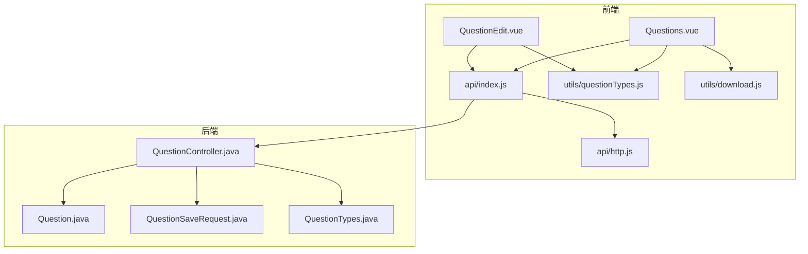
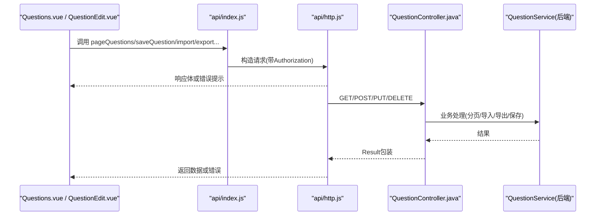
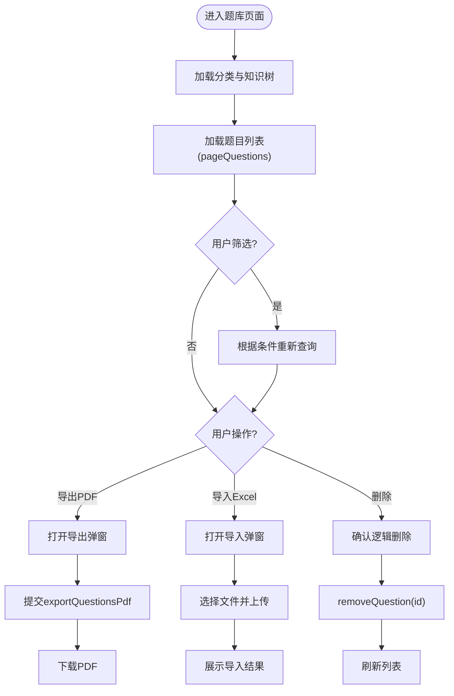
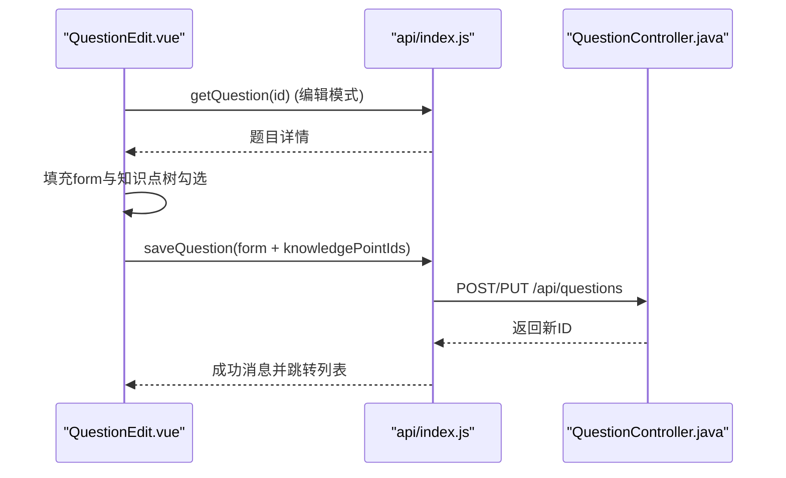
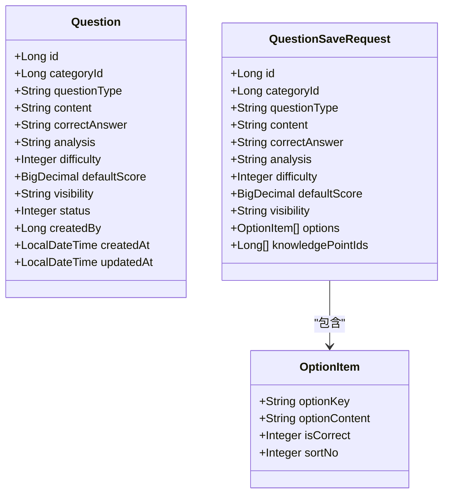
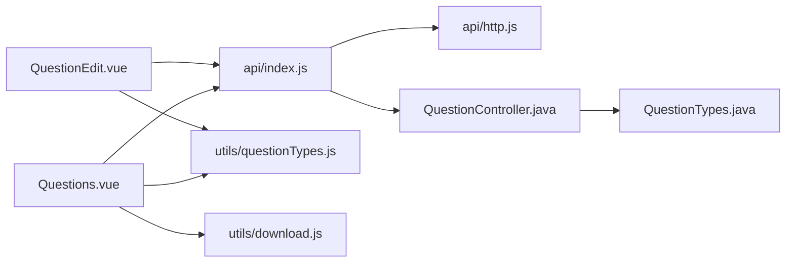

# 题库管理界面

<cite>
**本文引用的文件**
- [Questions.vue](file://exam-web/src/views/admin/Questions.vue)
- [QuestionEdit.vue](file://exam-web/src/views/admin/QuestionEdit.vue)
- [index.js](file://exam-web/src/api/index.js)
- [http.js](file://exam-web/src/api/http.js)
- [questionTypes.js](file://exam-web/src/utils/questionTypes.js)
- [download.js](file://exam-web/src/utils/download.js)
- [QuestionController.java](file://exam-server/src/main/java/com/exam/controller/QuestionController.java)
- [Question.java](file://exam-server/src/main/java/com/exam/entity/Question.java)
- [QuestionSaveRequest.java](file://exam-server/src/main/java/com/exam/dto/QuestionSaveRequest.java)
- [QuestionTypes.java](file://exam-server/src/main/java/com/exam/util/QuestionTypes.java)
</cite>

## 目录
1. [简介](#简介)
2. [项目结构](#项目结构)
3. [核心组件](#核心组件)
4. [架构总览](#架构总览)
5. [详细组件分析](#详细组件分析)
6. [依赖关系分析](#依赖关系分析)
7. [性能与体验优化](#性能与体验优化)
8. [故障排查指南](#故障排查指南)
9. [结论](#结论)
10. [附录：表单定制与扩展开发指南](#附录表单定制与扩展开发指南)

## 简介
本文件面向题库管理界面的前端实现，重点说明 Questions.vue（题目列表、搜索筛选、批量导入导出）与 QuestionEdit.vue（多题型编辑表单、答案设置、难度分级、知识点关联）的实现细节。文档同时覆盖数据验证、错误处理、用户体验优化，并提供表单定制与扩展开发指南，帮助二次开发者快速理解并扩展功能。

## 项目结构
题库管理相关的前端代码位于 exam-web 模块，后端接口位于 exam-server 模块。核心文件如下：
- 页面组件：Questions.vue、QuestionEdit.vue
- API 封装：api/index.js、api/http.js
- 工具函数：utils/questionTypes.js、utils/download.js
- 后端控制器与实体：QuestionController.java、Question.java、QuestionSaveRequest.java、QuestionTypes.java

图表来源
- [Questions.vue:1-212](file://exam-web/src/views/admin/Questions.vue#L1-L212)
- [QuestionEdit.vue:1-128](file://exam-web/src/views/admin/QuestionEdit.vue#L1-L128)
- [index.js:1-82](file://exam-web/src/api/index.js#L1-L82)
- [http.js:1-47](file://exam-web/src/api/http.js#L1-L47)
- [questionTypes.js:1-11](file://exam-web/src/utils/questionTypes.js#L1-L11)
- [download.js:1-52](file://exam-web/src/utils/download.js#L1-L52)
- [QuestionController.java:1-118](file://exam-server/src/main/java/com/exam/controller/QuestionController.java#L1-L118)
- [Question.java:1-30](file://exam-server/src/main/java/com/exam/entity/Question.java#L1-L30)
- [QuestionSaveRequest.java:1-31](file://exam-server/src/main/java/com/exam/dto/QuestionSaveRequest.java#L1-L31)
- [QuestionTypes.java:1-123](file://exam-server/src/main/java/com/exam/util/QuestionTypes.java#L1-L123)

章节来源
- [Questions.vue:1-212](file://exam-web/src/views/admin/Questions.vue#L1-L212)
- [QuestionEdit.vue:1-128](file://exam-web/src/views/admin/QuestionEdit.vue#L1-L128)
- [index.js:1-82](file://exam-web/src/api/index.js#L1-L82)
- [http.js:1-47](file://exam-web/src/api/http.js#L1-L47)
- [questionTypes.js:1-11](file://exam-web/src/utils/questionTypes.js#L1-L11)
- [download.js:1-52](file://exam-web/src/utils/download.js#L1-L52)
- [QuestionController.java:1-118](file://exam-server/src/main/java/com/exam/controller/QuestionController.java#L1-L118)
- [Question.java:1-30](file://exam-server/src/main/java/com/exam/entity/Question.java#L1-L30)
- [QuestionSaveRequest.java:1-31](file://exam-server/src/main/java/com/exam/dto/QuestionSaveRequest.java#L1-L31)
- [QuestionTypes.java:1-123](file://exam-server/src/main/java/com/exam/util/QuestionTypes.java#L1-L123)

## 核心组件
- Questions.vue：负责题目分页列表展示、按题型/分类/关键词的筛选查询、批量选择、Excel 模板下载与导入、选中题目导出 PDF。
- QuestionEdit.vue：负责新增/编辑题目的表单，支持单选、多选、判断、填空、简答、关键词解释等题型的动态渲染与答案设置，支持难度星级评分、可见范围、知识点树多选关联。

章节来源
- [Questions.vue:1-212](file://exam-web/src/views/admin/Questions.vue#L1-L212)
- [QuestionEdit.vue:1-128](file://exam-web/src/views/admin/QuestionEdit.vue#L1-L128)

## 架构总览
前端通过统一的 axios 实例发起请求，自动携带 JWT；后端以 RESTful 风格暴露题库接口，支持分页查询、导入导出、增删改查。题型常量在后端统一维护，前端通过本地常量保持一致。

图表来源
- [index.js:32-51](file://exam-web/src/api/index.js#L32-L51)
- [http.js:10-43](file://exam-web/src/api/http.js#L10-L43)
- [QuestionController.java:42-109](file://exam-server/src/main/java/com/exam/controller/QuestionController.java#L42-L109)

## 详细组件分析

### Questions.vue：题目列表、搜索筛选、批量操作
- 列表展示
  - 使用表格展示题目 ID、题型、题干、知识点、默认分，支持行内编辑与删除。
  - 分页控件绑定 query.page，切换页码触发 load() 重新拉取数据。
- 搜索筛选
  - 支持按题型、分类（知识点根节点）、关键词进行过滤，点击“查询”调用 pageQuestions。
- 批量操作
  - 表格启用多选，已选项数量显示在顶部栏，支持清空选择。
  - 导出 PDF：打开弹窗输入标题与是否附带答案，提交后调用 exportQuestionsPdf，成功后下载 PDF。
  - Excel 导入：下载模板、上传 .xlsx/.xls，选择默认知识点，提交后展示导入结果（成功/失败行数及错误明细）。
- 数据加载
  - 初始化时加载分类下拉与知识树，用于筛选与导入时的默认知识点选择。

图表来源
- [Questions.vue:18-46](file://exam-web/src/views/admin/Questions.vue#L18-L46)
- [Questions.vue:49-100](file://exam-web/src/views/admin/Questions.vue#L49-L100)
- [Questions.vue:131-199](file://exam-web/src/views/admin/Questions.vue#L131-L199)
- [index.js:40-51](file://exam-web/src/api/index.js#L40-L51)

章节来源
- [Questions.vue:1-212](file://exam-web/src/views/admin/Questions.vue#L1-L212)
- [index.js:40-51](file://exam-web/src/api/index.js#L40-L51)
- [download.js:1-52](file://exam-web/src/utils/download.js#L1-L52)

### QuestionEdit.vue：多题型编辑表单
- 题型切换与动态表单
  - 单选题、多选题、判断题：显示选项列表，支持添加/删除选项，单选/判断模式下正确答案互斥，多选模式允许多个正确。
  - 填空题：显示标准答案输入框，多个空用分隔符表示。
  - 简答题/关键词解释：显示参考答案输入框，仅阅卷可见。
- 其他字段
  - 分类：来自知识点根节点的下拉选择。
  - 题干、解析、默认分、难度星级、可见范围（公共/私有）。
  - 知识点：树形多选，保存时获取已选节点 ID 列表。
- 数据绑定与校验
  - 新增时根据题型生成默认选项；编辑时回填数据并恢复知识点勾选状态。
  - 保存时将 form 对象连同 knowledgePointIds 一并提交到 saveQuestion。

图表来源
- [QuestionEdit.vue:21-57](file://exam-web/src/views/admin/QuestionEdit.vue#L21-L57)
- [QuestionEdit.vue:89-108](file://exam-web/src/views/admin/QuestionEdit.vue#L89-L108)
- [index.js:41-43](file://exam-web/src/api/index.js#L41-L43)
- [QuestionController.java:88-103](file://exam-server/src/main/java/com/exam/controller/QuestionController.java#L88-L103)

章节来源
- [QuestionEdit.vue:1-128](file://exam-web/src/views/admin/QuestionEdit.vue#L1-L128)
- [questionTypes.js:1-11](file://exam-web/src/utils/questionTypes.js#L1-L11)
- [index.js:41-43](file://exam-web/src/api/index.js#L41-L43)

### 数据模型与接口契约
- 题目实体字段
  - 包含 ID、分类ID、题型、题干、标准答案、解析、难度、默认分、可见性、状态、创建人、时间戳等。
- 保存请求体
  - 支持 id、categoryId、questionType、content、correctAnswer、analysis、difficulty、defaultScore、visibility、options（选项数组）、knowledgePointIds（知识点ID列表）。
- 题型常量
  - 后端统一维护题型枚举与标签映射，前端通过本地常量保持一致，确保前后端一致。

图表来源
- [Question.java:11-29](file://exam-server/src/main/java/com/exam/entity/Question.java#L11-L29)
- [QuestionSaveRequest.java:8-30](file://exam-server/src/main/java/com/exam/dto/QuestionSaveRequest.java#L8-L30)

章节来源
- [Question.java:1-30](file://exam-server/src/main/java/com/exam/entity/Question.java#L1-L30)
- [QuestionSaveRequest.java:1-31](file://exam-server/src/main/java/com/exam/dto/QuestionSaveRequest.java#L1-L31)
- [QuestionTypes.java:1-123](file://exam-server/src/main/java/com/exam/util/QuestionTypes.java#L1-L123)

## 依赖关系分析
- 组件依赖
  - Questions.vue 依赖 api/index.js 中的题库接口、utils/questionTypes.js 的题型常量与类型标签、utils/download.js 的文件下载与错误处理。
  - QuestionEdit.vue 依赖 api/index.js 的题目详情与保存接口、utils/questionTypes.js 的题型判断方法。
- 网络层依赖
  - http.js 提供全局拦截器：自动注入 Authorization、统一处理 Result.code 非 0 的错误提示、401 时跳转登录。
- 后端依赖
  - QuestionController 提供分页查询、导入模板下载、Excel 导入、PDF 导出、题目详情、新增/更新/删除接口。
  - 题型常量由 QuestionTypes 统一管理，保证前后端一致性。

图表来源
- [Questions.vue:104-112](file://exam-web/src/views/admin/Questions.vue#L104-L112)
- [QuestionEdit.vue:62-67](file://exam-web/src/views/admin/QuestionEdit.vue#L62-L67)
- [index.js:1-82](file://exam-web/src/api/index.js#L1-L82)
- [http.js:1-47](file://exam-web/src/api/http.js#L1-L47)
- [QuestionController.java:1-118](file://exam-server/src/main/java/com/exam/controller/QuestionController.java#L1-L118)
- [QuestionTypes.java:1-123](file://exam-server/src/main/java/com/exam/util/QuestionTypes.java#L1-L123)

章节来源
- [Questions.vue:104-204](file://exam-web/src/views/admin/Questions.vue#L104-L204)
- [QuestionEdit.vue:62-121](file://exam-web/src/views/admin/QuestionEdit.vue#L62-L121)
- [index.js:1-82](file://exam-web/src/api/index.js#L1-L82)
- [http.js:1-47](file://exam-web/src/api/http.js#L1-L47)
- [QuestionController.java:1-118](file://exam-server/src/main/java/com/exam/controller/QuestionController.java#L1-L118)
- [QuestionTypes.java:1-123](file://exam-server/src/main/java/com/exam/util/QuestionTypes.java#L1-L123)

## 性能与体验优化
- 列表分页与懒加载
  - 使用分页参数减少首屏数据量，提升加载速度。
- 导入导出
  - 导入限制最大行数，避免大文件拖垮解析与事务；导出 PDF 使用流式下载，文件名从响应头解析，兼容中文。
- 错误提示
  - 统一通过 http.js 拦截器处理业务错误与网络错误，用户友好提示；blob 响应额外通过 blobErrorMessage 检测 JSON 错误体。
- 交互反馈
  - 按钮 loading 状态、导入结果弹窗、已选项计数、清空选择等，提升可感知性与易用性。

[本节为通用指导，不直接分析具体文件]

## 故障排查指南
- 无法下载模板或导出 PDF
  - 检查响应是否为 blob，若为 JSON 则通过 blobErrorMessage 获取后端 message 并提示。
  - 确认后端 Content-Disposition 是否正确设置，前端 downloadBlob 会优先解析 filename* 与 filename。
- 导入失败
  - 检查文件格式是否为 .xlsx/.xls；查看导入结果弹窗中的错误明细，定位失败行号与原因。
- 保存题目报错
  - 检查必填字段（如题型、题干、知识点）是否完整；确认题型与选项结构是否符合后端要求。
- 401 未登录
  - http.js 会在 401 时清除 token 并跳转登录页，请重新登录后再试。

章节来源
- [download.js:1-52](file://exam-web/src/utils/download.js#L1-L52)
- [http.js:18-43](file://exam-web/src/api/http.js#L18-L43)
- [QuestionController.java:60-86](file://exam-server/src/main/java/com/exam/controller/QuestionController.java#L60-L86)

## 结论
题库管理界面通过 Questions.vue 与 QuestionEdit.vue 实现了完整的题目生命周期管理：从列表查询、筛选、批量导入导出到多题型编辑与保存。前后端通过统一的题型常量与清晰的接口契约协作，结合健壮的错误处理与良好的交互反馈，提供了高效稳定的题库管理能力。后续可按需扩展更多题型、富文本编辑器与图片上传能力。

[本节为总结，不直接分析具体文件]

## 附录：表单定制与扩展开发指南
- 新增题型
  - 在前端 utils/questionTypes.js 中增加题型常量与判断逻辑（如 isChoice/isSubjective），并在 QuestionEdit.vue 中补充对应表单渲染与答案规则。
  - 在后端 QuestionTypes.java 中增加题型枚举、标签映射与默认分值，必要时调整 QuestionSaveRequest 的结构。
- 富文本编辑器集成
  - 可在题干或解析字段替换为富文本组件，注意将 HTML 内容安全地传递给后端，并在后端做必要的清洗与存储策略。
- 图片上传
  - 可通过现有 uploadMyAvatar 模式扩展图片上传接口，将图片 URL 嵌入题干或解析中；注意跨域与文件大小限制。
- 数据验证
  - 前端可增加更严格的表单校验（如必填、长度、格式），后端保留最终校验与错误提示。
- 批量操作扩展
  - 可在 Questions.vue 中增加批量修改题型、分类、难度等能力，调用相应批量接口完成。

[本节为扩展建议，不直接分析具体文件]