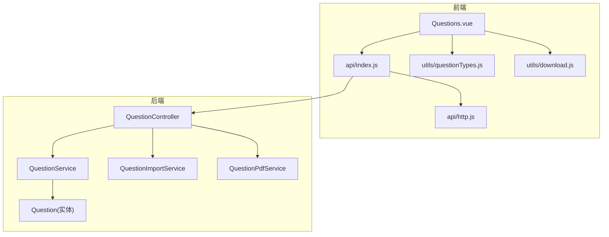
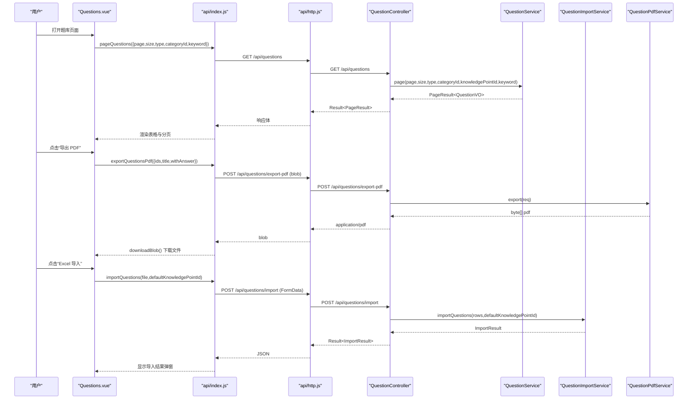
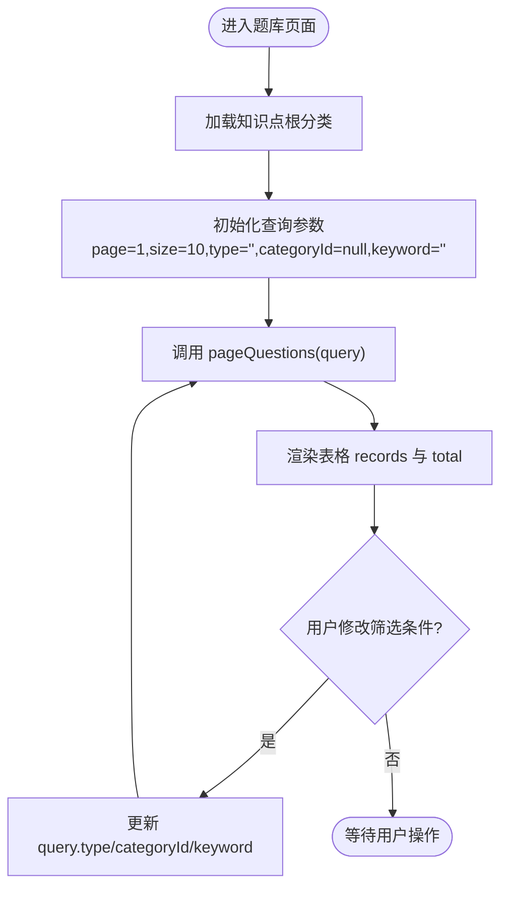
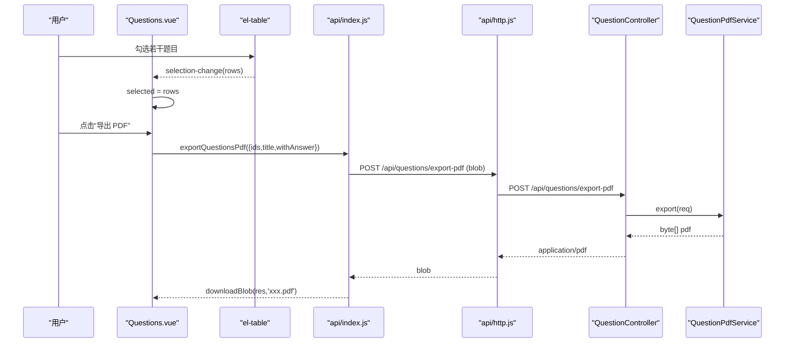
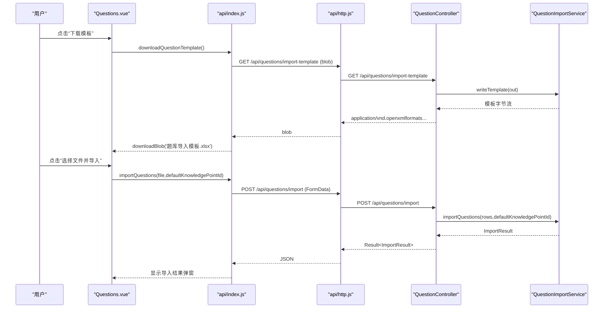
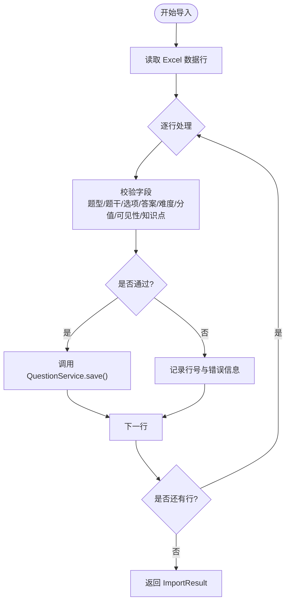
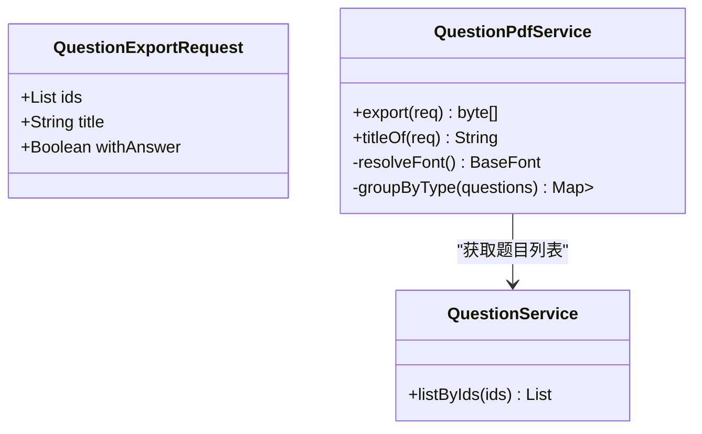
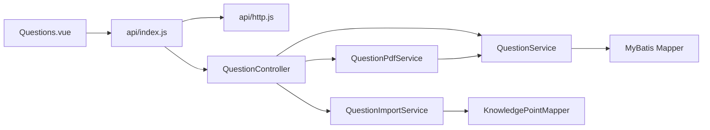

# 题目列表管理

<cite>
**本文引用的文件**
- [Questions.vue](file://exam-web/src/views/admin/Questions.vue)
- [index.js](file://exam-web/src/api/index.js)
- [http.js](file://exam-web/src/api/http.js)
- [questionTypes.js](file://exam-web/src/utils/questionTypes.js)
- [download.js](file://exam-web/src/utils/download.js)
- [QuestionController.java](file://exam-server/src/main/java/com/exam/controller/QuestionController.java)
- [QuestionService.java](file://exam-server/src/main/java/com/exam/service/QuestionService.java)
- [QuestionImportService.java](file://exam-server/src/main/java/com/exam/service/QuestionImportService.java)
- [QuestionPdfService.java](file://exam-server/src/main/java/com/exam/service/QuestionPdfService.java)
- [QuestionImportRow.java](file://exam-server/src/main/java/com/exam/dto/QuestionImportRow.java)
- [QuestionExportRequest.java](file://exam-server/src/main/java/com/exam/dto/QuestionExportRequest.java)
- [Question.java](file://exam-server/src/main/java/com/exam/entity/Question.java)
</cite>

## 目录
1. [简介](#简介)
2. [项目结构](#项目结构)
3. [核心组件](#核心组件)
4. [架构总览](#架构总览)
5. [详细组件分析](#详细组件分析)
6. [依赖关系分析](#依赖关系分析)
7. [性能考虑](#性能考虑)
8. [故障排查指南](#故障排查指南)
9. [结论](#结论)
10. [附录：扩展与自定义配置](#附录：扩展与自定义配置)

## 简介
本章节面向题库管理中的“题目列表”功能，围绕前端 Questions.vue 组件展开，覆盖以下能力：
- 题目列表展示（分页、题型、知识点分类、关键词搜索）
- 行选择机制与批量操作（清空选择、批量删除、批量导出 PDF）
- Excel 导入模板下载、文件上传处理、导入结果反馈
- 错误处理、用户交互优化与性能考量
- 扩展开发指南与自定义配置方法

该功能由前端 Vue 页面与后端 Spring Boot 控制器、服务层协同实现，数据模型以 Question 实体为核心，结合知识点树进行筛选与归类。

## 项目结构
- 前端
  - 页面：exam-web/src/views/admin/Questions.vue
  - API 封装：exam-web/src/api/index.js、http.js
  - 工具：exam-web/src/utils/questionTypes.js、download.js
- 后端
  - 控制器：com.exam.controller.QuestionController
  - 服务：com.exam.service.QuestionService、QuestionImportService、QuestionPdfService
  - DTO：QuestionImportRow、QuestionExportRequest
  - 实体：com.exam.entity.Question

图表来源
- [Questions.vue:1-212](file://exam-web/src/views/admin/Questions.vue#L1-L212)
- [index.js:36-51](file://exam-web/src/api/index.js#L36-L51)
- [http.js:1-47](file://exam-web/src/api/http.js#L1-L47)
- [QuestionController.java:31-118](file://exam-server/src/main/java/com/exam/controller/QuestionController.java#L31-L118)
- [QuestionService.java:33-225](file://exam-server/src/main/java/com/exam/service/QuestionService.java#L33-L225)
- [QuestionImportService.java:28-422](file://exam-server/src/main/java/com/exam/service/QuestionImportService.java#L28-L422)
- [QuestionPdfService.java:39-322](file://exam-server/src/main/java/com/exam/service/QuestionPdfService.java#L39-L322)
- [Question.java:11-30](file://exam-server/src/main/java/com/exam/entity/Question.java#L11-L30)

章节来源
- [Questions.vue:1-212](file://exam-web/src/views/admin/Questions.vue#L1-L212)
- [QuestionController.java:31-118](file://exam-server/src/main/java/com/exam/controller/QuestionController.java#L31-L118)

## 核心组件
- 前端页面 Questions.vue
  - 查询条件：题型、知识点根分类、题干关键词
  - 表格列：ID、题型、题干、知识点、默认分、操作
  - 分页：页码与每页条数
  - 批量操作：已选题目计数、清空选择、导出 PDF
  - 导入：模板下载、Excel 上传、导入结果弹窗
- 后端接口
  - 分页查询：支持 type、categoryId、knowledgePointId、keyword
  - 导入：Excel 解析、逐行校验、返回成功/失败明细
  - 导出 PDF：按题型分组生成练习卷，可选附带答案与解析
  - 增删改查：创建、更新、逻辑删除、详情

章节来源
- [Questions.vue:17-47](file://exam-web/src/views/admin/Questions.vue#L17-L47)
- [QuestionController.java:42-86](file://exam-server/src/main/java/com/exam/controller/QuestionController.java#L42-L86)
- [QuestionService.java:42-69](file://exam-server/src/main/java/com/exam/service/QuestionService.java#L42-L69)

## 架构总览
前端通过统一 http 客户端发起请求，携带 JWT；后端控制器将请求路由至对应服务，服务层负责业务规则与数据访问；PDF 与导入服务分别处理导出与导入流程。

图表来源
- [Questions.vue:131-199](file://exam-web/src/views/admin/Questions.vue#L131-L199)
- [index.js:40-51](file://exam-web/src/api/index.js#L40-L51)
- [http.js:10-43](file://exam-web/src/api/http.js#L10-L43)
- [QuestionController.java:42-86](file://exam-server/src/main/java/com/exam/controller/QuestionController.java#L42-L86)
- [QuestionService.java:42-69](file://exam-server/src/main/java/com/exam/service/QuestionService.java#L42-L69)
- [QuestionImportService.java:41-63](file://exam-server/src/main/java/com/exam/service/QuestionImportService.java#L41-L63)
- [QuestionPdfService.java:83-138](file://exam-server/src/main/java/com/exam/service/QuestionPdfService.java#L83-L138)

## 详细组件分析

### 题目列表展示与查询
- 查询参数
  - 题型：单选/多选/判断/填空/简答/关键词解释
  - 分类：知识点根节点（categoryId）
  - 关键词：题干模糊匹配（keyword）
- 分页
  - 前端维护 query.page、query.size，调用 pageQuestions
  - 后端使用 MyBatis-Plus Page 分页并返回 PageResult
- 表格列配置
  - ID、题型、题干、知识点、默认分、操作（编辑、删除）
  - 行选择：type="selection"，reserve-selection 保持跨页选择状态
  - 已选数量与清空选择按钮

图表来源
- [Questions.vue:18-47](file://exam-web/src/views/admin/Questions.vue#L18-L47)
- [QuestionController.java:42-50](file://exam-server/src/main/java/com/exam/controller/QuestionController.java#L42-L50)
- [QuestionService.java:42-69](file://exam-server/src/main/java/com/exam/service/QuestionService.java#L42-L69)

章节来源
- [Questions.vue:18-47](file://exam-web/src/views/admin/Questions.vue#L18-L47)
- [QuestionController.java:42-50](file://exam-server/src/main/java/com/exam/controller/QuestionController.java#L42-L50)
- [QuestionService.java:42-69](file://exam-server/src/main/java/com/exam/service/QuestionService.java#L42-L69)

### 行选择机制与批量操作
- 行选择
  - 使用 el-table 的 selection-change 事件收集 selected
  - reserve-selection 保留跨页选择状态
- 批量删除
  - 当前实现为单行删除（确认框后调用 removeQuestion），可在此基础上扩展为批量删除接口
- 批量导出 PDF
  - 基于 selected 的 ids 列表，调用 exportQuestionsPdf
  - 成功后通过 downloadBlob 下载 PDF 文件

图表来源
- [Questions.vue:28-47](file://exam-web/src/views/admin/Questions.vue#L28-L47)
- [Questions.vue:178-199](file://exam-web/src/views/admin/Questions.vue#L178-L199)
- [index.js:51](file://exam-web/src/api/index.js#L51)
- [QuestionController.java:77-86](file://exam-server/src/main/java/com/exam/controller/QuestionController.java#L77-L86)
- [QuestionPdfService.java:83-138](file://exam-server/src/main/java/com/exam/service/QuestionPdfService.java#L83-L138)

章节来源
- [Questions.vue:28-47](file://exam-web/src/views/admin/Questions.vue#L28-L47)
- [Questions.vue:178-199](file://exam-web/src/views/admin/Questions.vue#L178-L199)

### Excel 导入模板下载与文件上传处理
- 模板下载
  - 前端调用 downloadQuestionTemplate，后端写入示例数据与填写说明两页
  - 使用 EasyExcel 写出模板，文件名通过 Content-Disposition 传递
- 文件上传
  - 前端使用 el-upload 的 http-request，将 File 与 defaultKnowledgePointId 组装为 FormData
  - 后端限制仅 .xlsx/.xls，读取后逐行校验，超过最大行数抛出异常
  - 导入结果包含 total/success/failed/errors，前端在弹窗中展示

图表来源
- [Questions.vue:148-176](file://exam-web/src/views/admin/Questions.vue#L148-L176)
- [index.js:44-50](file://exam-web/src/api/index.js#L44-L50)
- [QuestionController.java:52-75](file://exam-server/src/main/java/com/exam/controller/QuestionController.java#L52-L75)
- [QuestionImportService.java:41-63](file://exam-server/src/main/java/com/exam/service/QuestionImportService.java#L41-L63)
- [QuestionImportService.java:327-342](file://exam-server/src/main/java/com/exam/service/QuestionImportService.java#L327-L342)

章节来源
- [Questions.vue:148-176](file://exam-web/src/views/admin/Questions.vue#L148-L176)
- [QuestionController.java:52-75](file://exam-server/src/main/java/com/exam/controller/QuestionController.java#L52-L75)
- [QuestionImportService.java:41-63](file://exam-server/src/main/java/com/exam/service/QuestionImportService.java#L41-L63)

### 导入结果反馈与错误处理
- 前端
  - 导入完成后显示总数、成功数、失败数及失败原因明细表
  - 使用 ElMessage 提示错误信息
- 后端
  - 逐行校验：题型识别、题干必填、选项数量、正确答案格式、难度范围、分值合法性、可见范围、知识点存在性与路径匹配
  - 单行失败不影响其他行，记录行号与错误消息

图表来源
- [QuestionImportService.java:41-63](file://exam-server/src/main/java/com/exam/service/QuestionImportService.java#L41-L63)
- [QuestionImportService.java:65-98](file://exam-server/src/main/java/com/exam/service/QuestionImportService.java#L65-L98)
- [QuestionImportService.java:102-189](file://exam-server/src/main/java/com/exam/service/QuestionImportService.java#L102-L189)
- [QuestionImportService.java:194-257](file://exam-server/src/main/java/com/exam/service/QuestionImportService.java#L194-L257)
- [QuestionImportService.java:275-318](file://exam-server/src/main/java/com/exam/service/QuestionImportService.java#L275-L318)

章节来源
- [Questions.vue:73-87](file://exam-web/src/views/admin/Questions.vue#L73-L87)
- [QuestionImportService.java:41-63](file://exam-server/src/main/java/com/exam/service/QuestionImportService.java#L41-L63)

### 批量导出 PDF
- 前端
  - 根据 selected.ids 构造导出请求，标题可自定义，是否附带答案与解析可切换
  - 接收 blob 响应，使用 downloadBlob 下载文件
- 后端
  - 按题型分组编号，生成 A4 文档，自动查找中文字体
  - 选择题输出选项，主观题预留作答空白，可选附答案与解析

图表来源
- [QuestionExportRequest.java:7-13](file://exam-server/src/main/java/com/exam/dto/QuestionExportRequest.java#L7-L13)
- [QuestionPdfService.java:83-138](file://exam-server/src/main/java/com/exam/service/QuestionPdfService.java#L83-L138)
- [QuestionService.java:79-93](file://exam-server/src/main/java/com/exam/service/QuestionService.java#L79-L93)

章节来源
- [Questions.vue:89-100](file://exam-web/src/views/admin/Questions.vue#L89-L100)
- [Questions.vue:178-199](file://exam-web/src/views/admin/Questions.vue#L178-L199)
- [QuestionController.java:77-86](file://exam-server/src/main/java/com/exam/controller/QuestionController.java#L77-L86)
- [QuestionPdfService.java:83-138](file://exam-server/src/main/java/com/exam/service/QuestionPdfService.java#L83-L138)

### 知识点分类筛选
- 前端
  - 下拉选择“分类（知识点根）”，绑定 categoryId
  - 首次打开时加载知识树用于导入时的默认知识点选择
- 后端
  - 支持按 categoryId 精确过滤
  - 支持按 knowledgePointId 关联过滤（通过 QuestionKnowledge 表）

章节来源
- [Questions.vue:22-25](file://exam-web/src/views/admin/Questions.vue#L22-L25)
- [Questions.vue:160-164](file://exam-web/src/views/admin/Questions.vue#L160-L164)
- [QuestionController.java:42-50](file://exam-server/src/main/java/com/exam/controller/QuestionController.java#L42-L50)
- [QuestionService.java:51-64](file://exam-server/src/main/java/com/exam/service/QuestionService.java#L51-L64)

### 关键词搜索
- 前端
  - 题干关键词输入框，触发查询时携带 keyword
- 后端
  - 对 content 字段进行模糊匹配

章节来源
- [Questions.vue:25-26](file://exam-web/src/views/admin/Questions.vue#L25-L26)
- [QuestionController.java:42-50](file://exam-server/src/main/java/com/exam/controller/QuestionController.java#L42-L50)
- [QuestionService.java:54-56](file://exam-server/src/main/java/com/exam/service/QuestionService.java#L54-L56)

## 依赖关系分析
- 前端依赖
  - Questions.vue 依赖 api/index.js 暴露的函数，统一通过 http.js 发起请求
  - 题型常量与工具函数来自 utils/questionTypes.js 与 utils/download.js
- 后端依赖
  - QuestionController 依赖 QuestionService、QuestionImportService、QuestionPdfService
  - QuestionService 依赖 QuestionMapper、QuestionOptionMapper、QuestionKnowledgeMapper、KnowledgePointMapper
  - QuestionImportService 依赖 KnowledgePointMapper 进行知识点解析
  - QuestionPdfService 依赖 QuestionService 获取题目列表，并使用 iText 生成 PDF

图表来源
- [Questions.vue:104-113](file://exam-web/src/views/admin/Questions.vue#L104-L113)
- [index.js:36-51](file://exam-web/src/api/index.js#L36-L51)
- [http.js:1-47](file://exam-web/src/api/http.js#L1-47)
- [QuestionController.java:31-39](file://exam-server/src/main/java/com/exam/controller/QuestionController.java#L31-L39)
- [QuestionService.java:33-40](file://exam-server/src/main/java/com/exam/service/QuestionService.java#L33-L40)
- [QuestionImportService.java:28-39](file://exam-server/src/main/java/com/exam/service/QuestionImportService.java#L28-L39)
- [QuestionPdfService.java:39-69](file://exam-server/src/main/java/com/exam/service/QuestionPdfService.java#L39-L69)

章节来源
- [QuestionController.java:31-39](file://exam-server/src/main/java/com/exam/controller/QuestionController.java#L31-L39)
- [QuestionService.java:33-40](file://exam-server/src/main/java/com/exam/service/QuestionService.java#L33-L40)
- [QuestionImportService.java:28-39](file://exam-server/src/main/java/com/exam/service/QuestionImportService.java#L28-L39)
- [QuestionPdfService.java:39-69](file://exam-server/src/main/java/com/exam/service/QuestionPdfService.java#L39-L69)

## 性能考虑
- 分页查询
  - 前端默认 size=10，避免一次性加载过多数据
  - 后端使用 MyBatis-Plus Page 分页，减少数据库压力
- 导入限制
  - 单次导入最多 2000 行，防止超大文件拖垮解析与事务
- PDF 字体缓存
  - 中文字体加载后缓存，避免重复 IO
- 网络超时与错误处理
  - 统一 http 拦截器处理 401 跳转登录与全局错误提示
  - blob 响应错误时解析 JSON 消息并提示

[本节为通用指导，不直接分析具体文件]

## 故障排查指南
- 无法下载模板或导出 PDF
  - 检查后端 Content-Disposition 是否正确设置
  - 前端使用 downloadBlob 解析文件名，若失败则回退到 fallbackName
- 导入失败
  - 查看导入结果弹窗中的失败原因，常见包括：题型不识别、题干为空、选项不足、正确答案格式错误、知识点不存在或歧义、难度/分值非法、可见范围非法
- 权限问题
  - 401 时自动清除本地 token 并跳转登录页
- 知识点筛选无结果
  - 确认 categoryId 或 knowledgePointId 是否存在且有效

章节来源
- [download.js:5-15](file://exam-web/src/utils/download.js#L5-L15)
- [download.js:42-51](file://exam-web/src/utils/download.js#L42-L51)
- [http.js:18-43](file://exam-web/src/api/http.js#L18-L43)
- [QuestionImportService.java:65-98](file://exam-server/src/main/java/com/exam/service/QuestionImportService.java#L65-L98)
- [QuestionImportService.java:102-189](file://exam-server/src/main/java/com/exam/service/QuestionImportService.java#L102-L189)
- [QuestionImportService.java:194-257](file://exam-server/src/main/java/com/exam/service/QuestionImportService.java#L194-L257)
- [QuestionImportService.java:275-318](file://exam-server/src/main/java/com/exam/service/QuestionImportService.java#L275-L318)

## 结论
题目列表管理功能在前端 Questions.vue 中实现了完整的查询、筛选、分页、批量操作与导入导出能力；后端通过控制器与服务层提供稳定的数据访问与业务规则校验。整体架构清晰，职责分离明确，具备良好的可扩展性与可维护性。

[本节为总结性内容，不直接分析具体文件]

## 附录：扩展与自定义配置
- 扩展批量删除
  - 可在 Questions.vue 中增加批量删除按钮，调用新增的后端批量删除接口
- 自定义题型
  - 前端 QUESTION_TYPES 与后端 QuestionTypes 需保持一致，新增题型时需同步更新
- 自定义知识点分类
  - 前端“分类（知识点根）”来自 listCategories，后端按 categoryId 过滤
- 自定义 PDF 字体
  - 通过 exam.pdf-font-path 配置项指定字体路径，服务会依次尝试配置路径、classpath:fonts/、系统字体目录
- 自定义导入模板
  - 后端 writeTemplate 生成示例与说明，可按需调整列与示例数据

章节来源
- [questionTypes.js:1-11](file://exam-web/src/utils/questionTypes.js#L1-L11)
- [QuestionPdfService.java:65-69](file://exam-server/src/main/java/com/exam/service/QuestionPdfService.java#L65-L69)
- [QuestionPdfService.java:256-279](file://exam-server/src/main/java/com/exam/service/QuestionPdfService.java#L256-L279)
- [QuestionImportService.java:327-342](file://exam-server/src/main/java/com/exam/service/QuestionImportService.java#L327-L342)