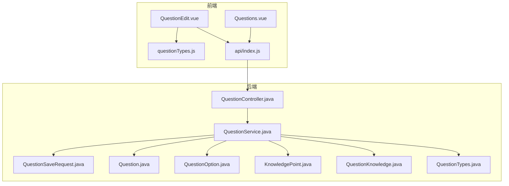
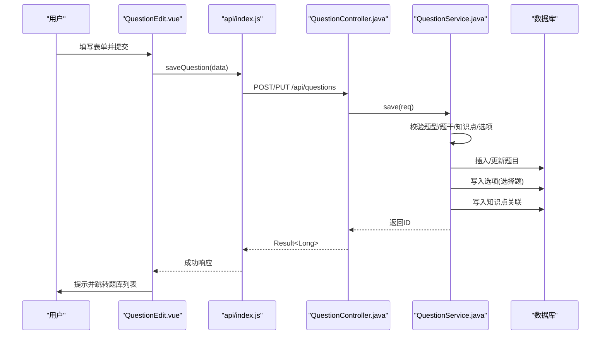
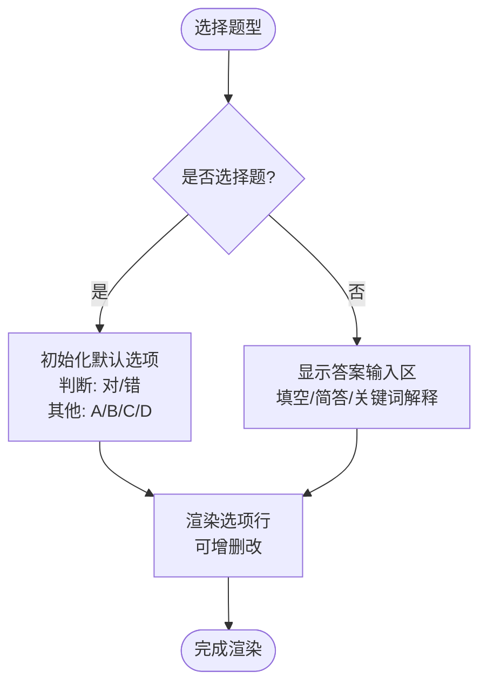
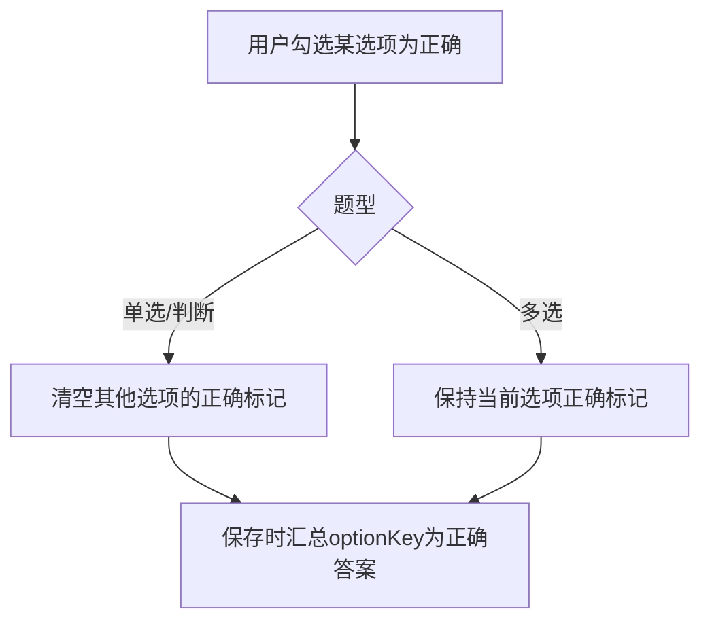
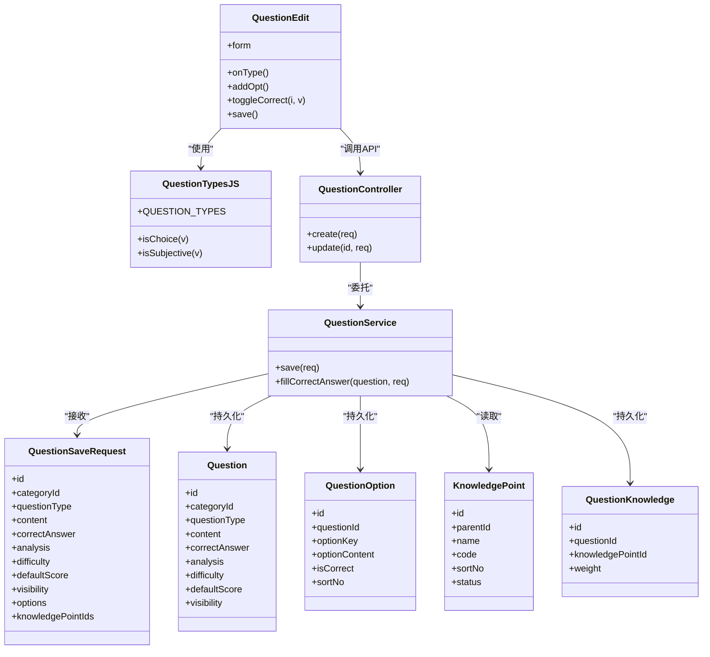

# 题目编辑表单

<cite>
**本文引用的文件**
- [QuestionEdit.vue](file://exam-web/src/views/admin/QuestionEdit.vue)
- [questionTypes.js](file://exam-web/src/utils/questionTypes.js)
- [index.js](file://exam-web/src/api/index.js)
- [QuestionController.java](file://exam-server/src/main/java/com/exam/controller/QuestionController.java)
- [QuestionService.java](file://exam-server/src/main/java/com/exam/service/QuestionService.java)
- [QuestionSaveRequest.java](file://exam-server/src/main/java/com/exam/dto/QuestionSaveRequest.java)
- [Question.java](file://exam-server/src/main/java/com/exam/entity/Question.java)
- [QuestionOption.java](file://exam-server/src/main/java/com/exam/entity/QuestionOption.java)
- [KnowledgePoint.java](file://exam-server/src/main/java/com/exam/entity/KnowledgePoint.java)
- [QuestionKnowledge.java](file://exam-server/src/main/java/com/exam/entity/QuestionKnowledge.java)
- [QuestionTypes.java](file://exam-server/src/main/java/com/exam/util/QuestionTypes.java)
- [Questions.vue](file://exam-web/src/views/admin/Questions.vue)
</cite>

## 目录
1. [简介](#简介)
2. [项目结构](#项目结构)
3. [核心组件](#核心组件)
4. [架构总览](#架构总览)
5. [详细组件分析](#详细组件分析)
6. [依赖关系分析](#依赖关系分析)
7. [性能与可用性](#性能与可用性)
8. [故障排查指南](#故障排查指南)
9. [结论](#结论)
10. [附录：扩展与定制指南](#附录扩展与定制指南)

## 简介
本文件围绕“题目编辑表单”展开，重点解析前端 QuestionEdit.vue 组件的实现机制，包括多题型动态表单生成、选项管理、答案设置、富文本集成现状、表单验证与数据绑定、状态管理、图片上传与知识点关联、难度分级等高级功能。同时说明后端保存流程、错误处理与用户体验优化，并提供表单定制扩展与自定义题型支持方案。

## 项目结构
- 前端
  - 页面组件：admin/QuestionEdit.vue（题目新增/编辑）、admin/Questions.vue（题库列表与导入导出）
  - 工具与常量：utils/questionTypes.js（题型枚举与判断）
  - API 封装：api/index.js（统一接口调用）
- 后端
  - 控制器：controller/QuestionController.java（题库增删改查、导入模板、PDF 导出）
  - 服务层：service/QuestionService.java（保存逻辑、正确答案汇总、知识点关联）
  - DTO/实体：dto/QuestionSaveRequest.java、entity/Question.java、entity/QuestionOption.java、entity/KnowledgePoint.java、entity/QuestionKnowledge.java
  - 工具：util/QuestionTypes.java（题型校验、默认分值等）

图表来源
- [QuestionEdit.vue:1-128](file://exam-web/src/views/admin/QuestionEdit.vue#L1-L128)
- [Questions.vue:1-212](file://exam-web/src/views/admin/Questions.vue#L1-L212)
- [index.js:1-82](file://exam-web/src/api/index.js#L1-L82)
- [QuestionController.java:1-118](file://exam-server/src/main/java/com/exam/controller/QuestionController.java#L1-L118)
- [QuestionService.java:1-225](file://exam-server/src/main/java/com/exam/service/QuestionService.java#L1-L225)
- [QuestionSaveRequest.java:1-31](file://exam-server/src/main/java/com/exam/dto/QuestionSaveRequest.java#L1-L31)
- [Question.java:1-30](file://exam-server/src/main/java/com/exam/entity/Question.java#L1-L30)
- [QuestionOption.java:1-20](file://exam-server/src/main/java/com/exam/entity/QuestionOption.java#L1-L20)
- [KnowledgePoint.java:1-25](file://exam-server/src/main/java/com/exam/entity/KnowledgePoint.java#L1-L25)
- [QuestionKnowledge.java:1-20](file://exam-server/src/main/java/com/exam/entity/QuestionKnowledge.java#L1-L20)
- [QuestionTypes.java:1-123](file://exam-server/src/main/java/com/exam/util/QuestionTypes.java#L1-L123)

章节来源
- [QuestionEdit.vue:1-128](file://exam-web/src/views/admin/QuestionEdit.vue#L1-L128)
- [Questions.vue:1-212](file://exam-web/src/views/admin/Questions.vue#L1-L212)
- [index.js:1-82](file://exam-web/src/api/index.js#L1-L82)
- [QuestionController.java:1-118](file://exam-server/src/main/java/com/exam/controller/QuestionController.java#L1-L118)
- [QuestionService.java:1-225](file://exam-server/src/main/java/com/exam/service/QuestionService.java#L1-L225)

## 核心组件
- QuestionEdit.vue：题目新增/编辑的核心表单组件，负责：
  - 题型切换与动态字段渲染（单选/多选/判断/填空/简答/关键词解释）
  - 选择题选项的增删改与正确答案互斥/多选控制
  - 填空题与主观题的答案输入提示
  - 分类选择、题干、解析、默认分、难度星级、可见范围
  - 知识点树多选关联
  - 表单提交与路由跳转
- questionTypes.js：集中维护题型常量与类型判断函数，保证前后端题型一致性
- api/index.js：封装题库相关接口（分页、详情、保存、删除、导入导出等）
- 后端 QuestionController + QuestionService：实现题目保存、选项写入、知识点关联、正确答案汇总、校验与异常抛出

章节来源
- [QuestionEdit.vue:62-121](file://exam-web/src/views/admin/QuestionEdit.vue#L62-L121)
- [questionTypes.js:1-11](file://exam-web/src/utils/questionTypes.js#L1-L11)
- [index.js:40-51](file://exam-web/src/api/index.js#L40-L51)
- [QuestionController.java:93-103](file://exam-server/src/main/java/com/exam/controller/QuestionController.java#L93-L103)
- [QuestionService.java:95-151](file://exam-server/src/main/java/com/exam/service/QuestionService.java#L95-L151)

## 架构总览
题目编辑从前端到后端的完整链路如下：

图表来源
- [QuestionEdit.vue:103-108](file://exam-web/src/views/admin/QuestionEdit.vue#L103-L108)
- [index.js:42-42](file://exam-web/src/api/index.js#L42-L42)
- [QuestionController.java:93-103](file://exam-server/src/main/java/com/exam/controller/QuestionController.java#L93-L103)
- [QuestionService.java:95-151](file://exam-server/src/main/java/com/exam/service/QuestionService.java#L95-L151)

## 详细组件分析

### 多题型动态表单生成机制
- 题型常量与判断
  - 前端通过 questionTypes.js 提供 QUESTION_TYPES、isChoice、isSubjective 等，用于渲染不同题型对应的表单字段
  - 后端通过 util/QuestionTypes.java 进行题型合法性校验、默认分值计算、是否选择题/主观题判断
- 动态渲染
  - 单选题/多选题/判断题：显示“选项”区域，支持添加、删除、勾选正确答案
  - 填空题：显示“标准答案”，提示多个空用分隔符
  - 简答题/关键词解释：显示“参考答案”，仅阅卷可见
- 默认值策略
  - 切换题型时，若为选择题且无选项，则自动填充默认选项（判断题为“对/错”，其他为 A/B/C/D）
  - 首次新增时直接填充默认选项；编辑时回填已有选项

图表来源
- [QuestionEdit.vue:21-32](file://exam-web/src/views/admin/QuestionEdit.vue#L21-L32)
- [QuestionEdit.vue:80-91](file://exam-web/src/views/admin/QuestionEdit.vue#L80-L91)
- [questionTypes.js:1-11](file://exam-web/src/utils/questionTypes.js#L1-L11)
- [QuestionTypes.java:88-123](file://exam-server/src/main/java/com/exam/util/QuestionTypes.java#L88-L123)

章节来源
- [QuestionEdit.vue:21-32](file://exam-web/src/views/admin/QuestionEdit.vue#L21-L32)
- [QuestionEdit.vue:80-91](file://exam-web/src/views/admin/QuestionEdit.vue#L80-L91)
- [questionTypes.js:1-11](file://exam-web/src/utils/questionTypes.js#L1-L11)
- [QuestionTypes.java:88-123](file://exam-server/src/main/java/com/exam/util/QuestionTypes.java#L88-L123)

### 选择题选项管理与正确答案控制
- 选项数据结构
  - optionKey：选项标识（A/B/C/D…）
  - optionContent：选项内容
  - isCorrect：是否正确答案（1/0）
- 单选/判断互斥
  - 单选与判断题型下，勾选某选项为正确时，会清空其他选项的正确标记
- 多选允许多个正确
  - 多选题型下，每个选项独立控制是否正确
- 后端汇总
  - 保存时，选择题的正确答案由所有 isCorrect=1 的 optionKey 拼接而成（逗号分隔）

图表来源
- [QuestionEdit.vue:96-102](file://exam-web/src/views/admin/QuestionEdit.vue#L96-L102)
- [QuestionService.java:161-178](file://exam-server/src/main/java/com/exam/service/QuestionService.java#L161-L178)

章节来源
- [QuestionEdit.vue:96-102](file://exam-web/src/views/admin/QuestionEdit.vue#L96-L102)
- [QuestionService.java:161-178](file://exam-server/src/main/java/com/exam/service/QuestionService.java#L161-L178)

### 填空题与主观题答案设置
- 填空题
  - 标准答案输入框，提示多个空使用分隔符（如竖线），便于后续解析
- 主观题（简答/关键词解释）
  - 参考答案输入框，仅教师阅卷可见，不向学生展示
- 后端存储
  - 非选择题型直接使用 correctAnswer 字段存储

章节来源
- [QuestionEdit.vue:30-32](file://exam-web/src/views/admin/QuestionEdit.vue#L30-L32)
- [QuestionService.java:161-178](file://exam-server/src/main/java/com/exam/service/QuestionService.java#L161-L178)

### 表单验证规则与数据绑定
- 前端
  - 使用 Element Plus 表单控件进行双向绑定
  - 未做复杂的前端校验，主要依赖后端校验
- 后端
  - 必填项校验：题型必须合法、至少绑定一个知识点、题干不能为空
  - 选择题：必须提供选项且至少有一个正确答案
  - 异常统一通过 BizException 抛出，前端通过全局异常处理提示

章节来源
- [QuestionService.java:95-105](file://exam-server/src/main/java/com/exam/service/QuestionService.java#L95-L105)
- [QuestionService.java:161-178](file://exam-server/src/main/java/com/exam/service/QuestionService.java#L161-L178)

### 状态管理与生命周期
- 表单状态
  - form 对象包含 id、categoryId、questionType、content、correctAnswer、analysis、difficulty、defaultScore、visibility、options、knowledgePointIds
- 初始化
  - 加载分类列表与知识点树
  - 编辑模式：根据路由参数获取题目详情并回填表单，恢复知识点选中状态
  - 新增模式：填充默认选项

章节来源
- [QuestionEdit.vue:74-77](file://exam-web/src/views/admin/QuestionEdit.vue#L74-L77)
- [QuestionEdit.vue:109-121](file://exam-web/src/views/admin/QuestionEdit.vue#L109-L121)

### 图片上传处理与富文本编辑器集成
- 现状
  - 当前 QuestionEdit.vue 未集成富文本编辑器，也未实现图片上传能力
  - 题干与解析均为纯文本输入（textarea）
- 建议扩展
  - 引入富文本编辑器（如基于 Vue 的编辑器组件）
  - 实现图片上传至对象存储或服务器，并在编辑器中插入图片链接
  - 注意 XSS 过滤与内容安全策略

章节来源
- [QuestionEdit.vue:20-33](file://exam-web/src/views/admin/QuestionEdit.vue#L20-L33)

### 知识点关联选择
- 前端
  - 使用树形多选组件展示知识点树，支持多选
  - 提交时收集已选中的节点 ID 列表
- 后端
  - 保存时将题目与知识点建立多对多关联，权重固定为 1
  - 查询 VO 时回填知识点名称列表

章节来源
- [QuestionEdit.vue:44-53](file://exam-web/src/views/admin/QuestionEdit.vue#L44-L53)
- [QuestionEdit.vue:103-105](file://exam-web/src/views/admin/QuestionEdit.vue#L103-L105)
- [QuestionService.java:143-149](file://exam-server/src/main/java/com/exam/service/QuestionService.java#L143-L149)
- [QuestionService.java:196-203](file://exam-server/src/main/java/com/exam/service/QuestionService.java#L196-L203)

### 难度分级设置
- 前端
  - 使用星级评分组件设置难度（1-3）
- 后端
  - 存储 difficulty 字段，用于统计与分析

章节来源
- [QuestionEdit.vue:35-37](file://exam-web/src/views/admin/QuestionEdit.vue#L35-L37)
- [Question.java:22-22](file://exam-server/src/main/java/com/exam/entity/Question.java#L22-L22)

### 表单提交逻辑与错误处理
- 提交流程
  - 组装 form 数据，包含 knowledgePointIds
  - 调用 saveQuestion 接口
  - 成功后提示并跳转题库列表
- 错误处理
  - 后端校验失败抛出 BizException
  - 前端通过全局异常处理器统一捕获并提示

章节来源
- [QuestionEdit.vue:103-108](file://exam-web/src/views/admin/QuestionEdit.vue#L103-L108)
- [QuestionController.java:93-103](file://exam-server/src/main/java/com/exam/controller/QuestionController.java#L93-L103)
- [QuestionService.java:95-105](file://exam-server/src/main/java/com/exam/service/QuestionService.java#L95-L105)

### 用户体验优化
- 动态提示
  - 分类选择处提供说明文字，帮助理解分类即知识点根节点
  - 填空题与主观题答案输入提供占位提示
- 交互便捷性
  - 选择题选项支持快速增删
  - 单选/判断正确答案互斥，避免误操作
- 导航友好
  - 保存成功后自动返回题库列表

章节来源
- [QuestionEdit.vue:14-19](file://exam-web/src/views/admin/QuestionEdit.vue#L14-L19)
- [QuestionEdit.vue:30-32](file://exam-web/src/views/admin/QuestionEdit.vue#L30-L32)
- [QuestionEdit.vue:21-29](file://exam-web/src/views/admin/QuestionEdit.vue#L21-L29)
- [QuestionEdit.vue:103-108](file://exam-web/src/views/admin/QuestionEdit.vue#L103-L108)

## 依赖关系分析
- 前端依赖
  - QuestionEdit.vue 依赖 questionTypes.js 的题型常量与判断函数
  - 通过 api/index.js 调用后端题库接口
- 后端依赖
  - QuestionController 依赖 QuestionService 执行业务逻辑
  - QuestionService 依赖实体与 Mapper 进行数据持久化
  - 使用 util/QuestionTypes.java 进行题型校验与默认分值计算

图表来源
- [QuestionEdit.vue:62-121](file://exam-web/src/views/admin/QuestionEdit.vue#L62-L121)
- [questionTypes.js:1-11](file://exam-web/src/utils/questionTypes.js#L1-L11)
- [QuestionController.java:93-103](file://exam-server/src/main/java/com/exam/controller/QuestionController.java#L93-L103)
- [QuestionService.java:95-151](file://exam-server/src/main/java/com/exam/service/QuestionService.java#L95-L151)
- [QuestionSaveRequest.java:1-31](file://exam-server/src/main/java/com/exam/dto/QuestionSaveRequest.java#L1-L31)
- [Question.java:1-30](file://exam-server/src/main/java/com/exam/entity/Question.java#L1-L30)
- [QuestionOption.java:1-20](file://exam-server/src/main/java/com/exam/entity/QuestionOption.java#L1-L20)
- [KnowledgePoint.java:1-25](file://exam-server/src/main/java/com/exam/entity/KnowledgePoint.java#L1-L25)
- [QuestionKnowledge.java:1-20](file://exam-server/src/main/java/com/exam/entity/QuestionKnowledge.java#L1-L20)

章节来源
- [QuestionEdit.vue:62-121](file://exam-web/src/views/admin/QuestionEdit.vue#L62-L121)
- [QuestionController.java:93-103](file://exam-server/src/main/java/com/exam/controller/QuestionController.java#L93-L103)
- [QuestionService.java:95-151](file://exam-server/src/main/java/com/exam/service/QuestionService.java#L95-L151)

## 性能与可用性
- 性能
  - 前端表单轻量，无重型富文本，减少首屏与交互开销
  - 后端保存采用事务包裹，确保选项与知识点关联的一致性
- 可用性
  - 清晰的提示信息与占位文案
  - 选择题正确答案互斥逻辑降低误操作风险
  - 知识点树多选直观易用

[本节为通用指导，不直接分析具体文件]

## 故障排查指南
- 常见错误
  - “请填写题干”：检查 content 是否为空
  - “请至少绑定一个知识点”：检查 knowledgePointIds 是否至少一项
  - “请填写选项”：选择题未提供 options
  - “请设置正确答案”：选择题未勾选任何正确选项
- 定位方法
  - 查看浏览器网络请求与响应
  - 检查后端日志中的 BizException 信息
  - 确认前端 form 数据结构与后端 DTO 字段一致

章节来源
- [QuestionService.java:95-105](file://exam-server/src/main/java/com/exam/service/QuestionService.java#L95-L105)
- [QuestionService.java:161-178](file://exam-server/src/main/java/com/exam/service/QuestionService.java#L161-L178)

## 结论
QuestionEdit.vue 实现了多题型动态表单的核心能力，结合后端 QuestionService 的严格校验与正确答案汇总，保证了题库数据的完整性与一致性。当前版本未集成富文本与图片上传，但具备良好的扩展基础。通过统一的题型常量与判断函数，前端与后端保持一致，便于后续扩展新题型与增强交互体验。

[本节为总结，不直接分析具体文件]

## 附录：扩展与定制指南
- 扩展富文本与图片上传
  - 在 QuestionEdit.vue 中引入富文本编辑器组件
  - 实现图片上传接口对接（可复用现有 http 封装）
  - 对富文本内容进行安全过滤，防止 XSS
- 自定义题型支持
  - 在前端 questionTypes.js 中添加新题型常量与判断逻辑
  - 在后端 util/QuestionTypes.java 中添加新题型校验、默认分值与标签映射
  - 在 QuestionService.save 中为新题型补充正确答案生成逻辑（如需）
  - 在 QuestionEdit.vue 中为新题型增加专属表单字段与交互
- 表单验证增强
  - 前端可增加必填、格式校验，提升即时反馈
  - 后端继续以 BizException 统一抛出业务异常
- 知识点与分类优化
  - 可在分类选择处增加搜索与懒加载以提升大数据量下的性能
  - 知识点树支持拖拽排序或权重调整（需后端配合）

[本节为通用指导，不直接分析具体文件]