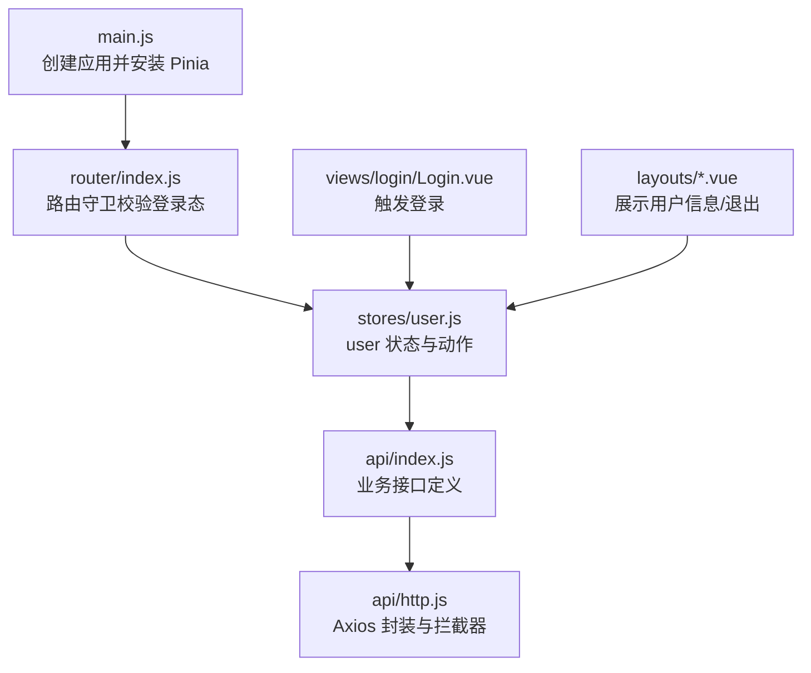
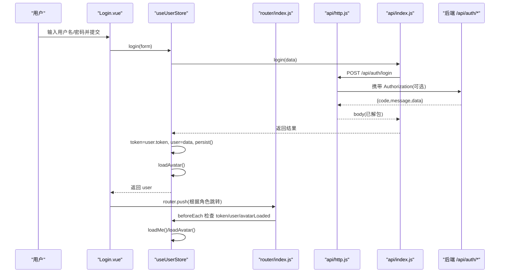
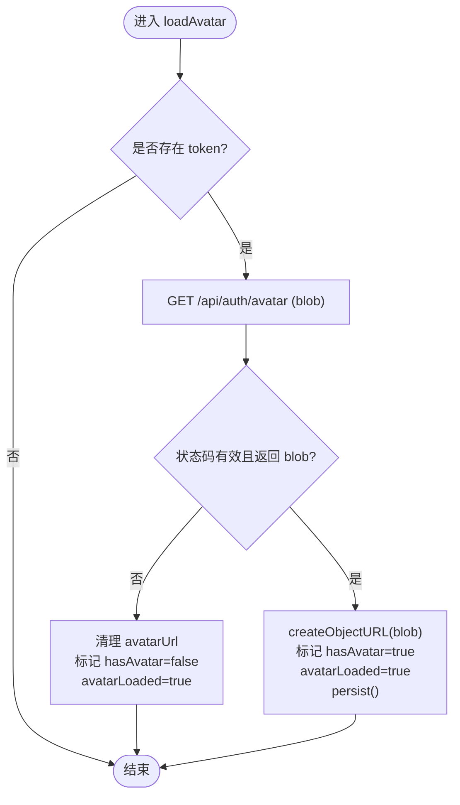
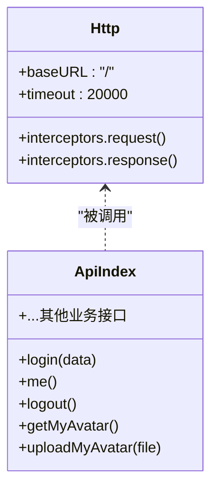
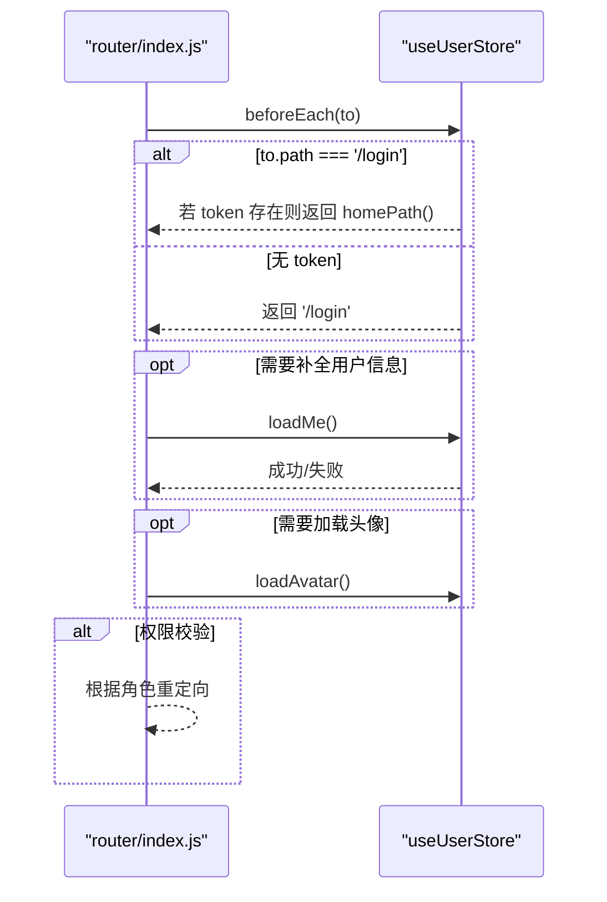
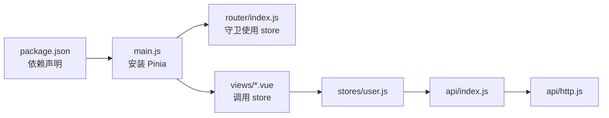

# 状态管理

<cite>
**本文引用的文件**
- [exam-web/src/stores/user.js](file://exam-web/src/stores/user.js)
- [exam-web/src/api/http.js](file://exam-web/src/api/http.js)
- [exam-web/src/api/index.js](file://exam-web/src/api/index.js)
- [exam-web/src/router/index.js](file://exam-web/src/router/index.js)
- [exam-web/src/main.js](file://exam-web/src/main.js)
- [exam-web/package.json](file://exam-web/package.json)
- [exam-web/src/views/login/Login.vue](file://exam-web/src/views/login/Login.vue)
- [exam-web/src/layouts/AdminLayout.vue](file://exam-web/src/layouts/AdminLayout.vue)
- [exam-web/src/layouts/StudentLayout.vue](file://exam-web/src/layouts/StudentLayout.vue)
</cite>

## 目录
1. [简介](#简介)
2. [项目结构](#项目结构)
3. [核心组件](#核心组件)
4. [架构总览](#架构总览)
5. [详细组件分析](#详细组件分析)
6. [依赖关系分析](#依赖关系分析)
7. [性能与缓存策略](#性能与缓存策略)
8. [故障排查指南](#故障排查指南)
9. [结论](#结论)
10. [附录：状态更新示例与调试技巧](#附录：状态更新示例与调试技巧)

## 简介
本章节面向前端考试系统，系统性说明基于 Pinia 的状态管理实现。重点覆盖：
- user 存储的用户状态管理与认证信息维护
- API 请求封装的 http 工具与接口定义
- 状态持久化、数据同步与异步操作处理
- 错误处理、加载状态管理与缓存策略
- 状态更新示例与调试技巧

## 项目结构
前端采用 Vue 3 + Vite 工程，使用 Pinia 进行全局状态管理，Axios 作为 HTTP 客户端，Element Plus 提供 UI 组件。应用入口初始化 Pinia 实例，路由守卫在每次导航时校验登录态并拉取用户信息；登录页调用 user store 完成登录流程；布局组件展示用户信息与退出逻辑。

图表来源
- [exam-web/src/main.js:15-18](file://exam-web/src/main.js#L15-L18)
- [exam-web/src/router/index.js:48-64](file://exam-web/src/router/index.js#L48-L64)
- [exam-web/src/stores/user.js:6-96](file://exam-web/src/stores/user.js#L6-L96)
- [exam-web/src/api/index.js:1-82](file://exam-web/src/api/index.js#L1-L82)
- [exam-web/src/api/http.js:5-46](file://exam-web/src/api/http.js#L5-L46)

章节来源
- [exam-web/src/main.js:1-23](file://exam-web/src/main.js#L1-L23)
- [exam-web/package.json:11-18](file://exam-web/package.json#L11-L18)

## 核心组件
- user 存储（Pinia Store）
  - 状态字段：token、user、avatarUrl、avatarLoaded
  - 计算属性：isAdmin、isTeacher、isStudent、displayName
  - 动作：persist、login、loadMe、loadAvatar、uploadAvatar、clearAvatarUrl、logout、homePath
- HTTP 工具
  - Axios 实例配置 baseURL、timeout
  - 请求拦截器：自动注入 Authorization 头
  - 响应拦截器：统一处理 Result.code !== 0、401 跳转登录、blob 类型透传
- 接口定义
  - 认证相关：login、me、logout、getMyAvatar、uploadMyAvatar
  - 其他业务接口：题库、试卷、考试、阅卷、成绩、统计等

章节来源
- [exam-web/src/stores/user.js:6-96](file://exam-web/src/stores/user.js#L6-L96)
- [exam-web/src/api/http.js:5-46](file://exam-web/src/api/http.js#L5-L46)
- [exam-web/src/api/index.js:1-82](file://exam-web/src/api/index.js#L1-L82)

## 架构总览
下图展示了从页面到后端的全链路交互：页面通过 store 调用接口，http 拦截器负责鉴权与错误处理，store 负责状态更新与持久化，路由守卫保障访问控制。

图表来源
- [exam-web/src/views/login/Login.vue:47-55](file://exam-web/src/views/login/Login.vue#L47-L55)
- [exam-web/src/stores/user.js:31-46](file://exam-web/src/stores/user.js#L31-L46)
- [exam-web/src/api/index.js:4-15](file://exam-web/src/api/index.js#L4-L15)
- [exam-web/src/api/http.js:10-43](file://exam-web/src/api/http.js#L10-L43)
- [exam-web/src/router/index.js:48-64](file://exam-web/src/router/index.js#L48-L64)

## 详细组件分析

### user 存储（Pinia Store）
- 状态设计
  - token：字符串，来自 localStorage，用于鉴权
  - user：对象，包含角色、基本信息等，localStorage 中会剔除敏感字段
  - avatarUrl：头像临时 URL（ObjectURL），避免重复下载
  - avatarLoaded：头像是否已加载完成，用于渲染占位或懒加载
- 计算属性
  - isAdmin/isTeacher/isStudent：基于 user.role 的角色判断
  - displayName：优先 realName，否则 username
- 动作
  - persist：将 token 和精简后的 user 写入 localStorage
  - login：调用登录接口，设置 token/user，持久化，并加载头像
  - loadMe：无 token 直接返回；有 token 则拉取当前用户信息并合并，再持久化并加载头像
  - loadAvatar：按 token 存在性决定是否请求头像；成功则生成 ObjectURL 并标记 hasAvatar；失败清理并标记已加载
  - uploadAvatar：限制大小后上传，成功后刷新头像并提示
  - clearAvatarUrl：释放 ObjectURL，避免内存泄漏
  - logout：清空状态与本地存储
  - homePath：根据角色返回默认首页路径
- 错误与健壮性
  - 头像请求异常时进入 catch，清理状态并保证 avatarLoaded=true，避免无限重试
  - 登录失败由 http 响应拦截器统一提示并拒绝 Promise，上层可捕获

图表来源
- [exam-web/src/stores/user.js:47-67](file://exam-web/src/stores/user.js#L47-L67)

章节来源
- [exam-web/src/stores/user.js:6-96](file://exam-web/src/stores/user.js#L6-L96)

### HTTP 工具与接口定义
- Axios 实例
  - baseURL: '/'，便于部署在不同路径
  - timeout: 20s，避免长时间阻塞
- 请求拦截器
  - 从 localStorage 读取 token，若存在则设置 Authorization: Bearer <token>
- 响应拦截器
  - 非 blob 响应：当 body.code !== 0 时弹出错误并 reject
  - 401 错误：清除本地 token/user，未处于登录页则跳转到 /login
  - blob 响应：直接透传，供头像下载等场景使用
- 接口定义
  - 认证：login、me、logout、getMyAvatar、uploadMyAvatar
  - 其他模块：dashboard、users、students、knowledge-points、questions、papers、exams、marking、scores、analysis、logs、student/exams、student/records 等

图表来源
- [exam-web/src/api/http.js:5-46](file://exam-web/src/api/http.js#L5-L46)
- [exam-web/src/api/index.js:1-82](file://exam-web/src/api/index.js#L1-L82)

章节来源
- [exam-web/src/api/http.js:5-46](file://exam-web/src/api/http.js#L5-L46)
- [exam-web/src/api/index.js:1-82](file://exam-web/src/api/index.js#L1-L82)

### 路由守卫与状态同步
- 未登录保护：无 token 时重定向至 /login
- 登录后重定向：已登录且访问 /login 时跳转到 homePath
- 用户信息同步：首次进入需要 token 但无 user 时调用 loadMe；若已有 user 但未加载头像则触发 loadAvatar
- 权限控制：学生不能访问 /admin 与答题页；教师/管理员不能访问 /student 与答题页

图表来源
- [exam-web/src/router/index.js:48-64](file://exam-web/src/router/index.js#L48-L64)
- [exam-web/src/stores/user.js:39-46](file://exam-web/src/stores/user.js#L39-L46)

章节来源
- [exam-web/src/router/index.js:48-64](file://exam-web/src/router/index.js#L48-L64)

### 页面集成与状态使用
- 登录页：提交表单调用 store.login，成功后根据角色跳转；loading 状态由页面控制
- 布局组件：展示 displayName、角色标签；mounted 时按需加载头像；退出按钮调用 store.logout 并跳转登录页

章节来源
- [exam-web/src/views/login/Login.vue:47-55](file://exam-web/src/views/login/Login.vue#L47-L55)
- [exam-web/src/layouts/AdminLayout.vue:72-79](file://exam-web/src/layouts/AdminLayout.vue#L72-L79)
- [exam-web/src/layouts/StudentLayout.vue:34-41](file://exam-web/src/layouts/StudentLayout.vue#L34-L41)

## 依赖关系分析
- main.js 安装 Pinia，使 useUserStore 可在任意组件中使用
- package.json 声明 pinia、axios、element-plus、vue-router 等依赖
- 各层依赖关系清晰：页面 -> store -> api -> http -> 后端

图表来源
- [exam-web/package.json:11-18](file://exam-web/package.json#L11-L18)
- [exam-web/src/main.js:15-18](file://exam-web/src/main.js#L15-L18)
- [exam-web/src/stores/user.js:6-96](file://exam-web/src/stores/user.js#L6-L96)
- [exam-web/src/api/index.js:1-82](file://exam-web/src/api/index.js#L1-L82)
- [exam-web/src/api/http.js:5-46](file://exam-web/src/api/http.js#L5-L46)

章节来源
- [exam-web/package.json:11-18](file://exam-web/package.json#L11-L18)
- [exam-web/src/main.js:15-18](file://exam-web/src/main.js#L15-L18)

## 性能与缓存策略
- 头像缓存
  - 使用 ObjectURL 缓存头像二进制，避免重复下载；在切换或登出时及时释放，防止内存泄漏
  - avatarLoaded 标志位避免重复请求
- 用户信息缓存
  - token 与 user 持久化到 localStorage，减少重复登录与无效请求
  - 路由守卫在必要时才调用 loadMe，避免不必要的网络开销
- 请求优化
  - 统一超时与错误处理，减少重复代码
  - blob 类型响应单独处理，避免误判为 JSON 错误

[本节为通用性能建议，不直接分析具体文件]

## 故障排查指南
- 401 未授权
  - 现象：页面跳转回登录页，本地 token/user 被清除
  - 原因：后端返回 401 或业务 code 表示未登录
  - 处理：检查浏览器本地存储是否被清理；确认服务端 JWT 是否过期
  - 参考位置
    - [exam-web/src/api/http.js:30-43](file://exam-web/src/api/http.js#L30-L43)
- 头像无法显示
  - 现象：头像不显示或一直加载中
  - 排查：检查 getMyAvatar 是否返回 200/204/404；确认 blob 类型与大小；查看 avatarLoaded 是否为 true
  - 参考位置
    - [exam-web/src/stores/user.js:47-67](file://exam-web/src/stores/user.js#L47-L67)
    - [exam-web/src/api/index.js:7-10](file://exam-web/src/api/index.js#L7-L10)
- 登录后未跳转
  - 现象：登录成功但停留在登录页
  - 排查：确认 store.login 返回 user 后是否正确执行 router.push；检查 homePath 逻辑
  - 参考位置
    - [exam-web/src/views/login/Login.vue:47-55](file://exam-web/src/views/login/Login.vue#L47-L55)
    - [exam-web/src/stores/user.js:92-95](file://exam-web/src/stores/user.js#L92-L95)
- 权限越界
  - 现象：学生访问后台或被阻止
  - 排查：检查路由守卫中的角色判断与重定向逻辑
  - 参考位置
    - [exam-web/src/router/index.js:60-63](file://exam-web/src/router/index.js#L60-L63)

章节来源
- [exam-web/src/api/http.js:30-43](file://exam-web/src/api/http.js#L30-L43)
- [exam-web/src/stores/user.js:47-67](file://exam-web/src/stores/user.js#L47-L67)
- [exam-web/src/api/index.js:7-10](file://exam-web/src/api/index.js#L7-L10)
- [exam-web/src/views/login/Login.vue:47-55](file://exam-web/src/views/login/Login.vue#L47-L55)
- [exam-web/src/stores/user.js:92-95](file://exam-web/src/stores/user.js#L92-L95)
- [exam-web/src/router/index.js:60-63](file://exam-web/src/router/index.js#L60-L63)

## 结论
该前端状态管理方案以 Pinia 为核心，结合 Axios 拦截器与路由守卫，实现了简洁可靠的认证流程与用户状态管理。通过 localStorage 持久化与头像缓存策略，兼顾了用户体验与性能。统一的错误处理与清晰的职责划分，使得后续扩展与维护更加便捷。

[本节为总结性内容，不直接分析具体文件]

## 附录：状态更新示例与调试技巧
- 典型状态更新流程
  - 登录：页面提交表单 -> store.login -> http.post('/api/auth/login') -> 设置 token/user -> persist -> loadAvatar
  - 刷新用户信息：路由守卫检测到 token 存在但 user 缺失 -> store.loadMe -> 合并用户信息 -> persist -> loadAvatar
  - 上传头像：选择文件 -> store.uploadAvatar -> http.post('/api/auth/avatar') -> 标记 hasAvatar -> loadAvatar
  - 退出登录：点击退出 -> store.logout -> 清理本地存储 -> 跳转登录页
- 调试技巧
  - 打开浏览器开发者工具的 Application -> Local Storage，观察 token/user 变化
  - 在 Network 面板过滤 /api/auth/*，确认请求头是否携带 Authorization
  - 在 Console 中打印 store 状态，或使用 Pinia Devtools（如启用）观察状态变更
  - 针对头像问题，检查响应类型是否为 blob，以及状态码是否符合预期

章节来源
- [exam-web/src/stores/user.js:31-96](file://exam-web/src/stores/user.js#L31-L96)
- [exam-web/src/api/http.js:10-43](file://exam-web/src/api/http.js#L10-L43)
- [exam-web/src/router/index.js:48-64](file://exam-web/src/router/index.js#L48-L64)