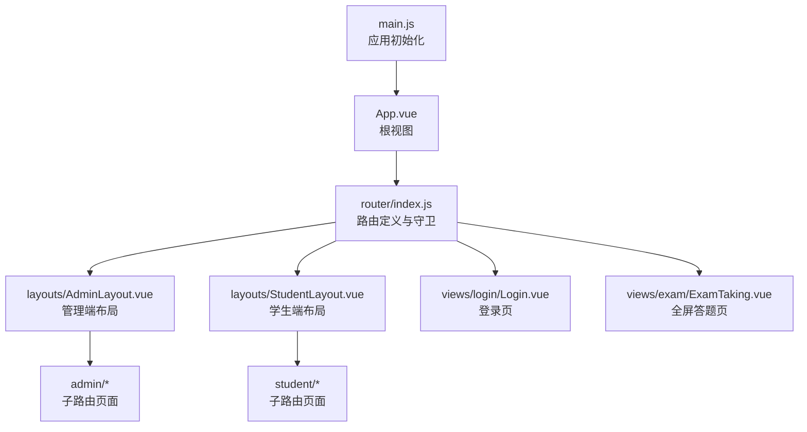
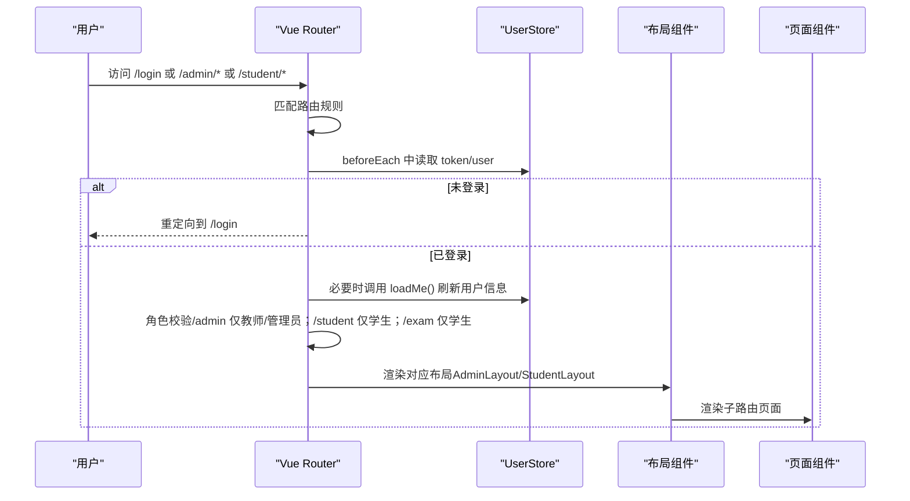
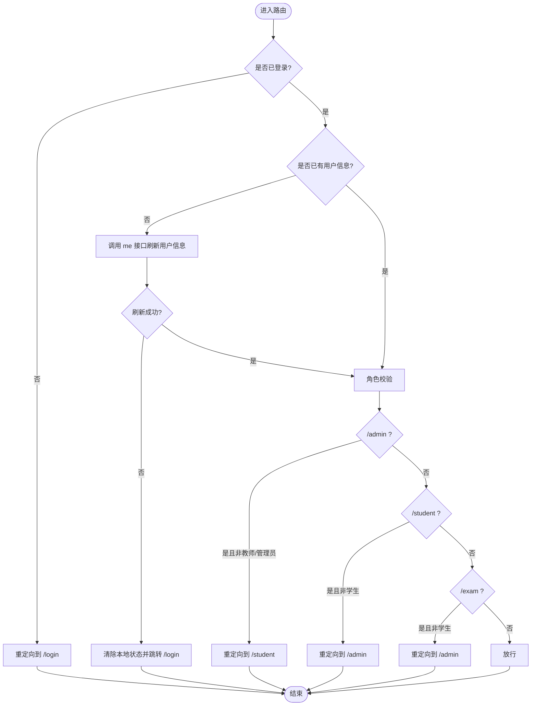
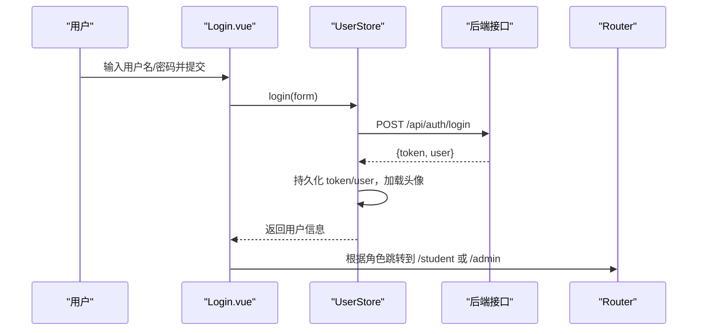
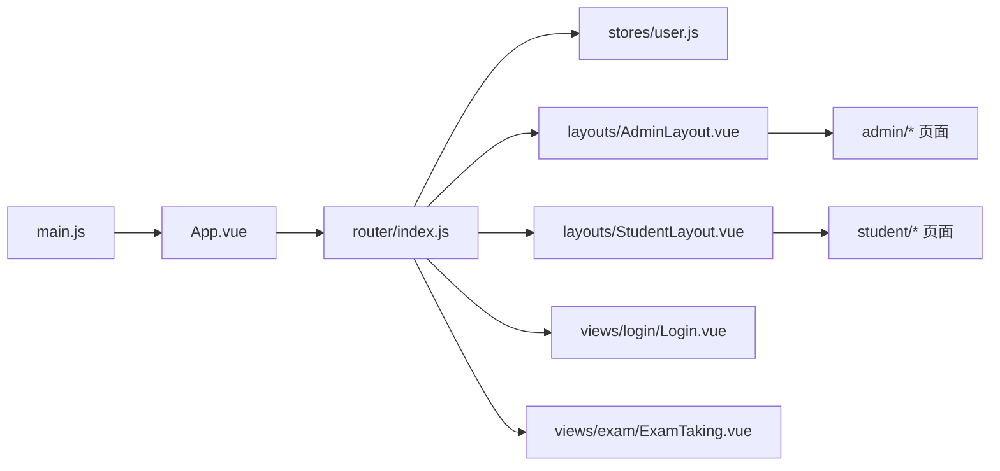

# 路由与导航

<cite>
**本文引用的文件**
- [exam-web/src/router/index.js](file://exam-web/src/router/index.js)
- [exam-web/src/main.js](file://exam-web/src/main.js)
- [exam-web/src/stores/user.js](file://exam-web/src/stores/user.js)
- [exam-web/src/layouts/AdminLayout.vue](file://exam-web/src/layouts/AdminLayout.vue)
- [exam-web/src/layouts/StudentLayout.vue](file://exam-web/src/layouts/StudentLayout.vue)
- [exam-web/src/views/login/Login.vue](file://exam-web/src/views/login/Login.vue)
- [exam-web/src/views/admin/QuestionEdit.vue](file://exam-web/src/views/admin/QuestionEdit.vue)
- [exam-web/src/views/student/Review.vue](file://exam-web/src/views/student/Review.vue)
- [exam-web/src/views/exam/ExamTaking.vue](file://exam-web/src/views/exam/ExamTaking.vue)
- [exam-web/src/api/http.js](file://exam-web/src/api/http.js)
</cite>

## 目录
1. [简介](#简介)
2. [项目结构](#项目结构)
3. [核心组件](#核心组件)
4. [架构总览](#架构总览)
5. [详细组件分析](#详细组件分析)
6. [依赖关系分析](#依赖关系分析)
7. [性能考虑](#性能考虑)
8. [故障排查指南](#故障排查指南)
9. [结论](#结论)
10. [附录](#附录)

## 简介
本章节面向前端路由与导航，围绕 Vue Router 的路由配置、导航守卫、权限控制、动态路由参数、嵌套路由、懒加载、菜单高亮等主题进行系统化说明。结合考试系统的前端实现，给出可操作的配置示例与调试方法，帮助读者快速掌握并扩展该项目的路由体系。

## 项目结构
前端采用 Vue 3 + Vue Router + Pinia 的组合：
- 入口挂载 router、Pinia、UI 库
- 路由定义在统一文件中，包含登录页、管理员后台、学生端、全屏答题页
- 通过布局组件（AdminLayout、StudentLayout）承载侧边栏与顶部导航
- 使用路由懒加载按需引入页面组件
- 使用全局前置守卫完成登录态校验与角色权限控制

图表来源
- [exam-web/src/main.js:1-23](file://exam-web/src/main.js#L1-L23)
- [exam-web/src/router/index.js:1-67](file://exam-web/src/router/index.js#L1-L67)
- [exam-web/src/App.vue:1-4](file://exam-web/src/App.vue#L1-L4)

章节来源
- [exam-web/src/main.js:1-23](file://exam-web/src/main.js#L1-L23)
- [exam-web/src/router/index.js:1-67](file://exam-web/src/router/index.js#L1-L67)

## 核心组件
- 路由配置与守卫：集中管理所有路由表、历史模式、前置守卫逻辑
- 用户状态管理：维护 token、用户信息、头像加载状态，提供角色判断与首页路径计算
- 布局组件：管理端与学生端分别提供侧边栏/顶部导航与路由出口
- 登录页：提交登录表单后根据角色跳转至对应主页
- HTTP 拦截器：自动携带 JWT，处理 401 时强制跳转登录

章节来源
- [exam-web/src/router/index.js:1-67](file://exam-web/src/router/index.js#L1-L67)
- [exam-web/src/stores/user.js:1-98](file://exam-web/src/stores/user.js#L1-L98)
- [exam-web/src/layouts/AdminLayout.vue:1-187](file://exam-web/src/layouts/AdminLayout.vue#L1-L187)
- [exam-web/src/layouts/StudentLayout.vue:1-58](file://exam-web/src/layouts/StudentLayout.vue#L1-L58)
- [exam-web/src/views/login/Login.vue:1-91](file://exam-web/src/views/login/Login.vue#L1-L91)
- [exam-web/src/api/http.js:1-47](file://exam-web/src/api/http.js#L1-L47)

## 架构总览
下图展示了从浏览器访问到页面渲染的完整流程，包括路由匹配、守卫校验、布局渲染与子路由切换。

图表来源
- [exam-web/src/router/index.js:42-64](file://exam-web/src/router/index.js#L42-L64)
- [exam-web/src/stores/user.js:39-46](file://exam-web/src/stores/user.js#L39-L46)
- [exam-web/src/layouts/AdminLayout.vue:15-27](file://exam-web/src/layouts/AdminLayout.vue#L15-L27)
- [exam-web/src/layouts/StudentLayout.vue:8-12](file://exam-web/src/layouts/StudentLayout.vue#L8-L12)

## 详细组件分析

### 路由配置与懒加载
- 路由表按功能域划分：登录页、管理端（/admin）、学生端（/student）、全屏答题（/exam/:examId）
- 使用函数式 import 实现路由级代码分割与懒加载，减少首屏体积
- 根路径重定向到登录页，简化未登录时的初始行为

章节来源
- [exam-web/src/router/index.js:5-45](file://exam-web/src/router/index.js#L5-L45)

### 嵌套路由与布局
- /admin 与 /student 作为父路由，分别挂载 AdminLayout 与 StudentLayout
- 子路由通过 children 数组声明，便于共享布局与侧边栏/导航
- 布局内通过 <router-view /> 渲染当前子路由内容

章节来源
- [exam-web/src/router/index.js:7-39](file://exam-web/src/router/index.js#L7-L39)
- [exam-web/src/layouts/AdminLayout.vue:38-40](file://exam-web/src/layouts/AdminLayout.vue#L38-L40)
- [exam-web/src/layouts/StudentLayout.vue:19-21](file://exam-web/src/layouts/StudentLayout.vue#L19-L21)

### 动态路由与参数传递
- 编辑类页面使用可选参数，如 questions/edit/:id?，支持新增与编辑复用同一组件
- 学生查看某次考试回顾使用 /student/review/:recordId，组件内通过 route.params 获取参数
- 全屏答题页 /exam/:examId 用于进入无侧边栏的答题界面

章节来源
- [exam-web/src/router/index.js:16-22](file://exam-web/src/router/index.js#L16-L22)
- [exam-web/src/router/index.js:35-38](file://exam-web/src/router/index.js#L35-L38)
- [exam-web/src/views/admin/QuestionEdit.vue:113-118](file://exam-web/src/views/admin/QuestionEdit.vue#L113-L118)
- [exam-web/src/views/student/Review.vue:32-36](file://exam-web/src/views/student/Review.vue#L32-L36)
- [exam-web/src/views/exam/ExamTaking.vue:93-97](file://exam-web/src/views/exam/ExamTaking.vue#L93-L97)

### 导航守卫与权限控制
- 未登录访问任何非登录页均重定向到 /login
- 登录后若访问 /login，则根据角色跳转到默认主页（学生→/student，其他→/admin）
- 角色隔离：
  - /admin 仅允许教师和管理员
  - /student 仅允许学生
  - /exam 仅允许学生
- 首次进入时若缺少用户信息，会调用接口刷新，失败则退出登录并跳转

图表来源
- [exam-web/src/router/index.js:48-64](file://exam-web/src/router/index.js#L48-L64)
- [exam-web/src/stores/user.js:39-46](file://exam-web/src/stores/user.js#L39-L46)

章节来源
- [exam-web/src/router/index.js:47-64](file://exam-web/src/router/index.js#L47-L64)
- [exam-web/src/stores/user.js:39-46](file://exam-web/src/stores/user.js#L39-L46)

### 菜单高亮与导航
- 管理端侧边栏使用 Element Plus 菜单，并通过 computed 将当前路由与菜单项匹配，实现高亮
- 学生端顶部导航使用 router-link，借助 exact-active 样式类实现高亮
- 退出登录时清空状态并跳转登录页

章节来源
- [exam-web/src/layouts/AdminLayout.vue:54-69](file://exam-web/src/layouts/AdminLayout.vue#L54-L69)
- [exam-web/src/layouts/StudentLayout.vue:8-12](file://exam-web/src/layouts/StudentLayout.vue#L8-L12)
- [exam-web/src/layouts/AdminLayout.vue:76-79](file://exam-web/src/layouts/AdminLayout.vue#L76-L79)
- [exam-web/src/layouts/StudentLayout.vue:38-41](file://exam-web/src/layouts/StudentLayout.vue#L38-L41)

### 登录流程与跳转
- 登录成功后根据角色跳转到对应主页
- 若后续请求返回 401，HTTP 拦截器会清理本地状态并强制跳转登录页

图表来源
- [exam-web/src/views/login/Login.vue:47-55](file://exam-web/src/views/login/Login.vue#L47-L55)
- [exam-web/src/stores/user.js:31-38](file://exam-web/src/stores/user.js#L31-L38)
- [exam-web/src/api/index.js:4-5](file://exam-web/src/api/index.js#L4-L5)

章节来源
- [exam-web/src/views/login/Login.vue:47-55](file://exam-web/src/views/login/Login.vue#L47-L55)
- [exam-web/src/stores/user.js:31-38](file://exam-web/src/stores/user.js#L31-L38)
- [exam-web/src/api/http.js:30-43](file://exam-web/src/api/http.js#L30-L43)

### 面包屑导航
- 当前路由配置未显式提供元信息（meta.breadcrumb），因此未在布局中实现自动面包屑
- 如需实现，可在路由 meta 中补充面包屑数据，并在布局中基于 route.matched 生成面包屑

[本节为概念性说明，不直接分析具体文件]

## 依赖关系分析
- main.js 负责创建应用实例并安装 Pinia、Router、ElementPlus
- App.vue 仅保留 <router-view />，所有页面均由路由驱动
- 路由模块依赖用户状态 store，以完成鉴权与角色判断
- 布局组件依赖路由 API（useRoute/useRouter）实现高亮与跳转
- 页面组件通过 useRoute 获取动态参数，通过 api 模块发起请求

图表来源
- [exam-web/src/main.js:15-22](file://exam-web/src/main.js#L15-L22)
- [exam-web/src/App.vue:1-4](file://exam-web/src/App.vue#L1-L4)
- [exam-web/src/router/index.js:1-67](file://exam-web/src/router/index.js#L1-L67)

章节来源
- [exam-web/src/main.js:15-22](file://exam-web/src/main.js#L15-L22)
- [exam-web/src/router/index.js:1-67](file://exam-web/src/router/index.js#L1-L67)

## 性能考虑
- 路由级懒加载：通过函数式 import 将页面组件按需加载，降低首屏体积
- 布局与公共组件保持同步加载，避免频繁切换导致的重复请求
- 头像资源通过 Blob URL 缓存，避免重复下载；上传后及时释放旧 URL
- 答题页定时保存答案，减少网络压力与数据丢失风险

章节来源
- [exam-web/src/router/index.js:6-38](file://exam-web/src/router/index.js#L6-L38)
- [exam-web/src/stores/user.js:47-67](file://exam-web/src/stores/user.js#L47-L67)
- [exam-web/src/views/exam/ExamTaking.vue:74-85](file://exam-web/src/views/exam/ExamTaking.vue#L74-L85)

## 故障排查指南
- 401 未授权：检查 http 拦截器是否正确清理本地状态并跳转登录页
- 登录后仍被重定向到登录页：确认 store.loadMe 是否成功，以及路由守卫中角色判断是否符合预期
- 菜单高亮异常：检查 active 计算逻辑是否与当前路由匹配一致
- 动态参数为空：确认路由定义中的参数名与组件内 route.params 取值一致
- 答题页无法保存：检查 saveAnswers 接口调用与 payload 构造是否正确

章节来源
- [exam-web/src/api/http.js:30-43](file://exam-web/src/api/http.js#L30-L43)
- [exam-web/src/router/index.js:48-64](file://exam-web/src/router/index.js#L48-L64)
- [exam-web/src/layouts/AdminLayout.vue:54-69](file://exam-web/src/layouts/AdminLayout.vue#L54-L69)
- [exam-web/src/views/admin/QuestionEdit.vue:113-118](file://exam-web/src/views/admin/QuestionEdit.vue#L113-L118)
- [exam-web/src/views/exam/ExamTaking.vue:67-85](file://exam-web/src/views/exam/ExamTaking.vue#L67-L85)

## 结论
本项目通过清晰的路由分层、严格的导航守卫与角色权限控制，实现了多角色、多场景的导航体验。配合懒加载与布局高亮，兼顾了性能与可用性。对于面包屑导航，可通过补充路由 meta 在现有架构上低成本扩展。

## 附录

### 路由配置示例（参考路径）
- 登录页：[路由定义:6-6](file://exam-web/src/router/index.js#L6-L6)
- 管理端嵌套路由：[路由定义:7-27](file://exam-web/src/router/index.js#L7-L27)
- 学生端嵌套路由：[路由定义:28-37](file://exam-web/src/router/index.js#L28-L37)
- 全屏答题页：[路由定义:38-38](file://exam-web/src/router/index.js#L38-L38)
- 根重定向：[路由定义:39-39](file://exam-web/src/router/index.js#L39-L39)

### 导航守卫要点（参考路径）
- 未登录重定向：[守卫逻辑:48-54](file://exam-web/src/router/index.js#L48-L54)
- 角色隔离：[守卫逻辑:60-63](file://exam-web/src/router/index.js#L60-L63)
- 用户信息刷新：[守卫逻辑:55-59](file://exam-web/src/router/index.js#L55-L59)

### 动态路由参数（参考路径）
- 题目编辑：[路由参数:16-16](file://exam-web/src/router/index.js#L16-L16)，[组件使用:113-118](file://exam-web/src/views/admin/QuestionEdit.vue#L113-L118)
- 学生回顾：[路由参数:35-35](file://exam-web/src/router/index.js#L35-L35)，[组件使用:32-36](file://exam-web/src/views/student/Review.vue#L32-L36)
- 全屏答题：[路由参数:38-38](file://exam-web/src/router/index.js#L38-L38)，[组件使用:93-97](file://exam-web/src/views/exam/ExamTaking.vue#L93-L97)

### 菜单高亮（参考路径）
- 管理端菜单高亮：[active 计算:54-69](file://exam-web/src/layouts/AdminLayout.vue#L54-L69)
- 学生端导航高亮：[router-link 样式:8-12](file://exam-web/src/layouts/StudentLayout.vue#L8-L12)

### 登录与跳转（参考路径）
- 登录提交与跳转：[登录页逻辑:47-55](file://exam-web/src/views/login/Login.vue#L47-L55)
- 401 处理与跳转：[HTTP 拦截器:30-43](file://exam-web/src/api/http.js#L30-L43)