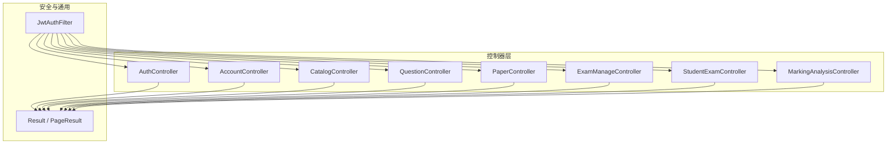
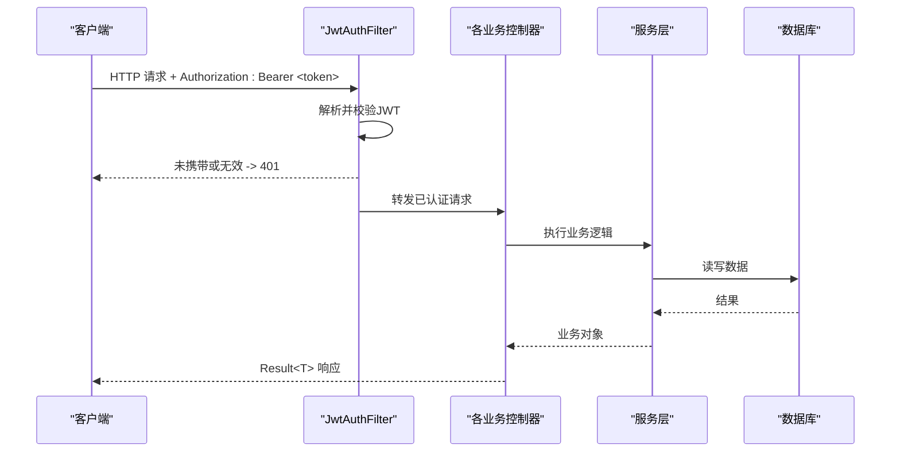
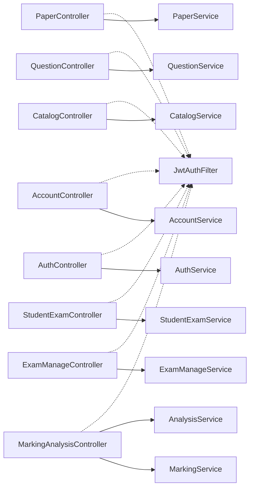
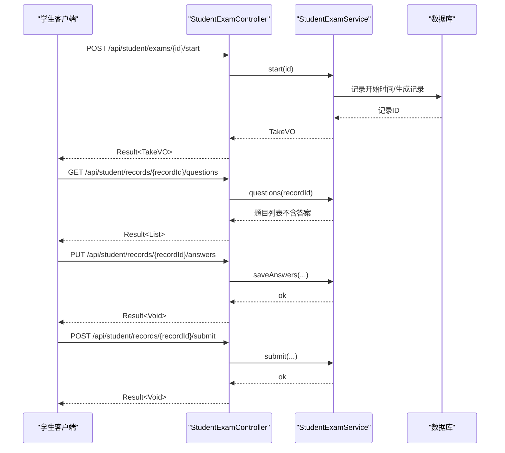

# 后端API文档

<cite>
**本文引用的文件**
- [AuthController.java](file://exam-server/src/main/java/com/exam/controller/AuthController.java)
- [AccountController.java](file://exam-server/src/main/java/com/exam/controller/AccountController.java)
- [CatalogController.java](file://exam-server/src/main/java/com/exam/controller/CatalogController.java)
- [QuestionController.java](file://exam-server/src/main/java/com/exam/controller/QuestionController.java)
- [PaperController.java](file://exam-server/src/main/java/com/exam/controller/PaperController.java)
- [ExamManageController.java](file://exam-server/src/main/java/com/exam/controller/ExamManageController.java)
- [StudentExamController.java](file://exam-server/src/main/java/com/exam/controller/StudentExamController.java)
- [MarkingAnalysisController.java](file://exam-server/src/main/java/com/exam/controller/MarkingAnalysisController.java)
- [JwtAuthFilter.java](file://exam-server/src/main/java/com/exam/security/JwtAuthFilter.java)
- [Result.java](file://exam-server/src/main/java/com/exam/common/Result.java)
- [PageResult.java](file://exam-server/src/main/java/com/exam/common/PageResult.java)
- [LoginRequest.java](file://exam-server/src/main/java/com/exam/dto/LoginRequest.java)
- [QuestionSaveRequest.java](file://exam-server/src/main/java/com/exam/dto/QuestionSaveRequest.java)
- [ExamSaveRequest.java](file://exam-server/src/main/java/com/exam/dto/ExamSaveRequest.java)
- [PaperSaveRequest.java](file://exam-server/src/main/java/com/exam/dto/PaperSaveRequest.java)
- [AnswerSaveRequest.java](file://exam-server/src/main/java/com/exam/dto/AnswerSaveRequest.java)
</cite>

## 目录
1. [简介](#简介)
2. [项目结构](#项目结构)
3. [核心组件](#核心组件)
4. [架构总览](#架构总览)
5. [详细接口说明](#详细接口说明)
6. [依赖关系分析](#依赖关系分析)
7. [性能与限制](#性能与限制)
8. [故障排查指南](#故障排查指南)
9. [结论](#结论)
10. [附录：通用约定与示例](#附录通用约定与示例)

## 简介
本文件为考试系统后端RESTful API的完整规范，覆盖认证授权、题库管理、试卷管理、考试任务管理、学生答题、阅卷评分与学情分析等模块。每个接口均给出HTTP方法、URL路径、请求参数、响应格式、状态码与错误处理说明，并提供请求与响应的JSON结构定义及调用示例。所有接口统一使用JWT进行鉴权，返回体采用统一的Result包装。

## 项目结构
后端基于Spring Boot构建，控制器按业务域划分：
- 认证与账户：AuthController、AccountController
- 目录与分类：CatalogController
- 题库与试卷：QuestionController、PaperController
- 考试任务：ExamManageController
- 学生端：StudentExamController
- 阅卷与分析：MarkingAnalysisController
- 安全与通用：JwtAuthFilter、Result、PageResult

图表来源
- [AuthController.java:24-64](file://exam-server/src/main/java/com/exam/controller/AuthController.java#L24-L64)
- [AccountController.java:27-93](file://exam-server/src/main/java/com/exam/controller/AccountController.java#L27-L93)
- [CatalogController.java:19-69](file://exam-server/src/main/java/com/exam/controller/CatalogController.java#L19-L69)
- [QuestionController.java:32-117](file://exam-server/src/main/java/com/exam/controller/QuestionController.java#L32-L117)
- [PaperController.java:22-62](file://exam-server/src/main/java/com/exam/controller/PaperController.java#L22-L62)
- [ExamManageController.java:20-66](file://exam-server/src/main/java/com/exam/controller/ExamManageController.java#L20-L66)
- [StudentExamController.java:22-72](file://exam-server/src/main/java/com/exam/controller/StudentExamController.java#L22-L72)
- [MarkingAnalysisController.java:30-133](file://exam-server/src/main/java/com/exam/controller/MarkingAnalysisController.java#L30-L133)
- [JwtAuthFilter.java:21-51](file://exam-server/src/main/java/com/exam/security/JwtAuthFilter.java#L21-L51)
- [Result.java:1-38](file://exam-server/src/main/java/com/exam/common/Result.java#L1-L38)
- [PageResult.java:1-20](file://exam-server/src/main/java/com/exam/common/PageResult.java#L1-L20)

章节来源
- [AuthController.java:24-64](file://exam-server/src/main/java/com/exam/controller/AuthController.java#L24-L64)
- [JwtAuthFilter.java:21-51](file://exam-server/src/main/java/com/exam/security/JwtAuthFilter.java#L21-L51)
- [Result.java:1-38](file://exam-server/src/main/java/com/exam/common/Result.java#L1-L38)

## 核心组件
- 统一返回体 Result：包含 code、message、data；成功时 code=0，失败时非0并附带 message。
- 分页结果 PageResult：包含 total 与 records。
- JWT鉴权：通过 Authorization: Bearer <token> 传递令牌，过滤器解析后写入安全上下文。
- 业务控制器：按模块提供REST接口，统一返回 Result。

章节来源
- [Result.java:1-38](file://exam-server/src/main/java/com/exam/common/Result.java#L1-L38)
- [PageResult.java:1-20](file://exam-server/src/main/java/com/exam/common/PageResult.java#L1-L20)
- [JwtAuthFilter.java:21-51](file://exam-server/src/main/java/com/exam/security/JwtAuthFilter.java#L21-L51)

## 架构总览
下图展示从客户端到控制器的请求流程，以及JWT鉴权在过滤器中的介入点。

图表来源
- [JwtAuthFilter.java:21-51](file://exam-server/src/main/java/com/exam/security/JwtAuthFilter.java#L21-L51)
- [AuthController.java:24-64](file://exam-server/src/main/java/com/exam/controller/AuthController.java#L24-L64)
- [Result.java:1-38](file://exam-server/src/main/java/com/exam/common/Result.java#L1-L38)

## 详细接口说明

### 认证与账户
- 登录
  - 方法：POST
  - 路径：/api/auth/login
  - 鉴权：无需
  - 请求体：LoginRequest（username、password）
  - 响应：Result<LoginVO>（包含token、角色等信息）
  - 状态码：200
  - 错误：参数校验失败返回400，用户名密码错误由业务返回code!=0
  - 示例
    - 请求：{"username":"admin","password":"123456"}
    - 响应：{"code":0,"message":"ok","data":{"token":"...","role":"ROLE_ADMIN"}}
- 获取当前用户
  - 方法：GET
  - 路径：/api/auth/me
  - 鉴权：需要
  - 响应：Result<LoginVO>
- 退出登录
  - 方法：POST
  - 路径：/api/auth/logout
  - 鉴权：需要
  - 响应：Result<Void>
- 头像
  - 读取：GET /api/auth/avatar
  - 上传：POST /api/auth/avatar（表单字段 file）
  - 删除：DELETE /api/auth/avatar
  - 鉴权：需要
  - 响应：图片二进制或 Result<Void>

章节来源
- [AuthController.java:31-63](file://exam-server/src/main/java/com/exam/controller/AuthController.java#L31-L63)
- [LoginRequest.java:7-14](file://exam-server/src/main/java/com/exam/dto/LoginRequest.java#L7-L14)

- 用户管理（管理员/教师）
  - 分页查询用户：GET /api/users?page=1&size=10&keyword=&role=
  - 创建用户：POST /api/users（UserSaveRequest）
  - 更新用户：PUT /api/users/{id}（UserSaveRequest）
  - 分页查询学生：GET /api/students?page=1&size=10&keyword=&className=
  - 学生选项：GET /api/students/options
  - 创建学生：POST /api/students（StudentSaveRequest）
  - 更新学生：PUT /api/students/{id}（StudentSaveRequest）
  - 删除学生：DELETE /api/students/{id}
  - 批量导入学生：POST /api/students/import（Excel文件）
  - 鉴权：需要（管理员/教师）
  - 响应：统一 Result，分页使用 PageResult

章节来源
- [AccountController.java:32-92](file://exam-server/src/main/java/com/exam/controller/AccountController.java#L32-L92)

### 目录与分类
- 知识点树：GET /api/knowledge-points/tree
- 知识点CRUD：POST/PUT/DELETE /api/knowledge-points/{id}
- 题目分类：GET/POST/PUT/DELETE /api/question-categories/{id}
- 鉴权：需要（管理员/教师）
- 响应：统一 Result

章节来源
- [CatalogController.java:24-68](file://exam-server/src/main/java/com/exam/controller/CatalogController.java#L24-L68)

### 题库管理
- 分页查询：GET /api/questions?page=1&size=10&type=&categoryId=&knowledgePointId=&keyword=
- 详情：GET /api/questions/{id}
- 新增：POST /api/questions（QuestionSaveRequest）
- 更新：PUT /api/questions/{id}（QuestionSaveRequest）
- 删除：DELETE /api/questions/{id}
- 导入模板下载：GET /api/questions/import-template
- Excel导入：POST /api/questions/import（file, defaultKnowledgePointId）
- 导出PDF练习卷：POST /api/questions/export-pdf（QuestionExportRequest）
- 鉴权：需要（管理员/教师）
- 限制：单次导入最多2000行
- 响应：统一 Result，分页使用 PageResult

章节来源
- [QuestionController.java:42-116](file://exam-server/src/main/java/com/exam/controller/QuestionController.java#L42-L116)

### 试卷管理
- 分页查询：GET /api/papers?page=1&size=10&keyword=
- 下拉选项：GET /api/papers/options
- 详情：GET /api/papers/{id}
- 新增：POST /api/papers（PaperSaveRequest）
- 更新：PUT /api/papers/{id}（PaperSaveRequest）
- 删除：DELETE /api/papers/{id}
- 鉴权：需要（管理员/教师）
- 响应：统一 Result

章节来源
- [PaperController.java:28-61](file://exam-server/src/main/java/com/exam/controller/PaperController.java#L28-L61)

### 考试管理
- 工作台统计：GET /api/dashboard
- 分页查询：GET /api/exams?page=1&size=10&keyword=&status=
- 详情：GET /api/exams/{id}
- 新增：POST /api/exams（ExamSaveRequest）
- 更新：PUT /api/exams/{id}（ExamSaveRequest）
- 发布：POST /api/exams/{id}/publish
- 停止：POST /api/exams/{id}/stop
- 鉴权：需要（管理员/教师）
- 响应：统一 Result

章节来源
- [ExamManageController.java:25-65](file://exam-server/src/main/java/com/exam/controller/ExamManageController.java#L25-L65)

### 学生答题
- 我的考试列表：GET /api/student/exams
- 开始/继续考试：POST /api/student/exams/{id}/start
- 拉取题目（不含答案）：GET /api/student/records/{recordId}/questions
- 自动保存答案：PUT /api/student/records/{recordId}/answers（List<AnswerSaveRequest>）
- 交卷：POST /api/student/records/{recordId}/submit（可选 answers）
- 查看作答：GET /api/student/records/{recordId}/review
- 知识点掌握度：GET /api/student/knowledge-stats
- 鉴权：需要（学生）
- 响应：统一 Result

章节来源
- [StudentExamController.java:30-71](file://exam-server/src/main/java/com/exam/controller/StudentExamController.java#L30-L71)

### 阅卷与学情分析
- 待阅卷列表：GET /api/marking/records?examId=&status=
- 阅卷详情：GET /api/marking/records/{recordId}
- 提交评分：POST /api/marking/answers/{answerId}（MarkingRequest）
- 考试统计：GET /api/exams/{id}/statistics
- 知识点统计：GET /api/exams/{id}/knowledge-stats
- 学生知识点：GET /api/analysis/students/{studentId}/knowledge
- 班级知识点：GET /api/analysis/classes/{className}/knowledge
- 成绩列表：GET /api/scores?examId=&className=
- 成绩导出：GET /api/scores/export?examId=&className=
- 鉴权：需要（管理员/教师）
- 响应：统一 Result；导出为Excel二进制流

章节来源
- [MarkingAnalysisController.java:38-90](file://exam-server/src/main/java/com/exam/controller/MarkingAnalysisController.java#L38-L90)

## 依赖关系分析
- 控制器之间无直接耦合，均依赖各自服务层。
- 鉴权通过 JwtAuthFilter 全局拦截，对受保护接口进行JWT校验。
- 统一返回体 Result 被所有控制器复用，便于前端统一处理。

图表来源
- [JwtAuthFilter.java:21-51](file://exam-server/src/main/java/com/exam/security/JwtAuthFilter.java#L21-L51)
- [AuthController.java:24-64](file://exam-server/src/main/java/com/exam/controller/AuthController.java#L24-L64)
- [AccountController.java:27-93](file://exam-server/src/main/java/com/exam/controller/AccountController.java#L27-L93)
- [CatalogController.java:19-69](file://exam-server/src/main/java/com/exam/controller/CatalogController.java#L19-L69)
- [QuestionController.java:32-117](file://exam-server/src/main/java/com/exam/controller/QuestionController.java#L32-L117)
- [PaperController.java:22-62](file://exam-server/src/main/java/com/exam/controller/PaperController.java#L22-L62)
- [ExamManageController.java:20-66](file://exam-server/src/main/java/com/exam/controller/ExamManageController.java#L20-L66)
- [StudentExamController.java:22-72](file://exam-server/src/main/java/com/exam/controller/StudentExamController.java#L22-L72)
- [MarkingAnalysisController.java:30-133](file://exam-server/src/main/java/com/exam/controller/MarkingAnalysisController.java#L30-L133)

## 性能与限制
- 题库导入限制：单次导入最多2000行，避免超大文件拖垮解析与事务。
- 文件导出：PDF与Excel通过响应流输出，注意前端设置正确的Content-Type与文件名头。
- 分页：默认页大小10，建议合理设置size以平衡性能与体验。
- 鉴权：JWT无状态，服务端不维护会话，适合水平扩展。

章节来源
- [QuestionController.java:39-75](file://exam-server/src/main/java/com/exam/controller/QuestionController.java#L39-L75)
- [JwtAuthFilter.java:21-51](file://exam-server/src/main/java/com/exam/security/JwtAuthFilter.java#L21-L51)

## 故障排查指南
- 401 未认证：检查是否携带 Authorization: Bearer <token>，且token有效。
- 400 参数校验失败：检查请求体字段是否符合DTO约束（如必填项）。
- 业务错误：Result.code != 0，查看message定位问题。
- 导入失败：确认文件格式为.xlsx/.xls，行数不超过2000。
- 导出异常：确认浏览器允许下载附件，并正确解析Content-Disposition。

章节来源
- [JwtAuthFilter.java:21-51](file://exam-server/src/main/java/com/exam/security/JwtAuthFilter.java#L21-L51)
- [Result.java:1-38](file://exam-server/src/main/java/com/exam/common/Result.java#L1-L38)
- [QuestionController.java:60-75](file://exam-server/src/main/java/com/exam/controller/QuestionController.java#L60-L75)

## 结论
本API文档覆盖了考试系统的核心业务流程，包括认证、题库、试卷、考试、答题、阅卷与分析。所有接口遵循统一的鉴权与返回约定，便于前后端协作与扩展。建议在集成时严格遵循参数校验规则与调用限制，确保系统稳定运行。

## 附录：通用约定与示例

### 鉴权方式
- 所有受保护接口需在请求头携带：Authorization: Bearer <token>
- 登录成功后返回token，后续请求均需携带

章节来源
- [JwtAuthFilter.java:21-51](file://exam-server/src/main/java/com/exam/security/JwtAuthFilter.java#L21-L51)
- [AuthController.java:31-46](file://exam-server/src/main/java/com/exam/controller/AuthController.java#L31-L46)

### 统一返回体
- 结构：{ code, message, data }
- 成功：code=0，data为业务数据
- 失败：code!=0，message描述错误信息

章节来源
- [Result.java:1-38](file://exam-server/src/main/java/com/exam/common/Result.java#L1-L38)

### 分页结构
- 结构：{ total, records }
- 参数：page、size（默认值见各接口）

章节来源
- [PageResult.java:1-20](file://exam-server/src/main/java/com/exam/common/PageResult.java#L1-L20)

### 关键DTO定义
- LoginRequest：username、password（必填）
- QuestionSaveRequest：id、categoryId、questionType、content、correctAnswer、analysis、difficulty、defaultScore、visibility、options、knowledgePointIds
- ExamSaveRequest：id、examName、paperId、startTime、endTime、durationMinutes、allowSubmitMinutes、resultVisible、answerVisible、studentIds
- PaperSaveRequest：id、paperName、passScore、questions[]（questionId、questionScore、sortNo）
- AnswerSaveRequest：questionId、studentAnswer、flagged

章节来源
- [LoginRequest.java:7-14](file://exam-server/src/main/java/com/exam/dto/LoginRequest.java#L7-L14)
- [QuestionSaveRequest.java:8-30](file://exam-server/src/main/java/com/exam/dto/QuestionSaveRequest.java#L8-L30)
- [ExamSaveRequest.java:8-21](file://exam-server/src/main/java/com/exam/dto/ExamSaveRequest.java#L8-L21)
- [PaperSaveRequest.java:8-22](file://exam-server/src/main/java/com/exam/dto/PaperSaveRequest.java#L8-L22)
- [AnswerSaveRequest.java:5-11](file://exam-server/src/main/java/com/exam/dto/AnswerSaveRequest.java#L5-L11)

### 典型调用序列（学生答题）

图表来源
- [StudentExamController.java:35-59](file://exam-server/src/main/java/com/exam/controller/StudentExamController.java#L35-L59)