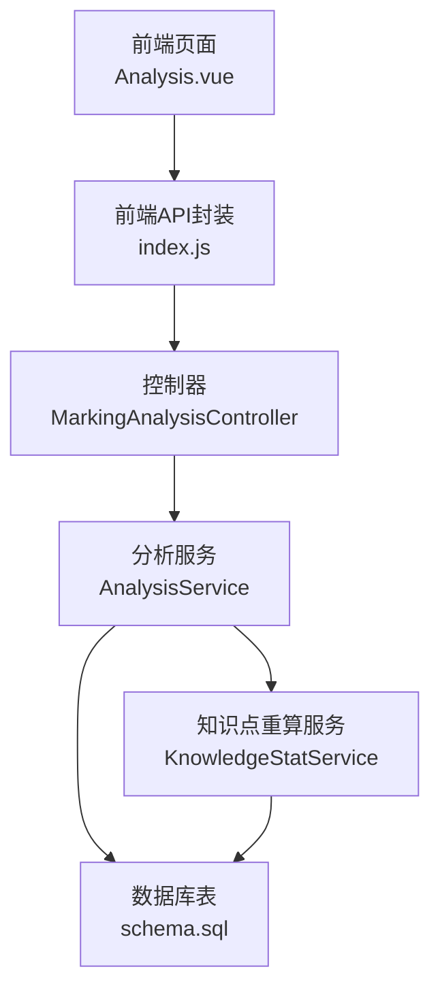
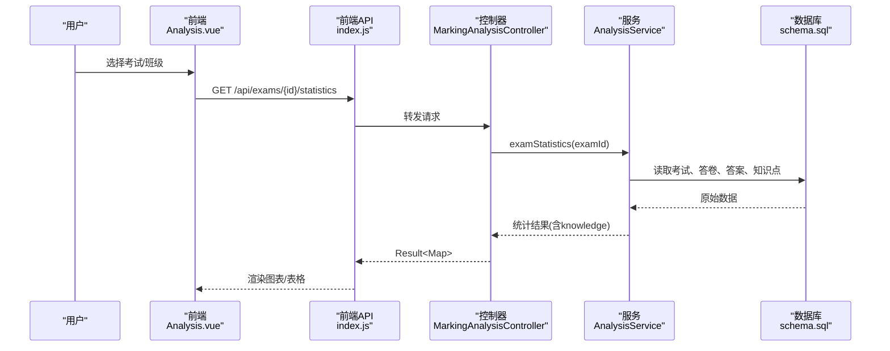
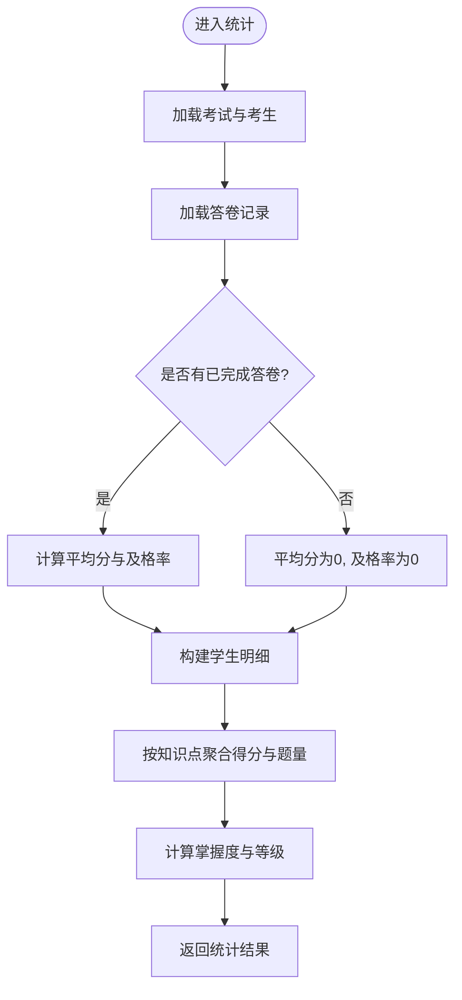
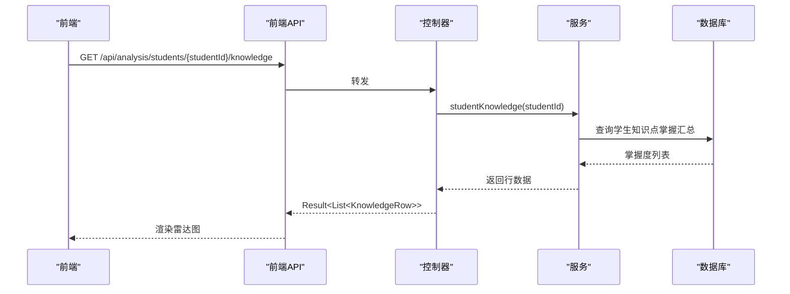
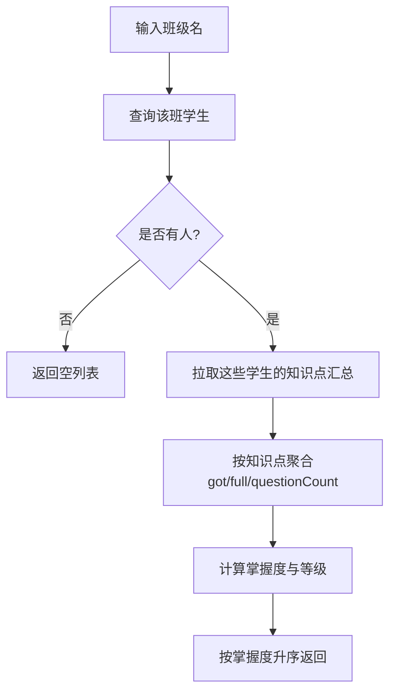
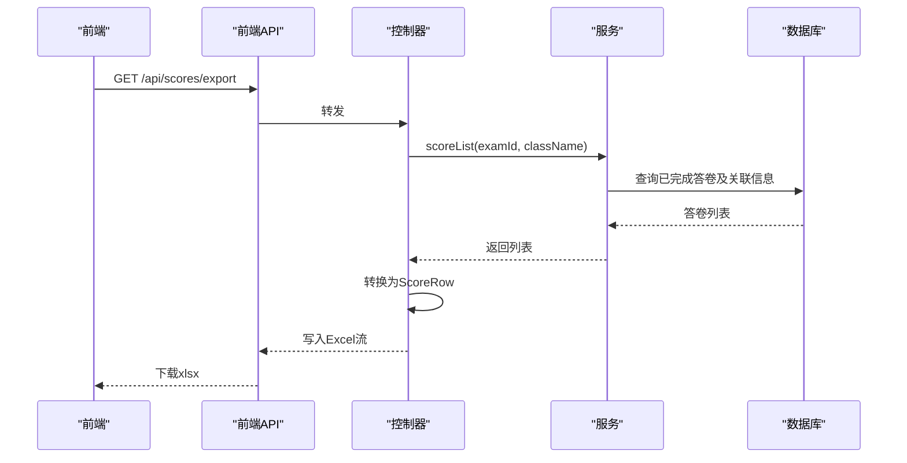
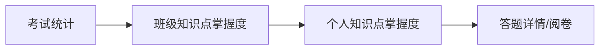
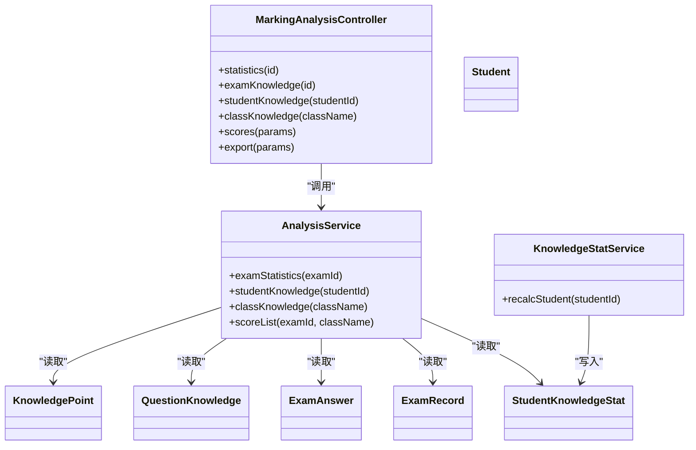

# 学情分析API

<cite>
**本文引用的文件**
- [MarkingAnalysisController.java](file://exam-server/src/main/java/com/exam/controller/MarkingAnalysisController.java)
- [AnalysisService.java](file://exam-server/src/main/java/com/exam/service/AnalysisService.java)
- [KnowledgeStatService.java](file://exam-server/src/main/java/com/exam/service/KnowledgeStatService.java)
- [StudentKnowledgeStat.java](file://exam-server/src/main/java/com/exam/entity/StudentKnowledgeStat.java)
- [KnowledgePoint.java](file://exam-server/src/main/java/com/exam/entity/KnowledgePoint.java)
- [ExamRecord.java](file://exam-server/src/main/java/com/exam/entity/ExamRecord.java)
- [ExamAnswer.java](file://exam-server/src/main/java/com/exam/entity/ExamAnswer.java)
- [QuestionKnowledge.java](file://exam-server/src/main/java/com/exam/entity/QuestionKnowledge.java)
- [Student.java](file://exam-server/src/main/java/com/exam/entity/Student.java)
- [schema.sql](file://sql/schema.sql)
- [Analysis.vue](file://exam-web/src/views/admin/Analysis.vue)
- [index.js](file://exam-web/src/api/index.js)
</cite>

## 目录
1. [简介](#简介)
2. [项目结构](#项目结构)
3. [核心组件](#核心组件)
4. [架构总览](#架构总览)
5. [详细组件分析](#详细组件分析)
6. [依赖关系分析](#依赖关系分析)
7. [性能考虑](#性能考虑)
8. [故障排查指南](#故障排查指南)
9. [结论](#结论)
10. [附录](#附录)

## 简介
本模块提供考试后的学情分析能力，覆盖个人能力分析、班级统计分析、历史趋势与预测、可视化报表导出以及数据钻取。核心指标“掌握度”定义为：实得分 / 满分 × 100%，并据此划分“薄弱/一般/掌握”等级，用于雷达图、柱状图等可视化展示与个性化学习建议生成。

## 项目结构
- 控制器层：对外暴露统计、导出、阅卷等接口。
- 服务层：实现单场考试统计、学生/班级知识点掌握度计算、成绩列表查询、知识点重算等逻辑。
- 实体与映射：围绕答卷、答案、知识点、学生档案等数据模型进行聚合与统计。
- 前端：通过统一API调用后端接口，渲染图表与表格。

图示来源
- [Analysis.vue:1-92](file://exam-web/src/views/admin/Analysis.vue#L1-L92)
- [index.js:64-82](file://exam-web/src/api/index.js#L64-L82)
- [MarkingAnalysisController.java:38-90](file://exam-server/src/main/java/com/exam/controller/MarkingAnalysisController.java#L38-L90)
- [AnalysisService.java:46-212](file://exam-server/src/main/java/com/exam/service/AnalysisService.java#L46-L212)
- [KnowledgeStatService.java:34-100](file://exam-server/src/main/java/com/exam/service/KnowledgeStatService.java#L34-L100)
- [schema.sql:135-187](file://sql/schema.sql#L135-L187)

章节来源
- [MarkingAnalysisController.java:38-90](file://exam-server/src/main/java/com/exam/controller/MarkingAnalysisController.java#L38-L90)
- [AnalysisService.java:46-212](file://exam-server/src/main/java/com/exam/service/AnalysisService.java#L46-L212)
- [KnowledgeStatService.java:34-100](file://exam-server/src/main/java/com/exam/service/KnowledgeStatService.java#L34-L100)
- [schema.sql:135-187](file://sql/schema.sql#L135-L187)

## 核心组件
- 单场考试统计：返回应考人数、提交/完成/阅卷中人数、平均分、及格率、学生明细与知识点掌握度。
- 个人能力分析：按学生维度输出知识点掌握度（含掌握度、题数、得分、等级），用于雷达图与报告。
- 班级统计分析：按班级聚合知识点得分与题量，计算掌握度并排序，识别薄弱点。
- 成绩列表与导出：支持按考试或班级筛选已完成的答卷，导出Excel。
- 知识点重算：基于已完成答卷与题目-知识点权重分摊，回写学生知识点掌握汇总。

章节来源
- [AnalysisService.java:46-212](file://exam-server/src/main/java/com/exam/service/AnalysisService.java#L46-L212)
- [KnowledgeStatService.java:34-100](file://exam-server/src/main/java/com/exam/service/KnowledgeStatService.java#L34-L100)
- [MarkingAnalysisController.java:55-90](file://exam-server/src/main/java/com/exam/controller/MarkingAnalysisController.java#L55-L90)

## 架构总览
下图展示了从前端到后端的调用链路，以及关键的数据流转过程。

图示来源
- [Analysis.vue:73-84](file://exam-web/src/views/admin/Analysis.vue#L73-L84)
- [index.js:64-72](file://exam-web/src/api/index.js#L64-L72)
- [MarkingAnalysisController.java:55-68](file://exam-server/src/main/java/com/exam/controller/MarkingAnalysisController.java#L55-L68)
- [AnalysisService.java:46-96](file://exam-server/src/main/java/com/exam/service/AnalysisService.java#L46-L96)
- [schema.sql:135-187](file://sql/schema.sql#L135-L187)

## 详细组件分析

### 单场考试统计接口
- 路径与方法：GET /api/exams/{id}/statistics
- 功能：返回考试名称、应考/提交/完成/阅卷中人数、平均分、及格率、学生明细、知识点掌握度列表。
- 数据来源：考试、考生分配、答卷状态、答案明细、题目-知识点权重、知识点信息。
- 算法要点：
  - 平均分与及格率仅基于“已完成”答卷。
  - 知识点掌握度按题目-知识点权重分摊分数，掌握度=实得分/满分×100%。
  - 等级划分：≥80为“掌握”，60–79为“一般”，<60为“薄弱”。

图示来源
- [AnalysisService.java:46-96](file://exam-server/src/main/java/com/exam/service/AnalysisService.java#L46-L96)
- [AnalysisService.java:163-212](file://exam-server/src/main/java/com/exam/service/AnalysisService.java#L163-L212)
- [schema.sql:135-187](file://sql/schema.sql#L135-L187)

章节来源
- [MarkingAnalysisController.java:55-63](file://exam-server/src/main/java/com/exam/controller/MarkingAnalysisController.java#L55-L63)
- [AnalysisService.java:46-96](file://exam-server/src/main/java/com/exam/service/AnalysisService.java#L46-L96)

### 个人能力分析接口（知识掌握度雷达图数据）
- 路径与方法：GET /api/analysis/students/{studentId}/knowledge
- 功能：返回某学生在各知识点的掌握度、题量、得分、等级，适合绘制雷达图。
- 数据来源：学生知识点掌握汇总表、知识点表。
- 算法要点：直接读取已计算的掌握度并按掌握度升序返回。

图示来源
- [MarkingAnalysisController.java:65-68](file://exam-server/src/main/java/com/exam/controller/MarkingAnalysisController.java#L65-L68)
- [AnalysisService.java:99-107](file://exam-server/src/main/java/com/exam/service/AnalysisService.java#L99-L107)
- [StudentKnowledgeStat.java:11-27](file://exam-server/src/main/java/com/exam/entity/StudentKnowledgeStat.java#L11-L27)
- [schema.sql:173-187](file://sql/schema.sql#L173-L187)

章节来源
- [MarkingAnalysisController.java:65-68](file://exam-server/src/main/java/com/exam/controller/MarkingAnalysisController.java#L65-L68)
- [AnalysisService.java:99-107](file://exam-server/src/main/java/com/exam/service/AnalysisService.java#L99-L107)

### 班级统计分析接口（成绩分布、薄弱点）
- 路径与方法：GET /api/analysis/classes/{className}/knowledge
- 功能：按班级聚合知识点得分与题量，计算掌握度并排序，识别薄弱点。
- 数据来源：学生表、学生知识点掌握汇总、知识点表。
- 算法要点：将班级内所有学生的知识点得分与题量累加，再计算掌握度与等级。

图示来源
- [AnalysisService.java:109-145](file://exam-server/src/main/java/com/exam/service/AnalysisService.java#L109-L145)
- [schema.sql:14-28](file://sql/schema.sql#L14-L28)
- [schema.sql:173-187](file://sql/schema.sql#L173-L187)

章节来源
- [MarkingAnalysisController.java:70-73](file://exam-server/src/main/java/com/exam/controller/MarkingAnalysisController.java#L70-L73)
- [AnalysisService.java:109-145](file://exam-server/src/main/java/com/exam/service/AnalysisService.java#L109-L145)

### 历史趋势分析与预测
- 现状说明：当前未提供专门的历史趋势与预测接口。可通过多次考试的单场统计与个人/班级知识点掌握度进行横向对比，形成趋势观察。
- 建议扩展：
  - 新增时间序列接口：按学生/班级/知识点维度返回多期掌握度，便于折线图展示进步轨迹。
  - 预测模型：基于历史掌握度变化拟合线性或多项式回归，给出下一阶段目标掌握度与推荐练习量。

[本节为概念性说明，不直接分析具体文件]

### 可视化报表生成与导出
- 成绩导出接口：GET /api/scores/export?examId=&className=
- 功能：根据考试或班级筛选已完成的答卷，导出Excel，包含考试名称、学号、姓名、班级、客观题分、主观题分、总分、是否及格。
- 数据来源：答卷记录、学生信息、考试信息。

图示来源
- [MarkingAnalysisController.java:81-90](file://exam-server/src/main/java/com/exam/controller/MarkingAnalysisController.java#L81-L90)
- [AnalysisService.java:147-161](file://exam-server/src/main/java/com/exam/service/AnalysisService.java#L147-L161)
- [schema.sql:135-187](file://sql/schema.sql#L135-L187)

章节来源
- [MarkingAnalysisController.java:81-90](file://exam-server/src/main/java/com/exam/controller/MarkingAnalysisController.java#L81-L90)
- [AnalysisService.java:147-161](file://exam-server/src/main/java/com/exam/service/AnalysisService.java#L147-L161)

### 个性化学习建议生成逻辑
- 依据：知识点掌握度与等级（薄弱/一般/掌握）。
- 规则：
  - 薄弱：优先安排对应知识点的巩固练习与讲解。
  - 一般：适度提升难度，强化易错点。
  - 掌握：拓展拔高题，保持熟练度。
- 触发时机：在个人能力分析或班级薄弱点分析后，结合等级自动产出建议清单。

[本节为业务规则说明，不直接分析具体文件]

### 数据钻取功能（宏观到微观）
- 宏观：单场考试统计（整体表现、平均分、及格率）。
- 中观：班级知识点掌握度（薄弱点定位）。
- 微观：个人知识点掌握度（雷达图）、每题作答详情（阅卷详情）。
- 钻取路径：考试统计 → 班级薄弱点 → 个人掌握度 → 答题详情。

[本节为流程示意，不直接分析具体文件]

## 依赖关系分析
- 控制器依赖服务：控制器仅做参数校验与结果包装，核心逻辑在服务层。
- 服务依赖Mapper与实体：通过MyBatis-Plus访问数据库，聚合答卷、答案、知识点等数据。
- 知识点重算服务独立维护学生知识点掌握汇总，供分析服务直接读取。

图示来源
- [MarkingAnalysisController.java:38-90](file://exam-server/src/main/java/com/exam/controller/MarkingAnalysisController.java#L38-L90)
- [AnalysisService.java:46-212](file://exam-server/src/main/java/com/exam/service/AnalysisService.java#L46-L212)
- [KnowledgeStatService.java:34-100](file://exam-server/src/main/java/com/exam/service/KnowledgeStatService.java#L34-L100)
- [StudentKnowledgeStat.java:11-27](file://exam-server/src/main/java/com/exam/entity/StudentKnowledgeStat.java#L11-L27)
- [ExamRecord.java:11-28](file://exam-server/src/main/java/com/exam/entity/ExamRecord.java#L11-L28)
- [ExamAnswer.java:11-31](file://exam-server/src/main/java/com/exam/entity/ExamAnswer.java#L11-L31)
- [QuestionKnowledge.java:11-19](file://exam-server/src/main/java/com/exam/entity/QuestionKnowledge.java#L11-L19)
- [KnowledgePoint.java:11-24](file://exam-server/src/main/java/com/exam/entity/KnowledgePoint.java#L11-L24)
- [Student.java:11-26](file://exam-server/src/main/java/com/exam/entity/Student.java#L11-L26)

章节来源
- [MarkingAnalysisController.java:38-90](file://exam-server/src/main/java/com/exam/controller/MarkingAnalysisController.java#L38-L90)
- [AnalysisService.java:46-212](file://exam-server/src/main/java/com/exam/service/AnalysisService.java#L46-L212)
- [KnowledgeStatService.java:34-100](file://exam-server/src/main/java/com/exam/service/KnowledgeStatService.java#L34-L100)

## 性能考虑
- 聚合计算复杂度：知识点聚合涉及答案→题目→知识点的多级关联，建议在热点字段建立索引（如record_id、question_id、knowledge_point_id）。
- 大数据量导出：导出时采用流式写入，避免内存溢出；可按考试或班级分批处理。
- 重算频率：知识点重算为事务操作，建议在阅卷完成后批量触发，减少频繁IO。
- 缓存策略：对高频的班级/学生知识点掌握度可引入短期缓存，降低重复计算压力。

[本节为通用优化建议，不直接分析具体文件]

## 故障排查指南
- 无数据返回：检查考试是否发布、是否有考生分配、是否存在已完成答卷。
- 掌握度异常：确认题目-知识点权重配置是否正确，分值快照是否与试卷一致。
- 导出为空：确认筛选条件与答卷状态是否为“已完成”。
- 权限问题：确保当前登录用户具备相应角色与访问权限。

章节来源
- [AnalysisService.java:46-96](file://exam-server/src/main/java/com/exam/service/AnalysisService.java#L46-L96)
- [KnowledgeStatService.java:34-100](file://exam-server/src/main/java/com/exam/service/KnowledgeStatService.java#L34-L100)
- [MarkingAnalysisController.java:81-90](file://exam-server/src/main/java/com/exam/controller/MarkingAnalysisController.java#L81-L90)

## 结论
本模块以“掌握度”为核心指标，提供从单场考试到班级、个人的多维度分析能力，并通过导出与可视化支撑教学决策。未来可扩展历史趋势与预测模型，进一步提升个性化指导的精准度。

[本节为总结性内容，不直接分析具体文件]

## 附录

### 接口清单与说明
- 单场考试统计
  - 方法：GET
  - 路径：/api/exams/{id}/statistics
  - 说明：返回考试统计概览与学生明细、知识点掌握度。
- 本场知识点掌握度
  - 方法：GET
  - 路径：/api/exams/{id}/knowledge-stats
  - 说明：返回本场知识点掌握度列表。
- 个人知识点掌握度
  - 方法：GET
  - 路径：/api/analysis/students/{studentId}/knowledge
  - 说明：返回学生维度的知识点掌握度，用于雷达图。
- 班级知识点掌握度
  - 方法：GET
  - 路径：/api/analysis/classes/{className}/knowledge
  - 说明：返回班级维度的知识点掌握度，识别薄弱点。
- 成绩列表
  - 方法：GET
  - 路径：/api/scores?examId=&className=
  - 说明：按考试或班级筛选已完成答卷。
- 成绩导出
  - 方法：GET
  - 路径：/api/scores/export?examId=&className=
  - 说明：导出Excel，包含考试、学号、姓名、班级、客观题分、主观题分、总分、是否及格。

章节来源
- [MarkingAnalysisController.java:55-90](file://exam-server/src/main/java/com/exam/controller/MarkingAnalysisController.java#L55-L90)
- [index.js:64-72](file://exam-web/src/api/index.js#L64-L72)

### 数据模型与来源
- 答卷与答案：记录考试过程与评分快照，支撑知识点分摊与统计。
- 知识点与权重：题目与知识点多对多关系，权重决定分摊比例。
- 学生档案：学号、姓名、班级等信息，用于明细与分组。
- 学生知识点掌握汇总：由重算服务生成，供分析服务直接读取。

章节来源
- [ExamRecord.java:11-28](file://exam-server/src/main/java/com/exam/entity/ExamRecord.java#L11-L28)
- [ExamAnswer.java:11-31](file://exam-server/src/main/java/com/exam/entity/ExamAnswer.java#L11-L31)
- [QuestionKnowledge.java:11-19](file://exam-server/src/main/java/com/exam/entity/QuestionKnowledge.java#L11-L19)
- [Student.java:11-26](file://exam-server/src/main/java/com/exam/entity/Student.java#L11-L26)
- [StudentKnowledgeStat.java:11-27](file://exam-server/src/main/java/com/exam/entity/StudentKnowledgeStat.java#L11-L27)
- [schema.sql:135-187](file://sql/schema.sql#L135-L187)

### 算法原理与数据来源
- 掌握度计算：掌握度 = 实得分 / 满分 × 100%。
- 知识点分摊：按题目-知识点权重归一化后，将题目得分按比例分配到各知识点。
- 等级划分：≥80为“掌握”，60–79为“一般”，<60为“薄弱”。
- 数据来源：答卷记录、答案明细、题目-知识点权重、知识点信息、学生档案。

章节来源
- [AnalysisService.java:163-212](file://exam-server/src/main/java/com/exam/service/AnalysisService.java#L163-L212)
- [KnowledgeStatService.java:56-99](file://exam-server/src/main/java/com/exam/service/KnowledgeStatService.java#L56-L99)
- [schema.sql:80-87](file://sql/schema.sql#L80-L87)