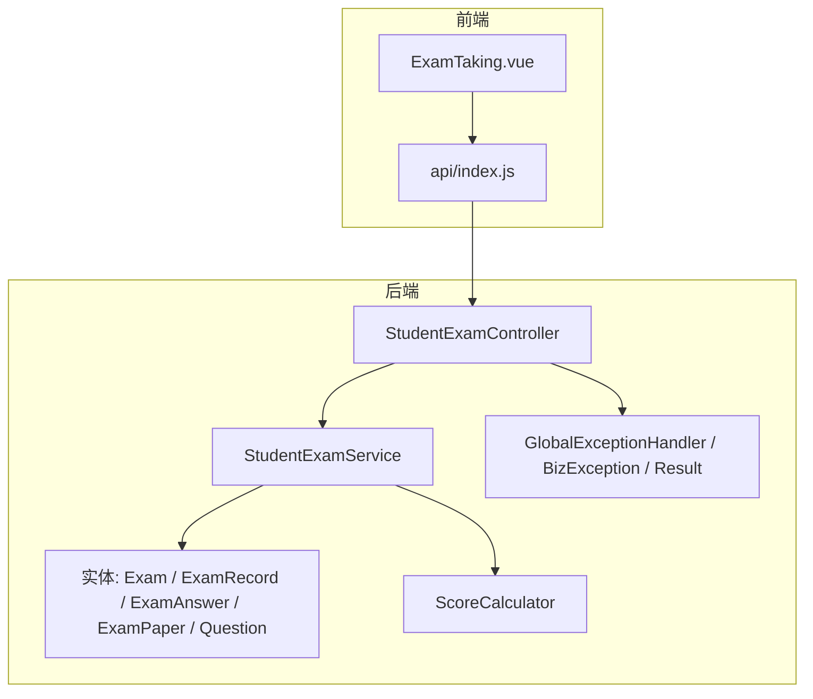
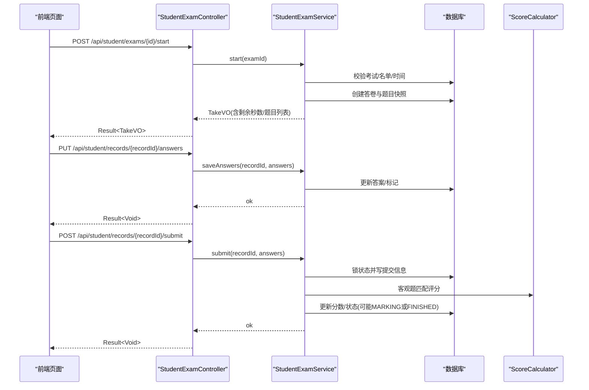
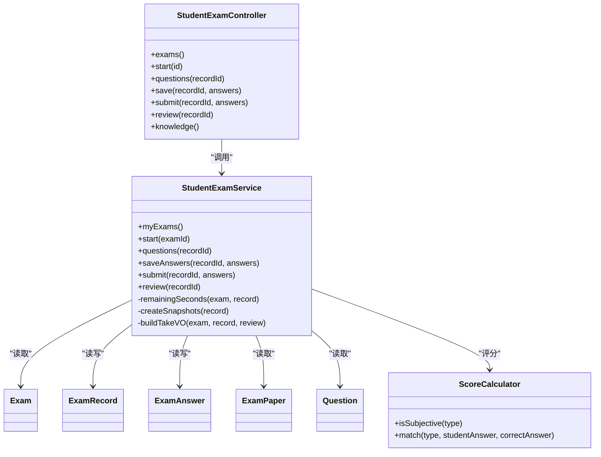
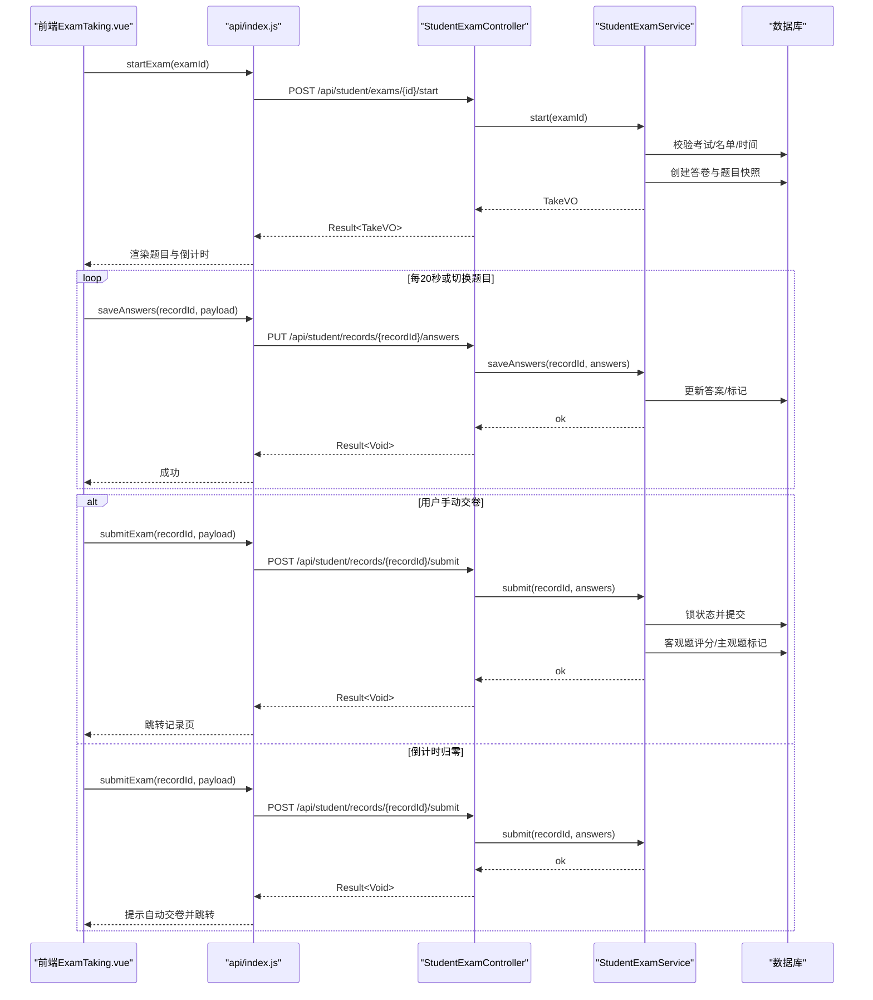

# 学生答题API

<cite>
**本文引用的文件**
- [StudentExamController.java](file://exam-server/src/main/java/com/exam/controller/StudentExamController.java)
- [StudentExamService.java](file://exam-server/src/main/java/com/exam/service/StudentExamService.java)
- [AnswerSaveRequest.java](file://exam-server/src/main/java/com/exam/dto/AnswerSaveRequest.java)
- [ScoreCalculator.java](file://exam-server/src/main/java/com/exam/util/ScoreCalculator.java)
- [BizException.java](file://exam-server/src/main/java/com/exam/common/BizException.java)
- [GlobalExceptionHandler.java](file://exam-server/src/main/java/com/exam/common/GlobalExceptionHandler.java)
- [Result.java](file://exam-server/src/main/java/com/exam/common/Result.java)
- [Exam.java](file://exam-server/src/main/java/com/exam/entity/Exam.java)
- [ExamRecord.java](file://exam-server/src/main/java/com/exam/entity/ExamRecord.java)
- [ExamAnswer.java](file://exam-server/src/main/java/com/exam/entity/ExamAnswer.java)
- [ExamPaper.java](file://exam-server/src/main/java/com/exam/entity/ExamPaper.java)
- [Question.java](file://exam-server/src/main/java/com/exam/entity/Question.java)
- [ExamTaking.vue](file://exam-web/src/views/exam/ExamTaking.vue)
- [index.js](file://exam-web/src/api/index.js)
</cite>

## 目录
1. [简介](#简介)
2. [项目结构](#项目结构)
3. [核心组件](#核心组件)
4. [架构总览](#架构总览)
5. [详细接口说明](#详细接口说明)
6. [依赖关系分析](#依赖关系分析)
7. [性能与并发特性](#性能与并发特性)
8. [故障排查指南](#故障排查指南)
9. [结论](#结论)
10. [附录：完整答题流程示例](#附录完整答题流程示例)

## 简介
本模块面向学生端在线答题，提供考试信息获取、题目拉取、答案自动保存、交卷提交、阅卷结果查看、知识点掌握度查询等能力。系统以服务端时间为准进行倒计时控制，支持断点续传（基于答卷快照）和定时自动保存；客观题自动评分，主观题进入待阅卷流程；具备超时自动交卷、重复交卷防护、权限校验等容错机制。

## 项目结构
学生答题相关代码主要位于后端 exam-server 的 controller、service、dto、entity、util 以及前端 exam-web 的视图与 API 封装中。整体采用“控制器暴露HTTP接口 → 服务层编排业务逻辑 → 数据访问层持久化”的分层架构。

图表来源
- [StudentExamController.java:1-73](file://exam-server/src/main/java/com/exam/controller/StudentExamController.java#L1-L73)
- [StudentExamService.java:1-458](file://exam-server/src/main/java/com/exam/service/StudentExamService.java#L1-L458)
- [ExamTaking.vue:1-141](file://exam-web/src/views/exam/ExamTaking.vue#L1-L141)
- [index.js:75-81](file://exam-web/src/api/index.js#L75-L81)

章节来源
- [StudentExamController.java:1-73](file://exam-server/src/main/java/com/exam/controller/StudentExamController.java#L1-L73)
- [StudentExamService.java:1-458](file://exam-server/src/main/java/com/exam/service/StudentExamService.java#L1-L458)

## 核心组件
- 控制器层：统一暴露学生端答题相关REST接口，负责参数接收与响应包装。
- 服务层：实现开始考试、拉题、保存答案、交卷评分、阅卷查看、剩余时间计算等核心流程。
- 数据模型：考试、试卷、答卷、作答明细、题目等实体，支撑快照与状态流转。
- 工具类：客观题评分算法，处理单选、多选、判断、填空匹配规则。
- 异常与返回：统一异常捕获与Result封装，保证前后端交互一致性。

章节来源
- [StudentExamController.java:1-73](file://exam-server/src/main/java/com/exam/controller/StudentExamController.java#L1-L73)
- [StudentExamService.java:1-458](file://exam-server/src/main/java/com/exam/service/StudentExamService.java#L1-L458)
- [ScoreCalculator.java:1-55](file://exam-server/src/main/java/com/exam/util/ScoreCalculator.java#L1-L55)
- [Result.java:1-38](file://exam-server/src/main/java/com/exam/common/Result.java#L1-L38)
- [BizException.java:1-22](file://exam-server/src/main/java/com/exam/common/BizException.java#L1-L22)

## 架构总览
学生端答题流程从前端发起请求，经控制器路由到服务层，服务层通过Mapper访问数据库完成状态校验、快照写入、答案保存、评分与结果更新，最终返回统一Result。

图表来源
- [StudentExamController.java:35-59](file://exam-server/src/main/java/com/exam/controller/StudentExamController.java#L35-L59)
- [StudentExamService.java:94-194](file://exam-server/src/main/java/com/exam/service/StudentExamService.java#L94-L194)
- [ScoreCalculator.java:20-44](file://exam-server/src/main/java/com/exam/util/ScoreCalculator.java#L20-L44)

## 详细接口说明

### 获取考试列表
- 路径与方法：GET /api/student/exams
- 功能：返回当前学生可参加的考试列表，包含考试基本信息、运行状态、答卷状态、剩余时间、总分与是否及格（若已公布）。
- 关键逻辑：
  - 仅返回非草稿状态的考试。
  - 若存在答卷且成绩可见，则附带总分与是否及格。
  - 剩余时间由“开始时间+时长”与“截止时间”的较小值计算。
- 返回：统一Result<List<StudentExamVO>>。

章节来源
- [StudentExamController.java:29-33](file://exam-server/src/main/java/com/exam/controller/StudentExamController.java#L29-L33)
- [StudentExamService.java:55-92](file://exam-server/src/main/java/com/exam/service/StudentExamService.java#L55-L92)
- [Exam.java:10-27](file://exam-server/src/main/java/com/exam/entity/Exam.java#L10-L27)
- [ExamRecord.java:11-28](file://exam-server/src/main/java/com/exam/entity/ExamRecord.java#L11-L28)

### 开始考试
- 路径与方法：POST /api/student/exams/{id}/start
- 功能：校验考试有效性、学生是否在名单、时间窗口；创建答卷与题目快照；返回题目列表（不含正确答案）与剩余秒数。
- 状态校验：
  - 考试不存在或草稿：失败。
  - 不在考试名单：失败。
  - 未到开始时间：失败。
  - 已结束或状态为结束：失败。
  - 已交卷：失败。
- 时间控制：
  - 剩余秒数= min(开始时间+时长, 截止时间) - 当前时间。
  - 若剩余秒数<=0，触发自动交卷并提示。
- 返回：统一Result<TakeVO>，包含recordId、examName、remainingSeconds、serverTime、durationMinutes、questions。

章节来源
- [StudentExamController.java:35-39](file://exam-server/src/main/java/com/exam/controller/StudentExamController.java#L35-L39)
- [StudentExamService.java:94-140](file://exam-server/src/main/java/com/exam/service/StudentExamService.java#L94-L140)
- [Exam.java:10-27](file://exam-server/src/main/java/com/exam/entity/Exam.java#L10-L27)
- [ExamRecord.java:11-28](file://exam-server/src/main/java/com/exam/entity/ExamRecord.java#L11-L28)

### 拉取题目列表
- 路径与方法：GET /api/student/records/{recordId}/questions
- 功能：根据答卷ID拉取题目（不含正确答案与解析），用于继续答题或阅卷查看。
- 行为差异：
  - 若答卷状态不是“答题中”，则以“阅卷模式”返回，可能显示选项是否正确（取决于考试配置）。
- 返回：统一Result<TakeVO>。

章节来源
- [StudentExamController.java:41-45](file://exam-server/src/main/java/com/exam/controller/StudentExamController.java#L41-L45)
- [StudentExamService.java:142-147](file://exam-server/src/main/java/com/exam/service/StudentExamService.java#L142-L147)

### 保存答案（断点续传与自动保存）
- 路径与方法：PUT /api/student/records/{recordId}/answers
- 功能：批量保存答案与标记；支持断点续传（基于答卷快照，题库变更不影响已考记录）。
- 自动保存机制：
  - 前端每20秒调用一次保存接口，切题时也会触发保存。
  - 若答卷状态不是“答题中”或已超时，将拒绝修改或触发自动交卷。
- 幂等性：按questionId覆盖更新对应答案行，支持多次保存。
- 返回：统一Result<Void>。

章节来源
- [StudentExamController.java:47-52](file://exam-server/src/main/java/com/exam/controller/StudentExamController.java#L47-L52)
- [StudentExamService.java:149-178](file://exam-server/src/main/java/com/exam/service/StudentExamService.java#L149-L178)
- [AnswerSaveRequest.java:5-11](file://exam-server/src/main/java/com/exam/dto/AnswerSaveRequest.java#L5-L11)
- [ExamTaking.vue:67-85](file://exam-web/src/views/exam/ExamTaking.vue#L67-L85)

### 交卷提交（完整性校验与限制）
- 路径与方法：POST /api/student/records/{recordId}/submit
- 功能：提交答卷；客观题立即评分；若存在主观题则进入“待阅卷”。
- 提交限制：
  - 不允许重复交卷。
  - 开考后一定分钟内禁止交卷（allowSubmitMinutes）。
  - 若携带答案，会先静默保存再提交。
- 评分流程：
  - 客观题使用ScoreCalculator匹配规则判定对错并计分。
  - 主观题不计分，状态置为“待阅卷”。
  - 若无主观题，直接完成答卷并计算总分与是否及格。
- 返回：统一Result<Void>。

章节来源
- [StudentExamController.java:54-59](file://exam-server/src/main/java/com/exam/controller/StudentExamController.java#L54-L59)
- [StudentExamService.java:180-298](file://exam-server/src/main/java/com/exam/service/StudentExamService.java#L180-L298)
- [ScoreCalculator.java:20-44](file://exam-server/src/main/java/com/exam/util/ScoreCalculator.java#L20-L44)
- [Exam.java:10-27](file://exam-server/src/main/java/com/exam/entity/Exam.java#L10-L27)

### 阅卷查看
- 路径与方法：GET /api/student/records/{recordId}/review
- 功能：查看作答详情、得分、评语；是否显示标准答案与解析由考试answerVisible与结果是否公布决定。
- 返回：统一Result<ReviewVO>，包含答卷信息、题目列表、选项、正确与否、解析等。

章节来源
- [StudentExamController.java:61-65](file://exam-server/src/main/java/com/exam/controller/StudentExamController.java#L61-L65)
- [StudentExamService.java:196-239](file://exam-server/src/main/java/com/exam/service/StudentExamService.java#L196-L239)

### 知识点掌握度
- 路径与方法：GET /api/student/knowledge-stats
- 功能：返回当前学生各知识点的掌握情况（阅卷完成后有数据）。
- 返回：统一Result<List<KnowledgeRow>>。

章节来源
- [StudentExamController.java:67-71](file://exam-server/src/main/java/com/exam/controller/StudentExamController.java#L67-L71)

## 依赖关系分析
- 控制器依赖服务层，服务层依赖多个Mapper与工具类。
- 评分依赖ScoreCalculator，统一处理客观题匹配。
- 异常统一由GlobalExceptionHandler捕获并转换为Result。
- 前端通过api/index.js封装调用后端接口，ExamTaking.vue实现倒计时与自动保存。

图表来源
- [StudentExamController.java:1-73](file://exam-server/src/main/java/com/exam/controller/StudentExamController.java#L1-L73)
- [StudentExamService.java:1-458](file://exam-server/src/main/java/com/exam/service/StudentExamService.java#L1-L458)
- [ScoreCalculator.java:1-55](file://exam-server/src/main/java/com/exam/util/ScoreCalculator.java#L1-L55)
- [Exam.java:10-27](file://exam-server/src/main/java/com/exam/entity/Exam.java#L10-L27)
- [ExamRecord.java:11-28](file://exam-server/src/main/java/com/exam/entity/ExamRecord.java#L11-L28)
- [ExamAnswer.java:11-31](file://exam-server/src/main/java/com/exam/entity/ExamAnswer.java#L11-L31)
- [ExamPaper.java:11-25](file://exam-server/src/main/java/com/exam/entity/ExamPaper.java#L11-L25)
- [Question.java:11-29](file://exam-server/src/main/java/com/exam/entity/Question.java#L11-L29)

## 性能与并发特性
- 自动保存：前端每20秒批量提交所有题目答案，减少网络开销；服务端按questionId覆盖更新，具备幂等性。
- 快照机制：开始考试时生成题目与正确答案快照，避免题库变更影响历史答卷。
- 并发安全：交卷时使用状态字段原子更新防止重复提交；超时自动交卷在服务端侧保障。
- 评分效率：客观题匹配在内存中进行，复杂度与题目数量线性相关。

[本节为通用性能讨论，不直接分析具体文件]

## 故障排查指南
- 常见业务异常：
  - 考试不存在/草稿：检查考试状态与ID。
  - 不在考试名单：确认学生是否被加入本场考试。
  - 考试尚未开始/已结束：核对考试时间与当前时间。
  - 已交卷/请勿重复交卷：检查答卷状态与提交次数。
  - 开考后N分钟不能交卷：等待允许提交时间。
- 全局异常处理：
  - BizException会被转换为Result并附带错误码与消息。
  - 参数校验失败返回“参数错误”及字段信息。
  - 认证/授权失败返回401/403。
- 前端建议：
  - 对Result.code!=0的情况弹出提示。
  - 超时或网络异常时重试保存与提交，确保数据一致性。
  - 倒计时归零时主动提交，并处理可能的自动交卷提示。

章节来源
- [GlobalExceptionHandler.java:17-61](file://exam-server/src/main/java/com/exam/common/GlobalExceptionHandler.java#L17-L61)
- [BizException.java:5-22](file://exam-server/src/main/java/com/exam/common/BizException.java#L5-L22)
- [Result.java:5-38](file://exam-server/src/main/java/com/exam/common/Result.java#L5-L38)

## 结论
学生答题模块通过清晰的分层设计与严格的业务校验，实现了安全的在线答题流程。服务端时间驱动的时间控制、快照机制与自动保存确保了答题过程的稳定性与可恢复性；客观题自动评分与主观题待阅卷流程兼顾了效率与灵活性。统一的异常与返回格式便于前后端协作与问题定位。

[本节为总结性内容，不直接分析具体文件]

## 附录：完整答题流程示例
以下序列图展示从开始考试到交卷的端到端流程，包括自动保存与超时处理。

图表来源
- [ExamTaking.vue:93-114](file://exam-web/src/views/exam/ExamTaking.vue#L93-L114)
- [index.js:75-81](file://exam-web/src/api/index.js#L75-L81)
- [StudentExamController.java:35-59](file://exam-server/src/main/java/com/exam/controller/StudentExamController.java#L35-L59)
- [StudentExamService.java:94-194](file://exam-server/src/main/java/com/exam/service/StudentExamService.java#L94-L194)