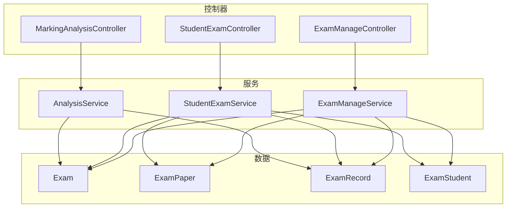
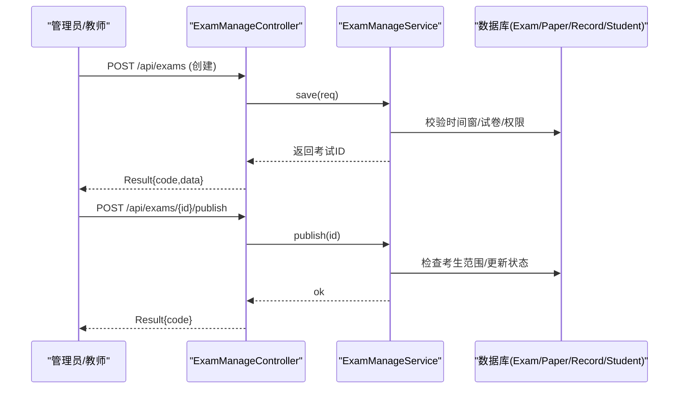
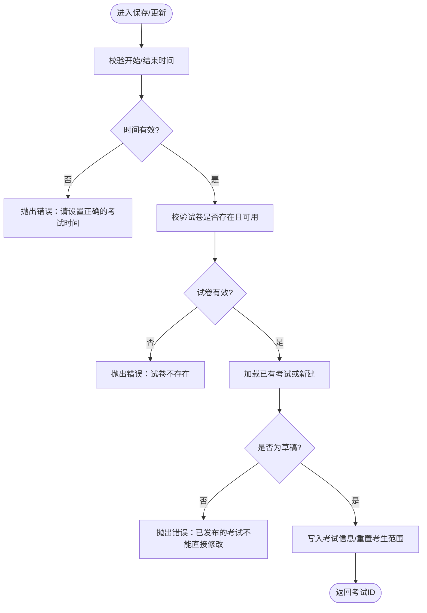
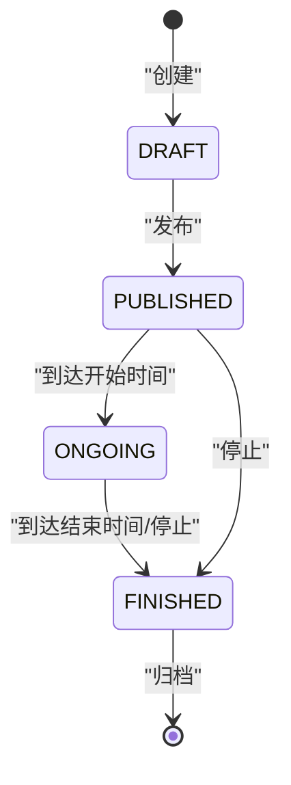
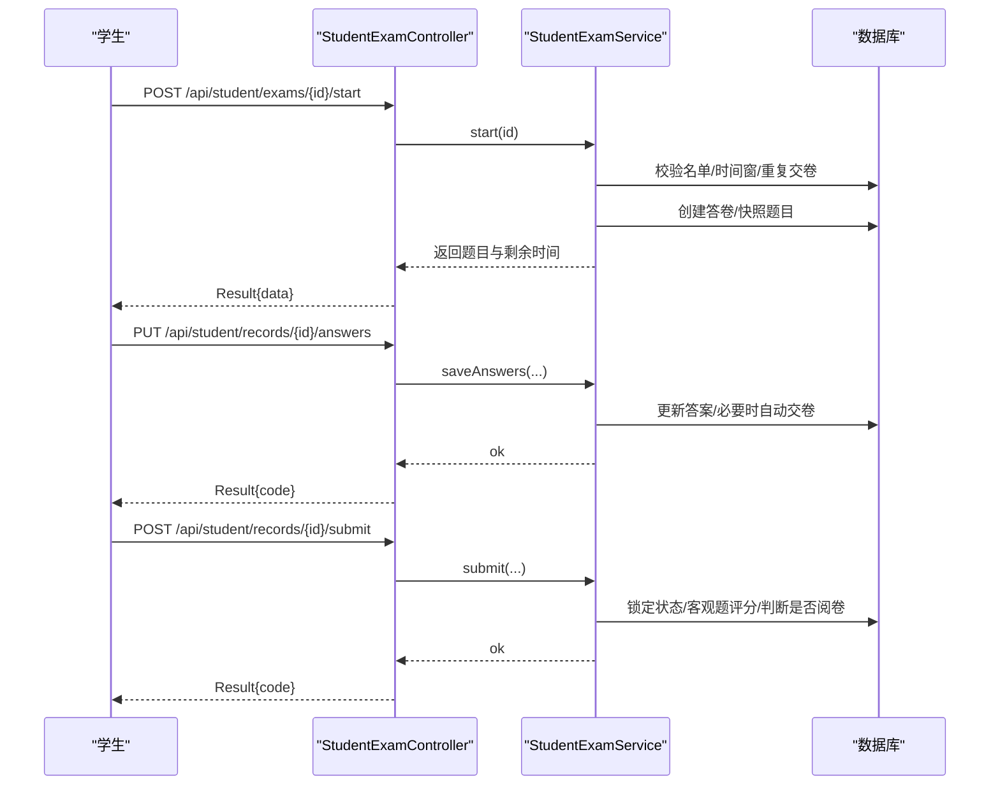
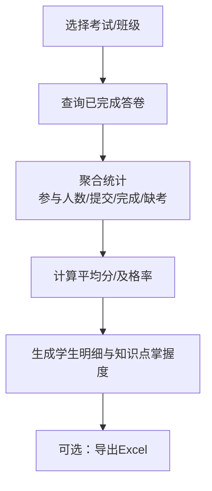
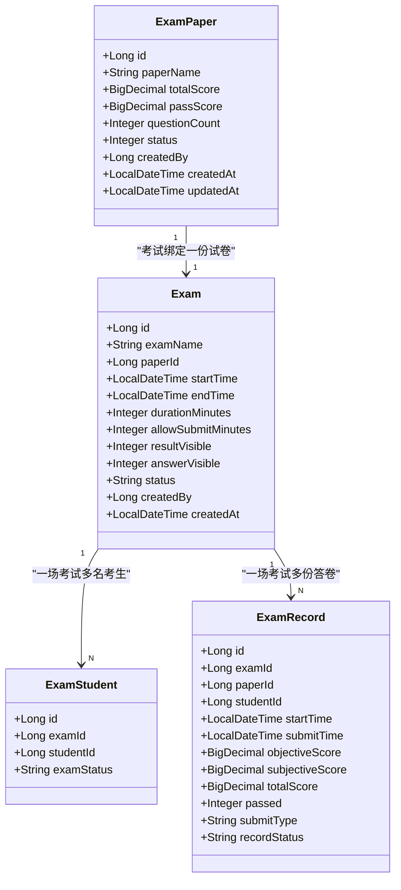

# 考试管理API

<cite>
**本文引用的文件**
- [ExamManageController.java](file://exam-server/src/main/java/com/exam/controller/ExamManageController.java)
- [ExamManageService.java](file://exam-server/src/main/java/com/exam/service/ExamManageService.java)
- [StudentExamController.java](file://exam-server/src/main/java/com/exam/controller/StudentExamController.java)
- [StudentExamService.java](file://exam-server/src/main/java/com/exam/service/StudentExamService.java)
- [MarkingAnalysisController.java](file://exam-server/src/main/java/com/exam/controller/MarkingAnalysisController.java)
- [AnalysisService.java](file://exam-server/src/main/java/com/exam/service/AnalysisService.java)
- [Exam.java](file://exam-server/src/main/java/com/exam/entity/Exam.java)
- [ExamPaper.java](file://exam-server/src/main/java/com/exam/entity/ExamPaper.java)
- [ExamRecord.java](file://exam-server/src/main/java/com/exam/entity/ExamRecord.java)
- [ExamStudent.java](file://exam-server/src/main/java/com/exam/entity/ExamStudent.java)
- [ExamSaveRequest.java](file://exam-server/src/main/java/com/exam/dto/ExamSaveRequest.java)
- [AnswerSaveRequest.java](file://exam-server/src/main/java/com/exam/dto/AnswerSaveRequest.java)
- [PageResult.java](file://exam-server/src/main/java/com/exam/common/PageResult.java)
- [Result.java](file://exam-server/src/main/java/com/exam/common/Result.java)
</cite>

## 目录
1. [简介](#简介)
2. [项目结构](#项目结构)
3. [核心组件](#核心组件)
4. [架构总览](#架构总览)
5. [详细组件分析](#详细组件分析)
6. [依赖关系分析](#依赖关系分析)
7. [性能考虑](#性能考虑)
8. [故障排查指南](#故障排查指南)
9. [结论](#结论)
10. [附录：接口清单与数据模型](#附录接口清单与数据模型)

## 简介
本文件面向“考试管理模块”的API文档，覆盖考试生命周期管理、时间窗与考生范围配置、发布与停止、状态流转与权限控制、详情查询（关联试卷、考生列表）、统计指标（参与人数、完成率、平均分等）、考试任务管理与批量操作、以及成绩与答题记录导出。文档同时给出关键流程的时序图与状态机图，便于快速理解系统行为。

## 项目结构
考试管理相关能力主要分布在以下层次：
- 控制器层：对外暴露REST API，如考试任务管理、学生端考试流程、阅卷与分析导出。
- 服务层：实现业务规则与事务处理，如保存/发布/停止考试、开始答题、交卷评分、统计分析。
- 实体与DTO：描述数据库表结构与请求/响应数据结构。
- 通用组件：统一返回体、分页结果等。

图表来源
- [ExamManageController.java:20-66](file://exam-server/src/main/java/com/exam/controller/ExamManageController.java#L20-L66)
- [StudentExamController.java:18-73](file://exam-server/src/main/java/com/exam/controller/StudentExamController.java#L18-L73)
- [MarkingAnalysisController.java:29-134](file://exam-server/src/main/java/com/exam/controller/MarkingAnalysisController.java#L29-L134)
- [ExamManageService.java:36-277](file://exam-server/src/main/java/com/exam/service/ExamManageService.java#L36-L277)
- [StudentExamService.java:38-458](file://exam-server/src/main/java/com/exam/service/StudentExamService.java#L38-L458)
- [AnalysisService.java:33-258](file://exam-server/src/main/java/com/exam/service/AnalysisService.java#L33-L258)

章节来源
- [ExamManageController.java:20-66](file://exam-server/src/main/java/com/exam/controller/ExamManageController.java#L20-L66)
- [StudentExamController.java:18-73](file://exam-server/src/main/java/com/exam/controller/StudentExamController.java#L18-L73)
- [MarkingAnalysisController.java:29-134](file://exam-server/src/main/java/com/exam/controller/MarkingAnalysisController.java#L29-L134)

## 核心组件
- 考试任务管理（教师/管理员）
  - 创建/编辑考试：支持设置考试时间窗、时长、是否允许提前交卷、结果与答案可见性、绑定试卷、指定考生范围。
  - 发布/停止：发布后按时间窗计算运行时状态；停止可提前结束考试。
  - 列表/详情：分页查询、关键字与状态过滤；详情包含关联试卷信息、考生ID列表、提交数量等。
- 学生端考试流程
  - 我的考试列表、开始答题、拉题（不含答案）、自动保存答案、交卷、查看答卷与解析（受考试配置控制）。
- 阅卷与分析
  - 待阅卷列表、阅卷打分、单场统计（参与人数、提交数、完成数、缺考、平均分、及格率、知识点掌握度）、成绩导出Excel。

章节来源
- [ExamManageService.java:48-134](file://exam-server/src/main/java/com/exam/service/ExamManageService.java#L48-L134)
- [StudentExamService.java:55-194](file://exam-server/src/main/java/com/exam/service/StudentExamService.java#L55-L194)
- [AnalysisService.java:46-97](file://exam-server/src/main/java/com/exam/service/AnalysisService.java#L46-L97)

## 架构总览
考试管理模块采用典型的三层架构：控制器接收HTTP请求，调用服务层执行业务逻辑，服务层通过Mapper访问持久化层（MyBatis-Plus），并组合多个实体完成业务闭环。统一返回体Result封装成功/失败信息，分页使用PageResult。

图表来源
- [ExamManageController.java:43-65](file://exam-server/src/main/java/com/exam/controller/ExamManageController.java#L43-L65)
- [ExamManageService.java:77-134](file://exam-server/src/main/java/com/exam/service/ExamManageService.java#L77-L134)

## 详细组件分析

### 考试任务管理（创建/编辑/查询/发布/停止）
- 创建/编辑
  - 路径：POST /api/exams、PUT /api/exams/{id}
  - 请求体：ExamSaveRequest（包含名称、试卷ID、开始/结束时间、时长、允许提前交卷分钟数、结果/答案可见性、考生ID列表）
  - 规则：
    - 必须设置正确的开始与结束时间且结束时间晚于开始时间。
    - 绑定的试卷必须存在且已启用。
    - 非草稿状态的考试不能直接修改，需先停止或复制新考试。
    - 编辑时清空并重建考生范围。
- 查询
  - 列表：GET /api/exams?page=...&size=...&keyword=...&status=...
  - 详情：GET /api/exams/{id}
  - 返回字段包含：考试基本信息、运行时状态、试卷名称/总分/及格分、考生数量、已提交数量、考生ID列表。
- 发布/停止
  - 发布：POST /api/exams/{id}/publish
    - 要求至少指定一名考生。
    - 成功后状态置为已发布。
  - 停止：POST /api/exams/{id}/stop
    - 将状态置为已结束，并记录当前时间为结束时间。
- 权限控制
  - 非管理员仅能查看自己创建的考试；发布/停止等操作由业务层校验。

图表来源
- [ExamManageService.java:77-113](file://exam-server/src/main/java/com/exam/service/ExamManageService.java#L77-L113)

章节来源
- [ExamManageController.java:30-65](file://exam-server/src/main/java/com/exam/controller/ExamManageController.java#L30-L65)
- [ExamManageService.java:48-134](file://exam-server/src/main/java/com/exam/service/ExamManageService.java#L48-L134)
- [ExamSaveRequest.java:8-21](file://exam-server/src/main/java/com/exam/dto/ExamSaveRequest.java#L8-L21)
- [Exam.java:10-27](file://exam-server/src/main/java/com/exam/entity/Exam.java#L10-L27)
- [ExamPaper.java:11-25](file://exam-server/src/main/java/com/exam/entity/ExamPaper.java#L11-L25)

### 考试状态机设计
- 状态定义
  - 存储状态：DRAFT（草稿）、PUBLISHED（已发布）、FINISHED（已结束）
  - 运行时状态：DRAFT、PUBLISHED（未开始）、ONGOING（进行中）、FINISHED（已结束）
- 转换规则
  - 创建默认DRAFT；发布后变为PUBLISHED。
  - 运行时状态根据当前时间与考试起止时间动态计算：
    - 当前时间在开始之前：PUBLISHED
    - 当前时间在开始与结束之间：ONGOING
    - 当前时间在结束之后或显式停止：FINISHED
  - 停止接口将存储状态置为FINISHED，并更新时间。

图表来源
- [ExamManageService.java:115-190](file://exam-server/src/main/java/com/exam/service/ExamManageService.java#L115-L190)

章节来源
- [ExamManageService.java:115-190](file://exam-server/src/main/java/com/exam/service/ExamManageService.java#L115-L190)

### 学生端考试流程（开始/答题/交卷/查看）
- 我的考试：GET /api/student/exams
- 开始考试：POST /api/student/exams/{id}/start
  - 校验是否在名单中、是否在时间窗内、是否已交卷；创建答卷并快照题目。
- 拉题：GET /api/student/records/{recordId}/questions
  - 不返回正确答案与解析；剩余时间以“开始时间+时长”与“考试截止时间”的较小值为准。
- 自动保存：PUT /api/student/records/{recordId}/answers
  - 支持保存答案与标记；若时间到则自动交卷。
- 交卷：POST /api/student/records/{recordId}/submit
  - 限制开考后一定分钟内不可交卷；客观题自动评分，有简答题进入阅卷。
- 查看答卷：GET /api/student/records/{recordId}/review
  - 是否显示标准答案与解析由考试配置的answerVisible与记录状态决定。

图表来源
- [StudentExamController.java:29-65](file://exam-server/src/main/java/com/exam/controller/StudentExamController.java#L29-L65)
- [StudentExamService.java:94-194](file://exam-server/src/main/java/com/exam/service/StudentExamService.java#L94-L194)

章节来源
- [StudentExamController.java:29-65](file://exam-server/src/main/java/com/exam/controller/StudentExamController.java#L29-L65)
- [StudentExamService.java:94-194](file://exam-server/src/main/java/com/exam/service/StudentExamService.java#L94-L194)
- [AnswerSaveRequest.java:5-11](file://exam-server/src/main/java/com/exam/dto/AnswerSaveRequest.java#L5-L11)

### 考试详情与关联信息
- 详情接口：GET /api/exams/{id}
- 返回内容
  - 考试基本信息（名称、时间窗、时长、可见性等）
  - 运行时状态（基于当前时间计算）
  - 关联试卷信息（名称、总分、及格分）
  - 考生数量与已提交数量
  - 考生ID列表（用于后续批量操作）

章节来源
- [ExamManageController.java:38-41](file://exam-server/src/main/java/com/exam/controller/ExamManageController.java#L38-L41)
- [ExamManageService.java:65-75](file://exam-server/src/main/java/com/exam/service/ExamManageService.java#L65-L75)
- [Exam.java:10-27](file://exam-server/src/main/java/com/exam/entity/Exam.java#L10-L27)
- [ExamPaper.java:11-25](file://exam-server/src/main/java/com/exam/entity/ExamPaper.java#L11-L25)
- [ExamStudent.java:8-17](file://exam-server/src/main/java/com/exam/entity/ExamStudent.java#L8-L17)

### 考试统计与导出
- 单场统计：GET /api/exams/{id}/statistics
  - 返回：考试名称、分配人数、提交数、完成数、阅卷中、缺考、平均分、及格率、学生明细、知识点掌握度。
- 知识点掌握度：GET /api/exams/{id}/knowledge-stats
- 成绩列表：GET /api/scores?examId=...&className=...
- 成绩导出：GET /api/scores/export?examId=...&className=...
  - 输出Excel，包含学号、姓名、班级、客观题、主观题、总分、是否及格。

图表来源
- [AnalysisService.java:46-97](file://exam-server/src/main/java/com/exam/service/AnalysisService.java#L46-L97)
- [MarkingAnalysisController.java:55-90](file://exam-server/src/main/java/com/exam/controller/MarkingAnalysisController.java#L55-L90)

章节来源
- [MarkingAnalysisController.java:55-90](file://exam-server/src/main/java/com/exam/controller/MarkingAnalysisController.java#L55-L90)
- [AnalysisService.java:46-97](file://exam-server/src/main/java/com/exam/service/AnalysisService.java#L46-L97)

### 考试任务管理与批量操作
- 批量指定考生：在创建/编辑考试时通过studentIds批量添加；编辑时会清空并重建该场考试的考生范围。
- 时间窗口控制：
  - 开始/结束时间决定可答题时段。
  - 时长durationMinutes与allowSubmitMinutes共同控制答题时长与最早交卷时间。
  - 运行时状态根据当前时间动态计算，确保前端展示一致。

章节来源
- [ExamManageService.java:77-113](file://exam-server/src/main/java/com/exam/service/ExamManageService.java#L77-L113)
- [ExamManageService.java:175-190](file://exam-server/src/main/java/com/exam/service/ExamManageService.java#L175-L190)
- [StudentExamService.java:377-382](file://exam-server/src/main/java/com/exam/service/StudentExamService.java#L377-L382)

## 依赖关系分析
- 控制器与服务耦合清晰：每个控制器只负责路由与参数绑定，具体业务在对应Service中实现。
- 服务间职责分离：
  - ExamManageService：考试任务生命周期与统计概览。
  - StudentExamService：学生端答题全流程。
  - AnalysisService：单场统计、知识点掌握度、成绩列表与导出。
- 数据实体关系
  - 一场考试绑定一份试卷；一次考试有多名考生；每位考生有一次答卷；答卷包含多道作答记录。

图表来源
- [Exam.java:10-27](file://exam-server/src/main/java/com/exam/entity/Exam.java#L10-L27)
- [ExamPaper.java:11-25](file://exam-server/src/main/java/com/exam/entity/ExamPaper.java#L11-L25)
- [ExamStudent.java:8-17](file://exam-server/src/main/java/com/exam/entity/ExamStudent.java#L8-L17)
- [ExamRecord.java:11-28](file://exam-server/src/main/java/com/exam/entity/ExamRecord.java#L11-L28)

章节来源
- [ExamManageService.java:36-47](file://exam-server/src/main/java/com/exam/service/ExamManageService.java#L36-L47)
- [StudentExamService.java:45-53](file://exam-server/src/main/java/com/exam/service/StudentExamService.java#L45-L53)
- [AnalysisService.java:37-44](file://exam-server/src/main/java/com/exam/service/AnalysisService.java#L37-L44)

## 性能考虑
- 分页与过滤：列表查询使用分页与关键字/状态过滤，减少不必要的数据传输。
- 快照机制：开始答题时快照题目，避免题目变更影响已开始的考试。
- 自动交卷：在保存答案与开始答题时检测剩余时间，超时自动交卷，降低并发风险。
- 统计聚合：单场统计按考试维度聚合，避免全表扫描；必要时可按考试ID过滤。

[本节提供通用指导，无需特定文件引用]

## 故障排查指南
- 常见错误与定位
  - “请设置正确的考试时间”：检查请求中的开始/结束时间是否合法。
  - “试卷不存在”：确认绑定的试卷存在且状态可用。
  - “已发布的考试不能直接修改”：需先停止或复制新考试后再编辑。
  - “请先指定考生”：发布前必须为该场考试添加至少一名考生。
  - “你不在本场考试名单中”：学生端开始答题前需被加入考生范围。
  - “考试尚未开始/已结束”：检查当前时间与考试起止时间。
  - “已交卷/请勿重复交卷”：检查答卷状态，避免重复提交。
  - “成绩尚未公布”：查看考试resultVisible与答卷状态。
- 日志与审计
  - 发布/停止等操作会记录操作日志，便于追溯。

章节来源
- [ExamManageService.java:77-134](file://exam-server/src/main/java/com/exam/service/ExamManageService.java#L77-L134)
- [StudentExamService.java:94-194](file://exam-server/src/main/java/com/exam/service/StudentExamService.java#L94-L194)

## 结论
本模块围绕“考试任务”构建了完整的生命周期管理能力，涵盖创建、编辑、查询、发布、停止、详情、统计与导出。通过严格的状态机与时间窗控制，结合权限校验与操作日志，保障了考试过程的公平性与可追溯性。学生端流程简洁安全，支持自动保存与到时交卷，并提供答卷回顾与解析查看。统计分析为教学决策提供了量化依据。

[本节总结性内容，无需特定文件引用]

## 附录：接口清单与数据模型

### REST接口清单（考试管理相关）
- 工作台统计
  - GET /api/dashboard
- 考试任务
  - GET /api/exams?page=...&size=...&keyword=...&status=...
  - GET /api/exams/{id}
  - POST /api/exams
  - PUT /api/exams/{id}
  - POST /api/exams/{id}/publish
  - POST /api/exams/{id}/stop
- 学生端考试
  - GET /api/student/exams
  - POST /api/student/exams/{id}/start
  - GET /api/student/records/{recordId}/questions
  - PUT /api/student/records/{recordId}/answers
  - POST /api/student/records/{recordId}/submit
  - GET /api/student/records/{recordId}/review
  - GET /api/student/knowledge-stats
- 阅卷与分析
  - GET /api/marking/records?examId=...&status=...
  - GET /api/marking/records/{recordId}
  - POST /api/marking/answers/{answerId}
  - GET /api/exams/{id}/statistics
  - GET /api/exams/{id}/knowledge-stats
  - GET /api/analysis/students/{studentId}/knowledge
  - GET /api/analysis/classes/{className}/knowledge
  - GET /api/scores?examId=...&className=...
  - GET /api/scores/export?examId=...&className=...

章节来源
- [ExamManageController.java:25-65](file://exam-server/src/main/java/com/exam/controller/ExamManageController.java#L25-L65)
- [StudentExamController.java:29-73](file://exam-server/src/main/java/com/exam/controller/StudentExamController.java#L29-L73)
- [MarkingAnalysisController.java:38-90](file://exam-server/src/main/java/com/exam/controller/MarkingAnalysisController.java#L38-L90)

### 请求/响应数据模型（节选）
- 统一返回体
  - code：状态码，0表示成功
  - message：提示信息
  - data：业务数据
- 分页结果
  - total：总条数
  - records：当前页数据列表
- 考试保存请求
  - id：考试ID（编辑时必填）
  - examName：考试名称
  - paperId：试卷ID
  - startTime：开始时间
  - endTime：结束时间
  - durationMinutes：时长（分钟）
  - allowSubmitMinutes：开考后多少分钟内不允许交卷
  - resultVisible：是否公布成绩
  - answerVisible：是否公布答案
  - studentIds：考生ID列表
- 答案保存请求
  - questionId：题目ID
  - studentAnswer：学生答案
  - flagged：是否标记

章节来源
- [Result.java:9-37](file://exam-server/src/main/java/com/exam/common/Result.java#L9-L37)
- [PageResult.java:7-19](file://exam-server/src/main/java/com/exam/common/PageResult.java#L7-L19)
- [ExamSaveRequest.java:8-21](file://exam-server/src/main/java/com/exam/dto/ExamSaveRequest.java#L8-L21)
- [AnswerSaveRequest.java:5-11](file://exam-server/src/main/java/com/exam/dto/AnswerSaveRequest.java#L5-L11)