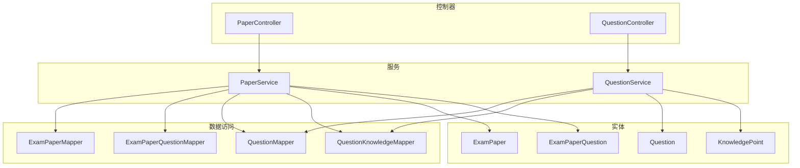
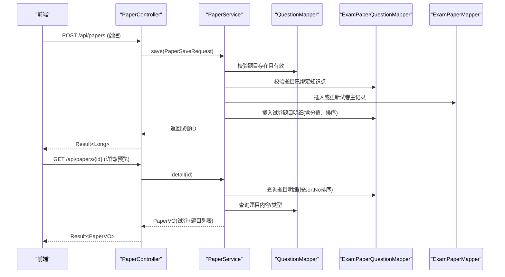
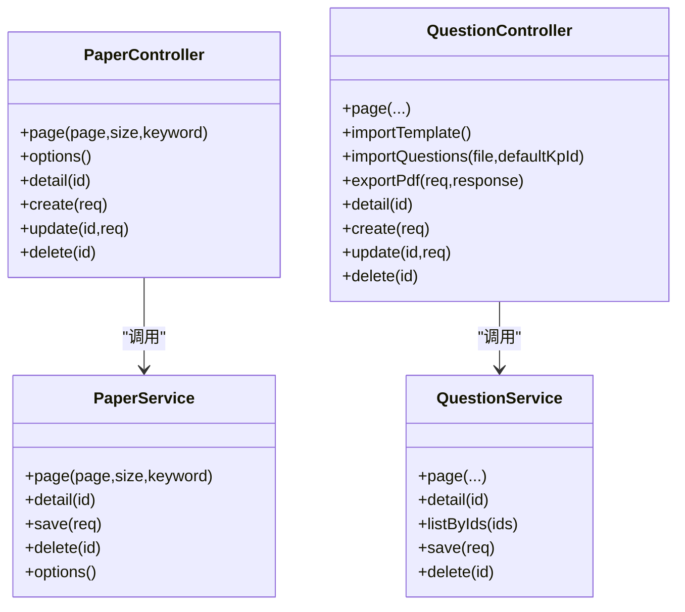

# 试卷管理API

<cite>
**本文引用的文件**
- [PaperController.java](file://exam-server/src/main/java/com/exam/controller/PaperController.java)
- [PaperService.java](file://exam-server/src/main/java/com/exam/service/PaperService.java)
- [PaperSaveRequest.java](file://exam-server/src/main/java/com/exam/dto/PaperSaveRequest.java)
- [ExamPaper.java](file://exam-server/src/main/java/com/exam/entity/ExamPaper.java)
- [ExamPaperQuestion.java](file://exam-server/src/main/java/com/exam/entity/ExamPaperQuestion.java)
- [QuestionController.java](file://exam-server/src/main/java/com/exam/controller/QuestionController.java)
- [QuestionService.java](file://exam-server/src/main/java/com/exam/service/QuestionService.java)
- [Question.java](file://exam-server/src/main/java/com/exam/entity/Question.java)
- [KnowledgePoint.java](file://exam-server/src/main/java/com/exam/entity/KnowledgePoint.java)
- [QuestionTypes.java](file://exam-server/src/main/java/com/exam/util/QuestionTypes.java)
- [schema.sql](file://exam-server/src/main/resources/db/schema.sql)
- [BizException.java](file://exam-server/src/main/java/com/exam/common/BizException.java)
- [Result.java](file://exam-server/src/main/java/com/exam/common/Result.java)
</cite>

## 目录
1. [简介](#简介)
2. [项目结构](#项目结构)
3. [核心组件](#核心组件)
4. [架构总览](#架构总览)
5. [详细接口说明](#详细接口说明)
6. [依赖关系分析](#依赖关系分析)
7. [性能与约束](#性能与约束)
8. [故障排查指南](#故障排查指南)
9. [结论](#结论)
10. [附录：数据模型与校验规则](#附录数据模型与校验规则)

## 简介
本模块提供“试卷管理”的完整能力，包括：
- 手动组卷：从题库中选择题目加入试卷，支持题型过滤、知识点关联、难度等筛选条件。
- 随机抽题：基于知识点覆盖比例、难度分布、题目数量控制进行自动抽题（当前代码未实现该接口，本节给出设计建议）。
- 试卷生命周期：创建、编辑、删除、预览。
- 版本管理与历史版本：当前代码未实现，本节给出演进建议。
- 统计信息：题目数量、总分、平均难度等指标（当前代码未直接提供，本节给出计算方式与建议）。
- 参数验证与业务约束：统一通过服务层校验并抛出业务异常，由全局异常处理器转换为统一返回格式。

## 项目结构
后端采用典型的 Controller -> Service -> Mapper 分层结构，围绕试卷与题目两大领域展开：
- 控制器层：暴露 REST 接口，负责参数接收与结果封装。
- 服务层：实现组卷、查询、保存等业务逻辑，包含校验与事务控制。
- 数据访问层：MyBatis-Plus Mapper，映射数据库表。
- 实体与DTO：描述持久化对象与请求体结构。
- 工具与通用：题型常量、统一返回、业务异常等。

图表来源
- [PaperController.java:21-62](file://exam-server/src/main/java/com/exam/controller/PaperController.java#L21-L62)
- [PaperService.java:30-160](file://exam-server/src/main/java/com/exam/service/PaperService.java#L30-L160)
- [QuestionController.java:31-118](file://exam-server/src/main/java/com/exam/controller/QuestionController.java#L31-L118)
- [QuestionService.java:33-200](file://exam-server/src/main/java/com/exam/service/QuestionService.java#L33-L200)
- [ExamPaper.java:11-25](file://exam-server/src/main/java/com/exam/entity/ExamPaper.java#L11-L25)
- [ExamPaperQuestion.java:10-20](file://exam-server/src/main/java/com/exam/entity/ExamPaperQuestion.java#L10-L20)
- [Question.java:11-29](file://exam-server/src/main/java/com/exam/entity/Question.java#L11-L29)
- [KnowledgePoint.java:10-24](file://exam-server/src/main/java/com/exam/entity/KnowledgePoint.java#L10-L24)

章节来源
- [PaperController.java:21-62](file://exam-server/src/main/java/com/exam/controller/PaperController.java#L21-L62)
- [PaperService.java:30-160](file://exam-server/src/main/java/com/exam/service/PaperService.java#L30-L160)
- [QuestionController.java:31-118](file://exam-server/src/main/java/com/exam/controller/QuestionController.java#L31-L118)
- [QuestionService.java:33-200](file://exam-server/src/main/java/com/exam/service/QuestionService.java#L33-L200)

## 核心组件
- 试卷控制器 PaperController：提供试卷分页、选项列表、详情、创建、更新、删除接口。
- 试卷服务 PaperService：实现组卷保存、详情组装、分页查询、软删除、选项列表；包含强校验（至少一题、题目必须绑定知识点、题目存在且有效）。
- 题库控制器 QuestionController：提供题目分页、导入导出、增删改查；支持按题型、分类、知识点、关键词筛选。
- 题库服务 QuestionService：实现题目保存、详情、分页、批量导出；选择题正确答案由选项汇总。
- 题型工具 QuestionTypes：定义题型常量、默认分值、是否主观题、是否选择题等判断。
- 数据模型 ExamPaper、ExamPaperQuestion、Question、KnowledgePoint：对应数据库表结构与字段。

章节来源
- [PaperController.java:21-62](file://exam-server/src/main/java/com/exam/controller/PaperController.java#L21-L62)
- [PaperService.java:30-160](file://exam-server/src/main/java/com/exam/service/PaperService.java#L30-L160)
- [QuestionController.java:31-118](file://exam-server/src/main/java/com/exam/controller/QuestionController.java#L31-L118)
- [QuestionService.java:33-200](file://exam-server/src/main/java/com/exam/service/QuestionService.java#L33-L200)
- [QuestionTypes.java:1-123](file://exam-server/src/main/java/com/exam/util/QuestionTypes.java#L1-L123)
- [ExamPaper.java:11-25](file://exam-server/src/main/java/com/exam/entity/ExamPaper.java#L11-L25)
- [ExamPaperQuestion.java:10-20](file://exam-server/src/main/java/com/exam/entity/ExamPaperQuestion.java#L10-L20)
- [Question.java:11-29](file://exam-server/src/main/java/com/exam/entity/Question.java#L11-L29)
- [KnowledgePoint.java:10-24](file://exam-server/src/main/java/com/exam/entity/KnowledgePoint.java#L10-L24)

## 架构总览
试卷管理的核心流程如下：
- 手动组卷：前端选择题目并提交组卷请求，服务端校验题目有效性及知识点绑定，计算总分与及格分，写入试卷主表与题目明细表。
- 试卷预览：根据试卷ID查询主表与题目明细，并加载题目内容、类型、分值、排序号。
- 题库筛选：支持按题型、分类、知识点、关键词分页查询，为手动组卷提供候选题目集。

图表来源
- [PaperController.java:40-55](file://exam-server/src/main/java/com/exam/controller/PaperController.java#L40-L55)
- [PaperService.java:52-127](file://exam-server/src/main/java/com/exam/service/PaperService.java#L52-L127)
- [ExamPaper.java:11-25](file://exam-server/src/main/java/com/exam/entity/ExamPaper.java#L11-L25)
- [ExamPaperQuestion.java:10-20](file://exam-server/src/main/java/com/exam/entity/ExamPaperQuestion.java#L10-L20)
- [Question.java:11-29](file://exam-server/src/main/java/com/exam/entity/Question.java#L11-L29)

## 详细接口说明

### 1. 手动组卷接口
- 接口路径：POST /api/papers
- 功能：创建新试卷，将选中的题目加入试卷，设置每题分值与顺序。
- 请求体：PaperSaveRequest
  - id：可选，为空表示新建；更新时由控制器注入。
  - paperName：必填，试卷名称。
  - passScore：可选，及格分；未传则默认为总分的60%。
  - questions：必填数组，每项包含：
    - questionId：必填，题目ID。
    - questionScore：可选，本题分值；未传按0处理。
    - sortNo：可选，排序号；未传按插入顺序自增。
- 响应：统一包装 Result<Long>，返回试卷ID。
- 业务约束与校验：
  - 至少包含一道题，否则抛业务异常。
  - 每道题必须已绑定至少一个知识点，否则抛业务异常。
  - 题目必须存在且状态有效（未删除），否则抛业务异常。
  - 总分 = 所有题目分值之和；及格分默认=总分*0.6。
  - 更新时先清空旧题目明细再插入新明细。
- 权限控制：非管理员仅能操作自己创建的试卷（分页与选项列表可见范围受控）。

章节来源
- [PaperController.java:45-49](file://exam-server/src/main/java/com/exam/controller/PaperController.java#L45-L49)
- [PaperService.java:79-127](file://exam-server/src/main/java/com/exam/service/PaperService.java#L79-L127)
- [PaperSaveRequest.java:8-22](file://exam-server/src/main/java/com/exam/dto/PaperSaveRequest.java#L8-L22)
- [ExamPaper.java:11-25](file://exam-server/src/main/java/com/exam/entity/ExamPaper.java#L11-L25)
- [ExamPaperQuestion.java:10-20](file://exam-server/src/main/java/com/exam/entity/ExamPaperQuestion.java#L10-L20)

### 2. 题库筛选（用于手动组卷）
- 接口路径：GET /api/questions
- 功能：分页查询题库，支持题型、分类、知识点、关键词过滤。
- 查询参数：
  - page：页码，默认1。
  - size：每页条数，默认10。
  - type：题型过滤（SINGLE/MULTIPLE/JUDGE/FILL/ESSAY/TERM）。
  - categoryId：分类ID过滤。
  - knowledgePointId：知识点ID过滤（会查找与该知识点关联的题目）。
  - keyword：题干模糊匹配。
- 权限控制：非管理员仅能看到公开题目或自己创建的题目。
- 返回值：PageResult<QuestionVO>，包含题目基本信息、选项、知识点ID列表等。

章节来源
- [QuestionController.java:42-50](file://exam-server/src/main/java/com/exam/controller/QuestionController.java#L42-L50)
- [QuestionService.java:42-69](file://exam-server/src/main/java/com/exam/service/QuestionService.java#L42-L69)
- [Question.java:11-29](file://exam-server/src/main/java/com/exam/entity/Question.java#L11-L29)
- [KnowledgePoint.java:10-24](file://exam-server/src/main/java/com/exam/entity/KnowledgePoint.java#L10-L24)

### 3. 随机抽题接口（设计建议）
- 现状：当前代码未提供随机抽题接口。
- 建议设计：
  - 接口路径：POST /api/papers/random
  - 请求体：RandomPaperRequest
    - knowledgePointRatios：Map<knowledgePointId, ratio>，指定各知识点覆盖比例。
    - difficultyDistribution：Map<difficulty, ratio>，指定难度分布比例。
    - questionCount：目标题目总数。
    - types：可选，题型集合限制。
    - excludeIds：可选，排除已有题目ID。
  - 策略：
    - 按知识点比例分配题目配额，再从题库中按难度分布抽取。
    - 若某知识点下可用题目不足，按比例降级或提示。
    - 最终生成试卷ID与题目明细（分值可默认或按比例分配）。
  - 注意：需保证题目已绑定知识点且状态有效。

[本节为概念性设计，不直接映射具体代码文件]

### 4. 试卷创建、编辑、删除
- 创建：POST /api/papers（见“手动组卷接口”）。
- 编辑：PUT /api/papers/{id}
  - 行为：更新试卷名、及格分、题目明细（先清空后插入）。
  - 校验：同创建时的题目校验。
- 删除：DELETE /api/papers/{id}
  - 行为：软删除，将 status 置为 0。

章节来源
- [PaperController.java:51-61](file://exam-server/src/main/java/com/exam/controller/PaperController.java#L51-L61)
- [PaperService.java:130-136](file://exam-server/src/main/java/com/exam/service/PaperService.java#L130-L136)

### 5. 试卷预览（详情）
- 接口路径：GET /api/papers/{id}
- 功能：返回试卷基本信息与题目列表（含题干、题型、分值、排序号）。
- 返回结构：PaperVO
  - paper：ExamPaper 对象。
  - questions：List<PaperQuestionVO>，包含 questionId、content、questionType、questionScore、sortNo。
- 排序：按 sortNo 升序。

章节来源
- [PaperController.java:40-43](file://exam-server/src/main/java/com/exam/controller/PaperController.java#L40-L43)
- [PaperService.java:52-77](file://exam-server/src/main/java/com/exam/service/PaperService.java#L52-L77)
- [ExamPaper.java:11-25](file://exam-server/src/main/java/com/exam/entity/ExamPaper.java#L11-L25)
- [ExamPaperQuestion.java:10-20](file://exam-server/src/main/java/com/exam/entity/ExamPaperQuestion.java#L10-L20)
- [Question.java:11-29](file://exam-server/src/main/java/com/exam/entity/Question.java#L11-L29)

### 6. 试卷版本管理与历史版本查看（设计建议）
- 现状：当前代码未实现版本管理。
- 建议方案：
  - 在 exam_paper 表中增加 version 字段，每次更新递增版本号。
  - 新增接口：
    - GET /api/papers/{id}/versions：返回历史版本列表（版本号、更新时间、题目快照摘要）。
    - GET /api/papers/{id}/versions/{version}：返回指定版本的完整题目明细（快照）。
  - 更新策略：
    - 更新试卷时复制当前题目明细到历史表，或保留增量变更日志。
    - 删除操作不影响历史版本。

[本节为概念性设计，不直接映射具体代码文件]

### 7. 试卷统计信息（设计建议）
- 现状：当前代码未直接提供试卷统计接口。
- 建议指标：
  - 题目数量：questionCount（已存储于 exam_paper）。
  - 总分：totalScore（已存储于 exam_paper）。
  - 平均难度：对试卷内题目求 difficulty 的平均值。
  - 知识点覆盖率：统计试卷题目涉及的知识点及其权重占比。
  - 题型分布：统计各题型题目数量与分值占比。
- 建议接口：
  - GET /api/papers/{id}/stats：返回上述指标。
  - 数据来源：exam_paper、exam_paper_question、question、question_knowledge。

[本节为概念性设计，不直接映射具体代码文件]

## 依赖关系分析
- 控制器与服务：PaperController 依赖 PaperService；QuestionController 依赖 QuestionService。
- 服务与数据访问：PaperService 依赖 ExamPaperMapper、ExamPaperQuestionMapper、QuestionMapper、QuestionKnowledgeMapper；QuestionService 依赖 QuestionMapper、QuestionOptionMapper、QuestionKnowledgeMapper、KnowledgePointMapper。
- 实体与表：ExamPaper、ExamPaperQuestion、Question、KnowledgePoint 分别对应 schema.sql 中的表结构。
- 工具与通用：QuestionTypes 提供题型常量与默认分值；Result 与 BizException 提供统一返回与异常处理。

图表来源
- [PaperController.java:21-62](file://exam-server/src/main/java/com/exam/controller/PaperController.java#L21-L62)
- [PaperService.java:30-160](file://exam-server/src/main/java/com/exam/service/PaperService.java#L30-L160)
- [QuestionController.java:31-118](file://exam-server/src/main/java/com/exam/controller/QuestionController.java#L31-L118)
- [QuestionService.java:33-200](file://exam-server/src/main/java/com/exam/service/QuestionService.java#L33-L200)

章节来源
- [PaperController.java:21-62](file://exam-server/src/main/java/com/exam/controller/PaperController.java#L21-L62)
- [PaperService.java:30-160](file://exam-server/src/main/java/com/exam/service/PaperService.java#L30-L160)
- [QuestionController.java:31-118](file://exam-server/src/main/java/com/exam/controller/QuestionController.java#L31-L118)
- [QuestionService.java:33-200](file://exam-server/src/main/java/com/exam/service/QuestionService.java#L33-L200)

## 性能与约束
- 组卷保存使用事务注解，确保试卷主表与题目明细的一致性。
- 更新试卷时先删除旧题目明细再插入新明细，避免脏数据。
- 题目必须绑定知识点才能加入试卷，防止无知识标签的题目进入考试。
- 分页查询使用 MyBatis-Plus Page，支持关键字模糊匹配与权限过滤。
- 题库导入限制单次行数上限，避免大文件拖垮解析与事务。
- 题型常量集中管理，便于扩展与维护。

章节来源
- [PaperService.java:79-127](file://exam-server/src/main/java/com/exam/service/PaperService.java#L79-L127)
- [QuestionController.java:39-75](file://exam-server/src/main/java/com/exam/controller/QuestionController.java#L39-L75)
- [QuestionTypes.java:1-123](file://exam-server/src/main/java/com/exam/util/QuestionTypes.java#L1-L123)

## 故障排查指南
- 常见业务异常：
  - “试卷至少包含一道题”：检查提交 questions 是否为空。
  - “存在未绑定知识点的题目，不能组卷”：确保题目已关联至少一个知识点。
  - “题目不存在或已删除”：确认题目ID有效且状态正常。
  - “不支持的题型”：检查题型是否在允许范围内。
  - “请至少绑定一个知识点”：题目保存时必须绑定知识点。
  - “请填写题干”：题目内容不能为空。
  - “请填写选项”、“请设置正确答案”：选择题必须填写选项并设置正确答案。
- 统一返回格式：
  - 成功：code=0，data 为业务数据。
  - 失败：code≠0，message 为错误信息。
- 权限相关：
  - 非管理员只能看到自己创建的试卷与公开题目。

章节来源
- [PaperService.java:79-127](file://exam-server/src/main/java/com/exam/service/PaperService.java#L79-L127)
- [QuestionService.java:95-151](file://exam-server/src/main/java/com/exam/service/QuestionService.java#L95-L151)
- [BizException.java:1-22](file://exam-server/src/main/java/com/exam/common/BizException.java#L1-L22)
- [Result.java:1-38](file://exam-server/src/main/java/com/exam/common/Result.java#L1-L38)

## 结论
当前代码实现了试卷的手动组卷、预览、分页、选项列表以及题目的筛选与导入导出能力。随机抽题、版本管理、统计信息等高级能力尚未实现，但已具备清晰的扩展点与数据结构基础。建议在后续迭代中补充这些能力，以提升组卷效率与管理精细化程度。

## 附录：数据模型与校验规则

### 数据模型
- 试卷主表 exam_paper：
  - 字段：id、paperName、totalScore、passScore、questionCount、status、createdBy、createdAt、updatedAt。
- 试卷题目明细 exam_paper_question：
  - 字段：id、paperId、questionId、questionScore、sortNo。
- 题目 question：
  - 字段：id、categoryId、questionType、content、correctAnswer、analysis、difficulty、defaultScore、visibility、status、createdBy、createdAt、updatedAt。
- 知识点 knowledge_point：
  - 字段：id、parentId、name、code、sortNo、status、createdBy、createdAt、updatedAt。

章节来源
- [schema.sql:89-109](file://exam-server/src/main/resources/db/schema.sql#L89-L109)
- [schema.sql:52-68](file://exam-server/src/main/resources/db/schema.sql#L52-L68)
- [schema.sql:31-42](file://exam-server/src/main/resources/db/schema.sql#L31-L42)

### 校验规则
- 组卷保存：
  - questions 非空。
  - 每道题已绑定知识点。
  - 题目存在且状态有效。
  - 总分计算正确；及格分默认=总分*0.6。
- 题目保存：
  - 题型合法。
  - 至少绑定一个知识点。
  - 题干非空。
  - 选择题必须填写选项并设置正确答案。
- 权限：
  - 非管理员仅能操作自己创建的试卷与公开题目。

章节来源
- [PaperService.java:79-127](file://exam-server/src/main/java/com/exam/service/PaperService.java#L79-L127)
- [QuestionService.java:95-151](file://exam-server/src/main/java/com/exam/service/QuestionService.java#L95-L151)