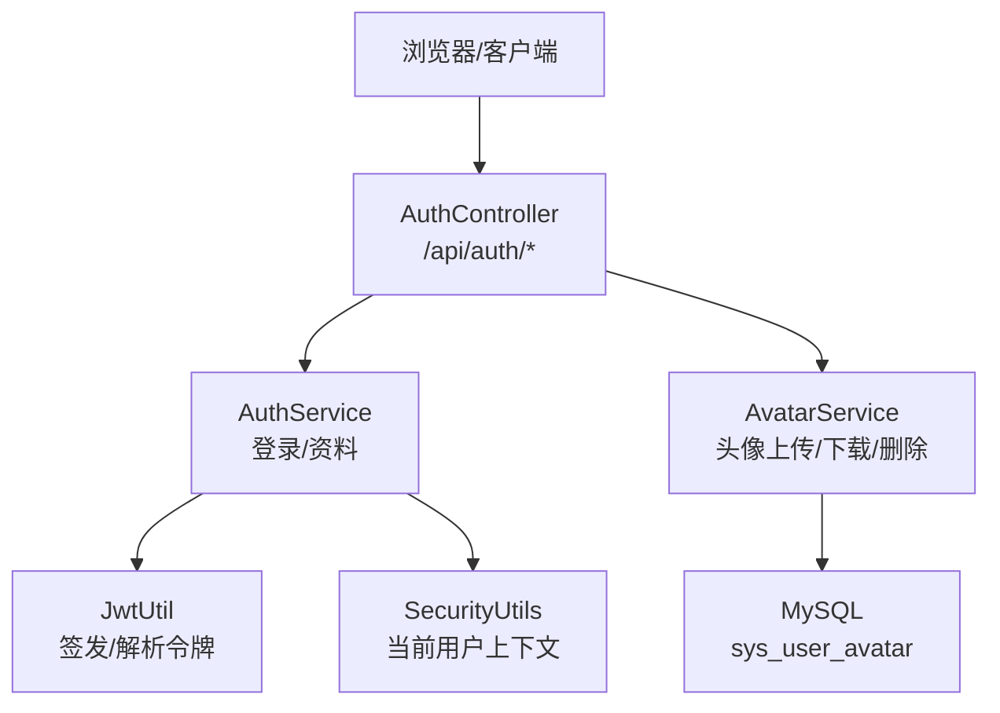
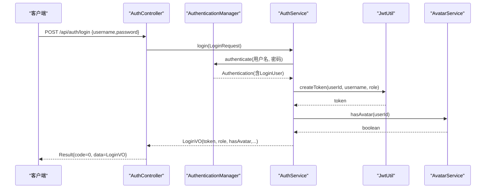
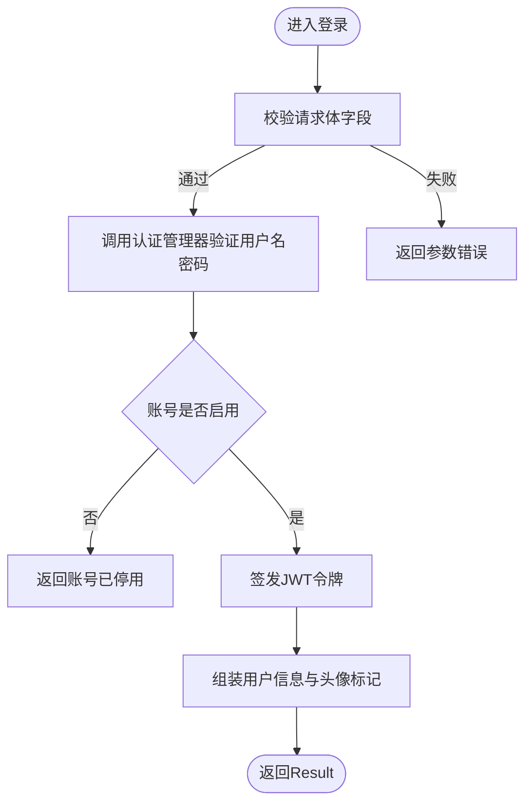
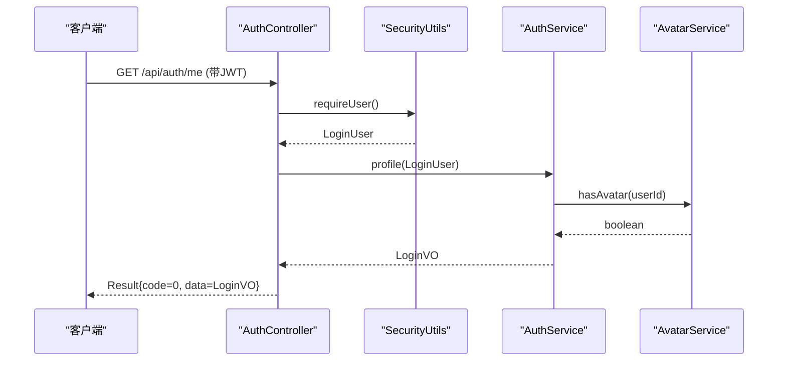
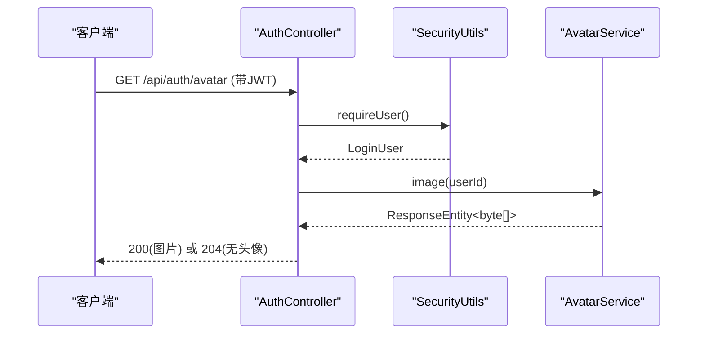
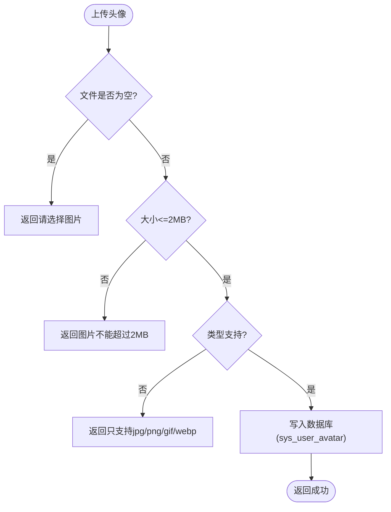
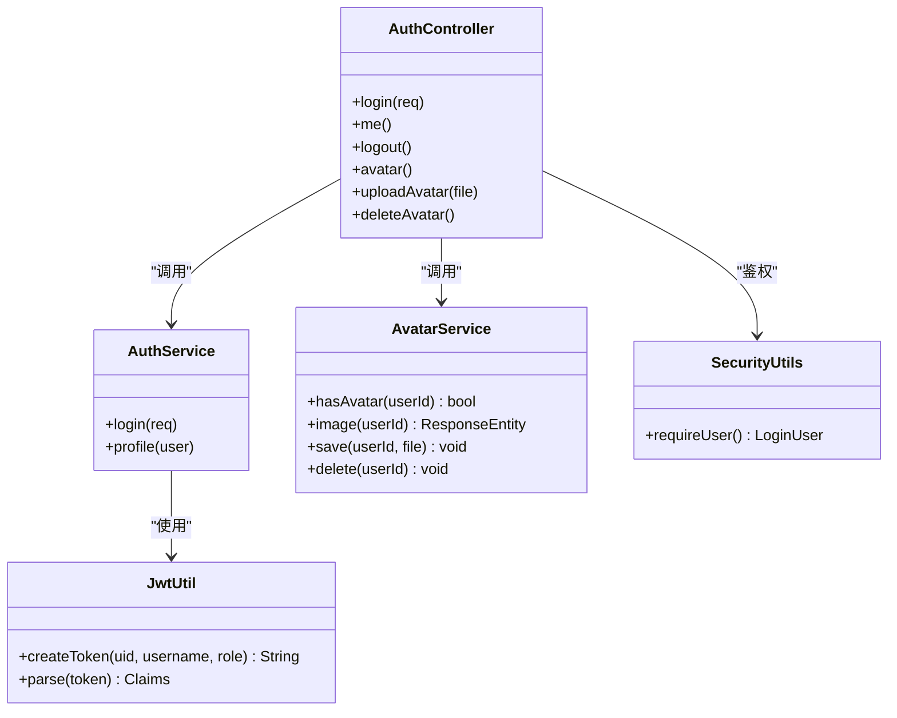

# 认证授权API

<cite>
**本文引用的文件**
- [AuthController.java](file://exam-server/src/main/java/com/exam/controller/AuthController.java)
- [AuthService.java](file://exam-server/src/main/java/com/exam/service/AuthService.java)
- [LoginRequest.java](file://exam-server/src/main/java/com/exam/dto/LoginRequest.java)
- [LoginVO.java](file://exam-server/src/main/java/com/exam/dto/LoginVO.java)
- [JwtUtil.java](file://exam-server/src/main/java/com/exam/security/JwtUtil.java)
- [SecurityUtils.java](file://exam-server/src/main/java/com/exam/security/SecurityUtils.java)
- [AvatarService.java](file://exam-server/src/main/java/com/exam/service/AvatarService.java)
- [SysUserAvatar.java](file://exam-server/src/main/java/com/exam/entity/SysUserAvatar.java)
- [Result.java](file://exam-server/src/main/java/com/exam/common/Result.java)
- [BizException.java](file://exam-server/src/main/java/com/exam/common/BizException.java)
- [index.js](file://exam-web/src/api/index.js)
- [Login.vue](file://exam-web/src/views/login/Login.vue)
- [UserAvatar.vue](file://exam-web/src/components/UserAvatar.vue)
</cite>

## 目录
1. [简介](#简介)
2. [项目结构](#项目结构)
3. [核心组件](#核心组件)
4. [架构总览](#架构总览)
5. [详细接口说明](#详细接口说明)
6. [依赖关系分析](#依赖关系分析)
7. [性能与限制](#性能与限制)
8. [故障排查指南](#故障排查指南)
9. [结论](#结论)
10. [附录：请求与响应示例](#附录请求与响应示例)

## 简介
本模块提供用户登录、登出、获取当前用户信息以及头像管理（上传、下载、删除）的REST API。认证采用JWT无状态令牌，鉴权通过安全过滤器从请求头中解析并校验令牌；头像数据以二进制形式持久化到数据库，并提供统一的返回包装格式。

## 项目结构
认证授权相关代码主要分布在以下位置：
- 控制器层：处理HTTP请求与响应映射
- 服务层：实现业务逻辑（登录、资料查询、头像存取）
- 安全层：JWT签发与解析、当前用户上下文提取
- DTO/实体：请求体、响应体、头像实体模型
- 前端调用：封装了登录、获取头像等API调用方式

图表来源
- [AuthController.java:23-64](file://exam-server/src/main/java/com/exam/controller/AuthController.java#L23-L64)
- [AuthService.java:22-49](file://exam-server/src/main/java/com/exam/service/AuthService.java#L22-L49)
- [AvatarService.java:29-81](file://exam-server/src/main/java/com/exam/service/AvatarService.java#L29-L81)
- [JwtUtil.java:27-42](file://exam-server/src/main/java/com/exam/security/JwtUtil.java#L27-L42)
- [SecurityUtils.java:19-25](file://exam-server/src/main/java/com/exam/security/SecurityUtils.java#L19-L25)

章节来源
- [AuthController.java:23-64](file://exam-server/src/main/java/com/exam/controller/AuthController.java#L23-L64)
- [AuthService.java:22-49](file://exam-server/src/main/java/com/exam/service/AuthService.java#L22-L49)
- [AvatarService.java:29-81](file://exam-server/src/main/java/com/exam/service/AvatarService.java#L29-L81)
- [JwtUtil.java:27-42](file://exam-server/src/main/java/com/exam/security/JwtUtil.java#L27-L42)
- [SecurityUtils.java:19-25](file://exam-server/src/main/java/com/exam/security/SecurityUtils.java#L19-L25)

## 核心组件
- AuthController：暴露 /api/auth 下的登录、登出、当前用户、头像接口
- AuthService：负责密码校验、签发JWT、组装用户资料返回
- AvatarService：处理头像文件的类型校验、大小限制、存储与读取
- JwtUtil：基于HS256算法签发和解析JWT，载荷包含uid、username、role
- SecurityUtils：从安全上下文中获取当前登录用户，未登录时抛出异常
- Result/BizException：统一返回结构与业务异常封装

章节来源
- [AuthController.java:23-64](file://exam-server/src/main/java/com/exam/controller/AuthController.java#L23-L64)
- [AuthService.java:22-49](file://exam-server/src/main/java/com/exam/service/AuthService.java#L22-L49)
- [AvatarService.java:29-81](file://exam-server/src/main/java/com/exam/service/AvatarService.java#L29-L81)
- [JwtUtil.java:27-42](file://exam-server/src/main/java/com/exam/security/JwtUtil.java#L27-L42)
- [SecurityUtils.java:19-25](file://exam-server/src/main/java/com/exam/security/SecurityUtils.java#L19-L25)
- [Result.java:9-37](file://exam-server/src/main/java/com/exam/common/Result.java#L9-L37)
- [BizException.java:9-21](file://exam-server/src/main/java/com/exam/common/BizException.java#L9-L21)

## 架构总览
下图展示了登录流程中关键组件的交互顺序：

图表来源
- [AuthController.java:31-35](file://exam-server/src/main/java/com/exam/controller/AuthController.java#L31-L35)
- [AuthService.java:22-38](file://exam-server/src/main/java/com/exam/service/AuthService.java#L22-L38)
- [JwtUtil.java:27-37](file://exam-server/src/main/java/com/exam/security/JwtUtil.java#L27-L37)
- [AvatarService.java:29-32](file://exam-server/src/main/java/com/exam/service/AvatarService.java#L29-L32)

## 详细接口说明

### 通用约定
- 基础路径：/api/auth
- 统一响应体：Result<T>，包含 code、message、data
- 鉴权方式：除登录外，其他接口需携带JWT令牌（通常放在请求头Authorization中），由安全过滤器解析并注入当前用户上下文
- 错误处理：业务异常会转换为Result或标准HTTP状态码，具体见各接口说明

章节来源
- [Result.java:9-37](file://exam-server/src/main/java/com/exam/common/Result.java#L9-L37)
- [SecurityUtils.java:19-25](file://exam-server/src/main/java/com/exam/security/SecurityUtils.java#L19-L25)

### 登录
- 方法：POST
- 路径：/api/auth/login
- 请求体：LoginRequest
  - username：字符串，必填
  - password：字符串，必填
- 成功响应：Result<LoginVO>
  - data.token：JWT令牌字符串
  - data.role：角色（如STUDENT、ADMIN等）
  - data.userId、data.username、data.realName、data.studentId、data.hasAvatar
- 失败场景：
  - 参数校验失败：返回业务错误码与消息
  - 账号停用：返回业务错误码与消息
  - 认证失败：返回业务错误码与消息

图表来源
- [AuthController.java:31-35](file://exam-server/src/main/java/com/exam/controller/AuthController.java#L31-L35)
- [AuthService.java:22-38](file://exam-server/src/main/java/com/exam/service/AuthService.java#L22-L38)
- [JwtUtil.java:27-37](file://exam-server/src/main/java/com/exam/security/JwtUtil.java#L27-L37)
- [LoginRequest.java:7-14](file://exam-server/src/main/java/com/exam/dto/LoginRequest.java#L7-L14)
- [LoginVO.java:7-15](file://exam-server/src/main/java/com/exam/dto/LoginVO.java#L7-L15)

章节来源
- [AuthController.java:31-35](file://exam-server/src/main/java/com/exam/controller/AuthController.java#L31-L35)
- [AuthService.java:22-38](file://exam-server/src/main/java/com/exam/service/AuthService.java#L22-L38)
- [LoginRequest.java:7-14](file://exam-server/src/main/java/com/exam/dto/LoginRequest.java#L7-L14)
- [LoginVO.java:7-15](file://exam-server/src/main/java/com/exam/dto/LoginVO.java#L7-L15)
- [JwtUtil.java:27-37](file://exam-server/src/main/java/com/exam/security/JwtUtil.java#L27-L37)

### 获取当前用户信息
- 方法：GET
- 路径：/api/auth/me
- 鉴权：需要有效JWT令牌
- 成功响应：Result<LoginVO>
  - data.userId、data.username、data.realName、data.role、data.studentId、data.hasAvatar
- 失败场景：
  - 未登录或令牌无效：返回未登录错误
  - 其他业务异常：返回对应错误码与消息

图表来源
- [AuthController.java:37-41](file://exam-server/src/main/java/com/exam/controller/AuthController.java#L37-L41)
- [SecurityUtils.java:19-25](file://exam-server/src/main/java/com/exam/security/SecurityUtils.java#L19-L25)
- [AuthService.java:40-49](file://exam-server/src/main/java/com/exam/service/AuthService.java#L40-L49)
- [AvatarService.java:29-32](file://exam-server/src/main/java/com/exam/service/AvatarService.java#L29-L32)

章节来源
- [AuthController.java:37-41](file://exam-server/src/main/java/com/exam/controller/AuthController.java#L37-L41)
- [SecurityUtils.java:19-25](file://exam-server/src/main/java/com/exam/security/SecurityUtils.java#L19-L25)
- [AuthService.java:40-49](file://exam-server/src/main/java/com/exam/service/AuthService.java#L40-L49)

### 登出
- 方法：POST
- 路径：/api/auth/logout
- 鉴权：建议携带JWT（服务端不强制校验）
- 行为：服务端无状态，登出主要由前端清除本地令牌
- 成功响应：Result<Void>

章节来源
- [AuthController.java:43-46](file://exam-server/src/main/java/com/exam/controller/AuthController.java#L43-L46)

### 头像管理

#### 下载头像
- 方法：GET
- 路径：/api/auth/avatar
- 鉴权：需要有效JWT令牌
- 成功响应：
  - 存在头像：HTTP 200，Content-Type为图片类型，Body为图片字节流
  - 不存在头像：HTTP 204 No Content
- 失败场景：未登录或令牌无效将返回未登录错误

图表来源
- [AuthController.java:48-51](file://exam-server/src/main/java/com/exam/controller/AuthController.java#L48-L51)
- [AvatarService.java:34-44](file://exam-server/src/main/java/com/exam/service/AvatarService.java#L34-L44)
- [SecurityUtils.java:19-25](file://exam-server/src/main/java/com/exam/security/SecurityUtils.java#L19-L25)

章节来源
- [AuthController.java:48-51](file://exam-server/src/main/java/com/exam/controller/AuthController.java#L48-L51)
- [AvatarService.java:34-44](file://exam-server/src/main/java/com/exam/service/AvatarService.java#L34-L44)

#### 上传头像
- 方法：POST
- 路径：/api/auth/avatar
- 表单字段：file（MultipartFile）
- 鉴权：需要有效JWT令牌
- 校验规则：
  - 文件不能为空
  - 文件大小不超过2MB
  - 仅支持 jpg/jpeg、png、webp、gif
- 成功响应：Result<Void>
- 失败场景：
  - 未选择文件或空文件
  - 超过大小限制
  - 不支持的图片类型
  - 读取图片失败

图表来源
- [AuthController.java:53-57](file://exam-server/src/main/java/com/exam/controller/AuthController.java#L53-L57)
- [AvatarService.java:46-76](file://exam-server/src/main/java/com/exam/service/AvatarService.java#L46-L76)
- [SysUserAvatar.java:10-19](file://exam-server/src/main/java/com/exam/entity/SysUserAvatar.java#L10-L19)

章节来源
- [AuthController.java:53-57](file://exam-server/src/main/java/com/exam/controller/AuthController.java#L53-L57)
- [AvatarService.java:46-76](file://exam-server/src/main/java/com/exam/service/AvatarService.java#L46-L76)
- [SysUserAvatar.java:10-19](file://exam-server/src/main/java/com/exam/entity/SysUserAvatar.java#L10-L19)

#### 删除头像
- 方法：DELETE
- 路径：/api/auth/avatar
- 鉴权：需要有效JWT令牌
- 行为：根据userId删除头像记录
- 成功响应：Result<Void>

章节来源
- [AuthController.java:59-63](file://exam-server/src/main/java/com/exam/controller/AuthController.java#L59-L63)
- [AvatarService.java:78-81](file://exam-server/src/main/java/com/exam/service/AvatarService.java#L78-L81)

## 依赖关系分析
- 控制器依赖服务：AuthController依赖AuthService与AvatarService
- 服务依赖安全工具：AuthService依赖JwtUtil进行令牌签发；所有受保护接口通过SecurityUtils获取当前用户
- 头像服务依赖持久化：AvatarService通过MyBatis Plus操作SysUserAvatarMapper，将图片二进制存入数据库
- 前端调用：前端通过封装的API函数调用后端接口，登录成功后根据角色跳转不同页面，头像组件负责触发上传与显示

图表来源
- [AuthController.java:23-64](file://exam-server/src/main/java/com/exam/controller/AuthController.java#L23-L64)
- [AuthService.java:22-49](file://exam-server/src/main/java/com/exam/service/AuthService.java#L22-L49)
- [AvatarService.java:29-81](file://exam-server/src/main/java/com/exam/service/AvatarService.java#L29-L81)
- [JwtUtil.java:27-42](file://exam-server/src/main/java/com/exam/security/JwtUtil.java#L27-L42)
- [SecurityUtils.java:19-25](file://exam-server/src/main/java/com/exam/security/SecurityUtils.java#L19-L25)

章节来源
- [AuthController.java:23-64](file://exam-server/src/main/java/com/exam/controller/AuthController.java#L23-L64)
- [AuthService.java:22-49](file://exam-server/src/main/java/com/exam/service/AuthService.java#L22-L49)
- [AvatarService.java:29-81](file://exam-server/src/main/java/com/exam/service/AvatarService.java#L29-L81)
- [JwtUtil.java:27-42](file://exam-server/src/main/java/com/exam/security/JwtUtil.java#L27-L42)
- [SecurityUtils.java:19-25](file://exam-server/src/main/java/com/exam/security/SecurityUtils.java#L19-L25)

## 性能与限制
- 头像大小限制：最大2MB，避免大文件对数据库与网络造成压力
- 支持的图片类型：jpg/jpeg、png、webp、gif，减少非法类型带来的处理开销
- 头像存储：图片以二进制形式直接存储在数据库中，适合小体积头像；如需扩展可考虑对象存储
- 缓存策略：头像下载响应设置no-store，避免浏览器缓存导致更新不及时
- 令牌有效期：JWT过期时间由配置项控制，可根据安全策略调整

章节来源
- [AvatarService.java:25-99](file://exam-server/src/main/java/com/exam/service/AvatarService.java#L25-L99)
- [JwtUtil.java:21-25](file://exam-server/src/main/java/com/exam/security/JwtUtil.java#L21-L25)

## 故障排查指南
- 未登录或令牌无效：检查请求头是否携带有效的JWT；确认令牌未过期且签名正确
- 账号已停用：登录时会校验账号状态，若停用则返回相应错误
- 头像上传失败：
  - 检查是否选择了文件
  - 检查文件大小是否超过2MB
  - 检查图片类型是否在允许范围内
  - 检查IO异常（读取失败）
- 头像下载为空：当用户没有头像时返回204，前端应兼容该状态码

章节来源
- [AuthService.java:22-38](file://exam-server/src/main/java/com/exam/service/AuthService.java#L22-L38)
- [AvatarService.java:46-99](file://exam-server/src/main/java/com/exam/service/AvatarService.java#L46-L99)
- [SecurityUtils.java:19-25](file://exam-server/src/main/java/com/exam/security/SecurityUtils.java#L19-L25)

## 结论
本认证授权模块通过JWT实现无状态鉴权，提供完整的登录、登出、当前用户信息查询与头像管理能力。接口设计简洁清晰，错误处理统一，便于前后端协作与后续扩展。

## 附录：请求与响应示例

### 登录
- 请求
  - 方法：POST
  - 路径：/api/auth/login
  - 请求体：
    - username：字符串，必填
    - password：字符串，必填
- 成功响应
  - HTTP状态码：200
  - 响应体：Result<LoginVO>
    - code：0
    - message："ok"
    - data：
      - token：JWT令牌字符串
      - userId：用户ID
      - username：用户名
      - realName：真实姓名
      - role：角色
      - studentId：学生ID（可能为空）
      - hasAvatar：是否有头像
- 失败响应
  - 参数校验失败：code非0，message提示
  - 账号停用：code非0，message提示
  - 认证失败：code非0，message提示

章节来源
- [AuthController.java:31-35](file://exam-server/src/main/java/com/exam/controller/AuthController.java#L31-L35)
- [AuthService.java:22-38](file://exam-server/src/main/java/com/exam/service/AuthService.java#L22-L38)
- [LoginRequest.java:7-14](file://exam-server/src/main/java/com/exam/dto/LoginRequest.java#L7-L14)
- [LoginVO.java:7-15](file://exam-server/src/main/java/com/exam/dto/LoginVO.java#L7-L15)
- [Result.java:9-37](file://exam-server/src/main/java/com/exam/common/Result.java#L9-L37)

### 获取当前用户信息
- 请求
  - 方法：GET
  - 路径：/api/auth/me
  - 头部：携带JWT令牌
- 成功响应
  - HTTP状态码：200
  - 响应体：Result<LoginVO>
    - data：包含userId、username、realName、role、studentId、hasAvatar
- 失败响应
  - 未登录：返回未登录错误

章节来源
- [AuthController.java:37-41](file://exam-server/src/main/java/com/exam/controller/AuthController.java#L37-L41)
- [SecurityUtils.java:19-25](file://exam-server/src/main/java/com/exam/security/SecurityUtils.java#L19-L25)
- [AuthService.java:40-49](file://exam-server/src/main/java/com/exam/service/AuthService.java#L40-L49)

### 登出
- 请求
  - 方法：POST
  - 路径：/api/auth/logout
  - 头部：可选携带JWT
- 成功响应
  - HTTP状态码：200
  - 响应体：Result<Void>

章节来源
- [AuthController.java:43-46](file://exam-server/src/main/java/com/exam/controller/AuthController.java#L43-L46)

### 头像下载
- 请求
  - 方法：GET
  - 路径：/api/auth/avatar
  - 头部：携带JWT令牌
- 成功响应
  - 存在头像：HTTP 200，Content-Type为图片类型，Body为图片字节流
  - 不存在头像：HTTP 204 No Content
- 失败响应
  - 未登录：返回未登录错误

章节来源
- [AuthController.java:48-51](file://exam-server/src/main/java/com/exam/controller/AuthController.java#L48-L51)
- [AvatarService.java:34-44](file://exam-server/src/main/java/com/exam/service/AvatarService.java#L34-L44)

### 头像上传
- 请求
  - 方法：POST
  - 路径：/api/auth/avatar
  - 内容类型：multipart/form-data
  - 表单字段：file（图片文件）
  - 头部：携带JWT令牌
- 成功响应
  - HTTP状态码：200
  - 响应体：Result<Void>
- 失败响应
  - 未选择图片或空文件：返回请选择图片
  - 超过2MB：返回图片不能超过2MB
  - 不支持的类型：返回只支持jpg/png/gif/webp
  - IO异常：返回读取图片失败

章节来源
- [AuthController.java:53-57](file://exam-server/src/main/java/com/exam/controller/AuthController.java#L53-L57)
- [AvatarService.java:46-76](file://exam-server/src/main/java/com/exam/service/AvatarService.java#L46-L76)

### 头像删除
- 请求
  - 方法：DELETE
  - 路径：/api/auth/avatar
  - 头部：携带JWT令牌
- 成功响应
  - HTTP状态码：200
  - 响应体：Result<Void>

章节来源
- [AuthController.java:59-63](file://exam-server/src/main/java/com/exam/controller/AuthController.java#L59-L63)
- [AvatarService.java:78-81](file://exam-server/src/main/java/com/exam/service/AvatarService.java#L78-L81)