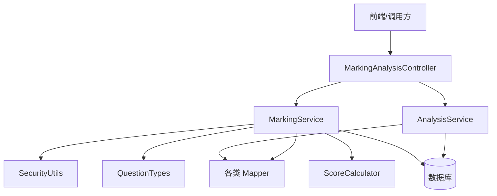
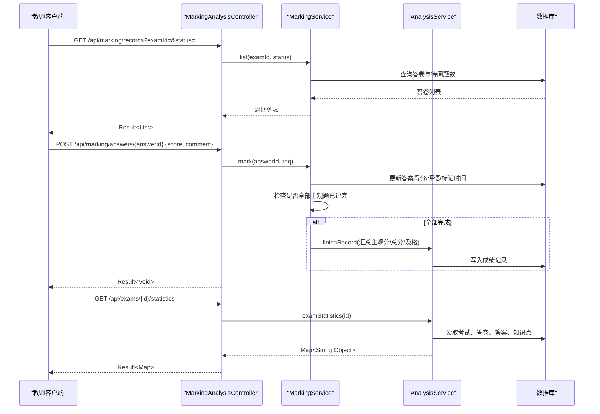
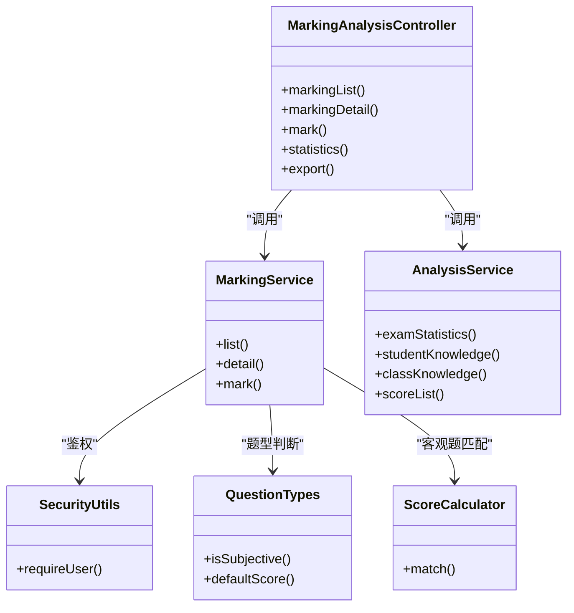
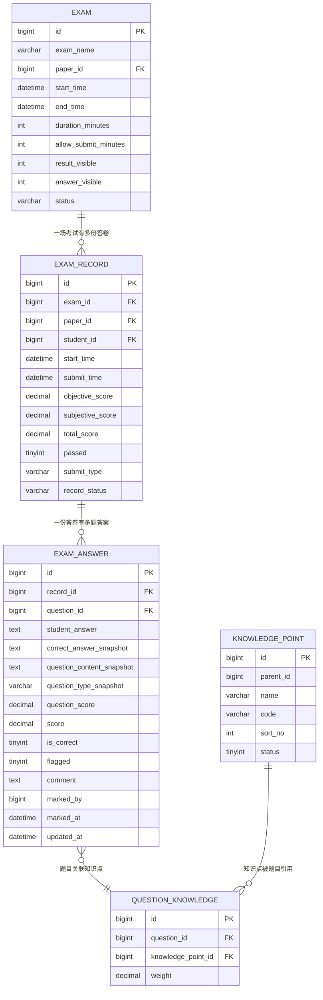

# 阅卷评分API

<cite>
**本文引用的文件**
- [MarkingAnalysisController.java](file://exam-server/src/main/java/com/exam/controller/MarkingAnalysisController.java)
- [MarkingService.java](file://exam-server/src/main/java/com/exam/service/MarkingService.java)
- [AnalysisService.java](file://exam-server/src/main/java/com/exam/service/AnalysisService.java)
- [StudentExamService.java](file://exam-server/src/main/java/com/exam/service/StudentExamService.java)
- [ScoreCalculator.java](file://exam-server/src/main/java/com/exam/util/ScoreCalculator.java)
- [QuestionTypes.java](file://exam-server/src/main/java/com/exam/util/QuestionTypes.java)
- [SecurityUtils.java](file://exam-server/src/main/java/com/exam/security/SecurityUtils.java)
- [ExamAnswer.java](file://exam-server/src/main/java/com/exam/entity/ExamAnswer.java)
- [ExamRecord.java](file://exam-server/src/main/java/com/exam/entity/ExamRecord.java)
- [Exam.java](file://exam-server/src/main/java/com/exam/entity/Exam.java)
- [schema.sql](file://exam-server/src/main/resources/db/schema.sql)
- [BizException.java](file://exam-server/src/main/java/com/exam/common/BizException.java)
- [Result.java](file://exam-server/src/main/java/com/exam/common/Result.java)
</cite>

## 目录
1. [简介](#简介)
2. [项目结构](#项目结构)
3. [核心组件](#核心组件)
4. [架构总览](#架构总览)
5. [详细接口说明](#详细接口说明)
6. [依赖关系分析](#依赖关系分析)
7. [性能与扩展性](#性能与扩展性)
8. [故障排查指南](#故障排查指南)
9. [结论](#结论)
10. [附录：数据模型与规则](#附录数据模型与规则)

## 简介
本模块提供主观题阅卷、成绩汇总统计与导出能力，覆盖以下关键能力：
- 待阅卷题目列表查询：支持按考试、状态等条件筛选。
- 主观题评分：包含评分标准校验、评语记录、分数计算与总分汇总。
- 成绩汇总与统计：班级/单场平均分、通过率、知识点掌握度等。
- 成绩导出：Excel 格式导出。
- 权限与安全：基于登录态的阅卷人身份识别与访问控制。
- 评分质量监控与异常检测：通过业务异常与操作日志实现基础监控。
- 评分规则配置与自定义标准：题型默认分值、主观题判定、自动评分策略集中管理。

## 项目结构
阅卷评分相关代码集中在后端 exam-server 中，采用 Controller-Service-Mapper 分层：
- 控制器层：暴露 REST API（阅卷、统计、导出）。
- 服务层：封装阅卷流程、统计计算、成绩汇总等业务逻辑。
- 实体与工具：答卷明细、记录、题型与评分工具类。
- 安全：统一从 SecurityContext 获取当前用户，进行鉴权。
- 数据库：MySQL/H2 兼容建表脚本定义答卷、记录、知识点等表结构。

图表来源
- [MarkingAnalysisController.java:38-90](file://exam-server/src/main/java/com/exam/controller/MarkingAnalysisController.java#L38-L90)
- [MarkingService.java:38-131](file://exam-server/src/main/java/com/exam/service/MarkingService.java#L38-L131)
- [AnalysisService.java:46-161](file://exam-server/src/main/java/com/exam/service/AnalysisService.java#L46-L161)

章节来源
- [MarkingAnalysisController.java:1-134](file://exam-server/src/main/java/com/exam/controller/MarkingAnalysisController.java#L1-L134)
- [schema.sql:135-171](file://exam-server/src/main/resources/db/schema.sql#L135-L171)

## 核心组件
- MarkingAnalysisController：对外提供阅卷、统计、导出接口。
- MarkingService：主观题阅卷主流程，含待阅列表、详情、打分、完成阅卷后汇总总分与知识点。
- AnalysisService：单场考试统计、学生/班级知识点掌握度、成绩列表。
- StudentExamService：交卷时自动客观题评分，并触发后续阅卷或完成流程。
- ScoreCalculator/QuestionTypes：题型常量、主观题判断、客观题匹配算法。
- SecurityUtils：当前登录用户提取与角色判断。
- 实体 ExamAnswer/ExamRecord/Exam：答卷明细、成绩记录、考试元信息。

章节来源
- [MarkingService.java:27-152](file://exam-server/src/main/java/com/exam/service/MarkingService.java#L27-L152)
- [AnalysisService.java:33-258](file://exam-server/src/main/java/com/exam/service/AnalysisService.java#L33-L258)
- [StudentExamService.java:180-309](file://exam-server/src/main/java/com/exam/service/StudentExamService.java#L180-L309)
- [ScoreCalculator.java:1-55](file://exam-server/src/main/java/com/exam/util/ScoreCalculator.java#L1-L55)
- [QuestionTypes.java:1-123](file://exam-server/src/main/java/com/exam/util/QuestionTypes.java#L1-L123)
- [SecurityUtils.java:1-40](file://exam-server/src/main/java/com/exam/security/SecurityUtils.java#L1-L40)
- [ExamAnswer.java:1-32](file://exam-server/src/main/java/com/exam/entity/ExamAnswer.java#L1-L32)
- [ExamRecord.java:1-29](file://exam-server/src/main/java/com/exam/entity/ExamRecord.java#L1-L29)
- [Exam.java:1-28](file://exam-server/src/main/java/com/exam/entity/Exam.java#L1-L28)

## 架构总览
阅卷评分整体流程：
- 学生交卷后，系统自动对客观题评分；若存在主观题，则进入“MARKING”状态等待教师阅卷。
- 教师通过阅卷接口查看待阅列表与详情，逐题打分并写评语；当该份答卷所有主观题均完成评分后，系统汇总主观分、总分、是否及格，并更新知识点掌握度。
- 管理员/教师可查询单场考试统计、班级/学生知识点掌握度，并导出成绩。

图表来源
- [MarkingAnalysisController.java:38-90](file://exam-server/src/main/java/com/exam/controller/MarkingAnalysisController.java#L38-L90)
- [MarkingService.java:38-131](file://exam-server/src/main/java/com/exam/service/MarkingService.java#L38-L131)
- [AnalysisService.java:46-97](file://exam-server/src/main/java/com/exam/service/AnalysisService.java#L46-L97)

## 详细接口说明

### 通用约定
- 统一返回体：code=0 成功，非 0 失败；data 为业务数据。
- 错误处理：业务异常由全局处理器转换为统一结果。
- 认证：阅卷接口需已登录，阅卷人身份由 SecurityUtils 获取。

章节来源
- [Result.java:1-38](file://exam-server/src/main/java/com/exam/common/Result.java#L1-L38)
- [BizException.java:1-22](file://exam-server/src/main/java/com/exam/common/BizException.java#L1-L22)
- [SecurityUtils.java:11-25](file://exam-server/src/main/java/com/exam/security/SecurityUtils.java#L11-L25)

### 待阅卷题目列表查询
- 接口：GET /api/marking/records
- 参数：
  - examId：可选，按考试过滤
  - status：可选，按答卷状态过滤；未传时默认返回“待阅卷/已完成”
- 返回：答卷列表，包含考试名称、学生姓名/学号/班级、剩余待阅主观题数量
- 行为：
  - 仅返回主观题（简答题/关键词解释）且尚未标记的题目计数
  - 按提交时间倒序

章节来源
- [MarkingAnalysisController.java:38-42](file://exam-server/src/main/java/com/exam/controller/MarkingAnalysisController.java#L38-L42)
- [MarkingService.java:38-72](file://exam-server/src/main/java/com/exam/service/MarkingService.java#L38-L72)
- [QuestionTypes.java:88-91](file://exam-server/src/main/java/com/exam/util/QuestionTypes.java#L88-L91)

### 待阅卷详情
- 接口：GET /api/marking/records/{recordId}
- 返回：答卷基本信息、学生信息、该答卷所有题目作答明细（含题干快照、正确答案快照、题型、满分、学生答案等）

章节来源
- [MarkingAnalysisController.java:44-47](file://exam-server/src/main/java/com/exam/controller/MarkingAnalysisController.java#L44-L47)
- [MarkingService.java:74-90](file://exam-server/src/main/java/com/exam/service/MarkingService.java#L74-L90)
- [ExamAnswer.java:14-31](file://exam-server/src/main/java/com/exam/entity/ExamAnswer.java#L14-L31)

### 主观题评分接口
- 接口：POST /api/marking/answers/{answerId}
- 请求体：
  - score：得分，必须介于 0 到本题满分之间
  - comment：评语（可选）
- 行为：
  - 校验题型为主观题（简答题/关键词解释）
  - 校验分数范围
  - 记录批改人、批改时间
  - 根据得分与满分判断是否正确
  - 若该份答卷所有主观题均已评分，则汇总主观分、总分、是否及格，并更新知识点掌握度
- 注意：客观题无需人工阅卷，会直接拒绝

章节来源
- [MarkingAnalysisController.java:49-53](file://exam-server/src/main/java/com/exam/controller/MarkingAnalysisController.java#L49-L53)
- [MarkingService.java:92-131](file://exam-server/src/main/java/com/exam/service/MarkingService.java#L92-L131)
- [ScoreCalculator.java:15-18](file://exam-server/src/main/java/com/exam/util/ScoreCalculator.java#L15-L18)
- [QuestionTypes.java:88-91](file://exam-server/src/main/java/com/exam/util/QuestionTypes.java#L88-L91)

### 成绩汇总与统计
- 接口：GET /api/exams/{id}/statistics
- 返回：
  - 考试名称、应考人数、已提交/已完成/待阅卷人数、缺考人数
  - 平均分、通过率（基于已完成答卷）
  - 学生明细（含状态、总分、客观/主观分、是否及格、提交时间）
  - 知识点维度统计（掌握度 = 实得分/满分 × 100）
- 补充接口：
  - GET /api/exams/{id}/knowledge-stats：仅返回知识点统计
  - GET /api/analysis/students/{studentId}/knowledge：学生知识点掌握度
  - GET /api/analysis/classes/{className}/knowledge：班级知识点掌握度

章节来源
- [MarkingAnalysisController.java:55-73](file://exam-server/src/main/java/com/exam/controller/MarkingAnalysisController.java#L55-L73)
- [AnalysisService.java:46-161](file://exam-server/src/main/java/com/exam/service/AnalysisService.java#L46-L161)
- [AnalysisService.java:163-212](file://exam-server/src/main/java/com/exam/service/AnalysisService.java#L163-L212)

### 成绩导出
- 接口：GET /api/scores/export
- 参数：
  - examId：可选，按考试导出
  - className：可选，按班级导出
- 输出：Excel（.xlsx），包含考试、学号、姓名、班级、客观题分、主观题分、总分、是否及格
- 说明：仅导出已完成答卷

章节来源
- [MarkingAnalysisController.java:81-90](file://exam-server/src/main/java/com/exam/controller/MarkingAnalysisController.java#L81-L90)
- [AnalysisService.java:147-161](file://exam-server/src/main/java/com/exam/service/AnalysisService.java#L147-L161)

### 成绩列表查询
- 接口：GET /api/scores
- 参数：同导出接口
- 返回：已完成答卷的成绩列表（按总分降序）

章节来源
- [MarkingAnalysisController.java:75-79](file://exam-server/src/main/java/com/exam/controller/MarkingAnalysisController.java#L75-L79)
- [AnalysisService.java:147-161](file://exam-server/src/main/java/com/exam/service/AnalysisService.java#L147-L161)

### 评分历史查看与修改权限
- 查看：通过阅卷详情接口可查看每道题的得分、评语、批改人与批改时间
- 修改：当前实现未提供二次修改评分的接口；如需支持，可在 MarkingService.mark 基础上增加幂等校验与审计字段
- 权限：阅卷接口需已登录，批改人通过 SecurityUtils.requireUser() 获取

章节来源
- [MarkingService.java:92-131](file://exam-server/src/main/java/com/exam/service/MarkingService.java#L92-L131)
- [SecurityUtils.java:11-25](file://exam-server/src/main/java/com/exam/security/SecurityUtils.java#L11-L25)

### 评分规则配置与自定义评分标准
- 题型与默认分值：QuestionTypes 定义了各题型默认分值与中文标签映射
- 主观题判定：ESSAY/TERM 为主观题，走人工阅卷
- 客观题匹配：ScoreCalculator 实现单选/多选/判断/填空的匹配逻辑
- 自定义建议：
  - 在 QuestionTypes.defaultScore 中扩展默认分值
  - 在 ScoreCalculator.match 中扩展匹配规则（如模糊匹配、关键词权重）
  - 在 AnalysisService.examKnowledge 中调整知识点权重分配策略

章节来源
- [QuestionTypes.java:102-121](file://exam-server/src/main/java/com/exam/util/QuestionTypes.java#L102-L121)
- [ScoreCalculator.java:20-53](file://exam-server/src/main/java/com/exam/util/ScoreCalculator.java#L20-L53)
- [AnalysisService.java:163-212](file://exam-server/src/main/java/com/exam/service/AnalysisService.java#L163-L212)

## 依赖关系分析
- 阅卷流程依赖：
  - MarkingAnalysisController → MarkingService → 数据库（答卷、答案、考试、学生）
  - MarkingService 使用 SecurityUtils 获取阅卷人身份
  - 主观题判定依赖 QuestionTypes.isSubjective
  - 客观题自动评分依赖 ScoreCalculator.match
- 统计分析依赖：
  - AnalysisService 聚合 ExamRecord、ExamAnswer、KnowledgePoint、QuestionKnowledge 等数据
  - 知识点掌握度计算基于题目-知识点关联与权重

图表来源
- [MarkingAnalysisController.java:38-90](file://exam-server/src/main/java/com/exam/controller/MarkingAnalysisController.java#L38-L90)
- [MarkingService.java:38-131](file://exam-server/src/main/java/com/exam/service/MarkingService.java#L38-L131)
- [AnalysisService.java:46-161](file://exam-server/src/main/java/com/exam/service/AnalysisService.java#L46-L161)
- [QuestionTypes.java:88-121](file://exam-server/src/main/java/com/exam/util/QuestionTypes.java#L88-L121)
- [ScoreCalculator.java:20-53](file://exam-server/src/main/java/com/exam/util/ScoreCalculator.java#L20-L53)

## 性能与扩展性
- 查询优化：
  - 待阅列表按提交时间排序，避免全表扫描；可按 examId/status 精确过滤
  - 成绩列表按总分降序，便于快速定位高分/低分
- 计算复杂度：
  - 知识点掌握度聚合基于答案-知识点关联，建议在大数据量下建立索引（已定义）
- 扩展点：
  - 支持更多导出格式（CSV/PDF）
  - 支持批量评分与评分模板
  - 引入评分质量监控指标（如评分方差、异常分数检测）

## 故障排查指南
- 常见错误：
  - 未登录：SecurityUtils 抛出未登录异常
  - 非主观题：尝试对客观题评分会被拒绝
  - 分数越界：超出 0~满分范围
  - 答卷不存在：传入的 answerId 无效
- 处理建议：
  - 检查登录态与权限
  - 确认题型是否为主观题
  - 核对题目满分与输入分数
  - 核对答卷ID是否存在

章节来源
- [SecurityUtils.java:19-25](file://exam-server/src/main/java/com/exam/security/SecurityUtils.java#L19-L25)
- [MarkingService.java:92-104](file://exam-server/src/main/java/com/exam/service/MarkingService.java#L92-L104)
- [BizException.java:9-21](file://exam-server/src/main/java/com/exam/common/BizException.java#L9-L21)

## 结论
本模块实现了完整的主观题阅卷与成绩管理能力，涵盖待阅列表、评分、统计与导出，并通过统一的异常与返回体保障稳定性。结合题型与评分工具类，系统具备良好的可扩展性与可维护性。建议后续增强评分质量监控、多格式导出与批量处理能力，以进一步提升教学效率与数据分析深度。

## 附录：数据模型与规则

### 数据模型概览

图表来源
- [schema.sql:111-171](file://exam-server/src/main/resources/db/schema.sql#L111-L171)

### 评分规则要点
- 主观题：ESSAY/TERM，需人工评分；评分范围 0~满分；完成后汇总主观分与总分。
- 客观题：SINGLE/MULTIPLE/JUDGE/FILL，自动评分；空答案视为错；多选选项排序后比较。
- 知识点掌握度：基于题目-知识点权重加权计算，掌握度 = 实得分/满分 × 100。
- 默认分值：QuestionTypes.defaultScore 定义各题型默认分值，可按需扩展。

章节来源
- [QuestionTypes.java:88-121](file://exam-server/src/main/java/com/exam/util/QuestionTypes.java#L88-L121)
- [ScoreCalculator.java:20-53](file://exam-server/src/main/java/com/exam/util/ScoreCalculator.java#L20-L53)
- [AnalysisService.java:163-212](file://exam-server/src/main/java/com/exam/service/AnalysisService.java#L163-L212)