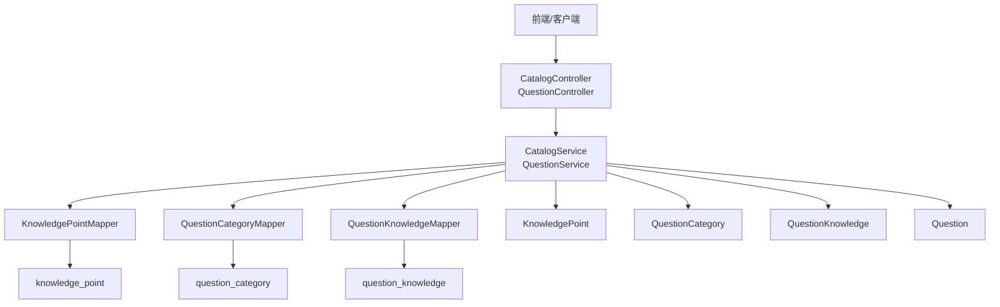
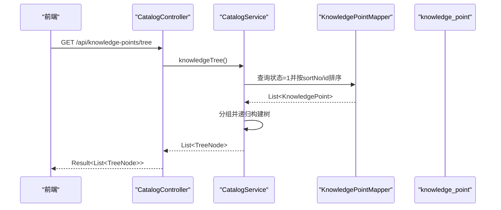

# 分类管理API

<cite>
**本文引用的文件**
- [CatalogController.java](file://exam-server/src/main/java/com/exam/controller/CatalogController.java)
- [CatalogService.java](file://exam-server/src/main/java/com/exam/service/CatalogService.java)
- [QuestionCategory.java](file://exam-server/src/main/java/com/exam/entity/QuestionCategory.java)
- [KnowledgePoint.java](file://exam-server/src/main/java/com/exam/entity/KnowledgePoint.java)
- [Question.java](file://exam-server/src/main/java/com/exam/entity/Question.java)
- [QuestionKnowledge.java](file://exam-server/src/main/java/com/exam/entity/QuestionKnowledge.java)
- [QuestionCategoryMapper.java](file://exam-server/src/main/java/com/exam/mapper/QuestionCategoryMapper.java)
- [KnowledgePointMapper.java](file://exam-server/src/main/java/com/exam/mapper/KnowledgePointMapper.java)
- [QuestionController.java](file://exam-server/src/main/java/com/exam/controller/QuestionController.java)
- [QuestionService.java](file://exam-server/src/main/java/com/exam/service/QuestionService.java)
- [Result.java](file://exam-server/src/main/java/com/exam/common/Result.java)
- [BizException.java](file://exam-server/src/main/java/com/exam/common/BizException.java)
- [schema.sql](file://sql/schema.sql)
</cite>

## 目录
1. [简介](#简介)
2. [项目结构](#项目结构)
3. [核心组件](#核心组件)
4. [架构总览](#架构总览)
5. [详细接口说明](#详细接口说明)
6. [依赖关系分析](#依赖关系分析)
7. [性能与扩展性](#性能与扩展性)
8. [故障排查指南](#故障排查指南)
9. [结论](#结论)
10. [附录：数据模型与约束](#附录数据模型与约束)

## 简介
本模块提供题库分类与知识点的树形结构管理能力，支持多级分类的创建、更新、删除与查询；同时提供知识点树的完整遍历接口，便于前端渲染树形组件。题目通过“分类ID”进行筛选，并通过“题目-知识点”多对多关系实现按知识点维度统计与组卷。文档覆盖增删改查、层级维护机制、关联关系、排序、以及调用示例与最佳实践。

## 项目结构
- 控制器层：暴露REST API，负责参数接收与统一返回封装
- 服务层：实现业务逻辑（树构建、校验、事务处理）
- 实体与映射：定义数据库表结构与ORM映射
- 通用组件：统一返回体、业务异常等

图表来源
- [CatalogController.java:18-69](file://exam-server/src/main/java/com/exam/controller/CatalogController.java#L18-L69)
- [CatalogService.java:21-139](file://exam-server/src/main/java/com/exam/service/CatalogService.java#L21-L139)
- [QuestionController.java:31-118](file://exam-server/src/main/java/com/exam/controller/QuestionController.java#L31-L118)
- [QuestionService.java:33-225](file://exam-server/src/main/java/com/exam/service/QuestionService.java#L33-L225)

章节来源
- [CatalogController.java:18-69](file://exam-server/src/main/java/com/exam/controller/CatalogController.java#L18-L69)
- [QuestionController.java:31-118](file://exam-server/src/main/java/com/exam/controller/QuestionController.java#L31-L118)

## 核心组件
- CatalogController：对外暴露知识点树、知识点CRUD、题库分类CRUD接口
- CatalogService：实现知识点树构建、分类列表与CRUD、删除保护（无子节点）
- QuestionController/QuestionService：题目分页查询支持按分类ID与知识点ID筛选，保存时强制绑定至少一个知识点
- 实体与Mapper：对应数据库表 knowledge_point、question_category、question_knowledge、question

章节来源
- [CatalogController.java:18-69](file://exam-server/src/main/java/com/exam/controller/CatalogController.java#L18-L69)
- [CatalogService.java:21-139](file://exam-server/src/main/java/com/exam/service/CatalogService.java#L21-L139)
- [QuestionController.java:31-118](file://exam-server/src/main/java/com/exam/controller/QuestionController.java#L31-L118)
- [QuestionService.java:33-225](file://exam-server/src/main/java/com/exam/service/QuestionService.java#L33-L225)

## 架构总览
系统采用典型的分层架构：
- 控制器层仅做路由与参数绑定，不承载复杂逻辑
- 服务层集中处理业务规则（如树构建、校验、事务）
- Mapper层基于MyBatis-Plus访问数据库
- 统一返回 Result 与全局异常 BizException 保证一致的错误处理

图表来源
- [CatalogController.java:24-27](file://exam-server/src/main/java/com/exam/controller/CatalogController.java#L24-L27)
- [CatalogService.java:28-33](file://exam-server/src/main/java/com/exam/service/CatalogService.java#L28-L33)
- [KnowledgePointMapper.java:7-10](file://exam-server/src/main/java/com/exam/mapper/KnowledgePointMapper.java#L7-L10)
- [schema.sql:31-42](file://sql/schema.sql#L31-L42)

## 详细接口说明

### 知识点树
- 接口路径：GET /api/knowledge-points/tree
- 功能：返回所有启用状态的知识点树，按 sortNo 与 id 升序排列，用于前端渲染
- 请求参数：无
- 响应数据：Result<List<TreeNode>>，TreeNode包含id、name、parentId、code、sortNo、children
- 业务规则：
  - 仅返回 status=1 的节点
  - 根节点 parentId=0
  - 树构建使用分组+递归，时间复杂度近似 O(N)

章节来源
- [CatalogController.java:24-27](file://exam-server/src/main/java/com/exam/controller/CatalogController.java#L24-L27)
- [CatalogService.java:28-33](file://exam-server/src/main/java/com/exam/service/CatalogService.java#L28-L33)
- [CatalogService.java:107-127](file://exam-server/src/main/java/com/exam/service/CatalogService.java#L107-L127)
- [KnowledgePoint.java:10-24](file://exam-server/src/main/java/com/exam/entity/KnowledgePoint.java#L10-L24)

### 知识点增删改
- 创建知识点
  - 接口路径：POST /api/knowledge-points
  - 请求体：KnowledgePoint（parentId为空时默认0；name必填；status默认1）
  - 响应：Result<KnowledgePoint>
  - 校验：名称非空；新增时记录创建人、创建时间
- 更新知识点
  - 接口路径：PUT /api/knowledge-points/{id}
  - 请求体：KnowledgePoint（id由路径提供）
  - 响应：Result<KnowledgePoint>
  - 行为：更新时间戳
- 删除知识点
  - 接口路径：DELETE /api/knowledge-points/{id}
  - 行为：若存在子节点则拒绝删除；否则将状态置为0（逻辑删除）

章节来源
- [CatalogController.java:29-45](file://exam-server/src/main/java/com/exam/controller/CatalogController.java#L29-L45)
- [CatalogService.java:35-68](file://exam-server/src/main/java/com/exam/service/CatalogService.java#L35-L68)
- [KnowledgePoint.java:10-24](file://exam-server/src/main/java/com/exam/entity/KnowledgePoint.java#L10-L24)

### 题库分类（一级分类）
- 获取分类列表
  - 接口路径：GET /api/question-categories
  - 功能：返回所有作为“题库分类”的知识点根节点（parentId=0且status=1），映射为 QuestionCategory 列表
  - 响应：Result<List<QuestionCategory>>
- 创建分类
  - 接口路径：POST /api/question-categories
  - 请求体：QuestionCategory（parentId为空时默认0）
  - 响应：Result<QuestionCategory>
- 更新分类
  - 接口路径：PUT /api/question-categories/{id}
  - 请求体：QuestionCategory（id由路径提供）
  - 响应：Result<QuestionCategory>
- 删除分类
  - 接口路径：DELETE /api/question-categories/{id}
  - 行为：物理删除分类记录

章节来源
- [CatalogController.java:47-68](file://exam-server/src/main/java/com/exam/controller/CatalogController.java#L47-L68)
- [CatalogService.java:70-105](file://exam-server/src/main/java/com/exam/service/CatalogService.java#L70-L105)
- [QuestionCategory.java:10-20](file://exam-server/src/main/java/com/exam/entity/QuestionCategory.java#L10-L20)

### 题目筛选与知识点关联
- 题目分页查询
  - 接口路径：GET /api/questions
  - 查询参数：
    - page, size：分页
    - type：题型过滤
    - categoryId：按分类ID筛选
    - knowledgePointId：按知识点ID筛选（通过 question_knowledge 表反查题目ID集合）
    - keyword：题干模糊匹配
  - 响应：Result<PageResult<QuestionVO>>
- 保存题目
  - 接口路径：POST /api/questions
  - 请求体：QuestionSaveRequest（需包含categoryId、questionType、content、options或正确答案、knowledgePointIds）
  - 业务约束：
    - 必须至少绑定一个知识点
    - 选择题必须设置选项与正确答案
    - 非选择题直接写入正确答案
  - 响应：Result<Long>（题目ID）

章节来源
- [QuestionController.java:42-50](file://exam-server/src/main/java/com/exam/controller/QuestionController.java#L42-L50)
- [QuestionController.java:93-103](file://exam-server/src/main/java/com/exam/controller/QuestionController.java#L93-L103)
- [QuestionService.java:42-69](file://exam-server/src/main/java/com/exam/service/QuestionService.java#L42-L69)
- [QuestionService.java:95-151](file://exam-server/src/main/java/com/exam/service/QuestionService.java#L95-L151)
- [QuestionKnowledge.java:10-19](file://exam-server/src/main/java/com/exam/entity/QuestionKnowledge.java#L10-L19)

### 高级操作建议
当前代码未提供分类移动、复制、批量排序等专用接口。可通过以下组合方式实现：
- 移动：更新节点的 parentId、sortNo，再调整兄弟节点顺序
- 复制：读取节点及其子树，重新插入并建立新父子关系
- 排序：批量更新 sortNo，或使用事务保证一致性
建议在 CatalogService 中扩展相应方法并在 CatalogController 暴露新接口。

[本节为概念性建议，不直接分析具体文件]

## 依赖关系分析
- 控制器与服务解耦：Controller 仅转发请求到 Service
- 服务依赖多个 Mapper：
  - KnowledgePointMapper：知识点树与根节点查询
  - QuestionCategoryMapper：题库分类CRUD
  - QuestionKnowledgeMapper：题目-知识点关联查询
- 数据模型关系：
  - knowledge_point：支持多层级（parentId=0为根）
  - question_category：题库一级分类（来源于知识点根节点）
  - question：通过 categoryId 归属分类
  - question_knowledge：题目与知识点多对多，支撑按知识点筛选与学情统计

```mermaid
classDiagram
class CatalogController {
+knowledgeTree()
+createKp(point)
+updateKp(id, point)
+deleteKp(id)
+categories()
+createCategory(category)
+updateCategory(id, category)
+deleteCategory(id)
}
class CatalogService {
+knowledgeTree() List<TreeNode>
+saveKnowledge(point) KnowledgePoint
+deleteKnowledge(id) void
+listCategories() List<QuestionCategory>
+saveCategory(category) QuestionCategory
+deleteCategory(id) void
}
class QuestionController {
+page(...)
+create(req)
+update(id, req)
+delete(id)
}
class QuestionService {
+page(page,size,type,categoryId,knowledgePointId,keyword) PageResult
+save(req) Long
+delete(id) void
}
CatalogController --> CatalogService : "调用"
QuestionController --> QuestionService : "调用"
```

图表来源
- [CatalogController.java:18-69](file://exam-server/src/main/java/com/exam/controller/CatalogController.java#L18-L69)
- [CatalogService.java:21-139](file://exam-server/src/main/java/com/exam/service/CatalogService.java#L21-L139)
- [QuestionController.java:31-118](file://exam-server/src/main/java/com/exam/controller/QuestionController.java#L31-L118)
- [QuestionService.java:33-225](file://exam-server/src/main/java/com/exam/service/QuestionService.java#L33-L225)

章节来源
- [CatalogController.java:18-69](file://exam-server/src/main/java/com/exam/controller/CatalogController.java#L18-L69)
- [QuestionController.java:31-118](file://exam-server/src/main/java/com/exam/controller/QuestionController.java#L31-L118)

## 性能与扩展性
- 知识点树构建：先全量查询启用节点，再分组+递归生成树，适合中等规模数据；若节点数极大，可考虑分页加载或按需展开
- 题目筛选：
  - 按 categoryId 直接等值查询，利用索引 idx_question_category
  - 按 knowledgePointId 通过中间表反查题目ID集合，注意结果集大小
- 排序：sortNo 字段参与排序，利于前端展示稳定顺序
- 可扩展点：
  - 增加分类移动/复制/批量排序接口
  - 增加分类权限控制（如按用户可见范围）
  - 增加缓存策略（如Redis缓存热点分类树）

[本节为通用性能讨论，不直接分析具体文件]

## 故障排查指南
- 常见错误：
  - 删除知识点时报错：存在子节点，需先删除子节点
  - 保存题目时报错：未绑定知识点、未填写题干、选择题未设置选项或正确答案
- 错误处理：
  - 业务异常 BizException 会被全局处理器转换为统一 Result
  - 统一返回 Result.code=0 表示成功，非0表示失败，message携带错误信息

章节来源
- [CatalogService.java:57-68](file://exam-server/src/main/java/com/exam/service/CatalogService.java#L57-L68)
- [QuestionService.java:95-151](file://exam-server/src/main/java/com/exam/service/QuestionService.java#L95-L151)
- [BizException.java:5-22](file://exam-server/src/main/java/com/exam/common/BizException.java#L5-L22)
- [Result.java:9-38](file://exam-server/src/main/java/com/exam/common/Result.java#L9-L38)

## 结论
本模块提供了完整的知识点树与题库分类管理能力，并通过题目-知识点多对多关系实现了灵活的筛选与统计。当前已满足基础CRUD与树形遍历需求；如需更复杂的组织操作（移动、复制、批量排序），可在现有基础上扩展服务层与控制器接口。

[本节为总结性内容，不直接分析具体文件]

## 附录：数据模型与约束
- knowledge_point
  - 字段：id, parent_id(默认0), name, code, sort_no, status, created_by, created_at, updated_at
  - 索引：parent_id
  - 约束：name非空；status=1为启用
- question_category
  - 字段：id, category_name, parent_id(默认0), sort_no, created_at
  - 用途：题库一级分类，来源于知识点根节点
- question
  - 字段：id, category_id, question_type, content, correct_answer, analysis, difficulty, default_score, visibility, status, created_by, created_at, updated_at
  - 索引：category_id, question_type
  - 约束：category_id非空；status=1为有效
- question_knowledge
  - 字段：id, question_id, knowledge_point_id, weight
  - 唯一索引：(question_id, knowledge_point_id)
  - 作用：题目与知识点多对多，支撑按知识点筛选与学情统计

章节来源
- [schema.sql:31-87](file://sql/schema.sql#L31-L87)
- [KnowledgePoint.java:10-24](file://exam-server/src/main/java/com/exam/entity/KnowledgePoint.java#L10-L24)
- [QuestionCategory.java:10-20](file://exam-server/src/main/java/com/exam/entity/QuestionCategory.java#L10-L20)
- [Question.java:11-29](file://exam-server/src/main/java/com/exam/entity/Question.java#L11-L29)
- [QuestionKnowledge.java:10-19](file://exam-server/src/main/java/com/exam/entity/QuestionKnowledge.java#L10-L19)