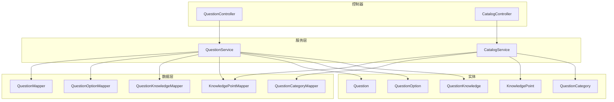
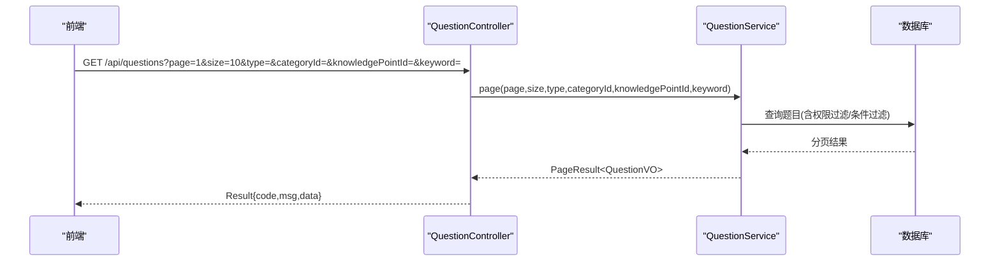
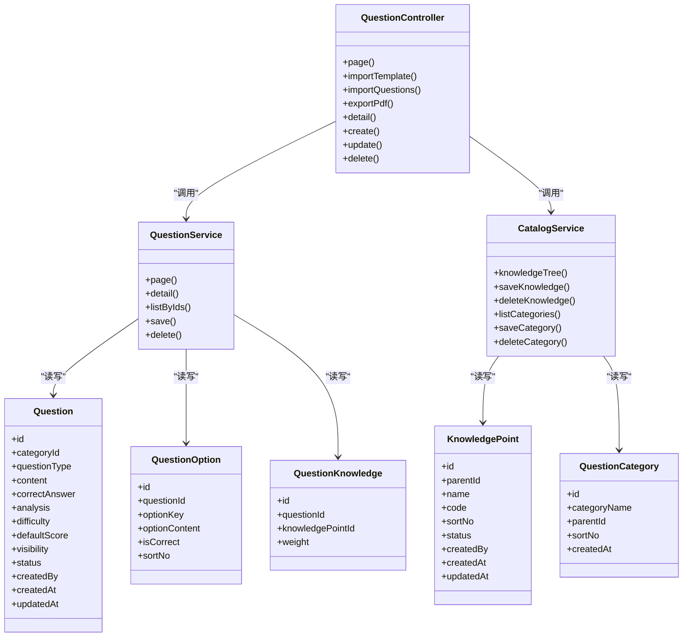

# 题库管理API

<cite>
**本文引用的文件**
- [QuestionController.java](file://exam-server/src/main/java/com/exam/controller/QuestionController.java)
- [CatalogController.java](file://exam-server/src/main/java/com/exam/controller/CatalogController.java)
- [QuestionService.java](file://exam-server/src/main/java/com/exam/service/QuestionService.java)
- [CatalogService.java](file://exam-server/src/main/java/com/exam/service/CatalogService.java)
- [QuestionSaveRequest.java](file://exam-server/src/main/java/com/exam/dto/QuestionSaveRequest.java)
- [QuestionImportRow.java](file://exam-server/src/main/java/com/exam/dto/QuestionImportRow.java)
- [QuestionExportRequest.java](file://exam-server/src/main/java/com/exam/dto/QuestionExportRequest.java)
- [QuestionTypes.java](file://exam-server/src/main/java/com/exam/util/QuestionTypes.java)
- [Question.java](file://exam-server/src/main/java/com/exam/entity/Question.java)
- [QuestionOption.java](file://exam-server/src/main/java/com/exam/entity/QuestionOption.java)
- [QuestionKnowledge.java](file://exam-server/src/main/java/com/exam/entity/QuestionKnowledge.java)
- [QuestionCategory.java](file://exam-server/src/main/java/com/exam/entity/QuestionCategory.java)
- [KnowledgePoint.java](file://exam-server/src/main/java/com/exam/entity/KnowledgePoint.java)
- [schema.sql](file://sql/schema.sql)
</cite>

## 目录
1. [简介](#简介)
2. [项目结构](#项目结构)
3. [核心组件](#核心组件)
4. [架构总览](#架构总览)
5. [详细接口说明](#详细接口说明)
6. [依赖关系分析](#依赖关系分析)
7. [性能与扩展性](#性能与扩展性)
8. [故障排查指南](#故障排查指南)
9. [结论](#结论)
10. [附录：数据模型与导入导出规范](#附录数据模型与导入导出规范)

## 简介
本模块提供题库管理的完整能力，包括题目增删改查、分类管理、知识点树维护、题目与知识点的关联、批量导入导出（Excel/PDF）、多题型支持（单选、多选、判断、填空、简答、关键词解释），以及查询过滤、分页排序、难度标记等高级功能。所有接口统一返回 Result 包装对象，分页返回 PageResult。

## 项目结构
题库管理相关代码主要分布在以下包：
- controller：对外暴露 REST 接口
- service：业务逻辑封装（含分页、校验、事务）
- entity：数据库实体映射
- dto：请求/响应数据传输对象
- util：题型常量与工具方法
- mapper：MyBatis-Plus 数据访问层（由框架生成）

图表来源
- [QuestionController.java:31-118](file://exam-server/src/main/java/com/exam/controller/QuestionController.java#L31-L118)
- [CatalogController.java:18-70](file://exam-server/src/main/java/com/exam/controller/CatalogController.java#L18-L70)
- [QuestionService.java:33-225](file://exam-server/src/main/java/com/exam/service/QuestionService.java#L33-L225)
- [CatalogService.java:21-139](file://exam-server/src/main/java/com/exam/service/CatalogService.java#L21-L139)

章节来源
- [QuestionController.java:31-118](file://exam-server/src/main/java/com/exam/controller/QuestionController.java#L31-L118)
- [CatalogController.java:18-70](file://exam-server/src/main/java/com/exam/controller/CatalogController.java#L18-L70)

## 核心组件
- QuestionController：题目CRUD、分页查询、导入模板下载、Excel批量导入、PDF导出
- CatalogController：知识点树与题库分类的CRUD
- QuestionService：题目保存、删除、分页、详情、按ID列表获取、选项与知识点关联处理
- CatalogService：知识点树构建与维护、题库分类维护
- QuestionTypes：题型常量、中文别名解析、默认分值、是否选择题/主观题判断
- 实体与DTO：Question、QuestionOption、QuestionKnowledge、KnowledgePoint、QuestionCategory、QuestionSaveRequest、QuestionImportRow、QuestionExportRequest

章节来源
- [QuestionService.java:33-225](file://exam-server/src/main/java/com/exam/service/QuestionService.java#L33-L225)
- [CatalogService.java:21-139](file://exam-server/src/main/java/com/exam/service/CatalogService.java#L21-L139)
- [QuestionTypes.java:1-123](file://exam-server/src/main/java/com/exam/util/QuestionTypes.java#L1-L123)
- [Question.java:11-30](file://exam-server/src/main/java/com/exam/entity/Question.java#L11-L30)
- [QuestionOption.java:8-20](file://exam-server/src/main/java/com/exam/entity/QuestionOption.java#L8-L20)
- [QuestionKnowledge.java:10-20](file://exam-server/src/main/java/com/exam/entity/QuestionKnowledge.java#L10-L20)
- [KnowledgePoint.java:10-25](file://exam-server/src/main/java/com/exam/entity/KnowledgePoint.java#L10-L25)
- [QuestionCategory.java:10-21](file://exam-server/src/main/java/com/exam/entity/QuestionCategory.java#L10-L21)
- [QuestionSaveRequest.java:8-31](file://exam-server/src/main/java/com/exam/dto/QuestionSaveRequest.java#L8-L31)
- [QuestionImportRow.java:6-38](file://exam-server/src/main/java/com/exam/dto/QuestionImportRow.java#L6-L38)
- [QuestionExportRequest.java:7-14](file://exam-server/src/main/java/com/exam/dto/QuestionExportRequest.java#L7-L14)

## 架构总览

图表来源
- [QuestionController.java:42-50](file://exam-server/src/main/java/com/exam/controller/QuestionController.java#L42-L50)
- [QuestionService.java:42-69](file://exam-server/src/main/java/com/exam/service/QuestionService.java#L42-L69)

## 详细接口说明

### 题目管理接口
基础路径：/api/questions

- 分页查询
  - 方法：GET
  - 路径：/api/questions
  - 参数：
    - page：页码，默认1
    - size：每页条数，默认10
    - type：题型过滤（SINGLE/MULTIPLE/JUDGE/FILL/ESSAY/TERM）
    - categoryId：分类ID
    - knowledgePointId：知识点ID
    - keyword：题干关键字模糊匹配
  - 返回：Result<PageResult<QuestionVO>>
  - 说明：非管理员仅可见 PUBLIC 或本人创建的题目；按 id 倒序

- 下载导入模板
  - 方法：GET
  - 路径：/api/questions/import-template
  - 返回：Excel 文件（.xlsx）

- 批量导入
  - 方法：POST
  - 路径：/api/questions/import
  - 表单字段：
    - file：Excel 文件（.xlsx 或 .xls）
    - defaultKnowledgePointId：可选，行内未填写知识点时使用的默认值
  - 限制：单次最多 2000 行
  - 返回：Result<ImportResult>（逐行失败原因）

- 导出为 PDF
  - 方法：POST
  - 路径：/api/questions/export-pdf
  - 请求体：QuestionExportRequest（ids、title、withAnswer）
  - 返回：PDF 二进制流

- 题目详情
  - 方法：GET
  - 路径：/api/questions/{id}
  - 返回：Result<QuestionVO>

- 新增题目
  - 方法：POST
  - 路径：/api/questions
  - 请求体：QuestionSaveRequest
  - 返回：Result<Long>（新题目ID）

- 更新题目
  - 方法：PUT
  - 路径：/api/questions/{id}
  - 请求体：QuestionSaveRequest（id 可省略，以路径为准）
  - 返回：Result<Long>

- 删除题目
  - 方法：DELETE
  - 路径：/api/questions/{id}
  - 返回：Result<Void>（逻辑删除）

章节来源
- [QuestionController.java:42-109](file://exam-server/src/main/java/com/exam/controller/QuestionController.java#L42-L109)
- [QuestionService.java:42-159](file://exam-server/src/main/java/com/exam/service/QuestionService.java#L42-L159)

### 分类与知识点管理接口
基础路径：/api/knowledge-points、/api/question-categories

- 知识点树
  - 方法：GET
  - 路径：/api/knowledge-points/tree
  - 返回：Result<List<TreeNode>>

- 新增知识点
  - 方法：POST
  - 路径：/api/knowledge-points
  - 请求体：KnowledgePoint
  - 返回：Result<KnowledgePoint>

- 更新知识点
  - 方法：PUT
  - 路径：/api/knowledge-points/{id}
  - 请求体：KnowledgePoint
  - 返回：Result<KnowledgePoint>

- 删除知识点
  - 方法：DELETE
  - 路径：/api/knowledge-points/{id}
  - 返回：Result<Void>（若存在子节点则拒绝）

- 获取题库分类列表
  - 方法：GET
  - 路径：/api/question-categories
  - 返回：Result<List<QuestionCategory>>

- 新增题库分类
  - 方法：POST
  - 路径：/api/question-categories
  - 请求体：QuestionCategory
  - 返回：Result<QuestionCategory>

- 更新题库分类
  - 方法：PUT
  - 路径：/api/question-categories/{id}
  - 请求体：QuestionCategory
  - 返回：Result<QuestionCategory>

- 删除题库分类
  - 方法：DELETE
  - 路径：/api/question-categories/{id}
  - 返回：Result<Void>

章节来源
- [CatalogController.java:24-68](file://exam-server/src/main/java/com/exam/controller/CatalogController.java#L24-L68)
- [CatalogService.java:28-105](file://exam-server/src/main/java/com/exam/service/CatalogService.java#L28-L105)

### 题目保存与多题型数据结构
- QuestionSaveRequest 字段
  - id：题目ID（编辑时传入）
  - categoryId：分类ID
  - questionType：题型（SINGLE/MULTIPLE/JUDGE/FILL/ESSAY/TERM）
  - content：题干
  - correctAnswer：正确答案（填空题/简答题/关键词解释题使用）
  - analysis：解析
  - difficulty：难度（整数）
  - defaultScore：默认分值（BigDecimal）
  - visibility：可见范围（PUBLIC 等）
  - options：选项列表（选择题必填）
    - optionKey：选项键（A/B/C/D...）
    - optionContent：选项内容
    - isCorrect：是否正确（1/0）
    - sortNo：排序号
  - knowledgePointIds：绑定的知识点ID列表（必填）

- 题型差异与规则
  - 选择题（SINGLE/MULTIPLE/JUDGE）：正确答案从 options 中 isCorrect=1 的 optionKey 汇总生成；必须提供 options
  - 主观题（FILL/ESSAY/TERM）：正确答案直接来自 correctAnswer
  - 必填校验：至少绑定一个知识点；题干不能为空；题型需合法
  - 默认分值：不同题型有默认分值策略（见附录）

章节来源
- [QuestionSaveRequest.java:8-31](file://exam-server/src/main/java/com/exam/dto/QuestionSaveRequest.java#L8-L31)
- [QuestionService.java:95-178](file://exam-server/src/main/java/com/exam/service/QuestionService.java#L95-L178)
- [QuestionTypes.java:12-123](file://exam-server/src/main/java/com/exam/util/QuestionTypes.java#L12-L123)

### 查询过滤、分页与排序
- 分页：page、size
- 过滤：
  - type：按题型过滤
  - categoryId：按分类过滤
  - knowledgePointId：按知识点过滤（通过中间表关联）
  - keyword：题干模糊匹配
- 排序：默认按题目 id 降序
- 权限控制：非管理员仅可见 PUBLIC 或本人创建的题目

章节来源
- [QuestionService.java:42-69](file://exam-server/src/main/java/com/exam/service/QuestionService.java#L42-L69)

### 批量导入导出
- 导入模板下载：/api/questions/import-template
- 批量导入：/api/questions/import
  - 支持 .xlsx/.xls
  - 最大行数：2000
  - 默认知识点：defaultKnowledgePointId（当行内知识点列为空时使用）
  - Excel 列定义见附录
- PDF 导出：/api/questions/export-pdf
  - 请求体：ids、title、withAnswer
  - 返回 PDF 二进制流

章节来源
- [QuestionController.java:52-86](file://exam-server/src/main/java/com/exam/controller/QuestionController.java#L52-L86)
- [QuestionExportRequest.java:7-14](file://exam-server/src/main/java/com/exam/dto/QuestionExportRequest.java#L7-L14)

## 依赖关系分析

图表来源
- [QuestionController.java:31-118](file://exam-server/src/main/java/com/exam/controller/QuestionController.java#L31-L118)
- [QuestionService.java:33-225](file://exam-server/src/main/java/com/exam/service/QuestionService.java#L33-L225)
- [CatalogService.java:21-139](file://exam-server/src/main/java/com/exam/service/CatalogService.java#L21-L139)
- [Question.java:11-30](file://exam-server/src/main/java/com/exam/entity/Question.java#L11-L30)
- [QuestionOption.java:8-20](file://exam-server/src/main/java/com/exam/entity/QuestionOption.java#L8-L20)
- [QuestionKnowledge.java:10-20](file://exam-server/src/main/java/com/exam/entity/QuestionKnowledge.java#L10-L20)
- [KnowledgePoint.java:10-25](file://exam-server/src/main/java/com/exam/entity/KnowledgePoint.java#L10-L25)
- [QuestionCategory.java:10-21](file://exam-server/src/main/java/com/exam/entity/QuestionCategory.java#L10-L21)

## 性能与扩展性
- 导入限制：单次导入上限 2000 行，避免大文件拖垮解析与事务
- 分页查询：基于 MyBatis-Plus Page，减少全量加载
- 索引优化：数据库层对常用字段建立索引（如 category_id、question_type、parent_id 等）
- 权限过滤：非管理员自动过滤可见范围，降低不必要的数据传输
- 可扩展点：
  - 题型扩展：在 QuestionTypes 中注册新题型及默认分值
  - 导入列扩展：在 QuestionImportRow 中增加列并适配导入服务
  - 导出格式：可在 PDF 导出服务中扩展更多布局与样式

[本节为通用指导，不直接分析具体文件]

## 故障排查指南
- 导入失败
  - 文件格式错误：请上传 .xlsx 或 .xls
  - 行数超限：拆分文件，确保不超过 2000 行
  - 行级错误：ImportResult 会返回每行的失败原因，根据提示修正
- 保存失败
  - 题型不支持：检查 questionType 是否为有效值
  - 未绑定知识点：至少选择一个知识点
  - 题干为空：请填写题干
  - 选择题未设置选项或未设置正确答案：补充 options 并确保至少一个选项标记为正确
- 删除失败
  - 知识点删除：若存在子节点，请先删除子节点再删除父节点
- 查询无结果
  - 权限限制：非管理员仅可见 PUBLIC 或本人创建的题目
  - 过滤条件过严：放宽 type/categoryId/knowledgePointId/keyword

章节来源
- [QuestionController.java:60-75](file://exam-server/src/main/java/com/exam/controller/QuestionController.java#L60-L75)
- [QuestionService.java:95-178](file://exam-server/src/main/java/com/exam/service/QuestionService.java#L95-L178)
- [CatalogService.java:57-68](file://exam-server/src/main/java/com/exam/service/CatalogService.java#L57-L68)

## 结论
本 API 文档覆盖了题库管理的核心能力：题目 CRUD、分类与知识点树维护、多题型支持、批量导入导出、查询过滤与分页排序。通过清晰的实体与 DTO 设计、严格的校验与权限控制，保证了系统的稳定性与可扩展性。建议在实际使用中结合导入模板与题型规范进行数据准备，充分利用知识点与分类提升组卷效率。

## 附录：数据模型与导入导出规范

### 数据模型概览
- 题目（question）
  - 字段：id、categoryId、questionType、content、correctAnswer、analysis、difficulty、defaultScore、visibility、status、createdBy、createdAt、updatedAt
- 选项（question_option）
  - 字段：id、questionId、optionKey、optionContent、isCorrect、sortNo
- 题目-知识点（question_knowledge）
  - 字段：id、questionId、knowledgePointId、weight
- 知识点（knowledge_point）
  - 字段：id、parentId、name、code、sortNo、status、createdBy、createdAt、updatedAt
- 题库分类（question_category）
  - 字段：id、categoryName、parentId、sortNo、createdAt

章节来源
- [schema.sql:31-87](file://sql/schema.sql#L31-L87)
- [Question.java:11-30](file://exam-server/src/main/java/com/exam/entity/Question.java#L11-L30)
- [QuestionOption.java:8-20](file://exam-server/src/main/java/com/exam/entity/QuestionOption.java#L8-L20)
- [QuestionKnowledge.java:10-20](file://exam-server/src/main/java/com/exam/entity/QuestionKnowledge.java#L10-L20)
- [KnowledgePoint.java:10-25](file://exam-server/src/main/java/com/exam/entity/KnowledgePoint.java#L10-L25)
- [QuestionCategory.java:10-21](file://exam-server/src/main/java/com/exam/entity/QuestionCategory.java#L10-L21)

### 导入 Excel 列规范
- 题型：单选题/多选题/判断题/填空题/简答题/关键词解释题（支持中文别名）
- 题干：题目正文
- 选项A~F：用于选择题的选项内容
- 正确答案：主观题填写；选择题留空（由选项 isCorrect 决定）
- 解析：题目解析
- 难度：整数
- 默认分值：数值
- 知识点：知识点名称或编码（未填写时使用 defaultKnowledgePointId）
- 可见范围：如 PUBLIC

章节来源
- [QuestionImportRow.java:6-38](file://exam-server/src/main/java/com/exam/dto/QuestionImportRow.java#L6-L38)
- [QuestionTypes.java:27-86](file://exam-server/src/main/java/com/exam/util/QuestionTypes.java#L27-L86)

### 题型与默认分值
- 单选题：默认分值 2
- 多选题：默认分值 4
- 判断题：默认分值 2
- 填空题：默认分值 2
- 简答题：默认分值 10
- 关键词解释题：默认分值 5

章节来源
- [QuestionTypes.java:102-121](file://exam-server/src/main/java/com/exam/util/QuestionTypes.java#L102-L121)