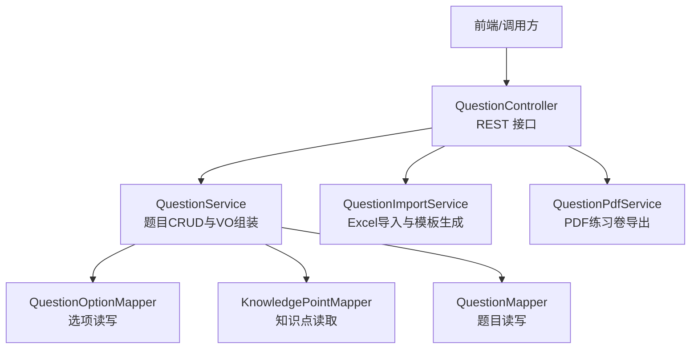
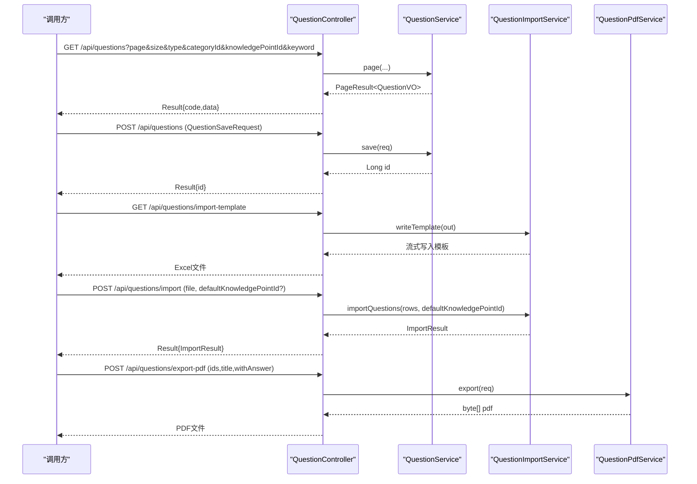
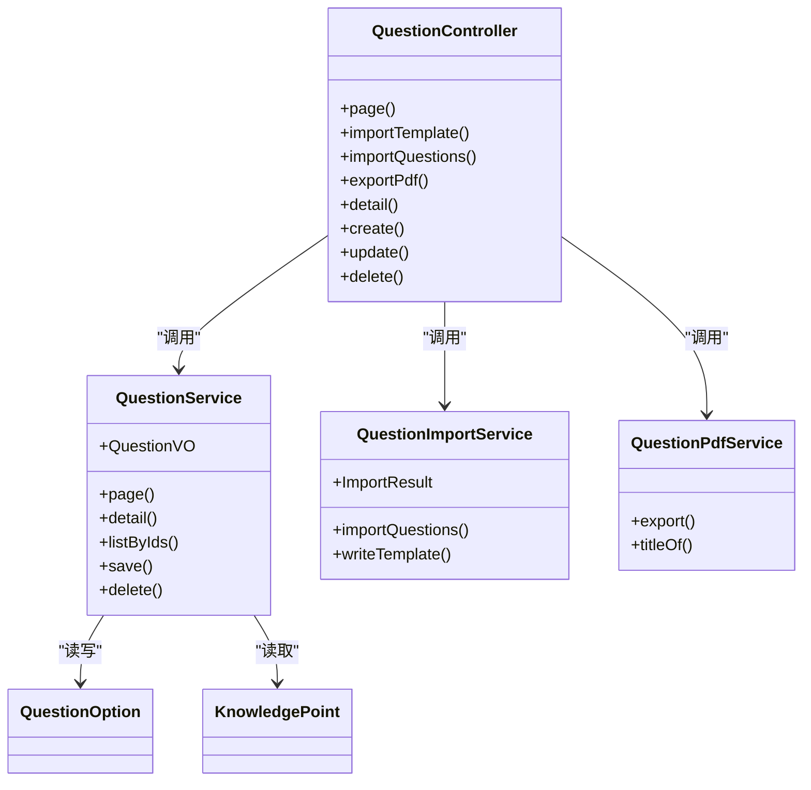

# 题目管理API

<cite>
**本文引用的文件**
- [QuestionController.java](file://exam-server/src/main/java/com/exam/controller/QuestionController.java)
- [QuestionService.java](file://exam-server/src/main/java/com/exam/service/QuestionService.java)
- [QuestionImportService.java](file://exam-server/src/main/java/com/exam/service/QuestionImportService.java)
- [QuestionPdfService.java](file://exam-server/src/main/java/com/exam/service/QuestionPdfService.java)
- [QuestionSaveRequest.java](file://exam-server/src/main/java/com/exam/dto/QuestionSaveRequest.java)
- [QuestionExportRequest.java](file://exam-server/src/main/java/com/exam/dto/QuestionExportRequest.java)
- [QuestionImportRow.java](file://exam-server/src/main/java/com/exam/dto/QuestionImportRow.java)
- [QuestionTypes.java](file://exam-server/src/main/java/com/exam/util/QuestionTypes.java)
- [PageResult.java](file://exam-server/src/main/java/com/exam/common/PageResult.java)
- [Result.java](file://exam-server/src/main/java/com/exam/common/Result.java)
- [BizException.java](file://exam-server/src/main/java/com/exam/common/BizException.java)
- [QuestionOption.java](file://exam-server/src/main/java/com/exam/entity/QuestionOption.java)
- [KnowledgePoint.java](file://exam-server/src/main/java/com/exam/entity/KnowledgePoint.java)
</cite>

## 目录
1. [简介](#简介)
2. [项目结构](#项目结构)
3. [核心组件](#核心组件)
4. [架构总览](#架构总览)
5. [详细接口说明](#详细接口说明)
6. [依赖关系分析](#依赖关系分析)
7. [性能与限制](#性能与限制)
8. [故障排查指南](#故障排查指南)
9. [结论](#结论)
10. [附录：题型与字段规范](#附录题型与字段规范)

## 简介
本模块提供题库的完整管理能力，包括题目的创建、查询、更新、删除；支持分页与多维度过滤（题型、分类ID、知识点ID、关键词）；提供Excel批量导入导出模板下载、批量导入（单批最多2000行）、以及按选中题目导出PDF练习卷。系统内置多题型支持（单选、多选、判断、填空、简答、关键词解释），并对不同题型的字段要求与校验规则进行统一约束。

## 项目结构
题目管理相关代码主要位于后端 exam-server 中，采用控制器-服务-数据访问的分层结构：
- 控制器层：暴露HTTP接口，处理请求参数与响应封装
- 服务层：实现业务逻辑，如分页查询、保存、导入、PDF导出等
- 实体与DTO：定义数据库映射、请求/响应数据结构
- 工具与通用：题型常量、分页结果、统一返回体、异常类型

图表来源
- [QuestionController.java:31-117](file://exam-server/src/main/java/com/exam/controller/QuestionController.java#L31-L117)
- [QuestionService.java:33-224](file://exam-server/src/main/java/com/exam/service/QuestionService.java#L33-L224)
- [QuestionImportService.java:28-422](file://exam-server/src/main/java/com/exam/service/QuestionImportService.java#L28-L422)
- [QuestionPdfService.java:39-322](file://exam-server/src/main/java/com/exam/service/QuestionPdfService.java#L39-L322)

章节来源
- [QuestionController.java:31-117](file://exam-server/src/main/java/com/exam/controller/QuestionController.java#L31-L117)
- [QuestionService.java:33-224](file://exam-server/src/main/java/com/exam/service/QuestionService.java#L33-L224)

## 核心组件
- QuestionController：对外暴露 /api/questions 下的所有接口，包含分页查询、详情、创建、更新、删除、导入模板下载、批量导入、PDF导出。
- QuestionService：实现题目分页、详情、保存（含选项与知识点关联）、软删除、按ID列表获取用于PDF导出。
- QuestionImportService：解析Excel导入行，逐行校验并调用保存；生成带示例和填写说明的导入模板；支持默认知识点回填。
- QuestionPdfService：根据选中的题目生成PDF练习卷，支持标题、是否附答案与解析、按题型分组编号、中文排版与字体回退策略。
- 通用模型：Result、PageResult、BizException、QuestionTypes、QuestionOption、KnowledgePoint。

章节来源
- [QuestionController.java:31-117](file://exam-server/src/main/java/com/exam/controller/QuestionController.java#L31-L117)
- [QuestionService.java:33-224](file://exam-server/src/main/java/com/exam/service/QuestionService.java#L33-L224)
- [QuestionImportService.java:28-422](file://exam-server/src/main/java/com/exam/service/QuestionImportService.java#L28-L422)
- [QuestionPdfService.java:39-322](file://exam-server/src/main/java/com/exam/service/QuestionPdfService.java#L39-L322)
- [Result.java:1-38](file://exam-server/src/main/java/com/exam/common/Result.java#L1-L38)
- [PageResult.java:1-20](file://exam-server/src/main/java/com/exam/common/PageResult.java#L1-L20)
- [BizException.java:1-22](file://exam-server/src/main/java/com/exam/common/BizException.java#L1-L22)
- [QuestionTypes.java:1-123](file://exam-server/src/main/java/com/exam/util/QuestionTypes.java#L1-L123)
- [QuestionOption.java:1-20](file://exam-server/src/main/java/com/exam/entity/QuestionOption.java#L1-L20)
- [KnowledgePoint.java:1-25](file://exam-server/src/main/java/com/exam/entity/KnowledgePoint.java#L1-L25)

## 架构总览
题目管理的核心流程如下：
- 分页查询：控制器接收分页与过滤参数，服务层构建查询条件并返回分页结果。
- 保存题目：控制器接收保存请求，服务层校验题型、题干、知识点绑定、选项与正确答案，持久化题目、选项与知识点关联。
- 批量导入：控制器接收Excel文件，限制行数上限，服务层逐行解析并调用保存，汇总成功/失败行信息。
- PDF导出：控制器接收题目ID列表与导出配置，服务层按题型分组生成PDF，支持答案与解析输出。

图表来源
- [QuestionController.java:42-86](file://exam-server/src/main/java/com/exam/controller/QuestionController.java#L42-L86)
- [QuestionService.java:42-151](file://exam-server/src/main/java/com/exam/service/QuestionService.java#L42-L151)
- [QuestionImportService.java:41-63](file://exam-server/src/main/java/com/exam/service/QuestionImportService.java#L41-L63)
- [QuestionPdfService.java:83-138](file://exam-server/src/main/java/com/exam/service/QuestionPdfService.java#L83-L138)

## 详细接口说明

### 通用约定
- 基础路径：/api/questions
- 统一返回体：Result<T>，包含 code、message、data。成功时 code=0，data 为业务数据。
- 分页返回体：PageResult<T>，包含 total（总条数）与 records（当前页记录）。
- 错误处理：业务异常通过 BizException 抛出，由全局处理器转换为 Result 返回。

章节来源
- [Result.java:1-38](file://exam-server/src/main/java/com/exam/common/Result.java#L1-L38)
- [PageResult.java:1-20](file://exam-server/src/main/java/com/exam/common/PageResult.java#L1-L20)
- [BizException.java:1-22](file://exam-server/src/main/java/com/exam/common/BizException.java#L1-L22)

### 分页查询题目
- 方法：GET
- 路径：/api/questions
- 查询参数：
  - page：页码，默认1
  - size：每页条数，默认10
  - type：题型过滤，可选（SINGLE/MULTIPLE/JUDGE/FILL/ESSAY/TERM）
  - categoryId：分类ID，可选
  - knowledgePointId：知识点ID，可选
  - keyword：关键词，对题干内容模糊匹配，可选
- 返回：Result<PageResult<QuestionVO>>
- 行为说明：
  - 非管理员仅可见公开或本人创建的题目
  - 按知识点ID过滤会先查询该知识点关联的题目ID集合再IN查询
  - 结果按id降序排列

章节来源
- [QuestionController.java:42-50](file://exam-server/src/main/java/com/exam/controller/QuestionController.java#L42-L50)
- [QuestionService.java:42-69](file://exam-server/src/main/java/com/exam/service/QuestionService.java#L42-L69)

### 获取题目详情
- 方法：GET
- 路径：/api/questions/{id}
- 路径参数：id（题目ID）
- 返回：Result<QuestionVO>
- 行为说明：
  - 若题目不存在或已删除，返回业务错误
  - VO中包含题目基本信息、选项列表、知识点ID与名称

章节来源
- [QuestionController.java:88-91](file://exam-server/src/main/java/com/exam/controller/QuestionController.java#L88-L91)
- [QuestionService.java:71-77](file://exam-server/src/main/java/com/exam/service/QuestionService.java#L71-L77)
- [QuestionService.java:180-205](file://exam-server/src/main/java/com/exam/service/QuestionService.java#L180-L205)

### 创建题目
- 方法：POST
- 路径：/api/questions
- 请求体：QuestionSaveRequest
- 返回：Result<Long>（新题目ID）
- 必填与校验：
  - questionType：必须为支持的题型
  - content：题干必填
  - knowledgePointIds：至少绑定一个知识点
  - options：选择题必须提供选项，且至少两个
  - correctAnswer：选择题从选项 isCorrect 汇总；非选择题需直接提供
- 行为说明：
  - 新增时设置创建人、时间戳；更新时覆盖选项与知识点关联

章节来源
- [QuestionController.java:93-97](file://exam-server/src/main/java/com/exam/controller/QuestionController.java#L93-L97)
- [QuestionService.java:95-151](file://exam-server/src/main/java/com/exam/service/QuestionService.java#L95-L151)
- [QuestionSaveRequest.java:1-31](file://exam-server/src/main/java/com/exam/dto/QuestionSaveRequest.java#L1-L31)

### 更新题目
- 方法：PUT
- 路径：/api/questions/{id}
- 路径参数：id（题目ID）
- 请求体：QuestionSaveRequest（id可忽略，以路径为准）
- 返回：Result<Long>（题目ID）
- 行为说明：同创建时的校验与保存逻辑，同时清理旧选项与知识点关联后重建

章节来源
- [QuestionController.java:99-103](file://exam-server/src/main/java/com/exam/controller/QuestionController.java#L99-L103)
- [QuestionService.java:95-151](file://exam-server/src/main/java/com/exam/service/QuestionService.java#L95-L151)

### 删除题目
- 方法：DELETE
- 路径：/api/questions/{id}
- 路径参数：id（题目ID）
- 返回：Result<Void>
- 行为说明：软删除，将状态置为0

章节来源
- [QuestionController.java:105-109](file://exam-server/src/main/java/com/exam/controller/QuestionController.java#L105-L109)
- [QuestionService.java:153-159](file://exam-server/src/main/java/com/exam/service/QuestionService.java#L153-L159)

### 下载导入模板
- 方法：GET
- 路径：/api/questions/import-template
- 返回：Excel文件（application/vnd.openxmlformats-officedocument.spreadsheetml.sheet）
- 行为说明：
  - 模板包含示例数据与“填写说明”两页
  - 文件名使用中文，并设置Content-Disposition供浏览器下载

章节来源
- [QuestionController.java:52-58](file://exam-server/src/main/java/com/exam/controller/QuestionController.java#L52-L58)
- [QuestionImportService.java:326-342](file://exam-server/src/main/java/com/exam/service/QuestionImportService.java#L326-L342)

### 批量导入题目
- 方法：POST
- 路径：/api/questions/import
- 表单参数：
  - file：Excel文件（.xlsx 或 .xls）
  - defaultKnowledgePointId：可选，当Excel中知识点列为空时使用
- 返回：Result<ImportResult>
- 限制与行为：
  - 单次导入最大2000行，超出则报错
  - 逐行校验并保存，失败行不影响其他行
  - ImportResult包含total、success、failed与errors（每行错误信息）
- Excel列映射：
  - 题型、题干、选项A-F、正确答案、解析、难度、默认分值、知识点、可见范围

章节来源
- [QuestionController.java:60-75](file://exam-server/src/main/java/com/exam/controller/QuestionController.java#L60-L75)
- [QuestionImportService.java:41-63](file://exam-server/src/main/java/com/exam/service/QuestionImportService.java#L41-L63)
- [QuestionImportRow.java:1-38](file://exam-server/src/main/java/com/exam/dto/QuestionImportRow.java#L1-L38)

### 导出PDF练习卷
- 方法：POST
- 路径：/api/questions/export-pdf
- 请求体：QuestionExportRequest
  - ids：选中的题目ID列表
  - title：练习卷标题（为空时使用默认标题）
  - withAnswer：是否附带答案与解析
- 返回：PDF文件（application/pdf）
- 行为说明：
  - 按题型分组编号，支持中文序号
  - 填空题留白2行，主观题留白6行
  - 判断题在答案中将选项key替换为选项文字
  - 字体查找顺序：配置项 → classpath:fonts → Windows常见字体 → Linux常见CJK字体

章节来源
- [QuestionController.java:77-86](file://exam-server/src/main/java/com/exam/controller/QuestionController.java#L77-L86)
- [QuestionPdfService.java:71-138](file://exam-server/src/main/java/com/exam/service/QuestionPdfService.java#L71-L138)
- [QuestionExportRequest.java:1-14](file://exam-server/src/main/java/com/exam/dto/QuestionExportRequest.java#L1-L14)

## 依赖关系分析
- 控制器依赖服务：QuestionController 依赖 QuestionService、QuestionImportService、QuestionPdfService
- 服务间协作：
  - QuestionImportService 调用 QuestionService.save 完成逐行导入
  - QuestionPdfService 调用 QuestionService.listByIds 获取题目VO用于导出
- 数据访问：
  - QuestionService 通过 Mapper 访问题目、选项、知识点表
  - QuestionImportService 通过 KnowledgePointMapper 解析知识点路径与名称

图表来源
- [QuestionController.java:31-117](file://exam-server/src/main/java/com/exam/controller/QuestionController.java#L31-L117)
- [QuestionService.java:33-224](file://exam-server/src/main/java/com/exam/service/QuestionService.java#L33-L224)
- [QuestionImportService.java:28-422](file://exam-server/src/main/java/com/exam/service/QuestionImportService.java#L28-L422)
- [QuestionPdfService.java:39-322](file://exam-server/src/main/java/com/exam/service/QuestionPdfService.java#L39-L322)
- [QuestionOption.java:1-20](file://exam-server/src/main/java/com/exam/entity/QuestionOption.java#L1-L20)
- [KnowledgePoint.java:1-25](file://exam-server/src/main/java/com/exam/entity/KnowledgePoint.java#L1-L25)

章节来源
- [QuestionController.java:31-117](file://exam-server/src/main/java/com/exam/controller/QuestionController.java#L31-L117)
- [QuestionService.java:33-224](file://exam-server/src/main/java/com/exam/service/QuestionService.java#L33-L224)
- [QuestionImportService.java:28-422](file://exam-server/src/main/java/com/exam/service/QuestionImportService.java#L28-L422)
- [QuestionPdfService.java:39-322](file://exam-server/src/main/java/com/exam/service/QuestionPdfService.java#L39-L322)

## 性能与限制
- 批量导入行数限制：单次导入最多2000行，避免解析与事务压力过大
- 分页查询：按id降序，支持题型、分类ID、知识点ID、关键词过滤
- PDF导出：按题型分组，主观题留白更多；字体加载有缓存策略
- 保存操作：更新时会先删除旧选项与知识点关联，再重建，确保一致性

章节来源
- [QuestionController.java:39-75](file://exam-server/src/main/java/com/exam/controller/QuestionController.java#L39-L75)
- [QuestionService.java:127-149](file://exam-server/src/main/java/com/exam/service/QuestionService.java#L127-L149)
- [QuestionPdfService.java:61-69](file://exam-server/src/main/java/com/exam/service/QuestionPdfService.java#L61-L69)

## 故障排查指南
- 常见业务错误：
  - 不支持的题型：检查questionType是否为有效值
  - 未绑定知识点：保存时必须至少绑定一个知识点
  - 题干为空：content必填
  - 选择题选项不足：至少两个选项
  - 正确答案格式错误：选择题需从选项isCorrect汇总；判断题接受多种写法
  - 导入行数超限：拆分文件，确保不超过2000行
  - 知识点不存在或歧义：使用完整路径或确认名称唯一性
  - PDF字体缺失：配置exam.pdf-font-path或部署中文字体
- 错误返回：
  - 统一通过Result返回，code非0表示失败，message描述错误原因
  - 业务异常通过BizException抛出，携带code与message

章节来源
- [QuestionService.java:95-178](file://exam-server/src/main/java/com/exam/service/QuestionService.java#L95-L178)
- [QuestionImportService.java:65-189](file://exam-server/src/main/java/com/exam/service/QuestionImportService.java#L65-L189)
- [QuestionPdfService.java:83-138](file://exam-server/src/main/java/com/exam/service/QuestionPdfService.java#L83-L138)
- [BizException.java:1-22](file://exam-server/src/main/java/com/exam/common/BizException.java#L1-L22)
- [Result.java:1-38](file://exam-server/src/main/java/com/exam/common/Result.java#L1-L38)

## 结论
题目管理模块提供了完整的CRUD能力与丰富的扩展功能，包括多维度分页查询、批量导入导出、PDF练习卷生成等。系统对多题型进行了统一建模与校验，确保数据一致性与可用性。建议在生产环境合理配置PDF字体与导入行数限制，以提升稳定性与用户体验。

## 附录：题型与字段规范

### 支持的题型
- SINGLE：单选题
- MULTIPLE：多选题
- JUDGE：判断题
- FILL：填空题
- ESSAY：简答题
- TERM：关键词解释题

章节来源
- [QuestionTypes.java:12-22](file://exam-server/src/main/java/com/exam/util/QuestionTypes.java#L12-L22)
- [QuestionTypes.java:27-48](file://exam-server/src/main/java/com/exam/util/QuestionTypes.java#L27-L48)

### 各题型字段要求
- 单选题/多选题/判断题（选择题）：
  - 必须提供options列表，每个选项包含optionKey、optionContent、isCorrect、sortNo
  - 正确答案由选项中isCorrect=1的optionKey汇总
  - 单选题正确答案必须且只能有一个；多选题至少两个
  - 判断题可留空选项，系统自动生成A=正确、B=错误
- 填空题：
  - 正确答案必填，多个空位可用|分隔
  - 无需options
- 简答题/关键词解释题（主观题）：
  - 正确答案可为参考答案，允许为空
  - 无需options

章节来源
- [QuestionService.java:161-178](file://exam-server/src/main/java/com/exam/service/QuestionService.java#L161-L178)
- [QuestionImportService.java:86-138](file://exam-server/src/main/java/com/exam/service/QuestionImportService.java#L86-L138)
- [QuestionSaveRequest.java:8-31](file://exam-server/src/main/java/com/exam/dto/QuestionSaveRequest.java#L8-L31)

### 分页查询参数与过滤
- page、size：分页参数
- type：题型过滤
- categoryId：分类ID过滤
- knowledgePointId：知识点ID过滤（基于题目-知识点关联表）
- keyword：题干内容模糊匹配

章节来源
- [QuestionController.java:42-50](file://exam-server/src/main/java/com/exam/controller/QuestionController.java#L42-L50)
- [QuestionService.java:42-69](file://exam-server/src/main/java/com/exam/service/QuestionService.java#L42-L69)

### 题目详情返回结构（QuestionVO）
- id：题目ID
- categoryId：分类ID
- questionType：题型
- content：题干
- correctAnswer：正确答案
- analysis：解析
- difficulty：难度
- defaultScore：默认分值
- visibility：可见范围
- createdBy：创建人ID
- createdAt：创建时间
- options：选项列表（选择题）
- knowledgePointIds：知识点ID列表
- knowledgePointNames：知识点名称列表

章节来源
- [QuestionService.java:180-224](file://exam-server/src/main/java/com/exam/service/QuestionService.java#L180-L224)
- [QuestionOption.java:1-20](file://exam-server/src/main/java/com/exam/entity/QuestionOption.java#L1-L20)

### 批量导入Excel列说明
- 题型：必填，支持中文别名或英文代码
- 题干：必填，填空题用下划线表示空位
- 选项A-F：选择题至少两个；判断题可留空
- 正确答案：按题型要求填写
- 解析：可选
- 难度：1-3整数，默认1
- 默认分值：大于0的数字，按题型默认
- 知识点：名称或路径，多个用|分隔；留空使用默认知识点
- 可见范围：公开或私有，默认公开

章节来源
- [QuestionImportRow.java:1-38](file://exam-server/src/main/java/com/exam/dto/QuestionImportRow.java#L1-L38)
- [QuestionImportService.java:386-398](file://exam-server/src/main/java/com/exam/service/QuestionImportService.java#L386-L398)

### 请求与响应示例（路径引用）
- 分页查询：参考 [QuestionController.java:42-50](file://exam-server/src/main/java/com/exam/controller/QuestionController.java#L42-L50)
- 详情获取：参考 [QuestionController.java:88-91](file://exam-server/src/main/java/com/exam/controller/QuestionController.java#L88-L91)
- 创建/更新：参考 [QuestionController.java:93-103](file://exam-server/src/main/java/com/exam/controller/QuestionController.java#L93-L103)
- 删除：参考 [QuestionController.java:105-109](file://exam-server/src/main/java/com/exam/controller/QuestionController.java#L105-L109)
- 模板下载：参考 [QuestionController.java:52-58](file://exam-server/src/main/java/com/exam/controller/QuestionController.java#L52-L58)
- 批量导入：参考 [QuestionController.java:60-75](file://exam-server/src/main/java/com/exam/controller/QuestionController.java#L60-L75)
- PDF导出：参考 [QuestionController.java:77-86](file://exam-server/src/main/java/com/exam/controller/QuestionController.java#L77-L86)