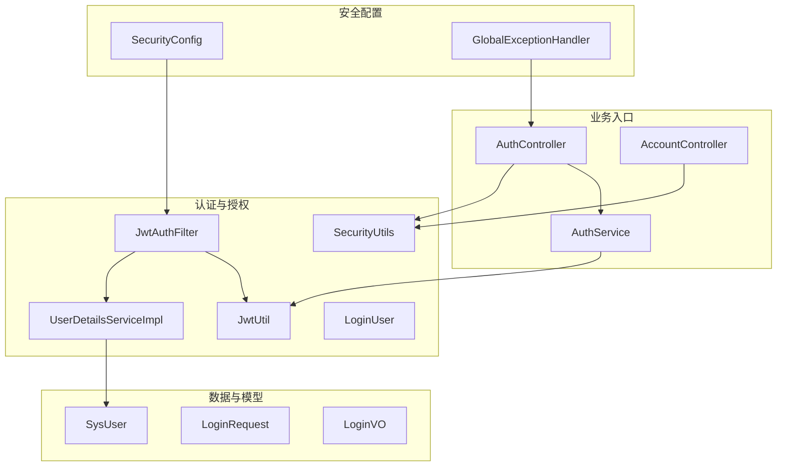
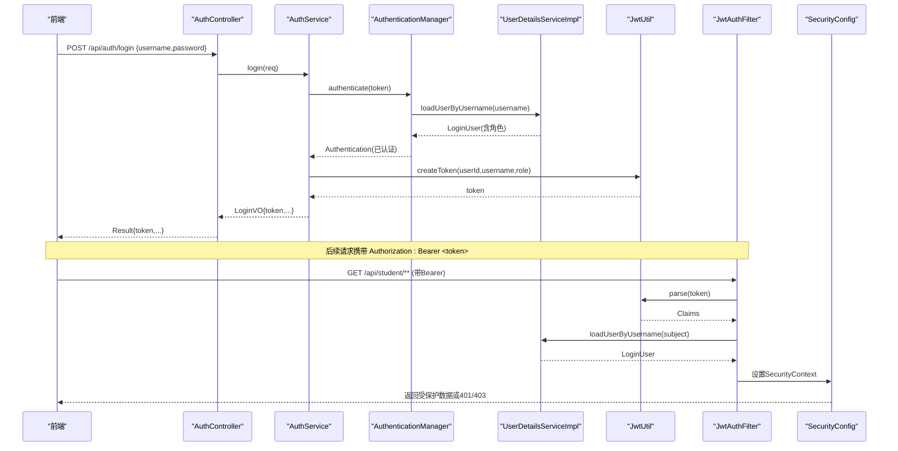
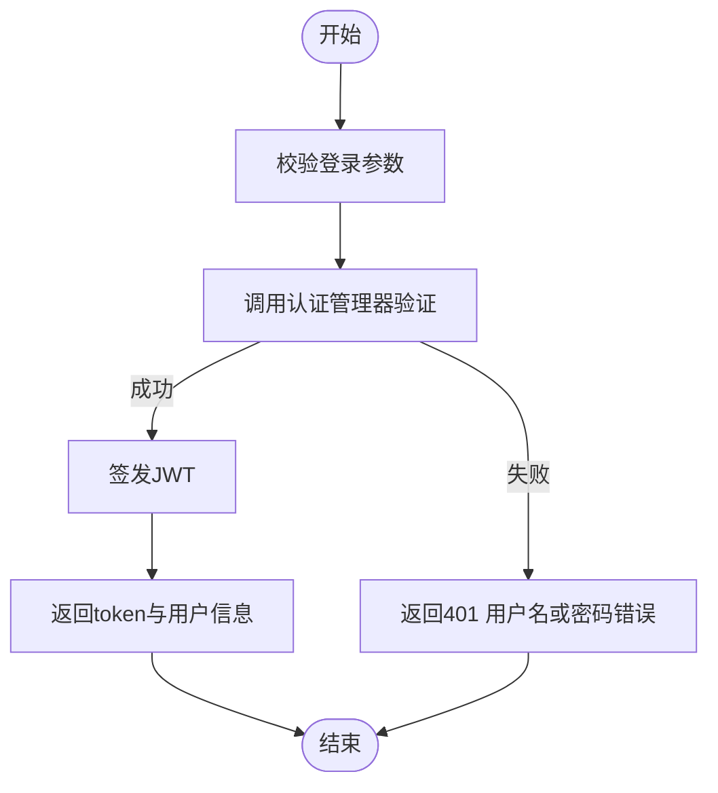
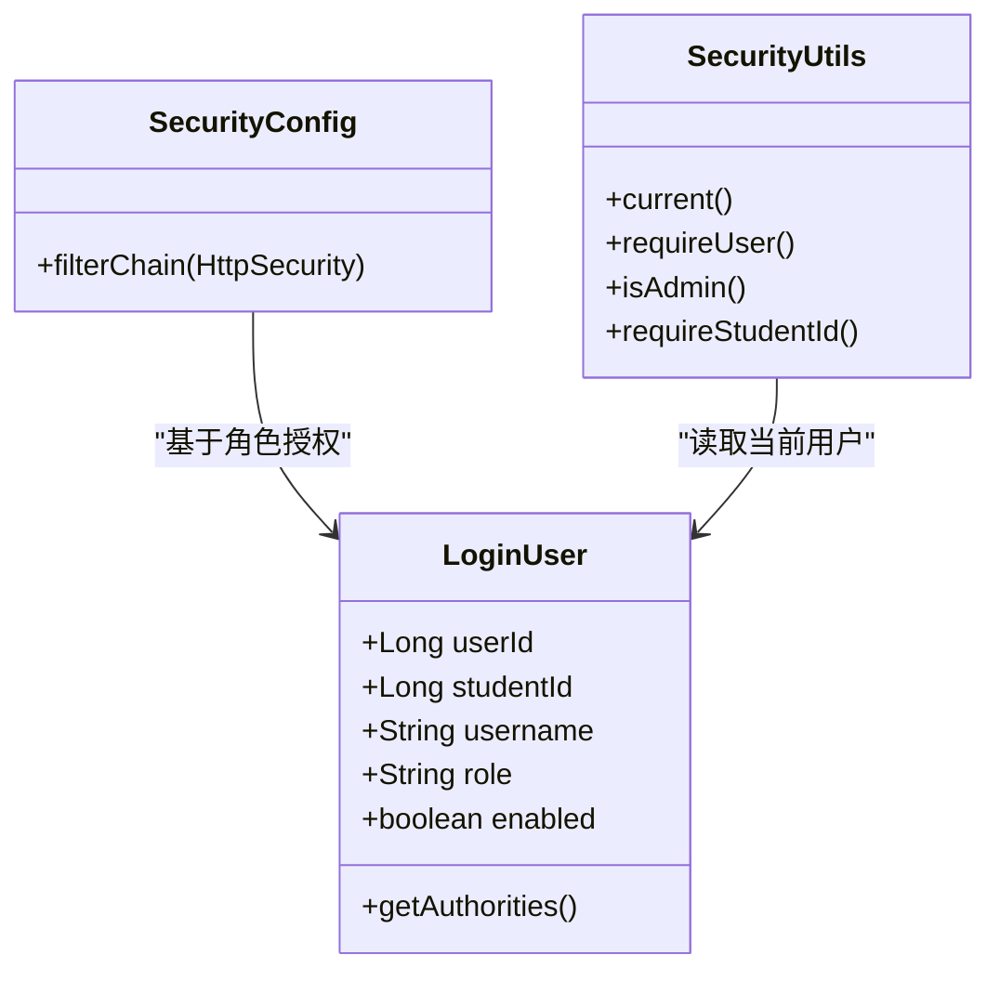
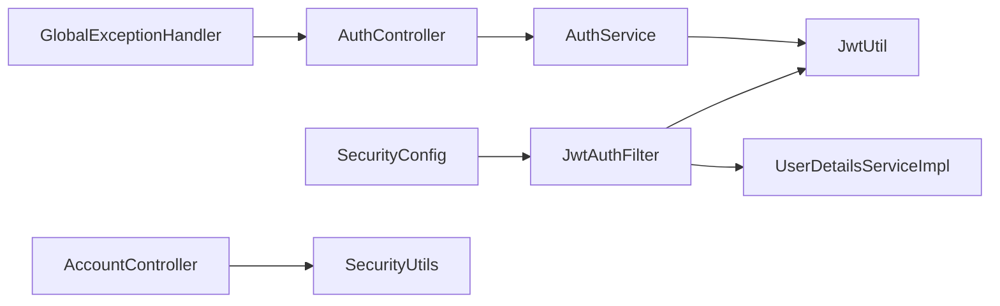

# 安全与认证

<cite>
**本文引用的文件**
- [SecurityConfig.java](file://exam-server/src/main/java/com/exam/config/SecurityConfig.java)
- [JwtAuthFilter.java](file://exam-server/src/main/java/com/exam/security/JwtAuthFilter.java)
- [JwtUtil.java](file://exam-server/src/main/java/com/exam/security/JwtUtil.java)
- [LoginUser.java](file://exam-server/src/main/java/com/exam/security/LoginUser.java)
- [UserDetailsServiceImpl.java](file://exam-server/src/main/java/com/exam/security/UserDetailsServiceImpl.java)
- [SecurityUtils.java](file://exam-server/src/main/java/com/exam/security/SecurityUtils.java)
- [AuthController.java](file://exam-server/src/main/java/com/exam/controller/AuthController.java)
- [AuthService.java](file://exam-server/src/main/java/com/exam/service/AuthService.java)
- [AccountController.java](file://exam-server/src/main/java/com/exam/controller/AccountController.java)
- [LoginRequest.java](file://exam-server/src/main/java/com/exam/dto/LoginRequest.java)
- [LoginVO.java](file://exam-server/src/main/java/com/exam/dto/LoginVO.java)
- [SysUser.java](file://exam-server/src/main/java/com/exam/entity/SysUser.java)
- [BizException.java](file://exam-server/src/main/java/com/exam/common/BizException.java)
- [GlobalExceptionHandler.java](file://exam-server/src/main/java/com/exam/common/GlobalExceptionHandler.java)
- [application.yml](file://exam-server/src/main/resources/application.yml)
</cite>

## 目录
1. [简介](#简介)
2. [项目结构](#项目结构)
3. [核心组件](#核心组件)
4. [架构总览](#架构总览)
5. [详细组件分析](#详细组件分析)
6. [依赖关系分析](#依赖关系分析)
7. [性能与安全配置建议](#性能与安全配置建议)
8. [故障排查指南](#故障排查指南)
9. [结论](#结论)
10. [附录](#附录)

## 简介
本章节面向教学考试平台的安全与认证机制，聚焦以下目标：
- 基于无状态 JWT 的令牌认证流程、登录验证与会话管理策略
- 基于角色的访问控制（RBAC）：管理员、教师、学生三类角色的权限分配与接口保护
- 密码加密存储、输入校验、SQL 注入防护、XSS 防护等安全措施
- 安全配置要点与常见问题解决方案

## 项目结构
安全相关代码主要分布在后端 exam-server 中，采用分层组织：
- 配置层：Spring Security 全局配置、CORS、异常处理、密码编码器
- 安全层：JWT 过滤器、工具类、用户详情加载、当前用户上下文工具
- 控制器与服务层：登录认证、用户资料、角色化接口保护
- 数据层：用户实体、Mapper、MyBatis-Plus 查询条件（防 SQL 注入）
- 配置资源：JWT 密钥与过期时间、数据库初始化等

图表来源
- [SecurityConfig.java:37-65](file://exam-server/src/main/java/com/exam/config/SecurityConfig.java#L37-L65)
- [JwtAuthFilter.java:29-50](file://exam-server/src/main/java/com/exam/security/JwtAuthFilter.java#L29-L50)
- [JwtUtil.java:21-42](file://exam-server/src/main/java/com/exam/security/JwtUtil.java#L21-L42)
- [UserDetailsServiceImpl.java:22-39](file://exam-server/src/main/java/com/exam/security/UserDetailsServiceImpl.java#L22-L39)
- [AuthController.java:31-46](file://exam-server/src/main/java/com/exam/controller/AuthController.java#L31-L46)
- [AuthService.java:22-38](file://exam-server/src/main/java/com/exam/service/AuthService.java#L22-L38)
- [AccountController.java:32-51](file://exam-server/src/main/java/com/exam/controller/AccountController.java#L32-L51)
- [GlobalExceptionHandler.java:20-52](file://exam-server/src/main/java/com/exam/common/GlobalExceptionHandler.java#L20-L52)

章节来源
- [SecurityConfig.java:25-88](file://exam-server/src/main/java/com/exam/config/SecurityConfig.java#L25-L88)
- [application.yml:31-33](file://exam-server/src/main/resources/application.yml#L31-L33)

## 核心组件
- 安全过滤链与路由授权：通过 Spring Security 配置关闭 Session、启用无状态模式，按路径与角色限制访问。
- JWT 过滤器：从请求头提取 Bearer Token，解析并设置当前认证上下文。
- 用户详情服务：根据用户名加载用户信息，学生角色额外关联学生主键。
- 登录服务：使用 AuthenticationManager 校验凭证，成功后签发 JWT。
- 安全工具：提供当前用户获取、强制登录检查、学生身份校验等便捷方法。
- 统一异常处理：将认证失败、鉴权失败、参数校验错误等统一为 JSON 响应。

章节来源
- [SecurityConfig.java:37-65](file://exam-server/src/main/java/com/exam/config/SecurityConfig.java#L37-L65)
- [JwtAuthFilter.java:29-50](file://exam-server/src/main/java/com/exam/security/JwtAuthFilter.java#L29-L50)
- [UserDetailsServiceImpl.java:22-39](file://exam-server/src/main/java/com/exam/security/UserDetailsServiceImpl.java#L22-L39)
- [AuthService.java:22-38](file://exam-server/src/main/java/com/exam/service/AuthService.java#L22-L38)
- [SecurityUtils.java:11-38](file://exam-server/src/main/java/com/exam/security/SecurityUtils.java#L11-L38)
- [GlobalExceptionHandler.java:20-52](file://exam-server/src/main/java/com/exam/common/GlobalExceptionHandler.java#L20-L52)

## 架构总览
下图展示一次登录到受保护接口调用的完整调用链，包括认证、授权与异常处理。

图表来源
- [AuthController.java:31-46](file://exam-server/src/main/java/com/exam/controller/AuthController.java#L31-L46)
- [AuthService.java:22-38](file://exam-server/src/main/java/com/exam/service/AuthService.java#L22-L38)
- [UserDetailsServiceImpl.java:22-39](file://exam-server/src/main/java/com/exam/security/UserDetailsServiceImpl.java#L22-L39)
- [JwtUtil.java:21-42](file://exam-server/src/main/java/com/exam/security/JwtUtil.java#L21-L42)
- [JwtAuthFilter.java:29-50](file://exam-server/src/main/java/com/exam/security/JwtAuthFilter.java#L29-L50)
- [SecurityConfig.java:37-65](file://exam-server/src/main/java/com/exam/config/SecurityConfig.java#L37-L65)

## 详细组件分析

### 登录与 JWT 认证流程
- 登录入口：POST /api/auth/login，接收用户名与密码，进行参数校验后进入认证流程。
- 认证过程：AuthenticationManager 委托 UserDetailsService 加载用户；若成功则生成 JWT。
- 令牌载荷：包含用户标识、用户名与角色，签名算法为 HS256，过期时间可配置。
- 后续访问：客户端在请求头携带 Authorization: Bearer <token>，过滤器解析并设置认证上下文。

图表来源
- [AuthController.java:31-35](file://exam-server/src/main/java/com/exam/controller/AuthController.java#L31-L35)
- [AuthService.java:22-38](file://exam-server/src/main/java/com/exam/service/AuthService.java#L22-L38)
- [JwtUtil.java:27-36](file://exam-server/src/main/java/com/exam/security/JwtUtil.java#L27-L36)
- [GlobalExceptionHandler.java:42-46](file://exam-server/src/main/java/com/exam/common/GlobalExceptionHandler.java#L42-L46)

章节来源
- [AuthController.java:31-46](file://exam-server/src/main/java/com/exam/controller/AuthController.java#L31-L46)
- [AuthService.java:22-38](file://exam-server/src/main/java/com/exam/service/AuthService.java#L22-L38)
- [JwtUtil.java:21-42](file://exam-server/src/main/java/com/exam/security/JwtUtil.java#L21-L42)
- [LoginRequest.java:7-14](file://exam-server/src/main/java/com/exam/dto/LoginRequest.java#L7-L14)
- [LoginVO.java:7-15](file://exam-server/src/main/java/com/exam/dto/LoginVO.java#L7-L15)

### 会话管理与无状态设计
- 会话策略：禁用服务器端 Session，采用无状态模式，所有鉴权依赖请求中的 JWT。
- 退出登录：服务端不维护会话，退出由前端删除本地存储的 token 实现。
- 跨域支持：允许指定方法与头，支持凭据传递，便于前后端分离部署。

章节来源
- [SecurityConfig.java:37-41](file://exam-server/src/main/java/com/exam/config/SecurityConfig.java#L37-L41)
- [SecurityConfig.java:78-88](file://exam-server/src/main/java/com/exam/config/SecurityConfig.java#L78-L88)
- [AuthController.java:43-46](file://exam-server/src/main/java/com/exam/controller/AuthController.java#L43-L46)

### 基于角色的访问控制（RBAC）
- 角色定义：ADMIN（管理员）、TEACHER（教师）、STUDENT（学生）。
- 接口保护：
  - /api/auth/login：匿名访问
  - /api/student/**：仅学生
  - /api/users/**：仅管理员
  - /api/auth/**：需认证
  - /api/**：教师或管理员
- 运行时角色判断：通过 SecurityUtils 提供 isAdmin、requireStudentId 等方法进行细粒度控制。

图表来源
- [LoginUser.java:11-36](file://exam-server/src/main/java/com/exam/security/LoginUser.java#L11-L36)
- [SecurityConfig.java:42-50](file://exam-server/src/main/java/com/exam/config/SecurityConfig.java#L42-L50)
- [SecurityUtils.java:11-38](file://exam-server/src/main/java/com/exam/security/SecurityUtils.java#L11-L38)

章节来源
- [SecurityConfig.java:42-50](file://exam-server/src/main/java/com/exam/config/SecurityConfig.java#L42-L50)
- [SecurityUtils.java:11-38](file://exam-server/src/main/java/com/exam/security/SecurityUtils.java#L11-L38)
- [AccountController.java:32-51](file://exam-server/src/main/java/com/exam/controller/AccountController.java#L32-L51)

### 用户详情加载与学生关联
- 用户名加载：根据用户名查询系统用户表，不存在则抛出未找到异常。
- 学生角色增强：当角色为学生时，进一步查询学生表获取 studentId，用于学生专属接口校验。
- 账户状态：enabled 字段决定账号是否可用，登录时会检查停用状态。

章节来源
- [UserDetailsServiceImpl.java:22-39](file://exam-server/src/main/java/com/exam/security/UserDetailsServiceImpl.java#L22-L39)
- [SysUser.java:10-23](file://exam-server/src/main/java/com/exam/entity/SysUser.java#L10-L23)
- [AuthService.java:22-38](file://exam-server/src/main/java/com/exam/service/AuthService.java#L22-L38)

### 统一异常与错误码
- 认证失败：用户名或密码错误返回 401。
- 鉴权失败：没有权限返回 403。
- 参数校验失败：返回参数错误信息。
- 业务异常：自定义 BizException 统一封装错误码与消息。

章节来源
- [GlobalExceptionHandler.java:20-52](file://exam-server/src/main/java/com/exam/common/GlobalExceptionHandler.java#L20-L52)
- [BizException.java:9-21](file://exam-server/src/main/java/com/exam/common/BizException.java#L9-L21)

## 依赖关系分析
- SecurityConfig 依赖 JwtAuthFilter，并在过滤器链中插入 JWT 校验。
- JwtAuthFilter 依赖 JwtUtil 与 UserDetailsServiceImpl，完成令牌解析与用户加载。
- AuthService 依赖 AuthenticationManager 与 JwtUtil，负责认证与令牌签发。
- AccountController 等受保护接口依赖 SecurityUtils 进行角色与身份校验。
- GlobalExceptionHandler 捕获认证与鉴权异常，统一输出结果。

图表来源
- [SecurityConfig.java:37-65](file://exam-server/src/main/java/com/exam/config/SecurityConfig.java#L37-L65)
- [JwtAuthFilter.java:29-50](file://exam-server/src/main/java/com/exam/security/JwtAuthFilter.java#L29-L50)
- [AuthService.java:22-38](file://exam-server/src/main/java/com/exam/service/AuthService.java#L22-L38)
- [AccountController.java:32-51](file://exam-server/src/main/java/com/exam/controller/AccountController.java#L32-L51)
- [GlobalExceptionHandler.java:20-52](file://exam-server/src/main/java/com/exam/common/GlobalExceptionHandler.java#L20-L52)

章节来源
- [SecurityConfig.java:37-65](file://exam-server/src/main/java/com/exam/config/SecurityConfig.java#L37-L65)
- [JwtAuthFilter.java:29-50](file://exam-server/src/main/java/com/exam/security/JwtAuthFilter.java#L29-L50)
- [AuthService.java:22-38](file://exam-server/src/main/java/com/exam/service/AuthService.java#L22-L38)
- [AccountController.java:32-51](file://exam-server/src/main/java/com/exam/controller/AccountController.java#L32-L51)
- [GlobalExceptionHandler.java:20-52](file://exam-server/src/main/java/com/exam/common/GlobalExceptionHandler.java#L20-L52)

## 性能与安全配置建议
- 令牌安全
  - 使用强随机且足够长度的密钥，避免硬编码到代码仓库。
  - 合理设置过期时间，结合刷新令牌策略降低频繁重登风险。
  - 仅在 HTTPS 环境下传输令牌，防止中间人窃取。
- 密码存储
  - 使用 BCrypt 编码器对密码进行哈希存储，禁止明文保存。
- 输入校验
  - 使用 Bean Validation（如 @NotBlank）对登录请求进行基础校验。
  - 在服务层对复杂输入进行白名单与长度限制。
- SQL 注入防护
  - 使用 MyBatis-Plus 的条件构造器（LambdaQueryWrapper）进行参数化查询，避免拼接 SQL。
- XSS 防护
  - 对富文本内容进行清洗与转义，输出时进行 HTML 转义。
  - 配置合适的 Content-Security-Policy 与 X-Content-Type-Options 响应头。
- CORS 与调试接口
  - 生产环境严格限制允许的源与方法，关闭不必要的调试接口（如 Swagger/H2 Console）。
- 日志与审计
  - 记录登录尝试、权限拒绝等关键事件，便于安全审计与溯源。

章节来源
- [SecurityConfig.java:68-71](file://exam-server/src/main/java/com/exam/config/SecurityConfig.java#L68-L71)
- [application.yml:31-33](file://exam-server/src/main/resources/application.yml#L31-L33)
- [LoginRequest.java:7-14](file://exam-server/src/main/java/com/exam/dto/LoginRequest.java#L7-L14)
- [UserDetailsServiceImpl.java:22-39](file://exam-server/src/main/java/com/exam/security/UserDetailsServiceImpl.java#L22-L39)

## 故障排查指南
- 401 未登录或登录已过期
  - 检查请求头是否携带 Authorization: Bearer <token>
  - 确认 JWT 未过期且签名正确
  - 查看全局异常处理器对 401 的处理逻辑
- 403 没有权限
  - 检查当前用户角色是否符合接口要求（如 /api/student/** 需要 STUDENT）
  - 确认 SecurityConfig 的路径规则与角色匹配
- 用户名或密码错误
  - 检查认证管理器是否正确委托至用户详情服务
  - 核对数据库中密码是否为 BCrypt 格式
- 参数校验失败
  - 检查 DTO 上的注解与提示信息
  - 查看全局异常处理器对 MethodArgumentNotValidException 的处理

章节来源
- [GlobalExceptionHandler.java:20-52](file://exam-server/src/main/java/com/exam/common/GlobalExceptionHandler.java#L20-L52)
- [SecurityConfig.java:52-62](file://exam-server/src/main/java/com/exam/config/SecurityConfig.java#L52-L62)
- [AuthService.java:22-38](file://exam-server/src/main/java/com/exam/service/AuthService.java#L22-L38)
- [LoginRequest.java:7-14](file://exam-server/src/main/java/com/exam/dto/LoginRequest.java#L7-L14)

## 结论
该平台采用无状态 JWT 认证与 Spring Security 的角色授权，实现了清晰的分层安全架构。通过严格的输入校验、参数化查询与统一的异常处理，有效降低了常见安全风险。建议在部署时强化密钥管理、收紧 CORS 与调试接口，并结合审计日志提升整体安全性。

## 附录
- 关键配置项
  - JWT 密钥与过期时间：位于应用配置文件中，建议通过环境变量注入。
  - 字符集与上传大小：确保 UTF-8 编码与合理的文件大小限制。
- 常用接口
  - 登录：POST /api/auth/login
  - 当前用户：GET /api/auth/me
  - 用户管理：/api/users/**（管理员）
  - 学生管理：/api/students/**（管理员/教师）

章节来源
- [application.yml:31-33](file://exam-server/src/main/resources/application.yml#L31-L33)
- [AuthController.java:31-46](file://exam-server/src/main/java/com/exam/controller/AuthController.java#L31-L46)
- [AccountController.java:32-51](file://exam-server/src/main/java/com/exam/controller/AccountController.java#L32-L51)