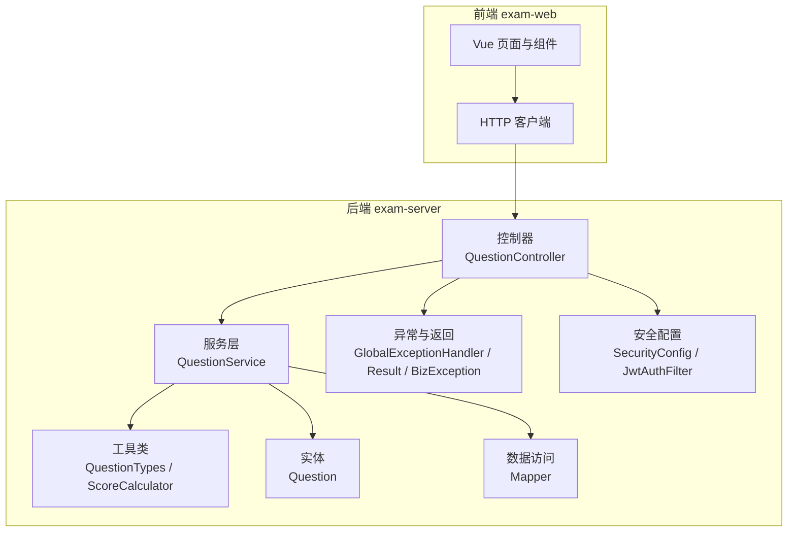
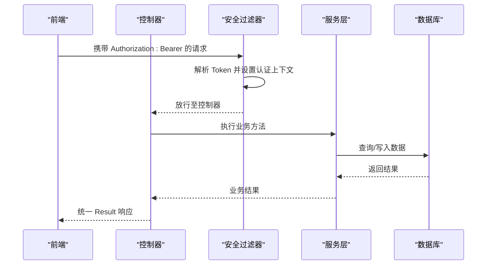
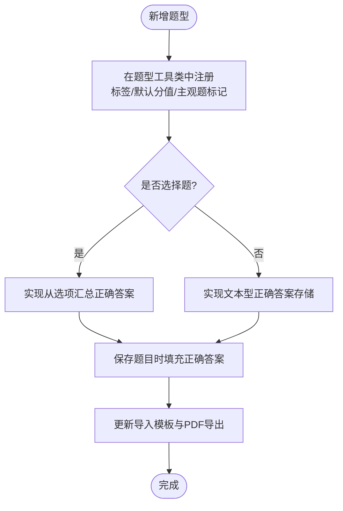
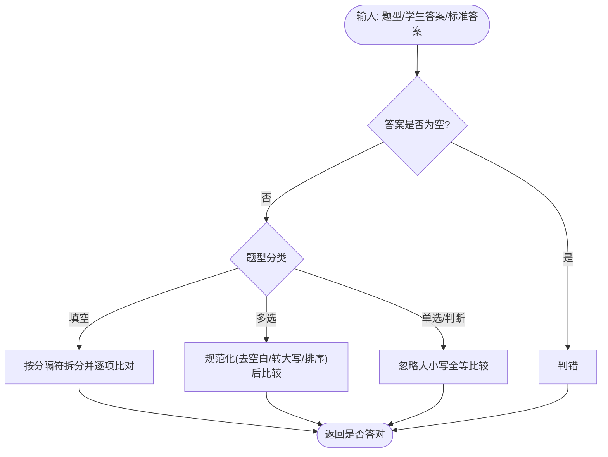
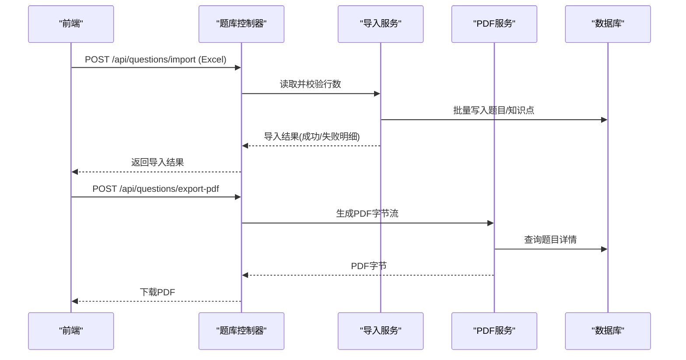
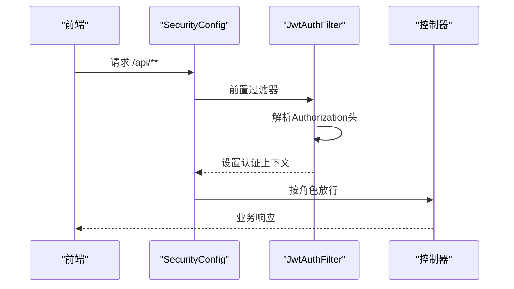
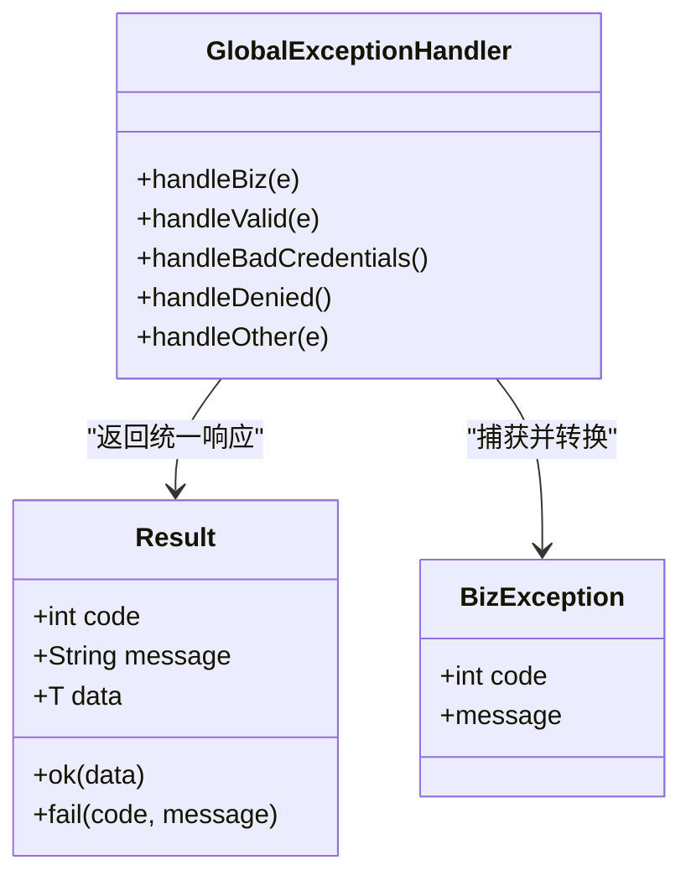
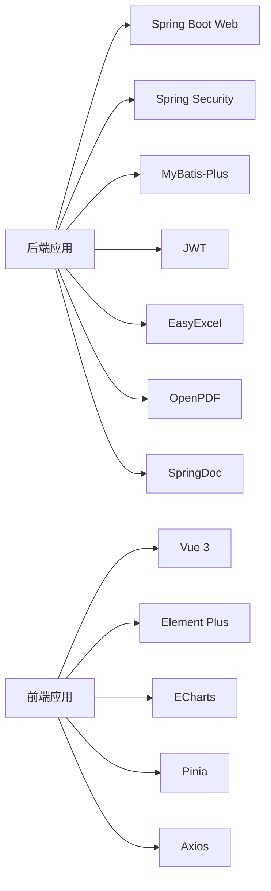

# 开发指南

<cite>
**本文引用的文件**
- [README.md](file://README.md)
- [pom.xml](file://exam-server/pom.xml)
- [application.yml](file://exam-server/src/main/resources/application.yml)
- [ExamApplication.java](file://exam-server/src/main/java/com/exam/ExamApplication.java)
- [SecurityConfig.java](file://exam-server/src/main/java/com/exam/config/SecurityConfig.java)
- [JwtAuthFilter.java](file://exam-server/src/main/java/com/exam/security/JwtAuthFilter.java)
- [Result.java](file://exam-server/src/main/java/com/exam/common/Result.java)
- [BizException.java](file://exam-server/src/main/java/com/exam/common/BizException.java)
- [GlobalExceptionHandler.java](file://exam-server/src/main/java/com/exam/common/GlobalExceptionHandler.java)
- [QuestionTypes.java](file://exam-server/src/main/java/com/exam/util/QuestionTypes.java)
- [ScoreCalculator.java](file://exam-server/src/main/java/com/exam/util/ScoreCalculator.java)
- [Question.java](file://exam-server/src/main/java/com/exam/entity/Question.java)
- [QuestionService.java](file://exam-server/src/main/java/com/exam/service/QuestionService.java)
- [QuestionController.java](file://exam-server/src/main/java/com/exam/controller/QuestionController.java)
- [package.json](file://exam-web/package.json)
</cite>

## 目录
1. [简介](#简介)
2. [项目结构](#项目结构)
3. [核心组件](#核心组件)
4. [架构总览](#架构总览)
5. [详细组件分析](#详细组件分析)
6. [依赖关系分析](#依赖关系分析)
7. [性能考量](#性能考量)
8. [故障排查指南](#故障排查指南)
9. [结论](#结论)
10. [附录](#附录)

## 简介
本指南面向二次开发与扩展教学考试平台的开发者，覆盖代码规范、Git 工作流与代码审查标准；详细说明新题型扩展、自定义评分规则、第三方集成方法；提供单元测试、集成测试与性能测试策略；并给出调试技巧、常见问题排查与优化建议。同时说明如何添加新功能模块、修改现有功能与维护代码质量。

## 项目结构
后端采用 Spring Boot 分层架构：controller 暴露 REST API，service 封装业务逻辑，mapper 通过 MyBatis-Plus 访问数据库，util 提供通用工具（如题型判断、评分），config 集中配置安全、序列化等横切能力。前端基于 Vue 3 + Vite + Element Plus，使用 Pinia 管理状态、Axios 调用后端接口。

**图表来源**
- [QuestionController.java:31-118](file://exam-server/src/main/java/com/exam/controller/QuestionController.java#L31-L118)
- [QuestionService.java:33-225](file://exam-server/src/main/java/com/exam/service/QuestionService.java#L33-L225)
- [QuestionTypes.java:1-123](file://exam-server/src/main/java/com/exam/util/QuestionTypes.java#L1-L123)
- [ScoreCalculator.java:1-55](file://exam-server/src/main/java/com/exam/util/ScoreCalculator.java#L1-L55)
- [Question.java:1-30](file://exam-server/src/main/java/com/exam/entity/Question.java#L1-L30)
- [SecurityConfig.java:25-90](file://exam-server/src/main/java/com/exam/config/SecurityConfig.java#L25-L90)
- [JwtAuthFilter.java:21-52](file://exam-server/src/main/java/com/exam/security/JwtAuthFilter.java#L21-L52)
- [GlobalExceptionHandler.java:14-61](file://exam-server/src/main/java/com/exam/common/GlobalExceptionHandler.java#L14-L61)
- [Result.java:1-38](file://exam-server/src/main/java/com/exam/common/Result.java#L1-L38)

**章节来源**
- [README.md:1-82](file://README.md#L1-L82)
- [pom.xml:1-131](file://exam-server/pom.xml#L1-L131)
- [application.yml:1-42](file://exam-server/src/main/resources/application.yml#L1-L42)
- [package.json:1-25](file://exam-web/package.json#L1-L25)

## 核心组件
- 启动入口与扫描：应用启动类启用自动装配与 Mapper 扫描，确保控制器与服务正常加载。
- 安全与鉴权：基于 Spring Security + JWT 的无状态认证，按角色控制接口访问。
- 统一返回与异常：全局异常处理将业务异常、参数校验异常、权限异常统一为 JSON 响应。
- 题库与题型：题型常量、默认分值、主观题判定、选择题答案生成与匹配。
- 评分计算：客观题自动匹配，支持单选/多选/判断/填空；主观题走人工阅卷流程。
- 数据模型：题目实体包含类型、内容、正确答案、难度、默认分值、可见性等字段。

**章节来源**
- [ExamApplication.java:1-17](file://exam-server/src/main/java/com/exam/ExamApplication.java#L1-L17)
- [SecurityConfig.java:25-90](file://exam-server/src/main/java/com/exam/config/SecurityConfig.java#L25-L90)
- [JwtAuthFilter.java:21-52](file://exam-server/src/main/java/com/exam/security/JwtAuthFilter.java#L21-L52)
- [GlobalExceptionHandler.java:14-61](file://exam-server/src/main/java/com/exam/common/GlobalExceptionHandler.java#L14-L61)
- [Result.java:1-38](file://exam-server/src/main/java/com/exam/common/Result.java#L1-L38)
- [QuestionTypes.java:1-123](file://exam-server/src/main/java/com/exam/util/QuestionTypes.java#L1-L123)
- [ScoreCalculator.java:1-55](file://exam-server/src/main/java/com/exam/util/ScoreCalculator.java#L1-L55)
- [Question.java:1-30](file://exam-server/src/main/java/com/exam/entity/Question.java#L1-L30)

## 架构总览
系统前后端分离，后端以 RESTful API 提供服务，前端通过 Axios 调用。安全层在请求进入 Controller 前完成 JWT 校验与用户上下文注入。业务层通过 Service 聚合领域逻辑，持久化由 MyBatis-Plus 完成。

**图表来源**
- [JwtAuthFilter.java:21-52](file://exam-server/src/main/java/com/exam/security/JwtAuthFilter.java#L21-L52)
- [SecurityConfig.java:25-90](file://exam-server/src/main/java/com/exam/config/SecurityConfig.java#L25-L90)
- [QuestionController.java:31-118](file://exam-server/src/main/java/com/exam/controller/QuestionController.java#L31-L118)
- [QuestionService.java:33-225](file://exam-server/src/main/java/com/exam/service/QuestionService.java#L33-L225)

## 详细组件分析

### 题库与题型扩展（新增题型）
- 题型定义与默认分值集中在题型工具类中，新增题型需在此注册显示标签、默认分值、是否主观题、是否选择题等元信息。
- 保存题目时，若为新题型，需在保存逻辑中补充正确回答填充策略（例如从选项汇总或文本匹配）。
- 导入模板与导出 PDF 需兼容新题型展示与渲染。

**图表来源**
- [QuestionTypes.java:1-123](file://exam-server/src/main/java/com/exam/util/QuestionTypes.java#L1-L123)
- [QuestionService.java:95-178](file://exam-server/src/main/java/com/exam/service/QuestionService.java#L95-L178)
- [QuestionController.java:52-86](file://exam-server/src/main/java/com/exam/controller/QuestionController.java#L52-L86)

**章节来源**
- [QuestionTypes.java:1-123](file://exam-server/src/main/java/com/exam/util/QuestionTypes.java#L1-L123)
- [QuestionService.java:95-178](file://exam-server/src/main/java/com/exam/service/QuestionService.java#L95-L178)
- [QuestionController.java:52-86](file://exam-server/src/main/java/com/exam/controller/QuestionController.java#L52-L86)

### 自定义评分规则
- 客观题匹配逻辑集中在评分工具类中，支持单选/判断大小写忽略、多选排序后比较、填空多空分隔符匹配。
- 主观题判定由题型工具类统一维护，避免分散逻辑。
- 扩展评分规则时，优先在评分工具类中增加分支，保持单一职责。

**图表来源**
- [ScoreCalculator.java:1-55](file://exam-server/src/main/java/com/exam/util/ScoreCalculator.java#L1-L55)
- [QuestionTypes.java:88-100](file://exam-server/src/main/java/com/exam/util/QuestionTypes.java#L88-L100)

**章节来源**
- [ScoreCalculator.java:1-55](file://exam-server/src/main/java/com/exam/util/ScoreCalculator.java#L1-L55)
- [QuestionTypes.java:88-100](file://exam-server/src/main/java/com/exam/util/QuestionTypes.java#L88-L100)

### 第三方集成（Excel/PDF/数据库）
- Excel 批量导入：控制器接收文件，限制最大行数，解析行数据后交由导入服务处理，失败逐行返回原因。
- PDF 导出：根据选中题目列表生成练习卷，字体路径可通过环境变量配置，未配置时自动探测系统字体。
- 数据库：默认 H2 文件库，首次启动自动建表与初始化演示数据；可切换 MySQL 并通过环境变量覆盖连接参数。

**图表来源**
- [QuestionController.java:52-86](file://exam-server/src/main/java/com/exam/controller/QuestionController.java#L52-L86)
- [application.yml:31-35](file://exam-server/src/main/resources/application.yml#L31-L35)
- [pom.xml:87-101](file://exam-server/pom.xml#L87-L101)

**章节来源**
- [QuestionController.java:52-86](file://exam-server/src/main/java/com/exam/controller/QuestionController.java#L52-L86)
- [application.yml:31-35](file://exam-server/src/main/resources/application.yml#L31-L35)
- [pom.xml:87-101](file://exam-server/pom.xml#L87-L101)

### 安全与鉴权流程
- 登录接口匿名访问，其他接口需认证；按角色限制学生、教师、管理员访问范围。
- 过滤器从请求头提取 Bearer Token，解析后设置认证上下文，后续由 Spring Security 进行授权。

**图表来源**
- [SecurityConfig.java:25-90](file://exam-server/src/main/java/com/exam/config/SecurityConfig.java#L25-L90)
- [JwtAuthFilter.java:21-52](file://exam-server/src/main/java/com/exam/security/JwtAuthFilter.java#L21-L52)

**章节来源**
- [SecurityConfig.java:25-90](file://exam-server/src/main/java/com/exam/config/SecurityConfig.java#L25-L90)
- [JwtAuthFilter.java:21-52](file://exam-server/src/main/java/com/exam/security/JwtAuthFilter.java#L21-L52)

### 统一返回与异常处理
- 所有接口统一返回 Result，code=0 表示成功，非 0 表示失败，data 为业务数据。
- 全局异常处理器捕获业务异常、参数校验异常、认证/授权异常及未知异常，统一转换为 JSON 响应。

**图表来源**
- [Result.java:1-38](file://exam-server/src/main/java/com/exam/common/Result.java#L1-L38)
- [BizException.java:1-22](file://exam-server/src/main/java/com/exam/common/BizException.java#L1-L22)
- [GlobalExceptionHandler.java:14-61](file://exam-server/src/main/java/com/exam/common/GlobalExceptionHandler.java#L14-L61)

**章节来源**
- [Result.java:1-38](file://exam-server/src/main/java/com/exam/common/Result.java#L1-L38)
- [BizException.java:1-22](file://exam-server/src/main/java/com/exam/common/BizException.java#L1-L22)
- [GlobalExceptionHandler.java:14-61](file://exam-server/src/main/java/com/exam/common/GlobalExceptionHandler.java#L14-L61)

## 依赖关系分析
- 后端依赖 Spring Boot Web、Security、Validation、MyBatis-Plus、JWT、EasyExcel、OpenPDF、SpringDoc 等组件。
- 前端依赖 Vue 3、Element Plus、ECharts、Pinia、Axios、Vite 构建工具。

**图表来源**
- [pom.xml:42-112](file://exam-server/pom.xml#L42-L112)
- [package.json:11-23](file://exam-web/package.json#L11-L23)

**章节来源**
- [pom.xml:42-112](file://exam-server/pom.xml#L42-L112)
- [package.json:11-23](file://exam-web/package.json#L11-L23)

## 性能考量
- 导入限制：单次导入行数上限，避免大文件拖垮解析与事务。
- 分页查询：题库分页使用 MyBatis-Plus Page，减少内存占用。
- 文件上传：配置最大请求体与文件大小，防止资源耗尽。
- 字体缓存：PDF 导出字体路径可通过环境变量指定，减少重复探测开销。
- 数据库：默认 H2 适合演示与轻量场景；生产建议切换 MySQL 并合理索引。

[本节为通用指导，不直接分析具体文件]

## 故障排查指南
- 未登录或过期：安全配置会返回 401，检查 Authorization 头是否携带有效 Token。
- 没有权限：角色不足导致 403，确认用户角色与接口权限配置。
- 参数错误：全局处理器会将校验错误转为统一消息，检查请求体是否符合 DTO 约束。
- 服务器错误：未知异常统一返回 500，查看后端日志定位堆栈。
- 导入失败：检查文件格式与行数限制，关注导入结果中的失败明细。
- PDF 乱码：检查字体路径配置与环境变量，确保字体文件可用。

**章节来源**
- [SecurityConfig.java:52-64](file://exam-server/src/main/java/com/exam/config/SecurityConfig.java#L52-L64)
- [GlobalExceptionHandler.java:20-61](file://exam-server/src/main/java/com/exam/common/GlobalExceptionHandler.java#L20-L61)
- [QuestionController.java:60-75](file://exam-server/src/main/java/com/exam/controller/QuestionController.java#L60-L75)
- [application.yml:31-35](file://exam-server/src/main/resources/application.yml#L31-L35)

## 结论
本指南围绕代码规范、Git 工作流与评审标准，结合题型扩展、评分规则、第三方集成、测试策略与性能优化，提供了教学考试平台二次开发的系统化指导。遵循统一返回与异常处理、安全鉴权、题型与评分解耦的设计，有助于快速扩展与维护代码质量。

[本节为总结性内容，不直接分析具体文件]

## 附录

### 代码规范与最佳实践
- 统一返回：所有接口使用 Result 包装，便于前端统一处理。
- 异常处理：业务异常使用 BizException，避免在每个接口 try-catch。
- 安全：敏感接口必须鉴权，按角色最小权限原则配置。
- 工具类：题型与评分逻辑集中管理，避免散落条件判断。
- 配置：通过 application.yml 与环境变量管理运行时配置。

**章节来源**
- [Result.java:1-38](file://exam-server/src/main/java/com/exam/common/Result.java#L1-L38)
- [GlobalExceptionHandler.java:14-61](file://exam-server/src/main/java/com/exam/common/GlobalExceptionHandler.java#L14-L61)
- [SecurityConfig.java:25-90](file://exam-server/src/main/java/com/exam/config/SecurityConfig.java#L25-L90)
- [QuestionTypes.java:1-123](file://exam-server/src/main/java/com/exam/util/QuestionTypes.java#L1-L123)
- [application.yml:1-42](file://exam-server/src/main/resources/application.yml#L1-L42)

### Git 工作流与代码审查标准
- 分支策略：主分支保护，功能分支开发，合并前通过 CI 与评审。
- 提交规范：提交信息清晰描述变更点与影响范围。
- 评审要点：是否遵循统一返回与异常处理、是否引入新的全局副作用、是否完善文档与注释。
- 自动化：建议引入静态检查与单元测试覆盖率门禁。

[本节为通用流程指导，不直接分析具体文件]

### 新题型扩展步骤清单
- 在题型工具类中注册新题型标签、默认分值、主观题标记。
- 在保存逻辑中补充正确答案填充策略（选择题从选项汇总，非选择题直接存储）。
- 更新导入模板与导出 PDF 的题型展示。
- 编写单测覆盖匹配与边界情况。

**章节来源**
- [QuestionTypes.java:1-123](file://exam-server/src/main/java/com/exam/util/QuestionTypes.java#L1-L123)
- [QuestionService.java:95-178](file://exam-server/src/main/java/com/exam/service/QuestionService.java#L95-L178)
- [QuestionController.java:52-86](file://exam-server/src/main/java/com/exam/controller/QuestionController.java#L52-L86)

### 自定义评分规则实施要点
- 在评分工具类中新增匹配分支，保持函数式纯逻辑，便于单测。
- 对于复杂匹配，先做规范化再比较，避免空格、大小写、分隔符差异导致误判。
- 主观题判定由题型工具类统一管理，避免评分器耦合题型细节。

**章节来源**
- [ScoreCalculator.java:1-55](file://exam-server/src/main/java/com/exam/util/ScoreCalculator.java#L1-L55)
- [QuestionTypes.java:88-100](file://exam-server/src/main/java/com/exam/util/QuestionTypes.java#L88-L100)

### 第三方集成注意事项
- Excel 导入：限制行数、逐行错误反馈、事务边界明确。
- PDF 导出：字体路径配置、中文支持、文件名编码。
- 数据库：H2 用于演示，MySQL 用于生产；注意字符集与索引设计。

**章节来源**
- [QuestionController.java:60-86](file://exam-server/src/main/java/com/exam/controller/QuestionController.java#L60-L86)
- [application.yml:31-35](file://exam-server/src/main/resources/application.yml#L31-L35)
- [pom.xml:87-101](file://exam-server/pom.xml#L87-L101)

### 测试策略
- 单元测试：针对评分工具、题型工具、服务层关键方法进行断言。
- 集成测试：模拟 HTTP 请求验证控制器与异常处理链路。
- 性能测试：导入大批量数据、并发答题与阅卷场景压测。

[本节为通用测试指导，不直接分析具体文件]

### 调试技巧与常见问题
- 使用 Swagger 调试接口，观察入参与返回结构。
- 开启全局异常打印，定位服务端错误堆栈。
- 检查 CORS 配置，确保前后端跨域通信正常。
- 检查 JWT 密钥与过期时间配置，避免令牌失效问题。

**章节来源**
- [application.yml:37-42](file://exam-server/src/main/resources/application.yml#L37-L42)
- [GlobalExceptionHandler.java:54-61](file://exam-server/src/main/java/com/exam/common/GlobalExceptionHandler.java#L54-L61)
- [SecurityConfig.java:78-88](file://exam-server/src/main/java/com/exam/config/SecurityConfig.java#L78-L88)

### 添加新功能模块与维护代码质量
- 新增模块遵循分层：控制器 -> 服务 -> 数据访问，复用统一返回与异常处理。
- 配置集中管理，敏感信息通过环境变量注入。
- 持续集成：提交前运行单测与静态检查，保证代码质量。

[本节为通用维护指导，不直接分析具体文件]