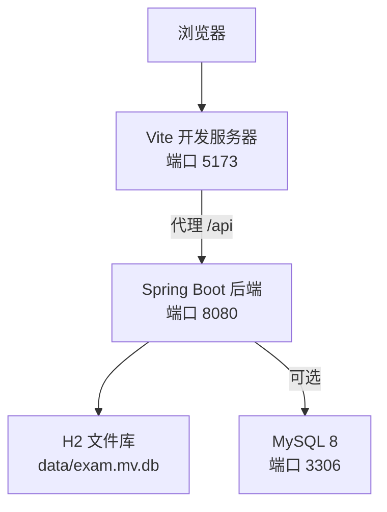
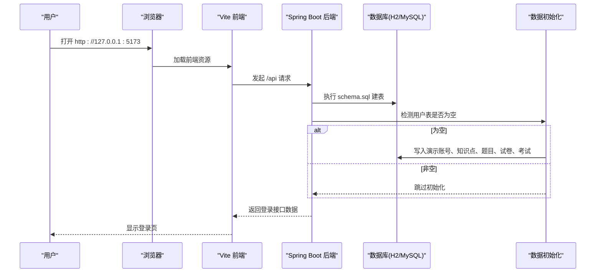
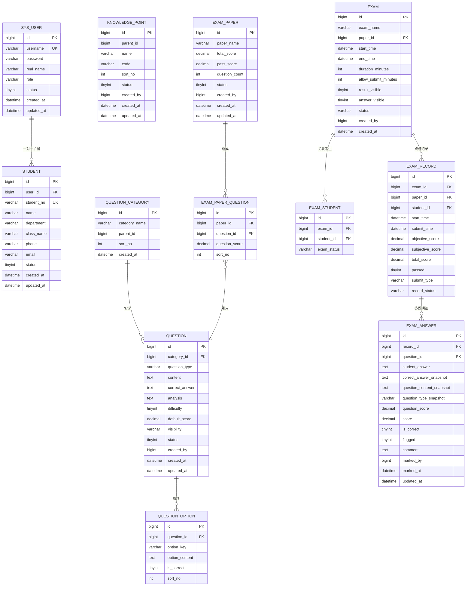

# 快速开始

<cite>
**本文引用的文件**
- [README.md](file://README.md)
- [docker-compose.yml](file://docker-compose.yml)
- [application.yml](file://exam-server/src/main/resources/application.yml)
- [application-h2.yml](file://exam-server/src/main/resources/application-h2.yml)
- [application-mysql.yml](file://exam-server/src/main/resources/application-mysql.yml)
- [schema.sql](file://sql/schema.sql)
- [vite.config.js](file://exam-web/vite.config.js)
- [package.json](file://exam-web/package.json)
- [start-server.bat](file://start-server.bat)
- [start-web.bat](file://start-web.bat)
- [DataInitializer.java](file://exam-server/src/main/java/com/exam/config/DataInitializer.java)
- [部署文档.md](file://docs/部署文档.md)
</cite>

## 目录
1. [简介](#简介)
2. [环境要求与依赖](#环境要求与依赖)
3. [数据库配置（H2 默认 / MySQL 可选）](#数据库配置h2-默认--mysql-可选)
4. [前后端启动步骤](#前后端启动步骤)
5. [演示账号与预置考试内容](#演示账号与预置考试内容)
6. [Docker 部署方式](#docker-部署方式)
7. [常见启动问题与解决](#常见启动问题与解决)
8. [架构概览](#架构概览)
9. [详细组件分析](#详细组件分析)
10. [性能与注意事项](#性能与注意事项)
11. [结论](#结论)

## 简介
本指南面向首次接触教学考试平台的新用户，目标是帮助你在最短时间内完成环境准备、依赖安装、数据库配置、前后端启动，并体验完整功能。系统默认使用 H2 文件库，无需安装 MySQL；也可一键切换到 MySQL。前端为 Vue 3 + Vite，后端为 Spring Boot，提供教师出题组卷、学生在线考试、简答题阅卷与知识点掌握度分析等能力。

## 环境要求与依赖
- JDK 11：后端运行与编译环境
- Node.js 18+：前端开发与构建
- 可选：MySQL 8、Docker（用于快速拉起 MySQL）
- 可选：中文字体（题库 PDF 导出需要）

说明：
- 默认启用 H2 文件库，首次启动会自动建表并写入演示数据，无需提前准备 MySQL。
- 前端开发服务器默认监听 5173，并通过 Vite 代理将 /api 请求转发到后端 8080。
- 后端默认监听 0.0.0.0:8080，并提供 Swagger 文档地址。

章节来源
- [README.md:5-11](file://README.md#L5-L11)
- [application.yml:1-24](file://exam-server/src/main/resources/application.yml#L1-L24)
- [vite.config.js:4-14](file://exam-web/vite.config.js#L4-L14)
- [package.json:6-9](file://exam-web/package.json#L6-L9)

## 数据库配置（H2 默认 / MySQL 可选）
- H2（默认）：无需额外安装，数据文件位于 data 目录，支持 H2 Console 调试。
- MySQL（可选）：通过环境变量或 Docker Compose 快速拉起，切换 profile 即可使用。

要点：
- 应用默认 profile 由环境变量 SPRING_PROFILES_ACTIVE 控制，未设置时默认为 h2。
- H2 模式开启控制台路径 /h2-console，便于本地调试。
- MySQL 模式通过 application-mysql.yml 生效，连接参数可通过 MYSQL_HOST、MYSQL_PORT、MYSQL_USER、MYSQL_PASSWORD 覆盖。
- SQL 初始化脚本位于 classpath:db/schema.sql，首次启动会执行建表。

章节来源
- [application.yml:9-24](file://exam-server/src/main/resources/application.yml#L9-L24)
- [application-h2.yml:1-11](file://exam-server/src/main/resources/application-h2.yml#L1-L11)
- [application-mysql.yml:1-12](file://exam-server/src/main/resources/application-mysql.yml#L1-L12)
- [schema.sql:1-204](file://sql/schema.sql#L1-L204)

## 前后端启动步骤
### 后端启动（Spring Boot）
- 方式一：双击根目录 start-server.bat，自动进入 exam-server 并使用内置 Maven 运行。
- 方式二：进入 exam-server 目录，使用已编译的 JAR 直接运行。
- 接口地址：http://127.0.0.1:8080
- Swagger 文档：http://127.0.0.1:8080/swagger-ui.html

提示：
- 首次启动会执行 schema.sql 并写入演示数据。
- 如需切换 MySQL，启动前设置 SPRING_PROFILES_ACTIVE=mysql 及对应环境变量。

章节来源
- [start-server.bat:1-6](file://start-server.bat#L1-L6)
- [README.md:24-35](file://README.md#L24-L35)
- [application.yml:1-18](file://exam-server/src/main/resources/application.yml#L1-L18)

### 前端启动（Vue 3 + Vite）
- 进入 exam-web 目录，执行 npm install 安装依赖，再执行 npm run dev 启动开发服务器。
- 浏览器访问 http://127.0.0.1:5173
- 开发模式下，/api 请求会被代理到 http://127.0.0.1:8080

提示：
- 确保后端已启动，否则登录与业务接口会失败。
- 生产构建使用 npm run build，产物在 dist 目录。

章节来源
- [README.md:37-45](file://README.md#L37-L45)
- [vite.config.js:4-14](file://exam-web/vite.config.js#L4-L14)
- [package.json:6-9](file://exam-web/package.json#L6-L9)

## 演示账号与预置考试内容
- 管理员：admin / admin123
- 教师：teacher / teacher123
- 学生：s2024001 / student123
- 学生：s2024002 / student123

预置内容：
- 知识点树：Java基础 → 面向对象（封装、继承、多态）、集合（List、Map）
- 题库样题：单选、多选、判断、填空、简答、关键词解释题型示例
- 试卷与考试：已创建“Java 基础测验”试卷，并发布一场进行中的“Java 基础入学测验”，学生登录后可直接作答
- 简答题需教师在阅卷中心给分后才会出总分并写入学情统计

章节来源
- [README.md:13-22](file://README.md#L13-L22)
- [DataInitializer.java:36-172](file://exam-server/src/main/java/com/exam/config/DataInitializer.java#L36-L172)

## Docker 部署方式
仓库提供 docker-compose.yml，可快速拉起 MySQL 服务，并在容器初始化时导入建表脚本。

步骤：
- 在项目根目录执行 docker compose up -d mysql
- 默认端口 3306，数据库名 exam，字符集 utf8mb4
- 数据持久化到命名卷 exam-mysql-data
- 切换后端为 MySQL 模式：设置 SPRING_PROFILES_ACTIVE=mysql 及 MYSQL_* 环境变量

注意：
- 生产环境建议将 3306 仅绑定内网或 127.0.0.1，避免暴露公网
- 若已有 MySQL，可直接复用，无需重复创建库

章节来源
- [docker-compose.yml:1-19](file://docker-compose.yml#L1-L19)
- [README.md:47-57](file://README.md#L47-L57)
- [部署文档.md:355-382](file://docs/部署文档.md#L355-L382)

## 常见启动问题与解决
- 页面能打开但登录失败（502/500）
  - 检查后端是否监听 8080，查看日志确认无异常
  - 前端开发模式需确保 /api 代理到 127.0.0.1:8080
- 切 MySQL 后连不上
  - 检查 MYSQL_HOST、MYSQL_PORT、MYSQL_USER、MYSQL_PASSWORD 是否正确
  - 确认库名为 exam，字符集 utf8mb4，且 3306 仅监听内网
- 前端路由刷新 404
  - 生产环境 Nginx 需配置 try_files ... /index.html
- 构建失败（script setup export）
  - 移除 .vue 文件中 <script setup> 下的 export 声明
- 导出 PDF 缺少中文字体
  - 安装系统字体或使用 EXAM_PDF_FONT_PATH 指定字体路径（.ttc 需带 ,0 索引）

章节来源
- [部署文档.md:601-614](file://docs/部署文档.md#L601-L614)
- [application.yml:31-35](file://exam-server/src/main/resources/application.yml#L31-L35)
- [vite.config.js:4-14](file://exam-web/vite.config.js#L4-L14)

## 架构概览
下图展示开发环境下前后端交互与数据库关系：

图表来源
- [vite.config.js:4-14](file://exam-web/vite.config.js#L4-L14)
- [application.yml:1-18](file://exam-server/src/main/resources/application.yml#L1-L18)
- [application-h2.yml:1-11](file://exam-server/src/main/resources/application-h2.yml#L1-L11)
- [application-mysql.yml:1-12](file://exam-server/src/main/resources/application-mysql.yml#L1-L12)

## 详细组件分析
### 启动流程时序（首次启动）

图表来源
- [application.yml:19-24](file://exam-server/src/main/resources/application.yml#L19-L24)
- [DataInitializer.java:56-172](file://exam-server/src/main/java/com/exam/config/DataInitializer.java#L56-L172)

### 数据模型关系（核心实体）

图表来源
- [schema.sql:1-204](file://sql/schema.sql#L1-L204)

## 性能与注意事项
- 上传限制：后端 multipart 最大请求大小 10MB，Nginx 生产环境建议 client_max_body_size 不小于该值
- 时间与时区：Jackson 默认时区 Asia/Shanghai，日期格式统一
- H2 数据位置：data 目录下，迁移或备份时需注意
- MySQL 字符集：建议使用 utf8mb4，避免中文乱码
- 字体：PDF 导出需要中文字体，未配置时会尝试系统字体目录

章节来源
- [application.yml:12-18](file://exam-server/src/main/resources/application.yml#L12-L18)
- [docker-compose.yml:1-19](file://docker-compose.yml#L1-L19)
- [部署文档.md:89-99](file://docs/部署文档.md#L89-L99)

## 结论
按照本指南，你可以在几分钟内完成教学考试平台的搭建与运行：选择 H2 或 MySQL 作为数据库，启动后端与前端，使用演示账号体验教师出题、学生答题、阅卷与学情分析等核心功能。如需生产部署，可参考部署文档中的 Nginx、systemd、MySQL 与字体配置，确保稳定运行。