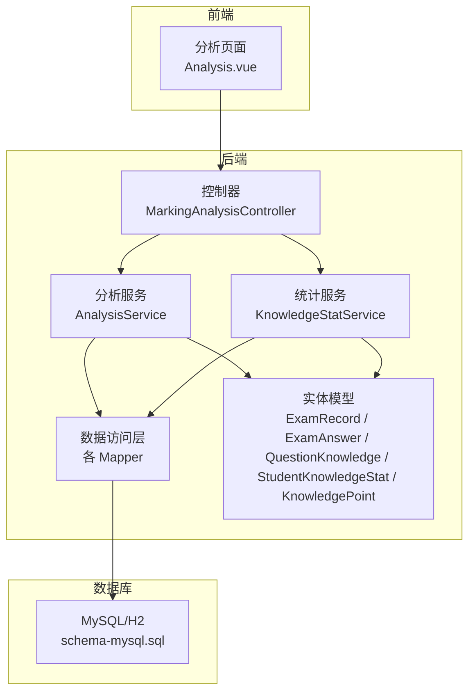
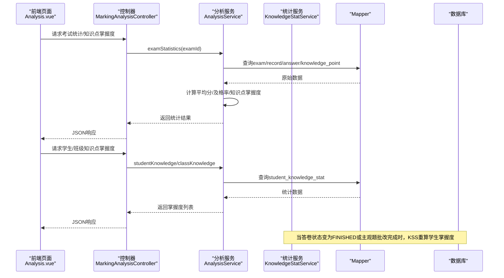
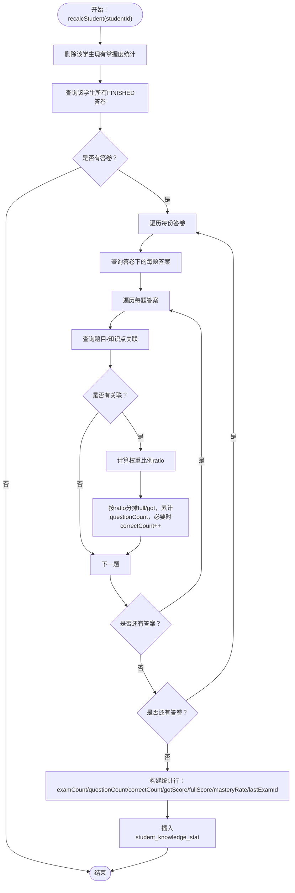
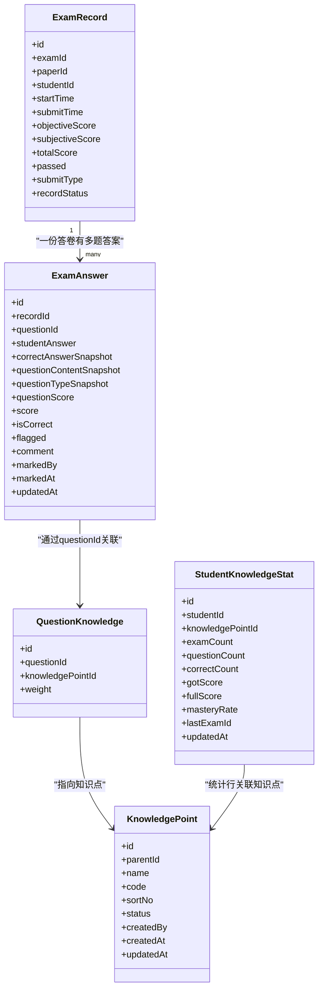

# 学情分析数据模型

<cite>
**本文引用的文件**
- [StudentKnowledgeStat.java](file://exam-server/src/main/java/com/exam/entity/StudentKnowledgeStat.java)
- [KnowledgeStatService.java](file://exam-server/src/main/java/com/exam/service/KnowledgeStatService.java)
- [AnalysisService.java](file://exam-server/src/main/java/com/exam/service/AnalysisService.java)
- [MarkingAnalysisController.java](file://exam-server/src/main/java/com/exam/controller/MarkingAnalysisController.java)
- [ExamRecord.java](file://exam-server/src/main/java/com/exam/entity/ExamRecord.java)
- [ExamAnswer.java](file://exam-server/src/main/java/com/exam/entity/ExamAnswer.java)
- [QuestionKnowledge.java](file://exam-server/src/main/java/com/exam/entity/QuestionKnowledge.java)
- [KnowledgePoint.java](file://exam-server/src/main/java/com/exam/entity/KnowledgePoint.java)
- [ScoreCalculator.java](file://exam-server/src/main/java/com/exam/util/ScoreCalculator.java)
- [schema-mysql.sql](file://sql/schema-mysql.sql)
- [Analysis.vue](file://exam-web/src/views/admin/Analysis.vue)
</cite>

## 目录
1. [简介](#简介)
2. [项目结构](#项目结构)
3. [核心组件](#核心组件)
4. [架构总览](#架构总览)
5. [详细组件分析](#详细组件分析)
6. [依赖关系分析](#依赖关系分析)
7. [性能与缓存设计](#性能与缓存设计)
8. [故障排查指南](#故障排查指南)
9. [结论](#结论)
10. [附录](#附录)

## 简介
本文件聚焦“学情分析模块”的数据模型与算法，围绕学生知识点掌握度统计表的设计、计算逻辑、更新机制以及个人能力评估与班级统计分析的数据结构展开。文档同时给出历史数据追踪、趋势分析与可视化报表的数据支撑方案，并提供数据库层面的性能优化与缓存策略建议。

## 项目结构
- 后端服务位于 exam-server，包含实体、Mapper、Service、Controller 等分层结构；数据分析相关逻辑集中在 AnalysisService 与 KnowledgeStatService。
- 前端在 exam-web，提供学情分析页面（Analysis.vue），调用后端接口进行考试统计、知识点掌握度展示与导出。
- 数据库脚本位于 sql/schema-mysql.sql，定义核心表结构与索引。

图表来源
- [MarkingAnalysisController.java:38-89](file://exam-server/src/main/java/com/exam/controller/MarkingAnalysisController.java#L38-L89)
- [AnalysisService.java:46-212](file://exam-server/src/main/java/com/exam/service/AnalysisService.java#L46-L212)
- [KnowledgeStatService.java:35-100](file://exam-server/src/main/java/com/exam/service/KnowledgeStatService.java#L35-L100)
- [schema-mysql.sql:176-190](file://sql/schema-mysql.sql#L176-L190)

章节来源
- [MarkingAnalysisController.java:38-89](file://exam-server/src/main/java/com/exam/controller/MarkingAnalysisController.java#L38-L89)
- [AnalysisService.java:46-212](file://exam-server/src/main/java/com/exam/service/AnalysisService.java#L46-L212)
- [KnowledgeStatService.java:35-100](file://exam-server/src/main/java/com/exam/service/KnowledgeStatService.java#L35-L100)
- [schema-mysql.sql:176-190](file://sql/schema-mysql.sql#L176-L190)

## 核心组件
- 学生知识点掌握汇总表：student_knowledge_stat，记录每个学生在每个知识点的累计得分、满分、题目数、正确题数、掌握率及最近一次考试ID。
- 阅卷与成绩记录：exam_record、exam_answer，承载每场考试的答卷明细与分数快照。
- 题目与知识点关联：question_knowledge，通过权重将一道题的分数分摊到多个知识点。
- 分析服务：AnalysisService 提供单场考试统计、班级/学生知识点掌握度查询；KnowledgeStatService 负责按学生重算掌握度汇总。
- 评分工具：ScoreCalculator 用于客观题自动判分，为主观题人工阅卷提供前置判断。

章节来源
- [StudentKnowledgeStat.java:11-27](file://exam-server/src/main/java/com/exam/entity/StudentKnowledgeStat.java#L11-L27)
- [ExamRecord.java:11-28](file://exam-server/src/main/java/com/exam/entity/ExamRecord.java#L11-L28)
- [ExamAnswer.java:11-31](file://exam-server/src/main/java/com/exam/entity/ExamAnswer.java#L11-L31)
- [QuestionKnowledge.java:10-19](file://exam-server/src/main/java/com/exam/entity/QuestionKnowledge.java#L10-L19)
- [AnalysisService.java:33-257](file://exam-server/src/main/java/com/exam/service/AnalysisService.java#L33-L257)
- [KnowledgeStatService.java:25-109](file://exam-server/src/main/java/com/exam/service/KnowledgeStatService.java#L25-L109)
- [ScoreCalculator.java:11-55](file://exam-server/src/main/java/com/exam/util/ScoreCalculator.java#L11-L55)

## 架构总览
学情分析的核心流程包括：
- 单场考试统计：聚合已交卷/已完成人数、平均分、及格率，并计算本场知识点掌握度。
- 学生维度掌握度：基于 student_knowledge_stat 表读取并按掌握率排序，生成个人能力画像。
- 班级维度掌握度：聚合班级内所有学生的掌握度数据，得到班级薄弱点与整体水平。
- 数据更新：当学生答卷完成或主观题批改完成后，触发 KnowledgeStatService 重算该学生掌握度汇总。

图表来源
- [MarkingAnalysisController.java:55-73](file://exam-server/src/main/java/com/exam/controller/MarkingAnalysisController.java#L55-L73)
- [AnalysisService.java:46-212](file://exam-server/src/main/java/com/exam/service/AnalysisService.java#L46-L212)
- [KnowledgeStatService.java:35-100](file://exam-server/src/main/java/com/exam/service/KnowledgeStatService.java#L35-L100)

## 详细组件分析

### 学生知识点掌握汇总表（student_knowledge_stat）
- 字段说明：
  - student_id、knowledge_point_id：唯一键，表示某学生在某知识点的统计行。
  - exam_count：参与考试次数（去重后的考试数量）。
  - question_count：涉及该知识点的题目总数。
  - correct_count：完全正确的题目数（仅当题目得分为满分时计数）。
  - got_score、full_score：该知识点累计实得分与满分（考虑权重分摊）。
  - mastery_rate：掌握率 = (got_score / full_score) × 100，保留两位小数。
  - last_exam_id：最近一次涉及的考试ID，便于追踪最新变化。
  - updated_at：更新时间戳。
- 索引设计：
  - uk_student_kp：唯一约束，防止重复插入。
  - idx_sks_kp_rate：复合索引，支持按知识点+掌握率排序查询，提升班级/知识点维度分析性能。

章节来源
- [StudentKnowledgeStat.java:11-27](file://exam-server/src/main/java/com/exam/entity/StudentKnowledgeStat.java#L11-L27)
- [schema-mysql.sql:176-190](file://sql/schema-mysql.sql#L176-L190)

### 知识点掌握度计算算法
- 权重分摊：
  - 若一道题关联多个知识点，则根据 question_knowledge.weight 计算权重比例 ratio = weight / sum(weights)。
  - 将该题的 question_score 与 score 按比例分摊到各知识点，累加到对应 Agg 的 full/got。
- 正确题判定：
  - 当题目满分且得分等于满分时，视为完全正确，correct_count 自增。
- 掌握率计算：
  - mastery_rate = (got_score / full_score) × 100，保留两位小数；若 full_score=0，则掌握率为0。
- 更新机制：
  - KnowledgeStatService.recalcStudent(studentId) 会删除该学生原有统计行，遍历其所有 FINISHED 状态的答卷，聚合答案与知识点关联，重新插入统计行。
  - 适用于主观题批改后或整场考试完成后的批量重算场景。

图表来源
- [KnowledgeStatService.java:35-100](file://exam-server/src/main/java/com/exam/service/KnowledgeStatService.java#L35-L100)
- [QuestionKnowledge.java:10-19](file://exam-server/src/main/java/com/exam/entity/QuestionKnowledge.java#L10-L19)

章节来源
- [KnowledgeStatService.java:35-100](file://exam-server/src/main/java/com/exam/service/KnowledgeStatService.java#L35-L100)

### 单场考试统计与知识点掌握度
- 统计指标：
  - 应考人数、已交卷人数、已完成人数、待批阅人数、缺考人数。
  - 平均分、及格率（基于总分与是否通过标记）。
  - 知识点掌握度：按知识点聚合全场的 got_score、full_score、question_count，计算掌握率并分级（≥80% 掌握，60–79% 一般，<60% 薄弱）。
- 数据来源：
  - exam、exam_student、exam_record、exam_answer、question_knowledge、knowledge_point。
- 输出结构：
  - 返回 Map，包含 examName、assigned、submitted、finished、marking、absent、avgScore、passRate、students、knowledge。

章节来源
- [AnalysisService.java:46-97](file://exam-server/src/main/java/com/exam/service/AnalysisService.java#L46-L97)
- [AnalysisService.java:163-212](file://exam-server/src/main/java/com/exam/service/AnalysisService.java#L163-L212)

### 个人能力评估（学生维度）
- 数据源：student_knowledge_stat，按 mastery_rate 升序排列，便于识别薄弱点。
- 输出结构：KnowledgeRow 列表，包含 knowledgePointId、name、questionCount、gotScore、fullScore、masteryRate、level。
- 使用场景：学生查看自身知识点掌握情况，定位薄弱环节。

章节来源
- [AnalysisService.java:99-107](file://exam-server/src/main/java/com/exam/service/AnalysisService.java#L99-L107)
- [AnalysisService.java:214-229](file://exam-server/src/main/java/com/exam/service/AnalysisService.java#L214-L229)

### 班级统计分析（班级维度）
- 聚合逻辑：
  - 先查询班级内所有学生ID，再拉取这些学生在各知识点的统计行。
  - 对每个知识点聚合 gotScore、fullScore、questionCount，计算班级掌握率并分级。
- 输出结构：KnowledgeRow 列表，按掌握率升序排序，便于发现班级薄弱知识点。

章节来源
- [AnalysisService.java:109-145](file://exam-server/src/main/java/com/exam/service/AnalysisService.java#L109-L145)

### 成绩导出与可视化
- 成绩导出：
  - 控制器提供 /api/scores/export 接口，导出 Excel，包含考试名称、学号、姓名、班级、客观题分数、主观题分数、总分、是否及格。
- 可视化：
  - 前端 Analysis.vue 使用 ECharts 渲染知识点掌握度条形图，数据来源于 examStatistics 接口的 knowledge 字段。

章节来源
- [MarkingAnalysisController.java:75-90](file://exam-server/src/main/java/com/exam/controller/MarkingAnalysisController.java#L75-L90)
- [Analysis.vue:60-84](file://exam-web/src/views/admin/Analysis.vue#L60-L84)

## 依赖关系分析
- 控制器依赖服务：MarkingAnalysisController 依赖 AnalysisService 与 MarkingService，暴露统计与阅卷接口。
- 服务依赖实体与Mapper：AnalysisService 与 KnowledgeStatService 通过 MyBatis-Plus 的 Mapper 访问数据库实体。
- 数据模型关系：
  - exam_record 与 exam_answer 一对多，承载答卷与每题答案。
  - exam_answer 与 question_knowledge 通过 question_id 关联，实现题目到知识点的权重分摊。
  - student_knowledge_stat 由 KnowledgeStatService 基于上述数据重算生成。

图表来源
- [ExamRecord.java:11-28](file://exam-server/src/main/java/com/exam/entity/ExamRecord.java#L11-L28)
- [ExamAnswer.java:11-31](file://exam-server/src/main/java/com/exam/entity/ExamAnswer.java#L11-L31)
- [QuestionKnowledge.java:10-19](file://exam-server/src/main/java/com/exam/entity/QuestionKnowledge.java#L10-L19)
- [StudentKnowledgeStat.java:11-27](file://exam-server/src/main/java/com/exam/entity/StudentKnowledgeStat.java#L11-L27)
- [KnowledgePoint.java:10-24](file://exam-server/src/main/java/com/exam/entity/KnowledgePoint.java#L10-L24)

章节来源
- [ExamRecord.java:11-28](file://exam-server/src/main/java/com/exam/entity/ExamRecord.java#L11-L28)
- [ExamAnswer.java:11-31](file://exam-server/src/main/java/com/exam/entity/ExamAnswer.java#L11-L31)
- [QuestionKnowledge.java:10-19](file://exam-server/src/main/java/com/exam/entity/QuestionKnowledge.java#L10-L19)
- [StudentKnowledgeStat.java:11-27](file://exam-server/src/main/java/com/exam/entity/StudentKnowledgeStat.java#L11-L27)
- [KnowledgePoint.java:10-24](file://exam-server/src/main/java/com/exam/entity/KnowledgePoint.java#L10-L24)

## 性能与缓存设计
- 数据库索引优化：
  - student_knowledge_stat 上已有 uk_student_kp 与 idx_sks_kp_rate，支持按知识点+掌握率高效查询。
  - exam_record 上有 idx_record_student 与 idx_record_exam_score，支持按学生与考试维度快速检索。
  - exam_answer 上有 idx_answer_record，支持按答卷ID批量查询答案。
- 计算复杂度：
  - recalcStudent 的时间复杂度约为 O(R×A×K)，其中 R 为答卷数，A 为每题答案数，K 为题目关联知识点数。权重分摊与聚合在内存中进行，避免多次数据库往返。
- 缓存策略建议：
  - 热点数据缓存：对班级/知识点维度的掌握度结果可引入 Redis 缓存，设置合理过期时间（如考试结束后一段时间）。
  - 增量更新：仅在答卷状态变更或主观题批改完成时触发 recompute，减少全量重算开销。
  - 分页与限流：对大规模班级统计增加分页参数与并发限制，避免一次性加载过多数据。
- 查询优化：
  - 使用 MyBatis-Plus 的 LambdaQueryWrapper 精确构造条件，避免 SELECT *。
  - 对高频查询（如班级薄弱点）建立物化视图或定时任务预计算并落库。

章节来源
- [KnowledgeStatService.java:35-100](file://exam-server/src/main/java/com/exam/service/KnowledgeStatService.java#L35-L100)
- [AnalysisService.java:109-145](file://exam-server/src/main/java/com/exam/service/AnalysisService.java#L109-L145)
- [schema-mysql.sql:176-190](file://sql/schema-mysql.sql#L176-L190)

## 故障排查指南
- 掌握度为0或异常：
  - 检查 question_knowledge 的 weight 是否为0或空值；代码中若为空则默认按1处理，但需确保 sum(weights) 不为0。
  - 确认 exam_record.record_status 是否为 FINISHED，只有完成答卷才会被纳入统计。
- 正确题计数不准确：
  - correct_count 仅在题目满分且得分等于满分时自增，需核对 question_score 与 score 的值。
- 数据不一致：
  - 若主观题批改后掌握度未更新，需确认是否调用了 KnowledgeStatService.recalcStudent。
- 性能问题：
  - 大批量重算时注意事务边界与锁竞争，建议在非高峰期执行或拆分批次。

章节来源
- [KnowledgeStatService.java:56-76](file://exam-server/src/main/java/com/exam/service/KnowledgeStatService.java#L56-L76)
- [AnalysisService.java:163-212](file://exam-server/src/main/java/com/exam/service/AnalysisService.java#L163-L212)

## 结论
本模块以 student_knowledge_stat 为核心，结合 exam_record、exam_answer、question_knowledge 等基础数据，实现了从单场考试到班级维度的知识点掌握度统计。通过权重分摊与掌握率计算，系统能够精准反映学生在各知识点的掌握情况，并为教学决策提供数据支撑。后续可通过缓存、预计算与增量更新进一步提升性能与可扩展性。

## 附录
- 关键接口路径：
  - /api/exams/{id}/statistics：单场考试统计
  - /api/exams/{id}/knowledge-stats：本场知识点掌握度
  - /api/analysis/students/{studentId}/knowledge：学生知识点掌握度
  - /api/analysis/classes/{className}/knowledge：班级知识点掌握度
  - /api/scores/export：成绩导出
- 可视化支撑：
  - 前端 Analysis.vue 使用 ECharts 渲染知识点掌握度条形图，数据来源于后端统计接口。

章节来源
- [MarkingAnalysisController.java:55-90](file://exam-server/src/main/java/com/exam/controller/MarkingAnalysisController.java#L55-L90)
- [Analysis.vue:60-84](file://exam-web/src/views/admin/Analysis.vue#L60-L84)