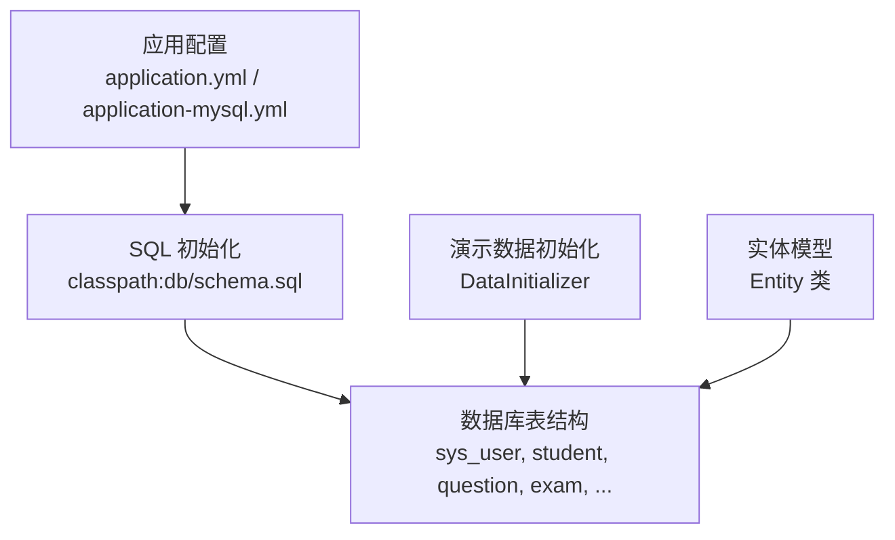
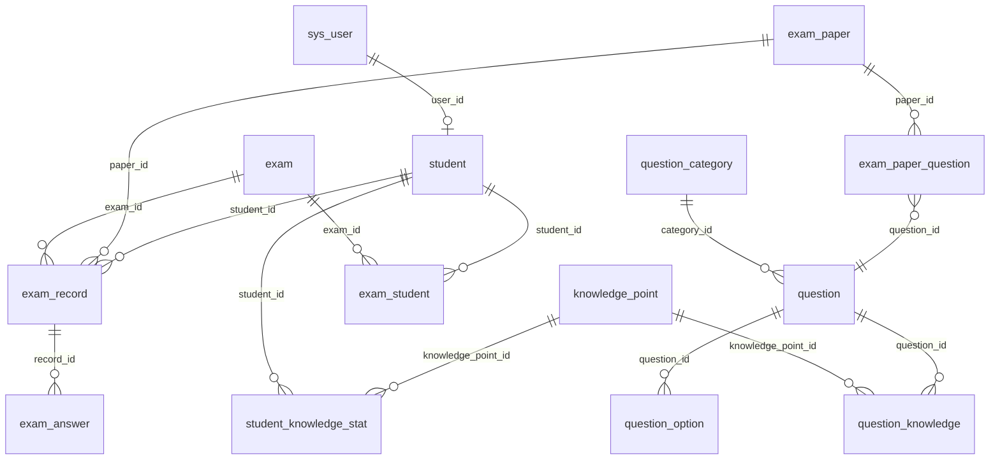
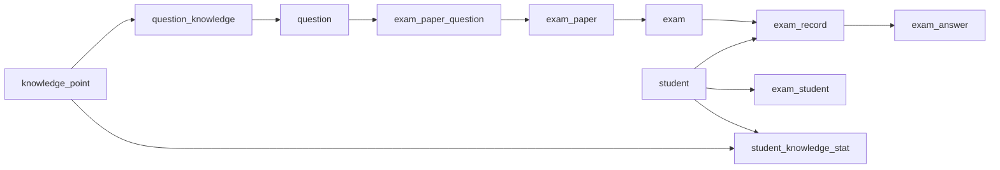
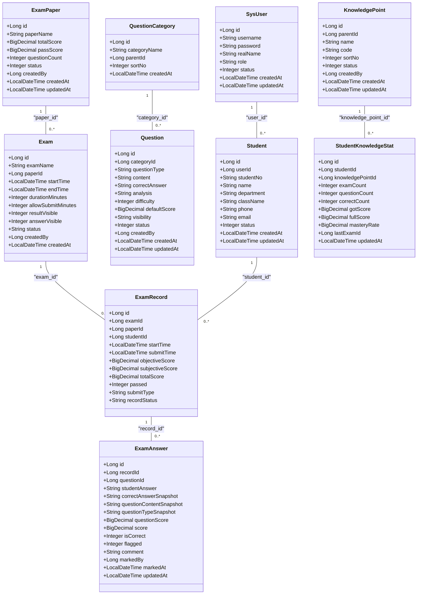

# 数据库设计

<cite>
**本文引用的文件**
- [sql/schema.sql](file://sql/schema.sql)
- [sql/schema-mysql.sql](file://sql/schema-mysql.sql)
- [exam-server/src/main/resources/db/schema.sql](file://exam-server/src/main/resources/db/schema.sql)
- [exam-server/src/main/java/com/exam/entity/SysUser.java](file://exam-server/src/main/java/com/exam/entity/SysUser.java)
- [exam-server/src/main/java/com/exam/entity/Student.java](file://exam-server/src/main/java/com/exam/entity/Student.java)
- [exam-server/src/main/java/com/exam/entity/Question.java](file://exam-server/src/main/java/com/exam/entity/Question.java)
- [exam-server/src/main/java/com/exam/entity/Exam.java](file://exam-server/src/main/java/com/exam/entity/Exam.java)
- [exam-server/src/main/java/com/exam/entity/ExamRecord.java](file://exam-server/src/main/java/com/exam/entity/ExamRecord.java)
- [exam-server/src/main/java/com/exam/entity/ExamAnswer.java](file://exam-server/src/main/java/com/exam/entity/ExamAnswer.java)
- [exam-server/src/main/java/com/exam/entity/KnowledgePoint.java](file://exam-server/src/main/java/com/exam/entity/KnowledgePoint.java)
- [exam-server/src/main/java/com/exam/entity/StudentKnowledgeStat.java](file://exam-server/src/main/java/com/exam/entity/StudentKnowledgeStat.java)
- [exam-server/src/main/java/com/exam/entity/QuestionCategory.java](file://exam-server/src/main/java/com/exam/entity/QuestionCategory.java)
- [exam-server/src/main/java/com/exam/entity/ExamPaper.java](file://exam-server/src/main/java/com/exam/entity/ExamPaper.java)
- [exam-server/src/main/java/com/exam/config/DataInitializer.java](file://exam-server/src/main/java/com/exam/config/DataInitializer.java)
- [exam-server/src/main/resources/application.yml](file://exam-server/src/main/resources/application.yml)
- [exam-server/src/main/resources/application-mysql.yml](file://exam-server/src/main/resources/application-mysql.yml)
</cite>

## 目录
1. [简介](#简介)
2. [项目结构](#项目结构)
3. [核心组件](#核心组件)
4. [架构总览](#架构总览)
5. [详细组件分析](#详细组件分析)
6. [依赖关系分析](#依赖关系分析)
7. [性能考虑](#性能考虑)
8. [故障排查指南](#故障排查指南)
9. [结论](#结论)
10. [附录](#附录)

## 简介
本文件面向教学考试平台的数据库设计与实现，覆盖用户管理、题库管理、试卷与考试管理、答题记录、学情分析等核心模块的表结构设计、主外键约束、索引策略、数据完整性保证、数据类型选择与命名规范、存储优化策略，以及建表脚本说明、数据初始化流程、数据迁移与版本管理建议。文档以实际代码与脚本为依据，确保可落地执行。

## 项目结构
- 数据库脚本位于 sql 与 resources/db 下，提供 MySQL/H2 兼容的建表语句；MySQL 专用脚本在 sql/schema-mysql.sql。
- 实体类位于 exam-server/src/main/java/com/exam/entity，映射到对应表，用于 ORM 操作。
- 应用配置在 application.yml 与 application-mysql.yml，控制数据源与 SQL 初始化行为。
- 演示数据初始化由 DataInitializer 在启动时完成（当库为空时）。

图表来源
- [exam-server/src/main/resources/application.yml:19-24](file://exam-server/src/main/resources/application.yml#L19-L24)
- [exam-server/src/main/resources/application-mysql.yml:7-11](file://exam-server/src/main/resources/application-mysql.yml#L7-L11)
- [exam-server/src/main/java/com/exam/config/DataInitializer.java:56-71](file://exam-server/src/main/java/com/exam/config/DataInitializer.java#L56-L71)

章节来源
- [exam-server/src/main/resources/application.yml:1-42](file://exam-server/src/main/resources/application.yml#L1-L42)
- [exam-server/src/main/resources/application-mysql.yml:1-12](file://exam-server/src/main/resources/application-mysql.yml#L1-L12)
- [exam-server/src/main/java/com/exam/config/DataInitializer.java:1-268](file://exam-server/src/main/java/com/exam/config/DataInitializer.java#L1-L268)

## 核心组件
- 用户与角色：sys_user（登录账号）、student（学生档案），通过 user_id 关联。
- 题库与知识点：question_category、question、question_option、knowledge_point、question_knowledge。
- 试卷与考试：exam_paper、exam_paper_question、exam、exam_student。
- 答题与成绩：exam_record、exam_answer。
- 学情统计：student_knowledge_stat。
- 系统日志与头像：sys_oper_log、sys_user_avatar。

章节来源
- [sql/schema.sql:1-204](file://sql/schema.sql#L1-L204)
- [sql/schema-mysql.sql:1-207](file://sql/schema-mysql.sql#L1-L207)
- [exam-server/src/main/java/com/exam/entity/SysUser.java:1-24](file://exam-server/src/main/java/com/exam/entity/SysUser.java#L1-L24)
- [exam-server/src/main/java/com/exam/entity/Student.java:1-27](file://exam-server/src/main/java/com/exam/entity/Student.java#L1-L27)
- [exam-server/src/main/java/com/exam/entity/Question.java:1-30](file://exam-server/src/main/java/com/exam/entity/Question.java#L1-L30)
- [exam-server/src/main/java/com/exam/entity/Exam.java:1-28](file://exam-server/src/main/java/com/exam/entity/Exam.java#L1-L28)
- [exam-server/src/main/java/com/exam/entity/ExamRecord.java:1-29](file://exam-server/src/main/java/com/exam/entity/ExamRecord.java#L1-L29)
- [exam-server/src/main/java/com/exam/entity/ExamAnswer.java:1-32](file://exam-server/src/main/java/com/exam/entity/ExamAnswer.java#L1-L32)
- [exam-server/src/main/java/com/exam/entity/KnowledgePoint.java:1-25](file://exam-server/src/main/java/com/exam/entity/KnowledgePoint.java#L1-L25)
- [exam-server/src/main/java/com/exam/entity/StudentKnowledgeStat.java:1-28](file://exam-server/src/main/java/com/exam/entity/StudentKnowledgeStat.java#L1-L28)
- [exam-server/src/main/java/com/exam/entity/QuestionCategory.java:1-21](file://exam-server/src/main/java/com/exam/entity/QuestionCategory.java#L1-L21)
- [exam-server/src/main/java/com/exam/entity/ExamPaper.java:1-26](file://exam-server/src/main/java/com/exam/entity/ExamPaper.java#L1-L26)

## 架构总览
下图展示核心实体之间的关系，包括一对多、多对多及快照字段的设计意图。

图表来源
- [sql/schema-mysql.sql:5-207](file://sql/schema-mysql.sql#L5-L207)
- [exam-server/src/main/java/com/exam/entity/SysUser.java:10-23](file://exam-server/src/main/java/com/exam/entity/SysUser.java#L10-L23)
- [exam-server/src/main/java/com/exam/entity/Student.java:10-26](file://exam-server/src/main/java/com/exam/entity/Student.java#L10-L26)
- [exam-server/src/main/java/com/exam/entity/Question.java:11-29](file://exam-server/src/main/java/com/exam/entity/Question.java#L11-L29)
- [exam-server/src/main/java/com/exam/entity/Exam.java:10-27](file://exam-server/src/main/java/com/exam/entity/Exam.java#L10-L27)
- [exam-server/src/main/java/com/exam/entity/ExamRecord.java:11-28](file://exam-server/src/main/java/com/exam/entity/ExamRecord.java#L11-L28)
- [exam-server/src/main/java/com/exam/entity/ExamAnswer.java:11-31](file://exam-server/src/main/java/com/exam/entity/ExamAnswer.java#L11-L31)
- [exam-server/src/main/java/com/exam/entity/KnowledgePoint.java:10-24](file://exam-server/src/main/java/com/exam/entity/KnowledgePoint.java#L10-L24)
- [exam-server/src/main/java/com/exam/entity/StudentKnowledgeStat.java:10-27](file://exam-server/src/main/java/com/exam/entity/StudentKnowledgeStat.java#L10-L27)
- [exam-server/src/main/java/com/exam/entity/QuestionCategory.java:10-20](file://exam-server/src/main/java/com/exam/entity/QuestionCategory.java#L10-L20)
- [exam-server/src/main/java/com/exam/entity/ExamPaper.java:10-25](file://exam-server/src/main/java/com/exam/entity/ExamPaper.java#L10-L25)

## 详细组件分析

### 用户与学生
- 主键与唯一性：sys_user.id 自增主键；username 唯一索引，避免重复登录名。
- 字段类型：密码使用足够长度的字符串存储（后端采用 BCrypt）；状态位使用 TINYINT；时间戳使用 DATETIME。
- 关联：student.user_id 引用 sys_user.id，形成一对一扩展。
- 索引：student_no 唯一索引；按 department、user_id 建立索引以支持查询。

章节来源
- [sql/schema-mysql.sql:5-32](file://sql/schema-mysql.sql#L5-L32)
- [exam-server/src/main/java/com/exam/entity/SysUser.java:10-23](file://exam-server/src/main/java/com/exam/entity/SysUser.java#L10-L23)
- [exam-server/src/main/java/com/exam/entity/Student.java:10-26](file://exam-server/src/main/java/com/exam/entity/Student.java#L10-L26)

### 题库与知识点
- 分类与题目：question_category 为题目分类；question.category_id 指向分类；question.question_type 标识题型。
- 选项：question_option.question_id 指向题目；option_key 表示选项键；is_correct 标记正确答案。
- 知识点树：knowledge_point.parent_id 构建树形结构；sort_no 控制排序。
- 题目-知识点关联：question_knowledge 为多对多桥接表，weight 表示权重；联合唯一索引防止重复关联。
- 索引：按 category_id、question_type、knowledge_point_id 建立索引提升查询效率。

章节来源
- [sql/schema-mysql.sql:34-90](file://sql/schema-mysql.sql#L34-L90)
- [exam-server/src/main/java/com/exam/entity/Question.java:11-29](file://exam-server/src/main/java/com/exam/entity/Question.java#L11-L29)
- [exam-server/src/main/java/com/exam/entity/KnowledgePoint.java:10-24](file://exam-server/src/main/java/com/exam/entity/KnowledgePoint.java#L10-L24)
- [exam-server/src/main/java/com/exam/entity/QuestionCategory.java:10-20](file://exam-server/src/main/java/com/exam/entity/QuestionCategory.java#L10-L20)

### 试卷与考试
- 试卷：exam_paper 定义总分、及格分、题数；exam_paper_question 将题目加入试卷并设置每题分数与顺序。
- 考试：exam 绑定 paper_id，定义开始/结束时间、时长、是否公布成绩/答案、状态；exam_student 指定考生与状态。
- 索引：exam.start_time/end_time 复合索引便于按时间范围筛选；exam_paper_question.paper_id 索引加速组卷查询。

章节来源
- [sql/schema-mysql.sql:92-136](file://sql/schema-mysql.sql#L92-L136)
- [exam-server/src/main/java/com/exam/entity/ExamPaper.java:10-25](file://exam-server/src/main/java/com/exam/entity/ExamPaper.java#L10-L25)
- [exam-server/src/main/java/com/exam/entity/Exam.java:10-27](file://exam-server/src/main/java/com/exam/entity/Exam.java#L10-L27)

### 答题记录与评分
- 答卷：exam_record 记录一场考试的总体得分、是否通过、提交方式与状态；唯一索引 (exam_id, student_id) 保证每人每场仅一条记录。
- 答题明细：exam_answer 记录每题作答、正确答案快照、题干快照、题型快照、得分、是否正确、是否标注、评语、阅卷人与时间；唯一索引 (record_id, question_id)。
- 快照设计：correct_answer_snapshot、question_content_snapshot、question_type_snapshot 保障历史答题不受后续题库变更影响。

章节来源
- [sql/schema-mysql.sql:138-174](file://sql/schema-mysql.sql#L138-L174)
- [exam-server/src/main/java/com/exam/entity/ExamRecord.java:11-28](file://exam-server/src/main/java/com/exam/entity/ExamRecord.java#L11-L28)
- [exam-server/src/main/java/com/exam/entity/ExamAnswer.java:11-31](file://exam-server/src/main/java/com/exam/entity/ExamAnswer.java#L11-L31)

### 学情分析
- 统计表：student_knowledge_stat 聚合学生在各知识点的答题次数、正确次数、得分、掌握率、最近考试 ID；唯一索引 (student_id, knowledge_point_id)。
- 索引：按 knowledge_point_id + mastery_rate 建立复合索引，支持薄弱点与掌握度排序查询。

章节来源
- [sql/schema-mysql.sql:176-190](file://sql/schema-mysql.sql#L176-L190)
- [exam-server/src/main/java/com/exam/entity/StudentKnowledgeStat.java:10-27](file://exam-server/src/main/java/com/exam/entity/StudentKnowledgeStat.java#L10-L27)

### 系统日志与头像
- 操作日志：sys_oper_log 记录操作人、操作类型与详情，便于审计。
- 头像：sys_user_avatar 以 MEDIUMBLOB 存储图片二进制，content_type 描述 MIME 类型。

章节来源
- [sql/schema-mysql.sql:192-207](file://sql/schema-mysql.sql#L192-L207)

## 依赖关系分析
- 强耦合点：
  - exam_record 依赖 exam 与 student，且包含 paper_id 快照，避免考试配置变化影响历史记录。
  - exam_answer 依赖 exam_record 与 question，并通过快照隔离题库变更。
  - student_knowledge_stat 依赖 student 与 knowledge_point，并在阅卷完成后回写。
- 弱耦合点：
  - 题库与试卷解耦：exam_paper_question 将题目与试卷组合，便于复用。
  - 用户与学生解耦：通过 user_id 关联，便于权限与档案分离。

图表来源
- [sql/schema-mysql.sql:55-190](file://sql/schema-mysql.sql#L55-L190)

章节来源
- [sql/schema-mysql.sql:55-190](file://sql/schema-mysql.sql#L55-L190)

## 性能考虑
- 索引策略：
  - 高频查询字段均建立索引：如 exam(start_time,end_time)、exam_record(exam_id,total_score)、student_knowledge_stat(knowledge_point_id,mastery_rate)。
  - 唯一约束避免重复插入：如 uk_exam_record、uk_record_question、uk_exam_student。
- 数据类型：
  - 金额使用 DECIMAL(精度与小数位根据业务设定)，避免浮点误差。
  - 大文本使用 TEXT/MEDIUMBLOB，头像用 MEDIUMBLOB 减少外部存储依赖。
- 快照字段：
  - 答题相关快照字段降低跨表一致性压力，提高读性能与历史可追溯性。
- 初始化与导入：
  - 批量写入演示数据时使用事务包裹，保证一致性。
  - 导入题库建议使用分批提交与索引临时关闭/重建策略（生产环境）。

[本节为通用性能建议，不直接分析具体文件]

## 故障排查指南
- 数据库连接与初始化：
  - 检查 application.yml 中 spring.sql.init.mode 与 schema-locations 配置，确认脚本路径与编码。
  - MySQL 模式下，application-mysql.yml 指定驱动、URL、用户名与密码，注意环境变量覆盖。
- 演示数据未生成：
  - DataInitializer 仅在库为空时写入演示数据；若已有用户则跳过初始化。
- 常见错误：
  - 唯一约束冲突：如 username、student_no、exam_record(exam_id,student_id) 重复。
  - 外键缺失：需先创建父表记录再插入子表。
  - 字符集问题：确保数据库与连接使用 utf8mb4，避免中文乱码。

章节来源
- [exam-server/src/main/resources/application.yml:19-24](file://exam-server/src/main/resources/application.yml#L19-L24)
- [exam-server/src/main/resources/application-mysql.yml:1-12](file://exam-server/src/main/resources/application-mysql.yml#L1-L12)
- [exam-server/src/main/java/com/exam/config/DataInitializer.java:56-71](file://exam-server/src/main/java/com/exam/config/DataInitializer.java#L56-L71)

## 结论
该数据库设计围绕“题库-试卷-考试-答题-学情”的主线展开，采用合理的表拆分与快照机制，兼顾数据一致性与历史可追溯性。通过唯一约束与索引设计，保障了数据完整性与查询性能。配合应用层的初始化与配置，可在 H2 或 MySQL 环境下快速部署与运行。

[本节为总结性内容，不直接分析具体文件]

## 附录

### ER 图（代码级映射）

图表来源
- [exam-server/src/main/java/com/exam/entity/SysUser.java:10-23](file://exam-server/src/main/java/com/exam/entity/SysUser.java#L10-L23)
- [exam-server/src/main/java/com/exam/entity/Student.java:10-26](file://exam-server/src/main/java/com/exam/entity/Student.java#L10-L26)
- [exam-server/src/main/java/com/exam/entity/Question.java:11-29](file://exam-server/src/main/java/com/exam/entity/Question.java#L11-L29)
- [exam-server/src/main/java/com/exam/entity/Exam.java:10-27](file://exam-server/src/main/java/com/exam/entity/Exam.java#L10-L27)
- [exam-server/src/main/java/com/exam/entity/ExamRecord.java:11-28](file://exam-server/src/main/java/com/exam/entity/ExamRecord.java#L11-L28)
- [exam-server/src/main/java/com/exam/entity/ExamAnswer.java:11-31](file://exam-server/src/main/java/com/exam/entity/ExamAnswer.java#L11-L31)
- [exam-server/src/main/java/com/exam/entity/KnowledgePoint.java:10-24](file://exam-server/src/main/java/com/exam/entity/KnowledgePoint.java#L10-L24)
- [exam-server/src/main/java/com/exam/entity/StudentKnowledgeStat.java:10-27](file://exam-server/src/main/java/com/exam/entity/StudentKnowledgeStat.java#L10-L27)
- [exam-server/src/main/java/com/exam/entity/QuestionCategory.java:10-20](file://exam-server/src/main/java/com/exam/entity/QuestionCategory.java#L10-L20)
- [exam-server/src/main/java/com/exam/entity/ExamPaper.java:10-25](file://exam-server/src/main/java/com/exam/entity/ExamPaper.java#L10-L25)

### 建表脚本说明
- 默认使用 H2 文件库，首次启动自动执行 classpath:db/schema.sql 建表。
- 使用 MySQL 时，可通过 application-mysql.yml 切换数据源，并同样执行 schema.sql。
- 脚本包含所有核心表的 CREATE TABLE 与索引定义，兼容 MySQL 8 与 H2 MySQL 模式。

章节来源
- [exam-server/src/main/resources/application.yml:19-24](file://exam-server/src/main/resources/application.yml#L19-L24)
- [exam-server/src/main/resources/application-mysql.yml:7-11](file://exam-server/src/main/resources/application-mysql.yml#L7-L11)
- [sql/schema.sql:1-204](file://sql/schema.sql#L1-L204)
- [sql/schema-mysql.sql:1-207](file://sql/schema-mysql.sql#L1-L207)

### 数据初始化流程
- 启动时 DataInitializer 检测用户表是否有数据，若无则写入演示数据（管理员、教师、两名学生、知识点树、样题、试卷、考试与考生分配）。
- 演示数据包含进行中的考试，学生可直接作答；简答题需教师阅卷后出总分并更新学情。

章节来源
- [exam-server/src/main/java/com/exam/config/DataInitializer.java:56-172](file://exam-server/src/main/java/com/exam/config/DataInitializer.java#L56-L172)

### 数据迁移方案与版本管理建议
- 脚本分层：
  - V1_0_0__init_schema.sql：初始建表与索引。
  - V1_1_0__add_indexes.sql：新增或优化索引。
  - V1_2_0__alter_tables.sql：表结构变更（如新增字段、调整类型）。
- 变更原则：
  - 向后兼容：新增字段允许为空并提供默认值；删除字段前评估依赖。
  - 幂等执行：DDL 使用 IF NOT EXISTS / DROP IF EXISTS 谨慎处理。
  - 回滚脚本：每个升级脚本配套 rollback 脚本。
- 执行时机：
  - 应用启动时由框架自动执行（当前配置为 always），生产环境建议引入独立迁移工具（如 Flyway/Liquibase）并改为 on_missing 或 migration-only。
- 数据校验：
  - 变更后执行数据一致性校验（计数、抽样对比、约束验证）。

[本节为通用迁移建议，不直接分析具体文件]

### 字段命名规范与数据类型选择
- 命名规范：
  - 表名小写下划线分隔（如 exam_record、student_knowledge_stat）。
  - 主键统一为 id；外键使用语义化名称（如 exam_id、student_id、paper_id）。
  - 时间字段使用 created_at、updated_at、start_time、submit_time 等明确语义。
- 数据类型：
  - 金额使用 DECIMAL，避免浮点误差。
  - 文本使用 VARCHAR/TEXT，大对象使用 MEDIUMBLOB（头像）。
  - 状态位使用 TINYINT，枚举值通过注释或字典维护。
- 索引与约束：
  - 唯一约束用于业务唯一性（如 username、student_no、exam_record 联合唯一）。
  - 复合索引用于高频查询条件（如 exam 时间范围、学情掌握率排序）。

章节来源
- [sql/schema-mysql.sql:5-207](file://sql/schema-mysql.sql#L5-L207)
- [exam-server/src/main/java/com/exam/entity/SysUser.java:10-23](file://exam-server/src/main/java/com/exam/entity/SysUser.java#L10-L23)
- [exam-server/src/main/java/com/exam/entity/StudentKnowledgeStat.java:10-27](file://exam-server/src/main/java/com/exam/entity/StudentKnowledgeStat.java#L10-L27)