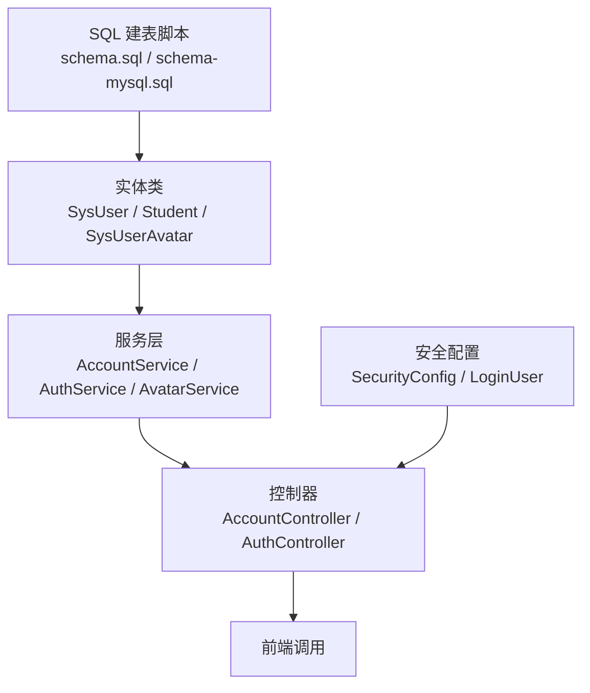
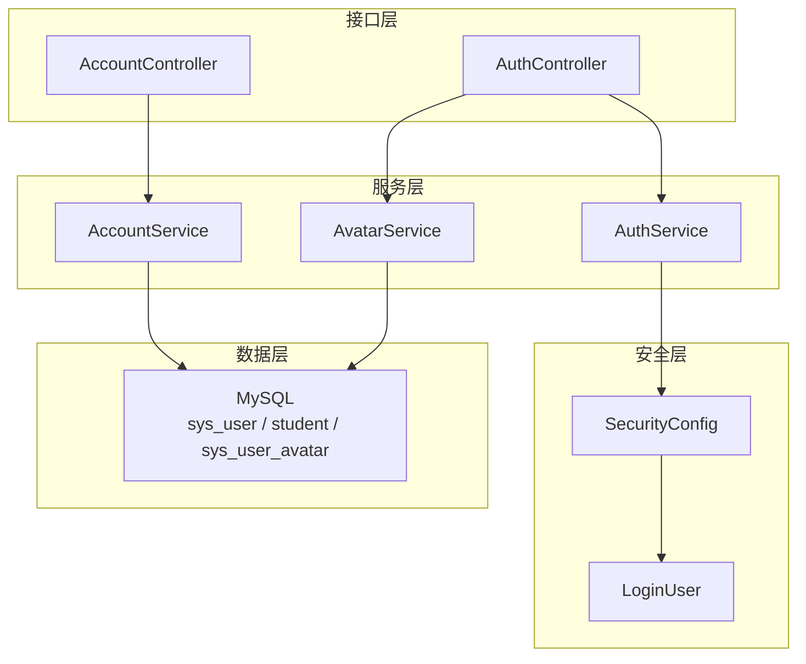
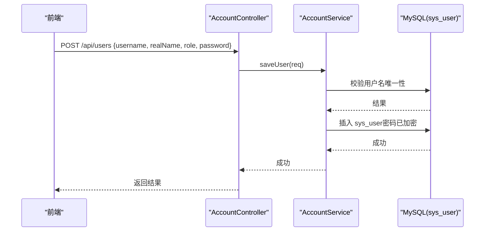
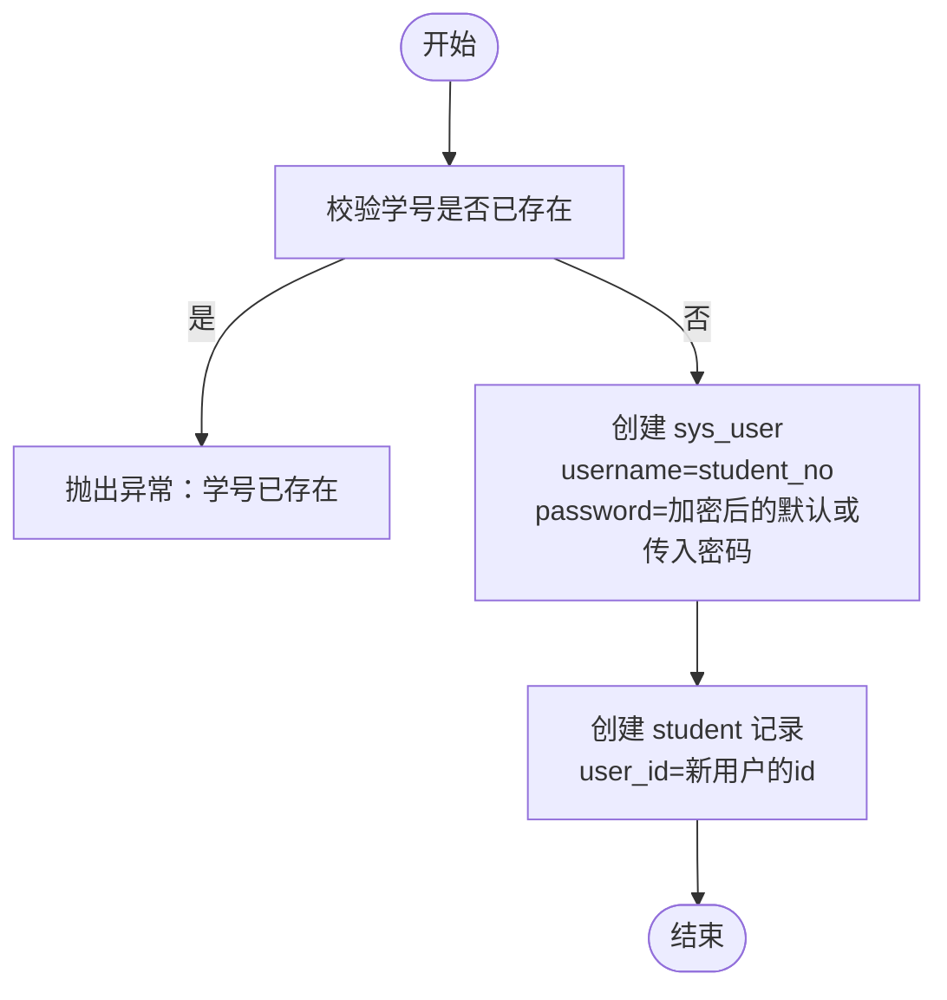
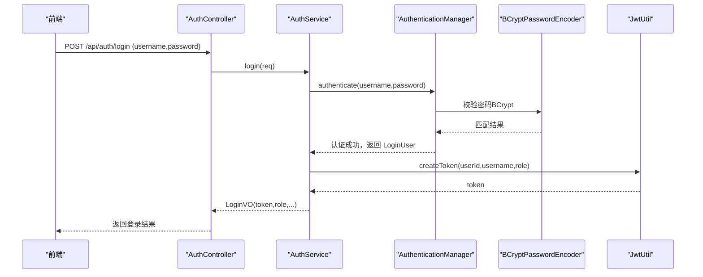
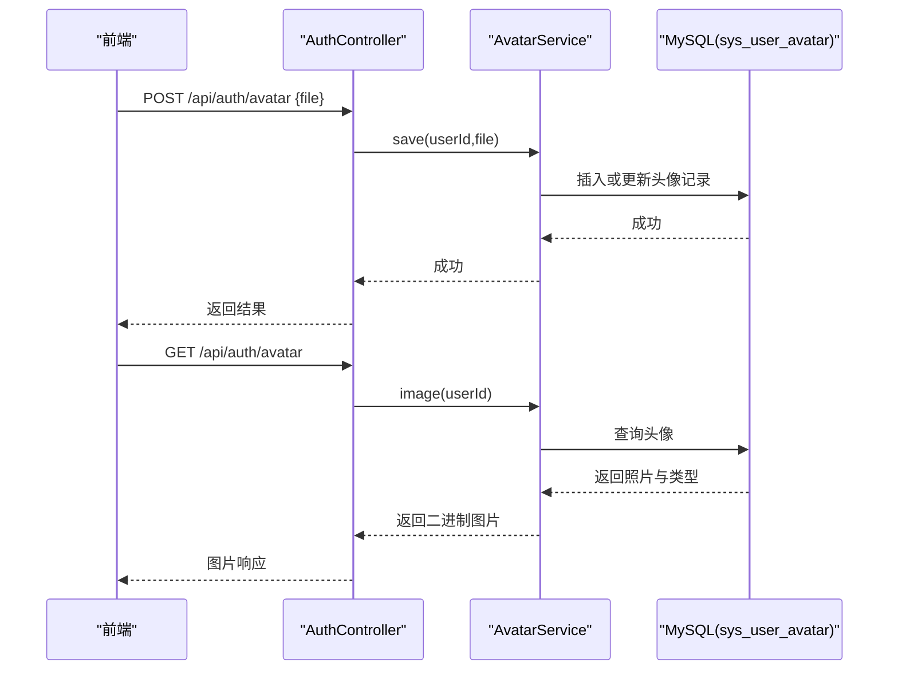
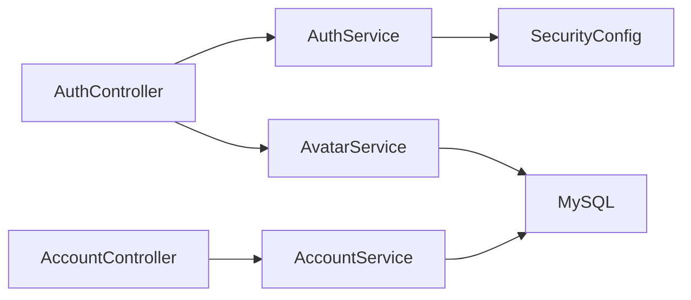

# 用户管理数据模型

<cite>
**本文引用的文件**
- [SysUser.java](file://exam-server/src/main/java/com/exam/entity/SysUser.java)
- [Student.java](file://exam-server/src/main/java/com/exam/entity/Student.java)
- [SysUserAvatar.java](file://exam-server/src/main/java/com/exam/entity/SysUserAvatar.java)
- [schema.sql](file://sql/schema.sql)
- [schema-mysql.sql](file://sql/schema-mysql.sql)
- [LoginRequest.java](file://exam-server/src/main/java/com/exam/dto/LoginRequest.java)
- [LoginVO.java](file://exam-server/src/main/java/com/exam/dto/LoginVO.java)
- [UserSaveRequest.java](file://exam-server/src/main/java/com/exam/dto/UserSaveRequest.java)
- [AuthService.java](file://exam-server/src/main/java/com/exam/service/AuthService.java)
- [AccountService.java](file://exam-server/src/main/java/com/exam/service/AccountService.java)
- [AvatarService.java](file://exam-server/src/main/java/com/exam/service/AvatarService.java)
- [AuthController.java](file://exam-server/src/main/java/com/exam/controller/AuthController.java)
- [AccountController.java](file://exam-server/src/main/java/com/exam/controller/AccountController.java)
- [SecurityConfig.java](file://exam-server/src/main/java/com/exam/config/SecurityConfig.java)
- [LoginUser.java](file://exam-server/src/main/java/com/exam/security/LoginUser.java)
</cite>

## 目录
1. [简介](#简介)
2. [项目结构](#项目结构)
3. [核心组件](#核心组件)
4. [架构总览](#架构总览)
5. [详细组件分析](#详细组件分析)
6. [依赖关系分析](#依赖关系分析)
7. [性能考虑](#性能考虑)
8. [故障排查指南](#故障排查指南)
9. [结论](#结论)
10. [附录](#附录)

## 简介
本文件聚焦“用户管理模块”的数据模型与相关流程，围绕 sys_user 与 student 两张表的结构设计、角色体系（管理员、教师、学生）、用户状态管理、用户与学生信息的关联关系进行说明。同时给出字段类型选择、约束条件与索引设计的考量，并补充注册、登录、权限验证的数据流，以及头像存储、密码加密等安全处理方案。

## 项目结构
- 数据模型定义在 SQL 脚本中，实体类映射到数据库表；服务层封装业务逻辑；控制器暴露 API；安全配置负责鉴权与密码编码。
- 关键文件包括：建表脚本、实体类、DTO、服务类、控制器与安全配置。

图表来源
- [schema.sql:1-30](file://sql/schema.sql#L1-L30)
- [SysUser.java:10-23](file://exam-server/src/main/java/com/exam/entity/SysUser.java#L10-L23)
- [Student.java:10-26](file://exam-server/src/main/java/com/exam/entity/Student.java#L10-L26)
- [SysUserAvatar.java:10-19](file://exam-server/src/main/java/com/exam/entity/SysUserAvatar.java#L10-L19)
- [AccountService.java:23-30](file://exam-server/src/main/java/com/exam/service/AccountService.java#L23-L30)
- [AuthService.java:14-21](file://exam-server/src/main/java/com/exam/service/AuthService.java#L14-L21)
- [AvatarService.java:21-27](file://exam-server/src/main/java/com/exam/service/AvatarService.java#L21-L27)
- [AccountController.java:26-31](file://exam-server/src/main/java/com/exam/controller/AccountController.java#L26-L31)
- [AuthController.java:23-29](file://exam-server/src/main/java/com/exam/controller/AuthController.java#L23-L29)
- [SecurityConfig.java:25-32](file://exam-server/src/main/java/com/exam/config/SecurityConfig.java#L25-L32)

章节来源
- [schema.sql:1-30](file://sql/schema.sql#L1-L30)
- [schema-mysql.sql:1-33](file://sql/schema-mysql.sql#L1-L33)
- [SysUser.java:10-23](file://exam-server/src/main/java/com/exam/entity/SysUser.java#L10-L23)
- [Student.java:10-26](file://exam-server/src/main/java/com/exam/entity/Student.java#L10-L26)
- [SysUserAvatar.java:10-19](file://exam-server/src/main/java/com/exam/entity/SysUserAvatar.java#L10-L19)

## 核心组件
- 用户账号表 sys_user：承载登录名、密码、真实姓名、角色、状态与时间戳。
- 学生档案表 student：通过 user_id 与 sys_user 一对一关联，记录学号、班级、院系、联系方式等。
- 头像表 sys_user_avatar：以 MEDIUMBLOB 存储当前用户的头像二进制内容，与 sys_user 一对一。
- 安全与认证：使用 BCrypt 对密码进行加密；Spring Security + JWT 实现无状态鉴权；角色前缀 ROLE_ 注入到权限体系。
- 服务层：AccountService 负责用户与学生档案的增删改查及导入；AuthService 负责登录与签发令牌；AvatarService 负责头像上传、读取与删除。

章节来源
- [SysUser.java:10-23](file://exam-server/src/main/java/com/exam/entity/SysUser.java#L10-L23)
- [Student.java:10-26](file://exam-server/src/main/java/com/exam/entity/Student.java#L10-L26)
- [SysUserAvatar.java:10-19](file://exam-server/src/main/java/com/exam/entity/SysUserAvatar.java#L10-L19)
- [SecurityConfig.java:68-71](file://exam-server/src/main/java/com/exam/config/SecurityConfig.java#L68-L71)
- [AuthService.java:22-38](file://exam-server/src/main/java/com/exam/service/AuthService.java#L22-L38)
- [AccountService.java:46-76](file://exam-server/src/main/java/com/exam/service/AccountService.java#L46-L76)
- [AvatarService.java:46-76](file://exam-server/src/main/java/com/exam/service/AvatarService.java#L46-L76)

## 架构总览
下图展示用户管理模块的核心交互：控制器接收请求，服务层执行业务逻辑，持久化访问数据库；安全配置负责密码编码与权限校验。

图表来源
- [AuthController.java:23-65](file://exam-server/src/main/java/com/exam/controller/AuthController.java#L23-L65)
- [AccountController.java:26-94](file://exam-server/src/main/java/com/exam/controller/AccountController.java#L26-L94)
- [AuthService.java:14-51](file://exam-server/src/main/java/com/exam/service/AuthService.java#L14-L51)
- [AccountService.java:23-186](file://exam-server/src/main/java/com/exam/service/AccountService.java#L23-L186)
- [AvatarService.java:21-101](file://exam-server/src/main/java/com/exam/service/AvatarService.java#L21-L101)
- [SecurityConfig.java:25-90](file://exam-server/src/main/java/com/exam/config/SecurityConfig.java#L25-L90)
- [LoginUser.java:11-58](file://exam-server/src/main/java/com/exam/security/LoginUser.java#L11-L58)

## 详细组件分析

### 数据模型：sys_user
- 主键 id：BIGINT 自增。
- username：VARCHAR(50)，非空，唯一索引 uk_sys_user_username，用于登录与去重。
- password：VARCHAR(255)，非空，存储 BCrypt 哈希值，不存明文。
- real_name：VARCHAR(50)，非空，显示名称。
- role：VARCHAR(20)，非空，取值 ADMIN / TEACHER / STUDENT。
- status：TINYINT，默认 1，表示启用/停用。
- created_at / updated_at：DATETIME，记录创建与更新时间。

设计要点
- 用户名唯一性由数据库唯一索引保障，避免并发下重复注册。
- 密码长度预留至 255，兼容 BCrypt 输出长度。
- 角色采用字符串枚举，便于扩展与查询过滤。

章节来源
- [schema.sql:2-12](file://sql/schema.sql#L2-L12)
- [schema-mysql.sql:5-15](file://sql/schema-mysql.sql#L5-L15)
- [SysUser.java:10-23](file://exam-server/src/main/java/com/exam/entity/SysUser.java#L10-L23)

### 数据模型：student
- 主键 id：BIGINT 自增。
- user_id：BIGINT，非空，外键语义指向 sys_user.id，建立一对一关系。
- student_no：VARCHAR(50)，非空，唯一索引 uk_student_no，作为学号与登录名。
- name：VARCHAR(50)，非空。
- department / class_name：可选，院系与班级。
- phone / email：可选，联系方式。
- status：TINYINT，默认 1。
- created_at / updated_at：DATETIME。

设计要点
- 通过 user_id 将“登录账号”与“学生档案”解耦，便于统一权限与资料管理。
- 为 user_id 与 department 建立索引，优化按用户或院系筛选的性能。
- 学号唯一约束保证学生身份唯一性。

章节来源
- [schema.sql:14-29](file://sql/schema.sql#L14-L29)
- [schema-mysql.sql:17-32](file://sql/schema-mysql.sql#L17-L32)
- [Student.java:10-26](file://exam-server/src/main/java/com/exam/entity/Student.java#L10-L26)

### 数据模型：sys_user_avatar
- user_id：BIGINT 主键，与 sys_user 一对一。
- content_type：VARCHAR(80)，记录图片 MIME 类型。
- photo：MEDIUMBLOB，存储二进制图片数据。
- updated_at：DATETIME，最后更新时间。

设计要点
- 头像独立成表，避免在主表中频繁更新大字段影响性能。
- 限制图片大小与类型，防止恶意上传与存储膨胀。

章节来源
- [schema.sql:198-203](file://sql/schema.sql#L198-L203)
- [schema-mysql.sql:201-206](file://sql/schema-mysql.sql#L201-L206)
- [SysUserAvatar.java:10-19](file://exam-server/src/main/java/com/exam/entity/SysUserAvatar.java#L10-L19)

### 角色体系与权限
- 角色取值：ADMIN（管理员）、TEACHER（教师）、STUDENT（学生）。
- Spring Security 将角色转换为 ROLE_ADMIN / ROLE_TEACHER / ROLE_STUDENT 权限。
- 路由级权限控制：
  - /api/student/** 仅学生可访问。
  - /api/users/** 仅管理员可访问。
  - 其他 /api/** 需教师或管理员。
- 登录成功后返回角色信息，前端据此跳转不同端。

章节来源
- [SecurityConfig.java:42-50](file://exam-server/src/main/java/com/exam/config/SecurityConfig.java#L42-L50)
- [LoginUser.java:33-36](file://exam-server/src/main/java/com/exam/security/LoginUser.java#L33-L36)
- [LoginVO.java:7-15](file://exam-server/src/main/java/com/exam/dto/LoginVO.java#L7-L15)

### 用户状态管理
- sys_user.status 与 student.status 均使用 TINYINT，默认 1 表示启用。
- 登录时检查 enabled 标志，若停用则拒绝登录。
- 账户列表查询支持按角色与关键字过滤，便于运营维护。

章节来源
- [schema.sql:8-10](file://sql/schema.sql#L8-L10)
- [schema-mysql.sql:11-13](file://sql/schema-mysql.sql#L11-L13)
- [AuthService.java:22-38](file://exam-server/src/main/java/com/exam/service/AuthService.java#L22-L38)
- [AccountService.java:32-44](file://exam-server/src/main/java/com/exam/service/AccountService.java#L32-L44)

### 用户与学生信息的关联关系
- 新增学生时，系统自动创建一条 sys_user 记录，username 与 student_no 一致，role 设为 STUDENT，默认密码为固定值或传入密码。
- 随后创建 student 记录，user_id 指向新创建的 sys_user.id。
- 更新学生信息时，同步更新 sys_user.real_name 与密码（如提供）。
- 删除学生时，先删除头像，再删除对应 sys_user 记录。

章节来源
- [AccountService.java:95-139](file://exam-server/src/main/java/com/exam/service/AccountService.java#L95-L139)
- [AccountService.java:164-175](file://exam-server/src/main/java/com/exam/service/AccountService.java#L164-L175)

### 字段类型选择与约束、索引设计
- 文本字段：username、real_name、name、department、class_name、phone、email 等根据业务长度选择 VARCHAR，兼顾可读性与存储效率。
- 数值字段：status 使用 TINYINT，节省空间且表达清晰。
- 时间字段：created_at / updated_at 使用 DATETIME，便于审计与排序。
- 唯一约束：username 与 student_no 设置唯一索引，防止重复。
- 查询索引：student.user_id、student.department 建立普通索引，提升筛选与关联查询性能。
- 头像存储：MEDIUMBLOB 适合中小图片，配合大小限制与类型白名单控制风险。

章节来源
- [schema.sql:2-29](file://sql/schema.sql#L2-L29)
- [schema-mysql.sql:5-32](file://sql/schema-mysql.sql#L5-L32)
- [AvatarService.java:46-76](file://exam-server/src/main/java/com/exam/service/AvatarService.java#L46-L76)

### 用户注册流程（管理员/教师）
- 管理员通过 AccountController 调用 AccountService.saveUser，校验角色与用户名唯一性，必要时加密密码后写入 sys_user。
- 返回结果供前端提示。

图表来源
- [AccountController.java:40-45](file://exam-server/src/main/java/com/exam/controller/AccountController.java#L40-L45)
- [AccountService.java:46-76](file://exam-server/src/main/java/com/exam/service/AccountService.java#L46-L76)
- [SecurityConfig.java:68-71](file://exam-server/src/main/java/com/exam/config/SecurityConfig.java#L68-L71)

章节来源
- [AccountController.java:40-45](file://exam-server/src/main/java/com/exam/controller/AccountController.java#L40-L45)
- [AccountService.java:46-76](file://exam-server/src/main/java/com/exam/service/AccountService.java#L46-L76)

### 用户注册流程（学生）
- 管理员通过 AccountController 调用 AccountService.saveStudent，自动创建 sys_user（role=STUDENT，username=student_no），并创建 student 记录。
- 批量导入通过 Excel 解析后逐条执行保存逻辑。

图表来源
- [AccountService.java:95-139](file://exam-server/src/main/java/com/exam/service/AccountService.java#L95-L139)
- [AccountController.java:67-72](file://exam-server/src/main/java/com/exam/controller/AccountController.java#L67-L72)

章节来源
- [AccountService.java:95-139](file://exam-server/src/main/java/com/exam/service/AccountService.java#L95-L139)
- [AccountController.java:67-72](file://exam-server/src/main/java/com/exam/controller/AccountController.java#L67-L72)

### 登录与权限验证数据流
- 前端提交用户名与密码到 /api/auth/login。
- 服务端通过 AuthenticationManager 校验凭证，内部使用 BCryptPasswordEncoder 比对密码。
- 校验通过后生成 JWT 并返回 token 与角色信息；未启用账号将被拒绝。
- 后续请求携带 JWT，过滤器解析并注入当前用户上下文。

图表来源
- [AuthController.java:31-35](file://exam-server/src/main/java/com/exam/controller/AuthController.java#L31-L35)
- [AuthService.java:22-38](file://exam-server/src/main/java/com/exam/service/AuthService.java#L22-L38)
- [SecurityConfig.java:68-71](file://exam-server/src/main/java/com/exam/config/SecurityConfig.java#L68-L71)

章节来源
- [AuthController.java:31-35](file://exam-server/src/main/java/com/exam/controller/AuthController.java#L31-L35)
- [AuthService.java:22-38](file://exam-server/src/main/java/com/exam/service/AuthService.java#L22-L38)
- [SecurityConfig.java:68-71](file://exam-server/src/main/java/com/exam/config/SecurityConfig.java#L68-L71)

### 头像存储与读取
- 上传：限制图片大小（不超过 2MB），校验 MIME 类型（jpg/png/gif/webp），写入 sys_user_avatar.photo。
- 读取：根据 userId 查询头像，返回二进制内容与正确的 Content-Type。
- 删除：移除头像记录。

图表来源
- [AuthController.java:48-63](file://exam-server/src/main/java/com/exam/controller/AuthController.java#L48-L63)
- [AvatarService.java:46-76](file://exam-server/src/main/java/com/exam/service/AvatarService.java#L46-L76)
- [AvatarService.java:34-44](file://exam-server/src/main/java/com/exam/service/AvatarService.java#L34-L44)

章节来源
- [AuthController.java:48-63](file://exam-server/src/main/java/com/exam/controller/AuthController.java#L48-L63)
- [AvatarService.java:34-44](file://exam-server/src/main/java/com/exam/service/AvatarService.java#L34-L44)
- [AvatarService.java:46-76](file://exam-server/src/main/java/com/exam/service/AvatarService.java#L46-L76)

## 依赖关系分析
- 控制器依赖服务层，服务层依赖 Mapper 与工具类（如 PasswordEncoder、JwtUtil）。
- 安全配置集中管理路由权限与密码编码器。
- 实体与 DTO 分离，DTO 用于输入输出，实体用于持久化。

图表来源
- [AuthController.java:23-65](file://exam-server/src/main/java/com/exam/controller/AuthController.java#L23-L65)
- [AccountController.java:26-94](file://exam-server/src/main/java/com/exam/controller/AccountController.java#L26-L94)
- [AuthService.java:14-51](file://exam-server/src/main/java/com/exam/service/AuthService.java#L14-L51)
- [AccountService.java:23-186](file://exam-server/src/main/java/com/exam/service/AccountService.java#L23-L186)
- [AvatarService.java:21-101](file://exam-server/src/main/java/com/exam/service/AvatarService.java#L21-L101)
- [SecurityConfig.java:25-90](file://exam-server/src/main/java/com/exam/config/SecurityConfig.java#L25-L90)

章节来源
- [AuthController.java:23-65](file://exam-server/src/main/java/com/exam/controller/AuthController.java#L23-L65)
- [AccountController.java:26-94](file://exam-server/src/main/java/com/exam/controller/AccountController.java#L26-L94)
- [AuthService.java:14-51](file://exam-server/src/main/java/com/exam/service/AuthService.java#L14-L51)
- [AccountService.java:23-186](file://exam-server/src/main/java/com/exam/service/AccountService.java#L23-L186)
- [AvatarService.java:21-101](file://exam-server/src/main/java/com/exam/service/AvatarService.java#L21-L101)
- [SecurityConfig.java:25-90](file://exam-server/src/main/java/com/exam/config/SecurityConfig.java#L25-L90)

## 性能考虑
- 头像单独成表并使用 MEDIUMBLOB，避免主表膨胀；读取时设置缓存控制头，减少重复传输。
- 为高频查询字段建立索引：username、student_no、user_id、department。
- 分页查询用户与学生列表，降低单次响应体积。
- 密码使用 BCrypt，安全性高但计算开销较大，建议结合限流与缓存策略（如登录失败次数限制）。

[本节为通用指导，无需特定文件引用]

## 故障排查指南
- 登录失败：检查用户名是否存在、密码是否正确、账号是否启用。
- 权限不足：确认角色是否符合路由要求（学生/教师/管理员）。
- 头像上传失败：检查文件大小与类型限制；查看错误消息。
- 学生重复：检查学号是否已存在或被用作登录名。

章节来源
- [AuthService.java:22-38](file://exam-server/src/main/java/com/exam/service/AuthService.java#L22-L38)
- [SecurityConfig.java:52-62](file://exam-server/src/main/java/com/exam/config/SecurityConfig.java#L52-L62)
- [AvatarService.java:46-76](file://exam-server/src/main/java/com/exam/service/AvatarService.java#L46-L76)
- [AccountService.java:95-139](file://exam-server/src/main/java/com/exam/service/AccountService.java#L95-L139)

## 结论
本数据模型以 sys_user 为核心，student 作为扩展档案，通过 user_id 建立一对一关系，支撑管理员、教师、学生三类角色的完整生命周期管理。结合 BCrypt 密码加密、Spring Security 路由级权限控制与头像独立存储，实现了安全、可扩展的用户管理体系。索引设计与分页查询保障了基本性能，后续可按实际负载进一步优化。

[本节为总结性内容，无需特定文件引用]

## 附录
- 角色取值：ADMIN、TEACHER、STUDENT。
- 状态字段：status 默认 1 表示启用。
- 头像格式：jpg/png/gif/webp，最大 2MB。
- 登录返回：token、userId、username、realName、role、studentId、hasAvatar。

章节来源
- [SecurityConfig.java:42-50](file://exam-server/src/main/java/com/exam/config/SecurityConfig.java#L42-L50)
- [schema.sql:8-10](file://sql/schema.sql#L8-L10)
- [AvatarService.java:46-76](file://exam-server/src/main/java/com/exam/service/AvatarService.java#L46-L76)
- [LoginVO.java:7-15](file://exam-server/src/main/java/com/exam/dto/LoginVO.java#L7-L15)