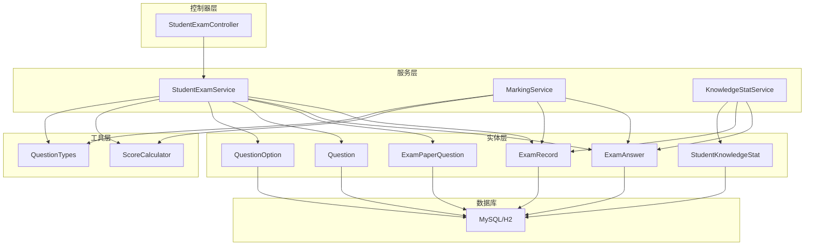
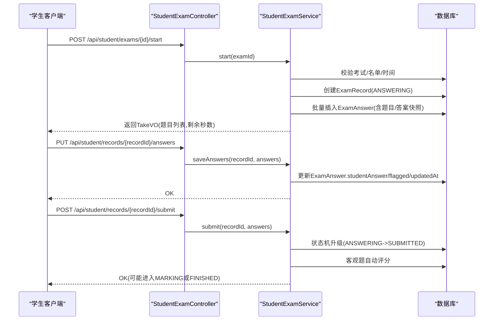
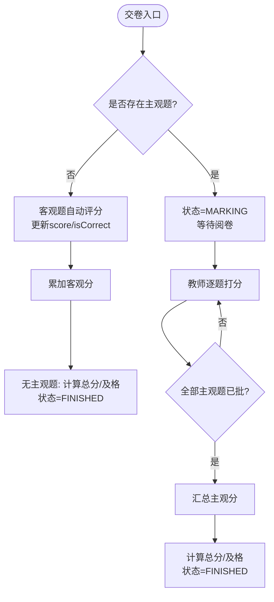
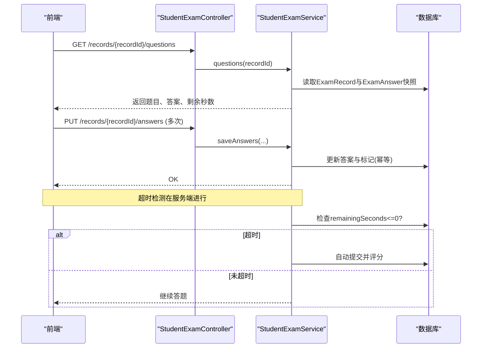
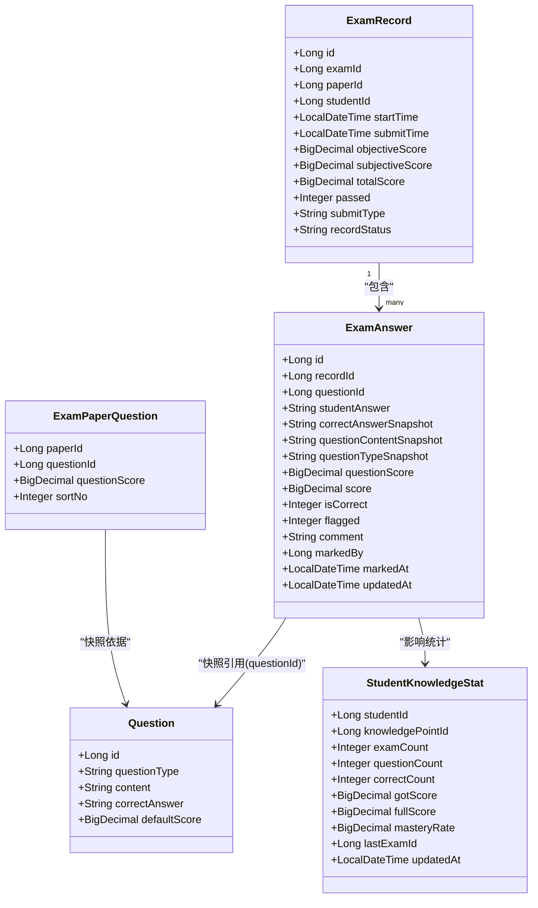
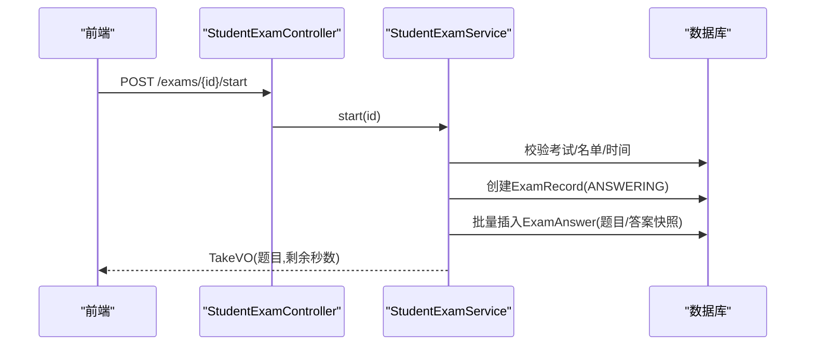
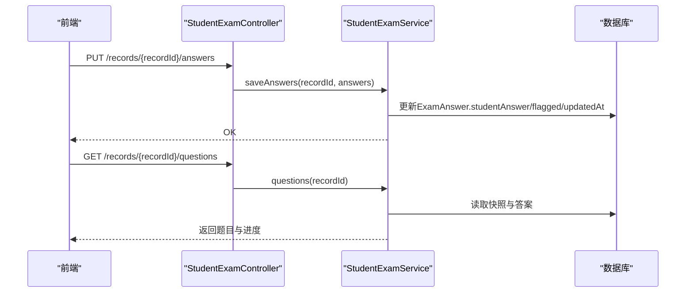
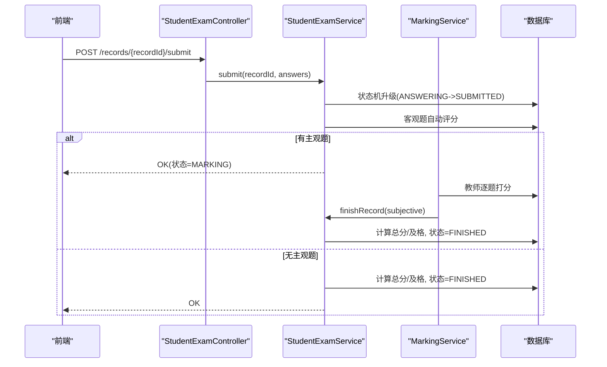

# 答题记录数据模型

<cite>
**本文引用的文件**
- [ExamRecord.java](file://exam-server/src/main/java/com/exam/entity/ExamRecord.java)
- [ExamAnswer.java](file://exam-server/src/main/java/com/exam/entity/ExamAnswer.java)
- [Question.java](file://exam-server/src/main/java/com/exam/entity/Question.java)
- [QuestionOption.java](file://exam-server/src/main/java/com/exam/entity/QuestionOption.java)
- [ExamPaperQuestion.java](file://exam-server/src/main/java/com/exam/entity/ExamPaperQuestion.java)
- [StudentKnowledgeStat.java](file://exam-server/src/main/java/com/exam/entity/StudentKnowledgeStat.java)
- [schema.sql](file://sql/schema.sql)
- [StudentExamService.java](file://exam-server/src/main/java/com/exam/service/StudentExamService.java)
- [MarkingService.java](file://exam-server/src/main/java/com/exam/service/MarkingService.java)
- [KnowledgeStatService.java](file://exam-server/src/main/java/com/exam/service/KnowledgeStatService.java)
- [ScoreCalculator.java](file://exam-server/src/main/java/com/exam/util/ScoreCalculator.java)
- [QuestionTypes.java](file://exam-server/src/main/java/com/exam/util/QuestionTypes.java)
- [StudentExamController.java](file://exam-server/src/main/java/com/exam/controller/StudentExamController.java)
- [AnswerSaveRequest.java](file://exam-server/src/main/java/com/exam/dto/AnswerSaveRequest.java)
</cite>

## 目录
1. [引言](#引言)
2. [项目结构](#项目结构)
3. [核心组件](#核心组件)
4. [架构总览](#架构总览)
5. [详细组件分析](#详细组件分析)
6. [依赖关系分析](#依赖关系分析)
7. [性能与一致性考量](#性能与一致性考量)
8. [故障排查指南](#故障排查指南)
9. [结论](#结论)
10. [附录：关键流程时序图](#附录：关键流程时序图)

## 引言
本文件聚焦“答题记录模块”的数据模型与数据处理流程，围绕考试记录表（exam_record）与答题详情表（exam_answer）的设计展开，解释答案快照、正确答案快照、题目内容快照的持久化策略；说明自动评分与人工阅卷的数据处理链路；给出成绩计算与统计的数据结构；并覆盖答题进度跟踪、超时处理、断线重连等场景下的数据一致性保障方案。

## 项目结构
答题记录相关的数据模型与服务实现主要位于后端 exam-server 模块中：
- 实体层：ExamRecord、ExamAnswer、Question、QuestionOption、ExamPaperQuestion、StudentKnowledgeStat
- 服务层：StudentExamService（学生端主流程）、MarkingService（主观题阅卷）、KnowledgeStatService（知识点掌握度统计）
- 工具层：ScoreCalculator（客观题匹配）、QuestionTypes（题型常量与判断）
- 控制器层：StudentExamController（学生端接口）
- 数据库脚本：schema.sql（建表与索引）

图表来源
- [StudentExamService.java:94-140](file://exam-server/src/main/java/com/exam/service/StudentExamService.java#L94-L140)
- [MarkingService.java:92-131](file://exam-server/src/main/java/com/exam/service/MarkingService.java#L92-L131)
- [KnowledgeStatService.java:34-100](file://exam-server/src/main/java/com/exam/service/KnowledgeStatService.java#L34-L100)
- [schema.sql:135-171](file://sql/schema.sql#L135-L171)

章节来源
- [StudentExamController.java:29-71](file://exam-server/src/main/java/com/exam/controller/StudentExamController.java#L29-L71)
- [schema.sql:52-171](file://sql/schema.sql#L52-L171)

## 核心组件
- 考试记录 ExamRecord：一份答卷/成绩的顶层聚合，包含考试、试卷、学生、开始/提交时间、客观分、主观分、总分、是否及格、提交类型、记录状态等。
- 答题详情 ExamAnswer：每题作答明细，包含学生答案、正确答案快照、题目内容快照、题型快照、本题满分、得分、是否正确、标记、评语、阅卷人、阅卷时间、更新时间等。
- 题目 Question、选项 QuestionOption：题库元数据，用于生成快照与展示选项。
- 试卷题目 ExamPaperQuestion：试卷内题目及分值、排序，用于创建答题快照。
- 知识点掌握 StudentKnowledgeStat：按学生维度汇总各知识点的答题次数、正确次数、得分、满分、掌握率、最近考试ID等。

章节来源
- [ExamRecord.java:11-28](file://exam-server/src/main/java/com/exam/entity/ExamRecord.java#L11-L28)
- [ExamAnswer.java:11-31](file://exam-server/src/main/java/com/exam/entity/ExamAnswer.java#L11-L31)
- [Question.java:11-29](file://exam-server/src/main/java/com/exam/entity/Question.java#L11-L29)
- [QuestionOption.java:8-19](file://exam-server/src/main/java/com/exam/entity/QuestionOption.java#L8-L19)
- [ExamPaperQuestion.java:10-20](file://exam-server/src/main/java/com/exam/entity/ExamPaperQuestion.java#L10-L20)
- [StudentKnowledgeStat.java:11-27](file://exam-server/src/main/java/com/exam/entity/StudentKnowledgeStat.java#L11-L27)

## 架构总览
答题记录模块以“快照+状态机”为核心设计：
- 开始考试时，基于试卷题目创建答题快照，将题目内容与正确答案写入答题详情表，避免后续题库变更影响历史答卷。
- 答题过程中，仅更新学生答案与标记字段，保证高频写操作轻量。
- 交卷时，先锁状态防重复，再对客观题进行自动评分；若存在主观题则进入待阅卷状态，否则直接完成。
- 阅卷完成后，汇总主观分，计算总分与是否及格，并回写知识点掌握度。

图表来源
- [StudentExamController.java:35-59](file://exam-server/src/main/java/com/exam/controller/StudentExamController.java#L35-L59)
- [StudentExamService.java:94-140](file://exam-server/src/main/java/com/exam/service/StudentExamService.java#L94-L140)
- [StudentExamService.java:149-194](file://exam-server/src/main/java/com/exam/service/StudentExamService.java#L149-L194)
- [StudentExamService.java:258-298](file://exam-server/src/main/java/com/exam/service/StudentExamService.java#L258-L298)

## 详细组件分析

### 数据模型与快照策略
- 考试记录 ExamRecord
  - 关键字段：examId、paperId、studentId、startTime、submitTime、objectiveScore、subjectiveScore、totalScore、passed、submitType、recordStatus
  - 作用：承载一次考试的总体信息、分数构成与状态机流转（ANSWERING/SUBMITTED/MARKING/FINISHED）
- 答题详情 ExamAnswer
  - 关键字段：recordId、questionId、studentAnswer、correctAnswerSnapshot、questionContentSnapshot、questionTypeSnapshot、questionScore、score、isCorrect、flagged、comment、markedBy、markedAt、updatedAt
  - 快照设计：在开始考试时从题库拉取题目内容与正确答案，写入答题详情表，确保历史答卷不受题库后续修改影响
  - 评分字段：客观题由系统自动判定并写入 score/isCorrect；主观题由教师打分后写入 score/comment/markedBy/markedAt
- 题目与选项
  - Question：题库中的题目元数据（题型、内容、正确答案、解析、默认分等）
  - QuestionOption：选择题选项集合（含 isCorrect），仅在允许查看解析时暴露给学生
- 试卷题目 ExamPaperQuestion
  - 定义试卷包含的题目、每道题的分值与顺序，是创建答题快照的依据
- 知识点掌握 StudentKnowledgeStat
  - 按学生维度汇总各知识点的答题情况，包括题量、正确数、得分、满分、掌握率、最近考试ID等

章节来源
- [ExamRecord.java:11-28](file://exam-server/src/main/java/com/exam/entity/ExamRecord.java#L11-L28)
- [ExamAnswer.java:11-31](file://exam-server/src/main/java/com/exam/entity/ExamAnswer.java#L11-L31)
- [Question.java:11-29](file://exam-server/src/main/java/com/exam/entity/Question.java#L11-L29)
- [QuestionOption.java:8-19](file://exam-server/src/main/java/com/exam/entity/QuestionOption.java#L8-L19)
- [ExamPaperQuestion.java:10-20](file://exam-server/src/main/java/com/exam/entity/ExamPaperQuestion.java#L10-L20)
- [StudentKnowledgeStat.java:11-27](file://exam-server/src/main/java/com/exam/entity/StudentKnowledgeStat.java#L11-L27)
- [schema.sql:135-171](file://sql/schema.sql#L135-L171)

### 自动评分与人工阅卷流程
- 自动评分
  - 触发时机：交卷时（或超时自动交卷）
  - 范围：非主观题（单选、多选、判断、填空）
  - 规则：使用 ScoreCalculator.match 比较学生答案与正确答案快照；填空题按“|”分隔的多空逐空比对；多选题归一化排序后比对；空答案视为错误
  - 结果：写入 ExamAnswer.score 与 isCorrect，累加 objectiveScore
- 人工阅卷
  - 触发条件：存在主观题（简答/关键词解释）时，交卷后记录状态置为 MARKING
  - 阅卷动作：教师对每道主观题打分并填写评语，系统校验分数范围，写入 score/comment/markedBy/markedAt
  - 完成阅卷：当所有主观题均被批阅后，汇总 subjectiveScore，调用 finishRecord 计算总分与是否及格，并将记录状态置为 FINISHED

图表来源
- [StudentExamService.java:258-298](file://exam-server/src/main/java/com/exam/service/StudentExamService.java#L258-L298)
- [MarkingService.java:92-131](file://exam-server/src/main/java/com/exam/service/MarkingService.java#L92-L131)
- [ScoreCalculator.java:20-44](file://exam-server/src/main/java/com/exam/util/ScoreCalculator.java#L20-L44)
- [QuestionTypes.java:88-91](file://exam-server/src/main/java/com/exam/util/QuestionTypes.java#L88-L91)

章节来源
- [StudentExamService.java:149-194](file://exam-server/src/main/java/com/exam/service/StudentExamService.java#L149-L194)
- [StudentExamService.java:258-298](file://exam-server/src/main/java/com/exam/service/StudentExamService.java#L258-L298)
- [MarkingService.java:92-131](file://exam-server/src/main/java/com/exam/service/MarkingService.java#L92-L131)
- [ScoreCalculator.java:20-44](file://exam-server/src/main/java/com/exam/util/ScoreCalculator.java#L20-L44)
- [QuestionTypes.java:88-91](file://exam-server/src/main/java/com/exam/util/QuestionTypes.java#L88-L91)

### 成绩计算与统计数据结构
- 成绩计算
  - 客观分：自动评分累加
  - 主观分：阅卷完成后汇总
  - 总分：客观分 + 主观分
  - 是否及格：总分与试卷通过分比较
- 知识点掌握统计
  - 触发时机：记录完成（FINISHED）后
  - 计算方式：遍历该生所有已完成答卷的答题详情，结合题目与知识点关联（weight权重），按比例分摊得分与满分，统计题量、正确数、掌握率等
  - 存储：写入 StudentKnowledgeStat，便于后续分析与可视化

章节来源
- [StudentExamService.java:300-309](file://exam-server/src/main/java/com/exam/service/StudentExamService.java#L300-L309)
- [KnowledgeStatService.java:34-100](file://exam-server/src/main/java/com/exam/service/KnowledgeStatService.java#L34-L100)
- [StudentKnowledgeStat.java:11-27](file://exam-server/src/main/java/com/exam/entity/StudentKnowledgeStat.java#L11-L27)

### 答题进度跟踪、超时处理与断线重连
- 答题进度跟踪
  - 通过 ExamRecord.recordStatus 表示当前阶段（ANSWERING/SUBMITTED/MARKING/FINISHED）
  - 前端可查询 questions 接口获取题目列表与学生答案，用于渲染进度与恢复界面
- 超时处理
  - 服务端计算剩余时间：以“开始时间+时长”与“考试截止时间”的较小值为准
  - 当剩余时间<=0时，自动触发交卷逻辑，状态升级为 SUBMITTED，并按上述评分流程处理
- 断线重连
  - 支持多次保存答案：saveAnswers 接口幂等更新 studentAnswer/flagged/updatedAt
  - 支持继续考试：questions 接口可读取已有答案快照与状态，前端据此恢复答题界面
  - 防重复交卷：提交时使用状态机条件更新（ANSWERING->SUBMITTED），并发下仅一次成功

图表来源
- [StudentExamService.java:142-147](file://exam-server/src/main/java/com/exam/service/StudentExamService.java#L142-L147)
- [StudentExamService.java:149-178](file://exam-server/src/main/java/com/exam/service/StudentExamService.java#L149-L178)
- [StudentExamService.java:377-382](file://exam-server/src/main/java/com/exam/service/StudentExamService.java#L377-L382)
- [StudentExamService.java:258-267](file://exam-server/src/main/java/com/exam/service/StudentExamService.java#L258-L267)

章节来源
- [StudentExamService.java:142-178](file://exam-server/src/main/java/com/exam/service/StudentExamService.java#L142-L178)
- [StudentExamService.java:258-298](file://exam-server/src/main/java/com/exam/service/StudentExamService.java#L258-L298)
- [StudentExamService.java:377-382](file://exam-server/src/main/java/com/exam/service/StudentExamService.java#L377-L382)

## 依赖关系分析
- 实体间关系
  - ExamRecord 与 ExamAnswer：一对多（一份答卷包含多题作答）
  - ExamAnswer 与 Question：通过 questionId 关联，但实际使用快照字段避免强依赖
  - ExamPaperQuestion 与 Question：试卷题目映射，用于创建快照
  - ExamAnswer 与 StudentKnowledgeStat：通过题目-知识点关联间接影响统计
- 服务间耦合
  - StudentExamService 依赖 ScoreCalculator、QuestionTypes 进行评分与题型判断
  - MarkingService 依赖 StudentExamService.finishRecord 完成最终结算
  - KnowledgeStatService 依赖 ExamAnswer、QuestionKnowledge、StudentKnowledgeStat 进行统计重建

图表来源
- [ExamRecord.java:11-28](file://exam-server/src/main/java/com/exam/entity/ExamRecord.java#L11-L28)
- [ExamAnswer.java:11-31](file://exam-server/src/main/java/com/exam/entity/ExamAnswer.java#L11-L31)
- [Question.java:11-29](file://exam-server/src/main/java/com/exam/entity/Question.java#L11-L29)
- [ExamPaperQuestion.java:10-20](file://exam-server/src/main/java/com/exam/entity/ExamPaperQuestion.java#L10-L20)
- [StudentKnowledgeStat.java:11-27](file://exam-server/src/main/java/com/exam/entity/StudentKnowledgeStat.java#L11-L27)

章节来源
- [StudentExamService.java:311-330](file://exam-server/src/main/java/com/exam/service/StudentExamService.java#L311-L330)
- [KnowledgeStatService.java:34-100](file://exam-server/src/main/java/com/exam/service/KnowledgeStatService.java#L34-L100)

## 性能与一致性考量
- 性能优化
  - 快照机制减少运行时对题库的频繁读取，降低IO压力
  - 答案保存采用单条更新，避免大事务
  - 统计重建在完成后一次性执行，避免实时计算开销
- 一致性保障
  - 状态机：使用条件更新防止重复交卷（ANSWERING->SUBMITTED）
  - 事务边界：创建快照、提交评分、完成结算均在事务中执行
  - 幂等性：答案保存接口支持多次调用，仅覆盖最新答案与标记
  - 超时保护：服务端统一计算剩余时间，避免客户端时钟不一致导致的问题
- 可扩展性
  - 题型扩展：通过 QuestionTypes 集中管理题型与默认分，便于新增题型
  - 评分规则：ScoreCalculator 提供统一匹配逻辑，易于扩展复杂规则

[本节为通用指导，不直接分析具体文件]

## 故障排查指南
- 常见问题定位
  - 无法开始考试：检查考试状态、学生是否在名单、时间窗口
  - 无法保存答案：确认记录状态仍为 ANSWERING，且题目存在于快照中
  - 重复交卷：检查记录状态是否为 ANSWERING，服务端会拒绝重复提交
  - 主观题未出分：确认所有主观题均已批阅，才会汇总主观分并结束
- 日志与审计
  - 阅卷完成会记录操作日志，便于追踪
  - 可通过记录状态与更新时间快速定位问题环节

章节来源
- [StudentExamService.java:94-140](file://exam-server/src/main/java/com/exam/service/StudentExamService.java#L94-L140)
- [StudentExamService.java:149-194](file://exam-server/src/main/java/com/exam/service/StudentExamService.java#L149-L194)
- [MarkingService.java:92-131](file://exam-server/src/main/java/com/exam/service/MarkingService.java#L92-L131)

## 结论
本模块通过“快照+状态机”的设计，实现了答题过程的可追溯性与抗变更能力；自动评分与人工阅卷分离，既保证了效率又兼顾了灵活性；成绩与知识点统计在完成后统一计算，提升了性能与准确性；同时通过状态机与事务边界保障了并发与一致性。整体方案适用于在线考试场景，具备良好的扩展性与可维护性。

## 附录：关键流程时序图

### 开始考试与创建快照

图表来源
- [StudentExamController.java:35-39](file://exam-server/src/main/java/com/exam/controller/StudentExamController.java#L35-L39)
- [StudentExamService.java:94-140](file://exam-server/src/main/java/com/exam/service/StudentExamService.java#L94-L140)
- [StudentExamService.java:311-330](file://exam-server/src/main/java/com/exam/service/StudentExamService.java#L311-L330)

### 保存答案与进度恢复

图表来源
- [StudentExamController.java:47-52](file://exam-server/src/main/java/com/exam/controller/StudentExamController.java#L47-L52)
- [StudentExamService.java:149-178](file://exam-server/src/main/java/com/exam/service/StudentExamService.java#L149-L178)
- [StudentExamService.java:142-147](file://exam-server/src/main/java/com/exam/service/StudentExamService.java#L142-L147)

### 交卷与评分

图表来源
- [StudentExamController.java:54-59](file://exam-server/src/main/java/com/exam/controller/StudentExamController.java#L54-L59)
- [StudentExamService.java:180-194](file://exam-server/src/main/java/com/exam/service/StudentExamService.java#L180-L194)
- [StudentExamService.java:258-298](file://exam-server/src/main/java/com/exam/service/StudentExamService.java#L258-L298)
- [MarkingService.java:92-131](file://exam-server/src/main/java/com/exam/service/MarkingService.java#L92-L131)