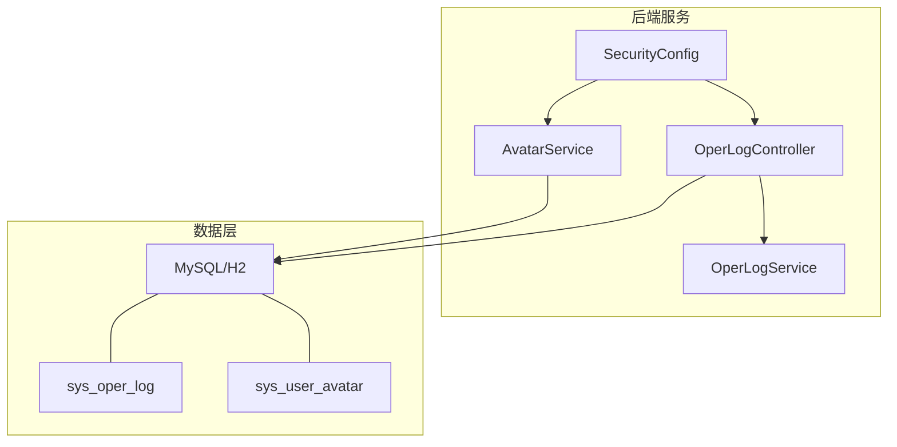
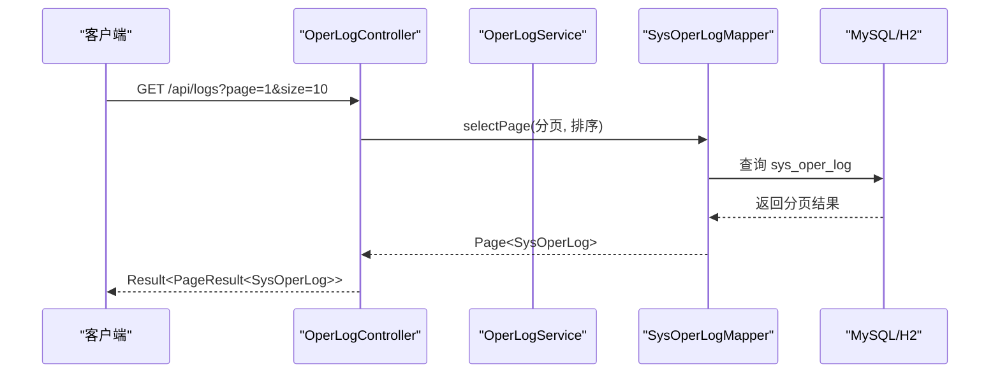
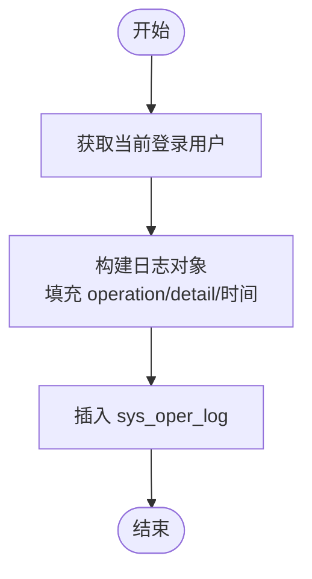
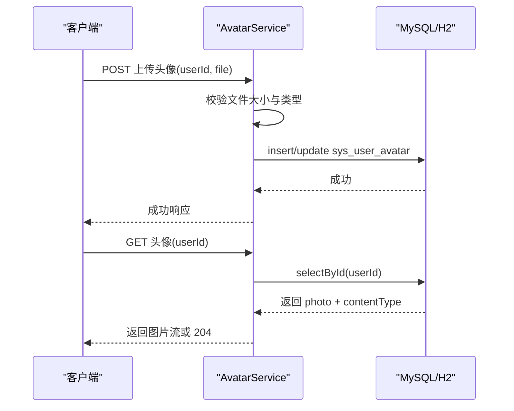
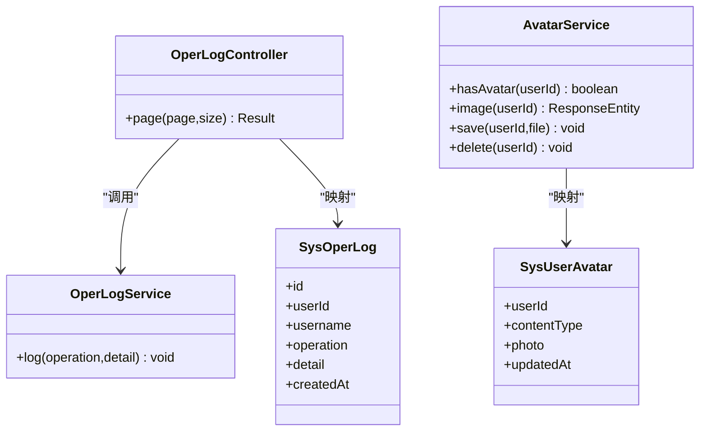

# 系统支撑数据模型

<cite>
**本文引用的文件**
- [SysOperLog.java](file://exam-server/src/main/java/com/exam/entity/SysOperLog.java)
- [SysUserAvatar.java](file://exam-server/src/main/java/com/exam/entity/SysUserAvatar.java)
- [OperLogService.java](file://exam-server/src/main/java/com/exam/service/OperLogService.java)
- [AvatarService.java](file://exam-server/src/main/java/com/exam/service/AvatarService.java)
- [OperLogController.java](file://exam-server/src/main/java/com/exam/controller/OperLogController.java)
- [SecurityConfig.java](file://exam-server/src/main/java/com/exam/config/SecurityConfig.java)
- [application.yml](file://exam-server/src/main/resources/application.yml)
- [schema.sql](file://sql/schema.sql)
- [schema-mysql.sql](file://sql/schema-mysql.sql)
</cite>

## 目录
1. [引言](#引言)
2. [项目结构](#项目结构)
3. [核心组件](#核心组件)
4. [架构总览](#架构总览)
5. [详细组件分析](#详细组件分析)
6. [依赖关系分析](#依赖关系分析)
7. [性能考虑](#性能考虑)
8. [故障排查指南](#故障排查指南)
9. [结论](#结论)
10. [附录](#附录)

## 引言
本文件聚焦系统支撑模块的数据模型与实现，围绕操作日志与用户头像两大辅助能力展开，说明其数据结构、存储策略、访问控制、查询优化以及归档清理方案。同时补充系统监控、审计追踪、文件管理等支撑功能在数据层面的设计要点与优化建议，帮助读者快速理解并扩展相关能力。

## 项目结构
支撑模块涉及的核心代码分布在实体、服务、控制器与安全配置中：
- 实体层：定义操作日志与头像的数据模型
- 服务层：封装日志写入、头像上传/读取/删除等业务流程
- 控制器层：暴露日志分页查询接口
- 安全配置：统一鉴权与跨域策略
- 数据库脚本：定义表结构与索引

图表来源
- [OperLogController.java:19-26](file://exam-server/src/main/java/com/exam/controller/OperLogController.java#L19-L26)
- [OperLogService.java:18-29](file://exam-server/src/main/java/com/exam/service/OperLogService.java#L18-L29)
- [AvatarService.java:29-80](file://exam-server/src/main/java/com/exam/service/AvatarService.java#L29-L80)
- [SecurityConfig.java:37-65](file://exam-server/src/main/java/com/exam/config/SecurityConfig.java#L37-L65)
- [schema.sql:189-203](file://sql/schema.sql#L189-L203)

章节来源
- [OperLogController.java:1-28](file://exam-server/src/main/java/com/exam/controller/OperLogController.java#L1-L28)
- [OperLogService.java:1-31](file://exam-server/src/main/java/com/exam/service/OperLogService.java#L1-L31)
- [AvatarService.java:1-101](file://exam-server/src/main/java/com/exam/service/AvatarService.java#L1-L101)
- [SecurityConfig.java:1-90](file://exam-server/src/main/java/com/exam/config/SecurityConfig.java#L1-L90)
- [application.yml:1-42](file://exam-server/src/main/resources/application.yml#L1-L42)
- [schema.sql:1-204](file://sql/schema.sql#L1-L204)

## 核心组件
- 操作日志（SysOperLog）：记录关键业务操作，包含操作人、操作类型、详情与时间戳，用于审计与问题回溯。
- 用户头像（SysUserAvatar）：以二进制形式存储在数据库，支持上传、读取、删除，服务于前端头像展示与更新。
- 服务层：OperLogService 负责写入日志；AvatarService 负责头像的校验、保存、读取与删除。
- 控制器层：OperLogController 提供管理员查看日志的分页接口。
- 安全配置：通过 JWT 进行无状态鉴权，按角色控制接口访问权限。

章节来源
- [SysOperLog.java:10-21](file://exam-server/src/main/java/com/exam/entity/SysOperLog.java#L10-L21)
- [SysUserAvatar.java:10-19](file://exam-server/src/main/java/com/exam/entity/SysUserAvatar.java#L10-L19)
- [OperLogService.java:12-30](file://exam-server/src/main/java/com/exam/service/OperLogService.java#L12-L30)
- [AvatarService.java:21-100](file://exam-server/src/main/java/com/exam/service/AvatarService.java#L21-L100)
- [OperLogController.java:13-27](file://exam-server/src/main/java/com/exam/controller/OperLogController.java#L13-L27)
- [SecurityConfig.java:25-65](file://exam-server/src/main/java/com/exam/config/SecurityConfig.java#L25-L65)

## 架构总览
下图展示了从请求到数据落库的完整链路，包括日志写入与头像存取流程。

图表来源
- [OperLogController.java:19-26](file://exam-server/src/main/java/com/exam/controller/OperLogController.java#L19-L26)
- [OperLogService.java:18-29](file://exam-server/src/main/java/com/exam/service/OperLogService.java#L18-L29)
- [schema.sql:189-196](file://sql/schema.sql#L189-L196)

## 详细组件分析

### 操作日志数据模型与实现
- 数据模型
  - 主键：自增 ID
  - 用户信息：userId、username
  - 操作信息：operation（操作类型）、detail（详情文本）
  - 时间戳：createdAt（默认当前时间）
- 存储策略
  - 使用 MyBatis-Plus 的 BaseMapper 进行插入与分页查询
  - 日志表未设置额外索引，适合按时间倒序分页浏览
- 写入流程
  - 从安全上下文获取当前登录用户
  - 组装日志对象并写入数据库
- 查询优化
  - 分页查询基于 ID 降序，避免深翻页对大表的压力
  - 建议在日志量较大时增加 created_at 索引以优化范围查询与排序

图表来源
- [OperLogService.java:18-29](file://exam-server/src/main/java/com/exam/service/OperLogService.java#L18-L29)
- [SysOperLog.java:10-21](file://exam-server/src/main/java/com/exam/entity/SysOperLog.java#L10-L21)
- [schema.sql:189-196](file://sql/schema.sql#L189-L196)

章节来源
- [SysOperLog.java:10-21](file://exam-server/src/main/java/com/exam/entity/SysOperLog.java#L10-L21)
- [OperLogService.java:12-30](file://exam-server/src/main/java/com/exam/service/OperLogService.java#L12-L30)
- [OperLogController.java:19-26](file://exam-server/src/main/java/com/exam/controller/OperLogController.java#L19-L26)
- [schema.sql:189-196](file://sql/schema.sql#L189-L196)

### 用户头像数据模型与实现
- 数据模型
  - 主键：userId（一对一关联用户）
  - 内容类型：contentType（image/jpeg/png/gif/webp）
  - 图片数据：photo（MEDIUMBLOB 二进制）
  - 更新时间：updatedAt
- 存储策略
  - 直接存入数据库 MEDIUMBLOB，限制单文件大小为 2MB
  - 读取时设置正确的 Content-Type 并禁用缓存
- 访问控制
  - 通过 Spring Security 的 JWT 过滤器保护接口，仅认证用户可访问
  - 头像读取接口受全局 /api/** 鉴权规则保护
- 上传流程
  - 校验文件非空且大小不超过 2MB
  - 校验并规范化 MIME 类型
  - 存在则更新，不存在则插入

图表来源
- [AvatarService.java:29-80](file://exam-server/src/main/java/com/exam/service/AvatarService.java#L29-L80)
- [schema.sql:198-203](file://sql/schema.sql#L198-L203)
- [SecurityConfig.java:37-65](file://exam-server/src/main/java/com/exam/config/SecurityConfig.java#L37-L65)

章节来源
- [SysUserAvatar.java:10-19](file://exam-server/src/main/java/com/exam/entity/SysUserAvatar.java#L10-L19)
- [AvatarService.java:21-100](file://exam-server/src/main/java/com/exam/service/AvatarService.java#L21-L100)
- [application.yml:15-18](file://exam-server/src/main/resources/application.yml#L15-L18)
- [SecurityConfig.java:37-65](file://exam-server/src/main/java/com/exam/config/SecurityConfig.java#L37-L65)
- [schema.sql:198-203](file://sql/schema.sql#L198-L203)

### 系统监控与审计追踪
- 审计追踪
  - 通过 SysOperLog 记录关键操作，便于事后追溯与合规审计
  - 建议后续增强：增加 IP、UA、耗时、结果码等字段，提升可观测性
- 系统监控
  - 当前未实现独立监控指标表；可在日志中追加性能标记或通过外部监控系统采集
  - 建议将慢查询、异常堆栈等纳入日志或集中式日志平台

章节来源
- [OperLogService.java:18-29](file://exam-server/src/main/java/com/exam/service/OperLogService.java#L18-L29)
- [OperLogController.java:19-26](file://exam-server/src/main/java/com/exam/controller/OperLogController.java#L19-L26)

### 文件管理支撑
- 当前实现
  - 头像文件以二进制存储在数据库，适用于小体积、强一致性的场景
- 扩展建议
  - 对于大文件或高并发读场景，建议迁移至对象存储（如 MinIO/OSS），数据库仅保存元数据（路径、哈希、版本）
  - 结合 CDN 加速静态资源访问，降低数据库负载

章节来源
- [AvatarService.java:29-80](file://exam-server/src/main/java/com/exam/service/AvatarService.java#L29-L80)
- [application.yml:15-18](file://exam-server/src/main/resources/application.yml#L15-L18)

## 依赖关系分析
- 控制器依赖服务与持久化层
- 服务依赖安全上下文获取当前用户
- 安全配置统一拦截 /api/** 并实施角色授权
- 数据库脚本定义表结构与默认值

图表来源
- [OperLogController.java:13-27](file://exam-server/src/main/java/com/exam/controller/OperLogController.java#L13-L27)
- [OperLogService.java:12-30](file://exam-server/src/main/java/com/exam/service/OperLogService.java#L12-L30)
- [AvatarService.java:21-100](file://exam-server/src/main/java/com/exam/service/AvatarService.java#L21-L100)
- [SysOperLog.java:10-21](file://exam-server/src/main/java/com/exam/entity/SysOperLog.java#L10-L21)
- [SysUserAvatar.java:10-19](file://exam-server/src/main/java/com/exam/entity/SysUserAvatar.java#L10-L19)

章节来源
- [OperLogController.java:1-28](file://exam-server/src/main/java/com/exam/controller/OperLogController.java#L1-L28)
- [OperLogService.java:1-31](file://exam-server/src/main/java/com/exam/service/OperLogService.java#L1-L31)
- [AvatarService.java:1-101](file://exam-server/src/main/java/com/exam/service/AvatarService.java#L1-L101)
- [SysOperLog.java:1-22](file://exam-server/src/main/java/com/exam/entity/SysOperLog.java#L1-L22)
- [SysUserAvatar.java:1-20](file://exam-server/src/main/java/com/exam/entity/SysUserAvatar.java#L1-L20)

## 性能考虑
- 操作日志
  - 当前按 ID 降序分页，适合“最新优先”的管理员视图
  - 当日志量增长后，建议为 created_at 建立索引以优化范围查询与排序
  - 可引入异步写入（消息队列）降低主流程延迟
- 用户头像
  - 单文件上限 2MB，应用层与服务端上传限制共同生效
  - 读取时设置 Content-Type 并禁用缓存，避免浏览器缓存导致旧图显示
  - 若头像数量与访问量增大，建议迁移至对象存储+CDN，数据库仅存元数据
- 通用优化
  - 合理分页大小，避免过大 page size 造成内存与网络开销
  - 对高频查询接口添加必要的数据库索引
  - 对敏感接口启用最小权限原则与访问频率限制

章节来源
- [OperLogController.java:19-26](file://exam-server/src/main/java/com/exam/controller/OperLogController.java#L19-L26)
- [AvatarService.java:34-44](file://exam-server/src/main/java/com/exam/service/AvatarService.java#L34-L44)
- [application.yml:15-18](file://exam-server/src/main/resources/application.yml#L15-L18)

## 故障排查指南
- 上传失败
  - 检查是否选择文件、文件大小是否超过 2MB、文件类型是否在允许范围内
- 头像不显示
  - 确认是否存在该用户的头像记录；如无则返回 204；如有但为空也返回 204
  - 检查 Content-Type 是否正确设置
- 权限问题
  - 未登录或 token 过期会返回 401；无角色权限会返回 403
- 日志查询缓慢
  - 检查分页参数与排序字段；必要时为 created_at 加索引

章节来源
- [AvatarService.java:46-80](file://exam-server/src/main/java/com/exam/service/AvatarService.java#L46-L80)
- [SecurityConfig.java:52-65](file://exam-server/src/main/java/com/exam/config/SecurityConfig.java#L52-L65)

## 结论
本支撑模块以简洁的数据模型实现了操作日志与用户头像的核心能力：
- 操作日志满足基础审计需求，具备可扩展性，建议后续增强字段与索引
- 用户头像采用数据库内嵌二进制存储，适合小规模场景，建议在高并发与大文件场景迁移至对象存储
- 通过统一的 JWT 鉴权保障数据安全，配合合理的分页与缓存策略提升性能
- 建议引入归档与清理策略，确保长期运行的稳定性与成本可控

## 附录

### 数据表结构概览
- sys_oper_log
  - id：主键，自增
  - user_id：操作人ID
  - username：操作人用户名
  - operation：操作类型
  - detail：操作详情
  - created_at：创建时间
- sys_user_avatar
  - user_id：主键，一对一关联用户
  - content_type：MIME 类型
  - photo：二进制图片数据
  - updated_at：更新时间

章节来源
- [schema.sql:189-203](file://sql/schema.sql#L189-L203)
- [schema-mysql.sql:192-206](file://sql/schema-mysql.sql#L192-L206)

### 接口与权限
- 日志分页查询
  - 路径：GET /api/logs
  - 参数：page、size
  - 权限：需登录（教师或管理员）
- 头像上传/读取/删除
  - 由 AvatarService 提供服务方法，具体控制器可根据需要暴露
  - 权限：需登录（遵循全局 /api/** 鉴权规则）

章节来源
- [OperLogController.java:19-26](file://exam-server/src/main/java/com/exam/controller/OperLogController.java#L19-L26)
- [SecurityConfig.java:37-65](file://exam-server/src/main/java/com/exam/config/SecurityConfig.java#L37-L65)

### 归档与清理策略建议
- 操作日志
  - 按月或按季度归档历史日志至冷存储（如归档库或对象存储）
  - 定期清理超过保留期的日志，释放空间
- 用户头像
  - 若迁移至对象存储，可结合生命周期策略自动删除过期或无效文件
  - 数据库侧保留元数据以便溯源

[本节为通用建议，不直接引用具体文件]