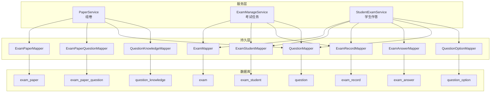
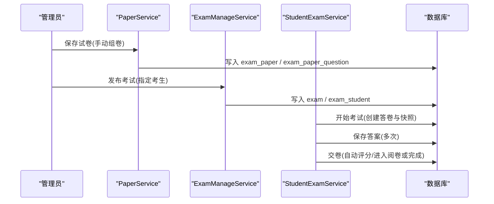
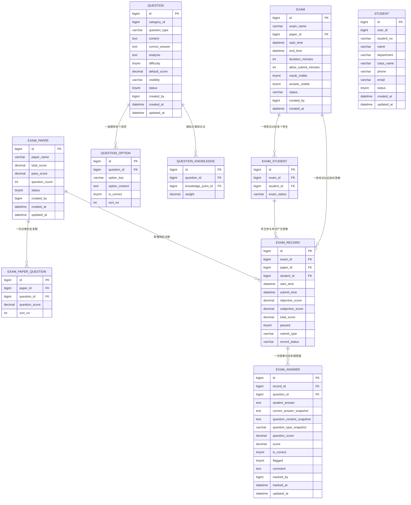
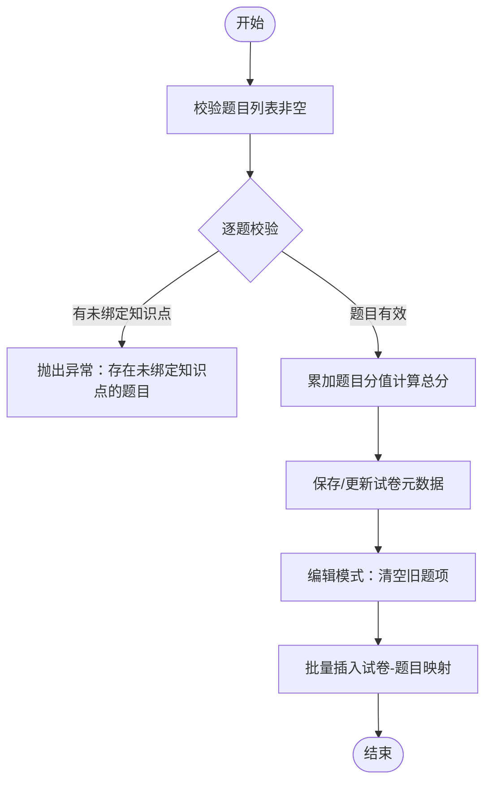
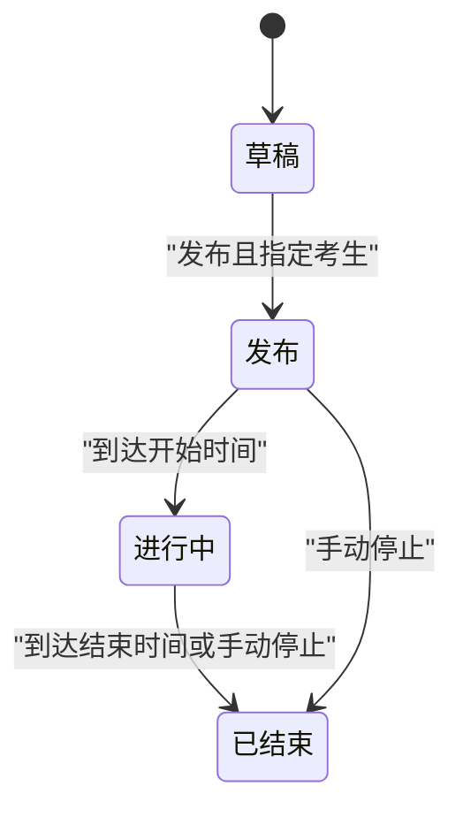
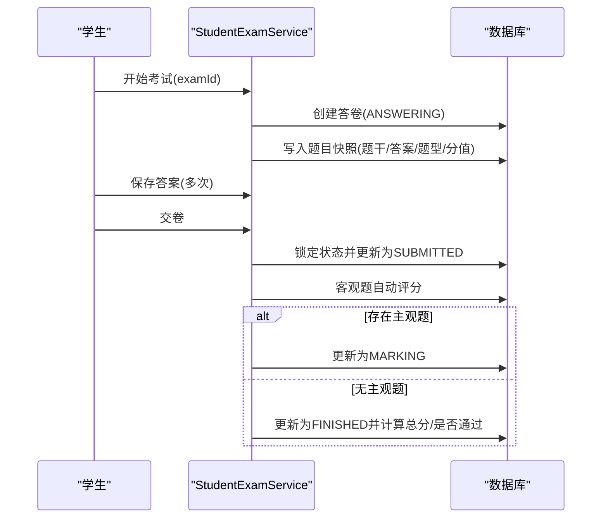
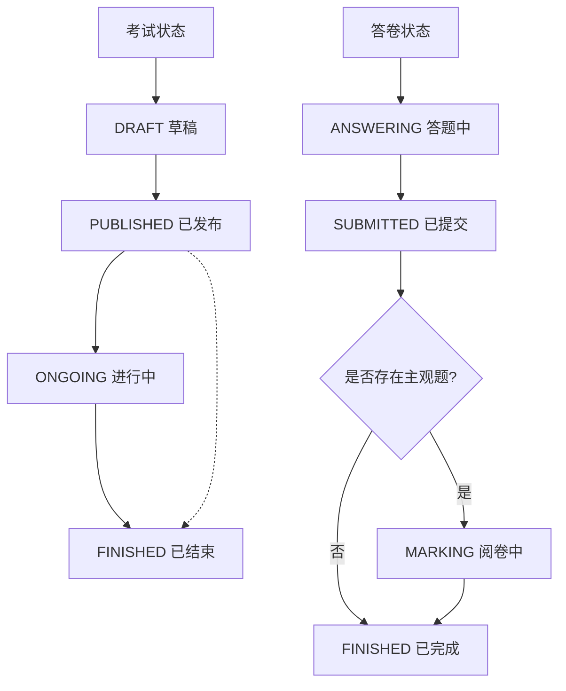
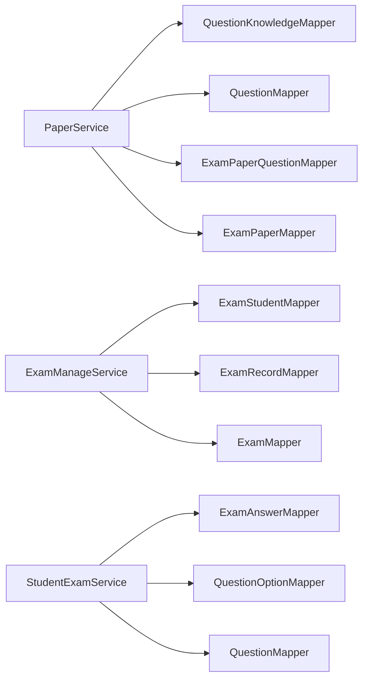

# 考试管理数据模型

<cite>
**本文引用的文件**
- [Exam.java](file://exam-server/src/main/java/com/exam/entity/Exam.java)
- [ExamPaper.java](file://exam-server/src/main/java/com/exam/entity/ExamPaper.java)
- [ExamPaperQuestion.java](file://exam-server/src/main/java/com/exam/entity/ExamPaperQuestion.java)
- [Student.java](file://exam-server/src/main/java/com/exam/entity/Student.java)
- [Question.java](file://exam-server/src/main/java/com/exam/entity/Question.java)
- [QuestionOption.java](file://exam-server/src/main/java/com/exam/entity/QuestionOption.java)
- [QuestionKnowledge.java](file://exam-server/src/main/java/com/exam/entity/QuestionKnowledge.java)
- [ExamStudent.java](file://exam-server/src/main/java/com/exam/entity/ExamStudent.java)
- [ExamRecord.java](file://exam-server/src/main/java/com/exam/entity/ExamRecord.java)
- [ExamAnswer.java](file://exam-server/src/main/java/com/exam/entity/ExamAnswer.java)
- [schema.sql](file://sql/schema.sql)
- [PaperService.java](file://exam-server/src/main/java/com/exam/service/PaperService.java)
- [ExamManageService.java](file://exam-server/src/main/java/com/exam/service/ExamManageService.java)
- [StudentExamService.java](file://exam-server/src/main/java/com/exam/service/StudentExamService.java)
</cite>

## 目录
1. [简介](#简介)
2. [项目结构](#项目结构)
3. [核心组件](#核心组件)
4. [架构总览](#架构总览)
5. [详细组件分析](#详细组件分析)
6. [依赖关系分析](#依赖关系分析)
7. [性能考虑](#性能考虑)
8. [故障排查指南](#故障排查指南)
9. [结论](#结论)
10. [附录](#附录)

## 简介
本文件聚焦考试管理模块的数据模型与关键流程，围绕“考试、试卷、考生”三大核心实体展开，说明：
- 试卷与题目的关联关系（手动组卷）
- 考试时间控制、考生分配、考试状态管理的数据库设计
- 答卷快照、自动评分与阅卷流转
- 考试生命周期状态机（草稿、发布、进行中、已结束；答卷状态：答题中、已提交、阅卷中、已完成）

## 项目结构
后端采用分层架构：Controller → Service → Mapper → 数据库。考试相关核心表定义在 SQL 脚本中，实体类位于 entity 包，业务逻辑集中在 service 包。

图表来源
- [PaperService.java:30-161](file://exam-server/src/main/java/com/exam/service/PaperService.java#L30-L161)
- [ExamManageService.java:36-277](file://exam-server/src/main/java/com/exam/service/ExamManageService.java#L36-L277)
- [StudentExamService.java:38-458](file://exam-server/src/main/java/com/exam/service/StudentExamService.java#L38-L458)
- [schema.sql:89-171](file://sql/schema.sql#L89-L171)

章节来源
- [schema.sql:1-204](file://sql/schema.sql#L1-L204)

## 核心组件
- 试卷与题目
  - 试卷：存储总分、及格分、题数、状态等
  - 试卷-题目：记录每道题的分值与顺序
  - 题目：题型、内容、正确答案、难度、默认分、可见性、逻辑删除标记
  - 题目选项：选择题选项及是否正确答案标记
  - 题目-知识点：多对多，用于知识维度统计与权重分摊
- 考试与考生
  - 考试：绑定试卷、起止时间、时长、允许提前交卷分钟数、结果/答案可见性、状态
  - 考试-考生：本场考试允许参加的学生及其参考状态
  - 答卷：一次考试的答题记录，含客观/主观分数、是否通过、提交方式、答卷状态
  - 答题明细：每题的快照、学生答案、判分、是否正确、标记、批阅信息
- 服务职责
  - PaperService：手动组卷、校验题目必须绑定知识点、计算总分与及格线、维护排序
  - ExamManageService：创建/发布/停止考试、运行时状态计算、考生分配替换
  - StudentExamService：开始考试（冻结快照）、保存答案、交卷（自动评分/进入阅卷）、剩余时间计算

章节来源
- [ExamPaper.java:11-25](file://exam-server/src/main/java/com/exam/entity/ExamPaper.java#L11-L25)
- [ExamPaperQuestion.java:10-20](file://exam-server/src/main/java/com/exam/entity/ExamPaperQuestion.java#L10-L20)
- [Question.java:11-29](file://exam-server/src/main/java/com/exam/entity/Question.java#L11-L29)
- [QuestionOption.java:8-19](file://exam-server/src/main/java/com/exam/entity/QuestionOption.java#L8-L19)
- [QuestionKnowledge.java:10-19](file://exam-server/src/main/java/com/exam/entity/QuestionKnowledge.java#L10-L19)
- [Exam.java:10-27](file://exam-server/src/main/java/com/exam/entity/Exam.java#L10-L27)
- [ExamStudent.java:8-17](file://exam-server/src/main/java/com/exam/entity/ExamStudent.java#L8-L17)
- [ExamRecord.java:11-28](file://exam-server/src/main/java/com/exam/entity/ExamRecord.java#L11-L28)
- [ExamAnswer.java:11-31](file://exam-server/src/main/java/com/exam/entity/ExamAnswer.java#L11-L31)
- [PaperService.java:79-128](file://exam-server/src/main/java/com/exam/service/PaperService.java#L79-L128)
- [ExamManageService.java:77-147](file://exam-server/src/main/java/com/exam/service/ExamManageService.java#L77-L147)
- [StudentExamService.java:94-194](file://exam-server/src/main/java/com/exam/service/StudentExamService.java#L94-L194)

## 架构总览
考试管理数据流从“组卷→发布考试→学生作答→评分→归档”形成闭环。数据以“快照+状态机”保障一致性：
- 组卷阶段：将题目加入试卷并固定分值与顺序
- 考试阶段：开始考试时生成答卷与题目快照，按时间与权限控制答题
- 交卷阶段：自动判客观题，若存在主观题则进入阅卷；无主观题直接完成
- 归档阶段：写总分、是否通过，更新学生掌握度统计

图表来源
- [PaperService.java:79-128](file://exam-server/src/main/java/com/exam/service/PaperService.java#L79-L128)
- [ExamManageService.java:115-147](file://exam-server/src/main/java/com/exam/service/ExamManageService.java#L115-L147)
- [StudentExamService.java:94-194](file://exam-server/src/main/java/com/exam/service/StudentExamService.java#L94-L194)
- [schema.sql:89-171](file://sql/schema.sql#L89-L171)

## 详细组件分析

### 数据模型概览（ER图）

图表来源
- [schema.sql:52-171](file://sql/schema.sql#L52-L171)

章节来源
- [schema.sql:52-171](file://sql/schema.sql#L52-L171)

### 试卷与题目的关联关系（手动组卷）
- 设计要点
  - 试卷表记录总分、及格分、题数与状态
  - 试卷-题目表记录每道题的分值与顺序，保证同一试卷内题目唯一
  - 题目需绑定至少一个知识点方可加入试卷（业务校验）
- 算法与数据结构
  - 输入：试卷ID（新增/编辑）、题目列表（题号、分值、排序）
  - 处理：遍历题目校验知识点绑定与有效性；计算总分；插入/更新试卷-题目映射
  - 输出：试卷ID（新增）或成功标志（编辑）
- 复杂度
  - 时间：O(n) 遍历题目列表进行校验与插入
  - 空间：O(n) 构建待插入集合

图表来源
- [PaperService.java:79-128](file://exam-server/src/main/java/com/exam/service/PaperService.java#L79-L128)
- [schema.sql:89-109](file://sql/schema.sql#L89-L109)

章节来源
- [PaperService.java:79-128](file://exam-server/src/main/java/com/exam/service/PaperService.java#L79-L128)
- [schema.sql:89-109](file://sql/schema.sql#L89-L109)

### 随机抽题机制（扩展建议）
当前仓库实现为“手动组卷”，未提供随机抽题接口。若需支持随机抽题，可基于以下数据结构与算法：
- 数据结构
  - 题库筛选条件：题型、难度、知识点、可见性、状态
  - 抽取策略：按知识点权重、难度分布、分值上限约束
- 算法步骤
  - 根据条件聚合候选题目集
  - 使用加权随机或分层抽样选取题目
  - 校验总分不超过试卷总分、题量满足要求
  - 写入试卷-题目映射（同手动组卷）
- 复杂度
  - 时间：O(k log k) 或 O(k) 取决于采样实现（k为候选集大小）
  - 空间：O(m) 最终入选题目集合

[本节为概念性扩展说明，不直接分析具体代码文件]

### 考试时间控制与考生分配
- 时间控制
  - 考试表记录起止时间与时长；允许设置“开考后N分钟内不可交卷”
  - 剩余时间 = min(开始时间 + 时长, 截止时间) - 当前时间
  - 时间到自动交卷，防止超时答题
- 考生分配
  - 考试-考生表维护允许参加的学生及参考状态
  - 保存考试时替换该场考试的考生名单（幂等插入）
- 状态管理
  - 考试状态：草稿、发布、进行中、已结束（运行时由当前时间推导）
  - 考生状态：未开始、答题中、已提交

图表来源
- [ExamManageService.java:175-190](file://exam-server/src/main/java/com/exam/service/ExamManageService.java#L175-L190)
- [schema.sql:111-133](file://sql/schema.sql#L111-L133)

章节来源
- [ExamManageService.java:77-147](file://exam-server/src/main/java/com/exam/service/ExamManageService.java#L77-L147)
- [ExamManageService.java:175-190](file://exam-server/src/main/java/com/exam/service/ExamManageService.java#L175-L190)
- [schema.sql:111-133](file://sql/schema.sql#L111-L133)

### 考试与学生的多对多关系实现
- 关系建模
  - 考试-考生表作为关联表，唯一键 (exam_id, student_id) 防止重复
  - 考生表独立维护学生档案，通过 user_id 关联登录账号
- 查询与统计
  - 通过 exam_id 获取本场考生列表
  - 通过 student_id 获取学生参与的考试列表
  - 统计提交人数、通过率等指标

章节来源
- [schema.sql:14-28](file://sql/schema.sql#L14-L28)
- [schema.sql:127-133](file://sql/schema.sql#L127-L133)
- [ExamManageService.java:136-147](file://exam-server/src/main/java/com/exam/service/ExamManageService.java#L136-L147)

### 答卷快照与自动评分
- 快照机制
  - 开始考试时，按试卷顺序读取题目并写入答题明细表，包含题干、正确答案、题型、分值快照
  - 后续修改题库不影响已考记录，确保公平性与可追溯性
- 自动评分
  - 交卷时遍历答题明细，客观题按答案匹配规则判分
  - 若存在主观题，答卷进入“阅卷中”；否则直接进入“已完成”
- 成绩与通过判定
  - 总分 = 客观分 + 主观分
  - 是否通过依据试卷及格分比较

图表来源
- [StudentExamService.java:94-194](file://exam-server/src/main/java/com/exam/service/StudentExamService.java#L94-L194)
- [StudentExamService.java:258-309](file://exam-server/src/main/java/com/exam/service/StudentExamService.java#L258-L309)
- [schema.sql:135-171](file://sql/schema.sql#L135-L171)

章节来源
- [StudentExamService.java:94-194](file://exam-server/src/main/java/com/exam/service/StudentExamService.java#L94-L194)
- [StudentExamService.java:258-309](file://exam-server/src/main/java/com/exam/service/StudentExamService.java#L258-L309)
- [schema.sql:135-171](file://sql/schema.sql#L135-L171)

### 考试生命周期管理（状态流转）
- 考试状态
  - DRAFT：草稿，可编辑
  - PUBLISHED：已发布，未到开始时间
  - ONGOING：进行中
  - FINISHED：已结束（到达结束时间或手动停止）
- 答卷状态
  - ANSWERING：答题中
  - SUBMITTED：已提交（等待阅卷或已完成）
  - MARKING：阅卷中
  - FINISHED：已完成（已出分）

图表来源
- [ExamManageService.java:175-190](file://exam-server/src/main/java/com/exam/service/ExamManageService.java#L175-L190)
- [StudentExamService.java:258-309](file://exam-server/src/main/java/com/exam/service/StudentExamService.java#L258-L309)

章节来源
- [ExamManageService.java:175-190](file://exam-server/src/main/java/com/exam/service/ExamManageService.java#L175-L190)
- [StudentExamService.java:258-309](file://exam-server/src/main/java/com/exam/service/StudentExamService.java#L258-L309)

## 依赖关系分析
- 低耦合高内聚
  - PaperService 仅关注试卷与题目映射，依赖 QuestionKnowledge 做前置校验
  - ExamManageService 负责考试任务与考生分配，依赖 ExamStudent 与 ExamRecord 统计
  - StudentExamService 专注作答流程，依赖 ExamAnswer 快照与 ScoreCalculator 判分
- 外部依赖
  - MyBatis-Plus 分页与条件构造器
  - Spring 事务注解保证数据一致性
  - 安全工具类用于身份与权限校验

图表来源
- [PaperService.java:30-161](file://exam-server/src/main/java/com/exam/service/PaperService.java#L30-L161)
- [ExamManageService.java:36-277](file://exam-server/src/main/java/com/exam/service/ExamManageService.java#L36-L277)
- [StudentExamService.java:38-458](file://exam-server/src/main/java/com/exam/service/StudentExamService.java#L38-L458)

章节来源
- [PaperService.java:30-161](file://exam-server/src/main/java/com/exam/service/PaperService.java#L30-L161)
- [ExamManageService.java:36-277](file://exam-server/src/main/java/com/exam/service/ExamManageService.java#L36-L277)
- [StudentExamService.java:38-458](file://exam-server/src/main/java/com/exam/service/StudentExamService.java#L38-L458)

## 性能考虑
- 索引优化
  - 考试时间范围查询：idx_exam_time(start_time, end_time)
  - 答卷与答案查询：idx_record_student(student_id)、idx_answer_record(record_id)
  - 题目与选项：idx_question_category、idx_option_question_id
- 事务边界
  - 组卷、发布考试、开始考试、交卷等关键路径使用事务，避免部分更新导致不一致
- 快照与冗余
  - 答题明细保留题干与答案快照，减少后续关联查询成本，但增加写入开销
- 分页与过滤
  - 列表查询使用分页与关键字过滤，降低大数据量下的响应时间

[本节提供通用指导，不直接分析具体代码文件]

## 故障排查指南
- 常见错误与定位
  - “存在未绑定知识点的题目，不能组卷”：检查题目是否已关联知识点
  - “考试尚未开始/已结束”：核对考试起止时间与当前时间
  - “你不在本场考试名单中”：确认 exam_student 是否存在
  - “请勿重复交卷”：检查答卷状态是否为 ANSWERING
  - “开考后 N 分钟内不能交卷”：核对 allow_submit_minutes 配置
- 日志与审计
  - 操作日志表 sys_oper_log 记录发布、停止等关键操作
- 数据一致性
  - 使用事务保护关键路径，出现异常回滚
  - 唯一索引防止重复插入（如 exam_student、exam_record、exam_answer）

章节来源
- [PaperService.java:79-128](file://exam-server/src/main/java/com/exam/service/PaperService.java#L79-L128)
- [ExamManageService.java:115-147](file://exam-server/src/main/java/com/exam/service/ExamManageService.java#L115-L147)
- [StudentExamService.java:94-194](file://exam-server/src/main/java/com/exam/service/StudentExamService.java#L94-L194)
- [schema.sql:189-196](file://sql/schema.sql#L189-L196)

## 结论
本数据模型以“试卷-题目-知识点”为核心，结合“考试-考生-答卷-答题明细”的状态机，实现了完整的手动组卷与考试流程。通过快照与事务保障数据一致性与可追溯性，配合索引与分页优化查询性能。未来可扩展随机抽题、更细粒度的权限控制与更丰富的统计分析。

## 附录
- 字段说明（节选）
  - 考试：exam_name、paper_id、start_time、end_time、duration_minutes、allow_submit_minutes、result_visible、answer_visible、status
  - 试卷：paper_name、total_score、pass_score、question_count、status
  - 试卷-题目：paper_id、question_id、question_score、sort_no
  - 题目：question_type、content、correct_answer、analysis、difficulty、default_score、visibility、status
  - 题目选项：option_key、option_content、is_correct、sort_no
  - 题目-知识点：question_id、knowledge_point_id、weight
  - 考试-考生：exam_id、student_id、exam_status
  - 答卷：exam_id、paper_id、student_id、start_time、submit_time、objective_score、subjective_score、total_score、passed、submit_type、record_status
  - 答题明细：record_id、question_id、student_answer、correct_answer_snapshot、question_content_snapshot、question_type_snapshot、question_score、score、is_correct、flagged、comment、marked_by、marked_at、updated_at

章节来源
- [schema.sql:52-171](file://sql/schema.sql#L52-L171)