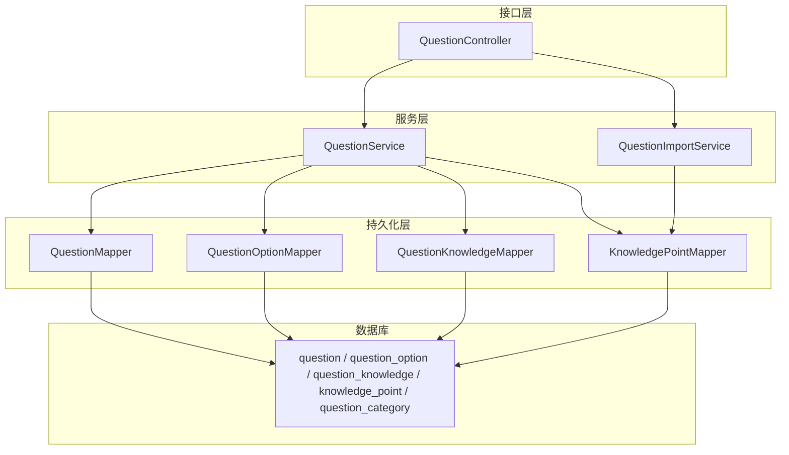
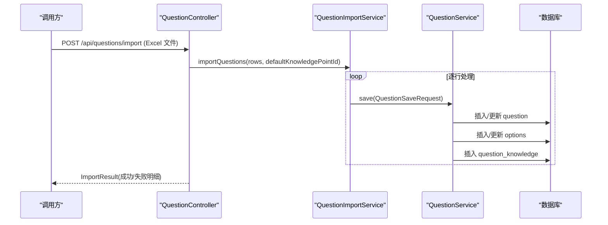
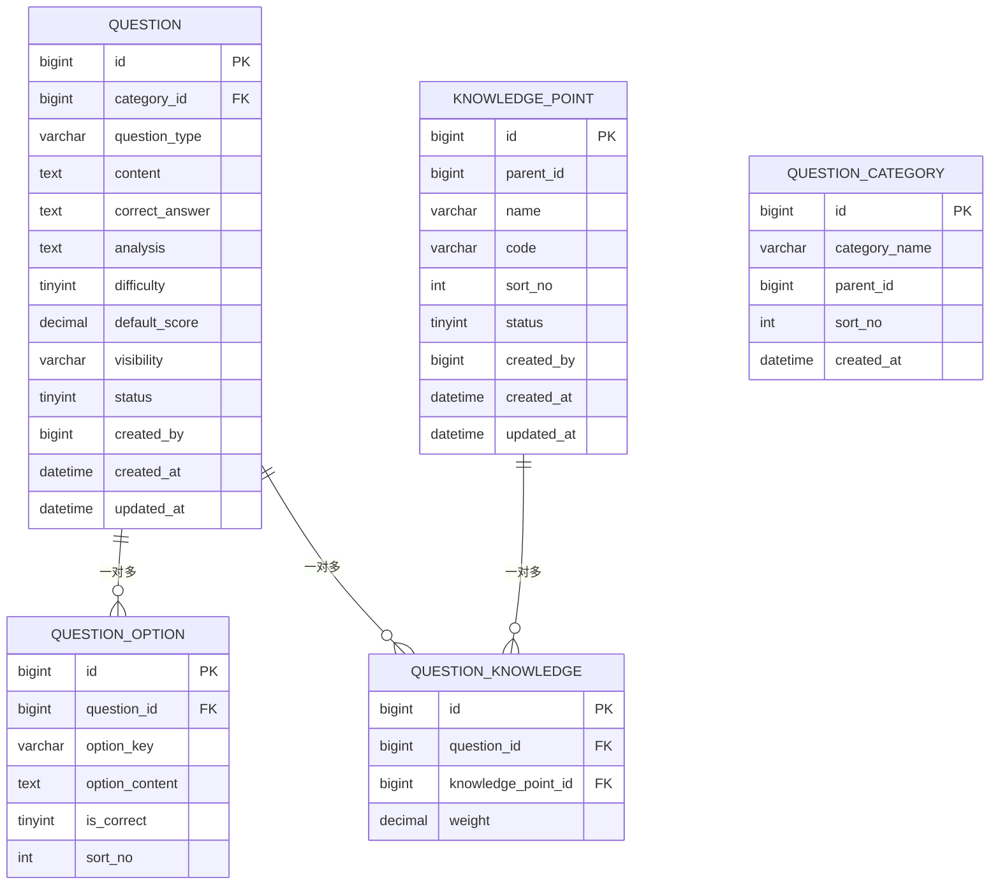
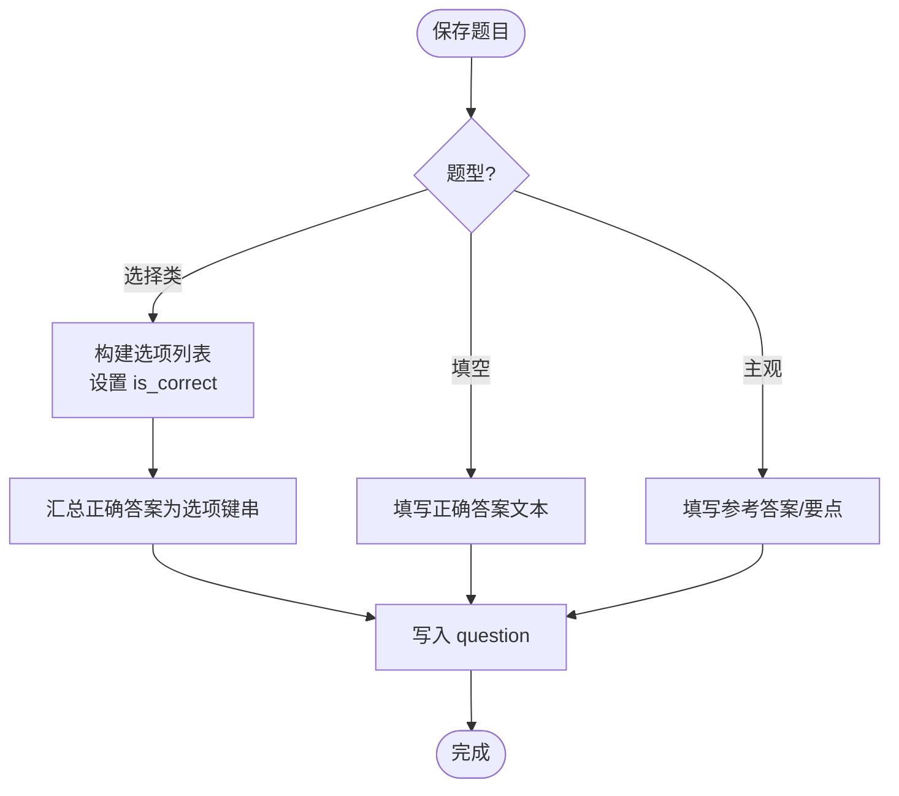
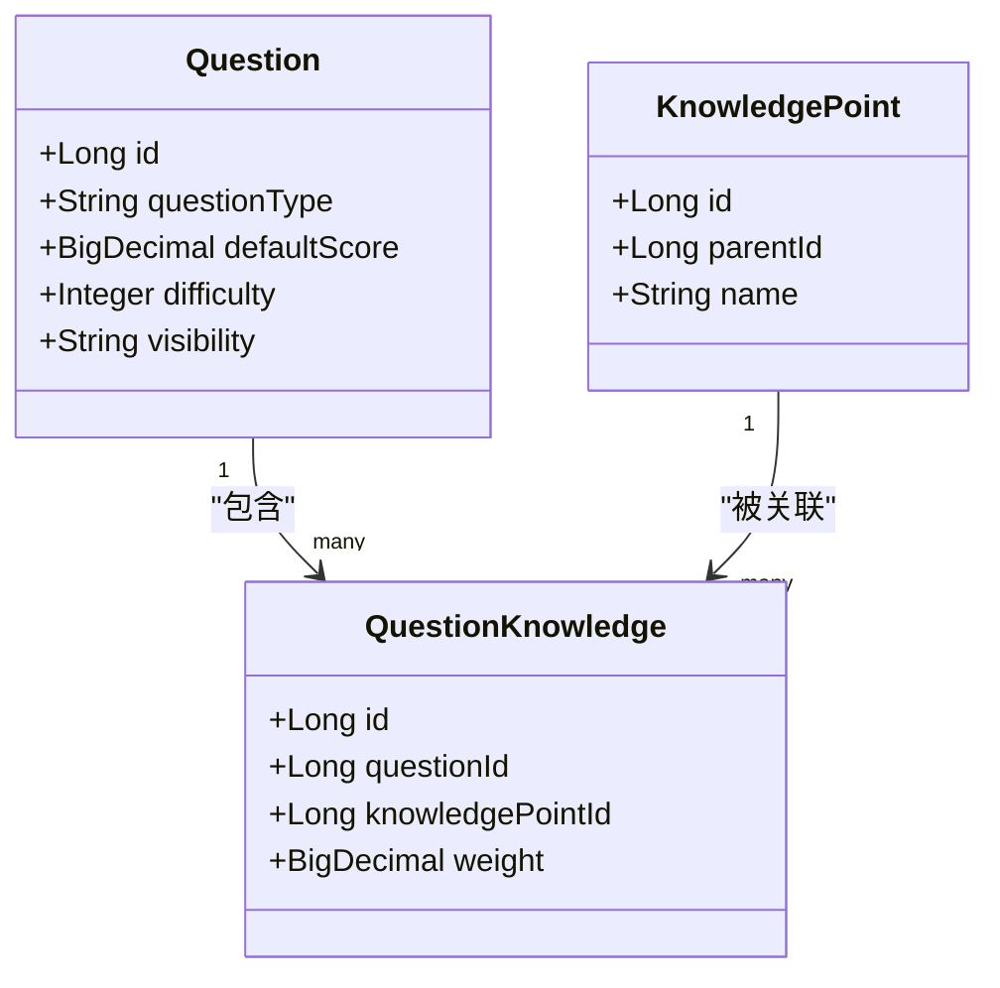
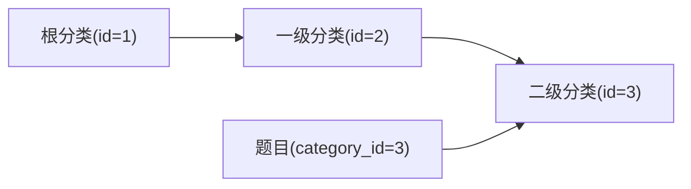
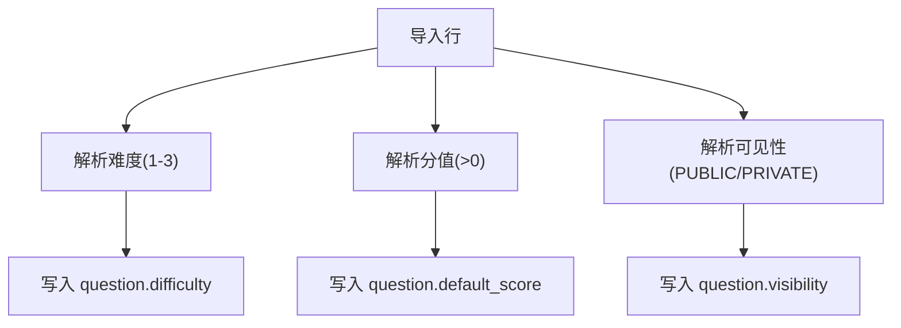
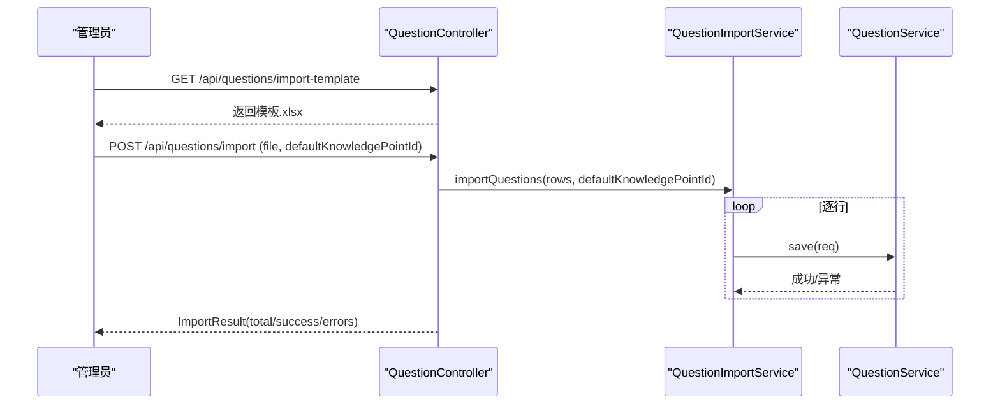
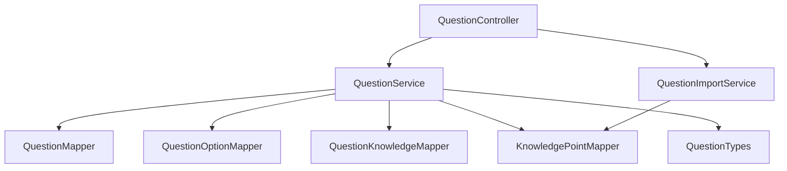

# 题库管理数据模型

<cite>
**本文引用的文件**
- [Question.java](file://exam-server/src/main/java/com/exam/entity/Question.java)
- [QuestionOption.java](file://exam-server/src/main/java/com/exam/entity/QuestionOption.java)
- [KnowledgePoint.java](file://exam-server/src/main/java/com/exam/entity/KnowledgePoint.java)
- [QuestionCategory.java](file://exam-server/src/main/java/com/exam/entity/QuestionCategory.java)
- [QuestionKnowledge.java](file://exam-server/src/main/java/com/exam/entity/QuestionKnowledge.java)
- [schema.sql](file://sql/schema.sql)
- [QuestionTypes.java](file://exam-server/src/main/java/com/exam/util/QuestionTypes.java)
- [QuestionSaveRequest.java](file://exam-server/src/main/java/com/exam/dto/QuestionSaveRequest.java)
- [QuestionImportRow.java](file://exam-server/src/main/java/com/exam/dto/QuestionImportRow.java)
- [QuestionService.java](file://exam-server/src/main/java/com/exam/service/QuestionService.java)
- [QuestionImportService.java](file://exam-server/src/main/java/com/exam/service/QuestionImportService.java)
- [QuestionController.java](file://exam-server/src/main/java/com/exam/controller/QuestionController.java)
</cite>

## 目录
1. [简介](#简介)
2. [项目结构](#项目结构)
3. [核心数据模型](#核心数据模型)
4. [架构总览](#架构总览)
5. [详细组件分析](#详细组件分析)
6. [依赖关系分析](#依赖关系分析)
7. [性能与扩展性](#性能与扩展性)
8. [故障排查指南](#故障排查指南)
9. [结论](#结论)
10. [附录](#附录)

## 简介
本文件聚焦题库管理模块的数据模型，围绕题目、选项、知识点、分类等核心表进行系统化说明。文档覆盖多题型支持（单选、多选、判断、填空、简答、关键词解释）的数据结构设计；题目与知识点的多对多关系实现；题目分类的树形结构存储；以及难度等级、默认分值、可见性等业务字段在数据层的设计体现。同时给出题目导入导出、批量操作的数据处理方案与流程。

## 项目结构
题库相关代码主要位于后端 exam-server 中：
- 实体层 entity：定义题目、选项、知识点、分类、题目-知识点关联等持久化对象
- DTO 层 dto：定义保存请求、导入行映射等数据传输对象
- 工具层 util：题型常量与解析、默认分值等
- 服务层 service：题目增删改查、Excel 导入导出、PDF 导出等
- 控制器层 controller：对外暴露题库 API（分页查询、导入模板下载、批量导入、PDF 导出、CRUD）
- 数据库脚本：MySQL/H2 兼容建表语句

图表来源
- [QuestionController.java:31-118](file://exam-server/src/main/java/com/exam/controller/QuestionController.java#L31-L118)
- [QuestionService.java:33-225](file://exam-server/src/main/java/com/exam/service/QuestionService.java#L33-L225)
- [QuestionImportService.java:28-422](file://exam-server/src/main/java/com/exam/service/QuestionImportService.java#L28-L422)
- [schema.sql:31-87](file://sql/schema.sql#L31-L87)

章节来源
- [QuestionController.java:31-118](file://exam-server/src/main/java/com/exam/controller/QuestionController.java#L31-L118)
- [schema.sql:31-87](file://sql/schema.sql#L31-L87)

## 核心数据模型
本节从实体与建表脚本出发，梳理题库的核心表结构与字段含义。

- 题目表 question
  - 关键字段：id、category_id、question_type、content、correct_answer、analysis、difficulty、default_score、visibility、status、created_by、created_at、updated_at
  - 业务含义：
    - question_type：题型编码（SINGLE/MULTIPLE/JUDGE/FILL/ESSAY/TERM），由工具类统一校验与展示
    - difficulty：难度等级（1-3）
    - default_score：默认分值（Decimal），不同题型有默认值
    - visibility：可见性控制（PUBLIC/PRIVATE），用于非管理员用户过滤
    - status：逻辑删除标记（1 有效，0 删除）
  - 索引：按 category_id、question_type 建立索引以优化筛选

- 选项表 question_option
  - 关键字段：id、question_id、option_key、option_content、is_correct、sort_no
  - 业务含义：选择题选项集合，is_correct 表示是否为正确答案，sort_no 控制排序

- 知识点表 knowledge_point
  - 关键字段：id、parent_id、name、code、sort_no、status、created_by、created_at、updated_at
  - 业务含义：树形结构，parent_id=0 为根节点；通过 parent_id 形成层级

- 分类表 question_category
  - 关键字段：id、category_name、parent_id、sort_no、created_at
  - 业务含义：题目分类树，parent_id 表示父级分类

- 题目-知识点关联表 question_knowledge
  - 关键字段：id、question_id、knowledge_point_id、weight
  - 业务含义：题目与知识点多对多；weight 用于学情统计分摊分数

章节来源
- [Question.java:11-29](file://exam-server/src/main/java/com/exam/entity/Question.java#L11-L29)
- [QuestionOption.java:8-19](file://exam-server/src/main/java/com/exam/entity/QuestionOption.java#L8-L19)
- [KnowledgePoint.java:10-24](file://exam-server/src/main/java/com/exam/entity/KnowledgePoint.java#L10-L24)
- [QuestionCategory.java:10-20](file://exam-server/src/main/java/com/exam/entity/QuestionCategory.java#L10-L20)
- [QuestionKnowledge.java:10-19](file://exam-server/src/main/java/com/exam/entity/QuestionKnowledge.java#L10-L19)
- [schema.sql:31-87](file://sql/schema.sql#L31-L87)

## 架构总览
题库模块采用典型的分层架构：控制器接收请求并调用服务；服务负责业务规则与事务；Mapper 访问数据库；工具类提供题型常量与默认分值等通用能力。导入导出通过 EasyExcel 完成，PDF 导出通过专用服务生成。

图表来源
- [QuestionController.java:60-75](file://exam-server/src/main/java/com/exam/controller/QuestionController.java#L60-L75)
- [QuestionImportService.java:40-63](file://exam-server/src/main/java/com/exam/service/QuestionImportService.java#L40-L63)
- [QuestionService.java:95-151](file://exam-server/src/main/java/com/exam/service/QuestionService.java#L95-L151)
- [schema.sql:52-87](file://sql/schema.sql#L52-L87)

## 详细组件分析

### 实体与表关系

图表来源
- [schema.sql:31-87](file://sql/schema.sql#L31-L87)

章节来源
- [schema.sql:31-87](file://sql/schema.sql#L31-L87)

### 多题型数据结构设计
- 单选题/多选题/判断题
  - 答案来源于选项的 is_correct 汇总，系统自动拼接为逗号分隔的选项键（如 A,B,C）
  - 选项至少两个，判断题可留空，系统自动生成 A=正确、B=错误
- 填空题
  - 正确答案为文本，多个空位可用 | 分隔
- 简答题/关键词解释题
  - 主观题，需人工阅卷；正确答案可为参考答案或评分要点

图表来源
- [QuestionService.java:161-178](file://exam-server/src/main/java/com/exam/service/QuestionService.java#L161-L178)
- [QuestionImportService.java:100-138](file://exam-server/src/main/java/com/exam/service/QuestionImportService.java#L100-L138)
- [QuestionTypes.java:88-99](file://exam-server/src/main/java/com/exam/util/QuestionTypes.java#L88-L99)

章节来源
- [QuestionService.java:95-178](file://exam-server/src/main/java/com/exam/service/QuestionService.java#L95-L178)
- [QuestionImportService.java:100-138](file://exam-server/src/main/java/com/exam/service/QuestionImportService.java#L100-L138)
- [QuestionTypes.java:8-122](file://exam-server/src/main/java/com/exam/util/QuestionTypes.java#L8-L122)

### 题目与知识点的多对多关系
- 通过 question_knowledge 表建立题目与知识点的多对多关系
- 每道题目可绑定多个知识点，每个知识点可被多道题目引用
- weight 字段用于学情统计时对各知识点的分数分摊
- 唯一约束保证同一题目与同一知识点的重复绑定不会发生

图表来源
- [QuestionKnowledge.java:10-19](file://exam-server/src/main/java/com/exam/entity/QuestionKnowledge.java#L10-L19)
- [schema.sql:80-87](file://sql/schema.sql#L80-L87)

章节来源
- [QuestionKnowledge.java:10-19](file://exam-server/src/main/java/com/exam/entity/QuestionKnowledge.java#L10-L19)
- [schema.sql:80-87](file://sql/schema.sql#L80-L87)

### 题目分类的树形结构存储
- 分类表 question_category 使用 parent_id 表示父子关系，形成树形结构
- 题目表 question 通过 category_id 指向分类树的某个节点
- 导入时若未指定分类，可根据绑定的知识点路径向上追溯至根节点作为分类

图表来源
- [QuestionCategory.java:10-20](file://exam-server/src/main/java/com/exam/entity/QuestionCategory.java#L10-L20)
- [Question.java:11-29](file://exam-server/src/main/java/com/exam/entity/Question.java#L11-L29)
- [QuestionImportService.java:259-271](file://exam-server/src/main/java/com/exam/service/QuestionImportService.java#L259-L271)

章节来源
- [QuestionCategory.java:10-20](file://exam-server/src/main/java/com/exam/entity/QuestionCategory.java#L10-L20)
- [QuestionImportService.java:259-271](file://exam-server/src/main/java/com/exam/service/QuestionImportService.java#L259-L271)

### 难度等级、分数设置、可见性控制
- 难度等级：difficulty 字段（1-3），导入时校验范围
- 默认分值：default_score 字段，不同题型有默认值；导入时可覆盖
- 可见性控制：visibility 字段（PUBLIC/PRIVATE），非管理员查询时仅显示公开或本人创建的题目

图表来源
- [QuestionImportService.java:275-318](file://exam-server/src/main/java/com/exam/service/QuestionImportService.java#L275-L318)
- [QuestionTypes.java:102-121](file://exam-server/src/main/java/com/exam/util/QuestionTypes.java#L102-L121)
- [QuestionService.java:42-68](file://exam-server/src/main/java/com/exam/service/QuestionService.java#L42-L68)

章节来源
- [QuestionImportService.java:275-318](file://exam-server/src/main/java/com/exam/service/QuestionImportService.java#L275-L318)
- [QuestionTypes.java:102-121](file://exam-server/src/main/java/com/exam/util/QuestionTypes.java#L102-L121)
- [QuestionService.java:42-68](file://exam-server/src/main/java/com/exam/service/QuestionService.java#L42-L68)

### 题目导入导出与批量操作
- 导入
  - Excel 模板下载：提供示例数据与填写说明两页
  - 批量导入：逐行校验，单行失败不影响其他行；支持多种答案格式与知识点路径匹配
  - 限制：单次导入行数上限，避免大文件拖垮解析与事务
- 导出
  - PDF 练习卷导出：根据选中题目 ID 列表生成 PDF
  - 可选：后续可扩展 Excel 导出（当前已具备模板导出能力）

图表来源
- [QuestionController.java:52-75](file://exam-server/src/main/java/com/exam/controller/QuestionController.java#L52-L75)
- [QuestionImportService.java:326-398](file://exam-server/src/main/java/com/exam/service/QuestionImportService.java#L326-L398)
- [QuestionService.java:95-151](file://exam-server/src/main/java/com/exam/service/QuestionService.java#L95-L151)

章节来源
- [QuestionController.java:52-75](file://exam-server/src/main/java/com/exam/controller/QuestionController.java#L52-L75)
- [QuestionImportService.java:326-398](file://exam-server/src/main/java/com/exam/service/QuestionImportService.java#L326-L398)

## 依赖关系分析
- 控制器依赖服务：QuestionController 依赖 QuestionService、QuestionImportService、QuestionPdfService
- 服务依赖 Mapper：QuestionService 依赖 QuestionMapper、QuestionOptionMapper、QuestionKnowledgeMapper、KnowledgePointMapper
- 工具类依赖：QuestionTypes 提供题型常量、默认分值、合法性校验
- 数据一致性：导入过程无全局事务，单行失败不影响其他行；保存题目时使用 @Transactional 确保选项与知识点关联的一致性

图表来源
- [QuestionController.java:31-118](file://exam-server/src/main/java/com/exam/controller/QuestionController.java#L31-L118)
- [QuestionService.java:33-225](file://exam-server/src/main/java/com/exam/service/QuestionService.java#L33-L225)
- [QuestionImportService.java:28-422](file://exam-server/src/main/java/com/exam/service/QuestionImportService.java#L28-L422)
- [QuestionTypes.java:8-122](file://exam-server/src/main/java/com/exam/util/QuestionTypes.java#L8-L122)

章节来源
- [QuestionController.java:31-118](file://exam-server/src/main/java/com/exam/controller/QuestionController.java#L31-L118)
- [QuestionService.java:33-225](file://exam-server/src/main/java/com/exam/service/QuestionService.java#L33-L225)
- [QuestionImportService.java:28-422](file://exam-server/src/main/java/com/exam/service/QuestionImportService.java#L28-L422)
- [QuestionTypes.java:8-122](file://exam-server/src/main/java/com/exam/util/QuestionTypes.java#L8-L122)

## 性能与扩展性
- 索引优化：question.category_id、question.question_type、question_option.question_id、question_knowledge.knowledge_point_id 等索引提升查询效率
- 分页查询：page 方法支持类型、分类、知识点、关键词组合过滤，减少不必要数据加载
- 导入性能：限制单次导入行数，避免内存与事务压力；逐行失败不影响整体导入
- 扩展建议：
  - 增加题目标签、版本历史、草稿态等字段以支持更复杂的管理场景
  - 引入缓存（如 Redis）加速高频分类与知识点树读取
  - 对 PDF 导出进行异步化处理，避免阻塞请求线程

[本节为通用性能讨论，不直接分析具体文件]

## 故障排查指南
- 导入失败常见原因
  - 题型不识别：检查“题型”列是否使用支持的中文别名或英文编码
  - 题干为空：必填项缺失
  - 选项不足：选择题至少需要两个选项
  - 答案格式错误：选择题答案需为 A-F 字母，判断题需为“对/错”等
  - 知识点不存在或歧义：名称冲突时使用完整路径（如 云计算基础/IaaS）
- 可见性导致查询不到
  - 非管理员仅能查看 PUBLIC 或本人创建的题目，确认 visibility 与 createdBy
- 分值与难度校验
  - 分值必须大于 0；难度必须在 1-3 范围内

章节来源
- [QuestionImportService.java:65-98](file://exam-server/src/main/java/com/exam/service/QuestionImportService.java#L65-L98)
- [QuestionImportService.java:100-189](file://exam-server/src/main/java/com/exam/service/QuestionImportService.java#L100-L189)
- [QuestionImportService.java:193-257](file://exam-server/src/main/java/com/exam/service/QuestionImportService.java#L193-L257)
- [QuestionImportService.java:275-318](file://exam-server/src/main/java/com/exam/service/QuestionImportService.java#L275-L318)
- [QuestionService.java:42-68](file://exam-server/src/main/java/com/exam/service/QuestionService.java#L42-L68)

## 结论
题库管理模块通过清晰的分层设计与严谨的数据模型，实现了多题型支持、知识点多对多关联、分类树存储以及难度、分值、可见性等关键业务能力的落地。导入导出与批量操作提供了高效的数据处理能力，配合索引与分页策略保障查询性能。建议在后续迭代中增强版本管理与缓存机制，进一步提升系统的可维护性与扩展性。

[本节为总结性内容，不直接分析具体文件]

## 附录
- 题型常量与默认分值参考
  - 单选题：默认 2 分
  - 多选题：默认 4 分
  - 判断题：默认 2 分
  - 填空题：默认 2 分
  - 简答题：默认 10 分
  - 关键词解释题：默认 5 分
- 导入模板列说明
  - 题型、题干、选项A-选项F、正确答案、解析、难度、默认分值、知识点、可见范围

章节来源
- [QuestionTypes.java:102-121](file://exam-server/src/main/java/com/exam/util/QuestionTypes.java#L102-L121)
- [QuestionImportService.java:386-398](file://exam-server/src/main/java/com/exam/service/QuestionImportService.java#L386-L398)