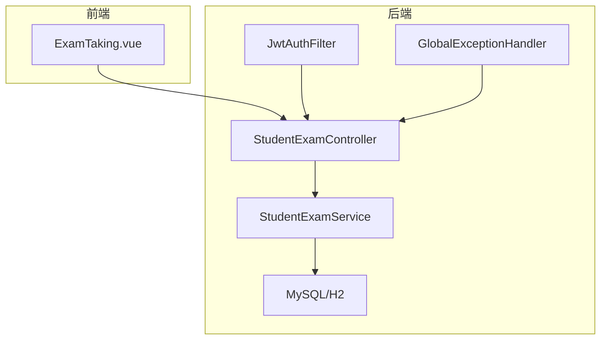
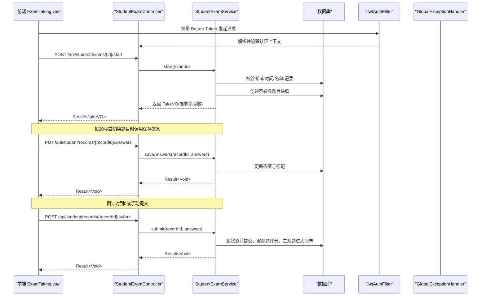
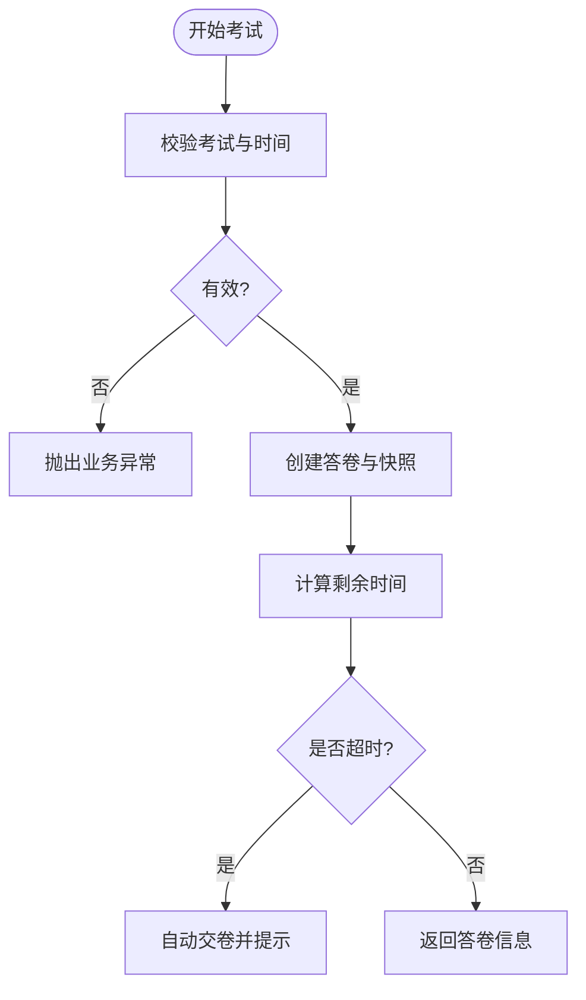
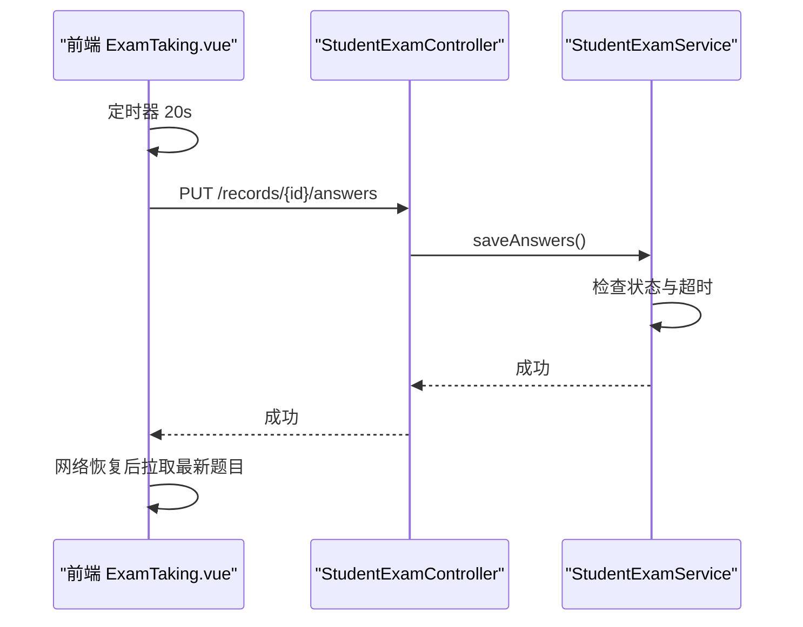
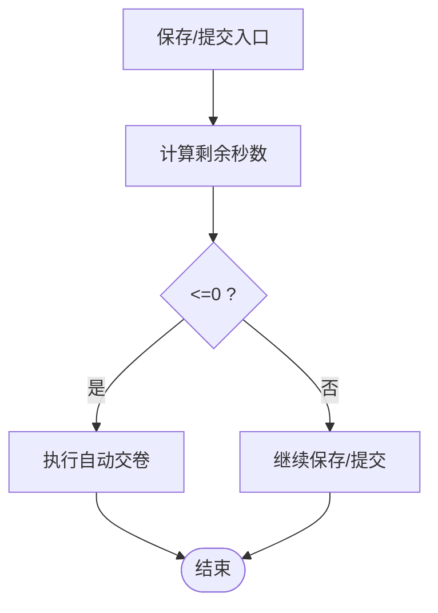
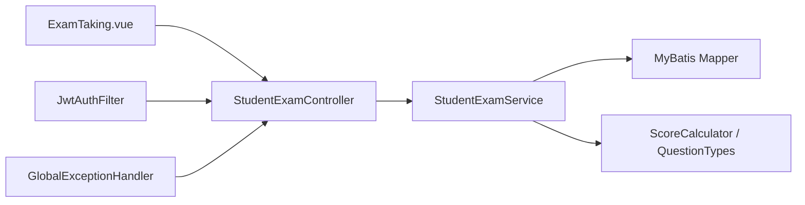
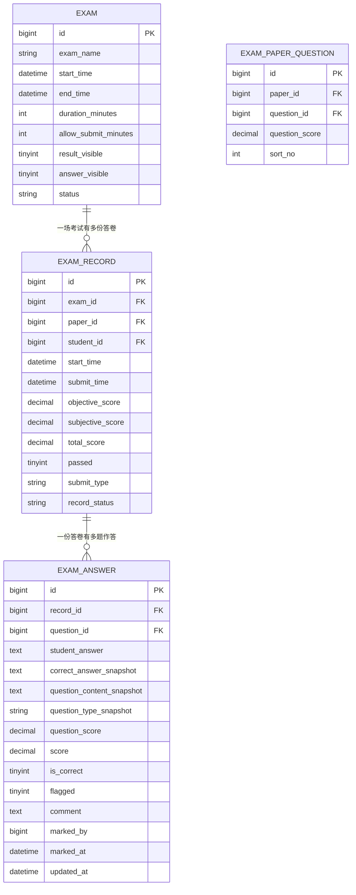

# 在线考试引擎

<cite>
**本文引用的文件**
- [StudentExamController.java](file://exam-server/src/main/java/com/exam/controller/StudentExamController.java)
- [StudentExamService.java](file://exam-server/src/main/java/com/exam/service/StudentExamService.java)
- [ExamAnswer.java](file://exam-server/src/main/java/com/exam/entity/ExamAnswer.java)
- [ExamRecord.java](file://exam-server/src/main/java/com/exam/entity/ExamRecord.java)
- [Exam.java](file://exam-server/src/main/java/com/exam/entity/Exam.java)
- [AnswerSaveRequest.java](file://exam-server/src/main/java/com/exam/dto/AnswerSaveRequest.java)
- [ScoreCalculator.java](file://exam-server/src/main/java/com/exam/util/ScoreCalculator.java)
- [QuestionTypes.java](file://exam-server/src/main/java/com/exam/util/QuestionTypes.java)
- [JwtAuthFilter.java](file://exam-server/src/main/java/com/exam/security/JwtAuthFilter.java)
- [GlobalExceptionHandler.java](file://exam-server/src/main/java/com/exam/common/GlobalExceptionHandler.java)
- [BizException.java](file://exam-server/src/main/java/com/exam/common/BizException.java)
- [application.yml](file://exam-server/src/main/resources/application.yml)
- [schema-mysql.sql](file://sql/schema-mysql.sql)
- [ExamTaking.vue](file://exam-web/src/views/exam/ExamTaking.vue)
</cite>

## 目录
1. [简介](#简介)
2. [项目结构](#项目结构)
3. [核心组件](#核心组件)
4. [架构总览](#架构总览)
5. [详细组件分析](#详细组件分析)
6. [依赖关系分析](#依赖关系分析)
7. [性能与并发](#性能与并发)
8. [故障排查指南](#故障排查指南)
9. [结论](#结论)
10. [附录](#附录)

## 简介
本在线考试引擎提供学生端实时答题、答案自动保存、超时自动交卷、客观题自动评分、主观题人工阅卷、成绩与知识点掌握度统计等能力。系统通过“开始考试→拉题（不含答案）→定时/事件触发保存→到期或手动交卷→评分→完成”的完整流程，保障答题数据一致性、安全性与高可用。前端采用倒计时与周期性持久化策略，后端以事务与乐观锁保证并发安全，并通过全局异常处理统一错误响应。

## 项目结构
- 后端：Spring Boot 应用，分层为 controller → service → mapper → entity；安全认证基于 JWT；配置使用 application.yml 与多环境 profile；数据库脚本位于 sql/schema-mysql.sql。
- 前端：Vue 3 学生端考试页面，实现倒计时、选项交互、标记题目、周期保存与到期自动交卷。

图表来源
- [ExamTaking.vue:1-141](file://exam-web/src/views/exam/ExamTaking.vue#L1-L141)
- [StudentExamController.java:1-73](file://exam-server/src/main/java/com/exam/controller/StudentExamController.java#L1-L73)
- [StudentExamService.java:1-458](file://exam-server/src/main/java/com/exam/service/StudentExamService.java#L1-L458)
- [JwtAuthFilter.java:1-52](file://exam-server/src/main/java/com/exam/security/JwtAuthFilter.java#L1-L52)
- [GlobalExceptionHandler.java:1-61](file://exam-server/src/main/java/com/exam/common/GlobalExceptionHandler.java#L1-L61)
- [schema-mysql.sql:1-200](file://sql/schema-mysql.sql#L1-L200)

章节来源
- [application.yml:1-42](file://exam-server/src/main/resources/application.yml#L1-L42)
- [schema-mysql.sql:1-200](file://sql/schema-mysql.sql#L1-L200)

## 核心组件
- 学生端控制器：暴露开始考试、拉题、保存答案、提交答卷、查看复习结果等接口。
- 学生考试服务：实现考试状态机、快照创建、答案保存、超时自动交卷、客观题评分、主观题进入阅卷、完成答卷与知识点重算。
- 实体模型：考试、答卷记录、作答明细、试卷题目映射等，支撑数据持久化与一致性。
- 评分工具：题型识别与客观题匹配逻辑。
- 安全与异常：JWT 鉴权过滤器与全局异常处理器，统一返回格式与错误码。
- 前端考试页：倒计时、周期保存、标记题目、提交确认与自动交卷。

章节来源
- [StudentExamController.java:18-72](file://exam-server/src/main/java/com/exam/controller/StudentExamController.java#L18-L72)
- [StudentExamService.java:38-458](file://exam-server/src/main/java/com/exam/service/StudentExamService.java#L38-L458)
- [ExamAnswer.java:11-31](file://exam-server/src/main/java/com/exam/entity/ExamAnswer.java#L11-L31)
- [ExamRecord.java:11-28](file://exam-server/src/main/java/com/exam/entity/ExamRecord.java#L11-L28)
- [Exam.java:10-27](file://exam-server/src/main/java/com/exam/entity/Exam.java#L10-L27)
- [ScoreCalculator.java:6-55](file://exam-server/src/main/java/com/exam/util/ScoreCalculator.java#L6-L55)
- [QuestionTypes.java:8-123](file://exam-server/src/main/java/com/exam/util/QuestionTypes.java#L8-L123)
- [JwtAuthFilter.java:21-52](file://exam-server/src/main/java/com/exam/security/JwtAuthFilter.java#L21-L52)
- [GlobalExceptionHandler.java:14-61](file://exam-server/src/main/java/com/exam/common/GlobalExceptionHandler.java#L14-L61)
- [ExamTaking.vue:43-114](file://exam-web/src/views/exam/ExamTaking.vue#L43-L114)

## 架构总览
系统采用前后端分离架构。前端负责用户交互、倒计时与本地状态管理；后端通过 REST API 提供服务，使用 MyBatis-Plus 访问数据库，结合事务与乐观锁保证并发安全。JWT 过滤器在请求到达控制器前完成身份解析与上下文注入。全局异常处理器统一封装业务异常与系统异常。

图表来源
- [StudentExamController.java:35-59](file://exam-server/src/main/java/com/exam/controller/StudentExamController.java#L35-L59)
- [StudentExamService.java:94-194](file://exam-server/src/main/java/com/exam/service/StudentExamService.java#L94-L194)
- [JwtAuthFilter.java:29-50](file://exam-server/src/main/java/com/exam/security/JwtAuthFilter.java#L29-L50)
- [GlobalExceptionHandler.java:20-61](file://exam-server/src/main/java/com/exam/common/GlobalExceptionHandler.java#L20-L61)
- [ExamTaking.vue:93-114](file://exam-web/src/views/exam/ExamTaking.vue#L93-L114)

## 详细组件分析

### 实时答题流程与状态管理
- 开始考试：校验考试存在性、草稿状态、时间窗口与考生名单；若已有答卷且非答题中则拒绝；新建答卷并写入题目快照；计算剩余时间，若已超时则自动交卷并提示。
- 拉取题目：根据答卷 ID 获取题目列表（不含正确答案），支持复习模式显示选项正确项。
- 保存答案：仅允许在答题中进行；若检测到超时则自动交卷；按题号更新学生答案与标记。
- 提交答卷：限制开考后一定时间内不可提前交卷；静默保存答案；以乐观锁将状态从“答题中”改为“已提交”，客观题立即评分，主观题进入“阅卷中”，无主观题直接完成。
- 复习查看：根据考试配置决定是否展示标准答案与解析；未完成的答卷不显示分数。

图表来源
- [StudentExamService.java:94-140](file://exam-server/src/main/java/com/exam/service/StudentExamService.java#L94-L140)
- [StudentExamService.java:377-382](file://exam-server/src/main/java/com/exam/service/StudentExamService.java#L377-L382)

章节来源
- [StudentExamController.java:29-65](file://exam-server/src/main/java/com/exam/controller/StudentExamController.java#L29-L65)
- [StudentExamService.java:55-147](file://exam-server/src/main/java/com/exam/service/StudentExamService.java#L55-L147)
- [StudentExamService.java:149-239](file://exam-server/src/main/java/com/exam/service/StudentExamService.java#L149-L239)

### 答案自动保存机制与断线重连
- 前端策略：每 20 秒自动保存一次全部题目答案与标记；切换题目或修改答案时立即保存；离开页面时尝试最后一次保存。
- 后端幂等：保存接口按题号更新答案，重复提交不会破坏数据；若检测到超时则自动交卷，避免继续修改。
- 断线重连：前端在恢复后可重新拉取题目（包含已保存答案），继续答题；若服务端已自动交卷，前端收到提示并跳转至记录页。

图表来源
- [ExamTaking.vue:74-114](file://exam-web/src/views/exam/ExamTaking.vue#L74-L114)
- [StudentExamController.java:47-52](file://exam-server/src/main/java/com/exam/controller/StudentExamController.java#L47-L52)
- [StudentExamService.java:149-178](file://exam-server/src/main/java/com/exam/service/StudentExamService.java#L149-L178)

章节来源
- [ExamTaking.vue:67-114](file://exam-web/src/views/exam/ExamTaking.vue#L67-L114)
- [StudentExamService.java:149-178](file://exam-server/src/main/java/com/exam/service/StudentExamService.java#L149-L178)

### 超时处理与自动交卷逻辑
- 超时判定：以“开始时间 + 时长”与“考试截止时间”的较小值作为截止点；每次保存或提交时检测剩余时间。
- 自动交卷：若检测到超时，立即执行提交内部流程，将答卷状态置为“已提交”，客观题评分，主观题进入阅卷或直接完成。
- 前端倒计时：每秒递减，到 0 时主动提交并提示“时间到，已自动交卷”。

图表来源
- [StudentExamService.java:149-160](file://exam-server/src/main/java/com/exam/service/StudentExamService.java#L149-L160)
- [StudentExamService.java:258-298](file://exam-server/src/main/java/com/exam/service/StudentExamService.java#L258-L298)
- [ExamTaking.vue:98-107](file://exam-web/src/views/exam/ExamTaking.vue#L98-L107)

章节来源
- [StudentExamService.java:149-160](file://exam-server/src/main/java/com/exam/service/StudentExamService.java#L149-L160)
- [StudentExamService.java:258-298](file://exam-server/src/main/java/com/exam/service/StudentExamService.java#L258-L298)
- [ExamTaking.vue:98-107](file://exam-web/src/views/exam/ExamTaking.vue#L98-L107)

### 防作弊与安全措施
- 身份鉴权：每个请求通过 JWT 过滤器解析令牌并设置认证上下文；未携带或无效令牌由后续鉴权返回 401。
- 权限控制：学生端接口限定角色访问；答卷操作需属于当前学生。
- 数据隔离：所有答卷与答案查询均绑定学生 ID，防止越权访问。
- 防重复提交：提交时使用乐观锁更新状态，防止并发重复交卷。

章节来源
- [JwtAuthFilter.java:29-50](file://exam-server/src/main/java/com/exam/security/JwtAuthFilter.java#L29-L50)
- [StudentExamService.java:384-390](file://exam-server/src/main/java/com/exam/service/StudentExamService.java#L384-L390)
- [StudentExamService.java:258-267](file://exam-server/src/main/java/com/exam/service/StudentExamService.java#L258-L267)

### 答题进度跟踪与复习查看
- 进度跟踪：前端侧边栏按钮根据是否作答与是否标记进行样式区分；服务端返回的题目包含学生答案与标记位。
- 复习查看：根据考试配置决定是否显示标准答案与解析；未完成答卷不显示分数与正确性。

章节来源
- [ExamTaking.vue:9-15](file://exam-web/src/views/exam/ExamTaking.vue#L9-L15)
- [StudentExamService.java:196-239](file://exam-server/src/main/java/com/exam/service/StudentExamService.java#L196-L239)

### 答题数据持久化与一致性
- 快照机制：开始考试时写入题干、正确答案、题型与分值的快照，确保题库变更不影响历史答卷。
- 事务边界：开始、保存、提交等操作使用事务注解，保证多表更新的原子性。
- 并发安全：提交时通过条件更新（状态为“答题中”才改为“已提交”）避免重复提交。
- 索引优化：数据库对答卷、答案、考试等关键表建立索引，提升查询与更新性能。

章节来源
- [StudentExamService.java:311-330](file://exam-server/src/main/java/com/exam/service/StudentExamService.java#L311-L330)
- [StudentExamService.java:94-140](file://exam-server/src/main/java/com/exam/service/StudentExamService.java#L94-L140)
- [StudentExamService.java:258-298](file://exam-server/src/main/java/com/exam/service/StudentExamService.java#L258-L298)
- [schema-mysql.sql:138-174](file://sql/schema-mysql.sql#L138-L174)

### 客观题自动评分与主观题阅卷
- 客观题评分：单选题、判断题、填空题、多选题按规则匹配；空答案视为错误；多选题排序后比较。
- 主观题阅卷：简答题与关键词解释题进入“阅卷中”，教师评分后完成答卷并计算总分与及格状态。
- 知识点统计：完成答卷后重算学生知识点掌握度。

章节来源
- [ScoreCalculator.java:15-55](file://exam-server/src/main/java/com/exam/util/ScoreCalculator.java#L15-L55)
- [QuestionTypes.java:88-91](file://exam-server/src/main/java/com/exam/util/QuestionTypes.java#L88-L91)
- [StudentExamService.java:258-309](file://exam-server/src/main/java/com/exam/service/StudentExamService.java#L258-L309)

## 依赖关系分析
- 控制器依赖服务层，服务层依赖多个 Mapper 与工具类。
- 安全过滤器在请求进入控制器前解析 JWT。
- 全局异常处理器捕获业务异常与系统异常，统一返回。
- 前端依赖后端 API 实现考试流程。

图表来源
- [StudentExamController.java:18-72](file://exam-server/src/main/java/com/exam/controller/StudentExamController.java#L18-L72)
- [StudentExamService.java:38-53](file://exam-server/src/main/java/com/exam/service/StudentExamService.java#L38-L53)
- [ScoreCalculator.java:6-55](file://exam-server/src/main/java/com/exam/util/ScoreCalculator.java#L6-L55)
- [QuestionTypes.java:8-123](file://exam-server/src/main/java/com/exam/util/QuestionTypes.java#L8-L123)
- [JwtAuthFilter.java:21-52](file://exam-server/src/main/java/com/exam/security/JwtAuthFilter.java#L21-L52)
- [GlobalExceptionHandler.java:14-61](file://exam-server/src/main/java/com/exam/common/GlobalExceptionHandler.java#L14-L61)
- [ExamTaking.vue:43-114](file://exam-web/src/views/exam/ExamTaking.vue#L43-L114)

章节来源
- [StudentExamController.java:18-72](file://exam-server/src/main/java/com/exam/controller/StudentExamController.java#L18-L72)
- [StudentExamService.java:38-53](file://exam-server/src/main/java/com/exam/service/StudentExamService.java#L38-L53)

## 性能与并发
- 并发策略
  - 提交阶段使用乐观锁（条件更新状态）避免重复提交与竞态。
  - 保存答案按题号更新，减少锁粒度与冲突概率。
  - 前端周期保存降低单次请求压力，同时提高数据可靠性。
- 数据一致性
  - 关键流程使用事务注解保证多表更新原子性。
  - 快照机制隔离题库变更对历史答卷的影响。
- 性能优化建议
  - 数据库索引：答卷、答案、考试等表已建立常用索引，可进一步评估热点查询路径。
  - 批量操作：保存答案可考虑批量更新以减少往返次数（当前按题号逐条更新）。
  - 缓存：对只读题目元数据（如选项）可引入缓存以降低数据库压力。
  - 连接池与线程池：合理配置数据库连接池与 Web 线程池以应对高并发。
- 异常处理
  - 全局异常处理器统一封装错误码与消息，避免堆栈泄露。
  - 业务异常集中定义，便于前端友好提示。

[本节为通用指导，不直接分析具体文件]

## 故障排查指南
- 常见业务异常
  - “考试不存在/尚未开始/已结束”：检查考试时间与状态。
  - “你不在本场考试名单中”：核对考生分配。
  - “已交卷，不能再修改/请勿重复交卷”：检查答卷状态与提交逻辑。
  - “开考后 X 分钟内不能交卷”：核对考试配置。
- 安全相关
  - 401/403：检查 JWT 令牌与角色权限。
- 系统异常
  - 500：查看服务器日志定位具体异常堆栈。

章节来源
- [GlobalExceptionHandler.java:20-61](file://exam-server/src/main/java/com/exam/common/GlobalExceptionHandler.java#L20-L61)
- [BizException.java:5-22](file://exam-server/src/main/java/com/exam/common/BizException.java#L5-L22)
- [StudentExamService.java:94-194](file://exam-server/src/main/java/com/exam/service/StudentExamService.java#L94-L194)

## 结论
该在线考试引擎通过清晰的状态机、快照机制、事务与乐观锁、统一的异常处理以及前后端协作的倒计时与自动保存策略，实现了高可靠、高一致性的在线考试场景。针对高并发，可通过批量保存、缓存与资源调优进一步提升吞吐与稳定性。主观题阅卷与知识点统计完善了教学闭环，满足实际教学需求。

[本节为总结，不直接分析具体文件]

## 附录
- 关键实体关系（简化）

图表来源
- [schema-mysql.sql:114-174](file://sql/schema-mysql.sql#L114-L174)