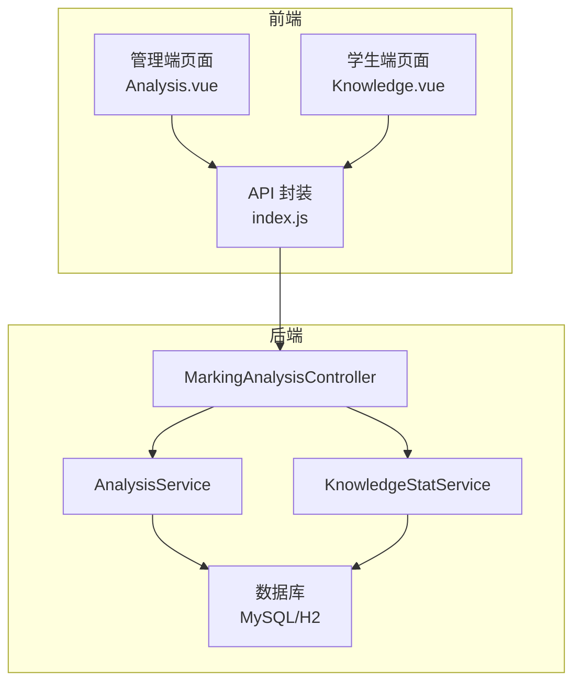
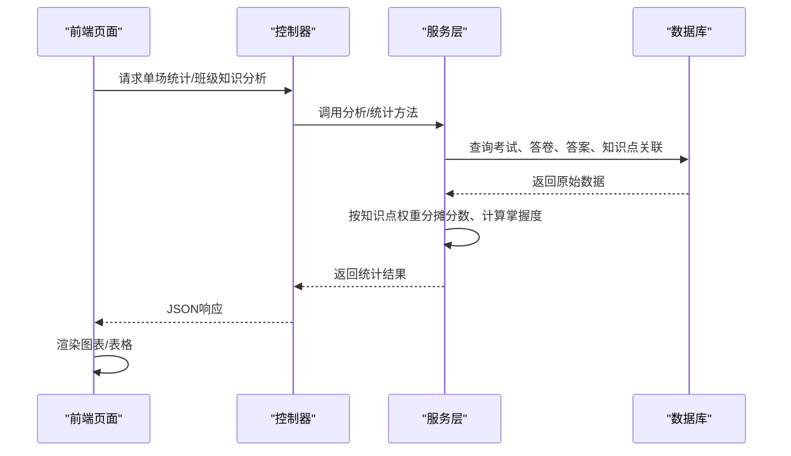
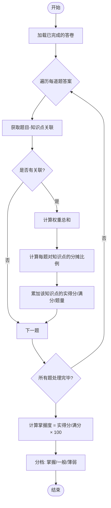
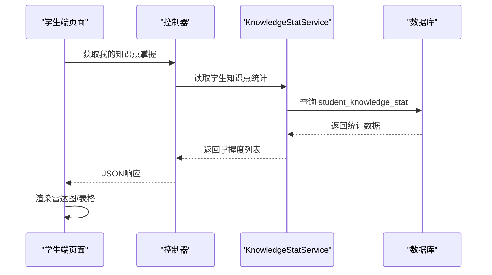
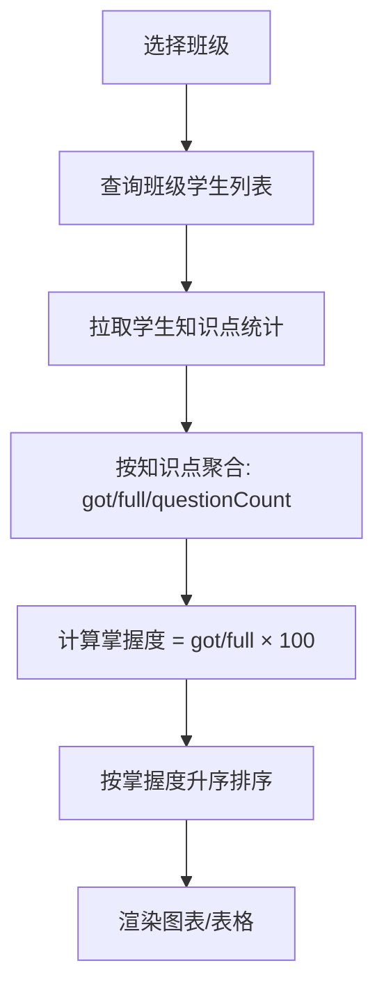
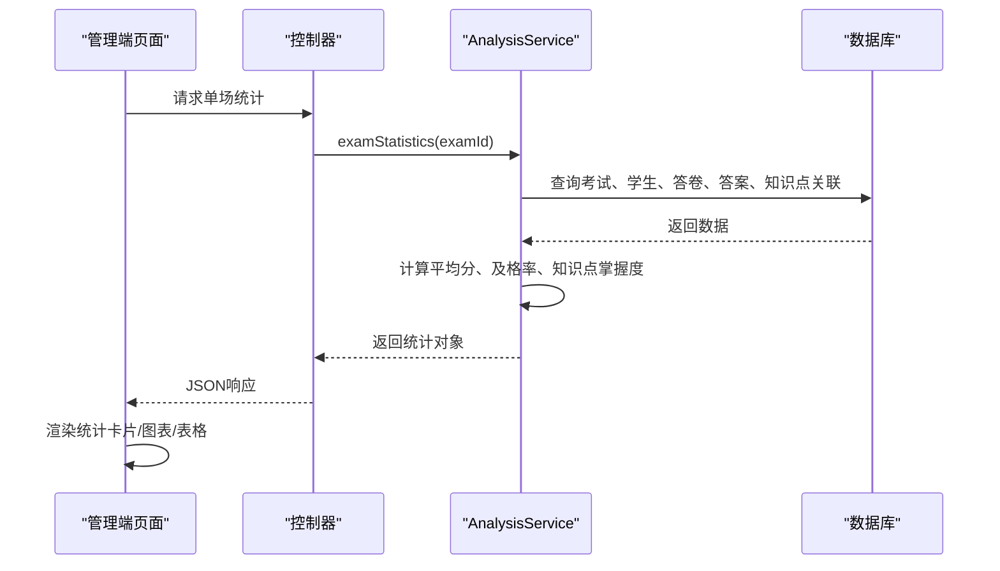
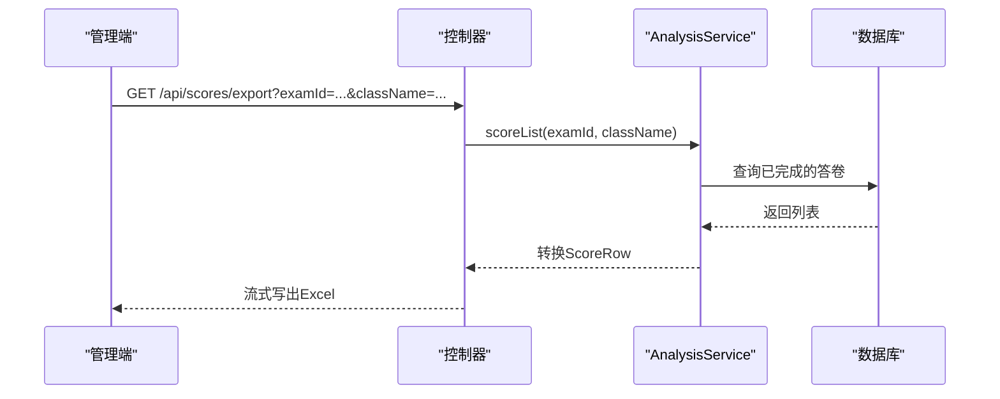
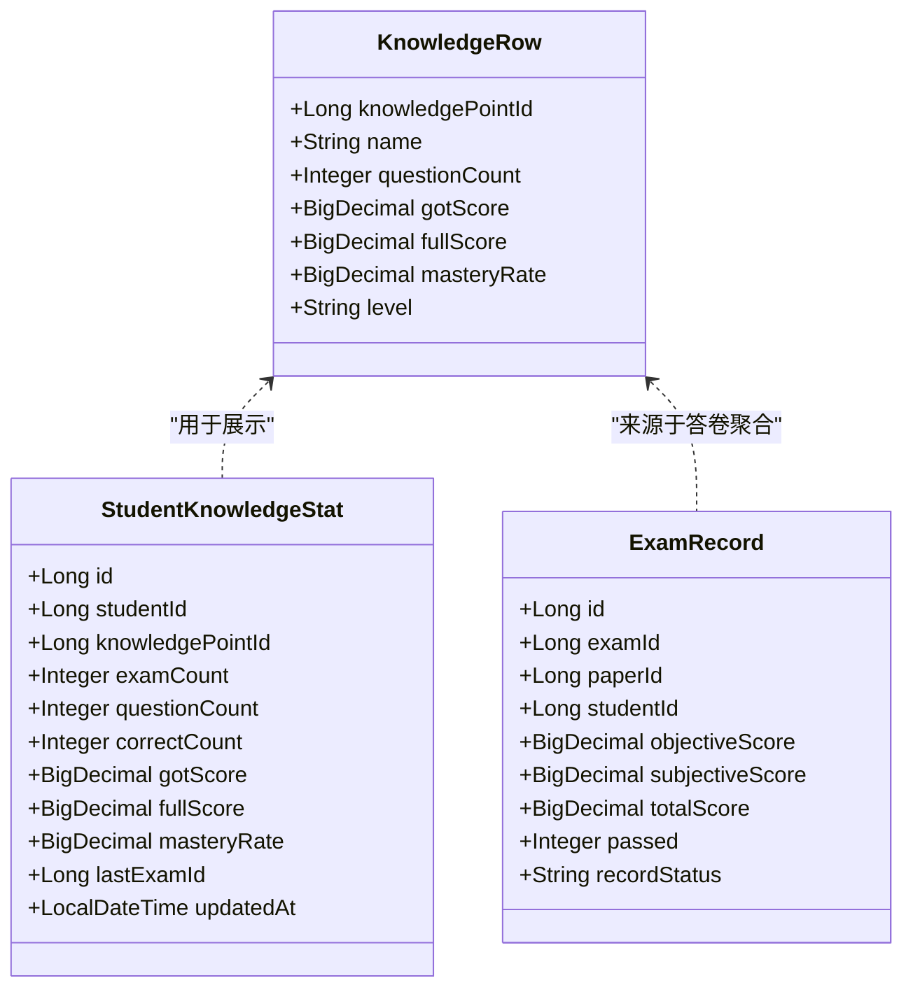
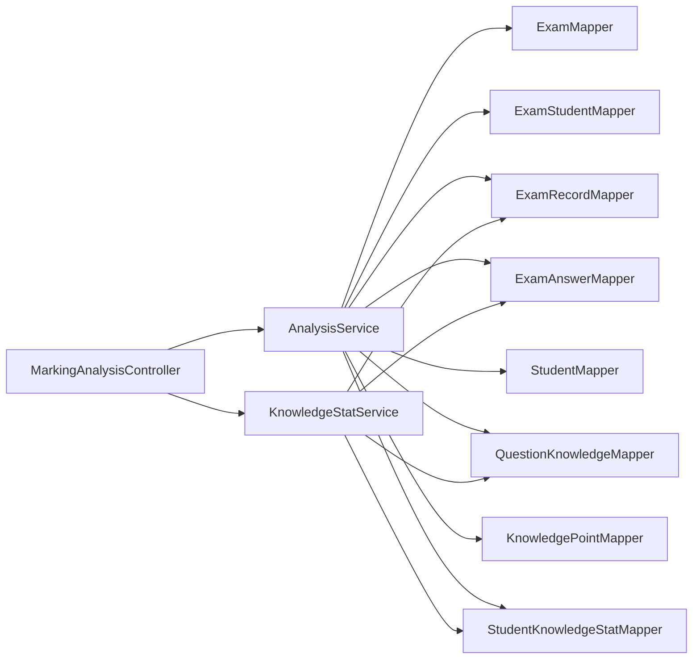

# 学情分析系统

<cite>
**本文引用的文件**
- [AnalysisService.java](file://exam-server/src/main/java/com/exam/service/AnalysisService.java)
- [KnowledgeStatService.java](file://exam-server/src/main/java/com/exam/service/KnowledgeStatService.java)
- [MarkingAnalysisController.java](file://exam-server/src/main/java/com/exam/controller/MarkingAnalysisController.java)
- [StudentKnowledgeStat.java](file://exam-server/src/main/java/com/exam/entity/StudentKnowledgeStat.java)
- [ExamRecord.java](file://exam-server/src/main/java/com/exam/entity/ExamRecord.java)
- [KnowledgePoint.java](file://exam-server/src/main/java/com/exam/entity/KnowledgePoint.java)
- [QuestionKnowledge.java](file://exam-server/src/main/java/com/exam/entity/QuestionKnowledge.java)
- [Analysis.vue](file://exam-web/src/views/admin/Analysis.vue)
- [Knowledge.vue](file://exam-web/src/views/student/Knowledge.vue)
- [index.js](file://exam-web/src/api/index.js)
- [schema.sql](file://sql/schema.sql)
</cite>

## 目录
1. [简介](#简介)
2. [项目结构](#项目结构)
3. [核心组件](#核心组件)
4. [架构总览](#架构总览)
5. [详细组件分析](#详细组件分析)
6. [依赖关系分析](#依赖关系分析)
7. [性能与可扩展性](#性能与可扩展性)
8. [故障排查指南](#故障排查指南)
9. [结论](#结论)
10. [附录：指标定义与报表示例](#附录指标定义与报表示例)

## 简介
本系统提供“知识点掌握度分析、个人能力评估、班级统计分析”三大能力，围绕考试成绩与题目-知识点关联关系，实现多维度的学情分析与可视化报表生成。系统通过阅卷后重算学生知识点掌握情况，结合单场考试统计、班级聚合统计，输出薄弱点识别、趋势分析与个性化学习建议，为教师教学与学生自主学习提供数据支撑。

## 项目结构
- 后端（Spring Boot）
  - 控制器层：提供阅卷、统计、导出等接口
  - 服务层：实现知识点掌握度计算、班级/个人统计、成绩汇总
  - 实体与映射：考试、答卷、答案、知识点、题目-知识点关联、学生知识统计等
  - 工具与安全：JWT鉴权、全局异常处理、分页结果封装
- 前端（Vue + ECharts）
  - 管理端：考试选择、班级筛选、知识点掌握度图表、考生明细表
  - 学生端：我的知识点掌握雷达图、考试记录与回顾
  - API 封装：统一调用后端接口

**图示来源**
- [MarkingAnalysisController.java:38-89](file://exam-server/src/main/java/com/exam/controller/MarkingAnalysisController.java#L38-L89)
- [AnalysisService.java:46-211](file://exam-server/src/main/java/com/exam/service/AnalysisService.java#L46-L211)
- [KnowledgeStatService.java:34-100](file://exam-server/src/main/java/com/exam/service/KnowledgeStatService.java#L34-L100)
- [Analysis.vue:60-84](file://exam-web/src/views/admin/Analysis.vue#L60-L84)
- [Knowledge.vue:27-36](file://exam-web/src/views/student/Knowledge.vue#L27-L36)
- [index.js:64-81](file://exam-web/src/api/index.js#L64-L81)

**章节来源**
- [MarkingAnalysisController.java:38-89](file://exam-server/src/main/java/com/exam/controller/MarkingAnalysisController.java#L38-L89)
- [Analysis.vue:60-84](file://exam-web/src/views/admin/Analysis.vue#L60-L84)
- [Knowledge.vue:27-36](file://exam-web/src/views/student/Knowledge.vue#L27-L36)
- [index.js:64-81](file://exam-web/src/api/index.js#L64-L81)

## 核心组件
- 阅卷与统计控制器：提供阅卷列表、详情、评分、单场统计、班级/学生知识点分析、成绩导出等接口
- 分析服务：计算单场考试统计、按知识点维度聚合、班级聚合、学生个人知识点掌握度展示
- 知识统计服务：基于已完成答卷，按题目-知识点权重分摊分数，重算并持久化学生知识点掌握度
- 数据模型：考试记录、答案、知识点、题目-知识点关联、学生知识统计等
- 前端视图：管理端统计面板与学生端掌握度雷达图

**章节来源**
- [MarkingAnalysisController.java:38-89](file://exam-server/src/main/java/com/exam/controller/MarkingAnalysisController.java#L38-L89)
- [AnalysisService.java:46-211](file://exam-server/src/main/java/com/exam/service/AnalysisService.java#L46-L211)
- [KnowledgeStatService.java:34-100](file://exam-server/src/main/java/com/exam/service/KnowledgeStatService.java#L34-L100)
- [StudentKnowledgeStat.java:11-27](file://exam-server/src/main/java/com/exam/entity/StudentKnowledgeStat.java#L11-L27)
- [ExamRecord.java:11-28](file://exam-server/src/main/java/com/exam/entity/ExamRecord.java#L11-L28)
- [KnowledgePoint.java:10-24](file://exam-server/src/main/java/com/exam/entity/KnowledgePoint.java#L10-L24)
- [QuestionKnowledge.java:10-19](file://exam-server/src/main/java/com/exam/entity/QuestionKnowledge.java#L10-L19)

## 架构总览
系统采用前后端分离架构。前端通过API调用后端控制器，控制器委托服务层完成业务逻辑，服务层通过MyBatis-Plus访问数据库。关键流程包括：
- 阅卷完成后触发学生知识点掌握度重算
- 单场考试统计聚合得分、通过率、平均分
- 班级维度按知识点聚合掌握度，排序识别薄弱点
- 前端渲染柱状图/雷达图，支持导出成绩表格

**图示来源**
- [MarkingAnalysisController.java:55-73](file://exam-server/src/main/java/com/exam/controller/MarkingAnalysisController.java#L55-L73)
- [AnalysisService.java:46-211](file://exam-server/src/main/java/com/exam/service/AnalysisService.java#L46-L211)
- [KnowledgeStatService.java:34-100](file://exam-server/src/main/java/com/exam/service/KnowledgeStatService.java#L34-L100)
- [Analysis.vue:73-84](file://exam-web/src/views/admin/Analysis.vue#L73-L84)
- [Knowledge.vue:27-36](file://exam-web/src/views/student/Knowledge.vue#L27-L36)

## 详细组件分析

### 知识点掌握度算法
- 核心思想：将每道题的得分按题目到知识点的权重进行分摊，得到每个知识点的“实得分/满分”，再乘以100得到掌握度百分比
- 权重分摊：若题目关联多个知识点，先计算权重总和，再按比例分配分数；当权重总和为0时，退化为按题数平均
- 分档规则：≥80%为“掌握”，60–79%为“一般”，<60%为“薄弱”
- 数据来源：已完成答卷（FINISHED），逐题答案及题目-知识点关联

**图示来源**
- [AnalysisService.java:163-211](file://exam-server/src/main/java/com/exam/service/AnalysisService.java#L163-L211)
- [KnowledgeStatService.java:44-99](file://exam-server/src/main/java/com/exam/service/KnowledgeStatService.java#L44-L99)
- [QuestionKnowledge.java:10-19](file://exam-server/src/main/java/com/exam/entity/QuestionKnowledge.java#L10-L19)

**章节来源**
- [AnalysisService.java:163-211](file://exam-server/src/main/java/com/exam/service/AnalysisService.java#L163-L211)
- [KnowledgeStatService.java:44-99](file://exam-server/src/main/java/com/exam/service/KnowledgeStatService.java#L44-L99)

### 个人能力评估
- 数据来源：student_knowledge_stat 表中按学生聚合的知识点掌握度
- 展示方式：雷达图显示各知识点掌握度，表格列出题量、掌握度、分档
- 更新时机：阅卷完成后由 KnowledgeStatService 重算并写入统计表

**图示来源**
- [Knowledge.vue:27-36](file://exam-web/src/views/student/Knowledge.vue#L27-L36)
- [index.js:81](file://exam-web/src/api/index.js#L81)
- [KnowledgeStatService.java:34-100](file://exam-server/src/main/java/com/exam/service/KnowledgeStatService.java#L34-L100)
- [StudentKnowledgeStat.java:11-27](file://exam-server/src/main/java/com/exam/entity/StudentKnowledgeStat.java#L11-L27)

**章节来源**
- [Knowledge.vue:27-36](file://exam-web/src/views/student/Knowledge.vue#L27-L36)
- [KnowledgeStatService.java:34-100](file://exam-server/src/main/java/com/exam/service/KnowledgeStatService.java#L34-L100)

### 班级统计分析
- 聚合维度：按班级内所有学生的知识点掌握度汇总，计算班级层面的实得分、满分、题量与掌握度
- 排序与识别：按掌握度升序排列，便于定位薄弱知识点
- 使用场景：教师快速定位班级整体薄弱环节，制定针对性讲评计划

**图示来源**
- [AnalysisService.java:109-145](file://exam-server/src/main/java/com/exam/service/AnalysisService.java#L109-L145)
- [Analysis.vue:80-84](file://exam-web/src/views/admin/Analysis.vue#L80-L84)

**章节来源**
- [AnalysisService.java:109-145](file://exam-server/src/main/java/com/exam/service/AnalysisService.java#L109-L145)
- [Analysis.vue:80-84](file://exam-web/src/views/admin/Analysis.vue#L80-L84)

### 单场考试统计
- 统计项：应考人数、已交卷、完成、阅卷中、缺考、平均分、及格率
- 学生明细：包含学号、姓名、班级、状态、总分、是否及格、提交时间
- 知识点维度：同班级聚合思路，但限定于本场考试范围

**图示来源**
- [MarkingAnalysisController.java:55-63](file://exam-server/src/main/java/com/exam/controller/MarkingAnalysisController.java#L55-L63)
- [AnalysisService.java:46-97](file://exam-server/src/main/java/com/exam/service/AnalysisService.java#L46-L97)
- [Analysis.vue:73-79](file://exam-web/src/views/admin/Analysis.vue#L73-L79)

**章节来源**
- [MarkingAnalysisController.java:55-63](file://exam-server/src/main/java/com/exam/controller/MarkingAnalysisController.java#L55-L63)
- [AnalysisService.java:46-97](file://exam-server/src/main/java/com/exam/service/AnalysisService.java#L46-L97)
- [Analysis.vue:73-79](file://exam-web/src/views/admin/Analysis.vue#L73-L79)

### 成绩导出与报表生成
- 导出格式：Excel（EasyExcel）
- 字段：考试名称、学号、姓名、班级、客观题得分、主观题得分、总分、是否及格
- 过滤条件：可按考试或班级筛选

**图示来源**
- [MarkingAnalysisController.java:81-90](file://exam-server/src/main/java/com/exam/controller/MarkingAnalysisController.java#L81-L90)
- [MarkingAnalysisController.java:92-112](file://exam-server/src/main/java/com/exam/controller/MarkingAnalysisController.java#L92-L112)

**章节来源**
- [MarkingAnalysisController.java:81-90](file://exam-server/src/main/java/com/exam/controller/MarkingAnalysisController.java#L81-L90)
- [MarkingAnalysisController.java:92-112](file://exam-server/src/main/java/com/exam/controller/MarkingAnalysisController.java#L92-L112)

### 可视化报表与趋势分析
- 管理端：柱状图展示知识点掌握度（从低到高），表格展示分档标签
- 学生端：雷达图直观呈现各知识点掌握度分布
- 趋势分析：可通过多次考试的 student_knowledge_stat.last_exam_id 与 updatedAt 观察掌握度变化，辅助教师追踪教学成效

**图示来源**
- [AnalysisService.java:247-256](file://exam-server/src/main/java/com/exam/service/AnalysisService.java#L247-L256)
- [StudentKnowledgeStat.java:11-27](file://exam-server/src/main/java/com/exam/entity/StudentKnowledgeStat.java#L11-L27)
- [ExamRecord.java:11-28](file://exam-server/src/main/java/com/exam/entity/ExamRecord.java#L11-L28)

**章节来源**
- [AnalysisService.java:247-256](file://exam-server/src/main/java/com/exam/service/AnalysisService.java#L247-L256)
- [Knowledge.vue:27-36](file://exam-web/src/views/student/Knowledge.vue#L27-L36)
- [Analysis.vue:60-79](file://exam-web/src/views/admin/Analysis.vue#L60-L79)

## 依赖关系分析
- 控制器依赖服务：MarkingAnalysisController 依赖 AnalysisService 与 MarkingService
- 服务依赖数据访问：AnalysisService 与 KnowledgeStatService 通过 Mapper 访问数据库
- 数据模型耦合：ExamRecord、ExamAnswer、QuestionKnowledge、KnowledgePoint、StudentKnowledgeStat 构成知识统计的核心链路
- 前端依赖API：Analysis.vue 与 Knowledge.vue 通过 index.js 调用后端接口

**图示来源**
- [MarkingAnalysisController.java:33-36](file://exam-server/src/main/java/com/exam/controller/MarkingAnalysisController.java#L33-L36)
- [AnalysisService.java:37-44](file://exam-server/src/main/java/com/exam/service/AnalysisService.java#L37-L44)
- [KnowledgeStatService.java:29-32](file://exam-server/src/main/java/com/exam/service/KnowledgeStatService.java#L29-L32)

**章节来源**
- [MarkingAnalysisController.java:33-36](file://exam-server/src/main/java/com/exam/controller/MarkingAnalysisController.java#L33-L36)
- [AnalysisService.java:37-44](file://exam-server/src/main/java/com/exam/service/AnalysisService.java#L37-L44)
- [KnowledgeStatService.java:29-32](file://exam-server/src/main/java/com/exam/service/KnowledgeStatService.java#L29-L32)

## 性能与可扩展性
- 聚合复杂度：按知识点聚合涉及多表关联与流式计算，建议在大数据量下增加索引（如 exam_record.exam_id、exam_answer.record_id、question_knowledge.question_id）
- 重算策略：KnowledgeStatService 在事务中删除并重写学生知识点统计，避免脏读；可考虑异步任务触发以提升用户体验
- 缓存优化：高频查询的班级/考试统计可引入缓存（如本地缓存或Redis），减少数据库压力
- 扩展点：支持更多分档阈值、加权策略、趋势分析窗口（近N次考试）、导出更多维度字段

[本节为通用指导，不直接分析具体文件]

## 故障排查指南
- 掌握度为0或异常
  - 检查答卷状态是否为 FINISHED
  - 确认题目是否关联知识点且权重合理
  - 核对答案得分与题目满分是否正确
- 班级统计为空
  - 确认班级学生是否存在且有关联的知识点统计
  - 检查学生知识统计是否已重算
- 导出失败
  - 检查响应头设置与内容类型
  - 确认 EasyExcel 写入流是否正常关闭

**章节来源**
- [KnowledgeStatService.java:34-100](file://exam-server/src/main/java/com/exam/service/KnowledgeStatService.java#L34-L100)
- [AnalysisService.java:163-211](file://exam-server/src/main/java/com/exam/service/AnalysisService.java#L163-L211)
- [MarkingAnalysisController.java:81-90](file://exam-server/src/main/java/com/exam/controller/MarkingAnalysisController.java#L81-L90)

## 结论
本学情分析系统以“题目-知识点”关联为核心，通过阅卷后的分数分摊与聚合，实现了知识点掌握度分析、个人能力评估与班级统计分析。系统提供直观的可视化报表与成绩导出功能，帮助教师精准定位薄弱点、制定教学策略，同时为学生个性化学习提供数据依据。未来可在趋势分析、缓存优化与异步重算方面进一步增强体验与性能。

[本节为总结，不直接分析具体文件]

## 附录：指标定义与报表示例

### 指标定义
- 掌握度 = 实得分 / 满分 × 100（保留两位小数）
- 分档：≥80% 掌握，60–79% 一般，<60% 薄弱
- 平均分：已完成答卷的总分均值
- 及格率：已通过人数 / 已完成人数 × 100

**章节来源**
- [AnalysisService.java:231-239](file://exam-server/src/main/java/com/exam/service/AnalysisService.java#L231-L239)
- [AnalysisService.java:63-71](file://exam-server/src/main/java/com/exam/service/AnalysisService.java#L63-L71)

### 报表与图表
- 管理端：柱状图（知识点掌握度从低到高）、表格（知识点、掌握度、分档）、考生明细表
- 学生端：雷达图（各知识点掌握度）
- 导出：Excel（考试、学号、姓名、班级、客观题、主观题、总分、是否及格）

**章节来源**
- [Analysis.vue:13-39](file://exam-web/src/views/admin/Analysis.vue#L13-L39)
- [Knowledge.vue:4-16](file://exam-web/src/views/student/Knowledge.vue#L4-L16)
- [MarkingAnalysisController.java:114-132](file://exam-server/src/main/java/com/exam/controller/MarkingAnalysisController.java#L114-L132)

### 数据库模型要点
- 知识点树：knowledge_point（含父节点、排序、状态）
- 题目-知识点关联：question_knowledge（含权重）
- 考试记录：exam_record（含状态、得分、是否及格）
- 学生知识统计：student_knowledge_stat（掌握度、最近考试ID、更新时间）

**章节来源**
- [schema.sql:31-42](file://sql/schema.sql#L31-L42)
- [schema.sql:80-87](file://sql/schema.sql#L80-L87)
- [schema.sql:135-151](file://sql/schema.sql#L135-L151)
- [schema.sql:173-187](file://sql/schema.sql#L173-L187)