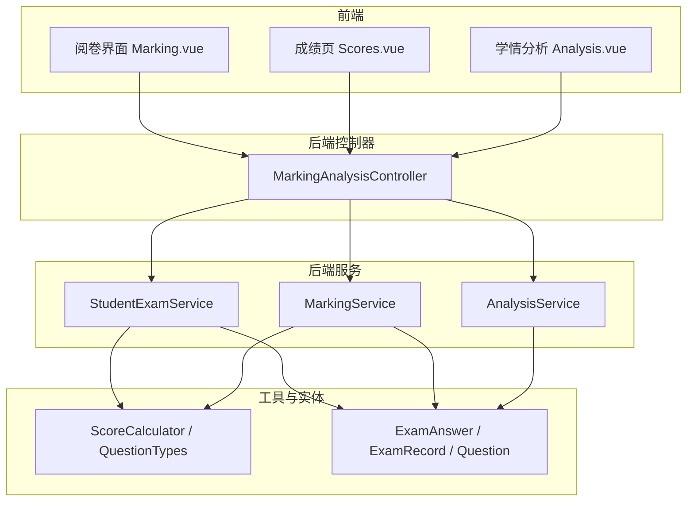
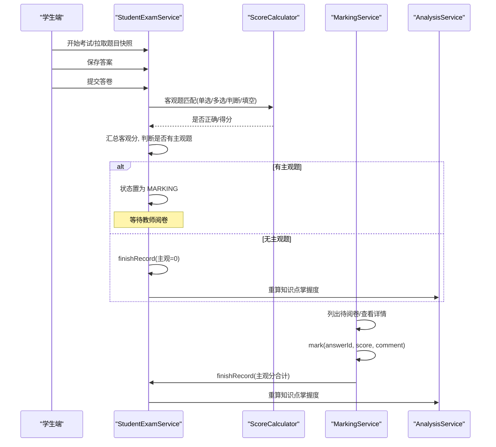
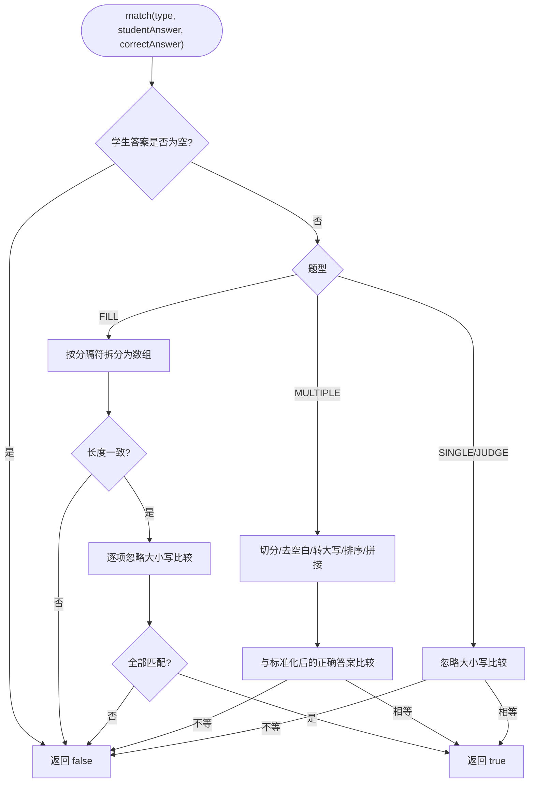
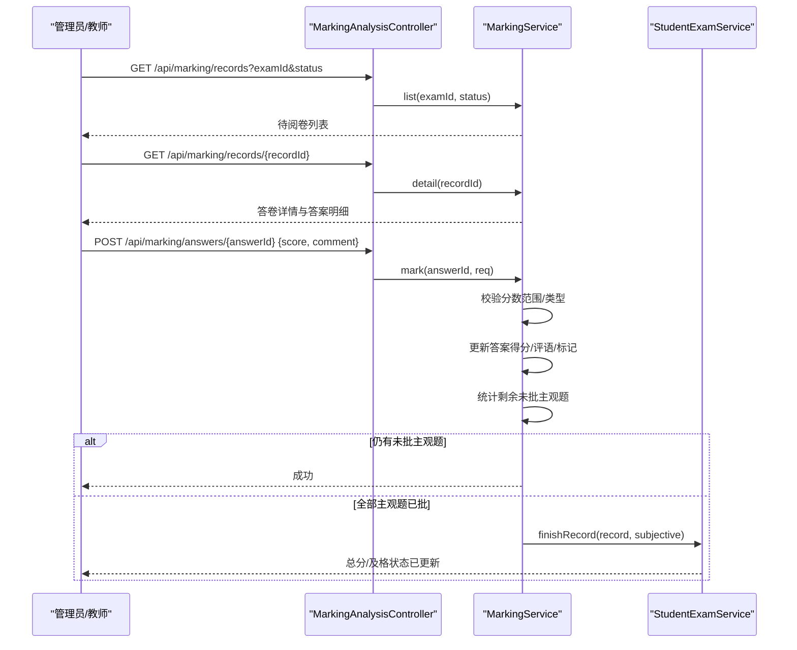
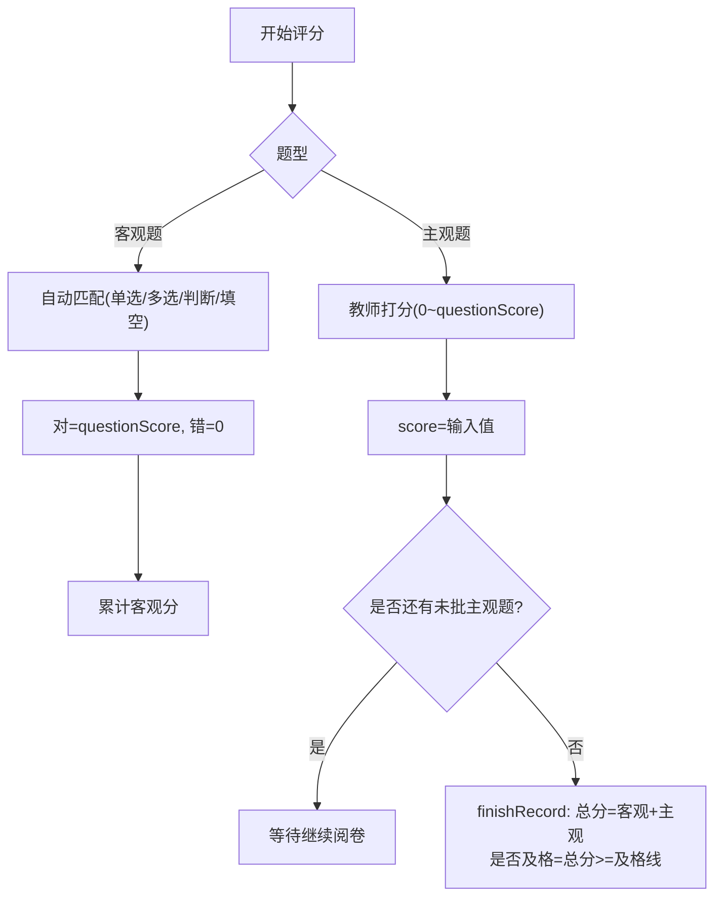
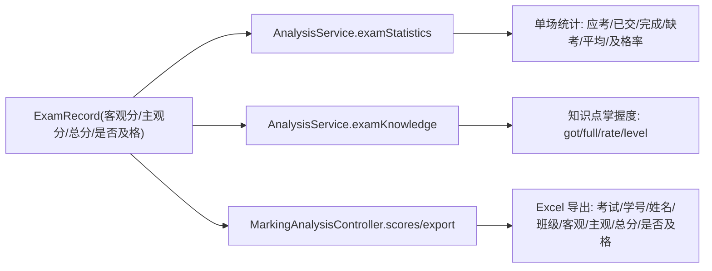
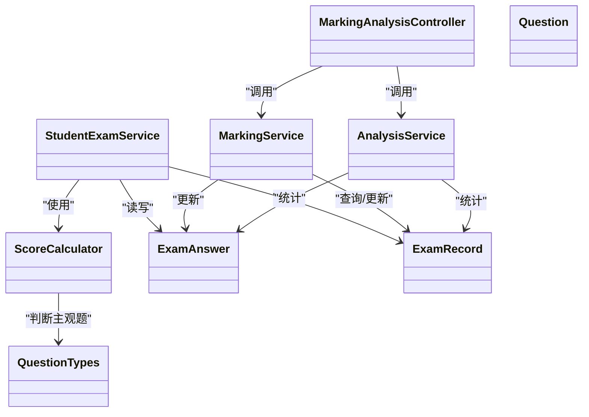

# 智能评分系统

<cite>
**本文引用的文件**
- [ScoreCalculator.java](file://exam-server/src/main/java/com/exam/util/ScoreCalculator.java)
- [QuestionTypes.java](file://exam-server/src/main/java/com/exam/util/QuestionTypes.java)
- [StudentExamService.java](file://exam-server/src/main/java/com/exam/service/StudentExamService.java)
- [MarkingService.java](file://exam-server/src/main/java/com/exam/service/MarkingService.java)
- [AnalysisService.java](file://exam-server/src/main/java/com/exam/service/AnalysisService.java)
- [MarkingAnalysisController.java](file://exam-server/src/main/java/com/exam/controller/MarkingAnalysisController.java)
- [ExamAnswer.java](file://exam-server/src/main/java/com/exam/entity/ExamAnswer.java)
- [ExamRecord.java](file://exam-server/src/main/java/com/exam/entity/ExamRecord.java)
- [Question.java](file://exam-server/src/main/java/com/exam/entity/Question.java)
- [MarkingRequest.java](file://exam-server/src/main/java/com/exam/dto/MarkingRequest.java)
- [Marking.vue](file://exam-web/src/views/admin/Marking.vue)
- [Scores.vue](file://exam-web/src/views/admin/Scores.vue)
- [Analysis.vue](file://exam-web/src/views/admin/Analysis.vue)
- [README.md](file://README.md)
</cite>

## 目录
1. [简介](#简介)
2. [项目结构](#项目结构)
3. [核心组件](#核心组件)
4. [架构总览](#架构总览)
5. [详细组件分析](#详细组件分析)
6. [依赖关系分析](#依赖关系分析)
7. [性能与扩展性](#性能与扩展性)
8. [故障排查指南](#故障排查指南)
9. [结论](#结论)
10. [附录：配置示例与最佳实践](#附录：配置示例与最佳实践)

## 简介
本系统提供“客观题自动评分 + 主观题人工阅卷”的完整闭环，覆盖从学生答题、交卷、自动评分、教师阅卷、成绩汇总到学情分析的完整流程。系统通过题型常量与默认分值实现灵活的评分规则配置；在交卷时完成客观题自动判分，主观题进入阅卷队列，待全部主观题批完后计算总分、判定是否及格并更新知识点掌握度。同时提供成绩导出与按考试/班级维度的知识掌握度分析报表。

## 项目结构
后端采用 Spring Boot 分层架构：
- 控制器层：对外暴露阅卷、统计、成绩导出等接口
- 服务层：封装考试主流程、阅卷逻辑、统计分析
- 工具类：题型判断、客观题匹配算法
- 实体层：题目、答卷、答案快照、记录等数据模型
- 前端：Vue 3 管理端与学生端，包含阅卷界面、成绩页、学情分析页

图表来源
- [MarkingAnalysisController.java:38-90](file://exam-server/src/main/java/com/exam/controller/MarkingAnalysisController.java#L38-L90)
- [StudentExamService.java:94-309](file://exam-server/src/main/java/com/exam/service/StudentExamService.java#L94-L309)
- [MarkingService.java:38-131](file://exam-server/src/main/java/com/exam/service/MarkingService.java#L38-L131)
- [AnalysisService.java:46-258](file://exam-server/src/main/java/com/exam/service/AnalysisService.java#L46-L258)
- [ScoreCalculator.java:1-55](file://exam-server/src/main/java/com/exam/util/ScoreCalculator.java#L1-L55)
- [QuestionTypes.java:1-123](file://exam-server/src/main/java/com/exam/util/QuestionTypes.java#L1-L123)
- [ExamAnswer.java:1-32](file://exam-server/src/main/java/com/exam/entity/ExamAnswer.java#L1-L32)
- [ExamRecord.java:1-29](file://exam-server/src/main/java/com/exam/entity/ExamRecord.java#L1-L29)
- [Question.java:1-30](file://exam-server/src/main/java/com/exam/entity/Question.java#L1-L30)

章节来源
- [README.md:1-82](file://README.md#L1-L82)

## 核心组件
- 客观题自动评分器：统一处理单选、多选、判断、填空的匹配策略，空答案视为错，多选题选项归一化排序后比较。
- 阅卷服务：列出待阅卷答卷、查看详情、提交主观题得分与评语，并在全部主观题完成后汇总主观分、出总分、回写知识点掌握度。
- 考试主流程服务：创建答卷、写入题目快照、保存答案、交卷自动评分、状态流转（ANSWERING→SUBMITTED→MARKING/FINISHED）、完成阅卷后结算总分与及格判定。
- 学情分析服务：单场考试统计（应考/已交/平均分/及格率）、知识点掌握度（按权重加权）、班级薄弱点、成绩列表与导出。
- 题型与默认分值：集中定义题型常量、中文别名、是否主观题、选择题识别、各题型默认分值。

章节来源
- [ScoreCalculator.java:1-55](file://exam-server/src/main/java/com/exam/util/ScoreCalculator.java#L1-L55)
- [QuestionTypes.java:1-123](file://exam-server/src/main/java/com/exam/util/QuestionTypes.java#L1-L123)
- [StudentExamService.java:94-309](file://exam-server/src/main/java/com/exam/service/StudentExamService.java#L94-L309)
- [MarkingService.java:38-131](file://exam-server/src/main/java/com/exam/service/MarkingService.java#L38-L131)
- [AnalysisService.java:46-258](file://exam-server/src/main/java/com/exam/service/AnalysisService.java#L46-L258)

## 架构总览
系统围绕“答卷记录 ExamRecord”和“答案快照 ExamAnswer”展开。交卷时根据题型快照进行自动评分；若存在主观题则进入阅卷队列；教师完成主观题打分后，系统汇总主观分并计算总分与是否及格，同时更新知识点掌握度。

图表来源
- [StudentExamService.java:180-309](file://exam-server/src/main/java/com/exam/service/StudentExamService.java#L180-L309)
- [ScoreCalculator.java:20-44](file://exam-server/src/main/java/com/exam/util/ScoreCalculator.java#L20-L44)
- [MarkingService.java:92-131](file://exam-server/src/main/java/com/exam/service/MarkingService.java#L92-L131)
- [AnalysisService.java:300-309](file://exam-server/src/main/java/com/exam/service/AnalysisService.java#L300-L309)

## 详细组件分析

### 客观题自动评分算法
- 单选题/判断题：忽略大小写全等匹配，空答案视为错误。
- 填空题：支持多空用分隔符拆分，长度一致且每个空逐空忽略大小写比较。
- 多选题：将用户答案按分隔符切分、去空白、转大写、排序后拼接，再与标准答案规范化结果比较。
- 主观题（简答/关键词解释）不参与自动匹配，走人工阅卷。

图表来源
- [ScoreCalculator.java:20-53](file://exam-server/src/main/java/com/exam/util/ScoreCalculator.java#L20-L53)

章节来源
- [ScoreCalculator.java:1-55](file://exam-server/src/main/java/com/exam/util/ScoreCalculator.java#L1-L55)
- [QuestionTypes.java:88-100](file://exam-server/src/main/java/com/exam/util/QuestionTypes.java#L88-L100)

### 主观题人工阅卷流程
- 阅卷列表：按考试或状态筛选，展示未批主观题数量、客观题得分等信息。
- 阅卷详情：加载答卷记录、学生信息、所有答案明细（含题干与正确答案快照）。
- 提交评分：校验分数范围（0 至本题满分），写入得分、评语、阅卷人与时间；若该题满分为 0，则标记为正确；否则以得分与满分比较决定是否正确。
- 完成阅卷：当某份答卷的主观题全部批完，汇总主观分，调用完成阅卷逻辑计算总分与是否及格，并记录操作日志。

图表来源
- [MarkingAnalysisController.java:38-53](file://exam-server/src/main/java/com/exam/controller/MarkingAnalysisController.java#L38-L53)
- [MarkingService.java:38-131](file://exam-server/src/main/java/com/exam/service/MarkingService.java#L38-L131)
- [StudentExamService.java:300-309](file://exam-server/src/main/java/com/exam/service/StudentExamService.java#L300-L309)

章节来源
- [MarkingService.java:38-152](file://exam-server/src/main/java/com/exam/service/MarkingService.java#L38-L152)
- [MarkingAnalysisController.java:38-90](file://exam-server/src/main/java/com/exam/controller/MarkingAnalysisController.java#L38-L90)
- [MarkingRequest.java:1-13](file://exam-server/src/main/java/com/exam/dto/MarkingRequest.java#L1-L13)

### 评分规则配置与分数计算逻辑
- 题型与默认分值：不同题型具备不同的默认分值（如多选、简答、关键词解释、单选/判断/填空等），可在导入或组卷时使用。
- 试卷维度：每道题在试卷中的分值可能不同于默认分值，最终按“答案快照中的 questionScore”计分。
- 客观题：交卷时直接依据匹配结果赋分（对得满分，错得 0 分）。
- 主观题：教师打分，系统限制分数范围（0 至本题满分），并据此判定是否正确。
- 总分与及格：主观题全部完成后，汇总主观分，总分 = 客观分 + 主观分；与试卷及格线比较得到是否及格。

图表来源
- [QuestionTypes.java:102-121](file://exam-server/src/main/java/com/exam/util/QuestionTypes.java#L102-L121)
- [StudentExamService.java:258-309](file://exam-server/src/main/java/com/exam/service/StudentExamService.java#L258-L309)
- [MarkingService.java:92-131](file://exam-server/src/main/java/com/exam/service/MarkingService.java#L92-L131)

章节来源
- [QuestionTypes.java:1-123](file://exam-server/src/main/java/com/exam/util/QuestionTypes.java#L1-L123)
- [StudentExamService.java:258-309](file://exam-server/src/main/java/com/exam/service/StudentExamService.java#L258-L309)
- [MarkingService.java:92-131](file://exam-server/src/main/java/com/exam/service/MarkingService.java#L92-L131)

### 评语管理与成绩汇总统计
- 评语：主观题评分时可填写评语，保存在答案记录中，供学生查阅或教师回顾。
- 成绩汇总：
  - 单场统计：应考人数、已交卷数、已完成数、缺考数、平均分、及格率。
  - 知识点掌握度：基于题目-知识点关联及权重，计算实得分/满分×100，分档为“掌握/一般/薄弱”。
  - 成绩导出：支持按考试/班级筛选导出 Excel。

图表来源
- [AnalysisService.java:46-258](file://exam-server/src/main/java/com/exam/service/AnalysisService.java#L46-L258)
- [MarkingAnalysisController.java:75-90](file://exam-server/src/main/java/com/exam/controller/MarkingAnalysisController.java#L75-L90)

章节来源
- [AnalysisService.java:46-258](file://exam-server/src/main/java/com/exam/service/AnalysisService.java#L46-L258)
- [MarkingAnalysisController.java:75-90](file://exam-server/src/main/java/com/exam/controller/MarkingAnalysisController.java#L75-L90)

### 自动评分策略与人工阅卷界面
- 自动评分策略：见“客观题自动评分算法”部分，涵盖空答案处理、多选题归一化、填空题多空比对。
- 人工阅卷界面：
  - 阅卷中心：按状态筛选待阅卷/已完成，显示未批主观题数量、客观题得分，点击进入详情页。
  - 阅卷详情：展示每题题干、学生答案、正确答案快照、分值，教师输入得分与评语并提交。
  - 成绩页：仅展示已完成阅卷的答卷，支持按考试筛选与 Excel 导出。
  - 学情分析：可视化展示知识点掌握度（条形图），表格展示分档（掌握/一般/薄弱），支持班级维度分析。

章节来源
- [Marking.vue:1-38](file://exam-web/src/views/admin/Marking.vue#L1-L38)
- [Scores.vue:1-52](file://exam-web/src/views/admin/Scores.vue#L1-L52)
- [Analysis.vue:1-92](file://exam-web/src/views/admin/Analysis.vue#L1-L92)

## 依赖关系分析
- 控制器依赖服务：MarkingAnalysisController 依赖 MarkingService、AnalysisService，以及数据库 Mapper。
- 服务间协作：
  - StudentExamService 在交卷时调用 ScoreCalculator 进行客观题匹配，并在完成阅卷时触发 AnalysisService 的知识掌握度重算。
  - MarkingService 在主观题全部批完后调用 StudentExamService.finishRecord 完成总分与及格判定。
- 实体与快照：
  - ExamAnswer 存储每次考试的题目快照（题干、正确答案、题型、分值），确保题库变更不影响历史答卷。
  - ExamRecord 承载答卷级别的分项与总分、是否及格、状态等。
  - Question 定义题目元数据与默认分值。

图表来源
- [MarkingAnalysisController.java:32-90](file://exam-server/src/main/java/com/exam/controller/MarkingAnalysisController.java#L32-L90)
- [MarkingService.java:27-152](file://exam-server/src/main/java/com/exam/service/MarkingService.java#L27-L152)
- [StudentExamService.java:38-458](file://exam-server/src/main/java/com/exam/service/StudentExamService.java#L38-L458)
- [AnalysisService.java:33-258](file://exam-server/src/main/java/com/exam/service/AnalysisService.java#L33-L258)
- [ScoreCalculator.java:1-55](file://exam-server/src/main/java/com/exam/util/ScoreCalculator.java#L1-L55)
- [QuestionTypes.java:1-123](file://exam-server/src/main/java/com/exam/util/QuestionTypes.java#L1-L123)
- [ExamAnswer.java:1-32](file://exam-server/src/main/java/com/exam/entity/ExamAnswer.java#L1-L32)
- [ExamRecord.java:1-29](file://exam-server/src/main/java/com/exam/entity/ExamRecord.java#L1-L29)
- [Question.java:1-30](file://exam-server/src/main/java/com/exam/entity/Question.java#L1-L30)

章节来源
- [MarkingAnalysisController.java:32-90](file://exam-server/src/main/java/com/exam/controller/MarkingAnalysisController.java#L32-L90)
- [MarkingService.java:27-152](file://exam-server/src/main/java/com/exam/service/MarkingService.java#L27-L152)
- [StudentExamService.java:38-458](file://exam-server/src/main/java/com/exam/service/StudentExamService.java#L38-L458)
- [AnalysisService.java:33-258](file://exam-server/src/main/java/com/exam/service/AnalysisService.java#L33-L258)

## 性能与扩展性
- 自动评分复杂度：
  - 单选/判断：O(1) 字符串比较。
  - 填空：O(n) 空数遍历比较。
  - 多选：O(k log k) 选项排序（k 为选项个数），整体线性扫描加排序开销。
- 交卷批量更新：按答案列表循环更新，建议在高并发场景下考虑分批提交或异步处理。
- 阅卷队列：按答卷维度统计未批主观题数量，避免重复计算。
- 学情分析：按考试/班级聚合知识点权重，注意大数据量下的 SQL 与内存聚合优化。
- 可扩展点：
  - 新增题型：在 QuestionTypes 中添加常量、默认分值与匹配逻辑，在 ScoreCalculator 中补充匹配分支。
  - 复杂加权：当前知识点掌握度已支持按权重分配，可进一步扩展题目级权重或题型级权重。
  - 等级转换：可在 AnalysisService.level 中调整阈值或增加更多等级。

[本节为通用指导，不直接分析具体文件]

## 故障排查指南
- 客观题无需人工阅卷：当尝试对非主观题调用阅卷接口时会抛出业务异常，需确认题型是否为主观题。
- 分数越界：主观题得分必须介于 0 与本题满分之间，超出范围会报错。
- 重复交卷：同一答卷多次提交会被拒绝，需在状态为 ANSWERING 时提交。
- 考试时间已到：超过时长或截止时间会自动交卷并提示。
- 答卷不存在：访问不存在的答卷或跨用户访问会被拒绝。
- 成绩未公布：在未公布或未完成的答卷中无法查看解析与答案。

章节来源
- [MarkingService.java:92-104](file://exam-server/src/main/java/com/exam/service/MarkingService.java#L92-L104)
- [StudentExamService.java:180-194](file://exam-server/src/main/java/com/exam/service/StudentExamService.java#L180-L194)
- [StudentExamService.java:196-209](file://exam-server/src/main/java/com/exam/service/StudentExamService.java#L196-L209)
- [StudentExamService.java:384-390](file://exam-server/src/main/java/com/exam/service/StudentExamService.java#L384-L390)

## 结论
本智能评分系统以“客观题自动评分 + 主观题人工阅卷”为核心，结合严格的评分规则与完整的阅卷流程，实现了从答题到成绩发布的全链路自动化与可控性。通过题型常量与默认分值实现灵活配置，借助知识点权重与掌握度分析形成教学反馈闭环。系统具备良好的扩展性与可维护性，适合在不同学科与考试场景中快速落地。

[本节为总结性内容，不直接分析具体文件]

## 附录：配置示例与最佳实践

### 评分规则配置要点
- 题型选择：
  - 客观题：单选、多选、判断、填空，自动匹配。
  - 主观题：简答、关键词解释，需教师打分。
- 默认分值：
  - 多选、简答、关键词解释、单选/判断/填空分别具有不同默认分值，可在导入或组卷时调整。
- 试卷分值：
  - 每道题在试卷中的分值可能不同于默认分值，最终以答案快照中的 questionScore 为准。

章节来源
- [QuestionTypes.java:102-121](file://exam-server/src/main/java/com/exam/util/QuestionTypes.java#L102-L121)
- [StudentExamService.java:311-329](file://exam-server/src/main/java/com/exam/service/StudentExamService.java#L311-L329)

### 复杂加权评分与等级转换
- 知识点权重：
  - 题目可关联多个知识点，并按权重分配分值，掌握度按“实得分/满分×100”计算。
- 等级划分：
  - 掌握度≥80 为“掌握”，60–79 为“一般”，<60 为“薄弱”，可在 AnalysisService.level 中调整阈值或扩展等级。

章节来源
- [AnalysisService.java:163-212](file://exam-server/src/main/java/com/exam/service/AnalysisService.java#L163-L212)
- [AnalysisService.java:231-239](file://exam-server/src/main/java/com/exam/service/AnalysisService.java#L231-L239)

### 前端界面与操作流程
- 阅卷中心：
  - 筛选待阅卷/已完成，查看未批主观题数量，进入详情页打分与写评语。
- 成绩页：
  - 仅展示已完成阅卷的答卷，支持按考试筛选与 Excel 导出。
- 学情分析：
  - 可视化展示知识点掌握度，表格展示分档，支持班级维度分析。

章节来源
- [Marking.vue:1-38](file://exam-web/src/views/admin/Marking.vue#L1-L38)
- [Scores.vue:1-52](file://exam-web/src/views/admin/Scores.vue#L1-L52)
- [Analysis.vue:1-92](file://exam-web/src/views/admin/Analysis.vue#L1-L92)