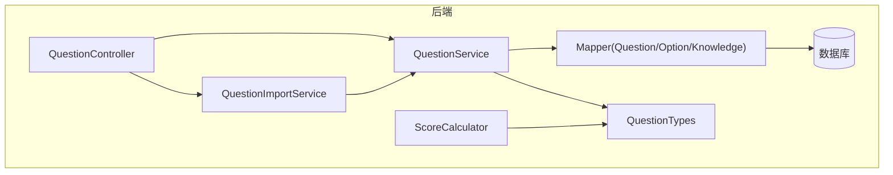
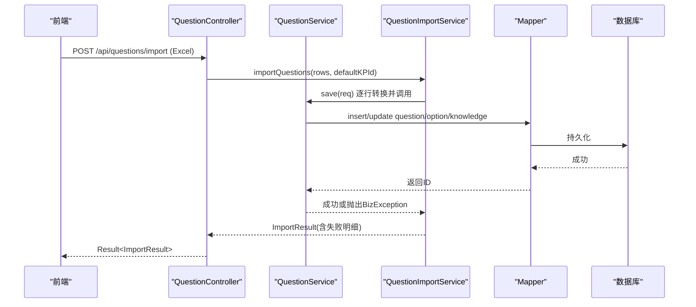
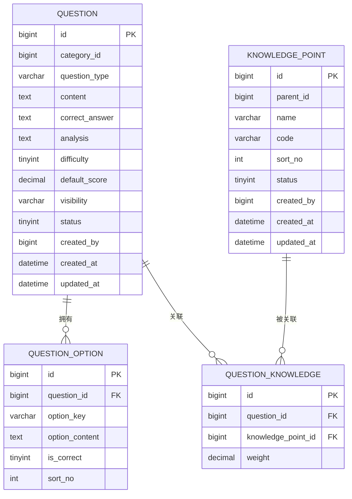
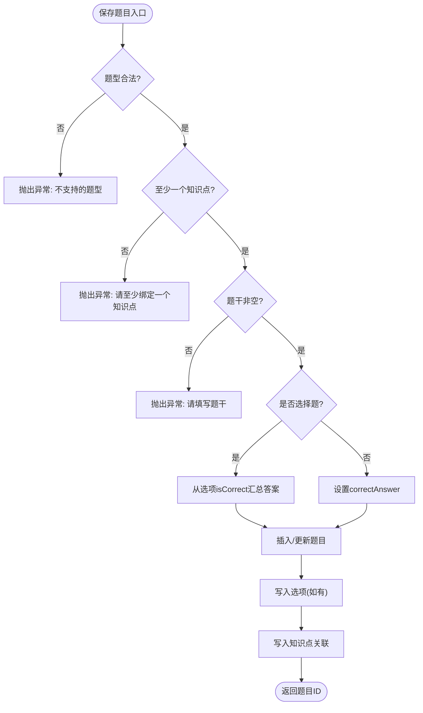
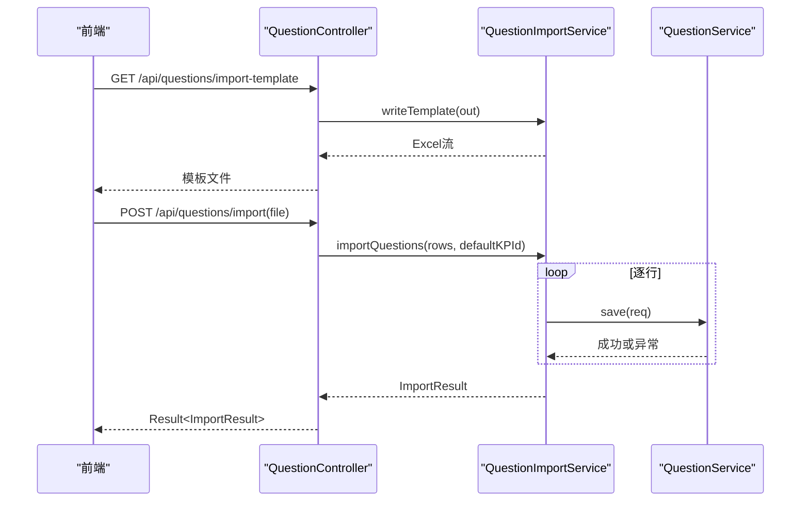
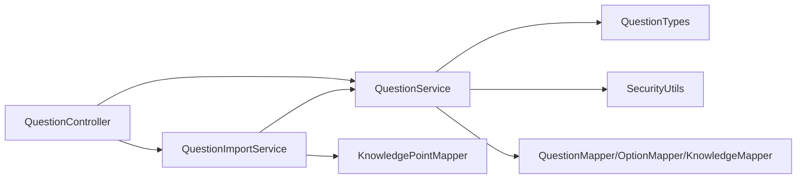

# 智能题库系统

<cite>
**本文引用的文件**
- [Question.java](file://exam-server/src/main/java/com/exam/entity/Question.java)
- [QuestionOption.java](file://exam-server/src/main/java/com/exam/entity/QuestionOption.java)
- [KnowledgePoint.java](file://exam-server/src/main/java/com/exam/entity/KnowledgePoint.java)
- [QuestionKnowledge.java](file://exam-server/src/main/java/com/exam/entity/QuestionKnowledge.java)
- [QuestionController.java](file://exam-server/src/main/java/com/exam/controller/QuestionController.java)
- [QuestionService.java](file://exam-server/src/main/java/com/exam/service/QuestionService.java)
- [QuestionImportService.java](file://exam-server/src/main/java/com/exam/service/QuestionImportService.java)
- [QuestionSaveRequest.java](file://exam-server/src/main/java/com/exam/dto/QuestionSaveRequest.java)
- [QuestionImportRow.java](file://exam-server/src/main/java/com/exam/dto/QuestionImportRow.java)
- [QuestionTypes.java](file://exam-server/src/main/java/com/exam/util/QuestionTypes.java)
- [ScoreCalculator.java](file://exam-server/src/main/java/com/exam/util/ScoreCalculator.java)
- [SecurityUtils.java](file://exam-server/src/main/java/com/exam/security/SecurityUtils.java)
- [PaperService.java](file://exam-server/src/main/java/com/exam/service/PaperService.java)
- [schema.sql](file://exam-server/src/main/resources/db/schema.sql)
</cite>

## 目录
1. [简介](#简介)
2. [项目结构](#项目结构)
3. [核心组件](#核心组件)
4. [架构总览](#架构总览)
5. [详细组件分析](#详细组件分析)
6. [依赖关系分析](#依赖关系分析)
7. [性能考虑](#性能考虑)
8. [故障排查指南](#故障排查指南)
9. [结论](#结论)
10. [附录](#附录)

## 简介
本仓库实现了一个“智能题库系统”，支持选择题（单选、多选、判断）、填空题、简答题与关键词解释题，提供知识点标签体系、题目批量导入导出、PDF练习卷导出、题目CRUD、选项管理、正确答案处理、难度分级与可见性控制。系统采用Spring Boot后端+Vue前端，默认使用H2数据库，可切换MySQL。

## 项目结构
- 后端位于 exam-server，按 controller/service/mapper/entity/dto/util 分层组织；题库相关能力集中在 QuestionController、QuestionService、QuestionImportService、QuestionTypes、ScoreCalculator 等模块。
- 数据模型以 MyBatis-Plus 实体映射到 MySQL/H2 表，建表脚本见 schema.sql。
- 前端位于 exam-web，提供教师端与学生端页面，调用后端REST接口完成出题、组卷、考试与阅卷等业务。

图表来源
- [QuestionController.java:31-118](file://exam-server/src/main/java/com/exam/controller/QuestionController.java#L31-L118)
- [QuestionService.java:33-225](file://exam-server/src/main/java/com/exam/service/QuestionService.java#L33-L225)
- [QuestionImportService.java:28-422](file://exam-server/src/main/java/com/exam/service/QuestionImportService.java#L28-L422)
- [QuestionTypes.java:1-123](file://exam-server/src/main/java/com/exam/util/QuestionTypes.java#L1-L123)
- [ScoreCalculator.java:1-55](file://exam-server/src/main/java/com/exam/util/ScoreCalculator.java#L1-L55)
- [schema.sql:52-87](file://exam-server/src/main/resources/db/schema.sql#L52-L87)

章节来源
- [README.md:1-82](file://README.md#L1-L82)
- [schema.sql:1-204](file://exam-server/src/main/resources/db/schema.sql#L1-L204)

## 核心组件
- 题目实体与选项：Question、QuestionOption，承载题干、题型、答案、难度、分值、可见性等。
- 知识点与关联：KnowledgePoint、QuestionKnowledge，支撑题目标签与学情统计。
- 控制器与服务：QuestionController暴露REST接口；QuestionService封装保存、分页、详情、删除等逻辑；QuestionImportService负责Excel导入与模板生成。
- 题型工具：QuestionTypes统一题型常量、校验、默认分值与中文标签。
- 评分工具：ScoreCalculator实现客观题自动匹配与填空多空比对。
- 权限与安全：SecurityUtils提供当前用户、管理员判断、学生身份校验。

章节来源
- [Question.java:11-29](file://exam-server/src/main/java/com/exam/entity/Question.java#L11-L29)
- [QuestionOption.java:8-19](file://exam-server/src/main/java/com/exam/entity/QuestionOption.java#L8-L19)
- [KnowledgePoint.java:10-24](file://exam-server/src/main/java/com/exam/entity/KnowledgePoint.java#L10-L24)
- [QuestionKnowledge.java:10-19](file://exam-server/src/main/java/com/exam/entity/QuestionKnowledge.java#L10-L19)
- [QuestionController.java:31-118](file://exam-server/src/main/java/com/exam/controller/QuestionController.java#L31-L118)
- [QuestionService.java:33-225](file://exam-server/src/main/java/com/exam/service/QuestionService.java#L33-L225)
- [QuestionImportService.java:28-422](file://exam-server/src/main/java/com/exam/service/QuestionImportService.java#L28-L422)
- [QuestionTypes.java:1-123](file://exam-server/src/main/java/com/exam/util/QuestionTypes.java#L1-L123)
- [ScoreCalculator.java:1-55](file://exam-server/src/main/java/com/exam/util/ScoreCalculator.java#L1-L55)
- [SecurityUtils.java:1-40](file://exam-server/src/main/java/com/exam/security/SecurityUtils.java#L1-L40)

## 架构总览
系统采用典型三层架构：
- 表现层：QuestionController提供题库增删改查、导入模板下载、Excel导入、PDF导出等接口。
- 业务层：QuestionService实现题目保存、分页查询、详情、删除、选项与知识点绑定；PaperService用于手动组卷。
- 数据层：MyBatis-Plus Mapper对接数据库；实体与表一一对应。

图表来源
- [QuestionController.java:60-75](file://exam-server/src/main/java/com/exam/controller/QuestionController.java#L60-L75)
- [QuestionImportService.java:41-63](file://exam-server/src/main/java/com/exam/service/QuestionImportService.java#L41-L63)
- [QuestionService.java:95-151](file://exam-server/src/main/java/com/exam/service/QuestionService.java#L95-L151)
- [schema.sql:52-87](file://exam-server/src/main/resources/db/schema.sql#L52-L87)

## 详细组件分析

### 题目数据结构与关系
- 题目主表 question：包含题型、题干、正确答案、解析、难度、默认分值、可见性、创建人、时间戳等。
- 选项表 question_option：存储选择题的A/B/C/D/E/F选项内容、是否正确、排序号。
- 知识点表 knowledge_point：树形结构，支持父子层级。
- 题目-知识点关联 question_knowledge：多对多，支持权重，用于学情统计。

图表来源
- [schema.sql:52-87](file://exam-server/src/main/resources/db/schema.sql#L52-L87)
- [schema.sql:31-42](file://exam-server/src/main/resources/db/schema.sql#L31-L42)

章节来源
- [Question.java:11-29](file://exam-server/src/main/java/com/exam/entity/Question.java#L11-L29)
- [QuestionOption.java:8-19](file://exam-server/src/main/java/com/exam/entity/QuestionOption.java#L8-L19)
- [KnowledgePoint.java:10-24](file://exam-server/src/main/java/com/exam/entity/KnowledgePoint.java#L10-L24)
- [QuestionKnowledge.java:10-19](file://exam-server/src/main/java/com/exam/entity/QuestionKnowledge.java#L10-L19)
- [schema.sql:52-87](file://exam-server/src/main/resources/db/schema.sql#L52-L87)

### 题目CRUD与业务规则
- 创建/更新：QuestionController接收QuestionSaveRequest，调用QuestionService.save进行校验与持久化。
- 业务规则：
  - 题型必须合法（QuestionTypes.isValid）。
  - 至少绑定一个知识点（knowledgePointIds非空）。
  - 题干必填。
  - 选择题：必须提供选项且至少有一个正确答案；正确答案由选项isCorrect汇总为逗号分隔字符串。
  - 非选择题：直接取correctAnswer。
  - 可见性默认公开；难度默认1；默认分值按题型默认。
- 删除：逻辑删除（status置0）。

图表来源
- [QuestionService.java:95-151](file://exam-server/src/main/java/com/exam/service/QuestionService.java#L95-L151)
- [QuestionTypes.java:98-100](file://exam-server/src/main/java/com/exam/util/QuestionTypes.java#L98-L100)

章节来源
- [QuestionController.java:93-108](file://exam-server/src/main/java/com/exam/controller/QuestionController.java#L93-L108)
- [QuestionService.java:95-151](file://exam-server/src/main/java/com/exam/service/QuestionService.java#L95-L151)
- [QuestionSaveRequest.java:8-31](file://exam-server/src/main/java/com/exam/dto/QuestionSaveRequest.java#L8-L31)

### 选项管理与正确答案处理
- 选择题：通过QuestionSaveRequest.OptionItem列表维护选项内容与顺序；保存时根据isCorrect=1的选项键拼接为正确答案字符串。
- 判断题：自动补全A=正确、B=错误两个选项；答案需为A或B。
- 填空题：正确答案可为多个空位，用|分隔；答题时按空位逐一比较。
- 主观题（简答/关键词解释）：不自动评分，走人工阅卷流程。

章节来源
- [QuestionService.java:161-178](file://exam-server/src/main/java/com/exam/service/QuestionService.java#L161-L178)
- [QuestionImportService.java:102-138](file://exam-server/src/main/java/com/exam/service/QuestionImportService.java#L102-L138)
- [ScoreCalculator.java:20-44](file://exam-server/src/main/java/com/exam/util/ScoreCalculator.java#L20-L44)

### 知识点标签体系
- 支持树形知识点，导入时可通过名称或路径（如“云计算基础/IaaS”）解析到具体节点。
- 若未填写知识点且未提供默认知识点，则导入失败。
- 题目保存时会建立question_knowledge关联，并记录权重（默认1），用于学情统计。

章节来源
- [QuestionImportService.java:193-271](file://exam-server/src/main/java/com/exam/service/QuestionImportService.java#L193-L271)
- [QuestionService.java:143-149](file://exam-server/src/main/java/com/exam/service/QuestionService.java#L143-L149)
- [KnowledgePoint.java:10-24](file://exam-server/src/main/java/com/exam/entity/KnowledgePoint.java#L10-L24)

### 题目查重机制
- 当前代码未实现基于题干或内容的重复检测；如需查重可在QuestionService.save中增加题干相似度或哈希去重逻辑。
- 建议方案：在保存前计算题干文本指纹（如规范化后MD5），与同题型/同分类题目比对，命中则提示重复或合并。

[本节为扩展建议，无直接源码引用]

### 批量导入与导出
- 导入：
  - 提供模板下载（含示例与说明）。
  - Excel逐行解析，类型识别支持中英文别名。
  - 每行独立事务边界，单行失败不影响其他行，返回ImportResult包含失败明细。
  - 限制单次导入行数上限，避免大文件拖垮解析与事务。
- 导出：
  - 支持选中题目导出为PDF练习卷（QuestionPdfService）。
  - 文件名中文兼容，设置响应头供前端下载。

图表来源
- [QuestionController.java:52-75](file://exam-server/src/main/java/com/exam/controller/QuestionController.java#L52-L75)
- [QuestionImportService.java:41-63](file://exam-server/src/main/java/com/exam/service/QuestionImportService.java#L41-L63)
- [QuestionImportService.java:326-342](file://exam-server/src/main/java/com/exam/service/QuestionImportService.java#L326-L342)

章节来源
- [QuestionController.java:52-86](file://exam-server/src/main/java/com/exam/controller/QuestionController.java#L52-L86)
- [QuestionImportService.java:41-63](file://exam-server/src/main/java/com/exam/service/QuestionImportService.java#L41-L63)
- [QuestionImportService.java:326-398](file://exam-server/src/main/java/com/exam/service/QuestionImportService.java#L326-L398)

### 难度分级与可见性控制
- 难度：1-3整数，默认1；导入时严格校验范围。
- 可见性：PUBLIC/PRIVATE，默认公开；非管理员查询时仅返回公开或本人创建的题目。

章节来源
- [QuestionImportService.java:275-318](file://exam-server/src/main/java/com/exam/service/QuestionImportService.java#L275-L318)
- [QuestionService.java:42-69](file://exam-server/src/main/java/com/exam/service/QuestionService.java#L42-L69)
- [SecurityUtils.java:27-30](file://exam-server/src/main/java/com/exam/security/SecurityUtils.java#L27-L30)

### 权限控制
- 管理员：可访问所有题目；普通用户仅能查看公开或自己创建的题目。
- 组卷：非管理员只能操作自己创建的试卷。
- 学生：通过requireStudentId校验考生身份。

章节来源
- [QuestionService.java:42-69](file://exam-server/src/main/java/com/exam/service/QuestionService.java#L42-L69)
- [PaperService.java:39-50](file://exam-server/src/main/java/com/exam/service/PaperService.java#L39-L50)
- [SecurityUtils.java:19-38](file://exam-server/src/main/java/com/exam/security/SecurityUtils.java#L19-L38)

### 自动评分与主观题处理
- 客观题：
  - 单选/判断：忽略大小写全等。
  - 多选：选项排序后比较。
  - 填空：按|分割的空位逐一比较。
- 主观题：标记为需要人工阅卷，不参与自动评分。

章节来源
- [ScoreCalculator.java:15-44](file://exam-server/src/main/java/com/exam/util/ScoreCalculator.java#L15-L44)
- [QuestionTypes.java:88-91](file://exam-server/src/main/java/com/exam/util/QuestionTypes.java#L88-L91)

### 扩展新题型与自定义评分规则
- 新增题型步骤：
  1. 在QuestionTypes中添加常量与label/fromLabel映射。
  2. 在defaultScore中补充默认分值。
  3. 在QuestionService.fillCorrectAnswer中补充该题型的正确答案生成逻辑。
  4. 在ScoreCalculator.match中补充自动匹配逻辑（如适用）。
  5. 在QuestionImportService.toRequest中补充导入列解析与校验。
- 自定义评分规则：
  - 在ScoreCalculator中扩展match分支，或在阅卷服务中实现主观题评分策略。

章节来源
- [QuestionTypes.java:27-100](file://exam-server/src/main/java/com/exam/util/QuestionTypes.java#L27-L100)
- [QuestionService.java:161-178](file://exam-server/src/main/java/com/exam/service/QuestionService.java#L161-L178)
- [ScoreCalculator.java:20-44](file://exam-server/src/main/java/com/exam/util/ScoreCalculator.java#L20-L44)
- [QuestionImportService.java:65-98](file://exam-server/src/main/java/com/exam/service/QuestionImportService.java#L65-L98)

## 依赖关系分析
- Controller依赖Service与导入/导出服务。
- Service依赖Mapper与工具类（QuestionTypes、SecurityUtils）。
- 导入服务依赖QuestionService与KnowledgePointMapper。
- 评分工具依赖QuestionTypes。

图表来源
- [QuestionController.java:31-118](file://exam-server/src/main/java/com/exam/controller/QuestionController.java#L31-L118)
- [QuestionService.java:33-225](file://exam-server/src/main/java/com/exam/service/QuestionService.java#L33-L225)
- [QuestionImportService.java:28-422](file://exam-server/src/main/java/com/exam/service/QuestionImportService.java#L28-L422)
- [QuestionTypes.java:1-123](file://exam-server/src/main/java/com/exam/util/QuestionTypes.java#L1-L123)
- [SecurityUtils.java:1-40](file://exam-server/src/main/java/com/exam/security/SecurityUtils.java#L1-L40)

章节来源
- [QuestionController.java:31-118](file://exam-server/src/main/java/com/exam/controller/QuestionController.java#L31-L118)
- [QuestionService.java:33-225](file://exam-server/src/main/java/com/exam/service/QuestionService.java#L33-L225)
- [QuestionImportService.java:28-422](file://exam-server/src/main/java/com/exam/service/QuestionImportService.java#L28-L422)

## 性能考虑
- 导入限流：单次导入最大行数限制，避免大文件导致内存与事务压力。
- 分页查询：题目列表使用分页，减少数据传输量。
- 视图组装：详情VO按需加载选项与知识点名称，避免N+1查询（当前实现为分批查询）。
- 索引优化：数据库已对常用字段建立索引（如category_id、question_type、knowledge_point_id等）。
- PDF导出：按选中题目批量拉取，注意题目数量过大时的内存占用。

[本节为通用优化建议，结合现有实现总结]

## 故障排查指南
- 导入失败：
  - 检查题型是否识别（fromLabel）、题干是否为空、知识点是否存在或歧义、正确答案格式是否符合要求。
  - 关注ImportResult中的errors，定位具体行号与错误信息。
- 保存失败：
  - 确认题型合法、至少一个知识点、题干非空、选择题选项与答案完整。
- 权限问题：
  - 非管理员无法看到私有题目；组卷时仅能操作自己创建的试卷。
- 评分异常：
  - 填空题空位数不一致将判错；多选题需排序一致；主观题需人工阅卷。

章节来源
- [QuestionImportService.java:41-63](file://exam-server/src/main/java/com/exam/service/QuestionImportService.java#L41-L63)
- [QuestionService.java:95-151](file://exam-server/src/main/java/com/exam/service/QuestionService.java#L95-L151)
- [PaperService.java:79-94](file://exam-server/src/main/java/com/exam/service/PaperService.java#L79-L94)
- [ScoreCalculator.java:20-44](file://exam-server/src/main/java/com/exam/util/ScoreCalculator.java#L20-L44)

## 结论
该系统提供了完整的题库管理能力，覆盖多题型、知识点标签、批量导入导出、PDF练习卷导出、权限控制与自动评分。通过QuestionTypes与ScoreCalculator的解耦设计，便于扩展新题型与评分规则。建议在后续版本中加入题目查重、更细粒度的权限控制与更完善的导入校验提示。

## 附录
- 接口示例路径参考：
  - 题目分页：GET /api/questions?page=1&size=10&type=SINGLE&categoryId=...&knowledgePointId=...&keyword=...
  - 题目详情：GET /api/questions/{id}
  - 创建/更新：POST/PUT /api/questions
  - 删除：DELETE /api/questions/{id}
  - 导入模板：GET /api/questions/import-template
  - 批量导入：POST /api/questions/import
  - 导出PDF：POST /api/questions/export-pdf

章节来源
- [QuestionController.java:42-86](file://exam-server/src/main/java/com/exam/controller/QuestionController.java#L42-L86)