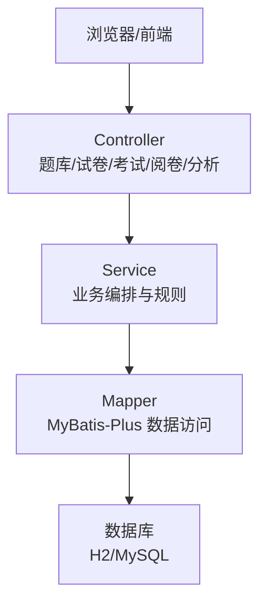
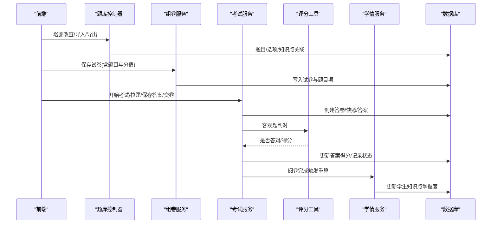
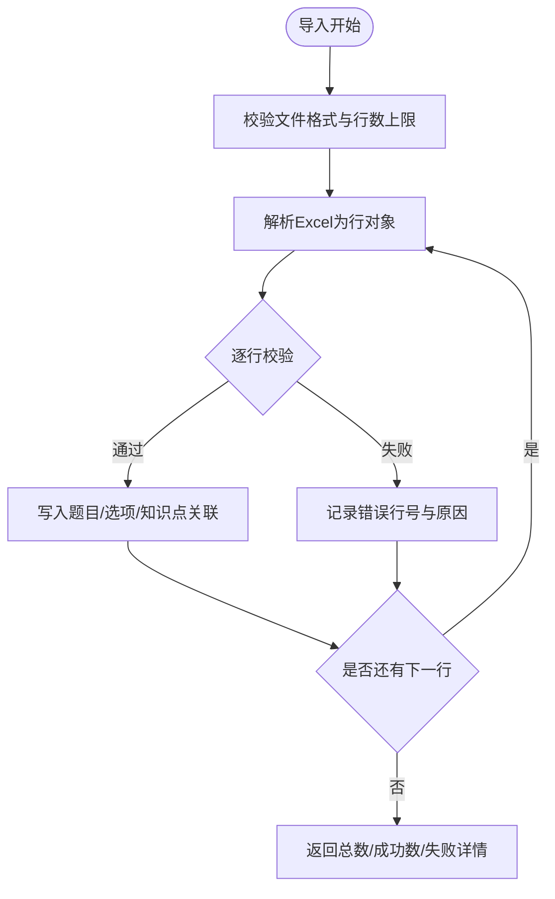
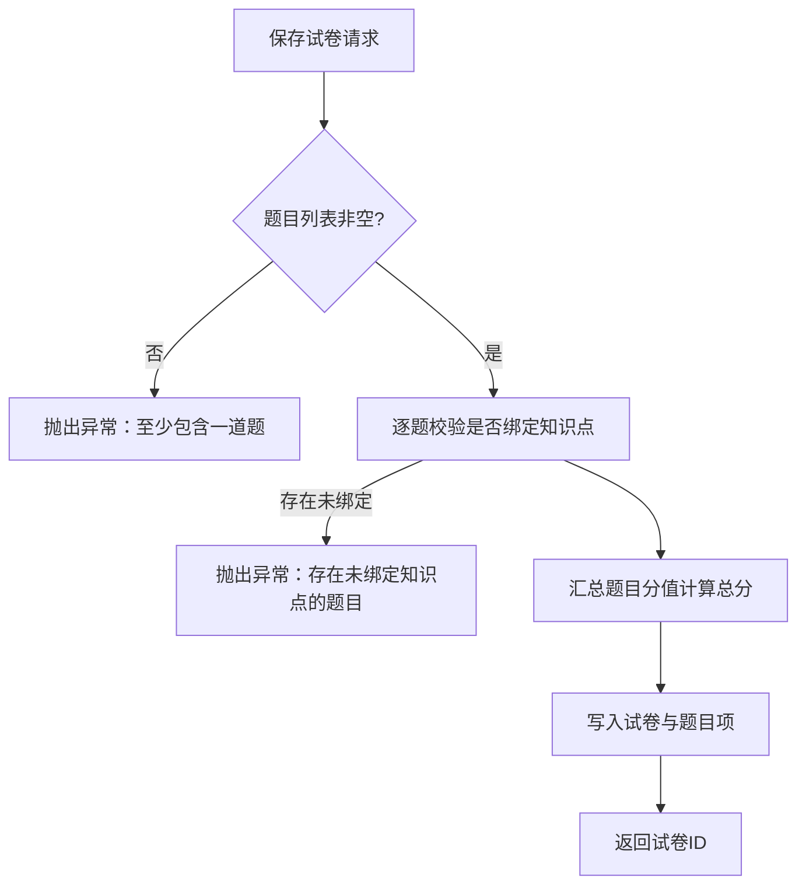
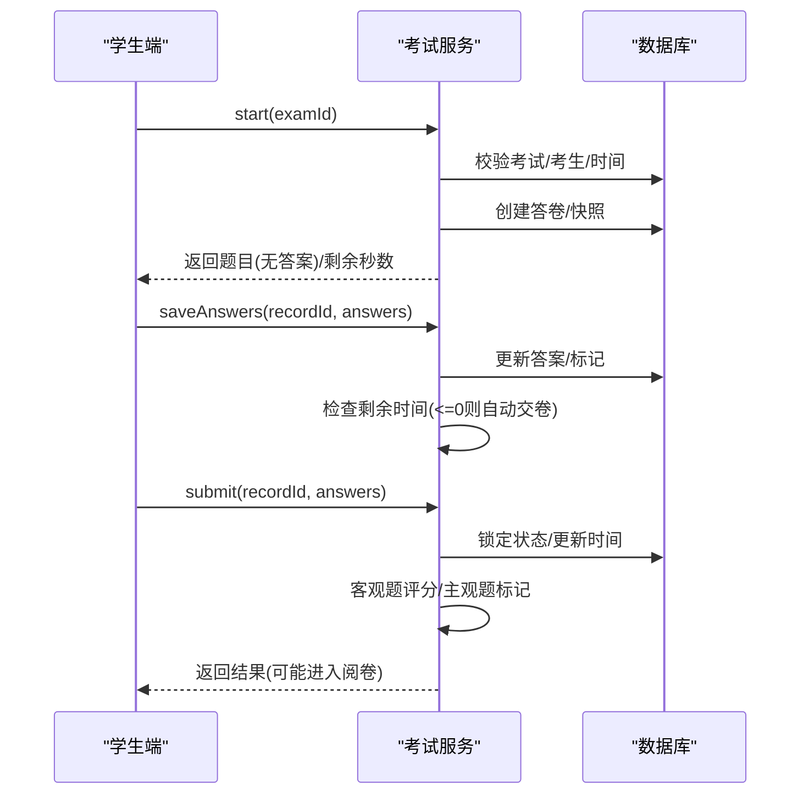
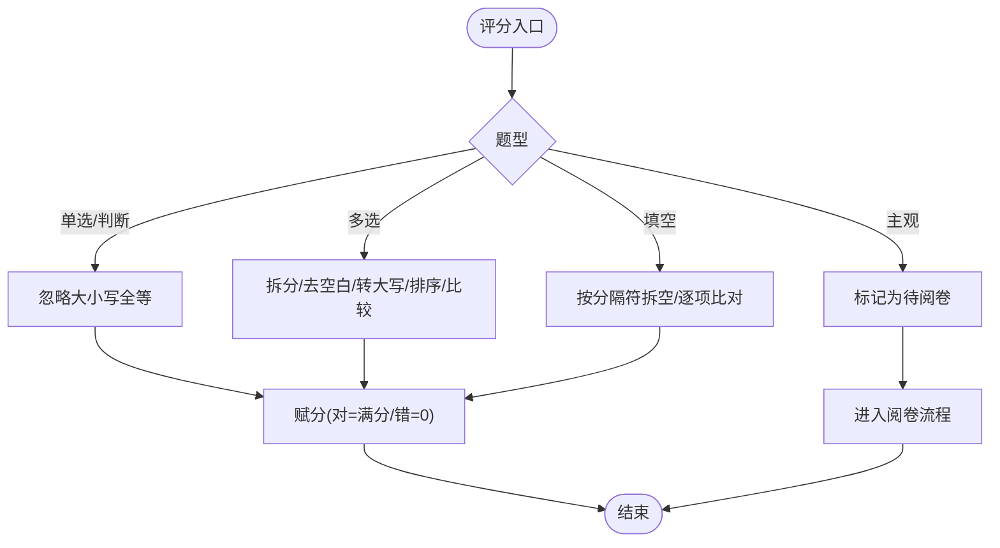
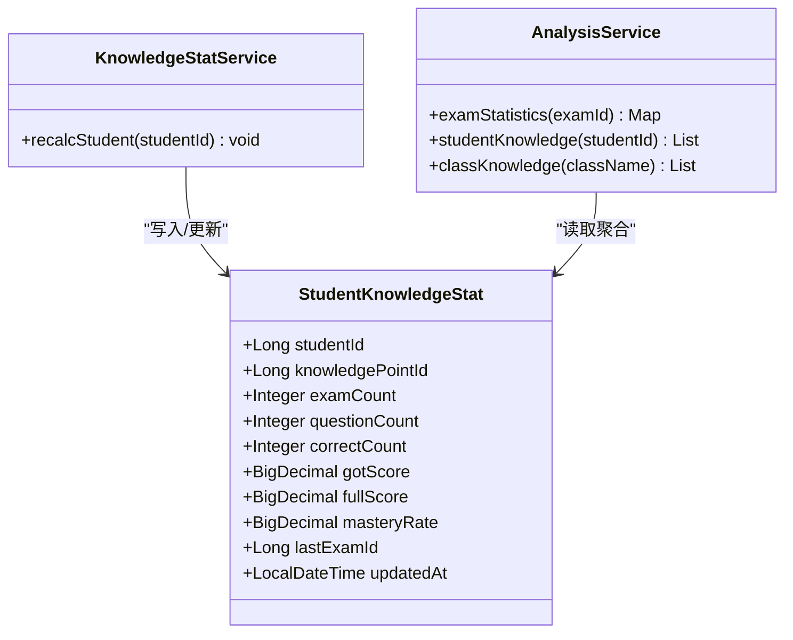
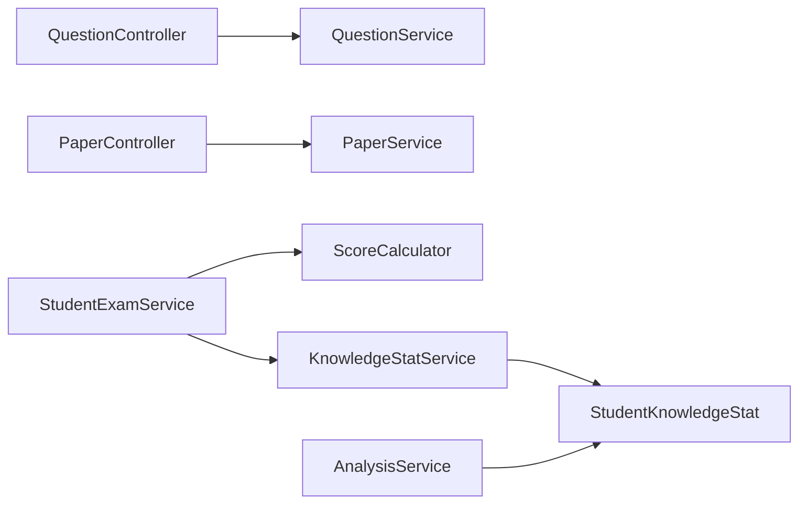

# 核心功能

<cite>
**本文引用的文件**
- [ExamApplication.java](file://exam-server/src/main/java/com/exam/ExamApplication.java)
- [Question.java](file://exam-server/src/main/java/com/exam/entity/Question.java)
- [KnowledgePoint.java](file://exam-server/src/main/java/com/exam/entity/KnowledgePoint.java)
- [ExamPaper.java](file://exam-server/src/main/java/com/exam/entity/ExamPaper.java)
- [ExamRecord.java](file://exam-server/src/main/java/com/exam/entity/ExamRecord.java)
- [StudentKnowledgeStat.java](file://exam-server/src/main/java/com/exam/entity/StudentKnowledgeStat.java)
- [PaperService.java](file://exam-server/src/main/java/com/exam/service/PaperService.java)
- [StudentExamService.java](file://exam-server/src/main/java/com/exam/service/StudentExamService.java)
- [ScoreCalculator.java](file://exam-server/src/main/java/com/exam/util/ScoreCalculator.java)
- [KnowledgeStatService.java](file://exam-server/src/main/java/com/exam/service/KnowledgeStatService.java)
- [AnalysisService.java](file://exam-server/src/main/java/com/exam/service/AnalysisService.java)
- [QuestionController.java](file://exam-server/src/main/java/com/exam/controller/QuestionController.java)
- [PaperController.java](file://exam-server/src/main/java/com/exam/controller/PaperController.java)
- [README.md](file://README.md)
- [考试系统-方案.md](file://考试系统-方案.md)
</cite>

## 目录
1. [引言](#引言)
2. [项目结构](#项目结构)
3. [核心组件](#核心组件)
4. [架构总览](#架构总览)
5. [详细组件分析](#详细组件分析)
6. [依赖关系分析](#依赖关系分析)
7. [性能考量](#性能考量)
8. [故障排查指南](#故障排查指南)
9. [结论](#结论)
10. [附录：扩展开发指南](#附录：扩展开发指南)

## 引言
本文件聚焦教学考试平台的核心业务与实现细节，覆盖智能题库、灵活组卷、在线考试引擎、智能评分与学情分析五大能力。文档以代码为依据，给出业务流程图、关键算法说明与扩展建议，帮助读者快速理解并二次开发。

## 项目结构
后端采用 Spring Boot 单体架构，按职责分层组织：
- 启动入口：扫描 Mapper、加载配置
- Controller：对外 HTTP 接口（题库、试卷、考试、阅卷、成绩、分析）
- Service：核心业务（组卷、答题流程、评分、阅卷、学情统计）
- Entity/Mapper：数据模型与持久化
- Util/Common/Security：工具、统一返回、安全认证

图表来源
- [ExamApplication.java:1-17](file://exam-server/src/main/java/com/exam/ExamApplication.java#L1-L17)
- [QuestionController.java:31-118](file://exam-server/src/main/java/com/exam/controller/QuestionController.java#L31-L118)
- [PaperController.java:21-63](file://exam-server/src/main/java/com/exam/controller/PaperController.java#L21-L63)

章节来源
- [ExamApplication.java:1-17](file://exam-server/src/main/java/com/exam/ExamApplication.java#L1-L17)
- [README.md:1-82](file://README.md#L1-L82)

## 核心组件
- 智能题库系统：多题型支持（单选/多选/判断/填空/简答/关键词解释），知识点标签绑定，题目可见范围控制；支持 Excel 批量导入与 PDF 导出练习卷。
- 灵活组卷机制：手动组卷，校验题目必须绑定知识点；可设置每题分值与总分、及格分。
- 在线考试引擎：开始考试创建答卷与题目快照，自动保存答案，服务端计时与到点自动交卷，防重复提交。
- 智能评分系统：客观题自动评分（含多选题排序比较、填空题多空匹配），主观题进入人工阅卷流程。
- 学情分析系统：基于答题明细与知识点权重，计算学生个人掌握度、班级薄弱点、单场考试统计。

章节来源
- [QuestionController.java:31-118](file://exam-server/src/main/java/com/exam/controller/QuestionController.java#L31-L118)
- [PaperService.java:30-161](file://exam-server/src/main/java/com/exam/service/PaperService.java#L30-L161)
- [StudentExamService.java:38-458](file://exam-server/src/main/java/com/exam/service/StudentExamService.java#L38-L458)
- [ScoreCalculator.java:1-55](file://exam-server/src/main/java/com/exam/util/ScoreCalculator.java#L1-L55)
- [KnowledgeStatService.java:25-110](file://exam-server/src/main/java/com/exam/service/KnowledgeStatService.java#L25-L110)
- [AnalysisService.java:33-258](file://exam-server/src/main/java/com/exam/service/AnalysisService.java#L33-L258)

## 架构总览
系统围绕“知识点—题目—试卷—考试—答卷—学情”的主线展开，数据流从 Controller 到 Service 再到 Mapper，最终落库；学情在阅卷完成后由服务回写。

图表来源
- [QuestionController.java:31-118](file://exam-server/src/main/java/com/exam/controller/QuestionController.java#L31-L118)
- [PaperService.java:30-161](file://exam-server/src/main/java/com/exam/service/PaperService.java#L30-L161)
- [StudentExamService.java:38-458](file://exam-server/src/main/java/com/exam/service/StudentExamService.java#L38-L458)
- [ScoreCalculator.java:1-55](file://exam-server/src/main/java/com/exam/util/ScoreCalculator.java#L1-L55)
- [KnowledgeStatService.java:25-110](file://exam-server/src/main/java/com/exam/service/KnowledgeStatService.java#L25-L110)

## 详细组件分析

### 智能题库系统
- 多题型支持：单选题、多选题、判断题、填空题、简答题、关键词解释题；题型定义集中在工具类与前端枚举中。
- 知识点标签：题目与知识点多对多关联，支持权重分配，用于组卷筛选与学情聚合。
- 题目查重与可见范围：通过可见范围区分公共/私有题库；题目逻辑删除保证历史试卷不受影响。
- 批量导入与导出：Excel 模板导入逐行校验，失败原因逐行返回；PDF 导出按题型分组编号，可选附带答案解析。

图表来源
- [QuestionController.java:52-75](file://exam-server/src/main/java/com/exam/controller/QuestionController.java#L52-L75)

章节来源
- [QuestionController.java:31-118](file://exam-server/src/main/java/com/exam/controller/QuestionController.java#L31-L118)
- [Question.java:11-29](file://exam-server/src/main/java/com/exam/entity/Question.java#L11-L29)
- [KnowledgePoint.java:10-24](file://exam-server/src/main/java/com/exam/entity/KnowledgePoint.java#L10-L24)
- [考试系统-方案.md:749-800](file://考试系统-方案.md#L749-L800)

### 灵活组卷机制
- 手动组卷：教师选择题目并设置每题分值，系统校验每道题已绑定知识点，否则拒绝组卷。
- 总分与及格分：自动汇总题目分值，默认及格分为总分的 60%。
- 复用性：试卷作为内容组合被多场考试复用，发布后不建议直接修改原试卷。

图表来源
- [PaperService.java:79-127](file://exam-server/src/main/java/com/exam/service/PaperService.java#L79-L127)

章节来源
- [PaperService.java:30-161](file://exam-server/src/main/java/com/exam/service/PaperService.java#L30-L161)
- [PaperController.java:21-63](file://exam-server/src/main/java/com/exam/controller/PaperController.java#L21-L63)

### 在线考试引擎
- 开始考试：校验考试状态与考生名单，创建答卷与题目快照，返回不含正确答案的题目列表与剩余时间。
- 自动保存：定时或切题时保存答案，若时间到则自动交卷。
- 交卷流程：锁状态防重复提交，先保存答案再评分；有主观题进入阅卷，否则直接完成。

图表来源
- [StudentExamService.java:94-194](file://exam-server/src/main/java/com/exam/service/StudentExamService.java#L94-L194)

章节来源
- [StudentExamService.java:38-458](file://exam-server/src/main/java/com/exam/service/StudentExamService.java#L38-L458)

### 智能评分系统
- 客观题自动评分：
  - 单选/判断：忽略大小写全等匹配
  - 多选：选项拆分、去空白、转大写、排序后比较
  - 填空：多空用分隔符分割，逐项比对
- 主观题人工阅卷：简答题与关键词解释题进入阅卷中心，教师给分后汇总总分与是否及格。

图表来源
- [ScoreCalculator.java:1-55](file://exam-server/src/main/java/com/exam/util/ScoreCalculator.java#L1-L55)
- [StudentExamService.java:258-298](file://exam-server/src/main/java/com/exam/service/StudentExamService.java#L258-L298)

章节来源
- [ScoreCalculator.java:1-55](file://exam-server/src/main/java/com/exam/util/ScoreCalculator.java#L1-L55)
- [StudentExamService.java:258-298](file://exam-server/src/main/java/com/exam/service/StudentExamService.java#L258-L298)

### 学情分析系统
- 个人掌握度：基于已完成答卷的每题得分与题目-知识点权重，按知识点累加实得/满分，计算掌握度百分比。
- 班级薄弱点：聚合班级内学生知识点掌握度，排序展示薄弱知识点。
- 单场考试统计：参考人数、缺考、平均分、及格率、知识点正确率。

图表来源
- [StudentKnowledgeStat.java:11-27](file://exam-server/src/main/java/com/exam/entity/StudentKnowledgeStat.java#L11-L27)
- [KnowledgeStatService.java:25-110](file://exam-server/src/main/java/com/exam/service/KnowledgeStatService.java#L25-L110)
- [AnalysisService.java:33-258](file://exam-server/src/main/java/com/exam/service/AnalysisService.java#L33-L258)

章节来源
- [KnowledgeStatService.java:25-110](file://exam-server/src/main/java/com/exam/service/KnowledgeStatService.java#L25-L110)
- [AnalysisService.java:33-258](file://exam-server/src/main/java/com/exam/service/AnalysisService.java#L33-L258)

## 依赖关系分析
- 控制器依赖服务：题库与试卷控制器分别依赖 QuestionService/PaperService。
- 服务间协作：考试服务依赖评分工具与学情服务；阅卷完成后触发学情重算。
- 数据模型耦合：题目与知识点多对多关联；试卷与题目项一对多；答卷与答案一对多。

图表来源
- [QuestionController.java:31-118](file://exam-server/src/main/java/com/exam/controller/QuestionController.java#L31-L118)
- [PaperController.java:21-63](file://exam-server/src/main/java/com/exam/controller/PaperController.java#L21-L63)
- [StudentExamService.java:38-458](file://exam-server/src/main/java/com/exam/service/StudentExamService.java#L38-L458)
- [ScoreCalculator.java:1-55](file://exam-server/src/main/java/com/exam/util/ScoreCalculator.java#L1-L55)
- [KnowledgeStatService.java:25-110](file://exam-server/src/main/java/com/exam/service/KnowledgeStatService.java#L25-L110)
- [AnalysisService.java:33-258](file://exam-server/src/main/java/com/exam/service/AnalysisService.java#L33-L258)

章节来源
- [QuestionController.java:31-118](file://exam-server/src/main/java/com/exam/controller/QuestionController.java#L31-L118)
- [PaperController.java:21-63](file://exam-server/src/main/java/com/exam/controller/PaperController.java#L21-L63)
- [StudentExamService.java:38-458](file://exam-server/src/main/java/com/exam/service/StudentExamService.java#L38-L458)
- [KnowledgeStatService.java:25-110](file://exam-server/src/main/java/com/exam/service/KnowledgeStatService.java#L25-L110)
- [AnalysisService.java:33-258](file://exam-server/src/main/java/com/exam/service/AnalysisService.java#L33-L258)

## 性能考量
- 避免 N+1 查询：成绩列表与分析聚合建议使用批量查询与预加载。
- 分页与限制：导入限制最大行数，防止大文件拖垮解析与事务。
- 增量更新：学情统计可按需增量更新，减少全量重建开销。
- 资源释放：前端图表实例需在页面卸载时销毁，避免内存泄漏。

[本节提供通用优化建议，不直接分析具体文件]

## 故障排查指南
- 常见业务异常：
  - 考试不存在/已结束/尚未开始：检查考试时间与状态
  - 不在考试名单/已交卷：核对考生分配与答卷状态
  - 请勿重复交卷：使用状态锁与唯一约束保障
- 评分问题：
  - 多选题顺序不一致导致判错：确保选项规范化比较
  - 填空题多空数量不一致：检查标准答案格式
- 学情不更新：
  - 确认答卷状态为 FINISHED 且触发了重算逻辑
  - 检查题目是否绑定知识点及权重是否正确

章节来源
- [StudentExamService.java:94-194](file://exam-server/src/main/java/com/exam/service/StudentExamService.java#L94-L194)
- [ScoreCalculator.java:1-55](file://exam-server/src/main/java/com/exam/util/ScoreCalculator.java#L1-L55)
- [KnowledgeStatService.java:25-110](file://exam-server/src/main/java/com/exam/service/KnowledgeStatService.java#L25-L110)

## 结论
该平台以知识点为核心，贯穿题库、组卷、考试、评分与学情分析，形成闭环的教学评估体系。通过严格的权限与安全设计、稳定的答题流程与准确的学情统计，满足教师出题组卷、学生在线考试与数据分析的核心需求。后续可扩展随机抽题、防作弊抓拍、AI 辅助阅卷等能力。

## 附录：扩展开发指南
- 新增题型：
  - 在后端工具类与前端枚举中注册新题型编码与默认分值
  - 在评分器中补充匹配逻辑，主观题走阅卷流程
- 随机抽题与难度平衡：
  - 在组卷服务中增加按知识点/难度/题型的随机抽取策略
  - 维护题目难度等级，组卷时进行难度分布校验
- 防作弊增强：
  - 前端监听页面切换与失焦事件，记录告警日志
  - 后端增加切屏次数阈值与警告提示
- 性能优化：
  - 引入缓存层（如 Redis）缓存热点数据（知识点树、题目选项）
  - 异步处理学情统计与 PDF 导出，提升响应速度

[本节为概念性指导，不直接分析具体文件]