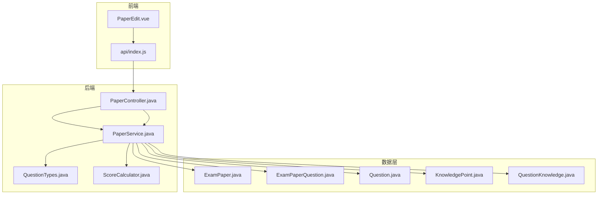
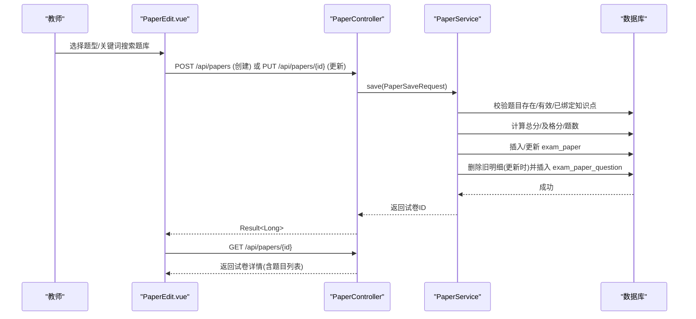
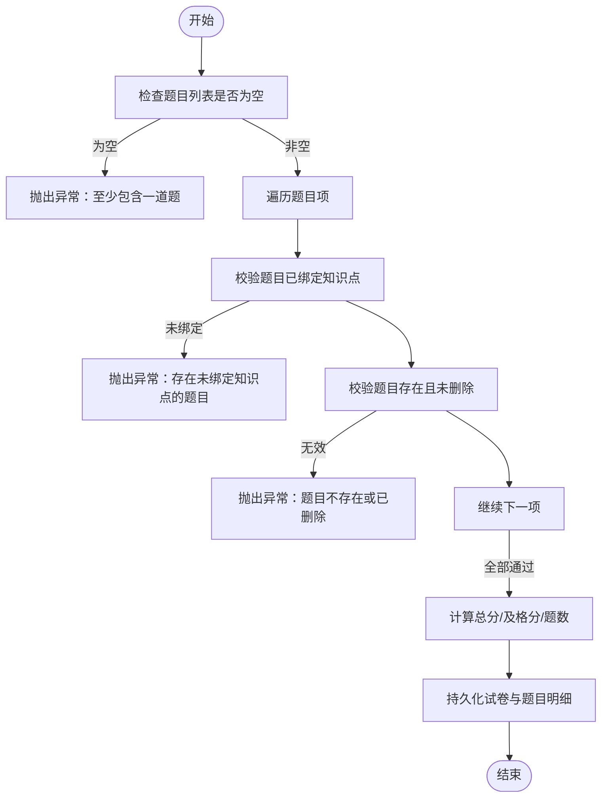
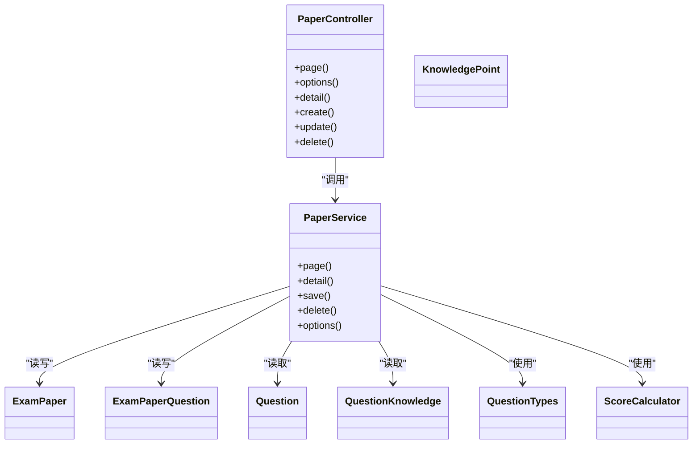

# 灵活组卷机制

<cite>
**本文引用的文件**
- [PaperService.java](file://exam-server/src/main/java/com/exam/service/PaperService.java)
- [PaperController.java](file://exam-server/src/main/java/com/exam/controller/PaperController.java)
- [ExamPaper.java](file://exam-server/src/main/java/com/exam/entity/ExamPaper.java)
- [ExamPaperQuestion.java](file://exam-server/src/main/java/com/exam/entity/ExamPaperQuestion.java)
- [PaperSaveRequest.java](file://exam-server/src/main/java/com/exam/dto/PaperSaveRequest.java)
- [Question.java](file://exam-server/src/main/java/com/exam/entity/Question.java)
- [KnowledgePoint.java](file://exam-server/src/main/java/com/exam/entity/KnowledgePoint.java)
- [QuestionKnowledge.java](file://exam-server/src/main/java/com/exam/entity/QuestionKnowledge.java)
- [ScoreCalculator.java](file://exam-server/src/main/java/com/exam/util/ScoreCalculator.java)
- [QuestionTypes.java](file://exam-server/src/main/java/com/exam/util/QuestionTypes.java)
- [PaperEdit.vue](file://exam-web/src/views/admin/PaperEdit.vue)
- [index.js](file://exam-web/src/api/index.js)
- [schema-mysql.sql](file://sql/schema-mysql.sql)
- [DataInitializer.java](file://exam-server/src/main/java/com/exam/config/DataInitializer.java)
</cite>

## 目录
1. [简介](#简介)
2. [项目结构](#项目结构)
3. [核心组件](#核心组件)
4. [架构总览](#架构总览)
5. [详细组件分析](#详细组件分析)
6. [依赖关系分析](#依赖关系分析)
7. [性能考量](#性能考量)
8. [故障排查指南](#故障排查指南)
9. [结论](#结论)
10. [附录](#附录)

## 简介
本文件围绕“灵活组卷机制”展开，聚焦手动组卷模式与随机抽题算法的扩展设计。当前系统已实现“手动组卷”：教师通过前端页面从题库勾选题目、设置每题分值与顺序，后端校验并持久化试卷及题目明细；同时提供知识点绑定约束、重复检测、总分计算等能力。文档将在此基础上，给出随机抽题算法的设计方案（知识点覆盖控制、难度平衡、分数目标达成、去重策略），并提供可落地的配置示例与多条件抽题场景的处理方法。

## 项目结构
- 后端采用 Spring Boot + MyBatis Plus，核心领域包括：试卷（ExamPaper）、试卷题目（ExamPaperQuestion）、题目（Question）、知识点（KnowledgePoint）、题目-知识点关联（QuestionKnowledge）。
- 前端为 Vue 3 管理端，提供“试卷编辑”界面，支持按题型/关键词检索题库、加入试卷、预览与保存。
- 数据库脚本定义关键表结构与索引，保障查询与一致性。

图表来源
- [PaperController.java:21-63](file://exam-server/src/main/java/com/exam/controller/PaperController.java#L21-L63)
- [PaperService.java:30-161](file://exam-server/src/main/java/com/exam/service/PaperService.java#L30-L161)
- [PaperEdit.vue:23-97](file://exam-web/src/views/admin/PaperEdit.vue#L23-L97)
- [index.js:53-57](file://exam-web/src/api/index.js#L53-L57)

章节来源
- [PaperController.java:21-63](file://exam-server/src/main/java/com/exam/controller/PaperController.java#L21-L63)
- [PaperService.java:30-161](file://exam-server/src/main/java/com/exam/service/PaperService.java#L30-L161)
- [PaperEdit.vue:23-97](file://exam-web/src/views/admin/PaperEdit.vue#L23-L97)
- [index.js:53-57](file://exam-web/src/api/index.js#L53-L57)

## 核心组件
- 试卷实体 ExamPaper：承载试卷名、总分、及格分、题数、状态等元信息。
- 试卷题目 ExamPaperQuestion：记录试卷中每道题及其分值、排序号。
- 题目 Question：题干、题型、默认分值、难度、可见性等。
- 知识点 KnowledgePoint：树形知识点体系。
- 题目-知识点关联 QuestionKnowledge：题目与知识点的多对多关系，含权重字段用于学情统计。
- 评分工具 ScoreCalculator：客观题匹配逻辑（单选/多选/判断/填空），主观题走人工阅卷。
- 题型工具 QuestionTypes：题型常量、标签、默认分值、是否主观题等统一规则。

章节来源
- [ExamPaper.java:11-25](file://exam-server/src/main/java/com/exam/entity/ExamPaper.java#L11-L25)
- [ExamPaperQuestion.java:10-20](file://exam-server/src/main/java/com/exam/entity/ExamPaperQuestion.java#L10-L20)
- [Question.java:11-29](file://exam-server/src/main/java/com/exam/entity/Question.java#L11-L29)
- [KnowledgePoint.java:10-24](file://exam-server/src/main/java/com/exam/entity/KnowledgePoint.java#L10-L24)
- [QuestionKnowledge.java:10-19](file://exam-server/src/main/java/com/exam/entity/QuestionKnowledge.java#L10-L19)
- [ScoreCalculator.java:11-55](file://exam-server/src/main/java/com/exam/util/ScoreCalculator.java#L11-L55)
- [QuestionTypes.java:12-123](file://exam-server/src/main/java/com/exam/util/QuestionTypes.java#L12-L123)

## 架构总览
手动组卷端到端流程：
- 教师在 PaperEdit.vue 中筛选题库、加入试卷、调整分值与顺序，调用 savePaper 接口。
- 后端 PaperController 接收请求，委托 PaperService.save 进行校验与持久化。
- PaperService 校验题目有效性、知识点绑定、计算总分与及格分，写入 exam_paper 与 exam_paper_question。
- 前端可获取试卷详情进行预览。

图表来源
- [PaperController.java:45-55](file://exam-server/src/main/java/com/exam/controller/PaperController.java#L45-L55)
- [PaperService.java:79-127](file://exam-server/src/main/java/com/exam/service/PaperService.java#L79-L127)
- [PaperEdit.vue:71-80](file://exam-web/src/views/admin/PaperEdit.vue#L71-L80)
- [index.js:53-57](file://exam-web/src/api/index.js#L53-L57)

## 详细组件分析

### 手动组卷模式
- 前端能力
  - 按题型/关键词检索题库，支持加入多道题目。
  - 自动分配默认分值与序号，支持修改。
  - 提交前本地汇总总分，便于预览。
- 后端校验与持久化
  - 至少包含一道题。
  - 每道题必须已绑定知识点，否则拒绝组卷。
  - 题目必须存在且未删除。
  - 更新试卷时先清空历史题目明细再重建，避免脏数据。
  - 总分由题目分值累加；及格分若未指定则按总分×0.6计算。
  - 题数由题目集合大小决定。

图表来源
- [PaperService.java:79-127](file://exam-server/src/main/java/com/exam/service/PaperService.java#L79-L127)

章节来源
- [PaperService.java:79-127](file://exam-server/src/main/java/com/exam/service/PaperService.java#L79-L127)
- [PaperEdit.vue:57-80](file://exam-web/src/views/admin/PaperEdit.vue#L57-L80)

### 试卷结构定义
- 试卷主表 exam_paper：名称、总分、及格分、题数、状态、创建人、时间戳。
- 试卷题目表 exam_paper_question：试卷ID、题目ID、本题分值、排序号；唯一键保证同一试卷不重复收录同一题目。
- 题目表 question：题型、内容、正确答案、难度、默认分值、可见性、状态等。
- 知识点表 knowledge_point：树形结构，支持课程/模块/章节/知识点层级。
- 题目-知识点关联 question_knowledge：多对多，含权重，用于学情统计与未来组卷策略扩展。

章节来源
- [schema-mysql.sql:83-112](file://sql/schema-mysql.sql#L83-L112)
- [ExamPaper.java:11-25](file://exam-server/src/main/java/com/exam/entity/ExamPaper.java#L11-L25)
- [ExamPaperQuestion.java:10-20](file://exam-server/src/main/java/com/exam/entity/ExamPaperQuestion.java#L10-L20)
- [Question.java:11-29](file://exam-server/src/main/java/com/exam/entity/Question.java#L11-L29)
- [KnowledgePoint.java:10-24](file://exam-server/src/main/java/com/exam/entity/KnowledgePoint.java#L10-L24)
- [QuestionKnowledge.java:10-19](file://exam-server/src/main/java/com/exam/entity/QuestionKnowledge.java#L10-L19)

### 题目选择策略（手动）
- 前端按题型过滤、关键词检索，展示题干与题型标签。
- 点击“加入”即加入临时队列，自动赋予默认分值与序号。
- 支持多次加入，前端做重复检测（基于题目ID）。
- 提交时后端再次校验重复（数据库唯一键）与合法性。

章节来源
- [PaperEdit.vue:23-66](file://exam-web/src/views/admin/PaperEdit.vue#L23-L66)
- [schema-mysql.sql:104-112](file://sql/schema-mysql.sql#L104-L112)

### 知识点覆盖控制
- 强制约束：未绑定知识点的题目不能加入试卷。
- 数据结构：question_knowledge 维护题目与知识点的映射与权重，支撑后续按知识点维度抽取与覆盖控制。
- 教学意义：确保试卷具备可分析的知识点维度，便于学情统计与薄弱点定位。

章节来源
- [PaperService.java:84-89](file://exam-server/src/main/java/com/exam/service/PaperService.java#L84-L89)
- [QuestionKnowledge.java:10-19](file://exam-server/src/main/java/com/exam/entity/QuestionKnowledge.java#L10-L19)

### 难度平衡算法（扩展设计）
说明：当前手动组卷不内置难度平衡算法。以下为可扩展的随机抽题算法设计，供后续实现参考。
- 输入
  - 目标总分、目标题数、题型分布比例、知识点覆盖要求（每个知识点至少N题或权重占比）、难度区间与分布（如易/中/难比例）。
- 步骤
  - 候选池构建：按题型、知识点、难度过滤得到初始候选集。
  - 分层抽样：按题型分组，在每组内按难度分层抽样，满足各难度数量比例。
  - 覆盖控制：优先选择尚未覆盖的知识点，直至达到最低覆盖阈值。
  - 去重：使用题目ID集合去重，避免重复。
  - 分数收敛：累计分值，接近目标总分时停止；若无法精确命中，允许误差范围（如±5%）。
  - 打乱顺序：最终题目顺序可随机或按题型分组顺序输出。
- 复杂度
  - 过滤 O(N)，分层抽样 O(K log K)（K为候选数），覆盖控制近似线性扫描。
- 失败回退
  - 若无法满足覆盖或难度约束，逐步放宽约束（如降低覆盖率、扩大难度区间）。

[本节为概念性设计，不直接分析具体代码文件]

### 分数计算逻辑
- 手动组卷：总分=所有题目分值之和；及格分默认=总分×0.6（可自定义）。
- 答题评分：客观题（单选/多选/判断/填空）由 ScoreCalculator.match 判定对错；主观题（简答/关键词解释）走人工阅卷。
- 多选题答案规范化：选项分隔符兼容中英文逗号/分号/空格，统一转大写并排序后比较。

章节来源
- [PaperService.java:95-106](file://exam-server/src/main/java/com/exam/service/PaperService.java#L95-L106)
- [ScoreCalculator.java:20-53](file://exam-server/src/main/java/com/exam/util/ScoreCalculator.java#L20-L53)
- [QuestionTypes.java:88-123](file://exam-server/src/main/java/com/exam/util/QuestionTypes.java#L88-L123)

### 重复检测机制
- 前端：加入题目时检查题目ID是否已在队列中。
- 后端：数据库层面对 (paper_id, question_id) 建立唯一键，防止重复录入；更新试卷时先删除旧明细再批量插入。

章节来源
- [PaperEdit.vue:57-66](file://exam-web/src/views/admin/PaperEdit.vue#L57-L66)
- [schema-mysql.sql:104-112](file://sql/schema-mysql.sql#L104-L112)
- [PaperService.java:115-126](file://exam-server/src/main/java/com/exam/service/PaperService.java#L115-L126)

### 组卷结果预览
- 前端通过 getPaper 接口获取试卷详情，包含试卷信息与题目列表（题干、题型、分值、排序号）。
- 可用于打印、导出或在线预览。

章节来源
- [PaperEdit.vue:81-97](file://exam-web/src/views/admin/PaperEdit.vue#L81-L97)
- [index.js:55-56](file://exam-web/src/api/index.js#L55-L56)
- [PaperService.java:52-77](file://exam-server/src/main/java/com/exam/service/PaperService.java#L52-L77)

### 组卷规则配置示例（手动）
- 基础配置
  - 试卷名：Java 基础测验
  - 及格分：默认按总分×0.6
  - 题型分布：单选40%、多选20%、判断20%、填空20%
  - 知识点覆盖：每个核心知识点至少1题
  - 难度分布：易40%、中40%、难20%
- 操作步骤
  - 在 PaperEdit.vue 中按题型筛选，勾选题目，设置每题分值与顺序。
  - 保存后通过详情接口预览。

章节来源
- [PaperEdit.vue:23-80](file://exam-web/src/views/admin/PaperEdit.vue#L23-L80)
- [PaperService.java:95-106](file://exam-server/src/main/java/com/exam/service/PaperService.java#L95-L106)

### 复杂多条件抽题场景处理（扩展设计）
- 场景：按知识点+难度+题型+分值目标综合抽取，且需覆盖指定知识点集合。
- 策略
  - 优先级：覆盖 > 难度分布 > 题型分布 > 分值收敛。
  - 迭代优化：若某轮未能满足覆盖或难度，则动态调整候选池（放宽难度、增加备选知识点）。
  - 稳定性：固定种子随机或缓存候选池，便于复现实验。
- 评估指标
  - 覆盖率、难度偏差、题型偏差、总分误差、重复率。

[本节为概念性设计，不直接分析具体代码文件]

## 依赖关系分析
- 控制器依赖服务：PaperController 依赖 PaperService。
- 服务依赖实体与Mapper：PaperService 操作 ExamPaper、ExamPaperQuestion、Question、QuestionKnowledge。
- 工具类解耦：QuestionTypes、ScoreCalculator 提供通用规则与评分逻辑。
- 前端依赖后端接口：PaperEdit.vue 通过 api/index.js 调用 /api/papers。

图表来源
- [PaperController.java:21-63](file://exam-server/src/main/java/com/exam/controller/PaperController.java#L21-L63)
- [PaperService.java:30-161](file://exam-server/src/main/java/com/exam/service/PaperService.java#L30-L161)
- [QuestionTypes.java:12-123](file://exam-server/src/main/java/com/exam/util/QuestionTypes.java#L12-L123)
- [ScoreCalculator.java:11-55](file://exam-server/src/main/java/com/exam/util/ScoreCalculator.java#L11-L55)

章节来源
- [PaperController.java:21-63](file://exam-server/src/main/java/com/exam/controller/PaperController.java#L21-L63)
- [PaperService.java:30-161](file://exam-server/src/main/java/com/exam/service/PaperService.java#L30-L161)

## 性能考量
- 数据库索引
  - exam_paper_question 的 (paper_id, question_id) 唯一键与 paper_id 索引，提升去重与查询效率。
  - question_knowledge 的 knowledge_point_id 索引，便于按知识点快速检索题目。
- 事务边界
  - 更新试卷时删除旧明细再插入新明细，置于事务中保证一致性。
- 前端交互
  - 题库分页加载，减少首屏压力；本地去重减少无效提交。
- 扩展建议
  - 随机抽题时采用分批查询与内存聚合，避免一次性加载全量题库。
  - 对高频查询（如按知识点+题型）建立复合索引或物化视图。

章节来源
- [schema-mysql.sql:83-112](file://sql/schema-mysql.sql#L83-L112)
- [PaperService.java:115-126](file://exam-server/src/main/java/com/exam/service/PaperService.java#L115-L126)

## 故障排查指南
- 常见错误
  - “试卷至少包含一道题”：检查前端 questions 是否为空。
  - “存在未绑定知识点的题目，不能组卷”：确认题目已绑定至少一个知识点。
  - “题目不存在或已删除”：确认题目状态为有效且未被逻辑删除。
  - “试卷不存在”：更新时传入的试卷ID无效。
- 定位方法
  - 查看 PaperService.save 中的校验分支与异常抛出位置。
  - 检查数据库唯一键冲突（重复题目）。
  - 核对前端提交的题目分值与顺序是否正确。

章节来源
- [PaperService.java:81-102](file://exam-server/src/main/java/com/exam/service/PaperService.java#L81-L102)
- [PaperService.java:115-126](file://exam-server/src/main/java/com/exam/service/PaperService.java#L115-L126)

## 结论
当前系统已完整实现“手动组卷”，具备严格的合法性校验、知识点绑定约束、重复检测与分数计算能力，并通过前端界面提供便捷的组卷与预览体验。针对“随机抽题算法”，本文给出了可扩展的设计方案，涵盖知识点覆盖控制、难度平衡、分数目标达成与去重策略，可在现有数据模型基础上平滑演进。建议在后续迭代中引入配置化的组卷策略引擎，以支持更复杂的教学需求。

## 附录
- 演示数据初始化：DataInitializer 中预置了样例试卷与题目，便于快速体验。
- 题型与默认分值：QuestionTypes 定义了题型常量、标签与默认分值，可作为组卷策略的参考基准。

章节来源
- [DataInitializer.java:139-154](file://exam-server/src/main/java/com/exam/config/DataInitializer.java#L139-L154)
- [QuestionTypes.java:102-123](file://exam-server/src/main/java/com/exam/util/QuestionTypes.java#L102-L123)