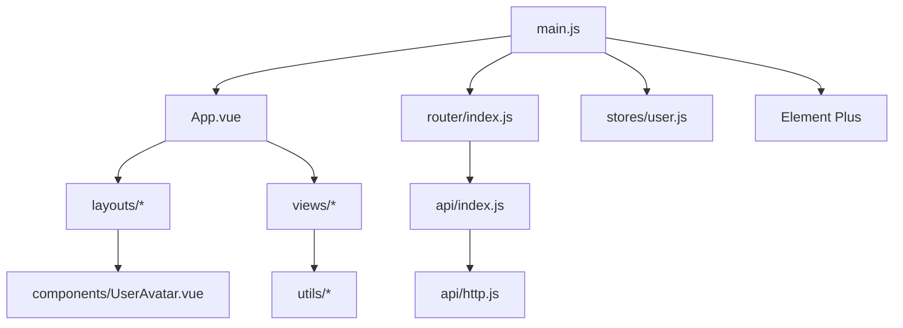
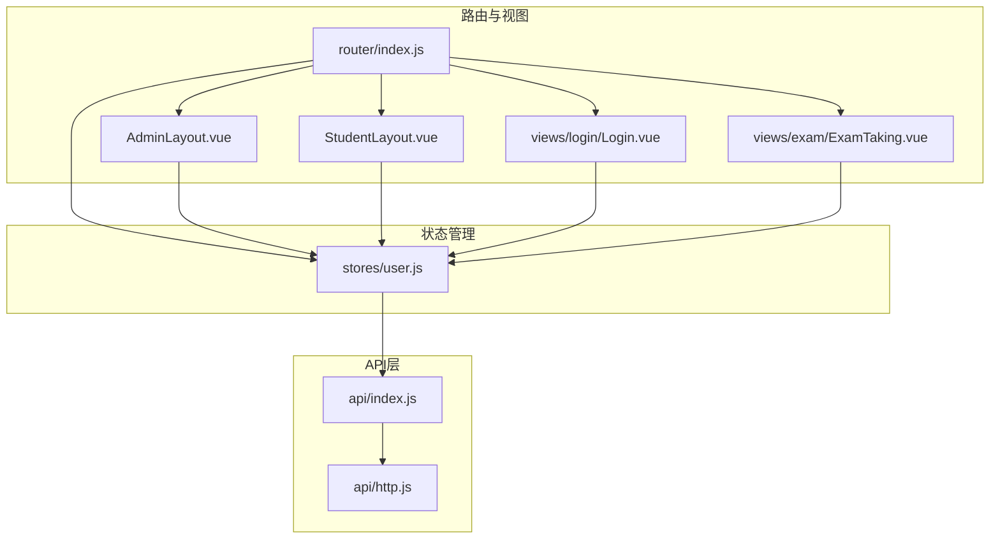
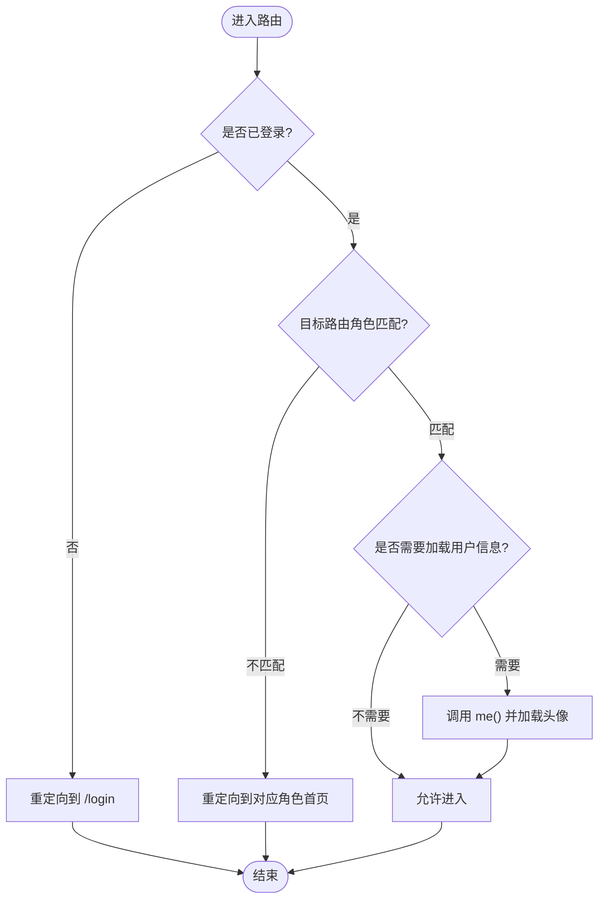
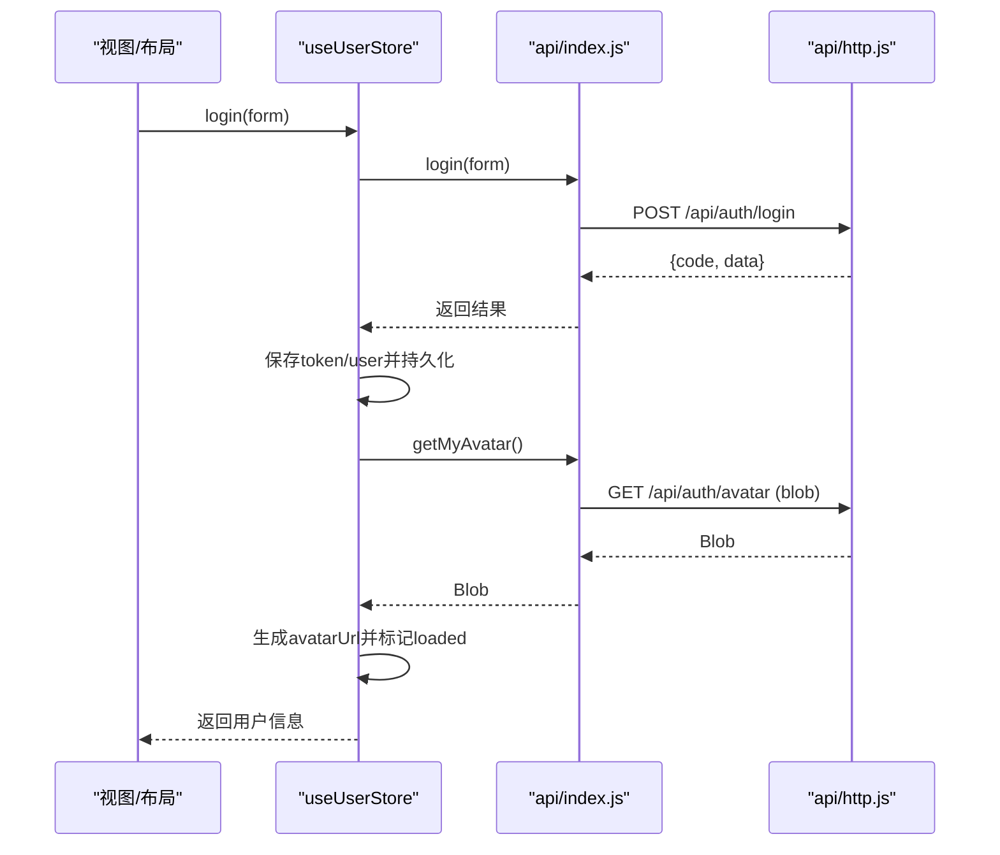
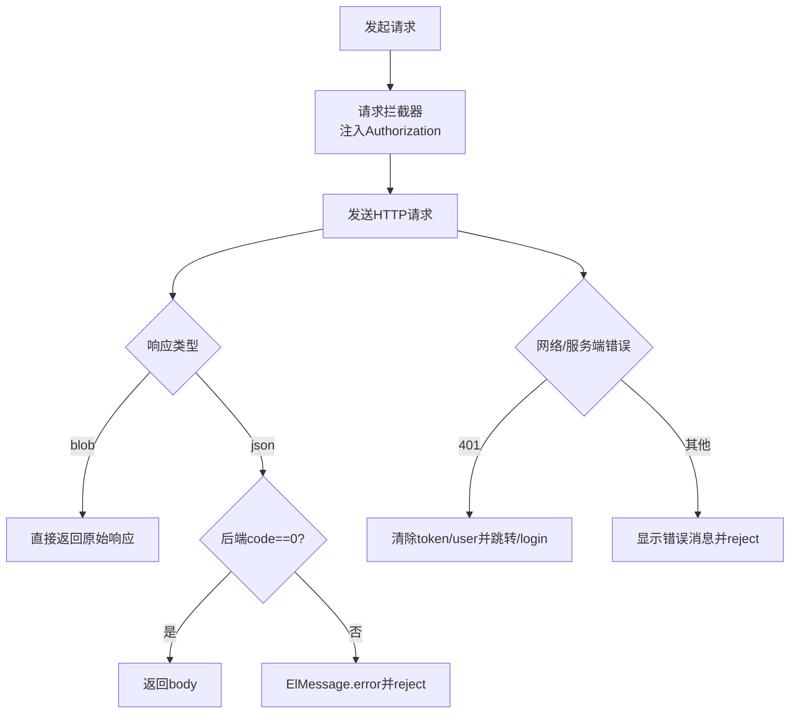
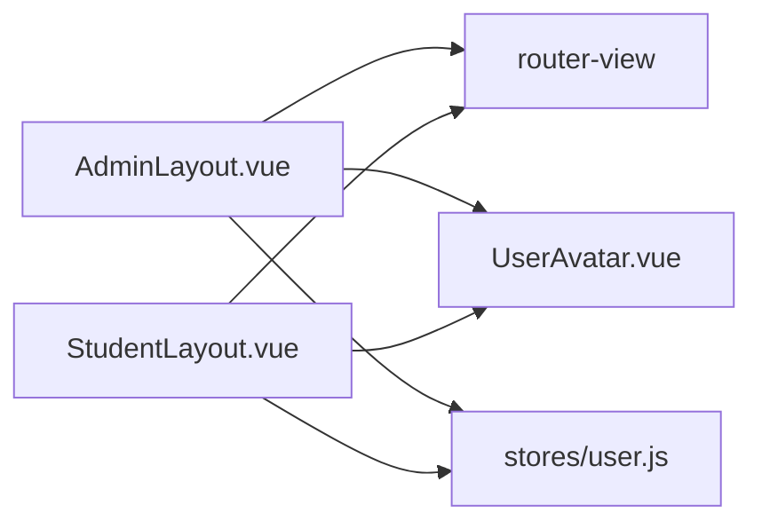
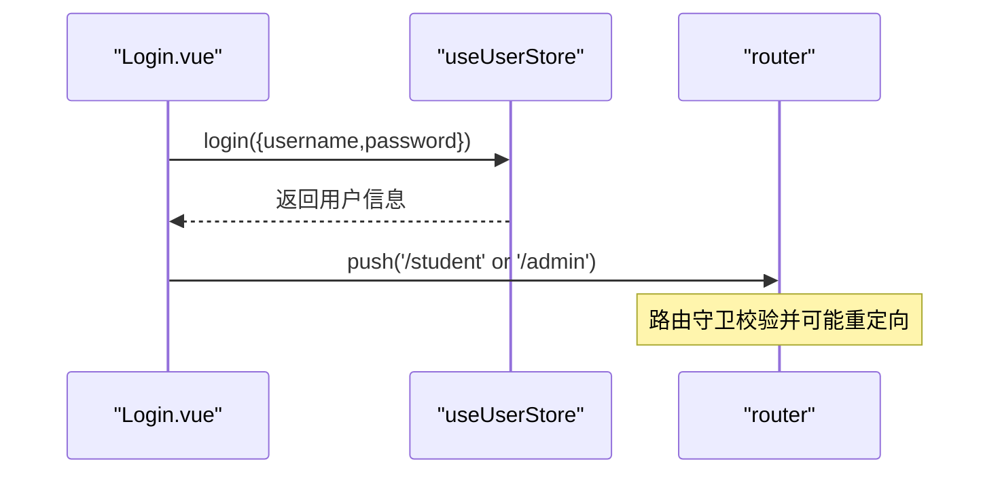
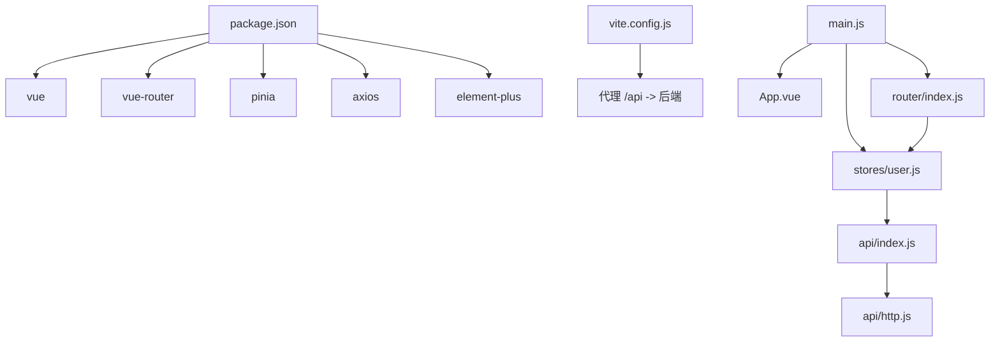

# 前端架构

<cite>
**本文引用的文件**
- [main.js](file://exam-web/src/main.js)
- [App.vue](file://exam-web/src/App.vue)
- [index.js（路由）](file://exam-web/src/router/index.js)
- [user.js（状态管理）](file://exam-web/src/stores/user.js)
- [http.js（HTTP封装）](file://exam-web/src/api/http.js)
- [index.js（API聚合）](file://exam-web/src/api/index.js)
- [AdminLayout.vue](file://exam-web/src/layouts/AdminLayout.vue)
- [StudentLayout.vue](file://exam-web/src/layouts/StudentLayout.vue)
- [UserAvatar.vue](file://exam-web/src/components/UserAvatar.vue)
- [Login.vue](file://exam-web/src/views/login/Login.vue)
- [vite.config.js](file://exam-web/vite.config.js)
- [package.json](file://exam-web/package.json)
- [styles.css](file://exam-web/src/styles.css)
- [download.js](file://exam-web/src/utils/download.js)
- [questionTypes.js](file://exam-web/src/utils/questionTypes.js)
</cite>

## 目录
1. [简介](#简介)
2. [项目结构](#项目结构)
3. [核心组件](#核心组件)
4. [架构总览](#架构总览)
5. [详细组件分析](#详细组件分析)
6. [依赖关系分析](#依赖关系分析)
7. [性能考虑](#性能考虑)
8. [故障排查指南](#故障排查指南)
9. [结论](#结论)
10. [附录](#附录)

## 简介
本文件面向Vue 3前端应用，系统性阐述整体架构与实现要点：组件化组织、路由与权限控制、基于Pinia的状态管理与数据流、前后端通信机制（请求拦截器与错误处理），以及模块依赖关系图。目标是帮助开发者快速理解并高效扩展该考试系统的前端部分。

## 项目结构
前端采用Vite + Vue 3构建，使用Element Plus作为UI库，Pinia进行状态管理，vue-router进行路由与权限控制。主要目录职责如下：
- src/main.js：应用入口，注册Pinia、Router、Element Plus及全局图标，挂载根组件。
- src/App.vue：根组件，仅包含路由视图出口。
- src/router/index.js：路由定义与全局前置守卫，实现登录态校验与角色路由隔离。
- src/stores/user.js：用户状态管理，负责登录、登出、头像加载与持久化。
- src/api/http.js：Axios封装，统一请求头注入、响应体处理与错误提示。
- src/api/index.js：按后端Controller路径组织的API函数集合。
- src/layouts/*：布局组件，区分教师/管理员与学生端。
- src/components/*：通用组件，如头像组件。
- src/views/*：页面级组件，按角色与功能划分。
- src/utils/*：工具函数，如下载、题型常量等。
- vite.config.js：开发服务器代理配置，将/api转发至后端。
- package.json：依赖声明与脚本命令。
- src/styles.css：全局样式变量与基础样式。

图表来源
- [main.js:1-23](file://exam-web/src/main.js#L1-L23)
- [App.vue:1-4](file://exam-web/src/App.vue#L1-L4)
- [index.js（路由）:1-67](file://exam-web/src/router/index.js#L1-L67)
- [user.js（状态管理）:1-98](file://exam-web/src/stores/user.js#L1-L98)
- [index.js（API聚合）:1-82](file://exam-web/src/api/index.js#L1-L82)
- [http.js（HTTP封装）:1-47](file://exam-web/src/api/http.js#L1-L47)

章节来源
- [main.js:1-23](file://exam-web/src/main.js#L1-L23)
- [package.json:1-25](file://exam-web/package.json#L1-L25)
- [vite.config.js:1-16](file://exam-web/vite.config.js#L1-L16)

## 核心组件
- 应用入口与插件注册：在入口中创建Vue应用实例，安装Pinia、Router、Element Plus，并全局注册图标组件。
- 根组件：通过路由视图渲染当前路由对应的页面或布局。
- 路由与权限：集中式路由表，按角色划分/admin与/student子路由；全局前置守卫处理未登录跳转、角色越权拦截与头像预加载。
- 状态管理：Pinia store维护token、用户信息、头像URL与加载状态；提供登录、获取当前用户、头像上传与清理、退出等方法；支持本地持久化。
- HTTP封装：Axios实例统一baseURL与超时；请求拦截器自动附加Authorization；响应拦截器对业务码非0与网络异常进行统一处理，并在401时清除本地态并跳转登录。
- API聚合：按后端Controller路径导出函数，便于页面调用；对blob类型响应单独设置responseType与validateStatus。
- 布局组件：教师/管理员侧边栏+顶部用户信息；学生端顶部导航+主内容区；均集成头像与退出逻辑。
- 通用组件：头像组件支持点击选择图片并触发上传流程，展示占位首字。
- 工具函数：下载Blob文件、安全文件名处理、题型常量与判断方法。

章节来源
- [index.js（路由）:1-67](file://exam-web/src/router/index.js#L1-L67)
- [user.js（状态管理）:1-98](file://exam-web/src/stores/user.js#L1-L98)
- [http.js（HTTP封装）:1-47](file://exam-web/src/api/http.js#L1-L47)
- [index.js（API聚合）:1-82](file://exam-web/src/api/index.js#L1-L82)
- [AdminLayout.vue:1-187](file://exam-web/src/layouts/AdminLayout.vue#L1-L187)
- [StudentLayout.vue:1-58](file://exam-web/src/layouts/StudentLayout.vue#L1-L58)
- [UserAvatar.vue:1-54](file://exam-web/src/components/UserAvatar.vue#L1-L54)
- [download.js:1-52](file://exam-web/src/utils/download.js#L1-L52)
- [questionTypes.js:1-11](file://exam-web/src/utils/questionTypes.js#L1-L11)

## 架构总览
前端以“路由驱动视图、Store驱动状态、API层解耦后端”的三层结构组织。路由根据角色分流到不同布局与页面；Store集中管理登录态与用户信息，并通过API层发起请求；HTTP层统一处理鉴权与错误；布局组件承载公共区域与导航；页面组件聚焦业务交互。

图表来源
- [index.js（路由）:1-67](file://exam-web/src/router/index.js#L1-L67)
- [AdminLayout.vue:1-187](file://exam-web/src/layouts/AdminLayout.vue#L1-L187)
- [StudentLayout.vue:1-58](file://exam-web/src/layouts/StudentLayout.vue#L1-L58)
- [Login.vue:1-91](file://exam-web/src/views/login/Login.vue#L1-L91)
- [user.js（状态管理）:1-98](file://exam-web/src/stores/user.js#L1-L98)
- [index.js（API聚合）:1-82](file://exam-web/src/api/index.js#L1-L82)
- [http.js（HTTP封装）:1-47](file://exam-web/src/api/http.js#L1-L47)

## 详细组件分析

### 路由与权限控制
- 路由组织：/admin为教师与管理员域，/student为学生域，/exam/:id为全屏答题页（无侧边栏）。
- 权限策略：
  - 未登录访问任何受保护路由均重定向至/login。
  - 进入/login时若已登录则跳转homePath（根据角色返回/student或/admin）。
  - 角色越权拦截：学生不能进入/admin，教师不能进入/student与答题页。
  - 首次进入需要拉取当前用户信息并加载头像。
- 懒加载：路由组件按需import，减少首屏体积。

图表来源
- [index.js（路由）:1-67](file://exam-web/src/router/index.js#L1-L67)
- [user.js（状态管理）:1-98](file://exam-web/src/stores/user.js#L1-L98)

章节来源
- [index.js（路由）:1-67](file://exam-web/src/router/index.js#L1-L67)

### 状态管理（Pinia）
- 状态字段：token、user、avatarUrl、avatarLoaded。
- 计算属性：isAdmin、isTeacher、isStudent、displayName（优先realName）。
- 关键动作：
  - login：调用登录接口，保存token与用户信息，持久化到localStorage，并加载头像。
  - loadMe：刷新用户信息，合并token，持久化并加载头像。
  - loadAvatar：获取头像二进制，生成对象URL并标记hasAvatar，失败时清空。
  - uploadAvatar：校验大小后上传，更新hasAvatar并刷新头像。
  - logout：清理本地态与头像URL。
  - homePath：根据角色决定默认首页。
- 持久化：token与user（不含敏感字段）写入localStorage，保证刷新后保持登录态。

图表来源
- [user.js（状态管理）:1-98](file://exam-web/src/stores/user.js#L1-L98)
- [index.js（API聚合）:1-82](file://exam-web/src/api/index.js#L1-L82)
- [http.js（HTTP封装）:1-47](file://exam-web/src/api/http.js#L1-L47)

章节来源
- [user.js（状态管理）:1-98](file://exam-web/src/stores/user.js#L1-L98)

### HTTP封装与错误处理
- 请求拦截器：从localStorage读取token并注入Authorization头。
- 响应拦截器：
  - 对blob类型直接放行，避免被解析为JSON。
  - 对普通响应检查后端统一Result.code，非0时弹出错误并reject。
  - 捕获网络错误与401：清除本地态并跳转登录；其他错误统一提示。
- 统一基地址与超时：baseURL为/，由Vite代理转发到后端；超时时间合理设置。

图表来源
- [http.js（HTTP封装）:1-47](file://exam-web/src/api/http.js#L1-L47)

章节来源
- [http.js（HTTP封装）:1-47](file://exam-web/src/api/http.js#L1-L47)

### 布局组件
- AdminLayout.vue：左侧菜单+顶部用户信息与退出按钮；根据当前路由高亮菜单项；仅在管理员可见的菜单项通过条件渲染控制。
- StudentLayout.vue：顶部导航（待考/考试、我的成绩、知识点掌握）、用户信息与退出；主内容区承载学生端页面。
- 两者均在mounted时尝试加载头像，确保登录后头像及时显示。

图表来源
- [AdminLayout.vue:1-187](file://exam-web/src/layouts/AdminLayout.vue#L1-L187)
- [StudentLayout.vue:1-58](file://exam-web/src/layouts/StudentLayout.vue#L1-L58)
- [UserAvatar.vue:1-54](file://exam-web/src/components/UserAvatar.vue#L1-L54)
- [user.js（状态管理）:1-98](file://exam-web/src/stores/user.js#L1-L98)

章节来源
- [AdminLayout.vue:1-187](file://exam-web/src/layouts/AdminLayout.vue#L1-L187)
- [StudentLayout.vue:1-58](file://exam-web/src/layouts/StudentLayout.vue#L1-L58)

### 通用组件与工具
- UserAvatar.vue：可点击更换头像，上传前无额外校验（大小校验在store中完成），支持多种尺寸与占位首字。
- download.js：封装Blob下载、文件名解析与安全过滤，兼容后端返回JSON错误时的提示。
- questionTypes.js：集中题型常量与判断方法，保证前后端一致。

章节来源
- [UserAvatar.vue:1-54](file://exam-web/src/components/UserAvatar.vue#L1-L54)
- [download.js:1-52](file://exam-web/src/utils/download.js#L1-L52)
- [questionTypes.js:1-11](file://exam-web/src/utils/questionTypes.js#L1-L11)

### 登录流程
- 登录页提交表单，调用store.login，成功后根据角色跳转到对应首页。
- 路由守卫确保未登录访问受保护路由时重定向到登录页。

图表来源
- [Login.vue:1-91](file://exam-web/src/views/login/Login.vue#L1-L91)
- [user.js（状态管理）:1-98](file://exam-web/src/stores/user.js#L1-L98)
- [index.js（路由）:1-67](file://exam-web/src/router/index.js#L1-L67)

章节来源
- [Login.vue:1-91](file://exam-web/src/views/login/Login.vue#L1-L91)

## 依赖关系分析
- 构建与运行：Vite作为构建工具，开发端口与代理配置在vite.config.js中，/api请求转发到后端服务。
- 运行时依赖：Vue 3、vue-router、pinia、axios、element-plus及其图标库、echarts用于数据分析。
- 模块耦合：
  - 路由依赖store进行权限判断。
  - 布局与页面依赖store进行用户信息展示与操作。
  - store依赖API层进行数据交互。
  - API层依赖HTTP封装进行统一请求与错误处理。
  - 工具函数被多处复用，降低重复代码。

图表来源
- [package.json:1-25](file://exam-web/package.json#L1-L25)
- [vite.config.js:1-16](file://exam-web/vite.config.js#L1-L16)
- [main.js:1-23](file://exam-web/src/main.js#L1-L23)
- [index.js（路由）:1-67](file://exam-web/src/router/index.js#L1-L67)
- [user.js（状态管理）:1-98](file://exam-web/src/stores/user.js#L1-L98)
- [index.js（API聚合）:1-82](file://exam-web/src/api/index.js#L1-L82)
- [http.js（HTTP封装）:1-47](file://exam-web/src/api/http.js#L1-L47)

章节来源
- [package.json:1-25](file://exam-web/package.json#L1-L25)
- [vite.config.js:1-16](file://exam-web/vite.config.js#L1-L16)

## 性能考虑
- 路由懒加载：页面组件按需引入，减少首屏包体积。
- 头像资源优化：头像以Blob形式获取并转为对象URL，避免多次请求；上传前限制文件大小，减少无效传输。
- 请求去抖与重试：可在高频操作处增加防抖与重试策略（例如搜索、分页加载）。
- 静态资源缓存：利用浏览器缓存与CDN加速静态资源。
- 列表与大数据：长列表建议使用虚拟滚动或分页加载，避免一次性渲染过多节点。
- 构建优化：按需引入Element Plus组件与图标，减少打包体积。

[本节为通用建议，无需具体文件引用]

## 故障排查指南
- 401未授权：
  - 现象：请求返回401，自动清除本地态并跳转登录。
  - 排查：确认token是否存在且有效；检查后端JWT验证；查看请求头是否携带Authorization。
  - 相关实现：响应拦截器在401时清理本地态并重定向。
- 业务错误提示：
  - 现象：后端返回code非0，前端弹出错误消息。
  - 排查：查看后端Result.message；确认请求参数是否正确。
  - 相关实现：响应拦截器对非0业务码进行统一提示。
- 头像无法加载：
  - 现象：头像不显示或一直加载中。
  - 排查：确认后端返回是否为有效的图片Blob；检查getMyAvatar的validateStatus配置；查看store中的loadAvatar逻辑。
- 下载失败：
  - 现象：下载的文件名错误或内容为空。
  - 排查：检查后端Content-Disposition；使用download.js中的文件名解析与安全过滤；确认响应类型为blob。
- 路由权限问题：
  - 现象：学生进入/admin或教师进入/student被重定向。
  - 排查：检查store.user.role与路由守卫逻辑；确认登录成功后的homePath是否正确。

章节来源
- [http.js（HTTP封装）:1-47](file://exam-web/src/api/http.js#L1-L47)
- [user.js（状态管理）:1-98](file://exam-web/src/stores/user.js#L1-L98)
- [index.js（路由）:1-67](file://exam-web/src/router/index.js#L1-L67)
- [download.js:1-52](file://exam-web/src/utils/download.js#L1-L52)

## 结论
该前端应用采用清晰的组件化与分层架构：路由负责导航与权限，Store集中管理状态与业务流程，API层解耦后端接口，HTTP层统一处理鉴权与错误。布局组件按角色分离，通用组件与工具函数提升复用性。整体设计易于扩展与维护，适合持续迭代与团队协作。

[本节为总结性内容，无需具体文件引用]

## 附录
- 全局样式变量：在styles.css中定义主题色、边框、文本颜色等，便于统一风格。
- 开发环境代理：vite.config.js中将/api请求代理到后端，解决跨域问题。
- 依赖清单：package.json列出所有运行时与开发时依赖，便于环境搭建与版本管理。

章节来源
- [styles.css:1-54](file://exam-web/src/styles.css#L1-L54)
- [vite.config.js:1-16](file://exam-web/vite.config.js#L1-L16)
- [package.json:1-25](file://exam-web/package.json#L1-L25)