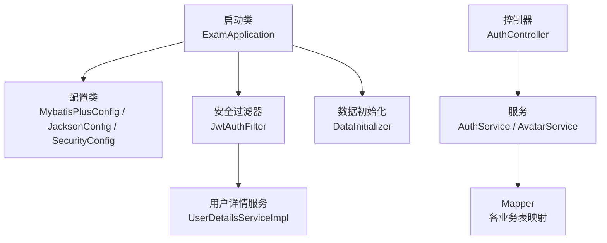
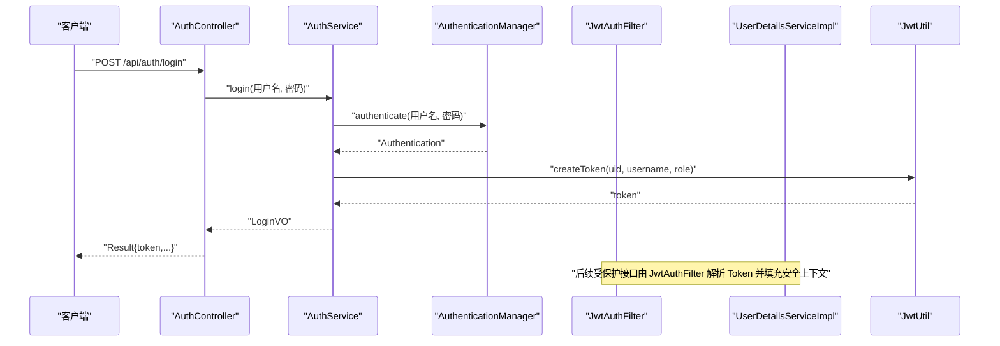
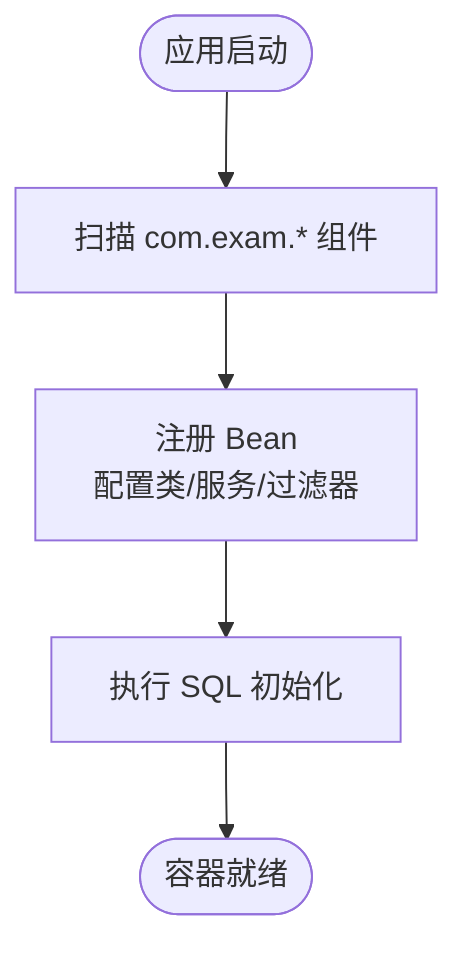
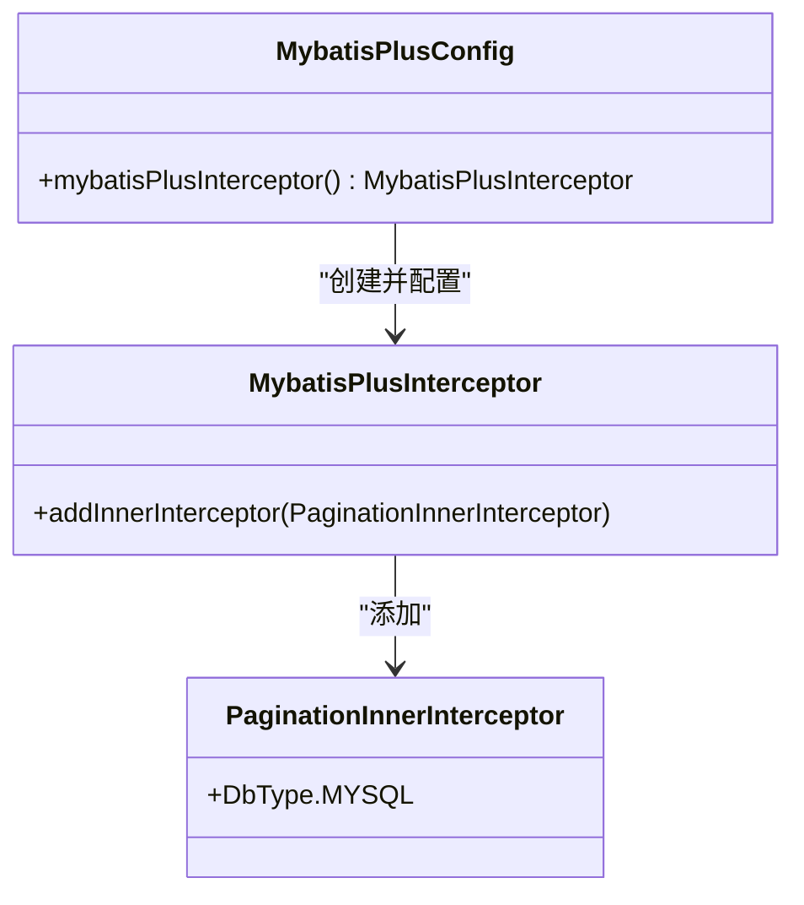
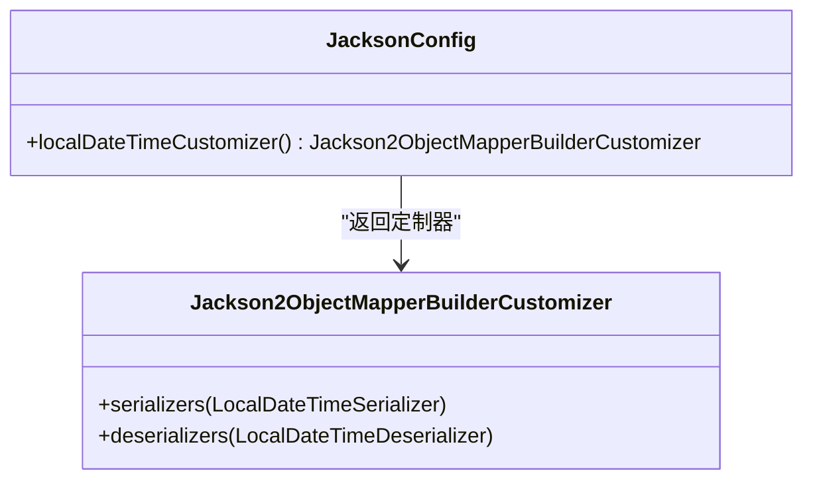
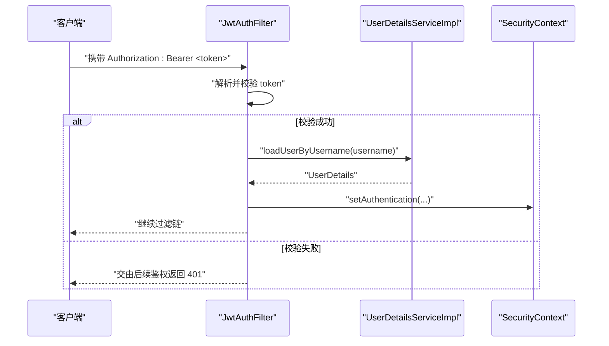
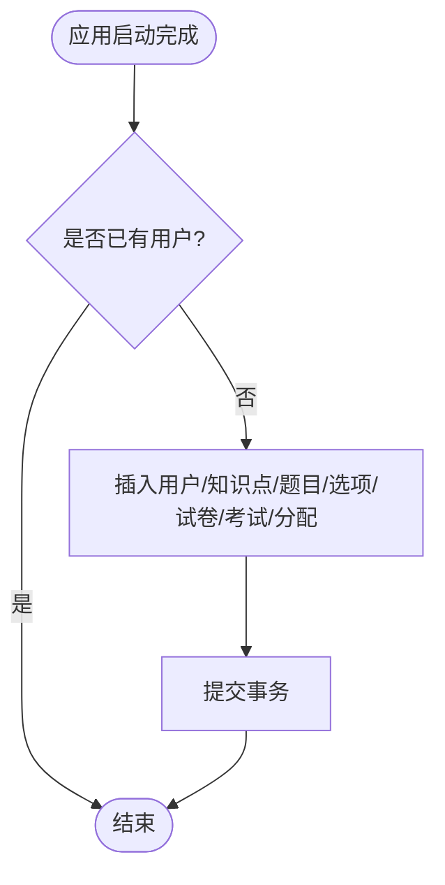
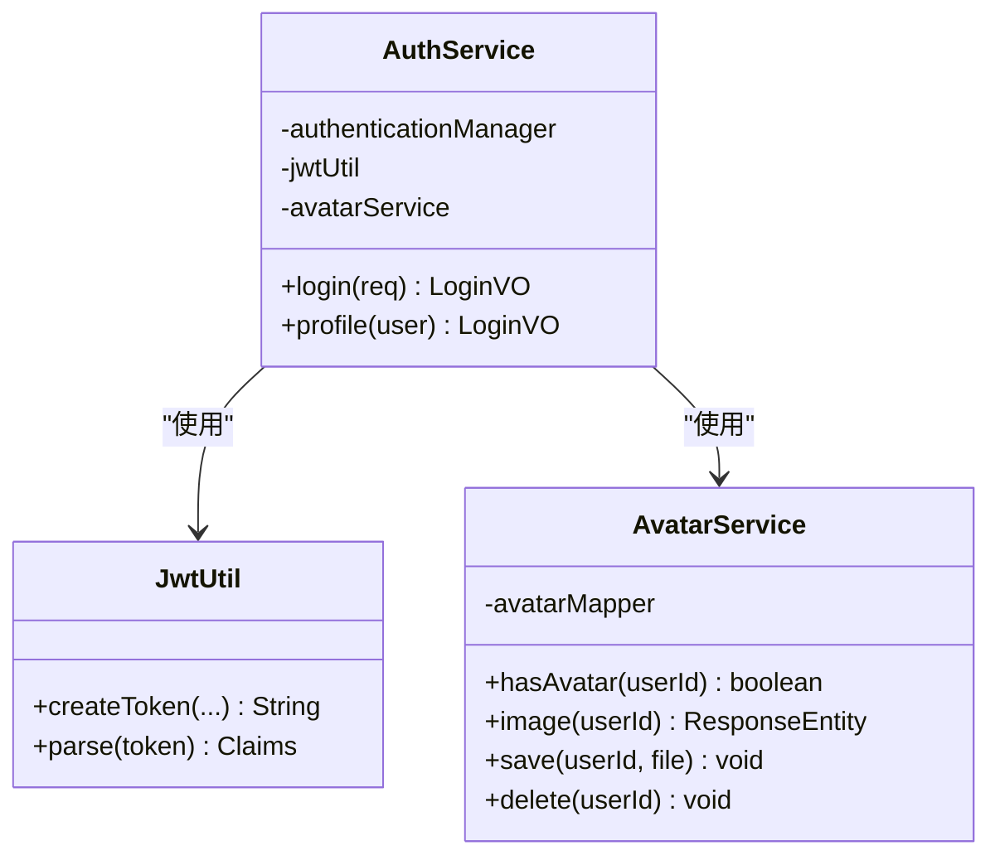
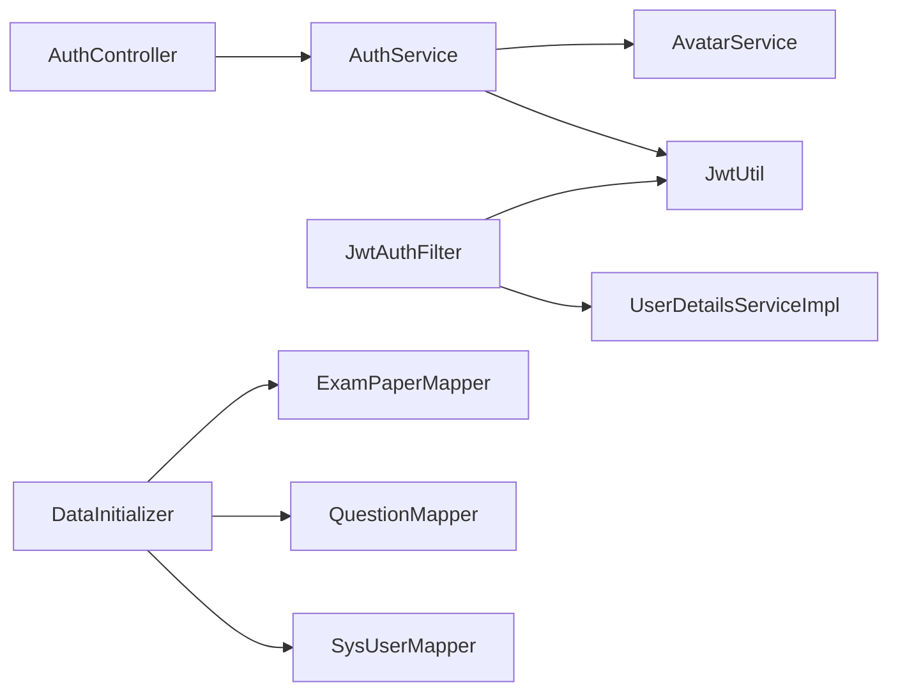

# 依赖注入与IoC容器

<cite>
**本文引用的文件**
- [ExamApplication.java](file://exam-server/src/main/java/com/exam/ExamApplication.java)
- [application.yml](file://exam-server/src/main/resources/application.yml)
- [MybatisPlusConfig.java](file://exam-server/src/main/java/com/exam/config/MybatisPlusConfig.java)
- [JacksonConfig.java](file://exam-server/src/main/java/com/exam/config/JacksonConfig.java)
- [SecurityConfig.java](file://exam-server/src/main/java/com/exam/config/SecurityConfig.java)
- [DataInitializer.java](file://exam-server/src/main/java/com/exam/config/DataInitializer.java)
- [JwtAuthFilter.java](file://exam-server/src/main/java/com/exam/security/JwtAuthFilter.java)
- [JwtUtil.java](file://exam-server/src/main/java/com/exam/security/JwtUtil.java)
- [UserDetailsServiceImpl.java](file://exam-server/src/main/java/com/exam/security/UserDetailsServiceImpl.java)
- [AuthService.java](file://exam-server/src/main/java/com/exam/service/AuthService.java)
- [AvatarService.java](file://exam-server/src/main/java/com/exam/service/AvatarService.java)
- [GlobalExceptionHandler.java](file://exam-server/src/main/java/com/exam/common/GlobalExceptionHandler.java)
</cite>

## 目录
1. [简介](#简介)
2. [项目结构](#项目结构)
3. [核心组件](#核心组件)
4. [架构总览](#架构总览)
5. [详细组件分析](#详细组件分析)
6. [依赖关系分析](#依赖关系分析)
7. [性能考量](#性能考量)
8. [故障排查指南](#故障排查指南)
9. [结论](#结论)
10. [附录](#附录)

## 简介
本文件围绕 Spring IoC 容器在考试系统中的角色与管理机制展开，系统阐述 Bean 的生命周期、作用域管理、依赖注入方式，以及自定义配置类（MyBatis Plus、Jackson、数据初始化）的编写方法。同时说明组件扫描与自动装配的工作原理，给出最佳实践、常见问题与调试技巧，并配合时序图、流程图帮助理解。

## 项目结构
- 启动入口：Spring Boot 应用通过注解启用自动配置与组件扫描，并扫描 MyBatis Mapper。
- 配置层：提供 MyBatis Plus 分页拦截器、Jackson 时间序列化、安全策略与跨域等配置。
- 安全层：基于 Spring Security + JWT 实现无状态认证，过滤器解析 Token 并写入安全上下文。
- 业务层：服务类通过构造器注入依赖，完成登录、头像等业务逻辑。
- 数据初始化：应用启动时按需写入演示数据，保证本地可运行。

**图表来源**
- [ExamApplication.java:1-17](file://exam-server/src/main/java/com/exam/ExamApplication.java#L1-L17)
- [MybatisPlusConfig.java:1-19](file://exam-server/src/main/java/com/exam/config/MybatisPlusConfig.java#L1-L19)
- [JacksonConfig.java:1-24](file://exam-server/src/main/java/com/exam/config/JacksonConfig.java#L1-L24)
- [SecurityConfig.java:1-90](file://exam-server/src/main/java/com/exam/config/SecurityConfig.java#L1-L90)
- [JwtAuthFilter.java:1-52](file://exam-server/src/main/java/com/exam/security/JwtAuthFilter.java#L1-L52)
- [UserDetailsServiceImpl.java:1-41](file://exam-server/src/main/java/com/exam/security/UserDetailsServiceImpl.java#L1-L41)
- [DataInitializer.java:1-268](file://exam-server/src/main/java/com/exam/config/DataInitializer.java#L1-L268)

**章节来源**
- [ExamApplication.java:1-17](file://exam-server/src/main/java/com/exam/ExamApplication.java#L1-L17)
- [application.yml:1-42](file://exam-server/src/main/resources/application.yml#L1-L42)

## 核心组件
- IoC 容器与自动装配
  - 启动类使用注解开启自动配置与组件扫描，并指定 Mapper 包扫描路径。
  - 配置文件激活不同环境 profile，统一设置编码、Jackson 时区与日期格式、SQL 初始化策略等。
- 自定义配置
  - MyBatis Plus：注册分页拦截器，支持 MySQL 分页查询。
  - Jackson：定制 LocalDateTime 的序列化和反序列化格式。
  - Security：关闭 Session、配置 CORS、定义鉴权规则、注册密码编码器与 AuthenticationManager。
- 数据初始化
  - 实现 ApplicationRunner，首次启动且库为空时写入演示数据（用户、知识点、题目、试卷、考试分配）。

**章节来源**
- [ExamApplication.java:1-17](file://exam-server/src/main/java/com/exam/ExamApplication.java#L1-L17)
- [application.yml:1-42](file://exam-server/src/main/resources/application.yml#L1-L42)
- [MybatisPlusConfig.java:1-19](file://exam-server/src/main/java/com/exam/config/MybatisPlusConfig.java#L1-L19)
- [JacksonConfig.java:1-24](file://exam-server/src/main/java/com/exam/config/JacksonConfig.java#L1-L24)
- [SecurityConfig.java:1-90](file://exam-server/src/main/java/com/exam/config/SecurityConfig.java#L1-L90)
- [DataInitializer.java:1-268](file://exam-server/src/main/java/com/exam/config/DataInitializer.java#L1-L268)

## 架构总览
下图展示请求从进入 Web 层到安全校验、再到服务层的调用链，体现 IoC 容器如何装配并协调各组件。

**图表来源**
- [AuthController.java:1-65](file://exam-server/src/main/java/com/exam/controller/AuthController.java#L1-L65)
- [AuthService.java:1-51](file://exam-server/src/main/java/com/exam/service/AuthService.java#L1-L51)
- [JwtAuthFilter.java:1-52](file://exam-server/src/main/java/com/exam/security/JwtAuthFilter.java#L1-L52)
- [UserDetailsServiceImpl.java:1-41](file://exam-server/src/main/java/com/exam/security/UserDetailsServiceImpl.java#L1-L41)
- [JwtUtil.java:1-44](file://exam-server/src/main/java/com/exam/security/JwtUtil.java#L1-L44)

## 详细组件分析

### 组件A：IoC 容器与组件扫描
- 启动类通过注解启用自动配置与组件扫描，并指定 Mapper 扫描包，使所有 Mapper 成为 Bean 供服务注入。
- 配置文件集中管理端口、字符集、Jackson 时区与日期格式、SQL 初始化策略等，便于多环境切换。

**图表来源**
- [ExamApplication.java:1-17](file://exam-server/src/main/java/com/exam/ExamApplication.java#L1-L17)
- [application.yml:1-42](file://exam-server/src/main/resources/application.yml#L1-L42)

**章节来源**
- [ExamApplication.java:1-17](file://exam-server/src/main/java/com/exam/ExamApplication.java#L1-L17)
- [application.yml:1-42](file://exam-server/src/main/resources/application.yml#L1-L42)

### 组件B：MyBatis Plus 配置（分页）
- 通过配置类注册拦截器，添加分页内插器并指定数据库类型为 MySQL，从而在 Service/Mapper 层使用分页能力时无需手写分页 SQL。
- 该 Bean 由 IoC 容器管理，生命周期随应用启动创建、随应用停止销毁。

**图表来源**
- [MybatisPlusConfig.java:1-19](file://exam-server/src/main/java/com/exam/config/MybatisPlusConfig.java#L1-L19)

**章节来源**
- [MybatisPlusConfig.java:1-19](file://exam-server/src/main/java/com/exam/config/MybatisPlusConfig.java#L1-L19)

### 组件C：Jackson 序列化配置（LocalDateTime）
- 通过自定义 Customizer 为 ObjectMapper 注册 LocalDateTime 的序列化与反序列化器，统一前后端时间格式。
- 该 Bean 由 Spring Boot 自动发现并应用到全局 JSON 处理。

**图表来源**
- [JacksonConfig.java:1-24](file://exam-server/src/main/java/com/exam/config/JacksonConfig.java#L1-L24)

**章节来源**
- [JacksonConfig.java:1-24](file://exam-server/src/main/java/com/exam/config/JacksonConfig.java#L1-L24)

### 组件D：安全与认证流程（Spring Security + JWT）
- 安全配置禁用 Session，启用 CORS，定义匿名与受保护路径，注册异常处理器与 JWT 过滤器。
- 过滤器在每个请求中解析 Authorization 头中的 Token，校验后加载用户详情并写入安全上下文。
- 用户详情服务根据用户名查询用户信息，学生角色额外关联学生主键。

**图表来源**
- [SecurityConfig.java:1-90](file://exam-server/src/main/java/com/exam/config/SecurityConfig.java#L1-L90)
- [JwtAuthFilter.java:1-52](file://exam-server/src/main/java/com/exam/security/JwtAuthFilter.java#L1-L52)
- [UserDetailsServiceImpl.java:1-41](file://exam-server/src/main/java/com/exam/security/UserDetailsServiceImpl.java#L1-L41)

**章节来源**
- [SecurityConfig.java:1-90](file://exam-server/src/main/java/com/exam/config/SecurityConfig.java#L1-L90)
- [JwtAuthFilter.java:1-52](file://exam-server/src/main/java/com/exam/security/JwtAuthFilter.java#L1-L52)
- [UserDetailsServiceImpl.java:1-41](file://exam-server/src/main/java/com/exam/security/UserDetailsServiceImpl.java#L1-L41)

### 组件E：数据初始化（ApplicationRunner）
- 实现 ApplicationRunner，在应用启动后执行；若库中已有用户则跳过，否则批量插入演示数据（用户、知识点、题目、选项、试卷、考试及分配）。
- 使用事务注解确保一致性；通过 Mapper 注入访问数据库。

**图表来源**
- [DataInitializer.java:1-268](file://exam-server/src/main/java/com/exam/config/DataInitializer.java#L1-L268)

**章节来源**
- [DataInitializer.java:1-268](file://exam-server/src/main/java/com/exam/config/DataInitializer.java#L1-L268)

### 组件F：服务层依赖注入示例（构造器注入）
- 服务类通过构造器注入所需依赖（如 Mapper、工具类），避免字段注入带来的循环依赖风险，提升可测试性。
- 典型场景包括登录认证、头像存取等。

**图表来源**
- [AuthService.java:1-51](file://exam-server/src/main/java/com/exam/service/AuthService.java#L1-L51)
- [AvatarService.java:1-101](file://exam-server/src/main/java/com/exam/service/AvatarService.java#L1-L101)
- [JwtUtil.java:1-44](file://exam-server/src/main/java/com/exam/security/JwtUtil.java#L1-L44)

**章节来源**
- [AuthService.java:1-51](file://exam-server/src/main/java/com/exam/service/AuthService.java#L1-L51)
- [AvatarService.java:1-101](file://exam-server/src/main/java/com/exam/service/AvatarService.java#L1-L101)

## 依赖关系分析
- 组件耦合
  - 控制器依赖服务；服务通过构造器注入 Mapper、工具与安全相关组件。
  - 安全过滤器依赖用户详情服务与 JWT 工具，形成“请求 -> 过滤器 -> 安全上下文”的链路。
- 外部依赖
  - MyBatis Plus 分页插件、Spring Security、JWT 库、Jackson 时间类型支持。
- 潜在循环依赖
  - 当前设计以构造器注入为主，降低循环依赖风险；如需新增双向依赖，建议引入接口或事件解耦。

**图表来源**
- [AuthController.java:1-65](file://exam-server/src/main/java/com/exam/controller/AuthController.java#L1-L65)
- [AuthService.java:1-51](file://exam-server/src/main/java/com/exam/service/AuthService.java#L1-L51)
- [JwtAuthFilter.java:1-52](file://exam-server/src/main/java/com/exam/security/JwtAuthFilter.java#L1-L52)
- [UserDetailsServiceImpl.java:1-41](file://exam-server/src/main/java/com/exam/security/UserDetailsServiceImpl.java#L1-L41)
- [DataInitializer.java:1-268](file://exam-server/src/main/java/com/exam/config/DataInitializer.java#L1-L268)

**章节来源**
- [AuthService.java:1-51](file://exam-server/src/main/java/com/exam/service/AuthService.java#L1-L51)
- [JwtAuthFilter.java:1-52](file://exam-server/src/main/java/com/exam/security/JwtAuthFilter.java#L1-L52)
- [DataInitializer.java:1-268](file://exam-server/src/main/java/com/exam/config/DataInitializer.java#L1-L268)

## 性能考量
- 分页查询：通过 MyBatis Plus 分页拦截器减少全量数据拉取，降低内存与网络开销。
- 无状态认证：基于 JWT 的无状态会话减少服务器端 Session 存储压力。
- 资源限制：配置文件限制上传文件大小，避免大文件导致内存溢出。
- 序列化优化：统一时间格式减少前端解析成本。

[本节为通用指导，不直接分析具体文件]

## 故障排查指南
- 认证失败
  - 检查 Authorization 头是否正确携带 Bearer Token。
  - 确认 JWT 密钥与过期时间配置正确。
  - 查看全局异常处理器对未认证与权限不足的统一响应。
- 参数校验失败
  - 全局异常处理器会捕获参数绑定错误并返回友好提示。
- 数据初始化问题
  - 若首次启动未写入演示数据，检查数据库连接与 SQL 初始化配置。
  - 若已存在用户，初始化将跳过；可通过清空数据库重新验证。

**章节来源**
- [GlobalExceptionHandler.java:1-61](file://exam-server/src/main/java/com/exam/common/GlobalExceptionHandler.java#L1-L61)
- [application.yml:1-42](file://exam-server/src/main/resources/application.yml#L1-L42)
- [DataInitializer.java:1-268](file://exam-server/src/main/java/com/exam/config/DataInitializer.java#L1-L268)

## 结论
本项目通过 Spring Boot 的自动装配与组件扫描，结合自定义配置类，构建了清晰的分层架构与稳定的 IoC 容器管理。依赖注入采用构造器注入，提升了可维护性与可测试性；安全与序列化等横切关注点通过配置类统一管理；数据初始化保障本地开发体验。遵循本文的最佳实践与排查建议，可有效提升系统的稳定性与可观测性。

## 附录
- 依赖注入最佳实践
  - 优先使用构造器注入，避免字段注入导致的循环依赖与不可测性。
  - 将横切关注点（序列化、分页、安全）放入独立配置类，保持职责单一。
  - 使用 @Value 注入配置项，避免硬编码敏感信息。
- 常见问题与解决
  - 时间格式不一致：通过 Jackson 定制器统一 LocalDateTime 格式。
  - 跨域问题：在安全配置中声明允许的源、方法与头。
  - 分页无效：确认已注册分页拦截器且数据库类型匹配。
- 调试技巧
  - 观察全局异常处理器返回的 JSON，快速定位错误原因。
  - 通过日志与断点检查过滤器对用户上下文的设置过程。
  - 使用 Swagger 文档验证接口契约与入参约束。

[本节为通用指导，不直接分析具体文件]